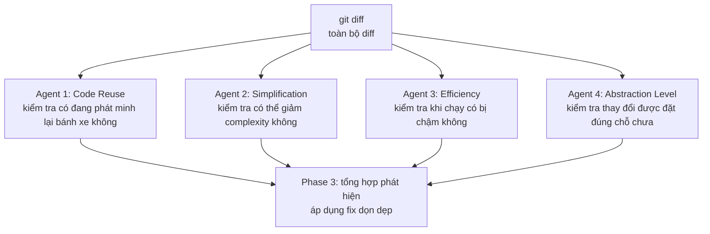

Xin chào, tôi là Tiểu G. Trong Claude Code thực ra có khá nhiều lệnh hữu ích, chẳng hạn như code review, đơn giản hóa code và task định kỳ, nhưng tôi nhận thấy nhiều bạn sử dụng chúng hằng ngày lại không biết, cũng không biết cách dùng.

Nhiều bạn cho rằng chỉ cần dùng Claude Code để hội thoại trực tiếp là đủ, không cần tìm hiểu các lệnh này. Nhưng từ góc nhìn của người đã dùng khá lâu như tôi, bạn vẫn nên tìm hiểu.

Tất nhiên, tìm hiểu không có nghĩa là phải học thuộc lòng các lệnh này. Bạn chỉ cần biết đại khái có những thứ này là đủ! Khi thực sự cần dùng, chỉ cần nhập `/`, rồi chọn từ danh sách lệnh.

> **Ghi chú phiên bản**: Bài viết được biên soạn theo tài liệu chính thức và hành vi của client Claude Code v2.1.218 (2026-07-25). Lệnh được cập nhật rất nhanh, hãy lấy `/help`, danh sách lệnh `/` và trang Commands chính thức làm chuẩn cuối cùng.

## Menu `/` không chỉ có lệnh tích hợp sẵn

Trong Claude Code, khi nhập `/`, bạn sẽ thấy tất cả entry có thể gọi trực tiếp trong môi trường hiện tại. Ngoài các lệnh tích hợp sẵn của Claude Code, tại đây còn liệt kê Bundled Skills, Skills do người dùng tự viết, cùng các lệnh do plugin và MCP Server cung cấp. Những mục cụ thể có thể thấy còn phụ thuộc vào phiên bản, nền tảng, gói dịch vụ và môi trường hiện tại.

[Tài liệu Commands chính thức](https://code.claude.com/docs/en/commands) mô tả phần lớn lệnh tích hợp sẵn là các lệnh có “hành vi được viết trực tiếp trong CLI”, chẳng hạn `/clear`, `/compact`, `/model`, `/diff`, `/context` và `/permissions`. [Bundled Skills](https://code.claude.com/docs/en/slash-commands#bundled-skills) hoạt động dựa trên Prompt: Claude sẽ nạp chỉ thị tương ứng, sau đó gọi tool hoặc tổ chức subagent để hoàn thành task. `/simplify`, `/batch`, `/debug`, `/loop`, `/run`, `/verify`, `/code-review` và `/claude-api` đều thuộc loại này. Bảng lệnh chính thức sẽ đánh dấu `Skill` sau các mục loại này; một số ít khả năng điều phối song song nhiều subagent và chạy ở background được đánh dấu là `Workflow`.

`/review` là lệnh tích hợp sẵn, dùng để thực hiện một lượt review nhanh, chỉ đọc trên GitHub Pull Request; khi không có tham số, lệnh sẽ liệt kê các Open PR có thể chọn trước. Để kiểm tra vấn đề correctness và cơ hội dọn dẹp của diff hiện tại, dùng `/code-review`; để review PR với cường độ có thể điều chỉnh bằng nhiều Agent, thực thi `/code-review <level> <PR number>`. Khi cần review chuyên sâu trên cloud, dùng `/code-review ultra`; `/ultrareview` hiện là alias của lệnh này.

## /simplify: đơn giản hóa và refactor code

Một thay đổi đã có thể chạy bình thường, nhưng bên trong có thể vẫn còn helper trùng lặp, branch quá sâu hoặc business logic đặt sai tầng. Khi đó hãy chạy `/simplify`. Lệnh sẽ kiểm tra thay đổi hiện tại và thử áp dụng các fix thuộc nhóm dọn dẹp.

Từ Claude Code v2.1.154, phía chính thức định vị `/simplify` là **cleanup-only review**. Việc reuse, đơn giản hóa, hiệu quả và tầng abstraction thuộc phạm vi của nó; Bug logic nên giao cho `/code-review`.

### Nó xử lý một thay đổi như thế nào

Khi không có tham số, `/simplify` thường đọc các thay đổi tăng thêm từ `git diff`. Khi workspace không có thay đổi chưa commit, nó sẽ chuyển sang kiểm tra commit gần nhất. Bạn cũng có thể chỉ định tên class, chẳng hạn `/simplify MarketDataService`, để nó tập trung vào toàn bộ file. Phạm vi giá trị cụ thể vẫn lấy hành vi của client phiên bản hiện tại làm chuẩn.

Sau khi nhận được thay đổi, bốn Agent sẽ song song đọc cùng một diff:



Code Reuse Agent trước tiên sẽ tìm implementation có sẵn trong project. Ví dụ, `requireNonBlank()` mới viết bị trùng với `InputValidator.requireNonBlank()`, nó sẽ đề xuất reuse implementation sau. Simplification Agent xử lý các method tương tự, state tạm dư thừa và branch quá sâu; Efficiency Agent sẽ chú ý việc tạo object lặp lại trong loop, container concurrency không cần thiết và tính toán lặp.

Abstraction Level Agent quan tâm đến vị trí đặt code. Business rule nằm trong Controller, validation dùng chung nằm rải rác ở nhiều Service, tool tầng dưới lại phụ thuộc ngược vào business object, đều thuộc nhóm này. Sau khi bốn kết quả trả về, Claude Code sẽ lọc false positive và áp dụng những thay đổi dọn dẹp mà nó đánh giá là an toàn.

> **Cảnh báo rủi ro**: `/simplify` sẽ sửa code nhưng không chịu trách nhiệm đảm bảo business correctness. Với transaction, security, concurrency và flow tiền, trước tiên hãy chạy `/code-review` hoặc `/security-review`, sau đó vẫn phải kiểm tra diff và chạy test.

### Chỉ định hướng cần tập trung

Bạn có thể viết trực tiếp hướng cần tập trung trong tham số:

```bash
/simplify duplicate helpers
/simplify SQL performance
/simplify unnecessary abstraction
/simplify MarketDataService
```

Khi đã biết đại khái vấn đề nằm ở file nào hoặc thuộc loại code smell nào, truyền tham số sẽ dễ nhận được kết quả có trọng tâm hơn so với chạy trống.

### Ví dụ: Spring transaction không có hiệu lực

Ví dụ này đến từ hành vi `/simplify` thời kỳ đầu, khi đó nó chủ động tìm correctness bug hơn. Theo định vị chính thức hiện nay, loại vấn đề này nên giao cho `/code-review` hoặc `/security-review`, sau đó dùng `/simplify` để dọn dẹp và refactor.

Có lần tôi viết một module authentication cho user, tự test thành công và chuẩn bị commit. Theo thói quen, tôi chạy một lượt review command trước, nó lập tức tìm được 6 vấn đề tiềm ẩn; sau khi xác nhận, tất cả đều thực sự tồn tại.


Một trong các vấn đề liên quan đến **Spring transaction không có hiệu lực**, nhiều góc nhìn review đều chỉ vào cùng một đoạn code.

Method bên ngoài của `WatchlistService` trước tiên lấy distributed lock của Redis và thực hiện double-check, sau đó gọi một method `protected` để ghi database:

```java
public void initializeDefaultWatchlist(Long userId) {
    // Distributed lock Redis + double-check (idempotent)
    // ...
    doInitializeDefaultWatchlist(userId);  // gọi nội bộ trong cùng class
    // ...
}

@Transactional(rollbackFor = Exception.class)
protected void doInitializeDefaultWatchlist(Long userId) {
    groupService.save(defaultGroup);        // INSERT group
    stockService.saveBatch(initialStocks);  // INSERT 5 stock
}
```

Đặt `@Transactional` trên method này không giải quyết được vấn đề transaction. Spring mặc định sử dụng proxy-based AOP, việc gọi trực tiếp `doInitializeDefaultWatchlist()` bên trong cùng class sẽ bypass proxy, khiến transaction interceptor không nhận được lần gọi này.

Nếu `saveBatch` ném exception giữa chừng, record group mà `save` đã ghi sẽ không rollback, database sẽ còn lại một group không có stock.

> **Điều kiện tiên quyết**: Với proxy-based AOP mặc định của Spring, việc gọi trực tiếp bên trong cùng class sẽ bypass proxy, nên `@Transactional` không có hiệu lực; nếu dùng AspectJ weaving hoặc gọi qua proxy object thì kết luận sẽ khác.

- **Góc nhìn Quality / correctness** đánh dấu `@Transactional` không có hiệu lực do self-invocation và đánh giá mức độ nghiêm trọng cao.
- **Efficiency Agent** loại trừ khả năng lock TTL không đủ, thu hẹp vấn đề vào việc transaction không có hiệu lực.
- **Code Reuse Agent** xác nhận distributed lock tự viết không có implementation có thể reuse, implementation này hợp lý.

Giải pháp fix được đưa ra khi đó là đổi declarative transaction sang **programmatic transaction**, dùng `TransactionTemplate` để trực tiếp kiểm soát transaction boundary. Các cách fix khác gồm: chuyển transaction method sang một Spring Bean khác, gọi qua proxy object, điều chỉnh transaction boundary ra public method bên ngoài.

```java
@RequiredArgsConstructor
public class WatchlistService {

    private final TransactionTemplate transactionTemplate;

    private void doInitializeDefaultWatchlist(Long userId) {
        transactionTemplate.executeWithoutResult(status -> {
            groupService.save(defaultGroup);
            stockService.saveBatch(initialStocks);
        });
    }
}
```


Lượt scan này còn phát hiện 5 vấn đề khác, bao gồm code reuse, security và efficiency:

| Phát hiện                                                                                                                                          | Agent                | Cách fix                                                                           |
| -------------------------------------------------------------------------------------------------------------------------------------------------- | -------------------- | ---------------------------------------------------------------------------------- |
| Hai Controller mỗi cái tự định nghĩa `requireNonBlank()`, bị trùng với `InputValidator` có sẵn                                                     | Reuse                | Xóa method private, chuyển sang dùng `InputValidator.requireNonBlank()`            |
| Regex của exception handler bị compile lại mỗi lần `replaceAll`, hơn nữa character class không có `+/=`, khiến base64 token không được mask đầy đủ | Quality + Efficiency | Trích xuất thành `static final Pattern`, mở rộng character class để bao phủ base64 |
| Dùng `ConcurrentHashMap` + `@Scheduled` để tự dọn Ticket hết hạn sau 30 giây                                                                       | Efficiency           | Thay bằng Caffeine cache có sẵn của project (tự TTL eviction)                      |
| `Map` local trong method `@Bean` dùng `ConcurrentHashMap`                                                                                          | Efficiency           | Đổi thành `HashMap` (fill trong một thread, không cần concurrency safety)          |
| Comment có typo, cần sửa từ viết sai thành từ đúng                                                                                                 | Quality              | Sửa lại                                                                            |

Kết quả cuối cùng: sửa 5 file, giảm ròng 38 dòng code, fix 6 vấn đề, compile thành công ngay lần đầu.

### Ví dụ: review module được chỉ định

`/simplify` cũng có thể chỉ định class hoặc module cụ thể để review:


```bash
/simplify MarketDataService
```

Trước đây tôi từng chạy một lượt review chuyên biệt trên service dữ liệu thị trường `MarketDataService` của project (khoảng 570 dòng). Class này tổng hợp nhiều data source, cung cấp Caffeine local cache + Redis distributed cache + circuit breaker fallback. Lượt review khi đó tìm được 8 vấn đề, trong đó có hai correctness bug mức độ nghiêm trọng cao. Theo định vị của lệnh hiện nay, loại vấn đề này nên ưu tiên giao cho `/code-review`.

**Bug: chu kỳ `year` bị âm thầm hạ xuống `month`.** Trong method `normalizePeriod` có một switch:

```java
case "year", "yearly", "y" -> "month";  // Bug! Phải là "year"
```

Các chu kỳ khác đều được mapping chính xác (`day → "day"`, `week → "week"`, `month → "month"`), chỉ riêng `year` bị mapping thành `month`. Caller yêu cầu K-line theo năm nhưng thực tế nhận được K-line theo tháng, không có bất kỳ error hoặc cảnh báo nào.

### Khi nào dùng `/simplify`

Trước khi submit PR, hoặc vừa hoàn thành một lượt refactor nhiều file, bạn có thể dùng `/code-review` để kiểm tra logic trước, sau đó để `/simplify` dọn dẹp implementation trùng lặp và complexity cục bộ. Nó sẽ đưa ra đề xuất dựa trên code hiện có của project, chẳng hạn đổi sang helper có sẵn hoặc chuyển business logic đặt nhầm trong Controller về Service.

Nó không phù hợp để thay thế audit toàn project. Khi chạy trống, nó chủ yếu kiểm tra phần tăng thêm hiện tại; code style giao cho formatter, còn correctness và security giao cho `/code-review`, `/security-review` cùng tool SAST.

## /code-review và /review: code review

Khi local workspace có diff chưa commit, hãy dùng `/code-review` để kiểm tra correctness, edge case và Bug tiềm ẩn. Khi đã tạo Pull Request, hãy dùng `/review` để chọn hoặc chỉ định PR. Với các module nhạy cảm như login, payment, permission và upload, còn cần `/security-review`.

`/simplify` giải quyết một loại vấn đề khác: logic code đã được xác nhận là hoạt động, nhưng vẫn muốn dọn dẹp code trùng lặp, implementation kém hiệu quả và tầng abstraction. Thứ tự thường gặp là `/code-review` trước, `/simplify` sau.

### `/code-review` tạo report như thế nào

`/code-review` trước tiên đọc thay đổi của `git diff` hoặc PR được chỉ định, sau đó phân tích song song và lọc kết quả theo confidence. Report được phân cấp Critical, High, Medium, Low; mỗi vấn đề sẽ chỉ đến line cụ thể, kèm nguyên nhân và đề xuất fix. Mặc định nó chỉ report; chỉ sau khi truyền `--fix`, nó mới thử sửa một phần vấn đề.

### Cách dùng

```bash
/code-review high    # chỉ xem vấn đề mức độ nghiêm trọng cao
/code-review --fix   # review và tự động fix một phần vấn đề
/code-review ultra   # review chuyên sâu trên cloud
```

Nếu muốn review PR cụ thể, dùng `/review`:

```bash
/review              # liệt kê Open PR của repository hiện tại để bạn chọn
/review 123          # review PR được chỉ định
```

Đề xuất review cấp file nên viết bằng ngôn ngữ tự nhiên, chẳng hạn “review src/auth/login.service.ts”.

Sau khi report được tạo, bạn có thể tiếp tục nhập “Sửa tất cả vấn đề Critical” để Claude sửa theo kết quả review.

### Chọn giữa /code-review, /review và /security-review

- Diff hoặc thay đổi local hiện tại: `/code-review`
- Pull Request đã tạo: `/review 123`
- Module nhạy cảm như login, payment, permission, upload, Webhook: `/security-review`
- Cần review cloud nặng hơn trước khi merge PR cốt lõi: `/code-review ultra`

### /code-review ultra: review chuyên sâu trên cloud

`/code-review ultra` đưa việc review vào cloud sandbox, nơi nhiều Agent phân tích cùng một PR. Nó phù hợp để thêm một vòng kiểm tra trước khi merge PR cốt lõi. Lệnh cũ `/ultrareview` vẫn được giữ làm alias, nhưng hiện tại phía chính thức khuyến nghị `/code-review ultra` hơn.

```bash
/code-review ultra        # review chuyên sâu diff / ngữ cảnh PR hiện tại
/code-review ultra 123    # review target được chỉ định (hỗ trợ cụ thể tùy /help)
```

Việc thực thi trên cloud không phụ thuộc môi trường local, nhưng thời gian chờ và mức tiêu thụ Token đều tăng. Hiện tại phía chính thức vẫn đánh dấu nó là research preview; tính năng và giá cả lấy tài liệu chính thức cùng `/help` local làm chuẩn.

### Sắp xếp thứ tự `/code-review` và `/simplify` như thế nào

Với thay đổi chưa dám xác nhận là đúng, trước tiên hãy chạy `/code-review`. Sau khi xử lý xong lỗi logic, edge case và vấn đề security, dùng `/simplify` để xóa code dư thừa. Nếu chỉ vừa viết xong prototype và đã có test chứng minh behavior không đổi, bạn cũng có thể trực tiếp dùng `/simplify` để dọn dẹp.

### Ví dụ thực tế

Có lần tôi viết một module authentication cho user, tự test thành công và chuẩn bị commit. Tôi tiện tay chạy một lượt `/code-review`, nó đánh dấu ba vấn đề:

**Critical: API reset password không có rate limiting.** Attacker có thể gọi API reset vô hạn lần để oanh tạc email của user. Khi tự test, tôi hoàn toàn không nghĩ tới điều này, vì môi trường test chỉ có một user, làm gì có nhu cầu rate limiting.

**High: thời gian hết hạn Token được đọc từ config nhưng không có fallback.** Nếu không đặt config item, thời gian hết hạn sẽ thành 0, nghĩa là Token hết hạn ngay sau khi được tạo. `/code-review` đề xuất thêm `Math.max(config.tokenExpiry, 3600)` để fallback.

**Medium: log in thẳng userId.** Dù chưa được xem là sensitive information, trong các scenario có yêu cầu compliance nghiêm ngặt thì vẫn nên mask.

Trong ba vấn đề, có hai vấn đề liên quan đến security. Chỉ dựa vào self-test khi đó, cả trường hợp tần suất reset password và config rỗng đều chưa được cover.

### Không dùng nó để thay thế static check

Mặc định `/code-review` chỉ đưa ra đề xuất; phải truyền rõ `--fix` thì nó mới sửa code. Nó cũng đọc `CLAUDE.md`: coding convention, lựa chọn kỹ thuật và yêu cầu security của project càng cụ thể thì các constraint dùng được khi review càng nhiều.

Các tool như SonarQube scan ổn định theo rule, còn `/code-review` phân tích context của Spring proxy, transaction boundary và permission flow. Hai bên cover các vấn đề khác nhau, không thể thay thế lẫn nhau.

## /loop và /goal: lặp theo lịch và điều kiện hoàn thành

Boris Cherny từng nhiều lần chia sẻ cách dùng `/loop`.


Cứ mỗi nửa giờ kiểm tra PR một lần, trọng tâm là thời điểm trigger, dùng `/loop`. Bắt đầu sửa test fail ngay bây giờ và tiếp tục đến khi tất cả pass, trọng tâm là acceptance condition, dùng `/goal`.

`/loop` tạo recurring task trong session hiện tại; `/goal` lập tức bắt đầu làm việc, liên tục plan, execute và verify xoay quanh completion condition. Giao nhầm migration task cho `/loop` dễ tạo ra task chạy định kỳ nhưng không có stop point rõ ràng.

### Chọn giữa ba phương án scheduling

Các entry scheduling hiện có gồm Cloud task, Desktop task và `/loop`:

|                               | **Cloud task**               | **Desktop task**         | **/loop**                                                                                                                                                                 |
| ----------------------------- | ---------------------------- | ------------------------ | ------------------------------------------------------------------------------------------------------------------------------------------------------------------------- |
| Vị trí chạy                   | Anthropic cloud              | Máy của bạn              | Máy của bạn                                                                                                                                                               |
| Có cần bật máy không          | Không cần                    | Cần                      | Cần                                                                                                                                                                       |
| Có cần session còn sống không | Không cần                    | Không cần                | **Cần, có thể giữ foreground hoặc giao supervisor quản lý ở background**                                                                                                  |
| Sau khi restart còn không     | Còn                          | Còn                      | Cấp session; không thực thi trong thời gian đóng; khi dùng `--resume` / `--continue` để khôi phục cùng session, recurring task chưa hết hạn trong 7 ngày có thể khôi phục |
| Có truy cập file local không  | Không (clone lại)            | Có                       | Có                                                                                                                                                                        |
| MCP Server                    | Cấu hình riêng cho từng task | File config và connector | Kế thừa session hiện tại                                                                                                                                                  |
| Interval tối thiểu            | 1 giờ                        | 1 phút                   | 1 phút                                                                                                                                                                    |

Khi máy không thể online liên tục, chọn Cloud task. Khi cần file local và MCP config tham gia, Desktop task phù hợp hơn. Hãy để `/loop` cho polling tạm thời trong session hiện tại, không phù hợp với task cần chạy ổn định lâu dài.

### `/loop`: thực thi lặp theo interval

Hãy viết rõ nội dung thực thi và interval trong Prompt:

```bash
/loop 30m "review diff hiện tại, liệt kê vấn đề correctness"       # thực thi review Prompt mỗi 30 phút
/loop 1h "chạy một lượt unit test, kiểm tra có test fail không"     # kiểm tra test mỗi giờ
/loop 5m "kiểm tra trạng thái PR đang mở trên GitHub"               # xem cập nhật PR mỗi 5 phút
```

Không viết `/loop 30m /code-review`. `/code-review` bị cấm gọi bởi model, sau khi vào recurring task nó sẽ chỉ được xem là text thông thường. Khi cần review định kỳ, hãy mô tả trực tiếp nội dung cần kiểm tra hoặc đổi sang tool được môi trường đó cho phép gọi.

Interval có thể đặt ở trước, như `/loop 30m kiểm tra trạng thái build`; cũng có thể viết sau Prompt, như `/loop kiểm tra trạng thái build every 2 hours`. Nếu bỏ interval, Claude sẽ tự động chọn thời điểm thực thi tiếp theo, thường nằm trong khoảng từ 1 phút đến 1 giờ; với Bedrock, Vertex AI và Microsoft Foundry, interval cố định là 10 phút.

### `/goal`: tiếp tục làm việc đến khi thỏa acceptance condition

Khi cần “bắt đầu ngay bây giờ và tiếp tục sửa đến khi test pass”, hãy dùng `/goal`. Nó sẽ liên tục plan, execute và verify xoay quanh completion condition; bạn vẫn phải viết rõ stop condition, permission boundary và những trường hợp phải dừng lại để hỏi người:

```bash
/goal "sửa tất cả unit test fail trong module auth cho đến khi toàn bộ pass; dừng và hỏi khi liên quan đến production config"
/goal "di chuyển các component dưới src/legacy sang Tailwind CSS, lấy việc pass visual regression test hiện có làm completion condition"
/goal "hoàn thành migration ESM, lấy việc build và toàn bộ test pass làm completion condition"
```

Acceptance criteria có thể thực thi quyết định thời điểm `/goal` kết thúc. Các hành động rủi ro cao như payment, deploy, xóa data và sửa production config không được trộn vào authorization mặc định; hãy ghi rõ “dừng và hỏi” trong Prompt.

### Đưa vào task thực tế

Trạng thái PR, kết quả test và đồng bộ tài liệu đều phù hợp để kiểm tra theo thời gian. Với task định kỳ, tốt nhất trước tiên chỉ đọc, phát hiện vấn đề rồi report:

```bash
/loop 5m "dùng lệnh gh kiểm tra trạng thái Open PR, đánh dấu những PR có conflict và những PR có thể merge an toàn"
/loop 2h "chạy test suite, report failure mới và commit liên quan, không sửa code"
/loop 2h "kiểm tra code change gần đây, cập nhật public document tương ứng"
```

Sau khi phát hiện test fail, nếu muốn Claude lập tức sửa thì khởi động `/goal` riêng. Migration kỹ thuật quy mô lớn cũng xử lý tương tự, viết kết quả build và test thành completion condition:

```bash
/goal "đổi toàn bộ require/module.exports CommonJS trong project thành import/export ESM, lấy việc build và toàn bộ test pass làm completion condition"
```

Khi project có nhiều check cố định, có thể đưa lệnh `/loop` vào custom command file, rồi tạo chúng thống nhất sau khi khởi động project.

### Quản lý task như thế nào

Sau khi tạo task, bạn có thể trực tiếp dùng ngôn ngữ tự nhiên để query và stop:

```bash
Hiện tôi có những task định kỳ nào?
Dừng task kiểm tra deploy đó
```

Ba tool nền tảng tương ứng:

| Tool         | Làm gì                                                                     |
| ------------ | -------------------------------------------------------------------------- |
| `CronCreate` | Tạo task, nhận cron expression, prompt cần thực thi và có lặp hay không    |
| `CronList`   | Liệt kê tất cả task đang chạy, hiển thị ID, thời gian scheduling và prompt |
| `CronDelete` | Xóa task theo ID                                                           |

### Giới hạn khi chạy

Scheduler kiểm tra task đến hạn mỗi giây, nhưng khi Claude đang bận hội thoại hiện tại thì sẽ không thực thi ngay, task sẽ xếp hàng. Recurring Task còn có jitter: hiện tại có thể trễ tối đa 30 phút; khi interval dưới 1 giờ, giới hạn trễ bằng nửa interval. Không nên giao scheduling chính xác đến từng phút cho `/loop`.

Loop task tự hết hạn sau 7 ngày kể từ khi tạo và thực thi lần cuối trước khi bị xóa. Nó phụ thuộc Session hiện tại; khi Session do supervisor quản lý, đóng terminal vẫn có thể tiếp tục, nếu không thì sẽ không thực thi trong thời gian đóng và cũng không chạy bù. Khi dùng `--resume` hoặc `--continue` để khôi phục cùng session, task chưa hết hạn có thể được khôi phục.

`/loop` tần suất cao và `/goal` chạy lâu đều liên tục tiêu thụ Token. Với flow quan trọng, trước tiên hãy commit một version có thể rollback; mặc định task định kỳ chỉ report. `/goal` còn phải ghi rõ acceptance criteria, approval action và cách thoát khi không thể tiếp tục. Khi cần chạy ổn định lâu dài, hãy dùng Cloud hoặc Desktop Scheduled Tasks, đừng xem `/loop` là CI/CD.

## /debug: debug vấn đề runtime của Claude Code

MCP Server không kết nối được, Hook không trigger, tool call bị reject, những vấn đề này thường nằm ở config của Claude Code hoặc session hiện tại. Trước tiên hãy dùng command tương ứng để xem trạng thái thực tế: `/mcp` kiểm tra connection và authorization, `/hooks` xem Hook đã load, `/permissions` xem permission rule có hiệu lực và nguồn của chúng. Khi thông tin trạng thái vẫn không giải thích được vấn đề, hãy chạy `/debug`.

`/debug` là một Bundled Skill. Nó sẽ bật debug log cho session hiện tại, đọc log và các path setting liên quan, sau đó phân tích nguyên nhân dựa trên mô tả bạn cung cấp:

```bash
/debug MCP Server hiển thị đã kết nối nhưng không có tool khả dụng
/debug Vì sao tool call này bị permission rule từ chối
/debug Vì sao Hook không trigger
```

Debug log mặc định không được bật sẵn. Nếu khi khởi động Claude Code bạn không truyền `--debug`, sau khi thực thi `/debug` cần reproduce vấn đề một lần nữa, khi đó nó mới có thể tìm nguyên nhân từ log mới; lỗi đã xảy ra trước khi thực thi sẽ không được bổ sung vào log. Các vấn đề như MCP initialization xảy ra ở giai đoạn khởi động có thể xử lý bằng cách thoát rồi khởi động lại với `claude --debug "mcp"` để lấy log đầy đủ hơn.

`/debug` giải quyết vấn đề runtime và config của chính Claude Code. Bug của business code vẫn cần được debug bằng debugger của project, application log và test.

## /run và /verify: chạy thay đổi

Claude Code v2.1.145+ cung cấp hai Bundled Skills là `/run` và `/verify`. Skill trước khởi động application và quan sát kết quả, skill sau tập trung vào build và runtime check.

### /run: khởi động application và quan sát

```bash
/run
```

`/run` sẽ thử nhận diện cách khởi động project và launch application. Sau khi sửa login logic, bạn có thể để nó start service, rồi kiểm tra login flow có hoạt động như kỳ vọng không.

### /verify: build hoặc run để verify thay đổi

```bash
/verify
```

`/verify` không yêu cầu đi hết một lượt interactive flow, chủ yếu thực hiện build và runtime check, phù hợp để loại trừ trước compile error và các vấn đề runtime rõ ràng.

### /run-skill-generator: ghi lại cách khởi động project

```bash
/run-skill-generator
```

Claude thường suy luận cách khởi động từ README, `package.json`, `Makefile` và các file khác. Project nhiều module, environment variable đặc biệt hoặc custom startup script dễ khiến nó phán đoán sai. Hãy chạy `/run-skill-generator` một lần trước, xác nhận và ghi lại flow chính xác; về sau `/run` và `/verify` sẽ reuse config này.

## /batch: điều phối song song nhiều task

`/batch` phù hợp khi một lần cần giao nhiều thay đổi tương đối độc lập. Nhóm yêu cầu này đồng thời liên quan đến page, component, quản lý Prompt và lịch sử:

```bash
/batch  1. Xóa màn hình watchlist, chuyển sang quản lý trực tiếp qua màn hình phân tích; phía ngoài cùng bên phải mỗi dòng stock hiển thị option, hỗ trợ xóa và phân group.
  2. Tách watchlist thành một component, phần hiển thị K-line và phòng thảo luận cũng lần lượt tách thành component riêng.
  3. Tối ưu quản lý Prompt, chẳng hạn hỗ trợ xóa và rename.
  4. Hiện lịch sử chỉ hỗ trợ 10 record, hãy tối ưu lại phần design này.
```

Claude trước tiên sẽ tách requirement thành nhiều Unit (work unit), thường từ 5 đến 30, sau khi bạn xác nhận plan mới khởi động Worker ở background. Mỗi Worker sử dụng một Git Worktree độc lập, lần lượt sửa module tương ứng, tránh nhiều Agent cùng trực tiếp ghi vào một workspace.


Sau khi Worker hoàn thành, process chính sẽ lần lượt kiểm tra thay đổi; mỗi unit thường tương ứng với một PR độc lập.

> **Cảnh báo rủi ro**: `/batch` phù hợp với task lớn có boundary rõ ràng và module tương đối độc lập; không phù hợp để sửa lớn một lần vào core flow có coupling chặt. File dùng chung như package.json, route table, shared type và database migration script dễ conflict. Nên commit workspace sạch trước khi dùng.


## Command hỗ trợ trước và sau khi thực thi

`/context`, `/permissions` và `/diff` lần lượt trả lời ba câu hỏi: context hiện tại còn bao nhiêu, Claude được phép thực hiện thao tác nào, nó vừa thực sự sửa những gì.

### Với session dài, xem `/context` trước

Khi task dài bắt đầu bỏ sót constraint hoặc đọc file lặp lại, trước tiên hãy kiểm tra mức sử dụng context:

```bash
/context
```

`/context` sẽ liệt kê dung lượng do output của tool, lịch sử hội thoại và rule file chiếm dụng. Nếu session hiện tại vẫn đáng tiếp tục, hãy thực thi `/compact` kèm yêu cầu giữ lại:

```bash
/compact chỉ giữ mục tiêu refactor hiện tại, thay đổi đã hoàn thành, TODO còn lại và constraint quan trọng
```

Chạy `/compact` trống dễ nén luôn các constraint vẫn đang được sử dụng. Trong ví dụ, việc chỉ rõ mục tiêu refactor, thay đổi đã hoàn thành, TODO còn lại và constraint quan trọng cần giữ lại sẽ giúp dễ tiếp tục hơn về sau.

### Trước automation task, siết chặt `/permissions`

`/loop`, `/goal` và `/batch` khiến Claude tiếp tục thực thi trong thời gian dài. Hãy chạy trước khi bắt đầu:

```bash
/permissions
```

Interactive UI này sẽ liệt kê permission rule đang có hiệu lực và file config cung cấp từng rule. Rule được chia thành ba loại:

- `allow`: match xong thì thực thi trực tiếp, không hỏi lại.
- `ask`: mỗi lần match đều yêu cầu xác nhận.
- `deny`: trực tiếp block operation.

Rule được match theo thứ tự `deny → ask → allow`, `deny` có priority cao nhất. Có thể thêm các operation chắc chắn và rủi ro thấp như build, test vào `allow` khi cần; các action như push remote branch và chạy deploy script phù hợp hơn với `ask`; ghi vào production database và operation destructive ngoài phạm vi task nên đặt là `deny`.

Permission được thực thi bởi client Claude Code, không phụ thuộc việc model có nhớ yêu cầu của bạn hay không. Vì vậy, Prompt kiểu “không deploy” chỉ có thể dùng để nhắc behavior; operation bắt buộc bị cấm phải được triển khai thành rule `deny` hoặc PreToolUse Hook.

### Sửa xong xem `/diff` trước

Summary bằng lời của Claude có thể bỏ sót file bị sửa tiện tay. Hãy thực thi:

```bash
/diff
```

Interactive diff viewer sẽ hiển thị các file và dòng thực sự thay đổi trong workspace. Sau khi chạy `/simplify` hoặc `/batch`, hãy lấy thay đổi ở đây làm chuẩn, rồi quyết định giữ lại, tiếp tục sửa hay rollback.

Ngoài ra, `/statusline` có thể hiển thị cố định model, directory, context và cost trên status bar; trước và sau task dài, dùng `/usage` hoặc `/cost` để xem mức tiêu thụ.

## Kết hợp command theo quy mô task

Thay đổi feature thông thường không cần chạy tất cả command một lượt. Trước tiên dùng `/code-review` để kiểm tra diff hiện tại; sau khi xác nhận logic thì thực thi `/simplify`; tiếp đó dùng `/verify` để chạy build và các runtime check cần thiết, cuối cùng dùng `/diff` để xác nhận thủ công.

Chỉ cân nhắc `/batch` khi requirement liên quan đến nhiều module. Trước khi bắt đầu, kiểm tra `/permissions`; sau khi từng Worker hoàn thành thì review riêng; với module nhạy cảm, bổ sung `/security-review`, sau khi tạo PR thì dùng `/review` để kiểm tra trước merge.

`/loop` và `/goal` cũng không thuộc fixed pipeline. Lệnh trước chỉ xử lý periodic check, lệnh sau xử lý task liên tục có acceptance condition rõ ràng. Khi session dài hơn, hãy xem `/context`, nếu cần thì thực thi `/compact` kèm phạm vi cần giữ.

## Non-interactive mode: dùng Claude Code trong script và CI

Script và CI thường chỉ cần thực thi một Prompt một lần, nhận kết quả rồi thoát, không cần giữ interactive session.

### `claude -p`: non-interactive mode

```bash
claude -p "summarize this diff" --output-format json
```

`-p` nhận Prompt và output kết quả trực tiếp sau khi thực thi. Thêm `--output-format json` để script có thể parse response dạng structured trực tiếp.

### `--bare`: bỏ qua auto load

Khi phân tích một lần không phụ thuộc Hook, Skill, MCP, Auto Memory và `CLAUDE.md`, có thể thêm `--bare`:

```bash
claude --bare -p "explain this function"
```

`--bare` bỏ qua quá trình auto load nên khởi động nhanh hơn, đồng thời không nhận được project context này, không phù hợp với thay đổi code phức tạp.

### `--teleport`: đưa session trên web về local

```bash
claude --teleport
```

Khi task trên Claude Code on the web cần truy cập local repository hoặc command line, có thể dùng `--teleport` để kết nối web session vào local terminal và tiếp tục xử lý.

## Phụ lục: kết nối Claude Code với model bên thứ ba

Một số nhà cung cấp cung cấp endpoint tương thích Anthropic API, vì vậy Claude Code có thể kết nối với các model bên thứ ba như MiniMax và GLM. Ở đây yêu cầu là compatibility với Anthropic API; các khả năng như tool call, streaming response và long context vẫn cần được verify từng mục. Trước khi kết nối, còn cần xác nhận terms of service, vị trí xử lý data và cách lưu key; không sử dụng proxy không rõ nguồn gốc.

### 1. Lấy API Key

- Nền tảng mở MiniMax: [https://platform.minimaxi.com/user-center/basic-information/interface-key](https://platform.minimaxi.com/user-center/basic-information/interface-key)
- Nền tảng mở GLM: [https://www.bigmodel.cn/usercenter/proj-mgmt/apikeys](https://www.bigmodel.cn/usercenter/proj-mgmt/apikeys)


### 2. Dùng tool config của nhà cung cấp

**CC Switch** là một tool quản lý config cộng đồng, có thể quản lý config nhà cung cấp của Claude Code, Skills, MCP và Prompt. Có sử dụng hay không phụ thuộc vào yêu cầu security của team đối với tool bên thứ ba, key storage và proxy log.

Địa chỉ project: [https://github.com/farion1231/cc-switch](https://github.com/farion1231/cc-switch)


Khởi động CC Switch, nhấp vào `+` ở góc trên bên phải, chọn nhà cung cấp MiniMax/GLM được preset, điền API Key và model rồi thêm vào.


### 3. Verify đã có hiệu lực chưa

Nhập lệnh `claude` trong bất kỳ directory nào để khởi động Claude Code, rồi chọn **Trust This Folder (Tin cậy folder này)**.


### 4. Checklist verify kết nối

Hội thoại thành công chỉ chứng minh request cơ bản hoạt động. Claude Code còn phụ thuộc tool call và multi-step execution, nên đề xuất verify từng mục trong test repository:

- [ ] Có thể stream output ổn định không
- [ ] Có thể gọi Bash / Read / Edit / Write không
- [ ] Có thể chạy subagent không
- [ ] Có thể xử lý long context và compression không
- [ ] Có hỗ trợ MCP tool call không
- [ ] Có thể hoàn thành vòng lặp “sửa code → chạy test → fix” của project thực tế không

## Chọn giữa các nhóm command

`/code-review` kiểm tra diff hiện tại, `/review` kiểm tra PR đã tạo. Sau khi xác nhận logic mà vẫn còn code trùng lặp và phức tạp, hãy chạy `/simplify`.

`/loop` trigger theo interval, `/goal` thực thi liên tục xoay quanh acceptance condition. Lệnh trước phù hợp để kiểm tra định kỳ, lệnh sau phù hợp để sửa test fail hoặc hoàn thành migration kỹ thuật.

`/run` dùng để khởi động application và quan sát behavior thực tế, `/verify` trước tiên thực hiện build và runtime check. Với project phức tạp, trước tiên hãy để `/run-skill-generator` ghi lại cách khởi động chính xác.

`/batch`, `/simplify` và `/goal` đều có thể tạo thay đổi trên phạm vi lớn. Trước khi thực thi, kiểm tra `/permissions`; sau khi thực thi, xem `/diff` và chạy test. Khi session quá dài, trước tiên dùng `/context` để tìm nguồn chiếm dụng, sau đó quyết định có thực thi `/compact` hay không.

## Tài liệu tham khảo

- [Claude Code commands](https://code.claude.com/docs/en/commands)
- [Claude Code CLI reference](https://code.claude.com/docs/en/cli-usage)
- [Debug your configuration](https://code.claude.com/docs/en/debug-your-config)
- [Best practices for Claude Code](https://code.claude.com/docs/en/best-practices)
- [Configure permissions](https://code.claude.com/docs/en/permissions)
- [Extend Claude with skills](https://code.claude.com/docs/en/skills)
- [Automate with hooks](https://code.claude.com/docs/en/hooks)
