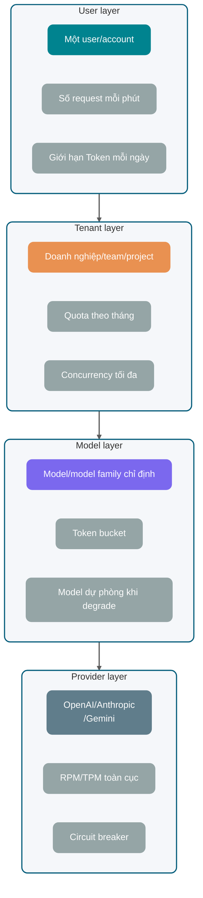
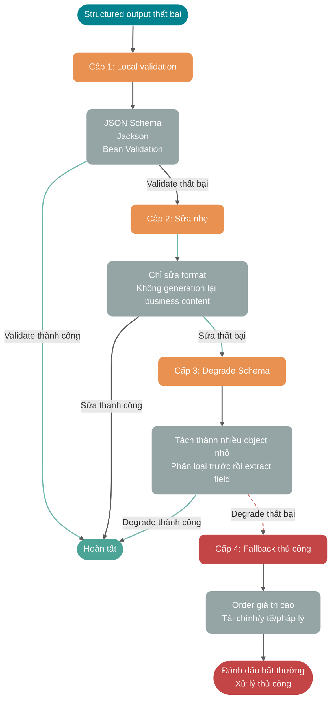

Kết nối thành công một API của LLM ở local chỉ cho thấy network và tham số về cơ bản có thể sử dụng. Khi đưa vào nghiệp vụ thực tế, cần xử lý TTFT, JSON dở dang, 429, cancel và execution trùng lặp:

- Người dùng chờ 8 giây vẫn chưa thấy ký tự đầu tiên, tưởng hệ thống bị treo nên refresh trang ngay.
- Model trả về một nửa JSON, frontend parse thất bại; log backend chỉ có một chuỗi dở dang `{"answer": "Nguyên nhân là`.
- Nhà cung cấp thỉnh thoảng trả 429, service của bạn bắt đầu retry điên cuồng, càng retry càng bị rate limit.
- Người dùng nhấn cancel, browser đã ngắt kết nối nhưng backend vẫn đang tiêu thụ Token.
- Cùng một request nghiệp vụ bị thực thi hai lần do retry, khiến ghi database, trừ phí và gửi thông báo đều bị lặp.

Gửi HTTP request chỉ là một đoạn nhỏ trong call chain. Entry point nghiệp vụ, lắp ghép Prompt, route model, streaming response, ghi trạng thái và observability cần được thiết kế cùng nhau, đặc biệt phải xử lý cancel, retry, quota và output dở dang.

Phần trước mặc định bạn đã hiểu các khái niệm cơ bản như Token, context window, Temperature và Top-p. Nếu còn thắc mắc, nên đọc trước [《Cơ chế vận hành của LLM: Token, context window và sampling parameter ảnh hưởng đến output như thế nào》](./llm-operation-mechanism.md) và [《Prompt Engineering cho LLM là gì? Có những kỹ thuật Prompt nào?》](../agent/prompt-engineering.md).

Lưu ý: năng lực và tham số của các nhà cung cấp như OpenAI, Anthropic, Gemini thay đổi khá nhanh. Hệ thống production nên quản lý động từ console, response header hoặc configuration center, thay vì phụ thuộc vào các con số tĩnh trong tài liệu.

## Một lần gọi LLM ở production gồm những giai đoạn nào?

Chỉ nhìn vào response của nhà cung cấp sẽ rất khó tìm ra vấn đề trong một lần gọi LLM. Request đi qua business system, context system, model gateway, nhà cung cấp bên ngoài và frontend presentation layer. Chỉ cần một đoạn thiếu state và error handling, cuối cùng mọi thứ đều có thể biểu hiện thành “model không ổn định”.


Tách ra, một request thường gồm 8 giai đoạn:

1. **Request nghiệp vụ đi vào**: validate identity người dùng, tenant, gói dịch vụ, quyền tính năng và kích thước request.
2. **Lắp ghép context**: ghép System Prompt, input người dùng, message lịch sử, bằng chứng RAG, tool Schema và ràng buộc output format.
3. **Ước tính Token budget**: ước tính input Token, dành trước output Token, quyết định có cắt lịch sử, nén context hoặc đổi sang model nhỏ hơn hay không.
4. **Route qua model gateway**: chọn model, nhà cung cấp, khu vực, timeout parameter, retry policy và rate limit bucket.
5. **Gọi API nhà cung cấp**: trả về đồng bộ hoặc streaming, có thể đi qua SSE, WebSocket hoặc HTTP response body thông thường.
6. **Parse response**: xử lý delta, finish reason, tool call, usage, từ chối, structured JSON và gián đoạn bất thường.
7. **Ghi ngược state**: lưu câu trả lời hoàn chỉnh, fragment tăng dần, mức sử dụng Token, chi phí gọi, nguyên nhân thất bại và trạng thái nghiệp vụ.
8. **Observability và alert**: ghi traceId, providerRequestId, TTFT, tổng thời gian, số lần retry, số lần 429 và tỷ lệ parse thất bại.

Tốt nhất nên gom việc gọi model vào `LLMGateway` thống nhất hoặc shared client layer. Nó xử lý API Key, timeout, retry, rate limiting, log và chuyển đổi nhà cung cấp. Nếu không, mỗi business module sẽ hình thành một bộ failure semantic hơi khác nhau, rất khó tái hiện khi điều tra.


## Synchronous response và streaming response khác nhau thế nào?

Synchronous call phải chờ model tạo xong toàn bộ nội dung rồi mới trả về kết quả hoàn chỉnh một lần. Streaming output thì vừa tạo vừa trả về: mỗi khi model tạo ra một đoạn text hoặc một event, nhà cung cấp sẽ đẩy delta qua long connection đến bên gọi. Tài liệu chính thức của OpenAI mô tả HTTP streaming trong bối cảnh SSE; Anthropic Messages API cũng hỗ trợ trả về delta event qua SSE; Gemini API cũng cung cấp interface standard, streaming và realtime tương ứng. Field và năng lực model cụ thể có thể thay đổi, **hãy lấy nội dung mới nhất trong tài liệu chính thức làm chuẩn**.

**Vì sao Streaming có thể giảm TTFT?**

TTFT (Time To First Token) là thời gian từ lúc gửi request đến khi nhận được Token đầu tiên có thể hiển thị. Với synchronous response, người dùng phải chờ model tạo xong câu trả lời hoàn chỉnh; ví dụ model cần tạo 800 Token, backend phải chờ cả 800 Token hoàn tất mới trả kết quả. Với streaming response, chỉ cần chờ fragment đầu tiên là người dùng đã có thể thấy nội dung dần xuất hiện.

Streaming output không khiến model tính ít Token hơn và cũng không tự nhiên tiết kiệm chi phí. Nó rút ngắn thời gian chờ ký tự đầu tiên, nhưng không nhất thiết rút ngắn thời gian của toàn bộ lần generation.

| Hạng mục so sánh          | Synchronous response                                | Streaming response                                               |
| ------------------------- | --------------------------------------------------- | ---------------------------------------------------------------- |
| TTFT                      | Cao, phải chờ kết quả hoàn chỉnh                    | Thấp, có thể hiển thị ngay khi nhận fragment đầu tiên            |
| Tổng thời gian end-to-end | Phụ thuộc thời gian generation hoàn chỉnh           | Thường vẫn phụ thuộc thời gian generation hoàn chỉnh             |
| Trải nghiệm frontend      | Giống gửi form rồi chờ kết quả                      | Giống chữ xuất hiện từng ký tự trong ứng dụng chat               |
| Triển khai backend        | Đơn giản, lấy string hoàn chỉnh rồi xử lý           | Phức tạp, cần xử lý delta event, cancel và mất connection        |
| Parse structured output   | Đơn giản, parse JSON hoàn chỉnh một lần             | Cần cache nội dung hoàn chỉnh hoặc dùng incremental parser       |
| Trường hợp phù hợp        | Text ngắn, background task, transaction nghiêm ngặt | Chat, viết, tạo báo cáo, câu trả lời dài                         |
| Trường hợp không phù hợp  | Câu trả lời dài cần tương tác mạnh với người dùng   | Transaction nghiêm ngặt, chain bắt buộc validate kết quả một lần |

Text dài hiển thị cho người dùng thường nên ưu tiên streaming response; batch processing ở background và task phải có object hoàn chỉnh mới submit thì phù hợp hơn với synchronous response.

## Chọn giữa SSE, WebSocket và HTTP chunked cho ba giao thức streaming thế nào?

Streaming output có một số cách vận chuyển phổ biến, đừng trộn chúng thành một thứ.

| Cách thức    | Đặc điểm cốt lõi                                                                                  | Trường hợp phù hợp                                                          | Giới hạn                                                                                             |
| ------------ | ------------------------------------------------------------------------------------------------- | --------------------------------------------------------------------------- | ---------------------------------------------------------------------------------------------------- |
| SSE          | `EventSource` native của browser, server push một chiều đến client, format là `text/event-stream` | Chat text, model delta output, thông báo state                              | Giao tiếp một chiều; control hai chiều phức tạp cần thêm HTTP request                                |
| WebSocket    | Long connection hai chiều, client và server đều có thể gửi message bất cứ lúc nào                 | Voice realtime, cộng tác nhiều người, cần cancel hoặc ngắt lời thường xuyên | Quản lý connection phức tạp hơn, phải tự quản lý gateway, authentication và heartbeat                |
| HTTP chunked | Cơ chế truyền theo chunk của HTTP/1.1, response body được gửi theo từng chunk                     | Streaming proxy từ backend đến backend, truyền tải tầng thấp                | Là cơ chế truyền tải, không phải application event protocol; sau HTTP/2 đã có cơ chế streaming riêng |


Ưu điểm của SSE là đơn giản. Browser chỉ cần vài dòng code để nhận event, server lần lượt ghi từng đoạn `data:` ra ngoài là được. Mô tả của MDN về EventSource cũng nhấn mạnh điểm khác biệt với WebSocket: SSE là data stream một chiều từ server đến client.

WebSocket phù hợp với tương tác realtime và phức tạp hơn. Ví dụ trong voice Agent, client phải liên tục upload audio, server liên tục trả về state của ASR, LLM và TTS, đồng thời hỗ trợ người dùng ngắt giữa chừng. WebSocket tự nhiên hơn cho trường hợp này.

HTTP chunked ở tầng thấp hơn. Nhiều server framework dùng chunked response khi không có `Content-Length`; nó cho phép “vừa ghi vừa gửi”, nhưng không giúp bạn định nghĩa event type, semantics reconnect hay message boundary. Application layer vẫn phải tự thiết kế protocol.

### Event boundary của SSE protocol

SSE thường được truyền qua HTTP response, media type là `text/event-stream`, message format là một UTF-8 text event stream. Mỗi event gồm một số field line, các event được phân tách bằng **blank line**; line break thực tế có thể là `\n` hoặc `\r\n`, vì vậy cách viết phổ biến cho event separator là `\n\n` hoặc `\r\n\r\n`.

Các field thường dùng:

| Field   | Tác dụng                                                                              |
| ------- | ------------------------------------------------------------------------------------- |
| `data`  | Business payload; cho phép nhiều dòng `data:`, client sẽ nối chúng theo specification |
| `event` | Tên event tùy chỉnh; event type mặc định của browser là `message`                     |
| `id`    | Event sequence; kết hợp với semantics reconnect của browser để gợi ý điểm tiếp tục    |
| `retry` | Khoảng reconnect đề xuất (milliseconds)                                               |

**Blank line mới là event separator**. Một line break đơn chỉ kết thúc field line hiện tại, không trực tiếp kết thúc event. Khi server tự viết `data:`, nếu không thêm prefix field cho từng dòng của nội dung, client có thể bỏ các dòng tiếp theo; nếu ghi thêm blank line, event sẽ kết thúc sớm. Markdown list và code block rất dễ gây ra các trường hợp này.

Trong phần hỏi đáp của knowledge base [《Nền tảng phỏng vấn thông minh SpringAI + RAG》](https://javaguide.cn/zhuanlan/interview-guide.html) của Tiểu G cũng dùng SSE: model vừa tạo, browser vừa hiển thị theo kiểu máy đánh chữ; chain không dài nhưng mọi chi tiết của protocol đều được xử lý.

### Cách viết SSE với Spring Boot + Spring AI

Ở phía Java, cách phổ biến là **`Content-Type: text/event-stream`**, sau đó đẩy dữ liệu ra bằng reactive stream. Spring cung cấp `ServerSentEvent<T>`, tránh lỗi nối chuỗi `data:` và `\n\n` thủ công:

```java
@GetMapping(value = "/chat/stream", produces = MediaType.TEXT_EVENT_STREAM_VALUE)
public Flux<ServerSentEvent<String>> stream() {
    return Flux.interval(Duration.ofMillis(500))
        .map(seq -> ServerSentEvent.<String>builder()
            .id(Long.toString(seq))
            .event("token")
            .data("Đoạn-" + seq)
            .retry(Duration.ofSeconds(3))
            .build());
}
```

Khi kết nối với LLM, nguồn delta thường là streaming interface do SDK hoặc framework expose. Lấy Spring AI làm ví dụ, sau khi bật streaming ở phía `ChatClient` sẽ nhận được `Flux<String>`, sau đó map thành SSE để đẩy đến frontend:

```java
Flux<String> tokens = chatClient.prompt()
    .system(systemPrompt)
    .user(userPrompt)
    .stream()
    .content();
```

Về mặt engineering cần nắm rõ: WebMVC + `Flux` chỉ dùng reactive type ở Controller output để làm SSE, bên dưới vẫn là Servlet container. Thread pool, số connection và timeout vẫn phải được quản lý như “long request”; virtual thread của Java 21 có thể giảm chi phí “chiếm một platform thread rồi chờ vô ích”, rất hữu ích cho generation chain thường kéo dài hàng chục giây.

### Xử lý thế nào khi nội dung model có line break?

Khi tự viết raw SSE text, mỗi dòng nội dung đều phải có prefix `data:`, chỉ blank line mới biểu thị event kết thúc. Browser sẽ nối các dòng `data:` của cùng một event bằng line break.

Khi sử dụng Spring `ServerSentEvent` và message encoder tương ứng, không được thay `\n` trong nội dung bằng literal `\\n` trước đó. Việc thay thủ công sẽ làm thay đổi business text, đồng thời buộc frontend phải escape ngược thêm một lần, dễ xung đột. Chỉ cần đưa raw string cho encoder:

```java
.map(chunk -> ServerSentEvent.<String>builder()
    .event("token")
    .data(chunk)
    .build())
```

Nếu giữa chain phải đi qua gateway tự xây dựng hoặc client không phải SSE, có thể đóng gói mỗi delta thành JSON, ví dụ `{"sequence":12,"delta":"Dòng đầu tiên\nDòng thứ hai"}`, sau đó để JSON encoder xử lý escape. Cả hai phương án đều cần test LF, CRLF, blank line, code block và nửa event khi connection bị ngắt.

### Cấu hình streaming cho Nginx và gateway

Chỉ cần phía trước có Nginx hoặc gateway có response buffering, `text/event-stream` có thể bị gom đủ một block rồi mới gửi xuống, khiến cảm nhận TTFT phía người dùng lập tức quay về synchronous interface.

Thay đổi tối thiểu thường là:

```nginx
location /api/ {
    proxy_pass http://backend;
    proxy_buffering off;
    proxy_cache off;
    proxy_read_timeout 300s;
    proxy_set_header Connection "";
    add_header Cache-Control no-cache;
}
```

Kết hợp thêm `proxy_read_timeout` (hoặc cấu hình tương đương) để bảo vệ “long generation”, nếu không chain sẽ bị middleware cắt tại thời điểm timeout do im lặng.

### Bốn loại tình huống bất thường của streaming

Cần thiết kế riêng trạng thái kết thúc của streaming chain. Cancel, timeout, mất connection và reconnect không thể dùng chung một trạng thái “failure”.


**Người dùng cancel.**

Người dùng đóng trang, nhấn dừng generation hoặc chuyển session đều nên trigger cancel. Backend đồng thời phải cancel:

- Request đến API của nhà cung cấp.
- Response stream đang được parse.
- TTS, tool call và database task phía sau.
- Incremental cache chưa được submit.

Không thể chỉ dừng hiển thị ở frontend. Frontend dừng nhưng request đến nhà cung cấp vẫn generation thì Token vẫn tiếp tục bị tiêu thụ.

**Timeout.**

Timeout ít nhất có ba tầng:

- Connection timeout: không kết nối được đến nhà cung cấp.
- TTFT timeout: đã kết nối nhưng mãi chưa có event đầu tiên.
- Total duration timeout: vẫn có output nhưng vượt quá thời gian business chấp nhận.

Cần ghi nhận riêng ba loại này. TTFT timeout thường hướng đến việc model xếp hàng, context quá dài hoặc nhà cung cấp dao động; total duration timeout có thể chỉ là người dùng yêu cầu model viết quá dài.

**Mất connection.**

Khi mất connection, không nên dễ dàng coi nội dung dở dang là thành công. Cách đúng là ghi nhận `finish_reason` hoặc trạng thái event cuối cùng. Nếu không có end marker bình thường, đánh dấu lần gọi này là `INTERRUPTED`, frontend hiển thị “Đã gián đoạn, có thể tạo lại”, thay vì âm thầm lưu thành câu trả lời hoàn chỉnh.

**Reconnect.**

`EventSource` của SSE có khả năng tự reconnect, nhưng LLM output không phải news push thông thường. Sau reconnect có thể tiếp tục từ điểm ngắt hay không phụ thuộc vào việc server có lưu event sequence, delta và state của provider call hay không. Trong đa số trường hợp, stream phía nhà cung cấp đã ngắt nên không thể thực sự tiếp tục ở cấp Token.

Cách ổn định hơn là:

- Server tạo `messageId` và `sequence` tăng dần cho mỗi streaming response.
- Ghi các fragment đã gửi vào short-term cache.
- Khi frontend reconnect, gửi bù các fragment đã cache trước.
- Nếu provider stream đã kết thúc hoặc mất hiệu lực, thông báo người dùng tạo lại thay vì giả vờ tiếp tục liền mạch.

## Lỗi nào có thể retry, lỗi nào không thể retry?

Retry là capability quen thuộc nhất và cũng dễ bị lạm dụng nhất với backend engineer.

Retry của LLM API có hai điểm đặc biệt:

1. **Request đắt**: request thất bại cũng có thể tiêu thụ quota, thậm chí đã tiêu thụ một phần Token.
2. **Output không deterministic**: dù Prompt giống nhau, lần trả về thứ hai vẫn có thể khác lần đầu.


### Bảng đối chiếu loại lỗi

| Loại                         | Ví dụ                                          | Có nên retry không       | Cách xử lý                                                                           |
| ---------------------------- | ---------------------------------------------- | ------------------------ | ------------------------------------------------------------------------------------ |
| Network ngắt tạm thời        | Connection reset, DNS dao động, read timeout   | Có thể                   | Exponential backoff + jitter, giới hạn số lần tối đa                                 |
| Provider 5xx                 | 500, 502, 503, 504                             | Có thể                   | Retry ngắn hạn, vượt ngưỡng thì chuyển model hoặc degrade                            |
| Provider quá tải             | Anthropic 529, lỗi tương tự overloaded         | Có thể                   | Retry chậm, cần thiết thì circuit breaker provider này                               |
| 429 rate limit               | Vượt RPM, TPM, RPD hoặc giới hạn concurrency   | Thận trọng               | Ưu tiên xem `Retry-After` và rate limit header, xếp hàng hoặc degrade                |
| Streaming bị gián đoạn       | Không nhận được end event bình thường          | Tùy tình huống           | Task hiển thị cho người dùng không tự retry, background task có thể retry idempotent |
| 400 parameter error          | Schema không hợp lệ, thiếu field, vượt context | Không nên                | Sửa request, không retry cùng payload                                                |
| 401/403 authentication error | API Key không hợp lệ, không đủ quyền           | Không nên                | Alert và vô hiệu hóa Key tương ứng                                                   |
| Security refusal             | Bị từ chối theo content policy                 | Không nên                | Đưa vào refusal flow của nghiệp vụ                                                   |
| Parse thất bại               | JSON không đầy đủ, sai field type              | Có thể retry có giới hạn | Sửa lần hai kèm nguyên nhân thất bại, tối đa 1-2 lần                                 |

Tài liệu rate limit chính thức của OpenAI khuyến nghị exponential backoff ngẫu nhiên cho rate limit error, đồng thời nhắc rằng request thất bại cũng được tính vào giới hạn mỗi phút; tài liệu error chính thức của Anthropic nêu rõ các loại lỗi như 429 rate limit, 500 api error, 504 timeout và 529 overloaded. Khi tích hợp nhà cung cấp khác cũng cần phân biệt retryable, non-retryable và trạng thái quá tải theo error code của họ.

### Exponential backoff và jitter

Exponential backoff tăng thời gian chờ theo số lần thất bại, cho đến khi đạt thời gian chờ tối đa hoặc số lần retry tối đa. Jitter thêm một lượng ngẫu nhiên vào thời gian chờ, tránh việc mọi request cùng retry, khiến hệ thống vừa phục hồi lại bị rate limit lần nữa.

Một công thức thực tế:

```text
sleep = min(maxDelay, baseDelay * 2^retryCount) + random(0, jitter)
```

Trong production đừng quên thêm hai ràng buộc cứng:

- **Số lần retry tối đa**: thường 2-3 lần là đủ, đừng retry vô hạn.
- **Deadline tổng thể**: user request có SLA tổng thể, ví dụ 15 giây; đến hạn thì failure, đừng để retry kéo dài thành 1 phút.

### Idempotency Key và cơ chế deduplication

Chỉ cần có retry là bắt buộc phải thảo luận về idempotency.

Idempotency Key có thể do nghiệp vụ tạo, ví dụ:

```text
tenantId:userId:conversationId:messageId:attemptGroup
```

Sau khi server nhận request, trước tiên kiểm tra Key này đã tồn tại hay chưa:

- Nếu đã thành công, trả về kết quả lịch sử ngay.
- Nếu đang generation, trả về địa chỉ subscription của cùng streaming task.
- Nếu failure và được phép retry, tạo attempt mới nhưng vẫn gắn dưới cùng business message.
- Nếu failure nhưng không được retry, trả về nguyên nhân thất bại ngay.

Điều này tránh được hai vấn đề:

1. Người dùng liên tục nhấn “gửi lại”, khiến backend tạo nhiều model call.
2. Gateway timeout rồi tự retry, trong khi lần đầu thực tế đã ghi database thành công, lần thứ hai lại ghi thêm một message trùng.

### Xử lý response trùng lặp

Response sau retry có thể trùng, xung đột hoặc chồng lấn một phần.

Với ứng dụng chat, nên phân biệt nhiều model call dưới cùng một user message như sau:

- `message_id`: ID business message, hiển thị cho người dùng.
- `attempt_id`: ID của lần thử model call, hiển thị cho system.
- `provider_request_id`: ID request phía provider, dùng để điều tra.
- `stream_sequence`: sequence của delta, dùng để deduplicate và gửi bù.

Khi ghi database, chỉ cho phép một attempt trở thành `final`. Các attempt khác giữ lại làm diagnostic record, không tham gia vào context của người dùng. Như vậy vừa có thể điều tra vấn đề, vừa không làm nhiễm Prompt của lượt tiếp theo.

## Vì sao cần rate limiting? Rate limit thế nào?

Nhiều team chỉ bắt đầu có ý thức về rate limiting sau khi nhận được 429 đầu tiên.

Chỉ bắt đầu rate limit sau khi nhận 429 từ provider cho thấy system thiếu capacity management của chính mình. 429 chỉ có thể là tín hiệu bảo vệ từ bên ngoài, không thể thay thế budget, queue và concurrency control ở application.

### Kiến trúc rate limiting bốn tầng

| Tầng     | Đối tượng giới hạn            | Mục tiêu chính                                  | Strategy thường dùng                                 |
| -------- | ----------------------------- | ----------------------------------------------- | ---------------------------------------------------- |
| User     | Một user hoặc account         | Ngăn abuse, thao tác nhầm và script spam API    | Số request mỗi phút, giới hạn Token mỗi ngày         |
| Tenant   | Doanh nghiệp, team, project   | Kiểm soát chi phí gói dịch vụ và tính công bằng | Quota theo tháng, concurrency tối đa, priority queue |
| Model    | Một model hoặc model family   | Tránh model phổ biến bị sử dụng hết capacity    | Token bucket theo model, degrade sang model dự phòng |
| Provider | OpenAI, Anthropic, Gemini,... | Bảo vệ external dependency và API Key           | RPM, TPM, concurrency toàn cục, circuit breaker      |



Tài liệu rate limiting chính thức của Gemini tách dimension rate limiting thành RPM, input TPM và RPD, đồng thời cho biết limit áp dụng theo project thay vì từng API Key; tài liệu chính thức của OpenAI cũng hiển thị rate limit header cho số request, số Token và quota còn lại. Con số cụ thể và quan hệ với model thay đổi rất nhanh, vì vậy production system không nên hard-code con số tĩnh trong tài liệu mà phải quản lý động từ console, response header hoặc configuration center.

### Vì sao Token budget quan trọng hơn số request?

Rate limiting API truyền thống thường tính theo QPS. Chỉ tính QPS là chưa đủ với LLM API.

Chi phí của hai request có thể chênh lệch rất lớn:

- Request A: input 500 Token, output 100 Token.
- Request B: input 80K Token, output 8K Token.

Chúng đều là 1 request, nhưng áp lực lên model inference, quota của provider và hóa đơn hoàn toàn khác nhau.

Vì vậy rate limiting ít nhất phải đồng thời xem:

- **RPM**: số request mỗi phút.
- **TPM**: số Token mỗi phút.
- **Concurrency**: số request đang generation.
- **Context size**: input Token của một request.
- **Output tối đa**: `max_tokens` hoặc parameter tương tự.
- **Budget ngày/tháng**: tổng chi phí của tenant hoặc user.

Cần trừ budget trước khi gửi request đến provider.

Sau khi request đi vào gateway, trước tiên ước tính `input_tokens + reserved_output_tokens`, rồi thử trừ ở các bucket user, tenant, model và provider. Nếu không trừ được thì không gửi provider, mà trực tiếp xếp hàng, degrade hoặc reject.

### So sánh các strategy rate limiting thường dùng

| Strategy              | Trường hợp phù hợp                       | Ưu điểm                                               | Nhược điểm                                     |
| --------------------- | ---------------------------------------- | ----------------------------------------------------- | ---------------------------------------------- |
| Fixed window          | Background task đơn giản, management API | Dễ triển khai, dễ thống kê                            | Dễ tạo spike ở ranh giới window                |
| Sliding window        | Giới hạn request cấp user                | Ranh giới mượt hơn                                    | Chi phí triển khai và lưu trữ cao hơn          |
| Token bucket          | Model call, Token budget                 | Hỗ trợ burst nhất định, thường dùng trong engineering | Cần tuning parameter                           |
| Leaky bucket          | Làm phẳng traffic nghiêm ngặt            | Output ổn định, phù hợp bảo vệ provider               | Trải nghiệm burst kém                          |
| Concurrency semaphore | Streaming generation, task dài           | Giới hạn số connection bị chiếm đồng thời             | Không kiểm soát chi phí Token của từng request |
| Priority queue        | Multi-tenant, nhiều gói dịch vụ          | Bảo vệ request ưu tiên cao                            | Cần xử lý starvation và timeout                |

Production system thường kết hợp các strategy này:

- User: sliding window + giới hạn Token theo ngày.
- Tenant: token bucket + budget theo tháng.
- Model: token bucket + concurrency semaphore.
- Provider: token bucket toàn cục + circuit breaker.
- Streaming request: concurrency semaphore + giới hạn tổng thời gian.

Để xem giới thiệu chi tiết về rate limiting algorithm, có thể tham khảo bài viết này: [Giải thích chi tiết về rate limiting](https://javaguide.cn/high-availability/limit-request.html).

### Nên xử lý 429 thế nào?

HTTP 429 biểu thị có quá nhiều request. Khi backend xử lý 429, nên theo thứ tự sau:

1. **Đọc `Retry-After` hoặc rate limit header của provider**: nếu có thời gian phục hồi rõ ràng thì tôn trọng thời gian đó.
2. **Đánh dấu dimension bị rate limit**: số request đầy, Token đầy hay quota ngày đã hết.
3. **Request ngắn có thể xếp hàng**: ví dụ summary task ở background có thể đưa vào delay queue.
4. **Ít retry user interaction request**: khi người dùng không thể chờ, trực tiếp thông báo thử lại sau hoặc chuyển sang model nhẹ hơn.
5. **Circuit breaker khi provider liên tục trả 429**: đừng để mọi request tiếp tục đâm vào tường.

Một degradation chain điển hình:

```text
Model ưu tiên khả dụng -> Gọi bình thường
Model ưu tiên trả 429 -> Chuyển sang model cùng cấp dự phòng
Model dự phòng cũng rate limit -> Chuyển model nhẹ và rút ngắn output
Vẫn không khả dụng -> Xếp hàng hoặc trả về "Request hiện đang bận"
```

Ở đây cần tránh một hiểu lầm: degradation không có nghĩa là âm thầm làm chất lượng kém đi. Nếu model nhẹ ảnh hưởng đến chất lượng câu trả lời, phải đánh dấu rõ ở business layer, ví dụ “Hiện đang ở chế độ nhanh, vấn đề phức tạp nên thử lại sau”.

## Vì sao cần structured output?

Nhiều business ban đầu viết Prompt như sau:

```text
Hãy phân tích câu hỏi của user, output JSON với các field gồm intent, confidence, answer.
```

Sau đó backend trực tiếp gọi `JSON.parse()`.

Cách này rất phổ biến ở giai đoạn Demo, nhưng production environment sẽ gặp nhiều edge case:

- Model thêm một câu “Được, dưới đây là kết quả” trước JSON.
- Thiếu field.
- Viết sai enum value.
- Trả số dưới dạng string.
- Khi streaming response chỉ nhận được một nửa object.
- Khi security refusal, hoàn toàn không phải business Schema.

Structured output cần giải quyết việc chương trình có thể consume model output ổn định hay không, chứ không chỉ việc kết quả trông giống JSON.

### JSON Mode, JSON Schema và Structured Output khác nhau thế nào?

| Cách thức                     | Mức độ ràng buộc | Giá trị engineering                                     | Rủi ro                                                                       |
| ----------------------------- | ---------------- | ------------------------------------------------------- | ---------------------------------------------------------------------------- |
| Natural language thông thường | Gần như không có | Phù hợp câu trả lời để hiển thị                         | Không phù hợp để parse bằng chương trình                                     |
| Prompt yêu cầu JSON           | Yếu              | Đơn giản, cross-model                                   | Dễ lẫn text giải thích hoặc thiếu field                                      |
| JSON Mode                     | Trung bình       | Thường bảo đảm syntax là JSON                           | Không nhất thiết phù hợp business field Schema                               |
| JSON Schema                   | Mạnh             | Xác định rõ field, type, required và enum               | Các provider hỗ trợ subset khác nhau                                         |
| Structured Outputs            | Mạnh hơn         | Provider tăng cường ràng buộc ở decoding hoặc SDK layer | Bị giới hạn bởi model, SDK và Schema subset                                  |
| Function Calling / Tool Use   | Hướng đến action | Phù hợp để model chọn tool và parameter                 | Không phải giải pháp thay thế vạn năng cho natural language answer cuối cùng |


Tài liệu Structured Outputs chính thức của OpenAI nhấn mạnh rằng output có thể tuân theo JSON Schema do developer cung cấp và có cấu hình liên quan đến `strict`; tài liệu chính thức của Gemini cho biết structured output sử dụng `response_format` và JSON Schema, đồng thời chỉ hỗ trợ một subset của JSON Schema; tài liệu chính thức của Anthropic cũng cung cấp Structured Outputs và Strict tool use, hai tính năng này không hoàn toàn giải quyết cùng một vấn đề. Model, field và Schema subset cụ thể thay đổi khá nhanh, vì vậy vẫn phải lấy nội dung mới nhất trong tài liệu chính thức làm chuẩn.

### Khác biệt engineering giữa JSON thông thường và structured output

Natural language response giống “hướng dẫn người viết cho người đọc”, còn structured response giống “interface do service viết cho service”.

Lấy bài toán nhận diện intent làm ví dụ:

```json
{
  "intent": "refund_request",
  "confidence": 0.86,
  "entities": {
    "order_id": "202605080001",
    "reason": "Sản phẩm bị hư hỏng"
  },
  "need_human_review": false
}
```

Có Schema, backend có thể làm những việc sau:

- `intent` chỉ được là một enum hữu hạn.
- `confidence` bắt buộc là number.
- `order_id` có thể rỗng nhưng type phải ổn định.
- `need_human_review` bắt buộc tồn tại.
- Khi parse thất bại có thể đi vào flow sửa lỗi hoặc fallback cho người xử lý.

Schema biến JSON do model tạo ra thành data contract có thể validate.

### Fallback thế nào sau khi structured output thất bại?

Structured output vẫn có thể thất bại. Failure không nhất thiết do năng lực của provider, mà cũng có thể do Schema quá phức tạp, context xung đột, output bị cắt hoặc security policy refusal.

Nên chia fallback thành bốn cấp:

1. **Local validation**: dùng JSON Schema, Jackson và Bean Validation để validate field và type.
2. **Sửa nhẹ**: chỉ yêu cầu model sửa format, không generation lại business content.
3. **Degrade Schema**: tách object phức tạp thành nhiều object nhỏ, hoặc phân loại trước rồi mới extract field.
4. **Fallback thủ công hoặc theo rule**: với order giá trị cao và các lĩnh vực tài chính, y tế, pháp lý, không nên hoàn toàn phụ thuộc vào auto-fix.



Một nguyên tắc thực tế: khi structured output thất bại, đừng đẩy natural language nguyên bản vào downstream system. Có thể hiển thị cho user không có nghĩa là có thể để chương trình thực thi.

## Triển khai LLM call ở Java backend thế nào?

Đoạn Java pseudo-code này không gắn với SDK cụ thể. Token budget, rate limiting, retry, streaming parser, idempotency và observability đều được gom vào cùng một gateway:

```java
public interface LLMClient {
    LLMResponse chat(LLMRequest request);

    void stream(LLMRequest request, StreamHandler handler);
}

public interface StreamHandler {
    void onStart(String messageId);

    void onDelta(String messageId, long sequence, String delta);

    void onComplete(String messageId, LLMUsage usage);

    void onError(String messageId, Throwable error);
}

public final class LLMGateway {
    private final LLMClient client;
    private final RateLimiter rateLimiter;
    private final IdempotencyStore idempotencyStore;
    private final TokenEstimator tokenEstimator;
    private final Observation observation;

    public LLMGateway(
            LLMClient client,
            RateLimiter rateLimiter,
            IdempotencyStore idempotencyStore,
            TokenEstimator tokenEstimator,
            Observation observation) {
        this.client = client;
        this.rateLimiter = rateLimiter;
        this.idempotencyStore = idempotencyStore;
        this.tokenEstimator = tokenEstimator;
        this.observation = observation;
    }

    public LLMResponse chatWithRetry(BusinessCommand command) {
        String idemKey = command.idempotencyKey();
        LLMRequest request = buildRequest(command);
        String requestFingerprint = command.requestFingerprint();
        IdempotencyClaim claim = idempotencyStore.claim(idemKey, requestFingerprint);

        if (claim.isCompleted()) {
            return claim.toResponse();
        }
        if (!claim.isOwner()) {
            throw new LLMException("Request with the same idempotency key is already running");
        }

        TokenBudget budget = tokenEstimator.estimate(request);
        try {
            rateLimiter.acquire(command.tenantId(), request.model(), budget);
        } catch (RuntimeException ex) {
            idempotencyStore.releaseClaim(idemKey, requestFingerprint);
            throw ex;
        }

        RetryPolicy retryPolicy = RetryPolicy.defaultPolicy();
        Throwable lastError = null;

        for (int attempt = 0; attempt <= retryPolicy.maxRetries(); attempt++) {
            String attemptId = idemKey + ":attempt:" + attempt;
            long startNanos = System.nanoTime();

            try {
                idempotencyStore.startAttempt(idemKey, requestFingerprint, attemptId);
                LLMResponse response = client.chat(request.withAttemptId(attemptId));

                ParsedAnswer parsed = parseAndValidate(response.content(), command.schema());
                idempotencyStore.markSuccess(idemKey, attemptId, response, parsed);
                observation.recordSuccess(request, response.usage(), startNanos, attempt);
                return response;
            } catch (LLMException ex) {
                lastError = ex;
                observation.recordFailure(request, ex, startNanos, attempt);

                if (!retryPolicy.canRetry(ex, attempt)) {
                    idempotencyStore.markFailed(idemKey, attemptId, ex);
                    throw ex;
                }

                sleep(retryPolicy.nextDelay(ex, attempt));
            }
        }

        throw new LLMException("LLM request failed after retries", lastError);
    }

    public void stream(BusinessCommand command, StreamHandler downstream) {
        String idemKey = command.idempotencyKey();
        LLMRequest request = buildRequest(command).enableStream();
        String messageId = command.messageId();
        String requestFingerprint = command.requestFingerprint();
        IdempotencyClaim claim = idempotencyStore.claim(idemKey, requestFingerprint);
        if (!claim.isOwner()) {
            downstream.onError(messageId,
                    new LLMException("Duplicate or conflicting idempotency key"));
            return;
        }

        TokenBudget budget = tokenEstimator.estimate(request);
        try {
            rateLimiter.acquire(command.tenantId(), request.model(), budget);
        } catch (RuntimeException ex) {
            idempotencyStore.releaseClaim(idemKey, requestFingerprint);
            downstream.onError(messageId, ex);
            return;
        }

        StreamBuffer buffer = new StreamBuffer(messageId);
        idempotencyStore.startAttempt(idemKey, requestFingerprint, messageId);

        client.stream(request, new StreamHandler() {
            @Override
            public void onStart(String ignored) {
                downstream.onStart(messageId);
            }

            @Override
            public void onDelta(String ignored, long sequence, String delta) {
                if (buffer.seen(sequence)) {
                    return;
                }
                buffer.append(sequence, delta);
                idempotencyStore.appendDelta(messageId, sequence, delta);
                downstream.onDelta(messageId, sequence, delta);
            }

            @Override
            public void onComplete(String ignored, LLMUsage usage) {
                String fullText = buffer.fullText();
                try {
                    ParsedAnswer parsed = parseAndValidate(fullText, command.schema());
                    idempotencyStore.markSuccess(idemKey, messageId, fullText, parsed, usage);
                } catch (Exception ex) {
                    idempotencyStore.markFailed(idemKey, messageId, ex);
                    downstream.onError(messageId, ex);
                    return;
                }
                downstream.onComplete(messageId, usage);
            }

            @Override
            public void onError(String ignored, Throwable error) {
                idempotencyStore.markInterrupted(idemKey, messageId, buffer.fullText(), error);
                downstream.onError(messageId, error);
            }
        });
    }

    private LLMRequest buildRequest(BusinessCommand command) {
        return LLMRequest.builder()
                .model(command.model())
                .systemPrompt(command.systemPrompt())
                .userPrompt(command.userPrompt())
                .context(command.context())
                .responseSchema(command.schema())
                .timeout(command.timeout())
                .metadata("tenantId", command.tenantId())
                .metadata("messageId", command.messageId())
                .build();
    }

    private ParsedAnswer parseAndValidate(String content, JsonSchema schema) {
        try {
            return ParsedAnswer.fromJson(content, schema);
        } catch (Exception ex) {
            throw new NonRetryableLLMException("Structured output validation failed", ex);
        }
    }

    private void sleep(Duration duration) {
        try {
            Thread.sleep(duration.toMillis());
        } catch (InterruptedException ex) {
            Thread.currentThread().interrupt();
            throw new LLMException("Retry sleep interrupted", ex);
        }
    }
}
```

Đoạn code đã lược bỏ interface storage và implementation concurrency control. `claim` phải được thực hiện bằng Redis `SET NX`, unique constraint của database hoặc conditional atomic update; không thể dùng “query trước rồi mới write” để thay thế. Idempotency key còn phải gắn với request fingerprint; khi cùng một Key tương ứng với các request khác nhau, cần trả về conflict thay vì kết quả lịch sử.

Một số điểm quan trọng khác:

- **Entry point nghiệp vụ không gọi trực tiếp provider SDK**, mà thống nhất đi qua `LLMGateway`.
- **Ước tính Token và trừ rate limit bucket trước**, tránh gửi đi rồi mới phát hiện không còn quota.
- **Idempotency record bao trọn một business message**, attempt chỉ là retry nội bộ của system.
- **Synchronous và streaming xử lý riêng**, streaming cần ghi `sequence` để tránh trùng khi gửi bù sau reconnect.
- **Parse structured output trước khi ghi database**, thất bại thì chuyển sang failure state thay vì làm nhiễm business data.

Trong project thực tế còn cần bổ sung:

- API Key pool và provider routing.
- Model priority và degradation strategy.
- Prompt version.
- Security review cho response content.
- Tính chi phí từ usage.
- Đồng bộ traceId với providerRequestId.
- Truyền cancellation signal của streaming đến provider request.
- SSE outbound contract: cách xử lý line break và event boundary phải thống nhất với frontend, gateway phải tắt buffering và nới read timeout.

## Không có metric thì không có stability

Observability của ứng dụng AI không thể chỉ ghi “call success/failure”.

Ít nhất cần ghi các metric sau:

| Metric              | Ý nghĩa                                | Mục đích                                                   |
| ------------------- | -------------------------------------- | ---------------------------------------------------------- |
| TTFT                | Thời gian trả về Token đầu tiên        | Xác định queue, context quá dài và provider dao động       |
| E2E Latency         | Thời gian hoàn tất end-to-end          | Đánh giá user experience và SLA                            |
| Input Tokens        | Input Token                            | Phân tích chi phí, điều tra context phình to               |
| Output Tokens       | Output Token                           | Phân tích chi phí, điều tra câu trả lời bất thường quá dài |
| Retry Count         | Số lần retry                           | Nhận diện provider không ổn định hoặc strategy quá mạnh    |
| 429 Rate            | Tỷ lệ rate limit                       | Đánh giá quota và rate limit bucket có hợp lý không        |
| Parse Failure Rate  | Tỷ lệ parse structured output thất bại | Đánh giá vấn đề Schema, Prompt và model adaptation         |
| Cancel Rate         | Tỷ lệ user cancel                      | Đánh giá response quá chậm hoặc generation quá dài         |
| Provider Error Rate | Tỷ lệ lỗi provider                     | Cơ sở cho routing, degradation và circuit breaker          |

Nên thêm các field sau vào log:

```text
trace_id
tenant_id
user_id
conversation_id
message_id
attempt_id
model
provider
prompt_version
input_tokens
output_tokens
ttft_ms
latency_ms
retry_count
finish_reason
error_type
provider_request_id
```

Thiếu các field này, việc điều tra production sẽ rất khó khăn. Khi user nói “AI vừa không trả lời”, bạn sẽ không biết đó là provider nào, model nào, attempt nào, hay đã nhận được delta đầu tiên chưa.

## Câu hỏi phỏng vấn

### 1. Call chain hoàn chỉnh của LLM API là gì?

Một lần gọi bắt đầu khi business request đi vào, trước tiên validate user, tenant, permission và parameter; sau đó lắp ghép System Prompt, user input, message lịch sử, bằng chứng RAG, tool definition và output Schema; tiếp theo ước tính Token budget, đi qua model gateway để routing, rate limiting, timeout, retry và chọn provider; sau khi provider trả synchronous result hoặc streaming event, backend parse delta, validate structured output, ghi state và usage; cuối cùng ghi TTFT, tổng thời gian, error code, số lần retry và chi phí Token vào observability system.

Vì vậy, LLM call phải được quản trị như một production chain hoàn chỉnh, không thể chỉ đóng gói thành một HTTP request.

### 2. Vì sao Streaming cải thiện trải nghiệm?

Streaming cho phép model vừa generation vừa trả về, người dùng có thể thấy Token đầu tiên sớm hơn nên TTFT giảm. Nó không bảo đảm tổng thời gian generation ngắn hơn và cũng không tự nhiên giảm chi phí Token. Backend cần xử lý thêm cancel, timeout, mất connection, reconnect, JSON dở dang và ghi delta.

### 3. Chọn SSE hay WebSocket thế nào?

Nếu chỉ cần server đẩy model text đến browser, SSE đơn giản hơn và tự nhiên phù hợp với delta output một chiều; khi triển khai đừng quên **`text/event-stream` nhạy cảm với line break và event boundary**, đồng thời buffering của reverse proxy có thể biến “streaming” thành “batch”. Nếu client cũng cần thường xuyên gửi data đến server, chẳng hạn audio stream, realtime control, cộng tác nhiều người hoặc ngắt lời, WebSocket phù hợp hơn. HTTP chunked thiên về cơ chế truyền tải tầng thấp, application layer vẫn phải tự định nghĩa message boundary và event type.

### 4. Lỗi LLM API nào có thể retry?

Network ngắt tạm thời, connection reset, một phần lỗi 5xx, 504 và provider quá tải thường có thể retry có giới hạn; 429 cần kết hợp `Retry-After`, rate limit header, queue và degradation để xử lý; 400 parameter error, 401/403 authentication error và security refusal thường không thể retry. Structured parse failure có thể sửa format 1-2 lần, nhưng không được retry vô hạn.

### 5. Những LLM call nào cần idempotency?

Pure text generation không nhất thiết yêu cầu business idempotency, nhưng retry vẫn có thể tạo chi phí trùng và nhiều kết quả ứng viên. Khi liên quan đến ghi database, trừ phí, gửi thông báo hoặc tool write operation, bắt buộc phải ngăn cùng một business request bị thực thi nhiều lần. Có thể dùng business message ID để tạo idempotency Key và gắn với request fingerprint; nhiều model call attempt cùng nằm dưới một business message, chỉ một attempt được trở thành kết quả cuối cùng.

### 6. Vì sao rate limiting không thể chỉ tính theo QPS?

Vì chi phí và áp lực của LLM API chủ yếu do Token quyết định. Một request 500 Token và một request 80K Token đều là 1 request, nhưng mức tiêu thụ resource khác nhau rất lớn. Production rate limiting phải đồng thời xem RPM, TPM, concurrency, context size, output tối đa và tenant budget.

### 7. JSON Mode và Structured Outputs khác nhau thế nào?

JSON Mode chú trọng hơn vào việc “output là JSON hợp lệ”, nhưng không nhất thiết phù hợp với business Schema của bạn. Structured Outputs hoặc JSON Schema có ràng buộc mạnh hơn, có thể yêu cầu field, type, required field và enum. Function Calling hoặc Tool Use phù hợp hơn để model tạo tool call parameter. Mỗi provider hỗ trợ Schema subset khác nhau, trước khi triển khai cần xem tài liệu chính thức và viết compatibility layer.

### 8. Xử lý structured output dạng streaming thế nào?

Đừng vừa nhận delta vừa trực tiếp `JSON.parse()` object hoàn chỉnh. Cách ổn định hơn là: trong incremental stage chỉ hiển thị text hoặc ghi fragment; sau khi nhận end event bình thường mới ghép nội dung hoàn chỉnh rồi validate Schema. Nếu provider hỗ trợ structured streaming event hoặc SDK accumulator thì có thể dùng accumulator chính thức; nếu không, tự duy trì buffer, sequence và end state.

## Checklist trước khi go-live

Go-live gate ít nhất phải bao quát bốn failure chain: cancel từ client có truyền đến provider không; retryable error có bị ràng buộc bởi deadline tổng thể và idempotency record atomic không; RPM, TPM, concurrency và tenant budget có đồng thời được áp dụng không; sau khi structured output parse thất bại có đi vào failure state rõ ràng không.

Observability record phải nối được `messageId`, `attemptId` và `providerRequestId`, đồng thời lưu TTFT, tổng thời gian, usage, nguyên nhân kết thúc và parse result. Thiếu bất kỳ đoạn nào trong số đó, mất connection, execution trùng lặp và bất thường trên hóa đơn đều sẽ khó tái hiện.

## Tài liệu tham khảo

- [OpenAI Streaming API responses](https://developers.openai.com/api/docs/guides/streaming-responses)
- [OpenAI Structured model outputs](https://developers.openai.com/api/docs/guides/structured-outputs)
- [OpenAI Rate limits](https://developers.openai.com/api/docs/guides/rate-limits)
- [Anthropic Streaming Messages](https://platform.claude.com/docs/en/build-with-claude/streaming)
- [Anthropic Errors](https://platform.claude.com/docs/en/api/errors)
- [Anthropic Structured outputs](https://platform.claude.com/docs/en/build-with-claude/structured-outputs)
- [Gemini Structured outputs](https://ai.google.dev/gemini-api/docs/structured-output)
- [Gemini Rate limits](https://ai.google.dev/gemini-api/docs/rate-limits)
- [MDN Using server-sent events](https://developer.mozilla.org/en-US/docs/Web/API/Server-sent_events/Using_server-sent_events)
- [MDN EventSource](https://developer.mozilla.org/en-US/docs/Web/API/EventSource)
- [Spring `ServerSentEvent` Javadoc](https://docs.spring.io/spring-framework/docs/current/javadoc-api/org/springframework/http/codec/ServerSentEvent.html)
- [MDN 429 Too Many Requests](https://developer.mozilla.org/en-US/docs/Web/HTTP/Reference/Status/429)
- [MDN Transfer-Encoding](https://developer.mozilla.org/en-US/docs/Web/HTTP/Reference/Headers/Transfer-Encoding)
