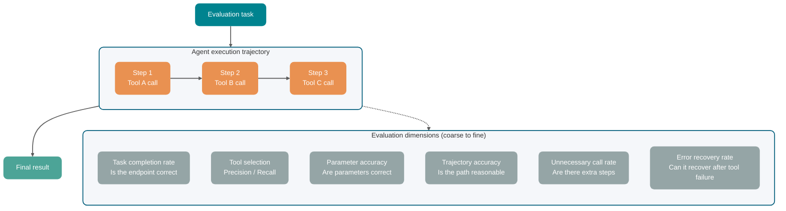
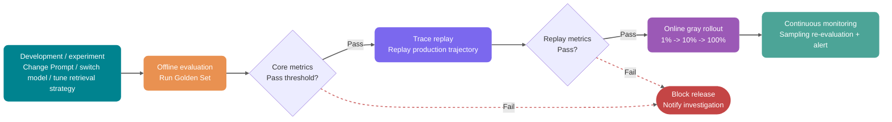

Sau khi RAG của customer service nâng cấp lên hybrid retrieval và Reranker, phán đoán dễ xuất hiện nhất trước khi đưa lên production là: chọn vài chục câu hỏi tại local chạy thử một lần, thấy câu trả lời mượt hơn bản cũ thì cho rằng có thể tăng traffic.

Nếu sau một tuần tăng traffic, phía nghiệp vụ chỉ phản hồi “một số câu hỏi có vẻ không chính xác bằng trước”, việc điều tra sẽ lập tức bị mắc kẹt.

Lúc này cần xem lại kết quả lịch sử của cùng một nhóm scenario: tỷ lệ hit của phiên bản cũ trong đổi trả, tra cứu logistics và so sánh thông số sản phẩm lần lượt là bao nhiêu, còn phiên bản mới bắt đầu giảm từ loại câu hỏi nào. Không có baseline này, “không chính xác bằng trước” có thể là quality regression, cũng có thể chỉ là kỳ vọng người dùng thay đổi; cuối cùng việc điều tra chỉ có thể quay lại đoạn hội thoại gốc để tìm từng dòng.

Vì vậy model selection, điều chỉnh Prompt, tối ưu retrieval và gray rollout sẽ mất đi một chuẩn so sánh chung. Tác dụng của evaluation set là đặt những thay đổi này lên cùng một thước đo.

Các framework như RAGAS, TruLens, LangSmith, Langfuse vẫn đang liên tục phát triển; khi tích hợp vào production cần căn cứ vào official documentation mới nhất của từng framework. Bài viết này chỉ bàn về phương pháp đánh giá và thiết kế metric, không so sánh công cụ ngang hàng và không trích dẫn các con số benchmark chưa được kiểm chứng.

## Vì sao public benchmark chưa đủ?

Public benchmark trước hết có thể dùng để loại những model rõ ràng không phù hợp, chẳng hạn candidate có năng lực tiếng Trung yếu, context window không đủ hoặc khả năng tool calling không đạt yêu cầu nghiệp vụ.

Nhưng nếu trực tiếp coi điểm trên leaderboard là căn cứ đưa lên production, các vấn đề then chốt trong nghiệp vụ sẽ bị bỏ sót.

Task và dataset của leaderboard là cố định, thứ hạng không thể trực tiếp thay thế business validation. Trong customer service thương mại điện tử thường có đổi trả, thời gian chuyển phát, rule khuyến mãi và so sánh thông số sản phẩm; điểm cao trong bài suy luận tiếng Anh không thể chứng minh model sẽ trả lời theo các rule nghiệp vụ này.

Request thực tế còn mang theo lỗi chính tả, viết tắt khẩu ngữ, screenshot, đa ngôn ngữ và mâu thuẫn trước sau. Performance trên test set sạch thường không bao phủ được các tình huống này.

Trước khi đưa lên production, đặc biệt phải kiểm tra riêng một số path không được phép sai: bỏ sót điều khoản rủi ro cao trong contract review sẽ ảnh hưởng phán đoán ký kết, trả lời sai quy trình hoàn tiền trong customer service sẽ khiến người dùng nộp tài liệu theo nhầm path, còn Coding Agent thực thi command nguy hiểm sẽ ảnh hưởng repository và môi trường runtime. Dù tỷ lệ các failure này rất thấp, chúng vẫn có thể bị điểm trung bình che lấp; public benchmark tổng quát thường không làm nổi bật chúng.

Public leaderboard có thể loại các model rõ ràng không phù hợp. Model có thể tích hợp vào nghiệp vụ của mình hay không vẫn phải được quyết định bằng evaluation set của chính mình.

## Một evaluation case gồm những gì?

Một evaluation case phải quy về một vấn đề có thể verify: với một input cho trước, hệ thống cần hoàn thành gì, tiêu chuẩn hoàn thành là gì.

Scenario hỏi đáp một lượt tương đối đơn giản. Input là một câu hỏi của người dùng, output là một câu trả lời của model, grader kiểm tra nó có chính xác, đầy đủ và liên quan hay không.

Scenario Agent phức tạp hơn nhiều. Nó có thể suy nghĩ nhiều lượt, gọi tool, sửa external state và cuối cùng để lại toàn bộ execution process. Một số object sẽ lặp đi lặp lại:

| Khái niệm          | Ý nghĩa                                                                                      | Ví dụ                                                                        |
| ------------------ | -------------------------------------------------------------------------------------------- | ---------------------------------------------------------------------------- |
| Task               | Một evaluation task, bao gồm input và tiêu chuẩn thành công                                  | “Sửa vấn đề bypass kiểm tra đăng nhập bằng mật khẩu rỗng”                    |
| Trial              | Một lần chạy của cùng một task                                                               | Cùng một Agent chạy task đó lần thứ 3                                        |
| Grader             | Grader chấm điểm output hoặc process                                                         | Unit test, JSON Schema, LLM-as-Judge, human review                           |
| Transcript / Trace | Bản ghi đầy đủ của một lần chạy                                                              | User input, model response, tool call, parameter, thời gian xử lý            |
| Outcome            | Trạng thái thực tế sau khi task kết thúc                                                     | Code test pass, phiếu hoàn tiền tạo thành công, database state được cập nhật |
| Eval Harness       | Skeleton engineering chịu trách nhiệm chạy task, ghi process, gọi grader và tổng hợp kết quả | Local script, evaluation platform, quy trình đánh giá dựng bằng Claude Code  |

Khi điều tra vấn đề, tốt nhất nên xem riêng các object này.

Ví dụ một customer service Agent cuối cùng trả lời “đã xử lý hoàn tiền”, đó chỉ là final response trong Transcript. Điều cần xem ở Outcome là phiếu hoàn tiền đã được tạo chưa, state đã cập nhật chưa, số tiền tính đúng chưa. Nếu chỉ đánh giá final text, rất dễ nhầm “nói có vẻ đã thành công” thành “thực sự thành công”.

Ví dụ khác, Coding Agent cuối cùng test pass cũng không có nghĩa process hoàn toàn không có vấn đề. Nó có thể đã thử sai hơn chục lần, hoặc tiện tay sửa những file không nên sửa. Trace giúp failure sample không chỉ để lại một điểm số mà còn để lại bằng chứng về tool selection, parameter construction, context understanding và rule của grader.

## Xây dựng Golden Set thế nào?

Golden Set có thể hiểu là test set tiêu chuẩn của ứng dụng AI. Nó không được tạo bằng cách chất đống số lượng; điều quan trọng là mỗi sample phải có input rõ ràng và tiêu chuẩn để phán đoán output tốt hay xấu.

Tiêu chuẩn này không nhất thiết chỉ có một đáp án đúng. Nó có thể là reference answer, dimension chấm điểm, validation rule hoặc một đoạn hướng dẫn human judgment. Chỉ cần các lần đánh giá sau có thể thực thi theo cùng một chuẩn thì nó đã có giá trị.

### Dữ liệu lấy từ đâu?

**Lấy mẫu phân tầng từ production log.**

Khi hệ thống đã lên production, production log thường là nguồn dữ liệu có giá trị nhất. Khi lấy mẫu, không nên chỉ lấy câu hỏi có tần suất cao, vì các câu hỏi này thường đã được product và Prompt tối ưu. Input tần suất thấp, edge case và bất thường dễ làm lộ điểm yếu của hệ thống hơn.

Nên chú ý các loại sample: người dùng bấm “không hài lòng”, xuất hiện câu hỏi bổ sung, cuối cùng chuyển sang human, và các edge case có vẻ “suýt thất bại”.

Nếu chỉ lấy mẫu từ normal conversation flow, Golden Set rất dễ bỏ sót sample dạng text-image mixed, hỏi tiếp cross-intent và mô tả của người dùng mâu thuẫn trước sau. Phiên bản sau trông như có pass rate cao hơn, nhưng thực tế có thể chỉ là “test set không có loại vấn đề đó”.

**Tạo thủ công.**

Khi tính năng mới chưa tạo ra log, còn các risk như vượt quyền hoàn tiền và Prompt injection hiếm khi xuất hiện tự nhiên, phần còn thiếu trong test set phải được con người viết thêm.

Khi tạo thủ công, không nên chỉ viết “câu hỏi bình thường”. Sample phiên bản đầu tiên ít nhất phải có ba loại sau:

- Đưa các câu hỏi như “hàng chưa mở trong vòng 7 ngày có được trả lại không” vào normal path, với chuẩn câu trả lời rõ ràng, phù hợp để kiểm tra main flow trước.
- Khi người dùng chỉ nói “đồ bị hỏng”, order, thời gian và chi tiết lỗi đều thiếu; hành vi kỳ vọng phải là hỏi thêm trước.
- Chuẩn bị thêm request bypass rule hoàn tiền và request yêu cầu Coding Agent thực thi command vượt quyền, để kiểm tra cách hệ thống xử lý đối kháng.

**Bổ sung failure case.**

Mỗi lần xử lý complaint của người dùng đều đáng để đánh giá xem case đó có thể chuyển thành evaluation case hay không. Sau khi bổ sung các failure sample đã được xác nhận, Golden Set mới có thể cập nhật theo điểm yếu mà model bộc lộ, thay vì dừng ở giả định chủ quan ban đầu.

Cold start có thể dùng document trong knowledge base làm seed để tạo question, reference answer và hard case. Sau khi human review ngẫu nhiên, các nội dung này mới được đưa vào candidate set; công cụ như RAGAS có thể đảm nhận khâu generate.

Các sample loại này chỉ dùng để bổ sung coverage ban đầu, không thể trực tiếp dùng làm release gate. Question được generate thường khá quy củ; lỗi chính tả, mô tả screenshot, mâu thuẫn trước sau và câu hỏi bất thường vẫn phải được bổ sung qua log, failure case và human review.

### Không thể liệt kê hết case thì mở rộng coverage thế nào?

Không thể liệt kê hết tổ hợp request thực tế và context. Khi mở rộng test set, nên xuất phát từ task đã được xác nhận rồi thay đổi những condition có thể ảnh hưởng kết quả:

- Input perturbation: thêm lỗi chính tả, viết tắt khẩu ngữ, thay đổi trật tự câu, cách diễn đạt đa ngôn ngữ và thông tin thiếu.
- Context perturbation: điều chỉnh vị trí tài liệu không liên quan, thêm thông tin hết hạn hoặc xung đột, thay đổi độ dài conversation history.
- Tool perturbation: mô phỏng timeout, rate limiting, kết quả rỗng, thiếu field, thành công một phần và thay đổi format response của third-party interface.
- State perturbation: thay đổi permission, order state, file còn sót, cache hit và điều kiện thời gian, quan sát Agent còn xử lý theo rule hay không.

Các phương pháp này có thể viết assertion theo tư duy của Metamorphic Testing: không cần chuẩn bị một đáp án duy nhất cho mỗi variant, mà quy định quan hệ cần được giữ nguyên trước và sau khi input thay đổi. Ví dụ, thêm context không liên quan không được thay đổi kết luận cuối; thiếu order number thì phải hỏi thêm trước; sau khi permission bị thu hồi phải dừng write operation; đổi cùng một task sang cách hỏi đồng nghĩa thì Outcome cuối phải nhất quán.

Các sample mở rộng cũng cần giữ lại một phần làm holdout set, không tham gia điều chỉnh Prompt, chọn example và tuning rule. Nếu không, team sẽ dần ghi nhớ các Case đã có mà không biết hệ thống còn hiệu quả với cách diễn đạt mới, context mới và failure mới hay không.

### Bao nhiêu sample là đủ?

Câu hỏi này không có đáp án cố định, có thể bắt đầu bằng một mốc theo từng giai đoạn engineering.

Phiên bản đầu tiên có thể dùng 20 đến 50 real task để verify evaluation flow. Số lượng này chỉ là engineering sample để khởi động, không đủ hỗ trợ kết luận thống kê; khi cần release gate, hãy tính sample size theo risk, baseline variance và minimum acceptable difference. Dù quy mô thế nào, “thế nào được tính là hoàn thành” cũng phải được viết thành các check item có thể thực thi lặp lại.

Eval phiên bản đầu tiên có thể đưa vào real failure sample, manual test sample và high-risk path trước, không cần chờ dataset hoàn chỉnh; thực tiễn Agent eval của Anthropic cũng dùng cách này.

Sample dùng cho release gate trước hết phải bao phủ main feature path và high-risk scenario. Sau đó quan sát baseline variance và acceptable error theo từng tầng, rồi tính cần bao nhiêu sample; nếu tách khỏi business cụ thể thì 50, 200 hay 500 chỉ là con số, không thể trực tiếp làm threshold.

Phân bố sample thường quyết định việc evaluation có phát hiện được vấn đề hay không sớm hơn tổng số lượng. 200 câu hỏi cùng loại không bằng 100 câu bao phủ 10 loại scenario.

Scenario Agent còn phải xem số lượng Trial. Một task chạy một lần thành công không có nghĩa là ổn định và có thể dùng. Với các scenario customer service, payment, refund và compliance, nên chạy lặp lại nhiều lần các task quan trọng, quan sát khác biệt giữa “thành công ít nhất một lần” và “thành công liên tiếp”. Vế trước phản ánh giới hạn năng lực, vế sau gần với production stability hơn.

### Phân tầng quan trọng hơn tổng số lượng

| Phân tầng           | Nội dung điển hình                             | Nguyên tắc lấy mẫu                                                                |
| ------------------- | ---------------------------------------------- | --------------------------------------------------------------------------------- |
| Normal path         | Scenario phổ biến, rõ ràng                     | Lấy mẫu theo phân bố traffic thực tế, bảo đảm các feature chính đều được bao phủ  |
| Edge scenario       | Thiếu thông tin, đa nghĩa, cross-domain        | Tăng sampling weight cho failure lịch sử và input dễ gây nhầm lẫn                 |
| Adversarial sample  | Input đặc biệt mà model dễ mắc lỗi             | Thiết kế theo attack surface và permission risk, không phụ thuộc traffic tự nhiên |
| High-weight failure | Loại failure quan trọng do business định nghĩa | Đặt gate riêng, không để mean của số lượng lớn sample bình thường làm loãng       |

Số lượng high-weight failure sample có thể ít, nhưng trong release gate phải xem riêng. Trong scenario compliance, bỏ sót risk clause; trong scenario y tế, đưa ra advice dùng thuốc sai; dù tỷ lệ trong toàn bộ evaluation set không cao, chúng vẫn có thể đủ để tạm dừng release.

### Golden Set không phải tài sản dùng một lần

Product sẽ iterate, người dùng sẽ thay đổi, Golden Set cũ cũng sẽ hết hạn. Khi maintenance có thể trực tiếp theo dõi ba việc:

- Review coverage: mỗi quý xem lại scenario mới, rule hết hạn và sample đã mất hiệu lực.
- Failure sample flow-back: khi production xuất hiện failure pattern mới, sau khi human xác nhận thì thêm vào evaluation set.
- Version record: lưu Golden Set, model version và Prompt version cùng nhau, nếu không so sánh giữa các version sẽ bị sai lệch.

## Ba phương pháp đánh giá

Sau khi chuẩn bị xong Golden Set, cần quyết định ai sẽ chấm điểm. Human evaluation, rule evaluation và LLM-as-Judge không phải quan hệ thay thế, mà thường là quan hệ phân công.


| Phương pháp      | Độ chính xác                                         | Tốc độ     | Chi phí    | Nội dung đánh giá điển hình                                                                 | Scenario sử dụng điển hình                                                                               |
| ---------------- | ---------------------------------------------------- | ---------- | ---------- | ------------------------------------------------------------------------------------------- | -------------------------------------------------------------------------------------------------------- |
| Human evaluation | Cao (phụ thuộc guideline gán nhãn và tính nhất quán) | Chậm       | Cao        | Phán đoán ngữ nghĩa phức tạp, phân xử boundary sample, phán đoán business risk              | Gán nhãn ban đầu cho Golden Set, kiểm tra cuối high-risk scenario, baseline calibration cho LLM-as-Judge |
| Rule evaluation  | Cao (trong phạm vi rule có thể mô tả)                | Nhanh nhất | Thấp       | JSON format, field completeness, enum value, numeric boundary, kiểm tra citation có tồn tại | Format validation, enum field, citation check, numeric boundary                                          |
| LLM-as-Judge     | Trung bình (bị ảnh hưởng bởi bias)                   | Nhanh      | Trung bình | Answer relevance, factual faithfulness, completeness, coherence, mức độ phù hợp của tone    | Semantic relevance, answer coherence, factual faithfulness, chấm điểm đa chiều                           |

Các hard error như format, enum và thiếu citation trước tiên nên giao cho rule evaluation chặn lại. Semantic judgment mở mới giao cho LLM-as-Judge; high-risk sample và boundary sample giữ lại human review để calibrate chuẩn của Judge.

Với vấn đề có thể viết thành acceptance condition rõ ràng, ưu tiên phán đoán yes/no và mỗi lần chỉ kiểm tra một condition. Ví dụ “đã hoàn tất identity verification trước chưa”, “citation có hỗ trợ fact này không”, “có sửa file ngoài scope không”. Kết quả như vậy dễ đưa vào release gate hơn một điểm 82 có ý nghĩa mơ hồ, đồng thời dễ định vị nguyên nhân failure hơn.

Score phù hợp để giữ các dimension liên tục như coherence, quality biểu đạt và completeness, nhưng mỗi band phải có anchor quan sát được. High-risk condition không được bị mean score bù trừ: khi kết quả refund sai, dù tone, completeness và user experience đều có điểm cao, task này vẫn phải bị đánh giá là failure.

Điều tra production không thể chỉ để lại một total score. Mỗi result ít nhất phải trả lời được “có pass không, sai ở đâu, mức độ chắc chắn của phán đoán là bao nhiêu”:

- `pass/fail`: sample này có pass hay không.
- `score`: score của một dimension, thuận tiện cho so sánh version.
- `reason`: một câu ngắn nêu căn cứ phán đoán, thuận tiện cho human review.
- `category`: phân loại hiện tượng, chẳng hạn format error, factual error, tool chưa được gọi, overpromise.
- `confidence`: confidence signal của grader đối với phán đoán của mình; sample confidence thấp có thể đưa vào human review. Giá trị này không bằng xác suất đúng thực tế, trước khi dùng phải calibrate bằng tập human annotation.

Nhờ vậy, khi lọc Badcase có thể định vị candidate module theo hiện tượng trước, không cần đọc từ đầu từng failure record.

Cách làm của ARES là trước tiên dùng synthetic data để train Judge nhẹ, sau đó kết hợp một nhóm nhỏ human annotation trong domain, dùng PPI (Prediction-Powered Inference) để ước tính confidence interval của quality hệ thống RAG. Khi evaluation volume lớn và chi phí liên tục gọi strong model đã hạn chế quy mô evaluation, đây là một hướng có thể lựa chọn. Nó vẫn cần domain corpus, một số example và human validation set, không phải giải pháp zero-annotation.

Phần lớn team trước tiên chỉ cần dùng general LLM-as-Judge; chỉ khi cost hoặc consistency trở thành bottleneck kéo dài mới train Judge cho domain cụ thể.

## Chọn công cụ đánh giá thế nào?

Không nên ngay từ đầu tích hợp tất cả công cụ. Trước hết hãy xem bạn muốn giải quyết loại vấn đề nào:

| Công cụ   | Khâu phù hợp hơn                                        | Công dụng điển hình                                                                |
| --------- | ------------------------------------------------------- | ---------------------------------------------------------------------------------- |
| RAGAS     | Metric evaluation cho RAG                               | Các metric như Faithfulness, Response Relevancy, Context Precision, Context Recall |
| TruLens   | Observability và feedback function cho ứng dụng RAG/LLM | Quality feedback như Groundedness, Context Relevance, Answer Relevance             |
| LangSmith | Vòng lặp phát triển và production của LLM / Agent       | Dataset, Trace, offline experiment, online evaluation, regression test             |
| Langfuse  | Production Trace và score analysis                      | Trace sampling, human score, LLM-as-Judge, Score Analytics                         |

Trước tiên cố định Golden Set, tiêu chuẩn chấm điểm và version record, sau đó mới tích hợp platform để batch run và hiển thị. Nếu không, dashboard của RAGAS, LangSmith hoặc Langfuse chỉ trình bày nguyên trạng evaluation flow chưa ổn định.

## Dùng LLM-as-Judge thế nào cho đáng tin?

LLM-as-Judge là để một model thường mạnh hơn phán đoán output của một model khác.

Nó phù hợp để đánh giá open-ended answer, không cần viết tất cả rule thành if/else, chi phí cũng thấp hơn human rất nhiều. Vấn đề là Judge model cũng có bias, không thể coi nó là trọng tài tuyệt đối.

### Hai mode

**Reference-based (có reference answer)**

Khi có reference answer, task của Judge được thu hẹp đáng kể. Nó phải đối chiếu standard answer để kiểm tra fact, boundary condition và mục bị bỏ sót, thay vì chỉ chấm điểm dựa vào việc câu trả lời có trôi chảy hay không.

```text
Reference answer: Yêu cầu hoàn tiền phải được gửi trong vòng 7 ngày sau khi nhận hàng, quá hạn không tiếp nhận.
Model answer: Bạn cần gửi yêu cầu hoàn tiền trong vòng 7 ngày sau khi nhận hàng, nếu không sẽ không được tiếp nhận.

Hãy chấm điểm theo các dimension sau (1-5 điểm):
- Factual accuracy: Fact trong model answer có nhất quán với reference answer không?
- Completeness: Thông tin quan trọng trong reference answer có được thể hiện hết trong model answer không?
- Clarity of wording: Model answer có rõ ràng, dễ hiểu không?
```

**Reference-free (không có reference answer)**

Reference-free không đối chiếu với standard answer; Judge chỉ có thể dựa vào user question, context constraint và scoring criteria để phán đoán answer có đạt hay không. Cách này dùng cho creative writing, câu hỏi phân tích hoặc trường hợp reference answer không thể hội tụ về một version duy nhất; với business Q&A dạng factual, tốt nhất nên bổ sung tài liệu, rule hoặc chuẩn human judgment.

### Bốn loại bias và limitation thường gặp

**Position Bias**

Trong A/B comparison, thứ tự hiển thị answer cũng ảnh hưởng Judge. Khi quality của hai answer gần nhau, một số model dễ chọn answer đầu tiên hơn, một số model lại thiên về answer xuất hiện sau.

Cách xử lý là đánh giá hai lần, đổi thứ tự A/B và lấy kết luận nhất quán của hai lần; hoặc để Judge mỗi lần chỉ đánh giá một answer, không so sánh trực tiếp.

**Verbosity Bias**

Judge model dễ đánh giá answer dài hơn là tốt hơn, dù độ dài đến từ lời thừa và lặp lại.

Có thể đưa trực tiếp hai loại answer vào calibration set: một answer lặp lại nguyên văn policy, một answer chỉ giữ thời gian, condition và exception. Nếu Judge vẫn thiên về answer thứ nhất, điều đó cho thấy “tránh dài dòng” trong Prompt chưa có ràng buộc thực tế.

**Self-Enhancement Bias**

Nếu Judge model và model bị đánh giá đến từ cùng một nhà cung cấp, thậm chí là cùng một model, nó có thể dễ dãi hơn với output cùng nguồn.

Trong thí nghiệm của MT-Bench, GPT-4 và Claude-v1 thể hiện một mức preference win nhất định đối với output của chính mình, còn GPT-3.5 không có cùng kết quả. Paper đồng thời chỉ ra rằng data volume và khác biệt còn hạn chế, không thể dựa vào đó để khẳng định có system bias ổn định.

Ở các evaluation node quan trọng, có thể dùng chéo Judge của các vendor hoặc model family khác nhau, đồng thời giữ human sampling review để tránh kết luận phụ thuộc vào preference của một model duy nhất.

**Limited Reasoning Ability**

Độ đúng của toán, code, SQL và suy luận logic phức tạp không thể chỉ giao cho LLM Judge. Suy luận sai trong answer được đánh giá có thể ảnh hưởng phán đoán của nó, ngay cả khi model đó tự giải bài riêng lẻ có thể ra kết quả đúng.

Với các scenario này, tốt nhất dùng Reference-guided Judge: cung cấp cho Judge reference answer rõ ràng, unit test result, SQL execution result hoặc các reasoning step quan trọng, để nó chấm điểm quanh evidence có thể verify. MT-Bench cũng đề cập chain-of-thought judge và reference-guided judge có thể giảm limitation khi chấm bài toán và bài suy luận. Subjective quality có thể giao cho Judge, còn objective correctness nên cố gắng cung cấp evidence cho nó.

### Viết Judge Prompt thế nào?

Nhiều failure của LLM-as-Judge bắt nguồn từ Prompt quá mơ hồ. Judge không biết scoring criteria, chỉ có thể chấm theo cảm giác; cuối cùng answer nào cũng gần giống nhau, score không tách ra được.

Một template Judge Prompt khá thực dụng:

```text
Bạn là một evaluator nghiêm khắc, chịu trách nhiệm đánh giá quality của câu trả lời từ AI assistant.

【User question】
{question}

【Reference material】(context được retrieval, nếu có)
{context}

【Reference answer】(nếu có, dùng để calibrate factual, numeric, code hoặc reasoning correctness)
{reference_answer}

【AI answer】
{answer}

Trước khi chấm điểm hãy hoàn tất các kiểm tra sau, nhưng cuối cùng chỉ output JSON, không triển khai full reasoning process:

- Trích xuất requirement bắt buộc và constraint ẩn trong user question.
- Đối chiếu reference material và reference answer, kiểm tra factual assertion trong answer có căn cứ hay không.
- Kiểm tra answer có bao phủ key point hay không, có trộn nội dung không liên quan hay không.
- Chấm riêng từng dimension dưới đây bằng số nguyên 1-5.

Hãy đánh giá nghiêm ngặt theo các tiêu chuẩn sau, mỗi dimension chấm độc lập bằng số nguyên 1-5:

1. Factual Faithfulness
   5 điểm: Mọi factual assertion trong answer đều tìm được căn cứ trong reference material
   3 điểm: Phần lớn có căn cứ, tồn tại một ít suy luận không thể verify
   1 điểm: Có factual assertion mâu thuẫn với reference material hoặc không có căn cứ

2. Answer Relevance
   5 điểm: Trực tiếp trả lời user question, không có nội dung không liên quan
   3 điểm: Cơ bản trả lời câu hỏi nhưng có một phần lạc đề
   1 điểm: Không trả lời được vấn đề thực tế của người dùng

3. Completeness
   5 điểm: Bao phủ toàn bộ key point cần thiết để trả lời câu hỏi này
   3 điểm: Bao phủ key point chính nhưng bỏ sót một số chi tiết quan trọng
   1 điểm: Thiếu nghiêm trọng thông tin then chốt

Hãy output theo JSON format sau, không thêm giải thích khác:
{"faithfulness": <score>, "relevance": <score>, "completeness": <score>, "reasoning": "<một câu giải thích căn cứ chấm điểm>"}
```

Dimension rõ ràng, tiêu chuẩn theo band và counterexample thường giúp giảm việc Judge chấm theo cảm giác. Việc có thực sự ổn định hơn hay không vẫn phải được kiểm tra bằng calibration set thủ công về agreement rate, error theo từng dimension và boundary sample; không thể chỉ nhìn xem Prompt có đủ dài hay không.

Nếu Judge thiếu evidence đầy đủ, tốt nhất cho phép nó output `Unknown` hoặc `needs_human_review`, không ép nó phán đoán cứng. Đặc biệt trong các scenario financial, legal, medical, compensation và account security, đưa low-confidence sample vào human review đáng tin cậy hơn để Judge tự bịa ra một kết luận có vẻ chắc chắn.

G-Eval kết hợp chain-of-thought với form-filling để thực hiện NLG evaluation. Implementation engineering có thể tham khảo tư duy trước tiên generate evaluation step rồi chấm điểm theo structured form; khi lưu score ra bên ngoài, chỉ cần giữ score và reason ngắn, không cần ghi full reasoning process vào result.

Cách này phù hợp với task phức tạp, nhiều constraint và cần fact verification. Với format validation đơn giản, hoặc reasoning model vốn đã thực hiện internal reasoning, step hiển thị có thể chỉ làm tăng token cost.

## Đánh giá ứng dụng RAG thế nào?

Khi RAG gặp vấn đề, biểu hiện cuối cùng thường chỉ là một câu “answer không chính xác”. Nhưng entry point sửa chữa phụ thuộc vào vấn đề xảy ra ở đoạn nào: tài liệu then chốt chưa được retrieve thì khó cứu bằng việc sửa Prompt; tài liệu đã vào context nhưng model không dùng thì tiếp tục tuning vector database cũng không giải quyết được.

Vì vậy RAG evaluation thường tách thành hai sổ: retrieval layer xem content liên quan đã vào context chưa, generation layer xem model có trả lời dựa trên content đó không.

```mermaid
flowchart LR
    Query["User query"]:::client
    Retrieval["Retrieval layer\nVector retrieval / hybrid retrieval"]:::business
    Context["Retrieval result\nCandidate paragraph"]:::external
    Generation["Generation layer\nModel + Prompt"]:::gateway
    Answer["Final answer"]:::success

    Query --> Retrieval --> Context --> Generation --> Answer

    subgraph rMetrics["Retrieval metrics"]
        direction TB
        R1["Recall@k"]:::info
        R2["Hit Rate@k"]:::info
        R3["MRR"]:::info
        R4["Context Precision / Recall"]:::info
    end

    subgraph gMetrics["Generation metrics"]
        direction TB
        G1["Faithfulness (factual faithfulness)"]:::info
        G2["Answer Relevance"]:::info
        G3["Context Usage"]:::info
        G4["Noise Sensitivity"]:::info
    end

    Retrieval -.-> rMetrics
    Generation -.-> gMetrics

    classDef client fill:#00838F,color:#FFFFFF,stroke:none,rx:10,ry:10
    classDef business fill:#E99151,color:#FFFFFF,stroke:none,rx:10,ry:10
    classDef gateway fill:#7B68EE,color:#FFFFFF,stroke:none,rx:10,ry:10
    classDef external fill:#607D8B,color:#FFFFFF,stroke:none,rx:10,ry:10
    classDef success fill:#4CA497,color:#FFFFFF,stroke:none,rx:10,ry:10
    classDef info fill:#95A5A6,color:#FFFFFF,stroke:none,rx:10,ry:10
    linkStyle default stroke-width:2px,stroke:#333333,opacity:0.8
    linkStyle 4,5 stroke-dasharray:5 5,opacity:0.8

    style rMetrics fill:#F5F7FA,stroke:#005D7B,stroke-width:2px,rx:10,ry:10
    style gMetrics fill:#F5F7FA,stroke:#005D7B,stroke-width:2px,rx:10,ry:10
```



### Retrieval metrics

**Recall@k** xem trong k retrieval result đầu tiên, bao nhiêu phần trăm relevant document được retrieve.

```text
Recall@k = số relevant document được retrieve / tổng số relevant document
```

Metric này nhạy với việc “bỏ sót key knowledge”. Trong knowledge base Q&A thường sẽ xem Recall@3 hoặc Recall@5.

**Hit Rate@k** xem trong k result đầu tiên có ít nhất một relevant document hay không. Mỗi sample nhận 0 hoặc 1 rồi lấy mean.

Nó phù hợp để evaluation nhanh, không quan tâm có bao nhiêu relevant document được retrieve, chỉ quan tâm content liên quan có vào context hay không. Cách tính đơn giản và dễ giải thích.

**MRR (Mean Reciprocal Rank)** xem relevant document đầu tiên đứng ở vị trí nào. Xếp càng cao thì MRR càng cao.

Nếu generation model phụ thuộc rõ rệt hơn vào document ở vị trí Top, MRR phản ánh retrieval quality tốt hơn.

| Metric            | Trọng tâm                                                        | Scenario phù hợp                                                                  |
| ----------------- | ---------------------------------------------------------------- | --------------------------------------------------------------------------------- |
| Recall@k          | Retrieval coverage                                               | Scenario không được bỏ sót key information, như compliance, legal, medical        |
| Hit Rate@k        | Có hit hay không                                                 | Fast evaluation và phase validation                                               |
| MRR               | Relevant result ranking                                          | Scenario model phụ thuộc mạnh vào Top-1 result                                    |
| Precision@k       | Precision                                                        | Scenario có Token budget context hạn chế, cần input precision cao                 |
| Context Precision | Context liên quan có được xếp trước không                        | Không có document ID label đầy đủ nhưng có reference answer hoặc generated answer |
| Context Recall    | Information trong reference answer có được context bao phủ không | Document-level relevance labeling quá đắt nhưng có thể cung cấp reference answer  |

Bốn IR metric truyền thống đầu tiên thường cần label relevant document ID. Nghĩa là mỗi question phải đánh dấu “document nào là nguồn answer đúng của question này”, khi đó mới phán đoán được retrieval có hit hay không. Đây cũng là phần tốn thời gian nhất trong Golden Set.

Khi chi phí document-level labeling quá cao, có thể bắt đầu bằng retrieval metric dựa trên LLM như RAGAS. Context Precision quan tâm relevant context có được xếp ở vị trí gần đầu hơn không: khi có reference answer, có thể dựa vào đó để phán đoán chunk relevance; variant không có reference answer sẽ so sánh với generated answer. Context Recall quan tâm assertion trong reference answer, có bao nhiêu assertion được retrieval context hỗ trợ. Chúng không yêu cầu bạn đánh dấu chính xác toàn bộ relevant document ID cho mỗi question, nhưng phụ thuộc vào LLM judgment; Context Precision không có reference answer còn có thể đưa omission của generated answer vào score, vì vậy vẫn phải làm human sampling check.

Trong documentation của RAGAS cũng có Context Utilization. Khi không có reference answer, nó so sánh từng retrieval chunk với generated answer rồi tính ranking score theo cách của Context Precision; vì vậy nó vẫn không phải thước đo trực tiếp “answer đã dùng bao nhiêu context information”. Nếu muốn đánh giá vế sau, nên đổi sang một tên custom như Context Usage ở đây để tránh trộn lẫn hai chuẩn.

### Generation metrics

Generation layer chủ yếu xem answer có faithful với context không, có trả lời đúng question không và có bị noise dẫn lệch không.

**Faithfulness (factual faithfulness)**

Nó kiểm tra trong model answer có hallucination vượt ra ngoài phạm vi retrieval result hay không. Nếu mọi fact trong answer đều tìm được căn cứ từ retrieval content thì Faithfulness cao; khi model bắt đầu bổ sung content không có trong retrieval result thì Faithfulness thấp. RAGAS cũng theo tư duy tương tự: phán đoán từng statement trong answer có thể suy ra từ context hay không.

**Answer có thực sự tiếp nhận question không**

Mục này xem answer có nắm đúng điều người dùng thực sự hỏi hay không. Người dùng hỏi “hoàn tiền thế nào”, model chỉ dán một đoạn policy trả hàng, dù nguyên văn hoàn toàn đến từ retrieval result, vẫn chưa tổng hợp entry point, time limit, material và next action, nên relevance chưa đủ.

**Context material có được dùng không (custom metric)**

Mục này không xem retrieval result có relevant hay không, mà xem material đã đưa vào Prompt có được answer sử dụng không. Ví dụ refund policy đã xuất hiện trong Top-3 nhưng answer vẫn chỉ nói “hãy liên hệ customer service”, vấn đề có thể nằm ở context ranking, cách inject Prompt hoặc model bỏ qua nội dung ở giữa. Về hiện tượng Lost-in-the-Middle, có thể xem [《LLM operation mechanism: Token, context window và sampling parameter ảnh hưởng output thế nào》](./llm-operation-mechanism.md).

Ở đây cố ý không dùng tên Context Utilization để tránh nhầm với metric cùng tên của RAGAS. Bài viết này thảo luận generation layer có sử dụng đầy đủ context đã có hay không, không đánh giá ranking của retrieval result.

**Noise context có làm answer bị dẫn lệch không**

Sau khi tăng Top-k, candidate context thường lẫn vào chunk nửa liên quan hoặc không liên quan. Noise Sensitivity của RAGAS kiểm tra các erroneous statement trong answer và phán đoán các lỗi đó có thể quy cho relevant hay irrelevant retrieval context hay không; score nằm trong khoảng 0 đến 1, càng thấp càng tốt. Khi score cao, trước tiên kiểm tra chunking, Reranker và context ranking; nếu material đã được xếp lên trước thì mới xem Prompt có thiếu constraint “chỉ sử dụng material liên quan” hay không.

### Hai cạm bẫy thường gặp khi đánh giá RAG

**Cạm bẫy một: dùng retrieval result trực tiếp làm standard answer.**

Có người để tiết kiệm chi phí labeling, dùng document được retrieve trực tiếp làm standard answer, sau đó đánh giá similarity giữa generated answer và “standard answer” này.

Cách này trộn lẫn retrieval quality và generation quality. Retrieval result chỉ là candidate, không tương đương correct answer. Score tính theo cách này giống đánh giá “model có paraphrase retrieval result hay không” hơn, rất khó phán đoán model có trả lời đúng hay không.

**Cạm bẫy hai: chỉ đánh giá final answer, không tách layer.**

Chỉ xem final answer quality thì rất khó phân biệt vấn đề đến từ retrieval hay generation. Retrieval kém và generation kém đều có thể biểu hiện cuối cùng là “answer không chính xác”, nhưng hướng tối ưu hoàn toàn khác nhau. Đánh giá theo layer là tiền đề cơ bản để định vị vấn đề.

## Đánh giá ứng dụng Agent thế nào?

Agent evaluation khó hơn RAG. RAG thường còn có thể tách thành “retrieval” và “generation”, còn Agent sẽ gọi tool qua nhiều lượt, sửa state, đọc feedback và tiếp tục quyết định. Sai sót nhỏ ở bước trước có thể bị khuếch đại về sau.

Trước khi thiết kế metric, phải xác nhận Agent đang hoàn thành loại task nào. Conversation Agent và task-execution Agent có thể dùng chung một phần metric, nhưng release threshold sẽ khác nhau:

| Loại Agent                       | Kết quả chính                                                                          | Nội dung ưu tiên kiểm tra                                                                                         |
| -------------------------------- | -------------------------------------------------------------------------------------- | ----------------------------------------------------------------------------------------------------------------- |
| Conversation / information       | Đưa ra answer, explanation, retrieval result hoặc suggestion                           | Fact đúng, evidence có hỗ trợ không, tính thời sự, refusal, cách biểu đạt và user feedback                        |
| Task execution                   | Gửi thư, refund, sửa code, ghi database và các external state change khác              | Outcome, permission, tool và parameter, key step, error recovery và side effect                                   |
| Hybrid conversation và execution | Bổ sung information qua multi-turn conversation trước, sau đó gọi tool hoàn thành task | Information collection có đủ không, confirmation trước execution, final state, result explanation và traceability |

Không nên trước tiên lấy một nhóm dimension trừu tượng áp vào mọi Agent. Cách chắc chắn hơn là bắt đầu từ “đối tượng nào có thể quan sát và verify”, sau đó đưa các yêu cầu quality như correctness, robustness, security vào layer tương ứng:

| Layer kiểm tra          | Object cần verify                                                     | Evidence hoặc metric thường dùng                                                                     |
| ----------------------- | --------------------------------------------------------------------- | ---------------------------------------------------------------------------------------------------- |
| Final state             | Sau khi task kết thúc, answer hoặc external state có đúng không       | Task completion rate, factual assertion, database state, test result                                 |
| Decision và execution   | Tool, parameter và business action không thể bỏ qua có hợp lý không   | Tool selection, parameter accuracy, key-step assertion, unnecessary call rate                        |
| Runtime stability       | Khi đổi cách diễn đạt, gặp failure hoặc chạy lặp có giữ ổn định không | Error recovery rate, nhiều Trial, latency, Token, environment và Harness error rate                  |
| Interaction và boundary | Có giữ permission/risk boundary và giải thích rõ result không         | Unauthorized operation, dangerous action confirmation, refusal, clarity of explanation, chuyển human |

Đây là cách tách engineering thuận tiện để triển khai, không phải một hệ thống phân loại thống nhất của ngành. Project thực tế có thể tiếp tục tách, chẳng hạn đặt permission, privacy và content safety thành hard gate riêng; cũng có thể giao interaction quality cho user research riêng. Điểm then chốt không nằm ở việc tên dimension có đúng hay không, mà ở việc mỗi item có evidence, threshold và action xử lý sau failure hay không.

Khi đánh giá Agent, phải xem riêng Outcome và Transcript.

Outcome là final state, chẳng hạn order đã refund thành công chưa, code test đã pass chưa, file đã được sửa đúng yêu cầu chưa. Transcript là process đầy đủ, chẳng hạn đã gọi tool nào, truyền parameter gì, tool trả về gì và tổng cộng chạy bao nhiêu lượt.

Coding Agent có test pass cũng có thể đã sửa file không liên quan; customer service Agent trả lời “đã refund” có thể đã bỏ qua identity verification; data analysis Agent dù tạo được chart vẫn có thể đọc field số tiền thành số lượng. Các vấn đề này ẩn trong process, final answer không thể phản ánh riêng.

Refund, transfer, xóa database và gửi email đều thay đổi external state, khi chấm điểm phải kiểm tra key step. Với task query và tổng hợp, trước tiên xem outcome có đạt yêu cầu không, sau failure mới tìm nguyên nhân từ transcript.

Reference trajectory chỉ đánh dấu action không thể bỏ qua, không cố định cứng thứ tự gọi của mọi step. Một run có result hợp lệ, permission compliant và state không bị sửa nhầm có thể hoàn thành theo nhiều path khác nhau.



### Task completion rate

Task completion rate trước tiên xem endpoint. Chia task thành một số completion criteria có thể verify rồi kiểm tra lần lượt.

Ví dụ với “hãy gửi một meeting invitation email cho team”, completion criteria có thể là:

- Recipient bao gồm tất cả thành viên trong team member list.
- Email subject bao gồm keyword liên quan đến “meeting”.
- Email body bao gồm thời gian và địa điểm meeting.
- Email đã gửi thành công, tool call trả về success state.

```text
Task completion rate = số task pass toàn bộ completion criteria / tổng số task
```

### Tool call metrics

“Số lần gọi tool đúng / tổng số lần gọi” chỉ phản ánh precision trong các call đã xảy ra, không phát hiện được việc đáng lẽ phải gọi tool nhưng hoàn toàn không gọi, tức retrieval bị thiếu. Annotation set cần đồng thời ghi ra necessary tool set, rồi tính riêng:

- Tool selection precision: trong các call thực tế, có bao nhiêu call cần thiết và chính xác.
- Tool selection recall: trong necessary tool được label, có bao nhiêu tool đã được gọi.
- Tool set exact match rate: tool set được chọn cho một task có trùng khớp expected set hay không.
- Parameter accuracy: parameter được generate khi gọi tool có chính xác không.
- Unnecessary call rate: Agent đã gọi những tool hoàn toàn không cần thiết nào.

Unnecessary call rate cao thường có nghĩa Agent tiếp tục tra tool khi không có information mới. Gọi thêm một lần không chỉ tốn thêm token mà còn có thể gặp rate limiting, dirty data hoặc permission boundary, cuối cùng biến task vốn đơn giản thành phức tạp.

### Trajectory accuracy

Trajectory accuracy kiểm tra tool và parameter Agent thực thi thực tế khác bao nhiêu so với key path được expert label.

Khi label key path cần kiểm soát granularity. Refund Agent có thể yêu cầu “verify identity -> tra order -> phán đoán policy -> gọi refund tool”, nhưng không cần quy định wording tự nhiên của mỗi step; label quá chi tiết dễ coi một path hợp lệ là failure.

Với code execution, financial operation, account permission, private data và business action cần audit, có thể kiểm tra key path nghiêm ngặt. Ví dụ refund Agent bắt buộc verify identity trước, sau đó query order, phán đoán policy rồi mới gọi refund tool.

Với open task như research, writing và code understanding, có thể dùng trajectory evaluation làm diagnostic tool. Chỉ cần result đáng tin, không vượt quyền và không có dangerous action thì cho phép Agent hoàn thành theo path khác nhau.

### Error recovery rate

Tool call không phải lúc nào cũng thành công. Khi tool trả về error, Agent có nhận ra vấn đề, retry theo cách khác hoặc giải thích tình trạng cho user hay không cũng cần được đánh giá riêng.

```text
Error recovery rate = số lần sau tool failure đi vào predefined recovery result / tổng số tool failure
```

Sau khi tool failure, action tiếp theo quyết định sample này được chấm thế nào. Predefined recovery result có thể là bổ sung parameter rồi hoàn thành task, retry theo cách khác và thành công, hoặc dừng an toàn trước high-risk operation rồi chuyển human. Các result khác nhau phải đếm riêng, không thể gộp “task completed” và “safe exit” thành cùng một loại success.

Nếu tool vừa báo error là Agent dừng tại chỗ, các sample này nên được đưa riêng vào regression set. Chi tiết xử lý tool call failure có thể xem tiếp phần security trong [Structured output và Function Calling](./structured-output-function-calling.md).

### Consistency qua nhiều lần chạy

Agent output có tính ngẫu nhiên; một task chạy pass một lần không có nghĩa nó stable và usable. Production scenario đặc biệt phải xem result của nhiều lần chạy.

Khi chạy lặp cùng một task, có thể ghi riêng hai con số:

- Tỷ lệ thành công ít nhất một lần (pass@k): trong k lần có ít nhất một lần thành công, cho thấy model có capability hoàn thành.
- Tỷ lệ thành công liên tiếp (pass^k): cả k lần đều thành công, gần hơn với stability mà scenario customer service, payment, refund và compliance cần.

Nếu các lần chạy gần độc lập và single-run success rate đều ổn định ở 90%, xác suất cả 5 lần liên tiếp đều thành công khoảng 59%. Runtime thực tế còn có thể bị ảnh hưởng bởi task difficulty, environment và model version, vì vậy nên trực tiếp lặp Trial để ước tính pass@k và pass^k, đồng thời report sample size. High-risk business như payment, refund và compliance không thể chỉ xem “chạy vài lần rồi sẽ thành công”, mà phải dùng consecutive success rate làm stability metric.

### Đánh giá thế nào khi thời gian và external environment luôn thay đổi?

Một cách thực dụng là trước tiên xem mục tiêu evaluation. Nếu chỉ so sánh thay đổi của Prompt, model hoặc tool routing thì evaluation cần reproducible; nếu product capability chính là lấy information mới nhất thì evaluation lại bắt buộc tiếp xúc với real environment đang thay đổi. Hai loại result này phải được ghi riêng.

| Evaluation track           | Cách xử lý environment                                                        | Công dụng chính                                                                           |
| -------------------------- | ----------------------------------------------------------------------------- | ----------------------------------------------------------------------------------------- |
| Fixed snapshot regression  | Freeze retrieval corpus, tool response, database initial state và target time | So sánh thay đổi code, Prompt, model, RAG và Agent orchestration                          |
| Real-time capability probe | Truy cập Web, API và third-party system hiện tại                              | Kiểm tra information freshness, tool compatibility và khả năng thích ứng real environment |

Question trong fixed snapshot regression phải ghi rõ “căn cứ theo một time point và một environment snapshot cụ thể”, tránh dùng “hôm nay đã xảy ra chuyện gì” không có time reference. Search result, web body, interface response, knowledge base index, timezone và database seed đều phải gắn với evaluation record. Sau này dù web page gốc bị update hoặc delete, vẫn có thể nói Agent khi đó đã nhìn thấy gì, tránh nhầm content change thành model regression.

Real-time Web Search không thể lâu dài dùng một static answer để chấm điểm. Mỗi Trial ít nhất phải ghi:

- Target time của task, execution time và timezone.
- Search query, URL đã truy cập, fetch time và publish time hoặc update time do source đánh dấu.
- Body snapshot hoặc content hash mà Agent thực sự đọc, không thể chỉ lưu URL có thể thay đổi sau đó.
- Citation tương ứng với từng key fact và source có thực sự hỗ trợ fact đó hay không.
- Yêu cầu của business về evidence freshness và source scope, chẳng hạn chỉ chấp nhận official announcement hay data được phép trễ bao lâu.

Lúc này `ground_truth` phù hợp hơn nếu viết thành “target time + factual assertion bắt buộc phải thỏa + source requirement”, thay vì một standard answer vĩnh viễn không đổi. Structured real-time data có thể được verify bằng authoritative API hoặc database state ở cùng time point. Open Web thường không có Oracle duy nhất; một retrieval pipeline khác nhiều nhất chỉ có thể tạo candidate evidence, không thể tự động trở thành standard answer chỉ vì nó chạy độc lập. Grader phải đối chiếu từng fact, source và cách xử lý conflict; high-risk conclusion hoặc sample thiếu evidence phải chuyển human review, không được ép Judge đoán một answer.

Khi chấm điểm, trước tiên kiểm tra answer có đúng tại target time không, sau đó xem evidence có đủ mới không, citation có hỗ trợ conclusion không, source có đáp ứng business requirement không và khi source conflict có nêu uncertainty không. “Bao lâu được coi là hết hạn” không có một con số thống nhất: freshness chấp nhận được của weather, flight, price và software version hoàn toàn khác nhau; task phải định nghĩa `max_age` hoặc validity period.

Khi real-time probe failure, còn phải phân biệt bốn kết quả: fact đã thay đổi thì ghi là content drift; external API timeout hoặc web structure thay đổi thì ghi là tool hoặc environment failure; evaluation script không lưu full input thì ghi là Harness failure; chỉ khi cùng evidence mà Agent vẫn judgment sai mới ghi là Agent failure. Fixed snapshot score và real-time probe score không nên trộn thành một total score; vế trước trả lời “thay đổi lần này có regression không”, vế sau trả lời “hiện tại hệ thống còn xử lý được real world không”.

### Đánh giá Skill riêng thế nào?

Các capability như code review, PR summary, TDD, data analysis và refund processing sau khi đóng gói thành Skill cần được test riêng. Khi refund task failure, entry point điều tra ít nhất có bốn: Skill có được trigger không, order state branch có đi đúng không, refund tool parameter có truyền đúng không, final response có giải thích nguyên nhân failure không.

Skill case có thể thiết kế theo bốn loại:

| Loại case                | Kiểm tra chính                                                                   | Ví dụ                                                                   |
| ------------------------ | -------------------------------------------------------------------------------- | ----------------------------------------------------------------------- |
| Trigger case             | Khi cần trigger có trigger không, khi không nên trigger có bị trigger nhầm không | Khi user chỉ nói chuyện phiếm, không nên khởi động refund Skill         |
| Core logic case          | Main branch và high-risk branch có đi đúng không                                 | Refund sau khi giao hàng phải query order state trước                   |
| Artifact quality case    | Output có đáp ứng format và quality requirement của business không               | PR summary có bao phủ changed point, risk và test không                 |
| Exception tolerance case | Khi input thiếu, tool failure hoặc boundary condition có giữ ổn định không       | Khi query order failure, có dừng refund và giải thích nguyên nhân không |

Output của Skill cũng phải được xem sát theo use case. Với Skill làm rõ requirement như `grilling`, cần kiểm tra nó có hỏi thêm key branch không, có đi vào implementation quá sớm không, có thu hẹp requirement mơ hồ thành executable plan không; chỉ đưa ra một câu trả lời không thể chứng minh Skill này đạt.

## Dựng Eval Harness thế nào?

Cuối cùng mọi phương pháp evaluation đều phải hạ xuống Harness.

Eval Harness chịu trách nhiệm chạy một batch task: chuẩn bị input, gọi system được test, ghi Trace, thực thi Grader, tổng hợp report và lưu result. Không có Harness, evaluation rất dễ quay về “tôi đã thử thủ công vài câu, cảm giác ổn”.


Một Harness tối thiểu có thể dùng được ít nhất phải làm bốn việc:

1. Đọc evaluation set: mỗi sample có input, reference answer hoặc success criteria.
2. Gọi system được test: model, Agent, RAG service hoặc một business interface.
3. Thực thi grader: rule, LLM-as-Judge và human routing đều có thể tích hợp.
4. Lưu result: gồm score, pass state, failure reason, Trace, model version, Prompt version và code commit.

Trong scenario Agent còn phải đặc biệt chú ý environment isolation. Mỗi Trial tốt nhất khởi động từ state sạch, tránh file, cache và database record do lần chạy trước để lại ảnh hưởng evaluation tiếp theo. Điều này đặc biệt rõ với Coding Agent: workspace còn modification từ lần trước thì score về sau không còn đáng tin.

Khi team chưa có evaluation platform hoàn chỉnh, có thể trước tiên dùng Coding Agent như Claude Code / Codex để dựng một lightweight Harness.

Có thể bắt đầu theo flow sau:

1. Đưa Prompt, tool description và business rule của Agent được test vào context.
2. Để Claude Code trước tiên tạo evaluation plan: dimension, metric, threshold, sample distribution và error classification.
3. Chuẩn bị Golden Set quy mô nhỏ, đặt input và `ground_truth` vào cùng một JSON hoặc table.
4. Generate evaluation script hoặc evaluation Agent Prompt, bảo đảm mọi sample đều được xử lý bởi cùng một flow.
5. Sau batch run, để nó phân tích result và output metric change, badcase chính, root cause khả nghi và suggestion sửa chữa.

Cách này chủ yếu giải quyết vấn đề evaluation engineering có cost khởi động cao. Con người vẫn phải chịu trách nhiệm về business standard, Golden Set labeling, key threshold và final decision. Claude Code phù hợp hơn với việc tạo draft solution, generate script, phân tích result và so sánh giữa các version.

Các rule sau phải được đưa vào evaluation script hoặc scoring Prompt, đừng để model tự generate tại runtime:

- Scoring phải đọc real output của Agent được test, không thể chỉ suy đoán result từ input.
- Score, pass state và reason phải rơi vào structured JSON để việc thống kê sau đó reproducible.
- Rule tạo tool parameter phải được ghi vào Prompt, tránh để grader tự đoán tại runtime.
- Khi debug phải giữ process record; khi batch run chỉ lưu final scoring JSON để giảm truncation.
- Sau khi sửa evaluation Prompt hoặc rule, trước tiên dùng một số sample nhỏ để human check, loại trừ vấn đề của chính evaluation system.

## Đánh giá structured output thế nào?

Evaluation của structured output tương đối cơ học, phù hợp để tự động hóa bằng rule trước, không nhất thiết cần LLM-as-Judge.

Các check thường gặp chia thành ba layer.

1. **Tỷ lệ format hợp lệ**: output có phải JSON hợp lệ không? Dùng `JSON.parse()` là có thể detect, không cần human.
2. **Schema pass rate**: trong JSON hợp lệ, có bao nhiêu JSON pass validation của JSON Schema do bạn định nghĩa? Nó chủ yếu kiểm tra field completeness, type và enum range.
3. **Field semantic accuracy**: Schema chỉ quản lý type và range, còn business field phải xem value có được chọn đúng không. Ví dụ classification field có rơi vào đúng category không, confidence score có nằm trong range hợp lý không.

Structured output tốt nhất nên được đánh giá ở field level, không chỉ xem overall pass rate. Một object có 10 field, 9 field đúng và 1 field sai; nếu field sai là key field thì overall pass rate đẹp đến đâu cũng vô ích.

## Hệ thống metric evaluation đầy đủ

Các metric đã đề cập ở trên có thể trước tiên tổng hợp thành một reference table:

Trong đó nhóm “dynamic information” là chuẩn custom do bài viết này biên soạn để triển khai real-time Web evaluation, không phải metric thống nhất trong các framework như RAGAS. Trước khi thực sự tích hợp vào report, vẫn phải viết rõ denominator của từng item, source priority, missing value được phép và human arbitration rule.

| Dimension              | Metric                                    | Cách tính                                                                     | Scenario phù hợp                                            |
| ---------------------- | ----------------------------------------- | ----------------------------------------------------------------------------- | ----------------------------------------------------------- |
| Retrieval quality      | Recall@k                                  | Tỷ lệ relevant document được retrieve                                         | RAG knowledge base                                          |
|                        | Hit Rate@k                                | Có hit ít nhất một item hay không                                             | RAG quick validation                                        |
|                        | MRR                                       | Ranking của relevant result đầu tiên                                          | RAG phụ thuộc mạnh vào Top-1                                |
|                        | Precision@k                               | Precision của result                                                          | Scenario Token budget hạn chế                               |
|                        | Context Precision                         | Relevant context có được xếp trước không                                      | LLM retrieval evaluation kiểu RAGAS                         |
|                        | Context Recall                            | Reference answer có được context bao phủ không                                | RAG evaluation giai đoạn đầu thiếu document ID label        |
| Generation quality     | Faithfulness                              | Answer có faithful với context không                                          | RAG, factual Q&A                                            |
|                        | Answer Relevance / Response Relevancy     | Answer có trả lời question không                                              | General Q&A, customer service                               |
|                        | Completeness                              | Answer có bao phủ key point không                                             | Policy explanation, compliance Q&A                          |
|                        | Context Usage                             | Generation có sử dụng hiệu quả retrieval context không                        | RAG diagnosis: retrieval tốt nhưng answer vẫn kém           |
|                        | Noise Sensitivity                         | Tỷ lệ erroneous statement bị retrieval context ảnh hưởng (càng thấp càng tốt) | RAG có Top-k lớn, context lẫn lộn                           |
| Dynamic information    | Target-time factual accuracy (custom)     | Fact có đúng tại target time của task không                                   | Web Search, market data, news, version query                |
|                        | Evidence freshness pass rate (custom)     | Citation có đáp ứng validity period do task định nghĩa không                  | Retrieval information cần freshness cao                     |
|                        | Citation support rate (custom)            | Citation có hỗ trợ factual assertion tương ứng không                          | Answer có source, research Agent                            |
|                        | Required source coverage (custom)         | Key conclusion có bao phủ required source của task không                      | Multi-source verification, compliance research              |
| Tool calling           | Tool selection precision                  | Necessary và correct tool call / tổng số tool call                            | Agent                                                       |
|                        | Tool selection recall                     | Necessary tool call đã được bao phủ / necessary tool call được label          | Agent                                                       |
|                        | Tool set exact match rate                 | Task chọn tool set trùng khớp hoàn toàn expected set / tổng số task           | Agent                                                       |
|                        | Parameter accuracy                        | Correct parameter / tổng số parameter                                         | Agent                                                       |
|                        | Unnecessary call rate                     | Extra call / tổng số call                                                     | Agent efficiency optimization                               |
|                        | Task completion rate                      | Task completed / tổng số task                                                 | Agent E2E                                                   |
|                        | Error recovery rate                       | Vào predefined recovery result / tổng số tool failure                         | Agent robustness                                            |
| Agent stability        | Tỷ lệ thành công ít nhất một lần (pass@k) | Tỷ lệ ít nhất 1 lần success trong k lần chạy                                  | Quan sát capability ceiling                                 |
|                        | Tỷ lệ thành công liên tiếp (pass^k)       | Tỷ lệ cả k lần chạy đều success                                               | High-risk production task                                   |
|                        | Average turns / tool calls                | Mean của tổng turns hoặc tool call                                            | Cost, efficiency và over-exploration diagnosis              |
| Skill quality          | Trigger recall rate                       | Correct trigger / số sample cần trigger                                       | Skill routing                                               |
|                        | False trigger rate                        | Incorrect trigger / số sample không nên trigger                               | Skill routing                                               |
|                        | Artifact pass rate                        | Qualified artifact / tổng số artifact                                         | PR summary, report generation, code review                  |
|                        | Exception steady-state rate               | Tỷ lệ safe convergence dưới input bất thường                                  | Tool failure, thiếu parameter, request vượt quyền           |
| Format compliance      | JSON format validity rate                 | Valid JSON / tổng số output                                                   | Structured output                                           |
|                        | Schema pass rate                          | Pass validation / số valid JSON                                               | Structured output                                           |
|                        | Enum accuracy                             | Correct enum / tổng số field có enum                                          | Classification, state output                                |
| Cost và latency        | TTFT                                      | Thời gian chờ token đầu tiên                                                  | Trải nghiệm streaming output                                |
|                        | E2E Latency                               | Thời gian từ request đến final result                                         | Overall performance                                         |
|                        | Input / Output Tokens                     | Số input và output token                                                      | Cost control                                                |
|                        | Retry rate                                | Tỷ lệ request trigger retry                                                   | Stability diagnosis                                         |
| Security và compliance | Violation request interception recall     | Sample đáng refusal được intercept / sample đáng refusal                      | Content safety                                              |
|                        | Normal request false refusal rate         | Normal sample bị từ chối nhầm / tổng normal sample                            | Content safety                                              |
|                        | Unauthorized operation rate               | Unauthorized hoặc out-of-scope operation / tổng số operation                  | Task-execution Agent                                        |
|                        | Hallucination rate                        | Tỷ lệ factual assertion không có căn cứ                                       | Factual Q&A                                                 |
|                        | Format adherence rate                     | Tỷ lệ output đáp ứng format constraint                                        | Prompt quality                                              |
| User experience        | Satisfied feedback rate                   | Positive feedback / valid feedback                                            | Customer service, assistant application                     |
|                        | Clarification rate                        | Conversation cần hỏi lại hoặc sửa lại / tổng số conversation                  | Conversation Agent                                          |
|                        | Human handoff rate                        | Conversation chuyển human / tổng số conversation                              | Customer service Agent, cần diễn giải cùng handoff strategy |

Satisfied feedback, clarification và human handoff đều là proxy metric, không thể trực tiếp phán đoán cao thấp khi tách khỏi scenario. Clarification cần thiết sẽ làm tăng clarification rate, handoff kịp thời trong high-risk scenario cũng có thể là hành vi đúng; các metric này phải được xem cùng task completion rate, failure classification và conversation sampling.

Evaluation phiên bản đầu tiên của customer service RAG có thể chỉ theo dõi Recall@k, Faithfulness, Answer Relevance, latency và human handoff/satisfied feedback; Agent thì bắt đầu từ task completion rate, key tool call, error recovery và cost. Metric trước tiên nên ít nhưng giải thích được, khi đó mới biết mỗi biến động đến từ retrieval, model hay runtime environment.

## Offline evaluation -> Trace replay -> Online gray rollout

Chỉ có Golden Set vẫn chưa đủ. Evaluation cần bao phủ ba giai đoạn: phát hiện vấn đề trong development, chặn regression trước release và continuous monitoring sau khi lên production.



### Offline evaluation

Trước khi lên production, cố định cùng một version Golden Set, đặt result mới và stable version trước đó vào cùng một table. Thay đổi của Prompt, model và retrieval strategy cũng phải được gắn với evaluation record lần này.

Cần định nghĩa trước hai việc: Faithfulness giảm từ 0.82 xuống 0.79 có được tính là regression không; evaluation result phải gắn với thay đổi nào về Prompt, model và retrieval strategy. Nếu không, lần sau gặp vấn đề tương tự lại phải đoán lại nguyên nhân lịch sử.

### Trace replay

Golden Set không thể bao phủ mọi production scenario. Trace replay lấy real request được sampling từ production system, mang theo original input và full context, chạy lại một lần bằng model hoặc Prompt version mới rồi so sánh output difference.

Trace replay yêu cầu system ghi context đủ đầy đủ, chẳng hạn document được retrieve, result của tool call và Prompt version tại thời điểm đó. Nếu không ghi lại các information này, cái gọi là “replay” chỉ là dùng Prompt mới xử lý question cũ, không thể tái hiện execution environment khi đó.

Khi liên quan đến Web Search hoặc real-time API, chỉ lưu URL và request parameter là chưa đủ. Cần lưu web body, interface response, fetch time và content hash; nếu không, sau khi page update, old Trace không thể cho biết answer khi đó dựa trên version information nào.

Về Trace record structure, có thể tham khảo observability chapter trong [《Thực tiễn engineering khi gọi LLM API》](./llm-api-engineering.md), trong đó có thiết kế log field đầy đủ hơn.

### Online gray rollout

Gray rollout là chặng cuối trước release. Version mới trước tiên nhận một lượng nhỏ real traffic, sau đó so sánh metric của gray group và control group.

Trong gray phase trước tiên cần giải quyết một vấn đề thực tế: đánh giá output của gray group thế nào?

- Với structured output task, có thể dùng rule để tự động evaluation.
- Với open-ended answer, có thể sampling evaluation bằng LLM-as-Judge trên gray traffic và chạy một batch mỗi ngày.
- Real user feedback như satisfaction rate, clarification rate và human handoff rate có thể làm auxiliary metric.

Gray threshold phải được viết vào release rule trước experiment, nhưng không tồn tại quy tắc chung kiểu “giảm 3% thì pause”. Trước hết xác định non-inferiority margin theo historical variance, acceptable loss và business risk, sau đó ước tính sample size cần thiết; khi phân tích đồng thời xem effect size và confidence interval. Khi sample chưa đủ, nên kéo dài experiment hoặc giữ traffic hiện tại, không thể dùng một fixed percentage chặt hơn để bù cho statistical uncertainty.

### Continuous monitoring

Sau khi gray pass, evaluation cũng không được dừng. Production data distribution sẽ thay đổi, user behavior sẽ thay đổi, knowledge base content sẽ update và model vendor cũng có thể âm thầm upgrade underlying version.

Sampling rate của re-evaluation phụ thuộc daily traffic, Judge cost, scenario risk và minimum regression magnitude muốn detect. High-risk scenario traffic thấp có thể evaluate full rule metric và sampling theo tầng cho semantic quality; low-risk scenario traffic cao thì sampling theo budget. Alert condition nên thiết lập theo historical baseline, confidence interval hoặc control chart, tránh viết “3 ngày liên tiếp” thành rule áp dụng cho mọi business.

Fixed snapshot regression và real-time capability probe phải được giữ đồng thời. Nếu chỉ real-time probe giảm, trước tiên kiểm tra external data, tool protocol và source change; nếu hai track cùng giảm, ưu tiên điều tra common change của model, Prompt, retrieval hoặc Agent orchestration.

### Badcase analysis và sample flow-back

Problem sample phải bao phủ toàn bộ cycle trước và sau release. Regression batch failure chỉ là một entry point; online alert, quality inspection record, customer service ticket và negative signal do user nêu rõ cũng có thể trigger việc lập record. Sau khi sample vào system, không tiếp tục duy trì mỗi source một table riêng, mà thống nhất bổ sung evidence, classification, reproduction, root cause và regression field.

Evaluation report chỉ cho biết “pass rate giảm”, giá trị còn hạn chế. Một badcase analysis có thể thúc đẩy sửa chữa ít nhất phải nói rõ sample này vì sao failure, module chịu trách nhiệm là gì, action sửa chữa là gì và sau khi sửa làm thế nào để ngăn regression.

Có thể xử lý badcase bằng một record table. Field không cần nhiều, nhưng phải hỗ trợ được retrospective:

1. Evidence field: input, output, Trace, tool call, retrieval result, Prompt version, model version, environment snapshot và error log.
2. Phenomenon field: factual error, answer lạc đề, tool chưa được gọi, parameter error, overpromise, format error và các loại khác.
3. Localization field: candidate responsibility layer, reproduction result, control experiment và evidence loại trừ; không thể chỉ viết một phỏng đoán.
4. Root cause field: main root cause, accompanying factor, responsibility module, issue enum, confidence và repair suggestion.
5. Flow-back field: owner, repair action, regression case ID và validation run ID; đưa sample high-risk, reproducible và có expected behavior rõ ràng vào Golden Set hoặc regression set.

Các hiện tượng thường gặp có thể trước tiên map tới candidate layer, sau đó dùng Trace và control experiment để thu hẹp phạm vi:

| Hiện tượng                                           | Layer ưu tiên kiểm tra                                                            | Evidence cần thiết                                                                |
| ---------------------------------------------------- | --------------------------------------------------------------------------------- | --------------------------------------------------------------------------------- |
| Key material không vào context                       | Document parsing, index, retrieval, Reranker                                      | Candidate document, score, filter condition, index version                        |
| Material chính xác nhưng answer vẫn có factual error | Prompt, context orchestration, generation model                                   | Actual Prompt, context position, model version, result chạy lại với cùng evidence |
| Đáng lẽ gọi tool nhưng không gọi                     | Intent recognition, Skill routing, tool description, Agent planning               | Routing score, tool Schema, Transcript                                            |
| Chọn đúng tool nhưng parameter hoặc call order sai   | Agent planning, parameter generation, business constraint                         | Actual parameter, required parameter, key-step assertion                          |
| Tool trả success nhưng external state không thay đổi | Tool adapter, third-party system, transaction, idempotency và result verification | API response, database state, audit log, idempotency key                          |
| Trial cùng snapshot khác biệt rất lớn                | Model sampling, concurrency, shared state, cache và environment isolation         | Random parameter, Trial initial state, cache key, concurrency log                 |
| Nhiều Case cùng failure trong một thời điểm          | External service, network, quota, model vendor hoặc Eval Harness                  | Status code, timeout, quota, Harness log, control service                         |
| Judge và human bất đồng kéo dài                      | Rubric, Judge Prompt, Judge model hoặc annotation guideline                       | Human calibration set, confusion matrix theo dimension, low-confidence sample     |

Khi định vị, trước tiên reproduce original snapshot, sau đó mỗi lần chỉ thay một variable: giữ cùng evidence rồi đổi model, giữ cùng model rồi đổi retrieval result, bypass Agent gọi trực tiếp tool, cố định output được test rồi chỉ đổi Grader. Chỉ difference thu được như vậy mới cho biết vấn đề đến từ model, third-party system, architecture, code hay grader. External timeout và page change không thể reproduce cũng phải ghi riêng, không thể vì muốn report đầy đủ mà quy tất cả vào “model problem”.

Sau khi xử lý xong một online failure, nó phải trở thành automated regression case của các version sau, thay vì chỉ tồn tại trong screenshot của một group chat nào đó.

## Automated regression trong CI

Đưa offline evaluation vào CI mới có thể chuyển từ “nhớ phải test” thành “bắt buộc phải test”.

Trong CI cần phân biệt hai loại evaluation.

Capability set nên giữ những task hiện vẫn chưa làm ổn, dùng để theo dõi model, Prompt hoặc tool design có thực sự cải thiện hay không; vì vậy pass rate ban đầu không cần quá cao.

Sau khi đưa regression set vào CI, yêu cầu các task đã pass trước đó tiếp tục pass ổn định. Nếu sample trong capability set ổn định lâu dài và có business value, hãy chuyển nó vào regression set và xử lý theo release gate.

### Đặt threshold thế nào?

**Absolute threshold**: ghi trực tiếp quality baseline vào release rule. Ví dụ result có Faithfulness dưới 0.75 thì không pass.

**Relative threshold**: so với stable version trước đó, metric không được giảm quá một tỷ lệ nhất định. Ví dụ task completion rate không được giảm quá 5% so với baseline. Nó phù hợp với giai đoạn đầu khi quality còn phát triển nhanh, không khóa absolute score quá chặt.

Có thể kết hợp cả hai: absolute threshold giữ baseline, relative threshold chống regression.

### Cân bằng speed và coverage thế nào?

Chạy 500 evaluation LLM-as-Judge trong CI có thể mất 10 đến 30 phút. Nếu quá chậm, developer sẽ tìm cách bypass CI.

Ở PR phase chỉ chạy core regression set có thể hoàn thành trong waiting budget của team, grader ưu tiên rule check và automated grader đã được calibrate. Full Golden Set có thể để ở main branch hoặc scheduled job; Trace replay của production sắp xếp theo data volume và risk. Số lượng sample và thời gian của mỗi layer phải suy ra từ call latency, quota và statistical power, không thể trực tiếp copy các con số cố định như 50, 200 hay 1000.

Runtime environment của Agent evaluation cũng phải được version hóa. Khi các Trial dùng chung workspace, cache hoặc temporary database, file còn sót, interface timeout, thiếu concurrent resource và thay đổi scoring script đều có thể làm lệch score; report phải ghi riêng các harness error này với model failure.

### Record structure cho evaluation ở Java backend

```java
// Evaluation run record
public record EvalRecord(
        String evalId,            // Evaluation run ID lần này
        String taskId,            // Evaluation task ID
        String trialId,           // Lần chạy thứ mấy của cùng task
        String promptVersion,     // Prompt version, liên kết với Prompt repository
        String modelId,           // Model ID, ví dụ gpt-4o-2024-08-06
        String datasetVersion,    // Golden Set version
        Instant taskAsOf,         // Dynamic task lấy time point nào làm chuẩn
        String timezone,          // Task timezone, tránh ambiguity của relative time như “hôm nay”
        String environmentVersion, // Environment version như database seed, index, tool Mock
        String evidenceSnapshotUri, // Địa chỉ snapshot của web, retrieval result và tool response
        String inputHash,         // Input hash, thuận tiện so sánh cùng một case giữa các version
        String rawInput,          // Raw input
        String referenceOutput,   // Reference answer (nếu có)
        String actualOutput,      // Actual output của model
        String transcriptUri,     // Địa chỉ lưu Trace / Transcript
        String outcomeStatus,     // Final state, ví dụ SUCCESS, FAILED, PARTIAL
        Map<String, Double> scores,    // Score của từng dimension, key là tên dimension
        String judgeModel,        // Model được LLM-as-Judge sử dụng
        String graderVersion,     // Grader hoặc Judge Prompt version
        String judgeReasoning,    // Căn cứ chấm điểm của Judge (thuận tiện review)
        String errorCategory,     // Phân loại hiện tượng failure, thuận tiện cluster badcase
        String rootCauseLayer,    // Root cause layer như DATA, MODEL, AGENT, TOOL, ENV, GRADER
        Double confidence,        // Confidence signal đã calibrate, low-confidence sample vào human review
        Instant evaluatedAt,      // Evaluation time
        String gitCommit          // Code commit SHA tương ứng
) {}

// Evaluation run summary
public record EvalRunSummary(
        String runId,
        String promptVersion,
        String modelId,
        String datasetVersion,
        int totalCases,
        Map<String, Double> avgScores,       // Average score của từng dimension
        Map<String, Double> passRates,       // Pass rate của từng dimension (tỷ lệ vượt threshold)
        Map<String, Double> baselineScores,  // Score của stable version trước, dùng để so sánh
        boolean passedRegression,            // Có pass regression detection không
        List<String> regressionDetails,      // Dimension và magnitude bị regression
        Instant startedAt,
        Instant completedAt
) {}
```

Các field này chủ yếu phục vụ ba loại query:

- Query version: dùng cùng một `inputHash` để so sánh result của các `promptVersion` khác nhau.
- Query trend: thống kê score của từng dimension theo `evaluatedAt`, vẽ quality trend chart.
- Query regression: sau một `gitCommit` nào đó metric nào giảm, sau đó điều tra theo dimension.

## Câu hỏi phỏng vấn

### 1. Vì sao không thể chỉ dựa vào public benchmark để đánh giá quality của ứng dụng AI?

Public benchmark phần lớn dùng general data sạch, còn business system đối mặt với một distribution khác: domain terminology, dirty input, permission rule và một số high-risk failure. Leaderboard score phù hợp để sơ bộ lọc model, không thể trực tiếp thay thế business Golden Set trước khi lên production.

### 2. Nên xây dựng Golden Set thế nào?

Sample có thể đến từ ba nơi. Trong production log ưu tiên xem request “không hài lòng”, clarification và human handoff; manual construction bổ sung normal path, edge scenario và adversarial sample; online failure case sau khi xác nhận phải flow back. Cold start có thể dùng vài chục real failure sample hoặc manual test sample để khởi động flow, còn sample size của release gate được ước tính theo scenario stratification, historical variance và minimum acceptable difference, đồng thời giữ version record.

### 3. LLM-as-Judge có những bias chính nào, xử lý thế nào?

Position bias có thể kiểm tra bằng cách đổi thứ tự A/B; verbosity bias phải được ràng buộc đồng thời trong Prompt và validation sample; khi model cùng nguồn đánh giá lẫn nhau, tốt nhất đưa vào model family khác hoặc human sampling review. Với task objective correctness như toán, code và SQL, không để Judge chỉ chấm theo cảm giác từ text, mà phải cung cấp reference answer, test result hoặc execution result.

### 4. Vì sao RAG evaluation bắt buộc phải tách retrieval và generation?

Khi user hỏi “hoàn tiền thế nào” nhưng nhận answer sai, trước tiên xem refund policy có được retrieve không; nếu chưa thì kiểm tra chunking, vector database, hybrid retrieval weight và Reranker. Nếu policy đã vào context nhưng answer vẫn không đưa entry point, time limit và material, lúc đó mới xem Prompt, model và context injection. Chỉ xem E2E score thì rất khó biết nên sửa layer nào.

### 5. Vì sao Agent evaluation phức tạp hơn RAG?

Agent liên tục quyết định và gọi tool, thành công ở endpoint không có nghĩa process đáng tin cậy. Với task refund, gửi thư và sửa code, phải kiểm tra nó chọn tool gì, điền parameter thế nào, sau failure có recovery không, trong Trace có unauthorized hoặc extra action không. Với open task như research và code understanding, chủ yếu dùng Trace để diagnosis, tránh coi một cách giải quyết hợp lệ là failure.

### 6. Offline evaluation, Trace replay và online gray rollout lần lượt giải quyết vấn đề gì?

Known issue trước tiên regression trong Golden Set; real production trajectory bổ sung blind spot của offline sample qua Trace replay; sau khi version mới lên production lại dùng traffic nhỏ để quan sát user feedback và data distribution. Ba loại evidence xuất hiện ở các phase khác nhau, không thể thay thế cho nhau.

### 7. Evaluation trong CI cân bằng speed và coverage thế nào?

PR chỉ chạy core regression set; full Golden Set để ở main branch hoặc scheduled job; Trace replay đặt trước major release. Sample size mỗi layer phải suy ra từ waiting budget, call quota và minimum regression magnitude muốn detect. Khi release đồng thời kiểm tra absolute baseline, relative baseline và confidence interval, tránh chỉ dựa vào một threshold để block hoặc allow.

### 8. Nếu kết quả LLM-as-Judge và human evaluation không nhất quán thì làm gì?

Thu thập riêng các sample có kết luận của human và Judge khác nhau. Nếu human chỉ cho 3 điểm vì “fact đúng nhưng thiếu một process step”, còn Judge cho điểm cao vì tone đầy đủ, điều đó cho thấy scoring dimension chưa đủ chi tiết.

Các boundary sample này nên đưa vào calibration set. Với binary task có thể xem Cohen's kappa, precision và recall; với ordinal score có thể dùng weighted kappa. Khi phán đoán Judge có dùng được hay không, không thể chỉ nhìn một “80% agreement rate” chưa xét đến class baseline.

### 9. Task, trial, grader và transcript trong Agent eval lần lượt là gì?

Trước tiên cố định input và success criteria cho Task; mỗi lần execution của cùng một Task là một Trial. Agent có randomness nên key task thường phải chạy nhiều lần. Grader chịu trách nhiệm chấm điểm, có thể là rule, LLM-as-Judge hoặc human; model response, tool call, parameter, return value và intermediate result của mỗi lần chạy được ghi vào Transcript (Trace). Khi đánh giá Agent, Outcome dùng để xác nhận final state, Transcript dùng để định vị process problem.

### 10. Nên đánh giá Skill riêng thế nào?

Skill case nên bắt đầu từ các khâu có thể xảy ra lỗi:

- Routing: khi cần thì có khởi động, request không liên quan như small talk thì giữ im lặng.
- Main flow: bao phủ normal path và high-risk branch.
- Deliverable: kiểm tra output về format, field và business requirement.
- Exception handling: khi input thiếu parameter, tool failure hoặc unauthorized request thì có safe convergence không.

E2E task chỉ hiển thị failure result; tách các khâu này mới có thể phân biệt vấn đề xảy ra ở routing, flow hay artifact.

### 11. Eval Harness chịu trách nhiệm gì trong ứng dụng AI?

Eval Harness nối evaluation set, system được test, Trace, grader, report và version information thành một flow có thể chạy lặp lại. Với Agent, mỗi Trial còn phải isolate environment để cache, file residue và interface timeout không làm ô nhiễm score. Giai đoạn đầu có thể dùng Claude Code / Codex để dựng lightweight Harness, hỗ trợ generate evaluation plan, script, evaluation Agent Prompt và batch analysis; business standard, Golden Set labeling và final release decision vẫn phải do con người xác nhận.

### 12. Đánh giá thế nào khi thời gian và Web Search result luôn thay đổi?

Dùng hai track để trả lời riêng. Fixed snapshot regression freeze target time, web body, tool response, knowledge base index và initial state, dùng để phán đoán thay đổi Prompt, model hoặc code có regression không. Real-time capability probe truy cập Web và API hiện tại, mỗi lần chạy lại kiểm tra fact, evidence freshness, citation support và source requirement, dùng để phát hiện content drift và tool compatibility problem.

Hai loại result không thể trộn thành một score. Report phải lưu task time, timezone, URL, fetch time, body snapshot hoặc content hash; khi failure còn phải phân biệt content change, tool hoặc environment failure, Harness defect và Agent judgment error.

### 13. Sau khi xuất hiện Badcase, phân biệt vấn đề của model, third-party system, architecture và code thế nào?

Trước tiên lưu input, Trace, external state và environment snapshot có thể reproduce problem, sau đó xác định candidate layer theo hiện tượng. Key material không được retrieve thì kiểm tra data và retrieval; evidence đúng nhưng answer sai thì kiểm tra Prompt và model; tool call trả success nhưng state không thay đổi thì kiểm tra adapter, third-party interface, transaction và result verification; nhiều Case timeout đồng thời thì trước tiên kiểm tra environment, quota và Harness.

Khi định vị mỗi lần chỉ thay một variable và giữ các condition khác không đổi. Sau khi sửa, đưa original Case, root cause layer, repair action và validation run ID cùng flow back vào regression set mới được coi là hoàn thành vòng lặp.

## Làm thế nào để evaluation record dùng được cho release tiếp theo?

Mỗi report phải gắn với dataset, Prompt, model, retrieval config, grader, code version, target time và environment snapshot. Retrieval và generation của RAG được chấm riêng; Agent đồng thời lưu Outcome và Trace; security evaluation đồng thời report việc bỏ sót intercept violation request và false refusal normal request; dynamic information task còn phải lưu evidence thực tế đã đọc tại thời điểm đó.

Kết luận gray rollout cũng phải kèm sample size, effect size và uncertainty. Online failure sau khi human xác nhận phải flow back vào regression set, để release tiếp theo có thể trực tiếp verify vấn đề cùng loại có tái diễn hay không.

## Tài liệu tham khảo

### Official documentation và paper

- [RAGAS official documentation](https://docs.ragas.io/)
- [Danh sách metric có thể dùng của RAGAS](https://docs.ragas.io/en/latest/concepts/metrics/available_metrics/)
- [RAGAS Context Precision documentation](https://docs.ragas.io/en/latest/concepts/metrics/available_metrics/context_precision/)
- [RAGAS Context Recall documentation](https://docs.ragas.io/en/latest/concepts/metrics/available_metrics/context_recall/)
- [RAGAS Noise Sensitivity documentation](https://docs.ragas.io/en/latest/concepts/metrics/available_metrics/noise_sensitivity/)
- [RAGAS v0.1 Context Utilization documentation](https://docs.ragas.io/en/v0.1.21/concepts/metrics/context_utilization.html)
- [TruLens official documentation](https://www.trulens.org/)
- [LangSmith evaluation documentation](https://docs.langchain.com/langsmith/evaluation)
- [Langfuse Evaluation documentation](https://langfuse.com/docs/evaluation/overview)
- [MT-Bench paper: Judging LLM-as-a-Judge with MT-Bench and Chatbot Arena](https://arxiv.org/abs/2306.05685)
- [ARES paper: An Automated Evaluation Framework for Retrieval-Augmented Generation Systems](https://arxiv.org/abs/2311.09476)
- [OpenAI Evals framework](https://github.com/openai/evals)
- [OpenAI: Evaluation best practices](https://platform.openai.com/api/docs/guides/evaluation-best-practices)
- [G-Eval paper: NLG Evaluation using GPT-4 with Better Human Alignment](https://arxiv.org/abs/2303.16634)
- [Anthropic: Demystifying evals for AI agents](https://www.anthropic.com/engineering/demystifying-evals-for-ai-agents)
- [WebArena paper: A Realistic Web Environment for Building Autonomous Agents](https://arxiv.org/abs/2307.13854)

### Tài liệu tham khảo về thực tiễn engineering

- [Alibaba Technology: Agent evaluation: methodology và system design](https://mp.weixin.qq.com/s/7a2L-GatYYwI6s1uK9mTjA)
- [Alibaba Cloud Developer: Xây dựng Harness engineering cho business Agent evaluation dựa trên top Agent (Claude Code)](https://mp.weixin.qq.com/s/n9zkbKTi3Q1j-L2vgmO1Vw)
