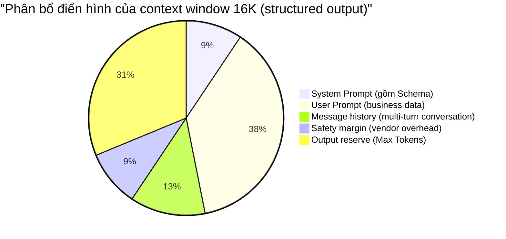

Ngay cả khi Temperature đã đặt bằng 0, structured output vẫn có thể parse thất bại; sau khi nhồi đầy tài liệu vào context, model vẫn có thể bỏ sót constraint quan trọng ở vị trí giữa. Các hiện tượng này cần được kiểm tra lần lượt từ Tokenization, context capacity và decoding strategy.

Để kiểm tra các vấn đề này, trước hết hãy xem một request gồm những Token nào, sau đó đối chiếu context budget cùng các decoding parameters như Temperature, Top-p và Top-k. Số lượng Token và phạm vi parameters trong bài chỉ dùng để giải thích cơ chế; chi phí thực tế và giới hạn capability vẫn phải căn cứ vào API docs của model mục tiêu và `usage` trong response.

## Vì sao Token và context quyết định cost và quality?

Khi bạn gõ “Thời tiết hôm nay thật” trong bộ gõ, nó sẽ tự động gợi ý “tốt”. LLM cũng dự đoán nội dung tiếp theo theo cách tương tự, chỉ khác là nó tham chiếu vài nghìn, thậm chí vài trăm nghìn ký tự phía trước. Mỗi lần generate một Token (một mảnh văn bản), model thêm nó vào context rồi dự đoán Token tiếp theo, cho đến khi câu trả lời kết thúc.

Quá trình này gọi là **Autoregressive Generation**.

Autoregressive Generation kết nối các khái niệm sau:

- **Token**: mảnh văn bản mà model “bổ sung” ở mỗi bước.
- **Context window**: tổng giới hạn Token mà model có thể xử lý trong một request; system prompt, message history, input hiện tại và output budget đều chiếm dung lượng.
- **Temperature / Top-p**: strategy chọn mảnh văn bản nào trong các candidate.
- **Max Tokens**: cho phép model “bổ sung” tối đa bao nhiêu bước.

Tokenizer nhận văn bản rồi tách thành các mảnh có kích thước khác nhau. Ví dụ, `Xin chào, tôi là G nhỏ.` có thể cho ra kết quả minh họa như sau:

- Văn bản gốc: `Xin chào, tôi là G nhỏ.`
- Phân tách: `[Xin chào]` `[,]` `[tôi là]` `[G nhỏ]` `[.]`
- Thống kê: 9 ký tự → 5 Token → compression ratio khoảng 1,8 lần


Phép tách này chỉ nhằm minh họa quy trình. Kết quả thực tế phụ thuộc vào Tokenizer của model mục tiêu; cùng một đoạn văn bản có thể cho ra Token sequence khác khi đổi vendor hoặc model version. OpenAI cũng cung cấp [Tokenizer tool](https://platform.openai.com/tokenizer) để xem trực tiếp kết quả phân tách.

Nếu luôn tách theo ký tự, vocabulary sẽ khá nhỏ nhưng sequence sẽ dài hơn; tách cố định theo từ có thể rút ngắn sequence, nhưng số lượng cụm từ tiếng Trung khiến vocabulary phình to nhanh chóng. Các **subword tokenization algorithms** như BPE và Unigram cân bằng giữa hai cách: cố gắng giữ các mảnh có tần suất cao thành một phần hoàn chỉnh, còn từ có tần suất thấp tiếp tục được tách nhỏ. Vì vậy, Token không có quan hệ tương ứng một-một cố định với ký tự hay từ. Một từ tiếng Anh có thể chiếm nhiều Token; tiếng Trung cũng có thể một từ chiếm nhiều Token hoặc nhiều ký tự hợp thành một Token.

Khi planning capacity, trước tiên có thể ước tính bằng kinh nghiệm: 1 Token tiếng Anh tương ứng khoảng 3~4 ký tự; tiếng Trung thường tương ứng 1~2 ký tự Hán, còn nội dung trộn ngôn ngữ sẽ tiếp tục dao động. Dữ liệu chính thức của DeepSeek đưa ra quy đổi 1 ký tự tiếng Anh tiêu thụ khoảng 0.3 Token, 1 ký tự tiếng Trung tiêu thụ khoảng 0.6 Token, tức mỗi Token tương đương khoảng 3.3 ký tự tiếng Anh hoặc 1.7 ký tự tiếng Trung.

Phiên bản Tokenizer cũng làm thay đổi kết quả quy đổi. Các model đời đầu (như GPT-3.5) có compression ratio tiếng Trung thấp hơn, khoảng 1 ký tự tương ứng 1.5~2 Token; GPT-4o sử dụng Tokenizer o200k_base với vocabulary khoảng 200 nghìn, Qwen2.5 có vocabulary khoảng 150 nghìn. Theo các phép đo hiện có, văn bản tin tức khoảng 1.5 ký tự/Token, tài liệu kỹ thuật khoảng 1.2 ký tự/Token, nhưng không nên dùng trực tiếp các con số này để thanh toán.

“Gần 1 ký tự 1 Token” chỉ có thể xảy ra với một số từ có tần suất cao. Ở giai đoạn budgeting, có thể dùng giá trị kinh nghiệm và chừa thêm margin; còn billing và monitoring thì đọc `usage` do API trả về. Sự mơ hồ của tiếng Trung, ký tự hiếm và thuật ngữ chuyên ngành có tần suất thấp được tách ở mức độ nào cũng ảnh hưởng đến cách model xử lý văn bản.

**Special Token**: ngoài Token tương ứng với nội dung văn bản, bên trong model còn dùng một số marker đặc biệt; các marker này cũng được tính vào tổng số Token:

| Special Token               | Công dụng                      | Ví dụ          |
| --------------------------- | ------------------------------ | -------------- |
| BOS (Beginning of Sequence) | Đánh dấu bắt đầu sequence      | `<s>`          |
| EOS (End of Sequence)       | Đánh dấu kết thúc sequence     | `</s>`         |
| PAD (Padding)               | Bù sequence ngắn khi batch     | `<pad>`        |
| Tool call marker            | Ranh giới của Function Calling | `<tool_call/>` |

Các Special Token này thường không hiển thị với user nhưng sẽ chiếm context window. Khi cần đếm chính xác, nên dùng Tokenizer tool chính thức thay vì tự ước tính.

### Token cost của multimodal input

Model hỗ trợ vision input sẽ chuyển image thành biểu diễn nội bộ và quy đổi thành input Token theo quy tắc riêng. Không thể ước tính con số này chỉ từ việc “có một image”:

- Vision model của OpenAI tính phí dựa trên model, kích thước image và chế độ `detail`. Với model dùng quy tắc chia block 512 pixel, low detail sử dụng một base quota cố định; high detail còn tăng Token theo số block sau scaling.
- Anthropic ước tính dựa trên số pixel sau scaling; công thức gần đúng chính thức là `tokens ≈ width × height / 750`. Một image 1024×1024 chưa bị scaling khoảng 1398 Token, không phải cố định 5 hoặc 85 Token.
- Gemini dùng quy tắc chia block khác nhau cho image nhỏ và image lớn. 258 Token trong tài liệu chính thức đi kèm điều kiện về kích thước, không thể áp dụng trực tiếp cho mọi image 1024×1024.

Model version sẽ làm thay đổi quy tắc tính phí image. Trước khi đưa vào production, nên dùng Token calculation API do vendor cung cấp hoặc công thức chính thức, đồng thời kiểm thử riêng thumbnail, screenshot, image dài và request nhiều image. Có thể tham khảo [OpenAI Images and Vision](https://developers.openai.com/api/docs/guides/images-vision), [Anthropic Vision](https://platform.claude.com/docs/en/build-with-claude/vision) và [Gemini Token Counting](https://ai.google.dev/gemini-api/docs/tokens).

Sau khi image đi vào multimodal RAG, cost này đồng thời ảnh hưởng đến budget và latency:

- Image Token phải được tính cùng Text Token vào budget của một request.
- Batch image sẽ làm tăng time to first token (TTFT), cần benchmark riêng.
- Nếu task chỉ cần OCR result, có thể extract text trước rồi gửi plain text vào model.

### Giới hạn capacity của context window

Con số 128K, 200K hoặc 1M mà model công bố là giới hạn Token mà một request có thể chứa. Window càng lớn, mỗi request có thể truyền nhiều document và conversation history hơn, nhưng capacity này còn phải chia cho system prompt, tool definition và model output. Phần lớn model tính input và output gộp chung; một số vendor (như Google Gemini) lại đặt riêng input limit và output limit.


- **Fixed content**: System Prompt, tool call Schema và format marker.
- **Input hiện tại**: User Prompt, message history và RAG retrieval chunk.
- **Generation budget**: output Token mà model sắp generate.

Sau khi trừ các phần này khỏi window được công bố, phần còn lại mới là không gian thực tế dành cho business data.

Lưu ý: context window (Context Window) ≠ maximum generation length. Nhiều model hỗ trợ context 128K, thậm chí 1M, nhưng output limit của mỗi request phụ thuộc model và API; tên parameter cũng có thể là `max_tokens`, `max_completion_tokens` hoặc `max_output_tokens`. Không được suy ra limit từ tên vendor; trước khi gọi, hãy đọc capability page của model mục tiêu.

Format message nhiều lượt của reasoning model cần phân biệt theo vendor:

- [DeepSeek Thinking Mode](https://api-docs.deepseek.com/guides/thinking_mode) trả riêng `reasoning_content` và `content` cuối cùng. Nếu không có tool call, không cần đưa `reasoning_content` của lượt trước vào context của lượt sau; ngay cả khi truyền vào, nó cũng bị bỏ qua. Nếu có tool call, `reasoning_content` của lượt hiện tại phải được gửi lại cùng tool result cho đến khi lượt đó hoàn tất.
- [OpenAI Reasoning Models](https://developers.openai.com/api/docs/guides/reasoning) không expose chain-of-thought gốc cho application. Responses API có thể tiếp tục context qua `previous_response_id`, hoặc gửi lại reasoning item theo yêu cầu của API; application nhận được reasoning summary tùy chọn, không phải reasoning text bên trong.

Reasoning Token có thể không xuất hiện trong message text của lượt sau, nhưng vẫn tiêu thụ generation budget của lượt hiện tại và có thể được tính vào output Token cũng như context limit. Không được từ đó kết luận chung rằng reasoning process không chiếm window hoặc không bị tính phí.

### Ràng buộc tính toán phía sau long context

Cơ chế **Self-Attention** của Transformer tạo ra ba loại cost cho long context:

- Computation cost tăng theo cấp số bình phương: nhu cầu tính toán có quan hệ bậc hai với sequence length (O(N²)). Khi input Token tăng gấp đôi, nhu cầu xử lý có thể tăng gấp bốn.
- Inference latency tăng: khi context dài hơn, model phải chú ý đến nhiều historical Token hơn khi generate mỗi Token mới, khiến time to first token TTFT tăng đáng kể.
- Security risk tăng: context dài hơn đồng nghĩa attack surface lớn hơn.

Các kỹ thuật như FlashAttention, GQA/MQA, Sliding Window Attention và Ring Attention có thể giảm computation hoặc memory usage, nhưng không biến mọi long context thành cost tuyến tính; O(N²) vẫn là theoretical complexity mà standard Self-Attention phải đối mặt.

### Biểu hiện thực tế của context overflow

System Prompt rõ ràng yêu cầu “phải output JSON”, nhưng model lại bỏ qua constraint này; đây là một trong những hiện tượng dễ quan sát nhất khi context quá dài. Answer cũng có thể lệch chủ đề ở nửa sau, hoặc không nắm được evidence thực sự liên quan vì có quá nhiều RAG chunk.

Đưa information vào window không có nghĩa model có thể tận dụng mọi position như nhau. “Lost in the middle” mô tả tình trạng model dễ tận dụng phần đầu và cuối hơn, còn khả năng retrieve nội dung ở giữa yếu hơn. Mở rộng window lên 1M cũng không tự động loại bỏ vấn đề này.

Long context còn có cost có thể monitoring trực tiếp: input Token tăng theo lượng content, kéo theo bill tăng; thời gian prefill và TTFT cũng dài hơn. Khi xuất hiện các signal này, trước hết nên kiểm tra số lượng retrieval chunk, việc cắt bớt message history và vị trí của information quan trọng, thay vì tiếp tục nhồi đầy window.

### Chênh lệch billing giữa input Token và output Token

Phần lớn vendor tính riêng input Token, cached input và output Token; reasoning model còn có thể tách riêng reasoning tokens. Đơn giá output thường cao hơn input, nhưng không tồn tại tỷ lệ ngành ổn định “2~4 lần”: model version, batching, cache hit và service tier đều làm thay đổi price.

Price table được cập nhật thường xuyên, không thích hợp để hard-code trong bài viết nguyên lý. Khi tính cost, cần đọc price page hiện tại của vendor, đồng thời lưu `model_version`, các loại `usage` và đơn giá thực tế trong gateway.

Khi tính cost, cần ghi riêng input, cached input, output và reasoning tokens do vendor trả về. Với RAG, trước hết kiểm soát số lượng retrieval chunk để tránh content không liên quan đẩy input Token tăng; output và reasoning process thì giới hạn bằng generation limit. Vì reasoning tokens thường được tính vào output-side cost, reasoning model còn cần theo dõi riêng phần usage này.

### Logic tiết kiệm của Prompt Caching

Batch evaluation thường gửi lặp lại cùng một System Prompt và chỉ thay sample ở cuối; multi-turn conversation cũng lặp lại một đoạn history cố định. Các request này có thể dùng **Prompt Caching** để tái sử dụng prefix. Khi request sau thỏa mãn các điều kiện về model, prefix length, content và validity period, phần cache hit sẽ được tính theo cached input và giảm một phần prefill computation.

Task có prefix cố định dài và tỷ lệ lặp cao sẽ dễ hưởng lợi hơn:

- Multi-turn conversation (System Prompt + Message history không đổi).
- RAG application (retrieval chunk có tỷ lệ lặp cao).
- Batch evaluation (cùng một System Prompt, khác resume/article).

Ngưỡng kích hoạt, cache lifetime và price của OpenAI Prompt Caching, Anthropic Prompt Caching và DeepSeek Context Caching không giống nhau; một số còn phân biệt automatic caching, explicit caching và extended caching. Trước khi cấu hình, hãy đọc tài liệu chính thức hiện tại; không hard-code cache duration và discount vào business code.

Thứ tự request content ảnh hưởng trực tiếp đến cache hit:

1. Đặt content không đổi ở trước (System Prompt, tool definition, RAG Context), content thay đổi ở sau (User Prompt).
2. Monitoring cached read Token và cached write Token theo response field của vendor để kiểm tra cache hit rate.
3. Với batch task, cố gắng hoàn thành trong cache time window.

### Công thức Token budget của một request

Hãy coi “context window” là một chiếc bucket có capacity cố định. Biểu đồ dưới đây minh họa cách phân bổ Token budget của một request điển hình:



Các giá trị trong biểu đồ chỉ mang tính minh họa. Với model generation thông thường, trước hết hãy kiểm tra quan hệ sau:

**window ≥ input_tokens + max_output_tokens**

Reasoning model cần được tính riêng theo định nghĩa parameter của API mục tiêu. Một số API có `max_output_tokens` hoặc `max_completion_tokens` đã bao gồm cả reasoning Token và visible answer; khi đó cộng thêm `reasoning_tokens` sẽ bị trùng. Một số API khác lại giới hạn riêng thinking process và final answer. Trước khi đưa vào production, có thể dùng `usage` trả về để suy ngược thành phần của một request thực tế rồi hiệu chỉnh công thức budget.

Trong đó, `input_tokens` ít nhất bao gồm:

- system prompt (gồm schema / tool definition)
- user prompt (gồm text thực tế sau khi thay variable)
- message history (khi có multi-turn conversation)
- RAG context (nếu đã ghép vào)

Output của structured task thường dễ kiểm soát hơn. Có thể xác định `max_output_tokens` trước rồi chừa 10%~20% safety margin cho input. Nếu budget vẫn không đủ, lần lượt giảm RAG Top-K, gộp các chunk trùng lặp, tóm tắt hoặc cắt ngắn field dài; task không thể chứa trong một lượt thì tách thành batch evaluation hoặc two-stage generation.

## Sampling parameters ảnh hưởng thế nào đến output stability?

### Từ logits đến probability sampling

Ở mỗi bước, model chấm điểm cho **từng** candidate Token trong vocabulary (bên trong gọi là **logits**); điểm càng cao nghĩa là model càng cho rằng Token đó nên xuất hiện ở vị trí này.

Ví dụ, giả sử model đang hoàn thiện câu “Thời tiết hôm nay thật \_\_”, nó có thể cho các điểm số sau:

| Candidate Token | Raw score (logit) |
| --------------- | ----------------- |
| tốt             | 5.0               |
| không tệ        | 3.2               |
| tuyệt           | 2.1               |
| tệ              | 0.5               |
| tím             | -8.0              |

Raw score chưa phải probability; cần qua **softmax** mới có probability distribution của các candidate Token. Sau khi transform, kết quả gần đúng là:

| Candidate Token | Probability  |
| --------------- | ------------ |
| tốt             | 81.21%       |
| không tệ        | 13.42%       |
| tuyệt           | 4.47%        |
| tệ              | 0.90%        |
| tím             | khoảng 0.00% |

Sau khi có probability distribution, model tiếp tục sampling để quyết định output Token nào.

Decoding parameters (Temperature, Top-p, Top-k, v.v.) áp dụng control trong quá trình “scoring → probability → random draw” này:

- Temperature: điều chỉnh “shape” của probability distribution, làm candidate điểm cao nổi bật hơn hoặc khiến các candidate đồng đều hơn.
- Top-p / Top-k: loại trực tiếp các candidate không đáng tin, thu nhỏ “sampling pool”.
- Penalty series: giảm điểm các word đã xuất hiện, ngăn “repetition”.

### Mức độ “mạo hiểm” của Temperature


Nguyên lý hoạt động của Temperature khá đơn giản: trước softmax, **chia** toàn bộ score cho giá trị temperature T.

**p(t) = softmax(z_t / T)**

Thay ví dụ “Thời tiết hôm nay thật \_\_” ở trên vào công thức, có thể thấy temperature thay đổi cùng một nhóm logits như thế nào:

| Temperature | Thay đổi của probability distribution                             | Kết quả ví dụ                                                       |
| ----------- | ----------------------------------------------------------------- | ------------------------------------------------------------------- |
| T = 0.2     | Distribution nhọn hơn, candidate probability cao tập trung hơn    | “tốt” khoảng 99.99%                                                 |
| T = 1.0     | Giữ distribution ban đầu                                          | “tốt” khoảng 81.21%, “không tệ” khoảng 13.42%                       |
| T = 1.5     | Distribution phẳng hơn, candidate probability thấp có thêm cơ hội | “tốt” khoảng 66.85%, “không tệ” khoảng 20.14%, “tuyệt” khoảng 9.67% |

Temperature càng thấp, output càng chắc chắn; temperature càng cao, output càng ngẫu nhiên.

Khuyến nghị engineering (giá trị kinh nghiệm, không phải hard rule):

| Scenario                                      | Temperature | Mô tả                                                        |
| --------------------------------------------- | ----------- | ------------------------------------------------------------ |
| Structured extraction / JSON output           | 0 ~ 0.3     | Kết hợp strict schema + retry khi parse fail                 |
| Evaluation / analysis / code review           | 0.4 ~ 0.8   | Cân bằng tính chắc chắn và độ đa dạng biểu đạt               |
| Creative content (copywriting, brainstorming) | 0.8 ~ 1.2+  | Tăng tính đa dạng nhưng chấp nhận risk về format consistency |

Nếu target API hỗ trợ `seed`, có thể lưu nó cùng model version cố định, Prompt cố định và sampling parameters cố định. `seed` thường chỉ cung cấp reproducibility theo kiểu best effort, không đảm bảo giống từng chữ; API hiện tại của DeepSeek cũng chưa công khai `seed`.

Các trường hợp sau vẫn có thể khiến result không nhất quán:

- Model version được update (underlying weight thay đổi).
- Request qua region khác nhau (các cluster khác nhau có thể deploy version khác nhau).
- Decoding implementation phía server, parallel computation và backend configuration thay đổi.

CI/CD có thể dành real LLM call cho smoke test; logic test cần tái hiện ổn định vẫn dùng Mock.

### “Sampling pool” của Top-p và Top-k

Temperature điều chỉnh shape của probability distribution. Top-p và Top-k truncate candidate set, loại các candidate ở phần đuôi khỏi sampling range.

Vẫn dùng ví dụ “Thời tiết hôm nay thật \_\_”:

| Candidate Token | Probability  | Cumulative probability |
| --------------- | ------------ | ---------------------- |
| tốt             | 81.21%       | 81.21%                 |
| không tệ        | 13.42%       | 94.63%                 |
| tuyệt           | 4.47%        | 99.10%                 |
| tệ              | 0.90%        | khoảng 100%            |
| tím             | khoảng 0.00% | 100%                   |

`Top-k = 3` giữ cố định ba candidate có probability cao nhất là “tốt, không tệ, tuyệt”; các candidate còn lại không tiếp tục tham gia sampling. `Top-p = 0.9` cộng dồn từ cao xuống thấp; trong ví dụ này, “tốt + không tệ” đã đạt 94.63%, nên candidate set chỉ giữ hai candidate đó; nếu riêng candidate đứng đầu đã vượt 90% thì chỉ giữ lại một candidate.

Top-k kiểm soát số lượng cố định, còn Top-p kiểm soát cumulative probability, nên số lượng candidate của Top-p thay đổi theo distribution. Khi kết hợp với Temperature, hành vi thường gặp như sau:

| Combination                            | Effect                                                                                             | Scenario                              |
| -------------------------------------- | -------------------------------------------------------------------------------------------------- | ------------------------------------- |
| T=0 (thường xử lý như greedy decoding) | Mỗi bước chọn score cao nhất; result vẫn chịu ảnh hưởng của model version và server implementation | Structured output, scenario ít random |
| Low temperature + Top-p=0.9            | Tương đối ổn định nhưng cho phép cách diễn đạt thay đổi đôi chút                                   | Analysis report, summary              |
| Medium-high temperature + Top-p=0.95   | Tính đa dạng cao hơn nhưng loại các candidate cực kỳ vô lý                                         | Creative writing, conversation        |

Lưu ý: dù greedy decoding ổn định nhất, nó có thể dễ rơi vào repetition loop hơn.

### Stop condition và risk bị truncate

Khi generation đạt Max Tokens, model sẽ dừng ngay cả khi JSON còn thiếu dấu ngoặc đóng hoặc list chưa viết xong. Khi server trả về `finish_reason=length`, cần đánh dấu result là truncated và không được tiếp tục giao cho downstream thực thi.

Stop Sequences khiến model kết thúc sớm khi generate đúng string được chỉ định, ví dụ `"\n\n"` hoặc `"```"`. Nếu stop word trùng với business text, các field quan trọng cũng có thể bị truncate. Structured output cần kiểm thử riêng hai failure path: đạt generation limit và vô tình chạm stop word.

Reasoning model còn cần xác nhận generation limit có đồng thời bao gồm reasoning process và final answer hay không. Một số API dùng chung một generation budget; reasoning Token dùng càng nhiều thì visible answer còn lại càng ít. Một số API khác điều khiển gián tiếp lượng reasoning qua các parameter như `reasoning_effort`. Khi gặp `finish_reason=length`, cần kiểm tra cả reasoning Token và final answer.

### Penalty và vấn đề repetition

Có thể bạn từng gặp model liên tục output cùng một câu, hoặc lặp lại cùng một ý trong answer dài. Penalty parameters dùng để giảm vấn đề này; khi decoding, chúng **giảm score của các Token đã xuất hiện**:

| Parameter          | Công dụng                                                      | Cách hiểu đơn giản                      |
| ------------------ | -------------------------------------------------------------- | --------------------------------------- |
| Repetition Penalty | Giảm probability của mọi Token đã xuất hiện                    | “Từ đã nói rồi, nói lại sẽ bị trừ điểm” |
| Presence Penalty   | Chỉ cần Token từng xuất hiện là bị trừ điểm (không xét số lần) | “Khuyến khích nói chủ đề mới”           |
| Frequency Penalty  | Token xuất hiện càng nhiều thì bị trừ điểm càng nặng           | “Một từ đã nói ba lần? Phạt nặng”       |

JSON object có thể lặp lại các field name như `"name"` và `"score"`; Repetition Penalty quá cao sẽ đồng thời giảm score của những lần lặp cần thiết này, khiến result có thể thiếu field. Khi dùng Presence Penalty cho RAG Q&A, model sẽ có xu hướng đưa vào các từ mới không xuất hiện trong retrieval content, đồng thời làm giảm độ faithful của answer với evidence.

Định nghĩa Penalty không hoàn toàn giống nhau giữa các vendor. Khi chưa có căn cứ tuning rõ ràng, nên giữ default value, sau đó dùng output length, Prompt constraint và Schema để kiểm soát structure; như vậy path kiểm tra sẽ rõ ràng hơn.

### Giới hạn parameters của chain-of-thought mode

Phạm vi parameters mà reasoning model hỗ trợ phụ thuộc API cụ thể; không thể gộp DeepSeek Thinking Mode và OpenAI Reasoning Model thành cùng một behavior.

- DeepSeek V4 Thinking Mode trả về `reasoning_content` và `content` cuối cùng, đồng thời liệt kê rõ các sampling parameters không được hỗ trợ hoặc không có hiệu lực.
- OpenAI không trả về reasoning process nội bộ gốc. Responses API có thể trả reasoning item và summary tùy chọn; các reasoning model khác nhau cũng có thể hỗ trợ `temperature`, `top_p` và các parameter khác khác nhau.

Trước khi gọi, cần filter parameter không được hỗ trợ theo model capability table. Stability của structure vẫn phải dựa vào Structured Outputs, server-side validation và failure handling, không thể chỉ tuning Temperature.

### Streaming output và time to first token

Synchronous API phải chờ generate xong toàn bộ content mới trả về; streaming API sẽ push incremental sau mỗi một hoặc vài Token, nên user thấy Token đầu tiên sớm hơn và time to first token (TTFT, Time-To-First-Token) cũng thấp hơn. Điểm dễ nhầm ở đây là time to first token, total latency và cost:

- Streaming output không nhất thiết giảm total latency (E2E latency); tổng số Token model generate không vì thế mà giảm.
- Streaming output không tự động tiết kiệm cost; Token billing không đổi và vẫn chịu rate limit cùng quota.
- Nếu cần structured output (như JSON), streaming scenario cần xử lý “JSON bán thành phẩm” ở frontend/gateway layer.

### Logprobs và kiểm tra confidence

Một số API (như OpenAI) hỗ trợ trả về **log probability** (logprobs) của từng Token được generate; có thể hiểu đây là “mức độ chắc chắn” của model với Token đó. Logprob càng gần 0, model càng chắc chắn; giá trị càng nhỏ (như -5.0), model càng “do dự”.

Scenario ứng dụng trong engineering:

- **Đánh giá confidence**: khi extract “amount: 1000”, nếu logprob của Token tương ứng rất thấp, model không chắc chắn và có thể cần human review.
- **Anomaly detection**: monitoring average logprob của output model trong production; nếu đột ngột giảm, có thể đó là dấu hiệu Prompt drift hoặc input data bất thường.
- **So sánh nhiều candidate**: lấy Top-N candidate Token và probability của chúng để correction hoặc ranking lần hai.

Lưu ý: logprobs làm tăng response body và không phải vendor nào cũng hỗ trợ. Hãy đọc API docs trước khi sử dụng.

### Khuyến nghị cấu hình sampling parameters

| Scenario                         | Temperature    | Top-p          | Penalty        | Khuyến nghị khác                                          |
| -------------------------------- | -------------- | -------------- | -------------- | --------------------------------------------------------- |
| JSON / structured output         | 0 ~ 0.3        | 1.0            | Giữ default    | Kết hợp Strict Mode + retry strategy                      |
| Code review / technical analysis | 0.4 ~ 0.7      | 0.9            | Giữ default    | Kết hợp CoT Prompt                                        |
| Multi-turn conversation          | 0.6 ~ 0.8      | 0.9            | Bật vừa phải   | Kiểm soát độ dài message history                          |
| Creative writing / brainstorming | 0.8 ~ 1.2      | 0.95           | Bật khi cần    | Chấp nhận output đa dạng, làm post-processing             |
| Reasoning model                  | Đọc model docs | Đọc model docs | Đọc model docs | Filter parameter không hỗ trợ, giữ server-side validation |

## Nên lưu lại dữ liệu nào khi đưa vào production?

Capacity planning dựa trên Token; billing và alert lấy `usage` do API trả về làm chuẩn. Mỗi request ít nhất cần lưu model version, input Token, cached Token, reasoning Token (nếu vendor trả về), output Token, strategy cắt context và sampling parameters.

Long context chỉ tăng lượng information có thể chứa, không đảm bảo model tận dụng mọi position như nhau. Structured task còn cần kết hợp Schema và server-side validation; khi cần tái hiện experiment, hãy cố định model version, Prompt, input và decoding parameters, đồng thời chấp nhận một mức non-determinism nhỏ vẫn có thể đến từ dịch vụ của vendor.
