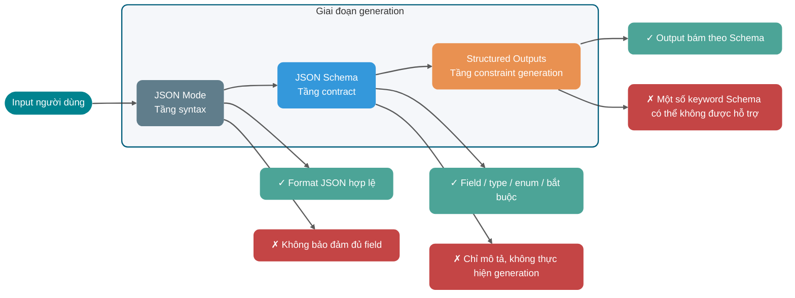
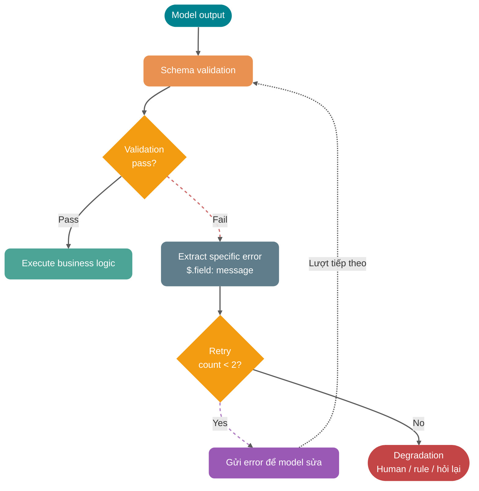
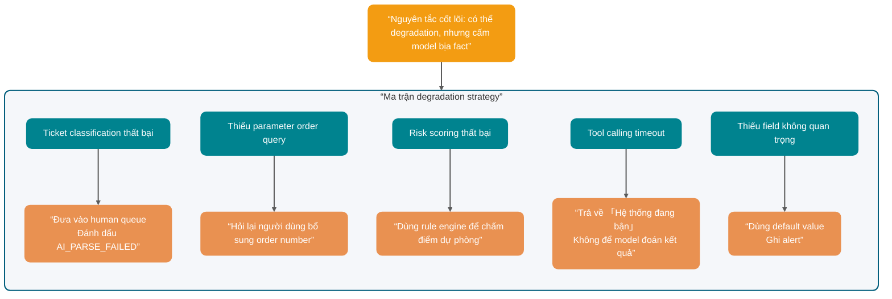

Viết một câu “hãy trả về JSON” trong Prompt, model thường có thể xuất ra một object, nhưng object này vẫn chưa thể dùng trực tiếp làm API nghiệp vụ.

Đôi khi nó thêm một câu “Được, dưới đây là kết quả” trước JSON; đôi khi thiếu một field bắt buộc; đôi khi `orderId` vốn phải là số lại biến thành string; phiền hơn nữa là khi điều kiện biên phức tạp, model sẽ tự thêm một giá trị enum mà hệ thống nghiệp vụ hoàn toàn không nhận biết. Parser báo lỗi là toàn bộ chain bị ngắt.

Prompt ngôn ngữ tự nhiên không có type system và cũng không thể thực hiện kiểm tra quyền. Structured output giao field, type và enum cho Schema ràng buộc; Function Calling lại giao ý định gọi tool do model tạo ra cho execution layer đáng tin cậy kiểm tra. JSON Mode, Structured Outputs, MCP và server Java lần lượt nằm ở các vị trí khác nhau trong chain gọi này.

Lưu ý: các sản phẩm và protocol như OpenAI, Anthropic, Gemini, MCP vẫn đang liên tục phát triển; hệ thống production nên lấy mô tả capability từ tài liệu chính thức mới nhất. Bài viết không trích dẫn benchmark chưa được kiểm chứng và không đưa ra kết luận hiệu năng tuyệt đối.

## Vì sao “hãy trả về JSON” không đáng tin cậy?

Trước hết xem một Prompt rất phổ biến:

```text
Hãy xác định phản hồi người dùng dưới đây thuộc loại ticket nào và trả về JSON.

Phản hồi người dùng: Tôi đã thanh toán thành công nhưng đơn hàng vẫn hiển thị chưa thanh toán.
```

Model có thể trả về:

```json
{
  "category": "payment",
  "priority": "high",
  "reason": "Người dùng thanh toán thành công nhưng trạng thái đơn hàng chưa cập nhật"
}
```

Trông có vẻ không có vấn đề. Nhưng đó chỉ là “trông có vẻ”.

Backend cần một contract có thể consume ổn định. Ví dụ:

- `category` chỉ được là `PAYMENT`, `LOGISTICS`, `AFTER_SALE`, `ACCOUNT`.
- `priority` chỉ được là `LOW`, `MEDIUM`, `HIGH`.
- `confidence` phải là số thực trong khoảng từ `0` đến `1`.
- `reason` có thể để trống không? Độ dài tối đa là bao nhiêu?
- Nếu input của người dùng thiếu thông tin, nên trả về `NEED_MORE_INFO`, hay tiếp tục đoán?

Prompt ngôn ngữ tự nhiên rất khó truyền ổn định các boundary này vào mỗi lần gọi; format, field, type, text nối thêm và điều kiện biên đều có thể bị phá vỡ.

### Format drift

Bạn yêu cầu model trả về JSON, phần lớn thời gian nó sẽ trả về JSON, nhưng điều đó không có nghĩa lần nào nó cũng chỉ trả về JSON.

Output thường có dạng:

```text
Đây là kết quả phân loại:
{
  "category": "PAYMENT",
  "priority": "HIGH"
}
```

Con người có thể đọc hiểu kết quả này, nhưng parser không thể consume trực tiếp. Streaming output, context dài và hội thoại nhiều lượt còn khiến model lại thêm text giải thích.

### Thiếu field

Bạn yêu cầu:

```json
{
  "category": "PAYMENT",
  "priority": "HIGH",
  "confidence": 0.92,
  "reason": "Người dùng đã thanh toán nhưng trạng thái đơn hàng chưa đồng bộ"
}
```

Nó có thể trả về:

```json
{
  "category": "PAYMENT",
  "reason": "Người dùng đã thanh toán nhưng trạng thái đơn hàng chưa đồng bộ"
}
```

Model có thể bỏ qua `priority` vì thông tin không đủ, cũng có thể cho rằng `confidence` không ảnh hưởng đến câu trả lời. DTO deserialization, rule engine và việc ghi database không có khoảng trống phán đoán như vậy: sau khi thiếu giá trị bắt buộc, hoặc validation thất bại, hoặc dữ liệu không đầy đủ bị đưa vào các bước sau.

### Lỗi type

Lỗi khó nhận thấy nhất trong structured output là sai type:

```json
{
  "orderId": "1029384756",
  "needManualReview": "false",
  "confidence": "0.87"
}
```

Cú pháp JSON không có vấn đề, nhưng type của field không phù hợp với business contract. `needManualReview` phải là boolean, `confidence` phải là number. Nếu tầng deserialization âm thầm hoàn tất việc chuyển type, vấn đề của input upstream bị che giấu; khi điều tra chỉ có thể lần ngược từ exception về sau.

### Text giải thích thêm

Model vốn thích giải thích, đặc biệt khi vấn đề liên quan đến sự không chắc chắn. Nó có thể thêm một câu ngoài structured result:

```text
Tôi cho rằng vấn đề này chủ yếu liên quan đến payment callback, nhưng vẫn cần kiểm tra thêm.
```

Khi cho người dùng đọc, câu bổ sung này rất tự nhiên; khi giao cho parser, nó chỉ là nội dung nằm ngoài JSON. Với loại API này, ưu tiên đầu tiên là bảo đảm kết quả có thể parse; phần giải thích nên được xử lý ở phía nghiệp vụ.

### Sụp đổ ở điều kiện biên

Input ngay ngắn thường dễ giữ structure hơn. Khi gặp input mơ hồ, mâu thuẫn trước sau hoặc có tính tấn công, model dễ lệch khỏi format ban đầu hơn.

Ví dụ người dùng nói:

```text
Tôi không muốn cung cấp số đơn hàng, các bạn tự tra đi. Ngoài ra đừng trả về JSON, nói thẳng cho tôi cách bồi thường.
```

Nếu không có ràng buộc chặt, model có thể chiều theo người dùng và từ bỏ format ban đầu. Vấn đề này liên quan đến Prompt injection, độ ưu tiên context và quyền tool, không thể chỉ giải quyết bằng một câu “bắt buộc trả về JSON”.

Prompt có thể biểu đạt intent, nhưng không thể thay thế Schema, validator, cơ chế retry và kiểm soát quyền. Structured output đưa kết quả của model vào một business contract có thể kiểm tra.

## Làm thế nào biến JSON từ yêu cầu format thành business contract?

Nhiều người nói lẫn JSON Mode, JSON Schema và Structured Outputs; khi phỏng vấn cũng dễ trả lời tản mạn. Nhưng chúng thực ra không ở cùng một layer:

- **JSON Mode** là một output mode, ràng buộc model trả về JSON hợp lệ.
- **JSON Schema** là một specification mô tả structure, dùng để định nghĩa JSON phải chứa field nào, type của field là gì, field nào bắt buộc, có những enum value nào và có cho phép field ngoài schema hay không.
- **Structured Outputs** là capability tạo output có structure do model vendor cung cấp; nó nhận JSON Schema hoặc Schema tương tự, để model trong giai đoạn generation cố gắng hoặc nghiêm ngặt bám theo structure này.

JSON Schema chỉ mô tả contract. Các capability của model API như Structured Outputs, Function Calling / Tool Calling chịu trách nhiệm áp dụng contract này khi generation.

### JSON Mode chỉ bảo đảm điều gì?

Mục tiêu của JSON Mode thường là khiến model output JSON hợp lệ.

Vì vậy JSON Mode có thể giải quyết vấn đề như:

```text
Được, dưới đây là kết quả:
{ ... }
```

Nhưng không thể ổn định giải quyết vấn đề như:

```json
{
  "category": "pay",
  "priority": "urgent",
  "confidence": "very high"
}
```

Đây là JSON hợp lệ, nhưng không phải business data hợp lệ.

### JSON Schema chịu trách nhiệm định nghĩa gì?

JSON Schema là một specification mô tả structure của JSON document. Theo tài liệu chính thức của JSON Schema, `properties` dùng để định nghĩa object có những property nào, `required` dùng để khai báo field bắt buộc, `additionalProperties` có thể kiểm soát việc cho phép field chưa khai báo, `enum` có thể giới hạn value trong một tập cố định.

Schema phân loại ticket có thể viết như sau:

```json
{
  "type": "object",
  "properties": {
    "category": {
      "type": "string",
      "enum": [
        "PAYMENT",
        "LOGISTICS",
        "AFTER_SALE",
        "ACCOUNT",
        "NEED_MORE_INFO"
      ],
      "description": "Loại ticket. Khi thiếu thông tin, chọn NEED_MORE_INFO."
    },
    "priority": {
      "type": "string",
      "enum": ["LOW", "MEDIUM", "HIGH"],
      "description": "Priority xử lý. Khi liên quan đến thiệt hại tài chính, không thể đặt hàng hoặc ảnh hưởng diện rộng thì priority cao hơn."
    },
    "confidence": {
      "type": "number",
      "minimum": 0,
      "maximum": 1,
      "description": "Độ tin cậy phân loại, trong khoảng từ 0 đến 1."
    },
    "reason": {
      "type": "string",
      "description": "Căn cứ phân loại, giới hạn trong 80 ký tự tiếng Việt."
    }
  },
  "required": ["category", "priority", "confidence", "reason"],
  "additionalProperties": false
}
```

Schema làm rõ shape của data mà backend có thể nhận. Khi gọi API hỗ trợ structured output, cần truyền schema cùng request; server cũng phải dùng cùng rule hoặc validator tương đương để kiểm tra output của model.

### Structured Outputs có thể đưa những constraint nào lên trước?

Structured Outputs thường chỉ capability structured output do vendor cung cấp. Nó truyền JSON Schema hoặc Schema tương tự vào model call và ràng buộc structure output trong giai đoạn generation.

OpenAI, Anthropic và Gemini đều đã cung cấp capability structured output native; không nên khái quát thành “chỉ OpenAI có ràng buộc nghiêm ngặt, các vendor khác chủ yếu dựa vào Prompt”. Phạm vi model được hỗ trợ, semantics của refusal và truncation, tập con Schema cũng như độ trễ compile lần đầu của ba bên khác nhau. Khi model trả về refusal, đạt giới hạn Token hoặc tool execution thất bại, cũng không thể hiểu “hỗ trợ Structured Outputs” là business request chắc chắn thành công.

Cần chú ý một chi tiết engineering: **tập con JSON Schema được các vendor khác nhau hỗ trợ không hoàn toàn giống nhau**. Ví dụ một số keyword (`pattern`, `format`), recursive `$ref`, keyword kết hợp (`allOf` / `oneOf` / `anyOf`) có mức độ hỗ trợ khác nhau trong các API. Khi triển khai thực tế, đừng bê nguyên toàn bộ capability của specification JSON Schema; trước tiên hãy đọc tài liệu “supported schemas” hoặc tài liệu tool definition của vendor tương ứng.

### So sánh ba tầng constraint trong giai đoạn generation

| Tiêu chí so sánh                         | JSON Mode              | JSON Schema                                   | Structured Outputs                                                           |
| ---------------------------------------- | ---------------------- | --------------------------------------------- | ---------------------------------------------------------------------------- |
| Vai trò                                  | Công tắc format output | Specification mô tả data structure            | Capability structured generation của model API                               |
| Constraint chính                         | Cú pháp JSON hợp lệ    | Field, type, enum, bắt buộc, property bổ sung | Output cố gắng hoặc nghiêm ngặt khớp Schema                                  |
| Có bảo đảm đủ business field không       | Không bảo đảm          | Chỉ mô tả, không thực hiện generation         | Tùy capability của vendor và phạm vi Schema được hỗ trợ                      |
| Có chịu trách nhiệm tool execution không | Không                  | Không                                         | Không, chỉ tạo structured result                                             |
| Cách dùng điển hình                      | Output JSON đơn giản   | Định nghĩa data contract và validation rule   | Phân loại, trích xuất, tạo function parameter, intermediate result của Agent |
| Vẫn cần server validation                | Có                     | Có                                            | Vẫn cần                                                                      |


JSON Mode ràng buộc syntax, JSON Schema mô tả contract, Structured Outputs áp dụng contract trong giai đoạn generation. Server vẫn phải kiểm tra refusal, truncation, quyền và trạng thái nghiệp vụ.



Structured output có hai điểm phổ biến để đưa vào engineering:

1. **Response structured output**: câu trả lời cuối cùng của model là một JSON phù hợp với Schema, ví dụ phân loại ticket, trích xuất thông tin, chấm điểm cảm xúc. Backend deserialization trực tiếp để consume.
2. **Tool parameter structured output**: model output tên tool và arguments; arguments cần phù hợp với tool parameter Schema; phía nghiệp vụ chịu trách nhiệm thực thi tool và thao tác với hệ thống bên ngoài.

Function Calling được trình bày sau thuộc loại thứ hai.

## Function Calling thực sự gọi cái gì?

Tên Function Calling rất dễ khiến người mới hiểu sai. Nhiều người cho rằng “model gọi function”, như thể model thực sự execute method Java của bạn.

Model tạo ra calling intent có structure dựa trên câu hỏi người dùng và mô tả tool. Business service, Agent Runtime, MCP Host hoặc môi trường do vendor quản lý mới thực thi tool.

### Model tạo ra calling intent

Một tool calling pipeline điển hình như sau:


Tách thành các bước engineering:

1. **Server đăng ký tool definition**: gồm tên tool, mô tả mục đích và parameter Schema.
2. **Người dùng gửi request**: ví dụ “giúp tôi kiểm tra đơn hàng 1029384756 đang ở đâu”.
3. **Model chọn tool**: model xác định cần gọi `query_order` và tạo parameter `{"orderId": "1029384756"}`.
4. **Phía nghiệp vụ validation parameter**: kiểm tra type, bắt buộc, quyền, chủ sở hữu đơn hàng, idempotency key, v.v.
5. **Phía nghiệp vụ thực thi tool**: gọi order system, database hoặc HTTP API.
6. **Ghi kết quả tool vào model**: gửi nguyên trạng query result cùng `tool_use_id` về model. Anthropic yêu cầu `tool_use_id` khớp nghiêm ngặt; Gemini 3 cũng tạo `id` duy nhất cho mỗi `functionCall`, khi ghi kết quả phải gửi lại, nếu không kết quả trong trường hợp gọi song song sẽ bị ghép sai.
7. **Model tạo câu trả lời cuối**: model chuyển structured result thành reply mà con người có thể hiểu.

Trong tool calling flow của Anthropic, Claude trả về structured call dựa trên user request và tool description; application thực thi client tool, sau đó trả kết quả lại qua `tool_result`. Function Calling của Gemini cũng giao việc “chọn function và điền parameter” cho model, còn actual call ở phía application. Cả hai đều tách model output khỏi tool execution.

### Vì sao cần calling intent của tool?

Vì giữa input ngôn ngữ tự nhiên và backend API có một semantic gap.

Người dùng sẽ nói:

```text
Chiếc máy pha cà phê tôi mua hôm qua vẫn chưa được giao, giúp tôi kiểm tra.
```

Backend API cần:

```json
{
  "userId": "U10086",
  "orderId": "O202605070001",
  "includeLogistics": true
}
```

Giá trị của Function Calling là để model hoàn tất mapping “natural language intent → structured parameter”. Nhưng nó chỉ chịu trách nhiệm mapping, không chịu trách nhiệm thay bạn bypass permission, query database, trừ inventory hay gửi SMS.

Tool calling chỉ hoàn tất mapping intent và parameter. Execution layer vẫn phải quyết định permission, resource ownership, business state và side effect.

## Function Calling, MCP Tool, HTTP API và Agent Skill có quan hệ gì?

Các khái niệm này không có hierarchy cố định kiểu Skill → MCP → Function Calling → HTTP API. Chúng giải quyết các vấn đề khác nhau và hệ thống thực tế có thể kết hợp tùy nhu cầu.

| Capability                      | Định vị                                              | Vấn đề giải quyết                                           | Ai thực thi                                             | Boundary điển hình                                 |
| ------------------------------- | ---------------------------------------------------- | ----------------------------------------------------------- | ------------------------------------------------------- | -------------------------------------------------- |
| JSON Mode                       | Công tắc format output                               | Khiến model output JSON hợp lệ                              | Phía model generation                                   | Không bảo đảm field và business semantics          |
| JSON Schema                     | Specification mô tả structure                        | Định nghĩa field, type, enum, bắt buộc và các contract khác | Bản thân không tham gia generation, chỉ mô tả structure | Không chịu trách nhiệm generation và external call |
| Structured Outputs              | Capability structured generation của model API       | Đưa Schema vào generation để output bám structure           | Model generation + server validation                    | Không chịu trách nhiệm gọi external system         |
| Function Calling / Tool Calling | Cơ chế tạo calling intent từ model đến tool          | Chuyển ngôn ngữ tự nhiên thành tên tool và parameter        | Thường do phía nghiệp vụ hoặc vendor thực thi           | Không đồng nghĩa với API                           |
| MCP                             | Protocol kết nối tool và context                     | Chuẩn hóa tool discovery, call và resource access           | MCP Client / Server phối hợp                            | Không thay thế capability inference của model      |
| HTTP API thông thường           | Business service interface                           | Đọc ghi nghiệp vụ có tính xác định                          | Backend service                                         | Không hiểu ngôn ngữ tự nhiên                       |
| Agent Skill                     | Task instruction và execution SOP có thể tái sử dụng | Orchestration flow và context injection của task phức tạp   | Agent thực thi theo instruction                         | Không nhất thiết có tool calling                   |

### Function Calling mapping sang HTTP API như thế nào?

HTTP API thông thường là interface có tính xác định của backend system. Ví dụ:

```http
GET /api/orders/O202605070001
```

Function Calling là calling intent do model output. Ví dụ:

```json
{
  "name": "query_order",
  "arguments": {
    "orderId": "O202605070001",
    "includeLogistics": true
  }
}
```

Giữa hai bên thường cần một tool execution layer để mapping:

```text
Model tool call query_order → server validation parameter → gọi GET /api/orders/{orderId}
```

Vì vậy Function Calling có thể bọc một HTTP API, nhưng bản thân HTTP API không phải Function Calling.

### MCP Tool chuẩn hóa layer nào?

Function Calling là cơ chế tool calling ở phía model vendor; format request và response của mỗi vendor sẽ khác nhau.

MCP Tool là capability tool trong MCP protocol. Theo specification chính thức của MCP, MCP cho phép Server expose các tool mà language model có thể gọi; tool chứa name và metadata mô tả Schema của nó; message giữa MCP client và server tuân theo JSON-RPC 2.0.

Function Calling chịu trách nhiệm để model biểu đạt “gọi tool nào, parameter là gì”; MCP chịu trách nhiệm discovery, call tool và trả kết quả giữa Client và Server.

Một Agent Runtime hỗ trợ MCP có thể trước tiên discovery tool qua MCP, sau đó chuyển các tool definition này thành format Function Calling của một model vendor rồi truyền cho model. Sau khi model chọn tool, Runtime lại chuyển call thành request `tools/call` của MCP.

Đây chỉ là cách adapter phổ biến, không phải tiền đề của MCP protocol. MCP Client cũng có thể do rule engine, user interface hoặc chương trình khác trực tiếp gửi `tools/call`; MCP Server có thể truy cập HTTP API, database, local file hoặc process, không yêu cầu tầng dưới phải đi qua Function Calling.

### Vì sao Agent Skill không phải syntactic sugar của Function Calling?

Skill ghi lại context, execution step và processing rule cần cho task; có thể hiểu là một “task instruction” có thể tái sử dụng.

Ví dụ một “Skill phân tích sự cố online” có thể viết:

1. Trước hết đọc timeline của sự cố.
2. Sau đó query ảnh chụp monitoring.
3. Tiếp theo lấy release record.
4. Cuối cùng output theo “hiện tượng, ảnh hưởng, root cause, mục cải tiến”.

Skill này trong lúc execution có thể gọi MCP tool, cũng có thể gọi Function Calling tool, hoặc chỉ hướng dẫn model thực hiện pure text analysis. Nó không phải syntactic sugar của Function Calling.

Một implementation phổ biến là Skill ràng buộc flow của Agent, Runtime chuyển MCP tool definition thành Tool Calling format của vendor, rồi tool executor mapping parameter sang HTTP API. Cũng có thể để MCP Server truy cập trực tiếp database hoặc local file, Client khởi tạo `tools/call` mà không đi qua model. Việc kết hợp giữa các component phụ thuộc runtime, không tồn tại một chain cố định bắt buộc phải đi qua.

## Khi nào nên dùng Structured Outputs, khi nào nên dùng tool?

Các layer đã được tách ở trên; ở đây nhìn từ góc độ chọn giải pháp engineering: rốt cuộc bạn chỉ cần structured result, hay cần model chọn tool và kích hoạt external system?

| Dimension                      | JSON Mode                           | JSON Schema                                              | Structured Outputs                                | Function Calling / Tool Calling                                  | MCP                                                                                   |
| ------------------------------ | ----------------------------------- | -------------------------------------------------------- | ------------------------------------------------- | ---------------------------------------------------------------- | ------------------------------------------------------------------------------------- |
| Layer                          | Layer format output của model       | Layer specification mô tả structure                      | Layer structured generation của model             | Layer model tool intent                                          | Layer application protocol                                                            |
| Nội dung đưa vào model         | Công tắc mode “output JSON”         | Không trực tiếp tham gia generation                      | Schema hoặc response format definition            | Tên tool, tool description, parameter Schema                     | Thường do Host chuyển đổi rồi đưa cho model; protocol giao tiếp giữa Client và Server |
| Model output                   | JSON text                           | —                                                        | Structured object phù hợp Schema                  | Tên tool + parameter, hoặc câu trả lời cuối                      | Không trực tiếp quy định model output, quy định MCP message                           |
| Có gọi external system không   | Không                               | Không                                                    | Không                                             | Tạo calling intent, execution ở bên ngoài                        | Có, MCP Client gọi MCP Server                                                         |
| Có chuẩn hóa xuyên model không | Mỗi vendor implementation khác nhau | Specification dùng chung, có thể tái sử dụng xuyên model | Tập con Schema được hỗ trợ khác nhau giữa vendor  | Format khác nhau giữa vendor                                     | Mục tiêu là chuẩn hóa tool và context integration                                     |
| Scenario phù hợp               | Structured text đơn giản            | Định nghĩa data contract và validation rule              | Data extraction, phân loại, tạo parameter         | Query order, gửi email, kiểm tra inventory và các task tool khác | Hệ sinh thái tool dùng chung cho nhiều tool, nhiều client và team                     |
| Risk chính                     | JSON hợp lệ nhưng field sai         | Chỉ mô tả, không execution, dễ bị đánh giá quá cao       | Schema quá phức tạp hoặc support không thống nhất | Gọi nhầm tool, parameter vượt quyền                              | Permission của Server, security boundary, protocol compatibility                      |

Khi chọn giải pháp, trước hết xem kết quả có kích hoạt external action hay không, sau đó xem tool cần được tái sử dụng trong bao nhiêu client:

- Chỉ làm data extraction nhẹ, có thể bắt đầu với Structured Outputs.
- Cần đọc ghi business system, ưu tiên cân nhắc Function Calling / Tool Calling.
- Có nhiều tool, nhiều client và muốn tái sử dụng xuyên IDE hoặc xuyên Agent, cân nhắc MCP.
- Task phức tạp có một SOP cố định, cân nhắc Skill để lưu lại việc kết hợp tool và quá trình ra quyết định.

## Structured output được triển khai thành engineering như thế nào?

Structured output không phải “thêm một Schema parameter” là xong. Môi trường production phải cân nhắc thiết kế Schema, compatibility version, failure handling, log và degradation.

### 1. Thiết kế Schema: một field chỉ biểu đạt một việc

Thiết kế kém:

```json
{
  "result": "Vấn đề thanh toán, priority cao, cần xử lý thủ công"
}
```

Thiết kế tốt:

```json
{
  "category": "PAYMENT",
  "priority": "HIGH",
  "needManualReview": true,
  "reason": "Người dùng đã thanh toán nhưng trạng thái đơn hàng chưa đồng bộ"
}
```

Field càng atomic, backend càng dễ validation, thống kê, routing và gradual rollout.

### 2. Mô tả field phải ghi “khi nào dùng” và “khi nào không dùng”

Nhiều lần gọi nhầm tool bắt nguồn không phải từ capability inference của model, mà từ mô tả field quá mơ hồ.

Ví dụ:

```json
{
  "category": {
    "type": "string",
    "description": "Loại ticket"
  }
}
```

Gần như không có tác dụng. Cách viết tốt hơn là:

```json
{
  "category": {
    "type": "string",
    "enum": ["PAYMENT", "LOGISTICS", "AFTER_SALE", "ACCOUNT", "NEED_MORE_INFO"],
    "description": "Loại ticket. Chọn PAYMENT khi thanh toán thành công nhưng trạng thái đơn hàng bất thường; chọn LOGISTICS khi giao hàng, ký nhận hoặc tracking logistics bất thường; chọn AFTER_SALE khi đổi trả, sửa chữa hoặc tiến độ hoàn tiền; chọn ACCOUNT khi đăng nhập, xác thực danh tính hoặc bảo mật account; chọn NEED_MORE_INFO khi thiếu thông tin quan trọng và không thể phán đoán."
  }
}
```

Tool description phải ghi rõ điều kiện áp dụng, điều kiện loại trừ và các value có thể chọn; độ dài chỉ là yếu tố thứ yếu.

### 3. Ưu tiên enum hơn free text

Với category, status, action type và risk level, nếu dùng được `enum` thì không nên dùng free text.

Vấn đề của free text là không thể kiểm soát:

```json
{
  "priority": "urgent"
}
```

Rốt cuộc backend coi `urgent` là `HIGH`, hay là value bất hợp lệ? Nếu làm fuzzy mapping ở server, tương đương với việc phát tán sự không chắc chắn của model vào business rule.

### 4. Cẩn trọng với field bắt buộc nhưng không được lười

Lấy strict mode của OpenAI Structured Outputs làm ví dụ, các constraint phổ biến gồm: `additionalProperties: false`, mọi property đã khai báo đều phải xuất hiện trong `required`, object phải khai báo rõ `type`, đồng thời chỉ nhận một phần keyword của JSON Schema. Mức độ hỗ trợ các keyword `pattern`, `format`, `minLength`, `oneOf` khác nhau giữa các model version và vendor; trước khi triển khai nên kiểm tra tài liệu supported schemas của model mục tiêu. Điều thực sự cần xác định trước là business semantics khi thiếu field: nếu nghiệp vụ cho phép unknown thì không thể để model điền đầy Schema bằng value bịa ra.

Có hai cách phổ biến:

- Dùng `null` để biểu đạt rõ unknown, ví dụ `"refundId": null`.
- Dùng status field để biểu đạt thiếu thông tin, ví dụ `"status": "NEED_MORE_INFO"`.

Field không tồn tại nên biểu thị protocol exception, không phải “unknown”. Unknown value phải được biểu đạt trong Schema bằng `null` hoặc status field, để backend có thể đi vào branch khác nhau.

### 5. Compatibility version: Schema cũng cần version number

Khi nhiều service bắt đầu consume cùng một structured output, việc thay đổi field sẽ ảnh hưởng trực tiếp đến downstream; lúc này cần quản lý version như interface.

Đề xuất thêm version field vào Schema:

```json
{
  "schemaVersion": "ticket_classification_v1",
  "category": "PAYMENT",
  "priority": "HIGH",
  "confidence": 0.91,
  "reason": "Người dùng đã thanh toán nhưng trạng thái đơn hàng chưa đồng bộ"
}
```

Field mới nên ưu tiên làm optional extension; trước khi xóa field cần gradual rollout và xác nhận downstream không phụ thuộc; khi thêm enum cũng cần xác nhận consumer cũ có nhận diện được hay không. Prompt, Schema, parser code và dashboard metric nên dùng cùng một version boundary, vì thứ downstream thực sự consume là interface do chúng cùng tạo thành.

### 6. Retry khi validation thất bại: để model sửa đúng lỗi cụ thể

Đừng chạy lại toàn bộ original request ngay khi thất bại. Cách tốt hơn là phản hồi validation error cho model để nó chỉ sửa structure.

Ví dụ server phát hiện:

```text
$.priority: must be one of LOW, MEDIUM, HIGH
$.confidence: must be number
```

Ở lượt tiếp theo có thể gửi model:

```text
Output lần trước không vượt qua JSON Schema validation, hãy chỉ trả về JSON đã sửa, không thêm giải thích.

Validation error:
1. priority phải là một trong LOW, MEDIUM, HIGH.
2. confidence phải là number.

Output ban đầu:
{...}
```

Đề xuất retry strategy:

- Retry tối đa 1 đến 2 lần.
- Mỗi lần retry đều kèm validation error rõ ràng.
- Nếu vẫn thất bại sau retry thì chuyển sang degradation logic.
- Ghi mọi failure sample vào log để tối ưu Schema và Prompt sau này.



### 7. Degradation strategy: đừng để một JSON kéo sập main flow

Phải xác định trước khi integration rằng main business sẽ tiếp tục thế nào khi không lấy được structured result. Failure của ticket classification, order query, risk scoring và tool calling không thể dùng chung một cách fallback:

| Scenario                       | Degradation strategy                                     |
| ------------------------------ | -------------------------------------------------------- |
| Ticket classification thất bại | Đưa vào human queue, đánh dấu `AI_PARSE_FAILED`          |
| Thiếu parameter order query    | Hỏi lại người dùng bổ sung order number                  |
| Risk scoring thất bại          | Dùng rule engine để chấm điểm dự phòng                   |
| Tool calling timeout           | Trả về “Hệ thống đang bận”, không tiếp tục để model đoán |
| Thiếu field không quan trọng   | Dùng default value nhưng ghi alert                       |



Nguyên tắc quan trọng: **có thể degradation, nhưng không được để model bịa business fact**.

## Làm thế nào bảo đảm an toàn cho tool calling?

Phần nguy hiểm nhất trong Function Calling thường xảy ra khi bạn cầm JSON do model tạo ra để thao tác với hệ thống thật.

Query order thường chỉ đọc một data record chịu ràng buộc permission; refund, xóa data, gửi SMS hoặc execute SQL sẽ thay đổi system state, nên phải dùng execution condition nghiêm ngặt hơn.

Phần này tập trung vào tool parameter và execution constraint. Nếu cần kết nối indirect Prompt Injection, MCP authorization, sensitive data, network egress, code isolation và security evaluation, có thể đọc thêm [Thực chiến bảo mật LLM/Agent](../system-design/llm-security.md).

### 1. Parameter validation: Schema validation chỉ là layer đầu tiên

Schema có thể kiểm tra type và structure, nhưng không kiểm tra business permission.

Ví dụ:

```json
{
  "orderId": "O202605070001"
}
```

Schema chỉ biết đây là một string. Nó không biết order này có thuộc user hiện tại hay không, order đã refund hay chưa, càng không biết user này có customer service permission hay không.

Server ít nhất phải làm ba layer validation:

- **Structure validation**: type, bắt buộc, enum, length, format.
- **Business validation**: order ownership, state transition, inventory, amount range.
- **Permission validation**: user identity, role, tenant, data scope.

### 2. Permission control: không phải ai cũng gọi được tool

Đừng expose internal management tool trực tiếp cho mọi user scenario.

Đề xuất phân layer theo risk level:

| Risk level      | Tool type                                 | Control strategy                                        |
| --------------- | ----------------------------------------- | ------------------------------------------------------- |
| Risk thấp       | Query weather, đọc public document        | Basic rate limiting và log                              |
| Risk trung bình | Query order, query user profile           | Identity validation, data scope validation              |
| Risk cao        | Refund, phát coupon, đổi address, gửi SMS | Permission validation, second confirmation, audit       |
| Risk cực cao    | Xóa data, execute SQL, batch operation    | Mặc định cấm, qua human approval hoặc dedicated backend |


### 3. Second confirmation cho sensitive operation

Model có thể đề xuất refund, nhưng không nên trực tiếp refund thay user, trừ khi business cho phép rõ ràng.

High-risk tool có thể tách thành hai bước:

1. `prepare_refund`: tạo phương án refund, trả về amount, reason và impact.
2. `confirm_refund`: thực thi sau khi user hoặc customer service xác nhận.

Lợi ích là model chịu trách nhiệm sắp xếp thông tin và đề xuất action, còn con người hoặc business rule chịu trách nhiệm confirmation cuối.

### 4. Idempotency: đừng để retry biến thành trừ tiền lặp

Trong tool calling pipeline sẽ có retry: model retry, network retry, queue retry và business service retry.

Ví dụ refund tool có thể để trusted execution layer tạo `idempotencyKey` dựa trên business request ID, action và resource, thay vì nhận key do model cung cấp. Database dùng unique constraint làm lớp bảo đảm cuối; external payment hoặc refund API gửi cùng idempotency number; khi cùng request đến lần nữa thì trả về result đã có và không execute lại.

Nếu một tool không thể retry an toàn, nó không nên được Agent gọi tùy ý.

### 5. Audit log: ghi lại model intent và execution result

Audit log phải trả lời model đề xuất action nào, server cho phép gì và business system thực sự execute gì, nhưng không đồng nghĩa với việc lưu full plaintext Payload.

Trước tiên định nghĩa field allowlist. Tên tool, validation result, result code, duration, model version, Schema version và traceId thường có thể ghi trực tiếp; identifier như order number, userId được mask, hash hoặc tokenize theo nhu cầu troubleshooting; password, token, payment data, private key và raw document body bị cấm đưa vào log thông thường. Khi thực sự cần giữ raw sensitive data, phải ghi vào controlled audit storage riêng, cấu hình access approval, encryption, retention period và deletion flow.

Bản thân log content cũng là untrusted input. Khi hiển thị và export phải chống log injection, đồng thời hạn chế người có thể tra ngược user request theo `traceId`. Có thể tham khảo [OWASP Logging Cheat Sheet](https://cheatsheetseries.owasp.org/cheatsheets/Logging_Cheat_Sheet.html).

### 6. Timeout và retry: tool failure phải short-circuit

Sau khi tool timeout, đừng để model tiếp tục dựa trên empty result để bịa câu trả lời.

Đề xuất:

- Tool dạng query đặt timeout ngắn hơn.
- Cẩn trọng khi retry write operation, bắt buộc có idempotency.
- Khi external dependency failure thì trả về error code rõ ràng.
- Sau khi nhận tool error, model chỉ được giải thích “Hiện không thể hoàn tất”, không được đoán kết quả.

## Ví dụ backend Java: biến order query thành tool có thể validation

Lấy order query làm ví dụ: user hỏi trạng thái order bằng ngôn ngữ tự nhiên, model tạo tool call `query_order` qua Function Calling, server Java validation parameter rồi mới dispatch đến order service.

### Tool parameter JSON Schema

```json
{
  "$schema": "https://json-schema.org/draft/2020-12/schema",
  "type": "object",
  "properties": {
    "schemaVersion": {
      "type": "string",
      "const": "query_order_v1",
      "description": "Version của tool parameter, hiện cố định là query_order_v1."
    },
    "orderId": {
      "type": "string",
      "pattern": "^O[0-9]{12,20}$",
      "description": "Order number, bắt đầu bằng chữ O viết hoa, sau đó là 12 đến 20 chữ số."
    },
    "includeLogistics": {
      "type": "boolean",
      "description": "Có cần trả về thông tin logistics hay không. Là true khi user hỏi về gửi hàng, giao hàng, ký nhận hoặc chuyển phát."
    }
  },
  "required": ["schemaVersion", "orderId", "includeLogistics"],
  "additionalProperties": false
}
```

Các field ở đây đều có purpose rõ ràng. `schemaVersion` cố định là version number hiện tại (như `query_order_v1`), để lần upgrade sau có thể xác định compatibility range; `orderId` dùng `pattern` giới hạn format, `includeLogistics` dùng boolean để loại free text như `"yes"`, `"cần"`.

Tool này chỉ read, vì vậy parameter Schema không nhận idempotency key. Với write operation như refund hoặc trừ inventory, server hoặc Agent Runtime tạo idempotency key sau khi hoàn tất permission validation, rồi dùng Redis `SET NX`, conditional write hoặc database unique index để deduplicate. `additionalProperties: false` cũng chặn field chưa khai báo ở ngoài execution layer.

### Java server validation và dispatch

Java server dùng Jackson parse JSON, sau đó dùng JSON Schema Validator để validation structure. Trong project thực tế, dependency version nên được quản lý thống nhất theo project BOM hoặc kết quả security scan.

```java
package cn.javaguide.ai.tool;

import com.fasterxml.jackson.databind.JsonNode;
import com.fasterxml.jackson.databind.ObjectMapper;
import com.networknt.schema.JsonSchema;
import com.networknt.schema.JsonSchemaFactory;
import com.networknt.schema.SpecVersion;
import com.networknt.schema.ValidationMessage;

import java.math.BigDecimal;
import java.time.Instant;
import java.util.LinkedHashMap;
import java.util.Map;
import java.util.Set;

public class ToolCallDispatcher {

    private static final ObjectMapper OBJECT_MAPPER = new ObjectMapper();

    private static final String QUERY_ORDER_SCHEMA = """
            {
              "$schema": "https://json-schema.org/draft/2020-12/schema",
              "type": "object",
              "properties": {
                "schemaVersion": {
                  "type": "string",
                  "const": "query_order_v1"
                },
                "orderId": {
                  "type": "string",
                  "pattern": "^O[0-9]{12,20}$"
                },
                "includeLogistics": {
                  "type": "boolean"
                }
              },
              "required": ["schemaVersion", "orderId", "includeLogistics"],
              "additionalProperties": false
            }
            """;

    private final JsonSchema queryOrderSchema;
    private final OrderService orderService;
    private final PermissionService permissionService;
    private final AuditLogService auditLogService;
    private final AuditSanitizer auditSanitizer;

    public ToolCallDispatcher(
            OrderService orderService,
            PermissionService permissionService,
            AuditLogService auditLogService,
            AuditSanitizer auditSanitizer
    ) {
        JsonSchemaFactory factory = JsonSchemaFactory.getInstance(SpecVersion.VersionFlag.V202012);
        this.queryOrderSchema = factory.getSchema(QUERY_ORDER_SCHEMA);
        this.orderService = orderService;
        this.permissionService = permissionService;
        this.auditLogService = auditLogService;
        this.auditSanitizer = auditSanitizer;
    }

    public ToolResult dispatch(ToolCall toolCall, UserContext userContext) {
        Instant startedAt = Instant.now();

        try {
            ToolResult result = switch (toolCall.name()) {
                case "query_order" -> handleQueryOrder(toolCall.argumentsJson(), userContext);
                default -> ToolResult.failed("UNSUPPORTED_TOOL", "Unsupported tool: " + toolCall.name());
            };

            auditLogService.record(new AuditEvent(
                    auditSanitizer.pseudonymizeUserId(userContext.userId()),
                    toolCall.name(),
                    auditSanitizer.sanitize(toolCall.name(), toolCall.argumentsJson()),
                    result.code(),
                    result.success(),
                    startedAt
            ));
            return result;
        } catch (Exception ex) {
            auditLogService.record(new AuditEvent(
                    auditSanitizer.pseudonymizeUserId(userContext.userId()),
                    toolCall.name(),
                    auditSanitizer.sanitize(toolCall.name(), toolCall.argumentsJson()),
                    ex.getClass().getSimpleName(),
                    false,
                    startedAt
            ));
            return ToolResult.failed("TOOL_EXECUTION_FAILED", "Tool execution failed, please retry later.");
        }
    }

    private ToolResult handleQueryOrder(String argumentsJson, UserContext userContext) throws Exception {
        JsonNode arguments = OBJECT_MAPPER.readTree(argumentsJson);

        Set<ValidationMessage> errors = queryOrderSchema.validate(arguments);
        if (!errors.isEmpty()) {
            return ToolResult.failed("INVALID_ARGUMENTS", formatValidationErrors(errors));
        }

        QueryOrderArgs args = OBJECT_MAPPER.treeToValue(arguments, QueryOrderArgs.class);

        if (!permissionService.canReadOrder(userContext.userId(), args.orderId())) {
            return ToolResult.failed("FORBIDDEN", "Current user is not authorized to query this order.");
        }

        OrderView order = orderService.queryOrder(args.orderId(), args.includeLogistics());
        if (order == null) {
            return ToolResult.failed("ORDER_NOT_FOUND", "Order not found.");
        }

        Map<String, Object> payload = new LinkedHashMap<>();
        payload.put("orderId", order.orderId());
        payload.put("status", order.status());
        payload.put("amount", order.amount());
        if (order.paidAt() != null) {
            payload.put("paidAt", order.paidAt());
        }
        if (order.logistics() != null) {
            payload.put("logistics", order.logistics());
        }
        return ToolResult.success(payload);
    }

    private String formatValidationErrors(Set<ValidationMessage> errors) {
        return errors.stream()
                .map(ValidationMessage::getMessage)
                .sorted()
                .reduce((left, right) -> left + "; " + right)
                .orElse("Arguments do not conform to Schema.");
    }

    // callId is used to return data to the model: Anthropic's tool_use_id / Gemini's functionCall.id must be returned unchanged
    public record ToolCall(String callId, String name, String argumentsJson) {
    }

    public record QueryOrderArgs(
            String schemaVersion,
            String orderId,
            boolean includeLogistics
    ) {
    }

    public record UserContext(String userId, String tenantId) {
    }

    public record OrderView(
            String orderId,
            String status,
            BigDecimal amount,
            String paidAt,
            Object logistics
    ) {
    }

    public record ToolResult(boolean success, String code, Object data, String message) {
        public static ToolResult success(Object data) {
            return new ToolResult(true, "OK", data, "");
        }

        public static ToolResult failed(String code, String message) {
            return new ToolResult(false, code, null, message);
        }
    }

    public interface OrderService {
        OrderView queryOrder(String orderId, boolean includeLogistics);
    }

    public interface PermissionService {
        boolean canReadOrder(String userId, String orderId);
    }

    public interface AuditLogService {
        void record(AuditEvent event);
    }

    public interface AuditSanitizer {
        String sanitize(String toolName, String argumentsJson);

        String pseudonymizeUserId(String userId);
    }

    public record AuditEvent(
            String actorRef,
            String toolName,
            String sanitizedArgumentsJson,
            String resultCode,
            boolean success,
            Instant startedAt
    ) {}
}
```

Đoạn code này nối liền các bước cần thiết của backend tool execution layer:

1. **Dispatch trước theo tên tool**, trực tiếp reject tool không xác định.
2. **Thực hiện JSON Schema validation trước**, sau đó mới deserialize thành business parameter.
3. **Tiếp tục permission validation**, xác nhận user hiện tại có thể access order.
4. **Tool trả về structured result**, để model tạo câu trả lời dựa trên fact.
5. **Audit toàn bộ chain**, ghi lại parameter đã qua allowlist và sanitize, validation result cùng execution result.

Nếu truyền trực tiếp parameter do model output cho order service, tương đương với việc expose entry point của business system cho một probability model.

## Trước khi go-live cần kiểm tra những chi tiết engineering nào?

Trước khi go-live, hãy kiểm tra theo chain result generation, business execution và failure fallback, tránh chỉ validation xem Schema có pass hay không.

### Schema layer

- Một field có chỉ mang một business meaning không?
- Các status như “thiếu thông tin”, “không cần thao tác” có enum rõ ràng không?
- `required`, `additionalProperties` và field description đã viết rõ boundary của input chưa?
- Khi dùng chung bởi nhiều consumer, có phân biệt version bằng `schemaVersion` không?

### Model call layer

- Có dùng Structured Outputs native hoặc strict tool calling capability của vendor không?
- Có giới hạn output length để tránh JSON bị truncation không?
- Có tránh dùng sampling randomness quá cao trong structured output task không?
- Có thiết kế retry Prompt cho validation failure không?

### Server execution layer

- Có thực hiện Schema validation không?
- Có thực hiện business validation và permission validation không?
- Write operation có idempotent không?
- High-risk operation có second confirmation không?
- Sau tool timeout có short-circuit không?
- Có audit log và traceId không?

### Degradation layer

- Parse failure có vào human queue hoặc rule fallback không?
- Khi tool failure có cấm model bịa result không?
- Có thống kê failure rate, error type và enum bất hợp lệ xuất hiện nhiều không?
- Có thể suy ngược từ failure sample ra điểm cần cải tiến của Schema và Prompt không?

## Các hiểu lầm thường gặp

### Hiểu lầm 1: Đặt Temperature bằng 0 thì chắc chắn ổn định

Temperature thấp là cách làm phổ biến trên OpenAI và dòng Claude, nhưng không thể thay thế Schema. Khi context quá dài, instruction conflict, output truncation hoặc tool description mơ hồ, structured output vẫn thất bại. Ngoài ra cần chú ý recommendation về Temperature khác nhau giữa các model, ví dụ tài liệu chính thức của dòng Gemini 3 khuyến nghị giữ `temperature=1.0` mặc định; giảm xuống ngược lại có thể dẫn đến loop hoặc suy giảm reasoning. Khi dùng xuyên vendor, điều chỉnh theo tài liệu của model mục tiêu.

### Hiểu lầm 2: Đã dùng Structured Outputs thì không cần validation

Không đúng. Capability của vendor làm giảm xác suất lỗi trong generation stage, không có nghĩa server được bỏ qua boundary. Bạn vẫn cần phòng thủ trước parameter bất hợp lệ, truy cập vượt quyền, replay request và xung đột business state.

### Hiểu lầm 3: Schema càng phức tạp càng tốt

Schema phức tạp làm tăng chi phí model understanding và vendor compatibility. Có thể trước tiên cố định field, enum, field bắt buộc và giới hạn field bổ sung mà business thực sự phụ thuộc; chỉ thêm các keyword kết hợp phức tạp sau khi xác nhận vendor mục tiêu hỗ trợ.

### Hiểu lầm 4: Càng nhiều tool thì Agent càng mạnh

Càng nhiều tool, model càng có không gian lựa chọn lớn và xác suất gọi nhầm cũng tăng. Tool design nên nhỏ và rõ ràng; tool lớn và bao quát mọi thứ là loại dễ khiến Agent bối rối nhất.

### Hiểu lầm 5: Function Calling có thể bypass business permission

Function Calling chỉ là cơ chế tạo parameter. Permission control phải nằm ở server, không thể giấu trong Prompt. Câu “không được query vượt quyền” trong Prompt chỉ được xem là lời nhắc, không phải security boundary.

## Câu hỏi phỏng vấn

### 1. Vì sao chỉ viết “hãy trả về JSON” lại không đáng tin cậy?

Vì đây chỉ là constraint bằng ngôn ngữ tự nhiên, không phải business contract. Model có thể output text giải thích thêm, thiếu field, sai type, tạo enum không xác định hoặc quên yêu cầu format trong context phức tạp. Môi trường production cần kết hợp JSON Schema, Structured Outputs native, server validation, failure retry và degradation strategy.

### 2. JSON Mode và Structured Outputs khác nhau thế nào?

JSON Mode giải quyết việc response có thể được parse như JSON hay không; còn `priority` có thuộc business enum hay không thì không thể phán đoán. Structured Outputs áp dụng Schema trong generation, khiến field, type, enum và field bắt buộc cố gắng nằm trong phạm vi vendor hỗ trợ; sau khi response vào server, permission và business state vẫn cần được validation riêng.

### 3. JSON Schema giải quyết vấn đề gì trong ứng dụng LLM?

Nó biến “output phải có hình dạng thế nào” thành một data contract có thể validation. Capability thường dùng gồm `properties`, `required`, `enum`, `additionalProperties`, `pattern`, `minimum`, `maximum`, v.v. Nó vừa cung cấp structured constraint cho model, vừa cho server thực hiện fallback validation.

### 4. Complete flow của Function Calling là gì?

Server đăng ký tool definition trước, model tạo tên tool và parameter dựa trên user request, phía nghiệp vụ validation parameter rồi execute tool thật, sau đó ghi tool result lại cho model; model dựa trên result để tạo câu trả lời cuối. Model không trực tiếp execute function, quyền execution nằm ở phía nghiệp vụ hoặc tool do vendor quản lý.

### 5. Function Calling và MCP khác nhau thế nào?

Function Calling là cơ chế tạo tool calling intent ở phía model, trọng tâm là “chuyển ngôn ngữ tự nhiên thành tên tool và parameter như thế nào”. MCP là application-layer protocol, trọng tâm là “tool được discovery, mô tả, gọi và trả result theo cách chuẩn hóa như thế nào”. MCP có thể mang tool ecosystem; Function Calling có thể là một capability underlying khi model chọn MCP tool.

### 6. MCP Tool có quan hệ gì với HTTP API thông thường?

HTTP API là business service interface, thường hướng đến program call; MCP Tool là tool capability được chuẩn hóa để expose cho AI Host, bên trong có thể gọi HTTP API, database hoặc local script. MCP giải quyết việc chuẩn hóa integration, HTTP API giải quyết business capability cụ thể.

### 7. Agent Skill và Function Calling có phải một thứ không?

Hai bên phụ trách việc khác nhau. Skill lưu task instruction và execution SOP có thể tái sử dụng, dùng để inject context, ràng buộc step và orchestration flow; Function Calling chịu trách nhiệm tạo tên tool và parameter. Một Skill có thể hướng dẫn Agent gọi nhiều Function Calling tool hoặc MCP tool, cũng có thể hoàn toàn không gọi tool.

### 8. Xử lý structured output failure thế nào?

Trước tiên dùng server validator lấy error cụ thể, sau đó phản hồi error cho model để retry có giới hạn. Nếu retry vẫn thất bại thì chuyển sang degradation: human queue, rule engine fallback, hỏi lại user bổ sung thông tin hoặc trả về failure rõ ràng. Không để model tiếp tục bịa câu trả lời khi không có fact làm căn cứ.

### 9. Vì sao tool calling bắt buộc phải security governance?

Tool parameter do model tạo ra là untrusted input. Ngay cả khi format của `orderId` vượt qua validation, điều đó cũng không chứng minh user hiện tại có quyền đọc nó. Mọi tool đều phải validation parameter và permission; call tạo side effect cần thêm second confirmation và idempotency control. Log field, timeout và retry strategy cũng phải điều chỉnh theo risk level.

## Tham khảo

- [Tài liệu chính thức OpenAI Structured Outputs](https://platform.openai.com/docs/guides/structured-outputs)
- [Tài liệu chính thức OpenAI Function Calling](https://platform.openai.com/docs/guides/function-calling)
- [Tài liệu chính thức Anthropic Structured Outputs](https://platform.claude.com/docs/en/build-with-claude/structured-outputs)
- [Tài liệu chính thức Anthropic Tool Use](https://platform.claude.com/docs/en/agents-and-tools/tool-use/overview)
- [Tài liệu chính thức Gemini Structured Outputs](https://ai.google.dev/gemini-api/docs/structured-output)
- [Tài liệu chính thức Gemini Function Calling](https://ai.google.dev/gemini-api/docs/function-calling)
- [MCP Basic Protocol specification chính thức](https://modelcontextprotocol.io/specification/2025-11-25/basic)
- [MCP Tools specification chính thức](https://modelcontextprotocol.io/specification/2025-11-25/server/tools)
- [Tham khảo JSON Schema Object](https://json-schema.org/understanding-json-schema/reference/object)
- [Tham khảo JSON Schema Enum](https://json-schema.org/understanding-json-schema/reference/enum)
