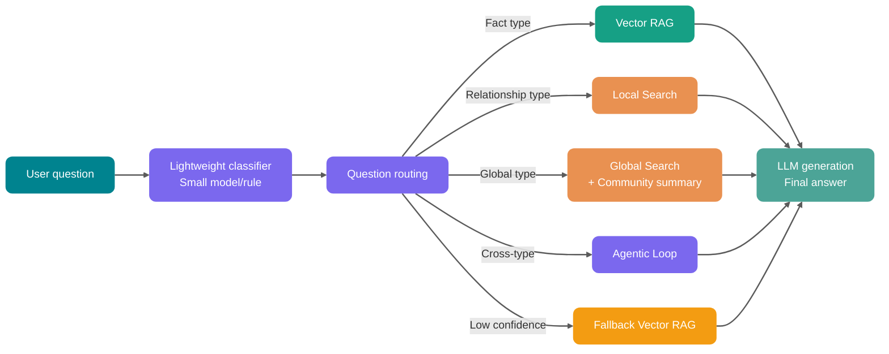

Những câu hỏi như “Các điểm rủi ro được những phòng ban này nhắc lại nhiều lần trong nửa năm qua là gì, chúng liên quan với nhau thế nào?” cần tổng hợp thông tin về phòng ban, rủi ro, dự án, nhà cung cấp và thời gian từ nhiều tài liệu. Vector retrieval Top-K có thể tìm các đoạn tương tự, nhưng không tự động lưu quan hệ giữa những đối tượng này.

GraphRAG bổ sung cấu trúc đồ thị vào retrieval pipeline, dùng entity, relationship hoặc topic summary để tổ chức bằng chứng xuyên tài liệu. Có đáng đưa vào hay không phụ thuộc vào việc các failure sample của RAG hiện tại có tập trung ở quan hệ nhiều bước và global inference hay không.

## RAG là gì?


RAG (Retrieval-Augmented Generation, sinh tăng cường bằng retrieval) là framework kết hợp information retrieval với large language model dạng sinh.

Tư tưởng cốt lõi là: trước khi để LLM trả lời câu hỏi hoặc sinh văn bản, trước tiên retrieval context liên quan từ các nguồn tri thức bên ngoài như database, tập tài liệu và enterprise knowledge base, sau đó đưa “câu hỏi gốc + retrieval context” cho LLM cùng lúc. Nhờ vậy, câu trả lời của model có thể chính xác hơn, kịp thời hơn và phù hợp hơn với tri thức của domain cụ thể.

Đối tượng retrieval của RAG truyền thống thường là Chunk, tức từng đoạn văn bản. Nó rất phù hợp để trả lời các câu hỏi mà “đáp án nằm trong một vài đoạn”, chẳng hạn hỏi đáp về quy định, hỏi đáp về API document và truy vấn fact cục bộ trong knowledge base.

## GraphRAG là gì?


GraphRAG (Graph-based Retrieval-Augmented Generation) là tên gọi chung cho các solution sử dụng cấu trúc đồ thị để tăng cường retrieval. Hệ thống có thể model rõ ràng entity, relationship và structured context trong tài liệu; khi query, nó thu thập bằng chứng dọc theo relationship trong đồ thị rồi giao cho LLM sinh câu trả lời.

GraphRAG là một tên gọi rộng; cách index và query của các implementation khác nhau không giống nhau. Community summary, Global Search, Local Search và DRIFT Search chủ yếu đến từ hướng Microsoft GraphRAG; implementation lấy Neo4j làm trung tâm cũng có thể dùng property graph, Cypher, full-text và vector retrieval trực tiếp, không yêu cầu phải sinh community summary trước.

GraphRAG đưa node, edge, path và community summary vào retrieval context; graph database chỉ là một implementation để chứa những dữ liệu này.

Vector RAG truyền thống retrieval Chunk, tức từng đoạn văn bản. GraphRAG retrieval node, edge, path và community summary trong một “mạng lưới quan hệ tri thức”, sau đó kết hợp evidence từ văn bản gốc để trả lời.

Ví dụ:

- **Vector RAG** giống như tìm vài trang có nội dung tương tự theo semantic trong thư viện.
- **GraphRAG** giống như trước tiên sắp xếp relationship graph của nhân vật, timeline sự kiện và topic index, rồi lần theo manh mối quan hệ để tìm evidence.

Vector RAG giỏi phán đoán “đoạn này có giống câu hỏi của tôi không”, còn GraphRAG giỏi hơn trong việc hiểu “rốt cuộc các đối tượng này được kết nối với nhau thế nào”.

## Vector RAG truyền thống có hạn chế gì?


Một lần vector retrieval sẽ encode tài liệu và câu hỏi vào cùng một vector space, sau đó lấy về Top-K Chunk theo similarity, cuối cùng để LLM đọc các Chunk này. Pipeline ngắn, phù hợp với câu hỏi có evidence tập trung trong một số ít đoạn, chẳng hạn:

- “Quy trình hoàn tiền là gì?”
- “Quy tắc rate limiting của một API là bao nhiêu?”
- “Cấu hình vector database trong Spring AI thế nào?”

Với loại câu hỏi này, constraint then chốt thường nằm cùng với câu trả lời; sau khi retrieve đúng đoạn, model chỉ cần trích xuất hoặc sắp xếp lại.

Câu hỏi xuyên tài liệu thì khác. Thông tin về relationship, dependency chain và incident record có thể nằm rải rác trong các Chunk khác nhau, nên câu trả lời trước hết phải liên kết các evidence này lại.

### 1. Chunk là các ốc đảo thông tin

Chunking biến tài liệu dài thành các đơn vị có thể retrieval, nhưng đồng thời cũng tách các fact xuyên chapter. Lấy một system làm ví dụ, definition, owner, database dependency và incident record có thể xuất hiện ở các chapter khác nhau; sau khi vào index, chúng không còn dùng chung business identifier rõ ràng.

Similarity có thể đưa các đoạn liên quan lên đầu, nhưng không có nghĩa những đoạn này đã được nhận diện là evidence upstream và downstream của cùng một system. Semantic gần nhau và relationship đầy đủ là hai việc khác nhau.

### 2. Vector similarity không giỏi multi-hop reasoning

Giả sử user hỏi:

> “Owner của system A gần đây đã tham gia những incident review nào liên quan đến payment chain?”

Để trả lời câu hỏi này cần hoàn thành bốn lần chuyển có constraint: từ system A tìm owner, sau đó xác định các review mà owner đó tham gia, cuối cùng filter theo payment chain.

“Mô tả system A” và “payment incident review” đều có thể được retrieve, nhưng bản thân Top-K không cho retriever biết cần đi theo path `system -> owner -> review -> chain` để bổ sung evidence.

### 3. Câu hỏi mang tính global khó trả lời chỉ bằng các đoạn Top-K

Còn một loại câu hỏi khó hơn:

- “Các complaint của nhóm customer này chủ yếu tập trung vào những loại vấn đề nào?”
- “Architectural risk nào liên tục xuất hiện trong knowledge base của công ty suốt năm qua?”
- “Các report này cùng chỉ đến topic chiến lược nào?”

Loại câu hỏi này yêu cầu aggregate và infer topic trên corpus; một lần Top-K chỉ nhìn thấy một local window:

- Retrieve quá ít đoạn, không thấy pattern tổng thể.
- Retrieve quá nhiều đoạn, chi phí Token và noise cùng tăng vọt.

Mở rộng Top-K, thêm rerank hoặc query rewriting có thể cải thiện chất lượng candidate, nhưng chúng vẫn lấy việc sắp xếp các đoạn làm trung tâm. Khi relationship chain hoặc global topic không có biểu diễn rõ ràng, vấn đề không tự biến mất chỉ vì tăng số candidate.

## GraphRAG khác vector RAG truyền thống thế nào?


| Dimension           | Vector RAG truyền thống                        | GraphRAG                                                                               |
| ------------------- | ---------------------------------------------- | -------------------------------------------------------------------------------------- |
| Đối tượng retrieval | Text Chunk                                     | Entity, relationship, path, community summary, đoạn văn bản gốc                        |
| Năng lực cốt lõi    | Retrieve theo semantic similarity              | Relationship reasoning, graph traversal, global topic aggregation                      |
| Data structure      | Chủ yếu là vector index                        | Knowledge graph + vector index + full-text index                                       |
| Câu hỏi phù hợp     | Hỏi đáp fact cục bộ, giải thích đoạn tài liệu  | Hỏi đáp relationship nhiều bước, inference xuyên tài liệu, phân tích business phức tạp |
| Khả năng giải thích | Chủ yếu phụ thuộc đoạn được trích dẫn          | Có thể hiển thị node, relationship, path và source                                     |
| Chi phí xây dựng    | Trung bình, trọng tâm là Chunking và Embedding | Cao, trọng tâm là extraction, disambiguation, modeling và evaluation                   |
| Query latency       | Thường thấp                                    | Phụ thuộc graph traversal, community summary và số lần gọi LLM                         |
| Chi phí maintenance | Chỉ cần update Chunk và vector                 | Còn phải maintenance entity, relationship, community và summary                        |
| Rủi ro lớn nhất     | Đoạn retrieve không đầy đủ                     | Lỗi khi xây graph dẫn đến misleading có tính hệ thống                                  |

Việc có đưa cấu trúc đồ thị vào hay không nên bắt đầu từ failure sample của RAG hiện tại. Keyword không match, Chunk bị cắt và entity multi-hop, global inference là các vấn đề khác nhau; hai loại đầu thường nên kiểm tra parsing, chunking và hybrid retrieval trước.

Entity và relationship extraction, disambiguation, graph storage, summary và incremental update đều tạo thêm công việc. Khi đánh giá, hãy ghi lại index Token, thời gian index, storage, query P95 và answer quality trên cùng một corpus, sau đó so sánh liệu graph retrieval có cải thiện nhóm câu hỏi mục tiêu hay không.

Nếu interviewer hỏi “GraphRAG khác RAG thông thường thế nào”, có thể trả lời:

> Vector RAG thông thường lấy text Chunk làm đối tượng retrieval chính, phù hợp với hỏi đáp fact cục bộ. GraphRAG lưu thêm cấu trúc entity, relationship và topic: query có thể mở rộng theo relationship từ điểm semantic match, hoặc đọc community summary để xử lý câu hỏi global. Tương ứng, entity disambiguation, relationship extraction, incremental update và access control đều trở thành một phần của system.

Nếu được hỏi tiếp “Khi nào không dùng GraphRAG”, có thể bổ sung:

> Nếu câu hỏi chủ yếu là hỏi đáp tài liệu đơn giản, hoặc data volume nhỏ và relationship không phức tạp, vector RAG kết hợp hybrid retrieval và rerank thường đáng giá hơn. GraphRAG nên được dùng trong scenario mà badcase của vector RAG đã chỉ rõ vào multi-hop relationship, inference xuyên tài liệu và structured constraint.

## Khái niệm cốt lõi của GraphRAG

Để hiểu GraphRAG, trước hết hãy tách một số keyword.


### Knowledge graph: biến tri thức thành mạng lưới relationship có thể traverse

Knowledge graph (Knowledge Graph) biểu diễn entity, concept và relationship của chúng bằng node và edge.

- **Node**: biểu thị entity hoặc concept, chẳng hạn user, system, order, incident, supplier và policy clause.
- **Edge**: biểu thị relationship giữa các entity, chẳng hạn owner, dependency, impact, thuộc về, cause và reference.
- **Property**: thông tin bổ sung gắn trên node hoặc edge, chẳng hạn time, version, confidence và source document.

Ví dụ:

```text
User Service --dependency--> Redis cluster
Redis cluster --đã xảy ra--> Connection pool exhaustion incident
Connection pool exhaustion incident --impact--> Order API
Zhang San --owner--> User Service
```

Sau khi đặt các relationship này vào graph, system có thể trả lời:

> “Gần đây có những risk nào ảnh hưởng đến order chain trong các system do Zhang San phụ trách?”

Vector RAG nhìn thấy vài đoạn text; knowledge graph nhìn thấy connection giữa các object.

### Entity: business object nhỏ nhất của GraphRAG

**Entity** là node cốt lõi trong graph.

Trong GraphRAG, entity không nhất thiết phải là “tên người, địa điểm, tổ chức” thật chặt chẽ như trong knowledge graph truyền thống. Nó cũng có thể là:

- Một business system, chẳng hạn “Order Center”
- Một technical component, chẳng hạn “Kafka consumer group”
- Một policy clause, chẳng hạn “yêu cầu data masking”
- Một risk topic, chẳng hạn “permission bypass”
- Một project event, chẳng hạn “payment chain load test”

Chất lượng entity extraction quyết định trực tiếp ceiling của GraphRAG. Extract quá thô thì graph thiếu detail; extract quá vụn thì graph đầy duplicate node và noise.

Bước này khá giống domain modeling. Một số điểm cần chú ý trong engineering practice:

- **Dùng JSON Schema để constraint chặt format extraction**: tránh parse free text, giảm chi phí post-processing.
- **Few-shot example cần bao phủ positive, negative và boundary case**: cho LLM biết những gì không nên extract.
- **Đặt upper limit cho số entity tối đa**: ngăn LLM extract quá mức trong text dài.
- **Bắt buộc mỗi entity có field `source_text_span`**: dùng để trace source và human validation.

### Relationship: ghi nhận rõ connection giữa các object

Relationship dùng để ghi nhận các connection như dependency, impact, inclusion và ownership giữa các entity.

Vector RAG có thể cho biết “Order Center” và “Payment incident” gần nhau về semantic, nhưng không tự nhiên cho biết relationship giữa chúng là “dependency”, “impact”, “cause” hay “chỉ đồng thời xuất hiện”.

GraphRAG sẽ cố gắng biến relationship thành explicit:

```text
Order Center --call--> Payment Gateway
Payment Gateway --dependency--> Risk Control Service
Risk Control Service --đã gây ra--> Transaction timeout
```

Khi có relationship, retrieval không chỉ là “sắp xếp theo similarity”, mà còn có thể mở rộng dọc theo path:

- Tìm neighbor từ một entity.
- Tìm upstream và downstream từ một loại relationship.
- Tìm impact scope từ một incident.
- Tìm community liên quan từ một topic.

Đây cũng là chìa khóa để GraphRAG xử lý câu hỏi multi-hop.

### Community detection: tìm các nhóm topic từ một tập node

**Community Detection** là một task phổ biến trong graph algorithm, mục tiêu là gom một nhóm node có connection chặt chẽ hơn thành một community.

Community detection xử lý connection structure trong graph. Lấy một tập tài liệu làm ví dụ, nếu các node sau thường xuyên có liên quan:

```text
Payment Gateway, Risk Control Service, Transaction timeout, rate limiting policy, canary release, alert escalation
```

Graph algorithm có thể phân các node này vào một community; “payment stability” là label được sinh cho tập node đó ở giai đoạn summary.

Hướng Microsoft GraphRAG thường trước tiên extract entity, relationship và key claim, sau đó dùng các algorithm như Leiden, Louvain để phân chia community theo hierarchy và sinh summary cho community. Global question trước tiên dùng các summary này để filter topic; văn bản gốc vẫn phải được giữ làm evidence có thể trace.

### Global retrieval và local retrieval

Trong GraphRAG thường gặp hai thuật ngữ: **Global Search** và **Local Search**.

Chúng phục vụ các scope query khác nhau. **Local retrieval** mở rộng từ entity đã biết đến neighbor và text liên quan, phù hợp với:

- “Order Center phụ thuộc vào những service nào?”
- “Một supplier ảnh hưởng đến những project nào?”
- “Upstream và downstream chain của một incident là gì?”

Điểm bắt đầu của retrieval là entity, context trả về bao gồm neighbor, relationship path và các đoạn văn bản gốc liên quan.

**Global retrieval** dùng cho các topic question xuyên corpus, chẳng hạn:

- “Các risk topic lặp lại trong nhóm report này là gì?”
- “Các complaint của customer chủ yếu được gom thành mấy loại?”
- “Architectural bottleneck phổ biến nhất trong technical document là gì?”

Loại query này trước tiên aggregate community hoặc topic summary, sau đó model infer và rank; nó không nên thay thế việc kiểm tra fact cụ thể trong văn bản gốc.

**DRIFT Search** bổ sung community summary bên cạnh entity neighbor. Khi câu hỏi có entity rõ ràng nhưng câu trả lời vẫn cần background xuyên community, nó có thể bổ sung topic information mà local retrieval chưa bao phủ.

| Retrieval mode | Scenario phù hợp                            | Cơ chế cốt lõi                                  |
| -------------- | ------------------------------------------- | ----------------------------------------------- |
| Basic Search   | Truy vấn fact thông thường                  | Vector retrieval Top-K tiêu chuẩn               |
| Local Search   | Hỏi đáp xoay quanh entity cụ thể            | Mở rộng từ entity neighbor và concept liên quan |
| DRIFT Search   | Entity focus + relationship xuyên community | Local expansion + community summary context     |
| Global Search  | Global topic inference                      | Community summary Map-Reduce                    |

## Quy trình build và query GraphRAG

### Giai đoạn build: từ tài liệu đến graph

Pipeline xử lý từ tài liệu đến graph như sau:


Index processing sẽ trải qua các bước sau:

| Step                    | Làm gì                                                                                  | Risk chính                                                                    |
| ----------------------- | --------------------------------------------------------------------------------------- | ----------------------------------------------------------------------------- |
| Document parsing        | Extract text từ PDF, web page, Markdown và database record                              | OCR error, mất structure của table, lẫn version tài liệu                      |
| Text chunking           | Chia tài liệu dài thành TextUnit hoặc Chunk                                             | Chunk quá vụn làm mất relationship, Chunk quá lớn làm tăng chi phí extraction |
| Entity extraction       | Nhận diện system, person, organization, concept và event trong tài liệu                 | Entity trùng tên, alias, abbreviation, entity noise                           |
| Relationship extraction | Nhận diện dependency, inclusion, impact, causality và các relationship khác giữa entity | Sai hướng relationship, type relationship bị generalize, confidence không đủ  |
| Graph normalization     | Merge entity trùng lặp, bổ sung property và source                                      | Chi phí entity disambiguation cao, cần rule và evaluation thủ công            |
| Community detection     | Tìm các topic group có connection dày                                                   | Chất lượng community giảm khi graph quá thưa hoặc quá bẩn                     |
| Summary generation      | Sinh summary cho community, entity và relationship                                      | LLM summary có thể mất constraint hoặc đưa vào hallucination                  |
| Index ingestion         | Ghi vào graph database, vector store và full-text index                                 | Incremental update và permission filter phức tạp                              |

So với chỉ maintenance Chunk và vector, graph retrieval còn phải xử lý entity normalization, relationship source, community và summary update, vì vậy phạm vi production và maintenance cũng mở rộng.

### Giai đoạn query: trước tiên xác định loại câu hỏi

Bước quan trọng nhất trong query phase của GraphRAG là **query routing**.

Các câu hỏi khác nhau của user cần cách retrieval khác nhau:

| Question type       | Retrieval phù hợp hơn                       | Ví dụ                                                                           |
| ------------------- | ------------------------------------------- | ------------------------------------------------------------------------------- |
| Fact cục bộ         | Vector retrieval hoặc local graph retrieval | “Timeout của một API là bao lâu?”                                               |
| Entity relationship | Local graph retrieval                       | “Order Center phụ thuộc vào những service nào?”                                 |
| Multi-hop reasoning | Graph traversal + vector bổ sung evidence   | “Những incident nào ảnh hưởng đến payment chain mà một owner đã từng tham gia?” |
| Global inference    | Community summary + global retrieval        | “Các risk topic chính của nhóm report này là gì?”                               |
| Exact filter        | Graph query hoặc structured query           | “Trong Q4 năm 2025, project nào phụ thuộc vào supplier A?”                      |

Mapping giữa question type và retrieval mode như sau:


Một system trưởng thành sẽ không đẩy mọi câu hỏi cho GraphRAG. Nhiều câu hỏi đơn giản dùng vector retrieval sẽ rẻ hơn, nhanh hơn và ổn định hơn.

## GraphRAG phù hợp với scenario nào? Không phù hợp với scenario nào?

GraphRAG có phù hợp hay không phụ thuộc vào việc evidence cần cho câu trả lời có bắt buộc phải đi qua entity relationship, path hoặc topic xuyên tài liệu mới ghép đủ hay không. Nó mở rộng phạm vi data governance từ Chunk và vector sang entity, relationship, summary và version của chúng.

Các loại câu hỏi sau có thể xem graph structure là một candidate solution:

- **Hỏi đáp phức tạp trong enterprise knowledge base**: câu hỏi cần nối thông tin xuyên department, policy và project review, chẳng hạn “Quy trình này liên quan đến những department nào? Mỗi department đảm nhiệm trách nhiệm gì?” hoặc “Policy này xung đột với những policy lịch sử nào?”.
- **Phân tích IT architecture và incident impact**: giữa service, API, database, message queue, owner, alert và incident vốn có dependency, chẳng hạn “Redis cluster bất thường sẽ ảnh hưởng đến những core API nào?” hoặc “Những system nào cùng phụ thuộc vào một high-risk component?”.
- **Finance, risk control, compliance và supply chain**: các domain này quan tâm hơn đến relationship giữa object thay vì mức độ tương tự của đoạn text, chẳng hạn relationship giữa customer và account, company và beneficial owner, supplier và project, policy clause và regulatory rule.
- **Inference topic xuyên tài liệu**: khi cần phân tích pattern tổng thể của interview record, research report, customer service ticket và incident review, community summary có thể trước tiên gom corpus thành topic group, rồi để LLM thực hiện global inference.

Trong các điều kiện sau, làm ổn định vector hoặc hybrid retrieval trước thường có chi phí thấp hơn:

- **Data volume nhỏ, câu hỏi đơn giản**: nếu knowledge base chỉ có vài chục tài liệu và câu hỏi chủ yếu là “một rule nào đó là gì”, vector RAG kết hợp hybrid retrieval và rerank thường đáng giá hơn.
- **Chất lượng tài liệu quá thấp**: nếu source document thiếu subject, lẫn version, thuật ngữ không thống nhất và lỗi parse table nghiêm trọng, graph extract ra cũng sẽ rất bẩn. Lỗi của vector RAG thường là “tìm nhầm vài đoạn text”, còn lỗi của GraphRAG có thể là “hướng của cả mạng lưới relationship bị sai”.
- **Yêu cầu realtime cực cao**: entity relationship extraction, community detection và summary generation đều tăng chi phí update. Nếu data bắt buộc phải visible ở mức giây, cần đánh giá cẩn thận chi phí incremental graph update và summary refresh.
- **Team thiếu năng lực graph modeling và evaluation**: GraphRAG cần liên tục trả lời các câu hỏi như “Entity nào đáng model, relationship type thiết kế thế nào, entity disambiguation ra sao, đánh giá lỗi graph thế nào, permission filter đặt ở đâu?”. Nếu không ai phụ trách các vấn đề này, nó rất dễ trở thành một black box đắt đỏ nhưng không kiểm soát được.

Thứ tự đánh giá rất đơn giản: nếu text liên quan chưa vào candidate set, trước tiên kiểm tra parsing, chunking và retrieval; nếu candidate text đã đầy đủ nhưng system không thể nối chúng theo business relationship, khi đó mới validate GraphRAG.

## Neo4j GraphRAG phù hợp giải quyết vấn đề gì?

Hướng Neo4j đặt graph database ở trung tâm query pipeline. Vector hoặc full-text retrieval trước tiên định vị entity và document node, sau đó Cypher query neighbor, path và property trên các relationship được kiểm soát; các đoạn văn bản gốc được đưa cho LLM cùng với path.

Một query có thể tách thành: xác định start node, thực hiện relationship traversal, assemble node property và evidence từ văn bản gốc, rồi sinh câu trả lời. Schema, relationship direction và query constraint trong graph do application phụ trách, không phải chi tiết chỉ được bổ sung sau khi model sinh câu trả lời.

Package Python `neo4j-graphrag` bao phủ graph import, vector index và nhiều retriever. Retrieval pipeline có thể kết hợp full-text, vector và Cypher query theo câu hỏi, không bị giới hạn ở việc chỉ traverse relationship sau khi vector match.

| Retrieval mode                              | Cách làm                                                                                     | Câu hỏi phù hợp                                                                      |
| ------------------------------------------- | -------------------------------------------------------------------------------------------- | ------------------------------------------------------------------------------------ |
| **VectorRetriever**                         | Dùng Neo4j vector index để similarity retrieval, trả về node match và score                  | Semantic retrieval thông thường, tìm candidate entity                                |
| **VectorCypherRetriever**                   | Trước tiên vector retrieval các node match, sau đó thực hiện Cypher query để mở rộng context | “Sau khi tìm được tài liệu tương tự, đưa entity, path và property liên quan về cùng” |
| **HybridRetriever / HybridCypherRetriever** | Kết hợp vector index và full-text index, khi cần thì dùng Cypher bổ sung graph context       | Enterprise knowledge base coi trọng cả keyword và semantic                           |
| **Text2Cypher**                             | LLM sinh Cypher theo graph Schema, sau đó đưa kết quả query cho LLM tổ chức câu trả lời      | Exact structured filter, multi-condition query, hỏi đáp dạng report                  |
| **ToolsRetriever**                          | Bọc nhiều retriever thành tool, để LLM chọn theo query intent                                | Complex query routing, kết hợp nhiều retriever                                       |
| **External vector store + Neo4j**           | Lưu vector trong Weaviate, Pinecone, Qdrant hoặc system khác, sau đó map về Neo4j node       | Đã có vector infrastructure, không muốn migrate toàn bộ vector vào Neo4j             |

Ranh giới giữa `VectorCypherRetriever` và `Text2Cypher` đặc biệt cần được phân biệt. Cái trước dùng kết quả vector để xác định start node, sau đó execute Cypher đã được constraint trước; sau khi match “Payment Gateway”, có thể đọc upstream, downstream, impact scope và owner dọc theo `[:DEPENDS_ON]`, `[:AFFECTS]`, `[:OWNER]`, đồng thời giữ lại path.

`Text2Cypher` phù hợp với filter có structure như “Trong Q4 năm 2025, project high-priority nào phụ thuộc vào supplier A?”. Nó phải được giới hạn trong Schema whitelist, query validation, read-only account, result limit và timeout. Với query có risk cao, nên ưu tiên fixed template hoặc semantic layer, không nên cho LLM trực tiếp quyền thực thi Cypher không constraint.

Chẳng hạn trong finance risk control, supply chain, IT asset management, permission governance và incident impact analysis, relationship giữa các object vốn đã rất quan trọng. Ưu thế của Neo4j GraphRAG là: **cho LLM kết nối với business relationship có sẵn thay vì lần nào cũng tạm thời đoán relationship từ text.**

## Còn những implementation GraphRAG nào khác?

Ngoài Neo4j, còn một số hướng phổ biến đáng tìm hiểu.

| Implementation route                            | Core idea                                                                                                                                                                          | Trường hợp phù hợp                                                                                       |
| ----------------------------------------------- | ---------------------------------------------------------------------------------------------------------------------------------------------------------------------------------- | -------------------------------------------------------------------------------------------------------- |
| **LangChain + Neo4j**                           | Dùng `Neo4jGraph` kết nối Neo4j, dùng component như `GraphCypherQAChain` chuyển natural language thành Cypher, sau đó sinh câu trả lời dựa trên query result                       | Đang dùng LangChain / LangGraph và muốn nhanh chóng đưa graph database vào Agent hoặc RAG pipeline       |
| **LlamaIndex PropertyGraphIndex**               | Dùng `kg_extractors` extract entity và relationship từ document Chunk, xây property graph index có thể query                                                                       | Document ingestion, index và query vốn đã nằm trong hệ sinh thái LlamaIndex                              |
| **FalkorDB GraphRAG SDK**                       | Xây GraphRAG trên graph database hỗ trợ OpenCypher, full-text index, vector similarity và range index                                                                              | Muốn thử graph database ngoài Neo4j hoặc quan tâm hơn đến low latency, multi-tenant graph query          |
| **Lightweight self-built graph + vector store** | Dùng business table hoặc edge table lưu một lượng nhỏ core entity relationship, vector store chỉ phụ trách retrieve candidate text, sau đó dùng relationship table bổ sung context | Validate GraphRAG có giá trị hay không ở version đầu, không muốn đưa full graph database vào ngay từ đầu |

Ba loại solution có trade-off khác nhau: graph database chú trọng online path query; framework như LangChain, LlamaIndex thuận tiện reuse ingestion và Agent component có sẵn; self-built lightweight kiểm soát phạm vi version đầu bằng cách giảm entity và relationship type.

Khi đã có business graph ổn định và query cần relationship constraint rõ ràng, có thể evaluate Neo4j. Khi document index và Agent đã được xây trên LangChain hoặc LlamaIndex, nên ưu tiên validate graph retrieval component tương ứng. Nếu mục tiêu chỉ là validate relationship expansion có cải thiện một nhóm failure sample hay không, model bằng một ít edge table hoặc core entity sẽ dễ quan sát effect hơn.

## Khó khăn engineering của GraphRAG

Graph database chỉ có thể lưu trữ và traverse graph. Extraction, disambiguation, version management, permission filter và incremental maintenance trước khi text vào graph mới quyết định relationship có thể dùng cho retrieval hay không.

Vector RAG chủ yếu maintenance document, Chunk và index; graph retrieval còn phải bảo đảm entity, relationship, source và permission nhất quán. Các failure point thường tập trung ở việc đồng bộ những object này.

### 1. Entity dễ bị extract trùng, sai hoặc quá vụn

Cùng một entity có thể có nhiều tên:

```text
Order Center, Order Service, order-service, OMS
```

Rốt cuộc chúng có phải cùng một entity không? Khi nào merge, khi nào tách?

Không thể hoàn toàn dựa vào việc LLM đoán. Trong production thường cần kết hợp:

- Term dictionary
- Alias table
- Rule matching
- Human validation
- Confidence threshold
- Evaluation set

Nếu entity disambiguation không tốt, graph sẽ biến thành một đống duplicate node và path retrieval cũng bị đứt.

### 2. Chỉ cần sai relationship direction, câu trả lời sẽ lệch có hệ thống

Relationship còn dễ sai hơn entity.

“A phụ thuộc B” và “B phụ thuộc A” chỉ khác một direction, nhưng ý nghĩa engineering hoàn toàn ngược nhau. Causal relationship, impact relationship và inclusion relationship cũng rất dễ bị LLM extract sai.

Trong production, nên thêm các field sau cho relationship:

| Field                      | Tác dụng                                                       |
| -------------------------- | -------------------------------------------------------------- |
| `source_doc_id`            | Trace source document                                          |
| `source_span`              | Trace vị trí trong văn bản gốc                                 |
| `confidence`               | Ghi nhận extraction confidence                                 |
| `relation_type`            | Control relationship type                                      |
| `updated_at`               | Hỗ trợ incremental update                                      |
| `extraction_model_version` | Re-extract phần thay đổi và A/B comparison sau khi LLM upgrade |

Graph không có source trace không nên được dùng trực tiếp cho high-risk QA.

### 3. Community summary không miễn phí

Community summary dùng cho inference xuyên corpus; mỗi lần generate và update đều cần thêm LLM call:

- Extract entity và relationship.
- Generate entity description.
- Generate community summary.
- Refresh summary liên quan khi version sau update.

Khi corpus mở rộng, entity extraction và summary refresh sẽ đồng thời làm tăng index cost. Trước tiên hãy dùng một batch nhỏ global question để validate answer quality, rồi quyết định có đưa multi-level community summary và Global Search vào hay không.

### 4. Update một tài liệu có thể tác động đến cả một vùng graph

Khi vector RAG thông thường update một tài liệu, thường chỉ cần xóa Chunk cũ rồi ghi Chunk và vector mới.

Sau khi cùng tài liệu đó được update, các object sau có thể cần được recompute hoặc invalidate:

- Entity node
- Relationship edge
- Community partition
- Community summary
- Entity summary
- Vector index
- Permission index

Full rebuild sẽ khuếch đại cost, còn incremental update cần ghi nhận source và dependency scope. System phải maintenance không chỉ vector index mà cả một nhóm entity, edge và summary thay đổi theo document change.

### 5. Permission filter không thể chỉ xét ở cấp document

Enterprise knowledge base không thể tránh permission.

Trong vector RAG, cách thường gặp là filter metadata trước hoặc trong retrieval. Trong GraphRAG còn phải cân nhắc:

- User xem được một node, nhưng có xem được neighbor của nó không?
- User xem được một edge, nhưng có xem được entity còn lại mà edge kết nối không?
- Community summary có trộn thông tin từ document không có permission hay không?
- Global summary có làm lộ sensitive topic không?

Khi nhiều source cùng sinh community summary, nội dung của document không có permission có thể đã được ghi vào summary. Chỉ filter theo document ID ở query phase không thể xóa phần thông tin này; permission boundary phải được xử lý ngay khi generate summary:

- Sinh summary riêng theo các permission partition ổn định, query chỉ dùng partition mà user hiện tại có đầy đủ quyền truy cập; khi permission combination thay đổi mạnh theo thời gian, không pre-generate summary xuyên permission.
- Summary giữ toàn bộ source document ID để audit và invalidate update. Source document ID không thể “filter” sensitive content đã trộn vào summary, vì vậy không thể dùng permission intersection làm điều kiện allow.
- Với corpus nhạy cảm cao hoặc permission thay đổi thường xuyên, dùng local retrieval sau khi authorize; raw evidence chỉ vào model context sau khi kiểm tra authorization.

## Bạn sẽ triển khai GraphRAG trong project thế nào?

Version đầu có thể bắt đầu từ vector RAG baseline và một số ít relationship có value cao, xác nhận benefit rồi mới mở rộng phạm vi graph.

### Giai đoạn một: làm tốt vector RAG baseline trước

Trước tiên hãy làm vững các capability cơ bản:

- Document parsing ổn định.
- Chunk strategy có thể evaluate.
- Hybrid retrieval giữa vector retrieval + BM25.
- Rerank có thể plug-in.
- Source citation có thể trace.
- Permission filter đáng tin cậy.

Nếu những việc này còn chưa làm tốt, đưa GraphRAG vào chỉ khiến vấn đề phức tạp hơn.

### Giai đoạn hai: thu thập failure case dạng relationship

Có cần đưa graph structure vào hay không, trước hết hãy phân loại failure sample online theo nguyên nhân:

| Badcase type                              | Có phù hợp với GraphRAG không?     |
| ----------------------------------------- | ---------------------------------- |
| Chỉ đơn thuần không retrieve được keyword | Tối ưu BM25 và query rewrite trước |
| Chunking không hợp lý                     | Tối ưu Chunking trước              |
| Cần reasoning xuyên entity relationship   | Phù hợp đưa graph structure vào    |
| Cần global topic inference                | Phù hợp đưa community summary vào  |
| Cần exact filter và permission constraint | Phù hợp kết hợp structured query   |

Chỉ khi relationship reasoning và global inference liên tục xuất hiện trong failure sample thì investment cho graph mới có mục tiêu có thể validate; nếu không, nên sửa các vấn đề tiền đề trong bảng trước.

### Giai đoạn ba: bắt đầu từ lightweight graph

Version đầu không nhất thiết phải làm full knowledge graph.

Có thể bắt đầu với một phiên bản lightweight:

- Chỉ extract core entity, chẳng hạn system, API, owner, incident và policy clause.
- Chỉ giữ một số ít relationship có value cao, chẳng hạn dependency, ownership, impact, inclusion và reference.
- Graph chỉ dùng để mở rộng retrieval, không dùng trực tiếp cho phán đoán fact cuối cùng.
- Giữ evidence từ văn bản gốc cho mỗi relationship.

Như vậy có thể validate với cost thấp hơn liệu GraphRAG thực sự cải thiện business metric hay không.

### Giai đoạn bốn: sau đó đưa community detection và global retrieval vào

Khi corpus lớn hơn và global question tăng lên, hãy cân nhắc community detection và community summary.

Ở giai đoạn này cần tập trung evaluate:

- Community partition có phù hợp với business intuition không.
- Community summary có bỏ sót key constraint không.
- Global answer có citation ổn định không.
- Summary mà user có permission khác nhau nhìn thấy có an toàn không.

Nếu evaluation không theo kịp, không mở global retrieval cho high-risk scenario.

### Giai đoạn năm: đưa Hybrid RAG routing vào khi cần

Nếu cùng một entry xử lý đồng thời fact, relationship và global inference question, có thể dynamic route theo question type:



Các điểm thiết kế chính: classifier ở entry phải explainable, fallback strategy phải rõ ràng, routing log phải có thể trace.

## Đưa evaluation GraphRAG vào thực tế thế nào?

Evaluation cần ghi nhận riêng “graph có tìm đúng evidence không” và “model có trả lời dựa trên evidence đó không”, sau đó quan sát những thay đổi này có ảnh hưởng đến business result hay không:

### Metric ở retrieval layer

- **Entity recall / relationship recall**: retrieval result có bao gồm entity và relationship cần cho câu trả lời không.
- **Community consistency**: kiểm tra mẫu xem community partition có phù hợp với business topic không.

### Metric ở generation layer

- **Faithfulness (tính trung thực)**: generated answer có được retrieval context support không; có thể kết hợp RAGAS để tính.
- **Answer Relevance (tính liên quan của câu trả lời)**, **Context Precision (độ chính xác của context)**: lần lượt quan sát answer có trả lời câu hỏi không và context đưa vào model có hiệu quả không.

### Metric ở business layer

- **User adoption rate, human handoff rate, citation click-through rate**: dùng để đánh giá hiệu quả sử dụng thực tế.
- **Regression test set**: đưa online failure và high-risk question vào; số lượng bổ sung phụ thuộc vào traffic, change frequency và năng lực human labeling.

## So sánh với các hướng tăng cường RAG khác

GraphRAG không phải hướng tăng cường RAG duy nhất; hiểu các trục so sánh giúp lựa chọn technology:

| Solution                                    | Vấn đề giải quyết                                   | Vấn đề chưa giải quyết                               |
| ------------------------------------------- | --------------------------------------------------- | ---------------------------------------------------- |
| **Multi-vector (ColBERT/Late Interaction)** | Fine-grained matching trong Chunk                   | Relationship problem                                 |
| **HyDE / Query Rewriting**                  | Khác biệt cách diễn đạt giữa query và doc           | Multi-hop reasoning                                  |
| **Self-RAG / Corrective RAG**               | Độ tin cậy của answer                               | Retrieval structure                                  |
| **GraphRAG**                                | Relationship retrieval và một phần global inference | Graph extraction, disambiguation và maintenance cost |

GraphRAG là một hướng xử lý relationship retrieval và global inference, nhưng không phải lựa chọn duy nhất. RAPTOR, iterative multi-hop retrieval, Agentic Retrieval hoặc structured query hướng business cũng có thể bao phủ một phần vấn đề; nên dùng cùng một evaluation set để so sánh benefit và cost.

<!-- @include: @rag-project.snippet.md -->

## Checklist lựa chọn

Trước hết hãy phân biệt loại failure: khi không retrieve được text, trước tiên kiểm tra parsing, BM25, vector retrieval và rerank; khi đã retrieve được text liên quan nhưng vấn đề phụ thuộc vào entity relationship rõ ràng, multi-hop evidence hoặc topic xuyên tài liệu, khi đó mới evaluate graph structure. Ở giai đoạn pilot, hãy giới hạn entity và relationship trong một số ít type có value cao, đồng thời giữ vị trí, version và permission của văn bản gốc cho mỗi relationship.

## Tổng kết

GraphRAG mở rộng đối tượng retrieval từ Chunk sang entity, relationship, path và community summary. Chỉ những vấn đề như multi-hop reasoning, impact scope và topic xuyên tài liệu mới có thể biểu diễn evidence structure cần thiết trong graph.

Chi phí cũng rõ ràng: extraction quality, entity disambiguation, relationship direction, version update và permission boundary đều cần governance riêng. Khi đã có business graph, graph query của Neo4j có thể trực tiếp tham gia retrieval; với system dùng LangChain hoặc LlamaIndex, có thể trước tiên validate graph retrieval component của chúng. Lựa chọn cuối cùng vẫn phụ thuộc vào technology stack hiện tại, quy mô graph model và năng lực maintenance.

Hãy quy nguyên nhân cho failure sample: khi không retrieve được văn bản gốc, trước tiên tối ưu parsing, chunking và retrieval; khi văn bản gốc đã được retrieve nhưng không thể thiết lập relationship cần thiết, khi đó mới evaluate GraphRAG.

## Tài liệu tham khảo

- [Neo4j: What Is GraphRAG?](https://neo4j.com/blog/genai/what-is-graphrag/)
- [Neo4j GraphRAG Python Package](https://neo4j.com/docs/neo4j-graphrag-python/current/)
- [Neo4j GraphRAG RAG User Guide](https://neo4j.com/docs/neo4j-graphrag-python/current/user_guide_rag.html)
- [LangChain Neo4j Integration](https://docs.langchain.com/oss/python/integrations/graphs/neo4j_cypher)
- [LlamaIndex PropertyGraphIndex](https://developers.llamaindex.ai/python/framework/module_guides/indexing/lpg_index_guide/)
- [FalkorDB Docs](https://docs.falkordb.com/)
- [RAPTOR: Recursive Abstractive Processing for Tree-Organized Retrieval](https://arxiv.org/abs/2401.18059)
- [GraphRAG: Thực tiễn retrieval tri thức doanh nghiệp từ RAG đến GraphRAG](https://juejin.cn/post/7618261670406438964)
- [Framework evaluation RAGAS](https://docs.ragas.io/)
