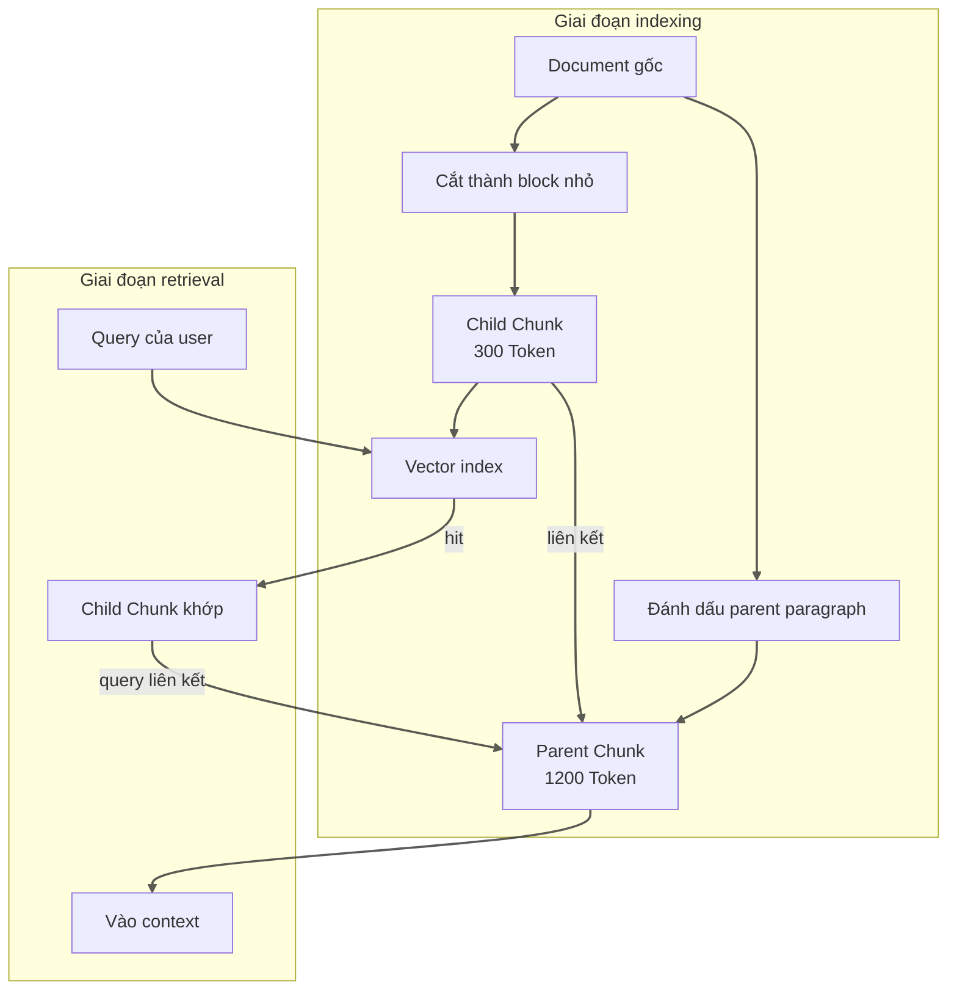
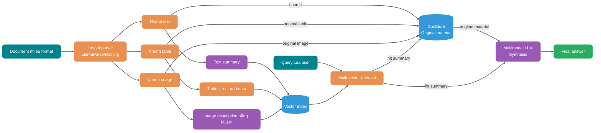

Trước khi retrieval, cần chuyển PDF, Word, Excel hoặc tài liệu scan thành nội dung có thể tìm kiếm. Nếu xử lý sai thứ tự đọc của PDF nhiều cột, quan hệ hàng-cột của bảng, cấp heading hoặc lỗi OCR ở bước này, việc thay Embedding model hay vector database về sau cũng không thể khôi phục thông tin đã mất.

Bài viết lần lượt trình bày cách upload, parsing, Chunking, validation tài liệu và đưa nội dung multimodal vào database, cùng các giới hạn của chúng.

> **Quy ước thuật ngữ**: `Chunking`, `Embedding` và `Chunk` được giữ nguyên trong toàn bài để đảm bảo nhất quán.

## Tài liệu trải qua những bước nào từ upload đến database?

Trước khi nói về chiến lược cụ thể, hãy làm rõ pipeline. Từ lúc upload đến khi vào vector database, tài liệu phải trải qua ít nhất sáu bước:


Một điểm dễ bị bỏ qua trong hình là quality validation không nên chỉ diễn ra sau khi vào database. Validation mẫu sau giai đoạn Chunking có thể phát hiện vấn đề sớm, tránh ghi hàng loạt dữ liệu chất lượng thấp vào vector database.

> Ghi chú: Hình này đơn giản hóa phần validation trong giai đoạn Chunking. Chiến lược hierarchical validation đầy đủ được trình bày ở chương “Thiết kế chiến lược hierarchical validation” phía sau, gồm ba lớp: format validation, parsing validation và Chunking validation.

Rủi ro chính của từng bước:

| Bước                | Vấn đề điển hình                                       | Ảnh hưởng cuối cùng                       |
| ------------------- | ------------------------------------------------------ | ----------------------------------------- |
| Upload file         | Giả mạo format, vượt giới hạn size, encoding lẫn lộn   | Parser crash hoặc fail im lặng            |
| Format validation   | Extension không khớp MIME type thực tế                 | Chọn sai parser                           |
| Layout parsing      | PDF nhiều cột, cell merge, header/footer               | Mất cấu trúc, lệch context                |
| Cleaning, denoising | Ký tự lỗi, ký tự đặc biệt, dòng trống lặp, sót mục lục | Noise trong index, Embedding bị sai lệch  |
| Chunking            | Cắt semantic, đứt context, block quá lớn hoặc quá nhỏ  | Recall không chính xác, câu trả lời thiếu |
| Metadata            | Không lưu nguồn, page number, version, permission      | Không thể filter hoặc citation            |
| Database            | Vector dimension không nhất quán, vượt giới hạn Token  | Retrieval thất bại, index hỏng            |

Embedding model và vector database chỉ có thể xử lý nội dung được cung cấp cho chúng. Một khi thứ tự đọc của PDF nhiều cột bị xáo trộn, quan hệ giữa các cột của bảng bị mất hoặc OCR đọc sai đã đi vào index, retrieval về sau không thể khôi phục cấu trúc gốc từ vector.

## Chọn chiến lược Chunking phù hợp như thế nào?


### Fixed-size Chunking: đủ dùng nhưng chưa hoàn hảo

Fixed-size Chunking chỉ cần thiết lập block size và overlap. Ví dụ, cứ mỗi 1000 Token thì cắt một block, các block liền kề overlap 200 Token.

Cách này dễ triển khai, hành vi có thể dự đoán và hiệu quả trong short document hoặc FAQ không tệ. Nhưng nhược điểm nghiêm trọng cũng rất rõ: nó không hiểu đâu là paragraph, table hay code block.

Chỉ sau khi dùng fixed-size Chunking làm baseline đánh giá, mới có thể xác định lợi ích của recursive Chunking có bù được complexity tăng thêm hay không. Khi so sánh, nên cố định document set và question set, đồng thời quan sát recall, context completeness và indexing cost; không thể áp dụng trực tiếp chênh lệch phần trăm điểm trên knowledge base khác.

Ví dụ, một đoạn policy document viết:

> “Ngoại trừ các trường hợp sau, đều có thể yêu cầu trả hàng trong bảy ngày không cần lý do: (1) sản phẩm đặt riêng; (2) sản phẩm tươi sống dễ hỏng; (3) sản phẩm số được download trực tuyến...”

Nếu danh sách này vừa đúng ranh giới 1000 Token, block trước có thể chỉ chứa “Ngoại trừ các trường hợp sau, đều có thể yêu cầu trả hàng trong bảy ngày không cần lý do”, còn block sau chỉ có “(1) sản phẩm đặt riêng...”. Xem riêng block nào cũng không đầy đủ, model rất dễ trích dẫn sai ngữ cảnh.

Các vấn đề ở ranh giới này là lý do fixed-size cần được so sánh với những chiến lược khác.

### Recursive Character Splitting: giữ cấu trúc phân cấp

Recursive Character Splitting lần lượt thử một nhóm delimiter theo thứ tự ưu tiên: trước hết giữ paragraph, nếu paragraph vẫn quá dài thì xử lý theo sentence, cuối cùng mới dùng space và các boundary nhỏ hơn. Các block tạo ra vẫn bị giới hạn bởi target size, nhưng ưu tiên giữ boundary của chapter, paragraph và sentence.

Những document có cấp heading không đầy đủ hoặc độ dài paragraph chênh lệch rõ rệt có thể được đưa vào phạm vi đánh giá của phương án này, chẳng hạn technical blog, product manual và research report. Có áp dụng hay không vẫn phụ thuộc vào kết quả trên question set hiện tại.

`RecursiveCharacterTextSplitter` của LangChain là một implementation điển hình của cách này. Với nội dung có cấu trúc như Python code, block size khoảng 100 Token và overlap khoảng 15 Token có thể tạo cân bằng khá tốt giữa context precision và recall. Lưu ý: các parameter này được tối ưu cho code document; text document thông thường nên dùng 400-512 Token.

### Semantic Chunking: phân theo ý nghĩa, nhưng có chi phí

Semantic Chunking trước hết tính similarity giữa các sentence hoặc paragraph, sau đó gom nội dung liên tục và gần nhau vào cùng một block, thay vì tuân theo character count hoặc heading boundary.

Cách này cần tạo thêm Embedding cho sentence hoặc paragraph. Nếu không có minimum block constraint, tại một số điểm chuyển chủ đề chỉ còn một hoặc hai sentence trong block; dù retrieval hit, lượng nội dung vẫn chưa đủ để hỗ trợ câu trả lời.

Threshold và `min_chunk_size` sẽ thay đổi phân bố block size. Có thể bắt đầu với candidate range 200-400 Token, sau đó kiểm tra minimum, mean, percentile và tỷ lệ block quá nhỏ, rồi dùng local evaluation để xác định parameter.

### Chunk theo cấu trúc document: boundary semantic tự nhiên

Trong financial report và legal document, một page thường tương ứng với một layout unit có thể đọc được. Trong một nhóm test của NVIDIA, Page-Level Chunking đạt accuracy trung bình 0.648 trên hai loại document này, đồng thời có variance thấp nhất; điều đó cho thấy page boundary có thể là một boundary cần được validation.

Tuy nhiên, không nên mù quáng tin vào page-level Chunking. Ưu thế này so với Token Chunking thực tế chỉ là 0.3-4.5 điểm phần trăm; trên dataset FinanceBench, 1024-token Chunking còn tốt hơn page-level (0.579 so với 0.566). Các document được NVIDIA test (financial report, legal document) là những trường hợp page tự mang semantic; nếu PDF của bạn chỉ là file Word export tùy ý, page-level Chunking sẽ không đem lại lợi ích thêm. Ngoài ra, loại query cũng ảnh hưởng đến chiến lược tối ưu: fact query phù hợp với block nhỏ 256-512 Token, analytical query phù hợp với 1024+ Token hoặc page-level Chunking.

Bảng sau liệt kê cách Chunking có thể dùng làm điểm bắt đầu đánh giá cho các loại document khác nhau:

| Loại document | Cách Chunking đề xuất          | Tool implementation               |
| ------------- | ------------------------------ | --------------------------------- |
| Markdown      | Theo cấp heading (H1/H2/H3)    | `MarkdownHeaderTextSplitter`      |
| HTML          | Theo cấp tag (h1~h6, p, div)   | `HTMLHeaderTextSplitter`          |
| PDF           | Theo page hoặc chapter         | `chunk_by_title`, `chunk_by_page` |
| Code          | Theo function, class, package  | `PythonCodeTextSplitter`          |
| Paper         | Theo chapter, paragraph, table | Layout-aware Parser               |

### Parent-Child Chunk: cân bằng giữa recall và context

Vector retrieval cần unit đủ nhỏ để phân biệt các chủ đề gần nhau, còn generative model lại cần context đầy đủ hơn. Parent-Child Chunk xử lý tách biệt hai đối tượng này.

Ví dụ, có thể ghi child block khoảng 300 Token vào vector index và lưu parent paragraph khoảng 1200 Token mà nó thuộc về. Query trước tiên hit child block, sau đó đọc parent paragraph liên quan làm context. Cần đánh giá đồng thời size của parent và child block, latency của related query và storage cost với kết quả recall.



Pattern này cho hiệu quả rõ rệt trong long document, tutorial, policy explanation và troubleshooting manual. Nhược điểm là storage của index tăng (mỗi child Chunk đều phải liên kết với parent Chunk), retrieval phải thực hiện thêm một related query.

### Kiểm soát overlap: giải pháp cho vấn đề boundary

Bất kể dùng chiến lược Chunking nào, boundary của block vẫn là vấn đề. Hai page liên tiếp nói về cùng một việc nhưng phần cuối page trước và phần đầu page sau bị page number cắt cứng; khi retrieval, cả hai block đều thiếu một nửa.

Overlap là cách thường dùng để xử lý vấn đề này, nhưng overlap lớn hơn không phải lúc nào cũng tốt hơn. Quá nhỏ thì semantic bị đứt ở boundary; quá lớn thì nội dung trùng lặp nhiều, lãng phí vector space và còn tăng retrieval noise. Overlap nên là một evaluation parameter, không phải giá trị cố định.

Một research report về 30 câu hỏi sau phẫu thuật nâng mũi cho biết accuracy của câu trả lời với adaptive Chunking là 87%, còn fixed-size Chunking là 50% (p = 0.001). Kết quả này đến từ một nhóm medical question, knowledge base và Gemini 1.0 Pro cụ thể; nó chỉ cho thấy adaptive Chunking tốt hơn trong thí nghiệm đó, không thể suy rộng thành lợi ích kỳ vọng của RAG nói chung. Xem [research gốc](https://pubmed.ncbi.nlm.nih.gov/41301150/).

Với text thông thường, có thể bắt đầu xây baseline từ 512 Token và overlap 50-100 Token; code ưu tiên cắt theo function và class, legal contract giữ nguyên unit có hiệu lực pháp lý theo điều, khoản, mục, còn table nên được giữ nguyên nếu có thể. Các con số này là điểm bắt đầu để tuning, không phải production default.

## Semantic loss là gì và vì sao xảy ra?


Semantic loss là việc thông tin quan trọng trong document gốc bị suy yếu hoặc mất đi trong quá trình parsing, cleaning, Chunking hoặc đưa vào database.

### Các tình huống semantic loss điển hình

**Thứ nhất: cắt cấu trúc.** Một business logic hoàn chỉnh bị chia vào hai Chunk. Chunk đầu nói về “điều kiện đăng ký”, Chunk sau nói về “quy trình phê duyệt”, nhưng điều kiện then chốt “nếu thỏa mãn X thì cần cung cấp thêm tài liệu Y” bị cắt ở boundary, trở thành “thông tin thiếu” trong cả hai Chunk.

**Thứ hai: bay hơi context.** Chunk chỉ giữ text content nhưng mất thông tin vị trí của nó trong document. Khi model đọc “trong ba năm qua...”, nó không biết câu này nói về “risk assessment của một supplier” hay “lịch sử giao dịch của một customer”, vì background đó đã mất khi Chunking.

**Thứ ba: phá hỏng cấu trúc table.** Một table nhiều dòng nhiều cột bị parsing thành text lộn xộn, quan hệ semantic giữa các cột (đâu là primary key, đâu là field phụ thuộc, đâu là value) hoàn toàn biến mất.

**Thứ tư: biến dạng proper noun.** Document viết “SSO single sign-on”, sau khi Chunking lại thành “SSO single...”; proper noun bị cắt trong lúc tạo Embedding, khiến retrieval hoàn toàn không match được.

### Vì sao semantic bị mất?

Embedding request chỉ nhận Chunk hiện tại. Nếu condition, reference và quan hệ table bắc qua paragraph hoặc page trong source không được giữ trong cùng một block hay related metadata, vector representation sẽ thiếu phần thông tin đó.

Vì vậy, khi page tự tạo thành một semantic unit, page-level Chunking có thể tốt hơn Chunking nhỏ hơn: nó giữ lại các nội dung vốn phụ thuộc lẫn nhau trên cùng page. Nhận định này vẫn cần được kiểm chứng trên document và query type cụ thể.

### Chiến lược xử lý

Một cách là tăng retrieval entry point: ngoài nội dung chính, tạo thêm summary hoặc các question có thể được trả lời cho Chunk. User hỏi “hoàn tiền thế nào”, trong document lại viết “quy trình yêu cầu refund”; hai đoạn text có thể được cùng một Embedding model ánh xạ vào cùng vector space, nhưng distance và ranking chưa chắc đủ để đưa source vào Top-K. Thêm các query variant có thể cải thiện khác biệt cách diễn đạt này, nhưng lợi ích vẫn cần được xác nhận bằng evaluation set.

Một cách khác thường bị đánh giá thấp là giữ hierarchical metadata. Trong Metadata, lưu chapter path, parent-child heading, paragraph number và các thông tin tương tự; khi retrieval có thể filter theo hierarchy, khi generation cũng có thể bổ sung context. Chi phí của phần này thấp nhưng lợi ích lớn, tuy vậy nhiều team vẫn bỏ qua.

Nếu budget cho phép, có thể thử Late Chunking. Đây là một cách tương đối mới: trước hết encode toàn bộ document một lần bằng Transformer, để embedding của mỗi Token chứa attention của toàn document, sau đó mới cắt và pooling trong embedding space. Ưu điểm là vector của mỗi Chunk giữ được context đầy đủ của document; nhược điểm là computational cost cao, phù hợp với trường hợp lượng document không lớn nhưng yêu cầu precision cực cao.

Một hướng khác là dùng một LLM khác để phân tích cấu trúc document và yêu cầu nó đề xuất cách cắt (Contextual Chunking). Cách này cũng tốn kém, nhưng năng lực xử lý cấu trúc document phức tạp (chẳng hạn nested table, nội dung text và image trộn lẫn) thực sự mạnh hơn.

## Xử lý vấn đề mất cấu trúc như thế nào?


Structure loss là một subset của semantic loss, nhưng tình huống cụ thể hơn và ảnh hưởng cũng trực tiếp hơn.

### Layout nhiều cột trong PDF

Nhiều PDF dùng layout hai hoặc nhiều cột, nhưng thứ tự lưu trữ của text object ở tầng dưới chưa chắc bằng thứ tự đọc. Nếu parser chỉ extract theo object order, nó có thể nối conclusion ở cột trái vào trước argument ở cột phải, tạo ra text sai thứ tự.

Với loại document này, có thể đánh giá Layout-Aware Parser. Parser kết hợp physical position của text (tọa độ x, y), font size và paragraph spacing để suy luận thứ tự đọc; LlamaParse, Docling và Marker-PDF đều có năng lực liên quan.

Document có giá trị cao có thể được xử lý bằng hai parser rồi so sánh output. Page có khác biệt lớn nên đưa vào manual review hoặc downgrade flow; hai output giống nhau cũng không có nghĩa chắc chắn đúng, vẫn cần kiểm tra mẫu reading order, table structure và page citation.

Một tình huống dễ thất bại khác là merged cell trong financial report. Header gộp nhiều cột và value gộp nhiều hàng sẽ hoàn toàn rối nếu chỉ parsing theo text stream. Với loại document này, đừng cố xử lý bằng mọi giá; hãy dùng table extraction tool chuyên dụng (chẳng hạn module TableFormer của Docling).

### Cấp heading trong Word

Cấu trúc của Word document thường thể hiện qua heading style (Heading 1, Heading 2, body text), nhưng style chưa chắc đáng tin: có document dùng paragraph font lớn làm heading, có document lại gán body text thành Heading 3, thậm chí toàn bộ document chỉ dùng Heading 1. Khi parsing, cần kiểm tra đồng thời style, font và paragraph position, không thể chỉ tin vào style name.

Nếu Chunking trực tiếp theo plain text, cấp heading sẽ mất. Có thể dùng `python-docx` hoặc parser hỗ trợ Word style để đọc style information và dựng lại document tree theo cấp heading. Sau khi Chunking, ghi chapter path vào Metadata để retrieval và generation sử dụng.

```python
# Đọc Word document và giữ cấp heading
from docx import Document

def extract_sections(doc_path):
    """
    Extract nội dung chapter theo cấp heading của Word document
    """
    doc = Document(doc_path)
    current_heading = None
    current_content = []

    for para in doc.paragraphs:
        if para.style.name.startswith("Heading"):
            # Lưu nội dung dưới heading trước đó
            if current_heading and current_content:
                yield {
                    "heading": current_heading,
                    "content": "\n".join(current_content),
                }
            current_heading = para.text
            current_content = []
        else:
            if para.text.strip():
                current_content.append(para.text)

    # Xử lý chapter cuối cùng
    if current_heading and current_content:
        yield {
            "heading": current_heading,
            "content": "\n".join(current_content),
        }
```

### Liên kết field trong Excel

Quan hệ giữa các field trong Excel có thể cùng được thể hiện bằng header, merged cell, color và formula; chỉ đọc riêng từng cell sẽ không thu được record đầy đủ.

Ví dụ, nếu ghi độc lập từng cell vào index, quan hệ giữa field name, value và các record cùng row sẽ bị cắt. Trước hết cần xác định data area và header, sau đó mới quyết định tạo retrieval object nào.

Cách làm đúng phụ thuộc vào mục đích của Excel:

- **Data table** (financial report, statistical report): extract theo row hoặc data area thành structured JSON, mỗi row là một record.
- **Configuration table** (parameter table, mapping table): ghép header với value khi extract, giữ lại field name.
- **Hybrid document** (vừa có text giải thích vừa có table): xử lý phần text theo paragraph, phần table theo structured data.

### Chất lượng OCR của tài liệu scan

Tài liệu scan được chuyển thành digital text qua OCR; chất lượng phụ thuộc vào scan resolution, font, layout, language và paper background. Pipeline nên mặc định rằng OCR result có thể sai và thiết lập validation cho các field quan trọng.

Cần kiểm tra OCR result ở ba lớp riêng biệt: character, table và paragraph. Nhận dạng nhầm digit 0 với letter O, hoặc nhầm traditional và simplified character, sẽ ảnh hưởng đến các field quan trọng như product number và ID number; nhận dạng sai table line sẽ làm lệch row và column; các paragraph khác nhau bị gộp lại cũng làm mất context ban đầu.

OCR engine nên được chọn theo language, layout type, deployment method và accuracy đo thực tế. Tesseract 4.x+, Google Document AI và AWS Textract đều có thể là candidate. Với document quan trọng, có thể dùng dual-engine comparison: vị trí không nhất quán được ưu tiên manual review, nhưng nhất quán cũng không đồng nghĩa chính xác. Document nhiều số liệu còn cần business consistency validation, chẳng hạn tổng các cột có khớp total hay number có phù hợp validation rule không.

## Thiết kế chiến lược hierarchical validation như thế nào?


Không phải document nào cũng parsing thành công, cũng không phải parsing result nào cũng có thể sử dụng. RAG pipeline bắt buộc phải có downgrade mechanism, nếu không data chất lượng thấp sẽ làm nhiễm toàn bộ knowledge base.

### Các lớp validation

Validation có thể chia thành ba checkpoint, mỗi checkpoint xử lý một nhóm vấn đề khác nhau.

Đầu tiên là format validation. Ngay sau khi upload file, kiểm tra extension, MIME type và file size. Lớp này xử lý vấn đề “malicious upload” và “parameter error”, có interception cost thấp nhất và hiệu quả nhanh nhất.

```java
public class DocumentValidationException extends RuntimeException {
    private final ValidationErrorType errorType;
    private final String fileName;
    private final Object rejectedValue;

    public enum ValidationErrorType {
        FILE_TOO_LARGE,           // File vượt giới hạn size
        UNSUPPORTED_FORMAT,       // Format không được hỗ trợ
        MIME_TYPE_MISMATCH,       // Extension không khớp type thực tế
        CORRUPTED_FILE,           // File bị hỏng
        EMPTY_FILE,               // File rỗng
        ENCODING_ERROR            // Encoding lỗi
    }
}
```

Sau khi parsing hoàn tất, cần kiểm tra content có được extract thành công không, content length có nằm trong range hợp lý không và có tồn tại garbled text rõ ràng không.

```java
public class ParseResultValidator {

    public ValidationResult validate(DocumentParseResult parseResult) {
        List<String> errors = new ArrayList<>();

        // Kiểm tra content rỗng
        if (parseResult.getContent().isEmpty()) {
            errors.add("Parsing result rỗng");
        }

        // Kiểm tra tỷ lệ garbled text
        double garbledRate = calculateGarbledRate(parseResult.getContent());
        if (garbledRate > 0.05) {  // Garbled text vượt 5%
            errors.add("Tỷ lệ garbled text quá cao: " + String.format("%.2f%%", garbledRate * 100));
        }

        // Kiểm tra content length bất thường
        int contentLength = parseResult.getContent().length();
        if (contentLength < 100) {
            errors.add("Content quá ngắn, có thể parsing thất bại");
        }
        if (contentLength > 10_000_000) {  // Text vượt 10MB
            errors.add("Content quá dài, cần xử lý theo phần");
        }

        // Kiểm tra tính đầy đủ của structure (nếu có structure information)
        if (parseResult.hasStructure()) {
            validateStructure(parseResult.getStructure())
                .forEach(errors::add);
        }

        return new ValidationResult(errors);
    }
}
```

Cuối cùng là Chunking validation. Sau khi Chunking hoàn tất, lấy mẫu kiểm tra chất lượng Chunk: phân bố block size có hợp lý không, boundary có nằm ở vị trí hợp lý không và có vấn đề cắt cụt rõ ràng không.

```java
public class ChunkingQualityReport {
    private final int totalChunks;
    private final int totalCharacters;
    private final double averageChunkSize;
    private final int minChunkSize;
    private final int maxChunkSize;
    private final double chunkSizeStdDev;

    // Warning
    private final List<String> warnings = new ArrayList<>();
    private final List<String> errors = new ArrayList<>();

    public boolean isAcceptable() {
        // Standard deviation của Chunk size quá lớn cho thấy phân bố không đều
        if (chunkSizeStdDev > averageChunkSize * 0.5) {
            warnings.add("Phân bố Chunk size không đều, standard deviation quá lớn");
        }

        // Block tối thiểu quá nhỏ có thể là Chunking bất thường
        if (minChunkSize < 50) {
            errors.add("Có Chunk quá nhỏ, có thể Chunking bất thường");
        }

        // Block tối đa quá lớn có thể cho thấy việc cắt chưa thành công
        if (maxChunkSize > 5000) {
            warnings.add("Có Chunk quá lớn, có thể vượt context của model");
        }

        return errors.isEmpty();
    }
}
```

### Downgrade strategy

| Loại validation thất bại    | Downgrade strategy                                                              |
| --------------------------- | ------------------------------------------------------------------------------- |
| File rỗng                   | Từ chối đưa vào database, ghi exception log, thông báo uploader                 |
| Format không hỗ trợ         | Từ chối đưa vào database, đề xuất convert format                                |
| Parsing thất bại            | Đưa vào manual processing queue hoặc retry bằng backup parser                   |
| Tỷ lệ garbled text cao      | Thử OCR hoặc format conversion, nếu vẫn thất bại thì downgrade thành plain text |
| Chunking bất thường         | Dùng fixed-size Chunking làm fallback                                           |
| Parsing thành công một phần | Đưa phần parse được vào database, gắn tag cho phần không parse được             |

Mục tiêu của downgrade là giữ lại nội dung có thể xác nhận là đúng, không âm thầm nuốt các page thất bại. Nếu PDF 100 page có 10 page parsing thất bại, chỉ nên nhận các page còn lại khi business cho phép index không đầy đủ; đồng thời ghi lại range page bị thiếu, ngăn hệ thống cam kết tính đầy đủ cho phần thiếu và đưa vào retry hoặc manual review. Tài liệu yêu cầu đầy đủ như contract và regulation nên tạm hoãn publish.

## Xử lý nội dung multimodal như thế nào?

RAG truyền thống chỉ xử lý text, nhưng document trong thực tế còn có nhiều image, table và chart. Nếu bỏ qua các nội dung này, knowledge base sẽ không đầy đủ.

### Nội dung image: ba hướng xử lý

Image trong document có hai vai trò: information carrier (screenshot, flowchart, photo) và decorative content (header, logo, watermark). Strategy xử lý hai loại hoàn toàn khác nhau.

Một cách là vector hóa bằng CLIP và trả về image gốc. Dùng CLIP model hỗ trợ image-text alignment để chuyển image thành vector; khi retrieval hit image vector, lấy image gốc từ object storage rồi đưa cho multimodal LLM. CLIP phù hợp hơn với natural image; với screenshot hoặc chart chứa nhiều text, trục tọa độ và table phức tạp, cần evaluation riêng.

Một hướng khác là MLLM description kết hợp text retrieval. Không vector hóa image bằng CLIP, mà dùng multimodal large model tạo text description cho image, lưu description cùng image gốc. Khi retrieval, match text; sau khi hit thì dùng image gốc để tăng cường generation. Với screenshot, flowchart và dashboard, cách này có thể chứa nhiều text và structural information hơn generic CLIP representation, nhưng model description cũng có thể bỏ sót field hoặc đọc sai value, nên cần evaluation mẫu.

Multi-Vector Retriever trước hết dùng MLLM tạo structured summary cho image (ví dụ "This is a flowchart showing the order processing pipeline..."), đưa summary vào text vector index và lưu image gốc vào docstore. Khi retrieval, trước tiên hit summary, sau đó liên kết image gốc qua `doc_id` và giao cho multimodal LLM generation.

```python
# Ví dụ Multi-Vector Retriever của LangChain
from langchain_classic.retrievers.multi_vector import MultiVectorRetriever
from langchain_core.stores import InMemoryByteStore

# Lưu trữ summary vector
vectorstore = Chroma(collection_name="summaries", embedding_function=OpenAIEmbeddings())

# Lưu trữ document gốc
docstore = InMemoryByteStore()

retriever = MultiVectorRetriever(
    vectorstore=vectorstore,
    byte_store=docstore,
    id_key="doc_id",
    search_kwargs={"k": 5}
)
# Lưu ý: InMemoryByteStore chỉ dùng để demo; production nên thay bằng persistent storage (như Redis, MongoDB, S3...)
```

### Nội dung table: structured extraction là cốt lõi

Table là một bài toán khó lâu nay trong RAG. PDF parser truyền thống chuyển table thành text lộn xộn, làm mất hoàn toàn quan hệ giữa các column.

Cách cơ bản nhất là table parsing rồi chuyển thành Markdown. Dùng table parsing tool chuyên dụng (LlamaParse, Docling, TableFormer) để extract table structure và chuyển sang Markdown table format. Markdown table ít nhất vẫn giữ quan hệ row-column, giúp LLM hiểu tốt hơn.

```markdown
| Tên sản phẩm | Doanh số Q1 | Doanh số Q2 | Tăng trưởng so với kỳ trước |
| ------------ | ----------- | ----------- | --------------------------- |
| Phone A      | 10,000      | 12,000      | +20%                        |
| Phone B      | 8,000       | 7,500       | -6.25%                      |
```

Nếu table chứa dữ liệu số (chẳng hạn financial report), chuyển thành structured JSON sẽ thuận lợi hơn cho numeric retrieval và calculation. Có thể dùng natural-language query để hỏi nội dung table: “Which product had the highest growth in Q2?”

```json
{
  "table_name": "Báo cáo doanh số theo quý",
  "headers": ["Sản phẩm", "Doanh số Q1", "Doanh số Q2", "Tỷ lệ tăng trưởng"],
  "rows": [
    { "product": "Phone A", "q1": 10000, "q2": 12000, "growth": "20%" },
    { "product": "Phone B", "q1": 8000, "q2": 7500, "growth": "-6.25%" }
  ]
}
```

Table description nên chứa chapter, title, unit và time range để phía retrieval có thể phân biệt các table trùng tên nhưng khác business scope. Việc có giữ các field này hay không cần được xác nhận qua retrieval evaluation, không chỉ dựa vào việc description có đầy đủ hơn hay không.

Ví dụ, cùng là sales data table, description dưới chapter “Tổng kết năm của khu vực East” nên là:

> “Bảng tổng hợp doanh số các product line trong năm 2024 của khu vực East, hiển thị sales data và growth so với kỳ trước của Phone A và Phone B trong Q1/Q2, dùng để phân tích market performance của product và lập strategy cho quarter tiếp theo.”

Description nào phù hợp hơn với knowledge base hiện tại cần được so sánh trên cùng question set.

### Nội dung chart: Caption và context đều quan trọng

Không thể chỉ xử lý chart như image. Title, axis, legend, unit, data source và chapter chứa chart cùng xác định ý nghĩa của data; thiếu bất kỳ phần nào cũng có thể khiến cùng một nhóm value bị diễn giải sai.

Caption cần ghi rõ object, time range, measurement unit và thông tin có thể kiểm chứng trong chart. Ví dụ, “Line chart hiển thị xu hướng doanh thu theo quarter của company trong giai đoạn 2020-2024, doanh thu Q4 2024 đạt đỉnh 1,25 tỷ nhân dân tệ” cung cấp nhiều điều kiện cần cho retrieval và generation hơn “Revenue chart”. Text gần chart thường chứa phần diễn giải của tác giả và cũng nên giữ quan hệ liên kết.

### Pipeline RAG multimodal đầy đủ



Ý tưởng của pipeline này là: summary phục vụ retrieval, source phục vụ generation. Vector index lưu structured summary (hoặc description), còn nội dung multimodal gốc được lưu trong docstore; khi retrieval hit thì lấy ra và giao cho multimodal LLM synthesis.

## Xây dựng document processing pipeline từ đầu như thế nào?


Phạm vi format có thể mở rộng theo mức độ rủi ro. Trước tiên validation parsing, Chunking, indexing và database insertion của Markdown, HTML, TXT, sau đó mở rộng sang PDF, page nhiều cột, table và image. Mỗi khi thêm một format, cần kiểm tra cấp heading, phân bố Chunk size và Metadata có đúng kỳ vọng không.

Table, chart và layout nhiều cột trong PDF phụ thuộc vào Layout-Aware Parser (như LlamaParse hoặc Docling). Sample validation phải bao phủ các layout thực tế; số lượng sample phụ thuộc vào số loại layout và rủi ro lỗi, không phải một con số cố định.

Tài liệu có tỷ lệ image và table cao (như financial report, product manual) cần sớm đưa vào xử lý multimodal. Knowledge base chủ yếu là text có thể làm phần này sau, nhưng trước khi vào database vẫn nên kiểm tra mẫu: dùng Query thực tế để so sánh content fidelity trước và sau parsing, kết quả recall và citation của answer.

## Kiểm tra trước khi production

Trước khi production, ít nhất cần kiểm tra mẫu reading order sau parsing, row-column của table, cấp heading, page citation và các OCR field quan trọng; đồng thời ghi lại phân bố Chunk size, source, version, permission và chapter path. Sau khi thay đổi parser hoặc Chunking strategy, phải dùng cùng một batch question để đánh giá lại recall và answer citation, không thể chỉ kiểm tra task có chạy thành công hay không.

## Tổng kết

Khi nghiệm thu, cần xác nhận parsing result vẫn có thể truy xuất nguồn và hiểu đúng: reading order và table structure không bị hỏng, Chunk giữ đủ context cần cho câu trả lời, Metadata có thể định vị source, version, permission và chapter path, còn thông tin quan trọng trong image và chart không bị bỏ qua.

Các kiểm tra này cần được duy trì sau mỗi lần thay đổi parser, Chunking strategy và model version. Hiệu quả của retrieval layer phụ thuộc vào data mà nó nhận được, không thể chỉ đổi Embedding model để khắc phục.

## Tài liệu tham khảo

- [Databricks: Mastering Chunking Strategies for RAG](https://community.databricks.com/t5/technical-blog/the-ultimate-guide-to-chunking-strategies-for-rag-applications/ba-p/113089)
- [Firecrawl: Best Chunking Strategies for RAG in 2026](https://www.firecrawl.dev/blog/best-chunking-strategies-rag)
- [Premiere AI: RAG Chunking Strategies 2026 Benchmark Guide](https://blog.premai.io/rag-chunking-strategies-the-2026-benchmark-guide/)
- [Weaviate: Chunking Strategies to Improve LLM RAG Pipeline Performance](https://weaviate.io/blog/chunking-strategies-for-rag)
- [Omdena: Document Parsing for RAG - A Complete Guide for 2026](https://www.omdena.com/blog/document-parsing-for-rag)
- [DataCamp: Multimodal RAG - A Hands-On Guide](https://www.datacamp.com/tutorial/multimodal-rag)
- [LangChain: Multi-Vector Retriever for RAG on Tables, Text, and Images](https://www.langchain.com/blog/semi-structured-multi-modal-rag)
- [Procycons: PDF Data Extraction Benchmark 2025](https://procycons.com/en/blogs/pdf-data-extraction-benchmark/)
- [LlamaIndex: Mastering PDF Parsing](https://www.llamaindex.ai/blog/mastering-pdfs-extracting-sections-headings-paragraphs-and-tables-with-cutting-edge-parser-faea18870125)
