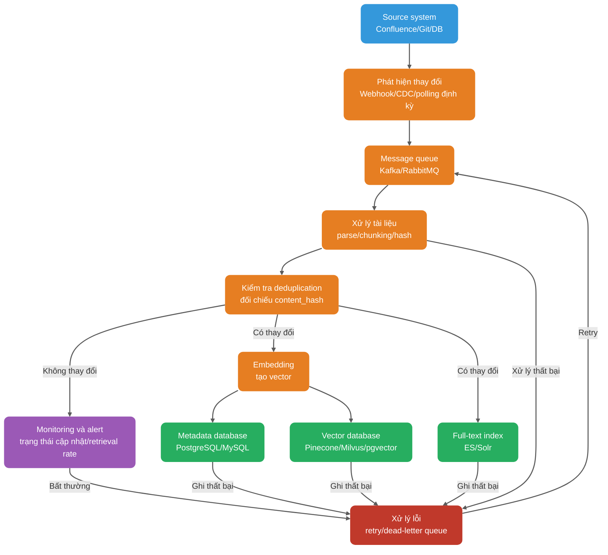
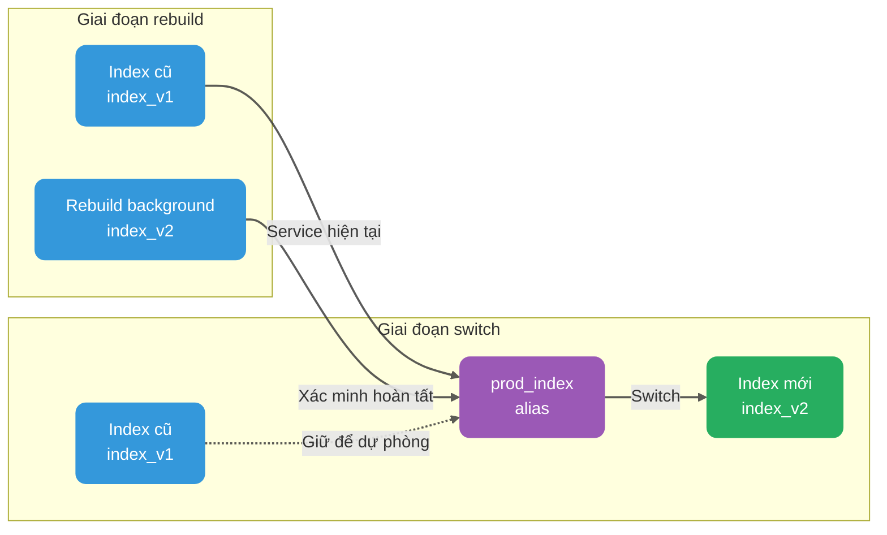

Sau khi hệ thống RAG cho knowledge base doanh nghiệp đầu tiên được đưa lên production, nhiều team sẽ gặp một vấn đề rất thực tế: tài liệu rõ ràng đã được cập nhật, nhưng câu trả lời vẫn như cũ.

Lúc này đừng vội trách LLM. Nguyên nhân thường gặp hơn là knowledge base chưa được đồng bộ, hoặc pipeline cập nhật chỉ thực hiện “ghi nội dung mới” mà chưa xử lý các chi tiết như version cũ, quyền hạn và tính nhất quán của index.

Khi tài liệu thay đổi thường xuyên, vấn đề càng rõ hơn: lần nào cũng full rebuild index thì chi phí và thời gian không chịu nổi; chỉ cập nhật phần thay đổi lại sợ bỏ sót chunk cũ; chỉ chèn vector mới mà không dọn version cũ thì nội dung hết hạn vẫn tiếp tục được retrieval; khi đổi Embedding model, việc có cần re-index toàn bộ dữ liệu lịch sử hay không cũng không thể né tránh.

Cập nhật knowledge base phải đồng thời xử lý tính nhất quán giữa version, quyền hạn và nhiều index. Bài viết này đi theo ba loại event: thêm, sửa và xóa, để giải thích incremental sync, full rebuild, gray release, rollback và monitoring phối hợp với nhau như thế nào.

## Cập nhật knowledge base cần giải quyết những vấn đề nào?

Trước khi nói về giải pháp cụ thể, hãy làm rõ mục tiêu.

Sau khi cập nhật xong, kết quả retrieval phải nhất quán với tài liệu hiện tại và không được vượt quyền; khi đồng bộ thất bại, vẫn phải xác định được tài liệu và bên ghi cụ thể, đồng thời có thể khôi phục về index phiên bản trước.

Tính dynamic nghĩa là tài liệu thay đổi thì index phải theo kịp. “Kịp thời” không nhất thiết luôn là cấp giây, có thể là cấp phút hoặc cấp ngày, tùy yêu cầu realtime của nghiệp vụ. Knowledge base quy định nội bộ có thể chỉ cần đồng bộ một lần mỗi ngày, còn knowledge base chăm sóc khách hàng và điều khoản compliance có thể cần nhanh hơn.

Tính chính xác nghĩa là nội dung được retrieval sau cập nhật phải nhất quán với tài liệu hiện tại, không thể tài liệu đã sửa mà model vẫn trích dẫn version cũ. Khi vấn đề này xảy ra, người dùng sẽ nhận ra rất rõ.

Consistency phức tạp hơn. Một tài liệu có các version khác nhau, vector database, metadata database và full-text search lại là các system khác nhau; bất kỳ bên nào ghi thiếu hoặc trễ đều có thể khiến kết quả không nhất quán.

Rollback nhằm nhanh chóng quay lại trạng thái khỏe mạnh trước đó khi xảy ra sự cố, thay vì tạm thời sửa dữ liệu thủ công. Observability yêu cầu có thể monitoring quy trình cập nhật, đánh giá kết quả cập nhật và truy nguyên nguyên nhân thất bại đến từng bước cụ thể.

Những mục tiêu này trông như điều hiển nhiên, nhưng nhiều project chỉ làm bước đầu tiên là “cập nhật”, còn các bước sau đều phó mặc cho may rủi. Kết quả là tài liệu đã sửa mười version nhưng câu trả lời vẫn dừng ở version đầu; một tài liệu nhạy cảm đã bị xóa nhưng vài tháng sau vẫn có thể được retrieval.

## Vì sao Embedding model phải nhất quán?

Điểm này cần nói riêng: Embedding model dùng khi indexing phải nhất quán với model dùng khi query.

Embedding model chuyển text thành vector, nhưng vector space của các model khác nhau không dùng chung được. Cùng một câu được encode bằng `text-embedding-3-small` của OpenAI và bằng `all-MiniLM-L6-v2` của sentence-transformers sẽ cho các vector không thể so sánh. Nếu index dùng model A còn query dùng model B thì tương đương với việc tính similarity trong hai không gian khác nhau.

Biểu hiện cụ thể còn phụ thuộc vào vector dimension. Nếu dimension khác nhau, thường không thể đưa vào cùng một index; nhiều vector database sẽ trực tiếp từ chối insert hoặc query. Nếu dimension giống nhau nhưng model khác nhau, similarity score cũng không có tính so sánh, không thể tin kết quả retrieval. Đây không chỉ đơn giản là “ngẫu nhiên”, mà là toàn bộ nền tảng sắp xếp đã hỏng.

Trong production có hai trường hợp dễ bị bỏ qua nhất.

**Trường hợp đầu tiên là nâng cấp model.** Bên nghiệp vụ thấy model mới hiệu quả hơn và muốn chuyển từ `text-embedding-3-small` sang `text-embedding-3-large`. Điều này có nghĩa là dữ liệu lịch sử phải được encode lại và đưa vào index lại. Về engineering, có thể dùng dual index chạy song song và gray traffic shifting để giảm rủi ro, nhưng bước rebuild vẫn không thể bỏ qua.

**Trường hợp thứ hai là dùng lẫn local model và API model.** Môi trường test dùng sentence-transformers cục bộ, môi trường production dùng OpenAI API. Khác biệt này đặc biệt thường gặp khi team phối hợp: test trông có vẻ bình thường nhưng sau khi đưa lên production, retrieval rate giảm còn một nửa.

Cách tương đối ổn định là ghi thông tin Embedding model vào metadata và kiểm tra model version mỗi lần query. Khi không khớp, hoặc từ chối query, hoặc ghi warning log và fallback sang chiến lược retrieval thận trọng hơn.

| Field                     | Mô tả             | Ví dụ                    |
| ------------------------- | ----------------- | ------------------------ |
| `embedding_model`         | Tên model         | `text-embedding-3-large` |
| `embedding_model_version` | Version của model | `2025-01-15`             |
| `embedding_dimension`     | Vector dimension  | `3072`                   |

Khi cần nâng cấp Embedding model, nên thực hiện theo quy trình sau:

1. Dùng model mới để rebuild toàn bộ dữ liệu trong index mới.
2. Cho index mới và cũ chạy song song một thời gian, so sánh retrieval rate và chất lượng câu trả lời.
3. Sau khi xác nhận index mới ổn định, chuyển traffic sang index mới thông qua index alias.
4. Giữ index cũ trong một thời gian để rollback nhanh.
5. Sau khi xác nhận không có vấn đề, xóa index cũ.

Cách này khá giống blue-green deployment của database: không sửa tại chỗ, trước tiên dựng một bộ mới, xác minh đạt rồi mới chuyển.

## Thiết kế metadata system hỗ trợ cập nhật như thế nào?

Thiết kế metadata tốt là tiền đề của incremental update và rollback. Nhiều hệ thống RAG chạy một thời gian rồi sẽ “mất trí nhớ”, không phải vì không biết nội dung tài liệu mà vì không biết vector này tương ứng với tài liệu nào, version nào, được đưa vào database lúc nào và quyền hạn ra sao.

Mỗi Chunk ít nhất nên có các metadata sau:

```json
{
  "doc_id": "doc-uuid-001",
  "chunk_id": "chunk-uuid-001",
  "content_hash": "sha256:abc123...",
  "version_id": 3,
  "chunk_strategy": "semantic",
  "chunk_size": 512,
  "chunk_overlap": 50,
  "source_id": "confluence-page-123",
  "source_type": "confluence",
  "title": "Tài liệu API trung tâm đơn hàng",
  "section_path": "Tài liệu kỹ thuật / Hệ thống đơn hàng / Quy cách API",
  "page": 5,
  "tenant_id": "tenant-001",
  "acl": ["role:admin", "team:order-team"],
  "created_at": "2025-03-01T10:00:00Z",
  "updated_at": "2025-04-15T14:30:00Z",
  "embedding_model": "text-embedding-3-large",
  "embedding_model_version": "2025-01-15",
  "embedding_dimension": 3072,
  "is_deleted": false
}
```

Chunk strategy cũng cần được version hóa. Khi cách chunk, tỷ lệ overlap hoặc cách parse thay đổi, ảnh hưởng không nhỏ hơn Embedding model, và cũng nên trigger rebuild hoặc gray release dual index. Ghi lại các field `chunk_strategy`, `chunk_size`, `chunk_overlap` thì sau này mới có cơ sở để đánh giá và rollback.

`content_hash` là cốt lõi của incremental update. Nó không phải file hash mà là hash của nội dung chính tài liệu hoặc nội dung Chunk. Có một số algorithm phổ biến: MD5 nhanh nhưng có collision risk, phù hợp với các trường hợp không nhạy cảm với collision; SHA-256 có collision risk cực thấp, được khuyến nghị hơn khi dùng trong production; SimHash phù hợp để xác định nội dung có gần như giống nhau hay không, thường dùng để deduplication web nhưng không thể xác định chính xác điểm thay đổi cụ thể.

Trong môi trường production, `content_hash` chủ yếu dùng để xác định “đoạn text này có thay đổi hay không”. Khi đưa vào database, tính hash rồi so sánh với record đã có trong database. Nếu giống nhau, nghĩa là nội dung không đổi và có thể bỏ qua Embedding; nếu khác nhau thì phải encode lại.

`version_id` ghi nhận số lần tài liệu được sửa. Mỗi lần tài liệu cập nhật, tăng `version_id` lên một. Kết hợp với `content_hash`, nó có thể theo dõi lịch sử thay đổi và cũng thuận tiện cho rollback.

`is_deleted` là soft delete flag. Chỉ xóa record khỏi vector database mà không giữ trạng thái xóa trong metadata database sẽ khiến audit, khôi phục và đồng bộ cross-index mất cơ sở. Khi nhận event xóa, có thể trước tiên đặt `is_deleted` thành `true`; khi upload lại thì tạo version mới hoặc khôi phục record và tính lại `content_hash`; khi query mặc định chỉ giữ các record có `is_deleted = false`.

Soft delete không chỉ để phân biệt tài liệu mới và cũ, mà còn tạo khoảng đệm cho audit, khôi phục xóa nhầm, physical delete trì hoãn và consistency giữa các system.

`tenant_id` và `acl` là nền tảng của multi-tenant và access control. Mọi nội dung đi vào context của model đều phải qua authorization check trước; thông thường filter theo tenant, role và resource ACL trước hoặc trong lúc retrieval để tránh tài liệu không có quyền chiếm Top-K hoặc bị lộ cho model. Các rule phức tạp như dynamic permission và inheritance cross-organization có thể được kiểm tra lại sau khi retrieval candidate, nhưng lần kiểm tra thứ hai phải diễn ra trước khi assemble context cho model; trước khi trả citation cũng có thể đối chiếu thêm một lần như một defensive check.

## Đồng bộ tài liệu thêm, sửa, xóa như thế nào?

Tài liệu từ source system đến vector database sẽ đi qua nhiều bước trung gian. Bất kỳ bước nào gặp vấn đề cũng có thể khiến dữ liệu không nhất quán.



Ở đây cần đặc biệt chú ý đến partial success. Vector database, metadata database và full-text index thường không nằm trong cùng một transaction domain, nên một lần ghi vào ba nơi rất dễ xảy ra partial success. Cách ổn định hơn là dùng metadata database làm source of truth, ghi lại index status của từng Chunk, chẳng hạn `index_status = 'ready' / 'partial_failed'`. Background compensation job định kỳ retry phía thất bại, sau đó dùng reconciliation để scan chênh lệch.

### Tài liệu mới

Thêm mới là thao tác đơn giản nhất trong ba loại. Quy trình thông thường là: parse tài liệu, trích xuất nội dung chính, tiêu đề và cấu trúc phân cấp; chunk Chunk theo strategy đã định; tính `content_hash` cho từng Chunk; kiểm tra hash đã tồn tại hay chưa; nếu chưa tồn tại thì tạo vector và ghi vào vector database, metadata database và full-text index.

Idempotency rất quan trọng. Thao tác thêm mới phải có thể thực hiện lặp lại. Kể cả message queue giao lại cùng một message, hoặc worker crash rồi restart và xử lý lại, cũng không được tạo record trùng.

### Sửa tài liệu

Sửa phức tạp hơn thêm mới, vấn đề mấu chốt là dữ liệu version cũ sẽ được xử lý thế nào.

Cần tránh việc query đồng thời nhìn thấy nội dung của hai version, cũng cần tránh việc tạm thời không query thấy version nào trong quá trình cập nhật. Cách phổ biến là ghi version mới ở trạng thái invisible trước, sau đó atomic switch sang version active:

1. Dùng `doc_id` query metadata database, ghi lại version active hiện tại và danh sách `chunk_id` cũ.
2. Ghi Chunk, vector và full-text index có `version_id` mới, giữ `status = 'building'` để không tham gia online retrieval.
3. Sau khi kiểm tra kết quả ghi ở cả ba nơi, atomic switch version active sang version mới trong metadata database hoặc index alias.
4. Đánh dấu version cũ để xóa và async cleanup theo retention policy.

Nếu vector database hỗ trợ atomic update dựa trên primary key, chẳng hạn upsert của Milvus, có thể trực tiếp overwrite record cùng primary key. Tuy nhiên cần chú ý, upsert chỉ overwrite entity có cùng primary key. Nếu tài liệu được chunk lại khiến số lượng Chunk hoặc `chunk_id` thay đổi, vẫn phải cleanup phần còn sót của version cũ theo `doc_id + version_id`.

Nếu storage endpoint không thể atomic replace toàn bộ tài liệu, hãy dùng filter `active_version`, index alias hoặc dual-index switch. Xóa record cũ trước rồi ghi record mới sẽ tạo khoảng trống ngắn; ghi record mới trước nhưng không filter version thì có thể đồng thời match nội dung mới và cũ.

Một lỗi rất thường gặp là chỉ ghi vector mới mà không xóa vector cũ.

Nếu tài liệu được sửa 10 lần nhưng vector database vẫn giữ 10 version có thể retrieval, query có thể match nội dung đã lỗi thời. Quy trình sửa phải disable version cũ và cleanup vector cũ theo retention policy, nếu không knowledge base sẽ liên tục mất tính chính xác.

### Xóa tài liệu

Xóa có thể chia thành soft delete và physical delete.

Soft delete là đặt flag `is_deleted` thành `true`. Cách này thuận tiện cho việc giữ lịch sử thay đổi và xử lý xóa nhầm, nhưng không phù hợp với request compliance yêu cầu xóa dữ liệu ngay lập tức.

Physical delete là remove record khỏi vector database, metadata database, full-text index và các cache liên quan. Giữ soft delete trong bao lâu cần được xác định theo recovery objective, phân loại dữ liệu và yêu cầu compliance; không thể coi một số ngày cố định là default dùng chung.

Soft delete thuận tiện cho khôi phục và audit nhưng làm tăng storage cost và chi phí filter. Physical delete triệt để hơn, phù hợp với compliance delete và xóa dữ liệu nhạy cảm nhưng chi phí khôi phục cao. Trong production, cách thường gặp hơn là “soft delete + physical delete trì hoãn + deletion audit log”. Nếu là tài liệu nhạy cảm, còn phải dọn rerank cache, LLM context cache và các cache phụ trợ khác.

Xóa còn có một vấn đề khó nhận thấy: “ghost data” sau khi quyền hạn thay đổi. Ví dụ một tài liệu ban đầu cho tất cả nhân viên xem, sau đó đổi thành “chỉ lãnh đạo cấp cao được xem”. Nếu `acl` cũ trong vector database chưa cập nhật, khi nhân viên bình thường query vẫn có thể retrieval tài liệu này. Cách đúng là quyền hạn thay đổi phải trigger re-index tài liệu, bảo đảm `acl` trong metadata là mới nhất. Nếu vector database hỗ trợ atomic update ACL field thì cũng có thể không rebuild vector mà chỉ update metadata.

## Incremental update và full rebuild phù hợp với trường hợp nào?

Kết hợp phổ biến là dùng incremental update để xử lý thay đổi hằng ngày, còn thực hiện full rebuild khi nâng cấp model, migrate chunk strategy hoặc xảy ra inconsistency dữ liệu nghiêm trọng. Có cần định kỳ full rebuild hay không phụ thuộc vào index implementation, tần suất cập nhật và kết quả consistency check.

| Dimension          | Incremental update                          | Full rebuild                                                                                 |
| ------------------ | ------------------------------------------- | -------------------------------------------------------------------------------------------- |
| Điều kiện trigger  | Event thay đổi tài liệu                     | Scheduled job hoặc trigger thủ công                                                          |
| Phạm vi bao phủ    | Chỉ tài liệu thay đổi                       | Toàn bộ knowledge base                                                                       |
| Chi phí tính toán  | Thấp, chỉ xử lý phần thay đổi               | Cao, cần xử lý toàn bộ dữ liệu                                                               |
| Độ trễ cập nhật    | Thấp, gần realtime                          | Cao, có thể cần vài giờ                                                                      |
| Data consistency   | Phụ thuộc độ chính xác của change detection | Cần snapshot của source system hoặc version timestamp để bảo đảm nhất quán với source system |
| Trường hợp sử dụng | Thay đổi hằng ngày, cập nhật thường xuyên   | Nâng cấp model, điều chỉnh strategy, khôi phục sự cố                                         |
| Rủi ro chính       | Bỏ sót change detection khiến dữ liệu cũ    | Chiếm thêm compute và storage; ảnh hưởng service nếu switch strategy không hoàn chỉnh        |

### Incremental update phù hợp với trường hợp nào?

Incremental update phù hợp với trường hợp tài liệu thay đổi ở tần suất vừa phải, yêu cầu realtime và knowledge base có quy mô lớn. Ví dụ mỗi ngày có vài chục đến vài trăm lần thay đổi tài liệu, nghiệp vụ chấp nhận đồng bộ cấp phút và chi phí full rebuild tương đối cao.

Incremental update phụ thuộc vào cơ chế change detection. Có ba solution phổ biến:

1. Webhook / event-driven: source system, chẳng hạn Confluence, Git hoặc database, chủ động cung cấp notification thay đổi để RAG system subscribe và xử lý. Độ trễ thấp nhất nhưng yêu cầu source system hỗ trợ.
2. CDC (Change Data Capture): lắng nghe database binlog hoặc change log để capture data change. Phù hợp với structured data source.
3. Polling định kỳ: scan source system theo interval cố định, chẳng hạn mỗi 5 phút, rồi so sánh timestamp `updated_at`. Dễ triển khai nhưng có độ trễ và cũng tạo áp lực cho source system.

Trong production, event-driven + polling fallback ổn định hơn. Event-driven xử lý incremental hằng ngày, polling dùng để chống bỏ sót. Ở giữa thêm message queue, chẳng hạn Kafka hoặc RocketMQ, để decouple source system và RAG processing flow.

### Full rebuild phù hợp với trường hợp nào?

Full rebuild thường dùng trong các tình huống sau:

- Nâng cấp Embedding model. Đây là yêu cầu bắt buộc, không thể né tránh.
- Điều chỉnh Chunk strategy. Chẳng hạn đổi từ fixed 500 Token sang semantic chunking. Có thể full rebuild, cũng có thể dùng versioned index để migrate theo batch, nhưng cùng một evaluation và retrieval pipeline phải phân biệt được strategy version.
- Thay đổi data structure. Chẳng hạn thêm hoặc sửa metadata field.
- Khôi phục sự cố nghiêm trọng. Incremental pipeline hỏng trong thời gian dài khiến dữ liệu đã rõ ràng trở nên cũ.
- Định kỳ health maintenance. Một số vector database sau khi xóa với tần suất cao sẽ để lại tombstone deletion flag, index fragment, thậm chí khiến retrieval suy giảm. Biểu hiện cụ thể liên quan đến index type và product implementation; ví dụ với product dựa trên HNSW + cơ chế dọn tombstone, tốt nhất nên tra tài liệu của vector database tương ứng để xác nhận.

Full rebuild sợ nhất là service bị gián đoạn. Cách tương đối ổn định là switch index alias:



Các bước đại khái là:

1. Query service truy cập thông qua index alias `prod_index`, index cũ là `index_v1`.
2. Khởi chạy background rebuild job, xây dựng index mới `index_v2`.
3. Sau khi index mới được xác minh đạt, trỏ alias `prod_index` sang `index_v2`. Cơ chế alias của Milvus / Zilliz hỗ trợ switch giữa các collection, còn vector database khác có khả năng tương đương hay không thì cần xác nhận riêng.
4. Giữ index cũ `index_v1` trong một thời gian, chẳng hạn 7 ngày, để rollback nhanh.
5. Sau khi xác nhận không có vấn đề, xóa index cũ.

### Strategy ổn định trong production

Incremental pipeline dùng Webhook hoặc CDC để capture thay đổi hằng ngày, polling và reconciliation dùng để phát hiện ghi thiếu, xóa thiếu và sai thứ tự. Full rebuild chỉ trigger khi cần: nâng cấp model, migrate index strategy hoặc consistency check thất bại liên tục. Một số system sẽ sắp xếp rebuild định kỳ, nhưng interval phải được xác định theo index implementation, tỷ lệ xóa, chi phí rebuild và consistency metric, không thể thống nhất đặt theo tuần hoặc theo tháng.

## Làm thế nào để update pipeline ổn định và đáng tin cậy?

### Idempotent update: bạn đồng hành tốt của message queue

Message queue vốn có thể giao message trùng. Network chập chờn, consumer crash rồi restart hoặc offset chưa commit đều có thể khiến cùng một message bị consume lặp lại.

Trọng tâm của idempotent update là căn cứ deduplication. Cách tương đối đáng tin cậy là tạo unique constraint dựa trên `doc_id + content_hash` hoặc `doc_id + version_id`. Tuy nhiên cần chú ý, trong trường hợp concurrent, “check trước rồi write” đơn giản là chưa đủ an toàn; khi hai message giống nhau hoặc out-of-order đến đồng thời, chúng vẫn có thể overwrite lẫn nhau hoặc ghi trùng.

Có một số cách ổn định hơn:

1. Dựa vào unique constraint: tạo unique index theo `doc_id + content_hash` hoặc `doc_id + version_id`, để database từ chối duplicate khi insert.
2. Optimistic lock / distributed lock: lấy lock trước khi ghi version mới để tránh concurrent overwrite.
3. Transaction outbox: trước tiên ghi change event vào outbox table, sau đó consumer idempotent xử lý.

Ví dụ dưới đây bổ sung index status bên cạnh unique constraint. `index_status` có thể nhận `pending`, `processing`, `partial_failed` và `ready`; `claim_token` cùng `claimed_at` dùng để ngăn nhiều consumer đồng thời xử lý cùng một record, đồng thời cho phép task timeout được consumer khác tiếp quản.

```python
from uuid import uuid4


def process_document_change(event):
    doc_id = event['doc_id']
    content = event['content']
    version_id = event.get('version_id', 1)
    chunk_hash = compute_hash(content)

    # Dùng full content hash để tránh collision giữa các nội dung khác nhau nhưng có cùng prefix
    chunk_id = f"{doc_id}_{version_id}_{chunk_hash}"

    # Event trùng không tạo record mới; record thất bại vẫn có thể tiếp tục xử lý từ trạng thái cũ
    db.execute("""
        INSERT INTO chunks (
            doc_id, chunk_id, content_hash, version_id, is_deleted, index_status
        )
        VALUES (
            :doc_id, :chunk_id, :content_hash, :version_id, false, 'pending'
        )
        ON CONFLICT (doc_id, chunk_id) DO NOTHING
    """, {
        'doc_id': doc_id,
        'chunk_id': chunk_id,
        'content_hash': chunk_hash,
        'version_id': version_id
    })

    claim_token = str(uuid4())
    claimed = db.fetch_one("""
        UPDATE chunks
        SET index_status = 'processing',
            claim_token = :claim_token,
            claimed_at = CURRENT_TIMESTAMP
        WHERE doc_id = :doc_id
          AND chunk_id = :chunk_id
          AND (
              index_status IN ('pending', 'partial_failed')
              OR (
                  index_status = 'processing'
                  AND claimed_at < CURRENT_TIMESTAMP - INTERVAL '10 minutes'
              )
          )
        RETURNING chunk_id
    """, {
        'doc_id': doc_id,
        'chunk_id': chunk_id,
        'claim_token': claim_token
    })

    # Không claim được task nghĩa là record đã hoàn tất hoặc vẫn đang được consumer khác xử lý
    if claimed is None:
        logger.info(f"Doc {doc_id} is ready or being processed, skipping")
        return

    try:
        # upsert phải dùng chunk_id làm idempotency key; chạy lặp không tạo nhiều vector
        embedding = embedding_model.encode(content)
        vector_db.upsert(doc_id, chunk_id, embedding, {
            'doc_id': doc_id,
            'content_hash': chunk_hash,
            'version_id': version_id,
            'updated_at': now()
        })

        db.execute("""
            UPDATE chunks
            SET index_status = 'ready',
                claim_token = NULL,
                claimed_at = NULL
            WHERE doc_id = :doc_id
              AND chunk_id = :chunk_id
              AND claim_token = :claim_token
        """, {
            'doc_id': doc_id,
            'chunk_id': chunk_id,
            'claim_token': claim_token
        })
    except Exception as e:
        db.execute("""
            UPDATE chunks
            SET index_status = 'partial_failed',
                claim_token = NULL,
                claimed_at = NULL
            WHERE doc_id = :doc_id
              AND chunk_id = :chunk_id
              AND claim_token = :claim_token
        """, {
            'doc_id': doc_id,
            'chunk_id': chunk_id,
            'claim_token': claim_token
        })
        logger.error(f"Failed to process {doc_id}: {e}")
        raise
```

Unique constraint phụ trách deduplication, conditional update phụ trách atomic claim task, còn `partial_failed` cho phép lần retry sau tiếp tục ghi vector. Ở đây dùng `RETURNING` theo phong cách PostgreSQL để lấy kết quả claim task, tránh phụ thuộc vào hành vi `rowcount` không nhất quán giữa các database driver. Nếu business database và vector database không thể đặt trong cùng một transaction, vector write phải idempotent theo `chunk_id`; ngay cả khi vector đã ghi nhưng update status thất bại, retry vẫn có thể `upsert` lại một cách an toàn. Production còn cần scheduled job scan các record `processing` vượt quá lease time.

### Xử lý event out-of-order

Thứ tự delivery của message queue không phải lúc nào cũng đúng như dự kiến. Trong RAG update pipeline, nhận v3 trước rồi mới nhận v2 là chuyện thường gặp. Nếu không xử lý out-of-order, version cũ có thể overwrite version mới.

Thông thường cần làm một số việc:

1. Mỗi document event mang theo `source_version`, `updated_at` hoặc `revision` tăng đơn điệu để phán đoán mới cũ.
2. Trước khi ghi, kiểm tra `event.version >= current_version`; event cũ thì trực tiếp discard hoặc ghi audit log.
3. Consume có thứ tự theo partition đối với cùng `doc_id`, chẳng hạn dùng `doc_id` làm Kafka key để bảo đảm message của cùng tài liệu rơi vào cùng một partition.
4. Ghi metric monitoring cho việc discard event out-of-order để thuận tiện phát hiện event bất thường từ source system.

### Retry thất bại và dead-letter queue

Bất kỳ bước nào trong pipeline xử lý cũng có thể thất bại: network chập chờn, API rate limiting, vector database tạm thời không khả dụng và parser exception đều có thể xảy ra.

Strategy tương đối ổn định là exponential backoff retry + dead-letter queue fallback.

```python
def process_with_retry(event, max_retries=3):
    # max_retries biểu thị sau lần thử đầu tiên thất bại, tối đa retry thêm bao nhiêu lần
    for attempt in range(max_retries + 1):
        try:
            process_document_change(event)
            return  # Thành công, return trực tiếp
        except TransientError as e:
            if attempt == max_retries:
                break
            wait_time = 2 ** (attempt + 1)  # Exponential backoff: 2s, 4s, 8s
            logger.warning(f"Attempt {attempt + 1} failed: {e}, retrying in {wait_time}s")
            time.sleep(wait_time)
        except PermanentError as e:
            # Lỗi permanent (như sai format) không retry, trực tiếp đưa vào dead-letter queue
            logger.error(f"Permanent error, sending to DLQ: {e}")
            dlq.send(event, reason=str(e))
            return

    # Vượt quá số lần retry tối đa, đưa vào dead-letter queue và alert
    logger.error(f"Max retries exceeded for {event['doc_id']}")
    dlq.send(event, reason="max_retries_exceeded")
    alert.trigger(f"Document update failed after {max_retries} retries: {event['doc_id']}")
```

Phân loại lỗi rất quan trọng. Các lỗi tạm thời như network timeout và API rate limiting có thể retry; các lỗi vĩnh viễn như sai format và thiếu field không nên retry lặp đi lặp lại. Retry bao nhiêu lần cũng không thành công, chỉ lãng phí resource.

Message trong dead-letter queue không thể cứ chất đống mãi. Nên Review định kỳ, chẳng hạn mỗi tuần một lần; sau khi sửa nguyên nhân thì deliver lại.

### Cơ chế rollback: kênh ứng phó khẩn cấp khi xảy ra sự cố

Rollback không phải thuốc hối tiếc mà là kênh ứng phó khẩn cấp. Cơ chế rollback tốt phải giúp operator nhanh chóng switch về trạng thái khỏe mạnh trước đó.

Rollback bằng index alias là đơn giản nhất. Sau khi switch alias, nếu index mới có vấn đề thì chỉ cần trỏ alias về index cũ. Điều kiện là index cũ chưa bị xóa.

Rollback khi nâng cấp model cần ghi lại `model_name`, `model_version` cũ và index tương ứng trước khi nâng cấp. Nếu model mới hoạt động bất thường, ưu tiên switch model và index cùng nhau về version cũ; chỉ khi index cũ đã được cleanup mới cần rebuild dựa trên model cũ.

Rollback data version có thể dùng field `updated_at` và `version_id`. Khi cần rollback về một thời điểm, khôi phục từ historical snapshot. Snapshot có thể là snapshot của vector database hoặc đặt trong object storage độc lập.

Rollback quyền hạn cần thận trọng hơn. Nếu thay đổi quyền hạn dẫn đến data leak, bước đầu tiên không phải từ từ sửa index mà là lập tức chặn phạm vi ảnh hưởng: tắt knowledge base hoặc entry point retrieval của tenant liên quan, disable index có vấn đề và bắt buộc authorization trước khi trả citation. Chỉ khi không thể xác định phạm vi ảnh hưởng mới cân nhắc dừng service toàn cục.

```python
def rollback_to_version(target_version_id):
    # Query snapshot của version mục tiêu
    snapshot = get_snapshot(version_id=target_version_id)
    if not snapshot:
        raise ValueError(f"No snapshot found for version {target_version_id}")

    # Dừng service
    service.set_status('maintenance')

    # Khôi phục snapshot
    vector_db.restore(snapshot)

    # Restart service
    service.set_status('active')

    # Gửi alert
    alert.trigger(f"System rolled back to version {target_version_id}")
```

### Gray release: xác minh strategy mới với traffic nhỏ trước

Update strategy của knowledge base cũng phải gray release như khi release APP, không nên triển khai một lần cho toàn bộ traffic.

Có một số cách gray release phổ biến: theo số lượng tài liệu, chẳng hạn trước tiên update 10% tài liệu; theo user, chẳng hạn trước tiên cho 5% user thấy kết quả từ index mới; theo loại query, chẳng hạn trước tiên xác minh precise query, loại query nhạy cảm hơn với thay đổi index.

Trong thời gian gray release cần tập trung theo dõi các metric sau. Các threshold dưới đây chỉ là ví dụ; production cần hiệu chỉnh dựa trên historical baseline, offline evaluation set và kết quả online A/B, không thể sao chép nguyên xi.

| Metric                        | Ý nghĩa                                                       | Alert threshold |
| ----------------------------- | ------------------------------------------------------------- | --------------- |
| `retrieval_hit_rate@10`       | Tỷ lệ trong 10 kết quả retrieval đầu tiên có chứa đáp án đúng | Giảm > 5%       |
| `avg_answer_latency`          | Answer latency trung bình                                     | Tăng > 20%      |
| `citation_accuracy`           | Độ chính xác của citation                                     | Giảm > 3%       |
| `user_feedback_negative_rate` | Tỷ lệ feedback tiêu cực của user                              | Tăng > 2%       |

Bất kỳ metric quan trọng nào trigger alert cũng nên tạm dừng gray release để kiểm tra vấn đề trước. Đừng đợi sau khi release toàn bộ mới phát hiện chất lượng retrieval giảm.

## Các lỗi thường gặp khi cập nhật knowledge base là gì?

### Lỗi 1: Chỉ chèn vector mới, không xóa vector cũ

Đây là vấn đề thường gặp nhất. Tài liệu bị sửa 5 lần, vector database giữ lại 5 version. Khi user query, version cũ được retrieval và model trả lời dựa trên thông tin lỗi thời.

Cách giải quyết rất đơn giản nhưng bắt buộc phải làm: khi sửa tài liệu phải đồng thời xử lý vector cũ. Có thể cleanup record cũ theo `doc_id` trước khi ghi vector mới.

### Lỗi 2: Dùng lẫn Embedding model

Index dùng model A, query dùng model B, vector space hoàn toàn không tương thích.

Cách giải quyết là coi `embedding_model` và `embedding_model_version` là metadata bắt buộc. Kiểm tra model version trước query, nếu không khớp thì reject hoặc fallback.

### Lỗi 3: Chunk strategy thay đổi nhưng không rebuild dữ liệu lịch sử

Đổi từ chunk theo độ dài cố định sang semantic chunking, từ 500 Token sang 800 Token nhưng chỉ áp dụng cho tài liệu mới, còn dữ liệu lịch sử vẫn dùng strategy cũ. Điều này khiến một knowledge base chứa lẫn nhiều bộ logic chunk, evaluation retrieval cũng trở nên rất hỗn loạn.

Cách giải quyết là thêm version cho Chunk strategy. Có thể full rebuild, cũng có thể ghi vào index version mới trước rồi migrate tài liệu cũ theo batch, sau khi xác minh mới switch version active; không thể trộn hai strategy khi chưa có version flag.

### Lỗi 4: Tài liệu đã xóa nhưng vẫn được retrieval

Soft delete chưa làm đúng, hoặc logic xóa chỉ xử lý vector database mà chưa xử lý full-text index.

Thao tác xóa phải nhất quán ở cả ba nơi: vector database, metadata database và full-text index đều phải được xử lý đồng bộ. Cách ổn định hơn là dùng outbox pattern để ghi change event, consumer idempotent xử lý; sau đó định kỳ dùng reconciliation để đối chiếu source system, metadata database, vector database và full-text index, sửa các event xóa thiếu, ghi thiếu và out-of-order.

### Lỗi 5: Metadata quyền hạn không đồng bộ

Quyền của tài liệu đổi từ “public” thành “chỉ administrator được xem”, nhưng field `acl` trong vector database chưa cập nhật.

Quyền hạn thay đổi phải trigger re-index tài liệu. Nếu vector database hỗ trợ atomic update ACL field thì có thể chỉ update metadata mà không rebuild vector, nhưng điều kiện tiên quyết là vector database phải có capability này.

### Lỗi 6: Bỏ sót change detection

Webhook không gửi, CDC trễ hoặc polling interval quá lớn đều có thể khiến tài liệu đã thay đổi nhưng index chưa đổi.

Cách giải quyết là event-driven + polling fallback. Đồng thời xây dựng freshness monitoring, định kỳ kiểm tra `updated_at` trong source system và vector database. Nếu timestamp của source system mới hơn timestamp của index quá threshold thì trigger alert, và khi cần có thể tự động re-index.

## Bảo đảm observability của cập nhật knowledge base như thế nào?

Knowledge base update pipeline bắt buộc phải có monitoring, nếu không chỉ là chạy mù. Tài liệu đã cập nhật chưa, bước nào thất bại, sau khi thất bại đã compensation chưa, không thể đợi user complaint mới phát hiện.

Có thể bắt đầu với các monitoring metric quan trọng sau:

| Metric                        | Mô tả                                                               | Alert threshold khuyến nghị |
| ----------------------------- | ------------------------------------------------------------------- | --------------------------- |
| `index_lag_seconds`           | Thời gian từ lúc tài liệu thay đổi đến khi index hoàn tất           | > 5 phút                    |
| `failed_updates_total`        | Tổng số thao tác update thất bại                                    | > 0 liên tục 10 phút        |
| `dlq_size`                    | Số lượng message đang tồn trong dead-letter queue                   | > 100                       |
| `retrieval_hit_rate`          | Retrieval accuracy                                                  | Giảm > 5% so với kỳ trước   |
| `stale_docs_count`            | Số tài liệu cũ, source system đã cập nhật nhưng index chưa cập nhật | > 10                        |
| `source_to_queue_lag_seconds` | Độ trễ từ source system change đến lúc event vào queue              | > 1 phút                    |
| `queue_to_index_lag_seconds`  | Độ trễ từ lúc event vào queue đến khi index hoàn tất                | > 5 phút                    |
| `index_success_rate`          | Index success rate                                                  | < 99%                       |
| `partial_index_count`         | Số tài liệu ghi thành công một phần nhưng chưa hoàn tất             | > 0 liên tục 30 phút        |
| `acl_mismatch_count`          | Số lượng ACL của source system và index không nhất quán             | > 0                         |

Mỗi thao tác update đều nên ghi audit log, bao gồm `doc_id`, `change_type` (thêm / sửa / xóa), `timestamp`, `operator` (automatic / manual), `result` (success / failure), `error_message`. Khi thực sự xảy ra vấn đề, các field này giúp nhanh chóng xác định record nào, bước nào và thất bại lúc nào.

## Checklist trước khi đưa lên production

Trước khi đưa lên production cần xác minh bốn việc:

1. Index và query dùng cùng một Embedding model và version;
2. Mọi candidate hoàn tất authorization trước khi đi vào context của model;
3. Tài liệu update được atomic switch thông qua version active hoặc alias; failure của vector database, metadata database, full-text index và cache có thể được compensation job phát hiện.
4. `doc_id`, `content_hash`, `version_id`, index status và audit log phải xuyên suốt pipeline này.

## Tổng kết

Cập nhật RAG knowledge base không chỉ là viết một scheduled job để re-index. Nó liên quan đến change detection, data consistency, idempotent write, version control, gray release, rollback mechanism và observability.

Có thể ghi nhớ một số kết luận.

Tính nhất quán của Embedding model là rule bắt buộc. Đổi model thì phải full rebuild index, không được bỏ qua.

Thiết kế metadata là tiền đề của incremental update. Các field `doc_id`, `content_hash`, `version_id`, `is_deleted` là nền tảng của idempotent update, version tracking và rollback.

Thao tác xóa phải nhất quán ở cả ba nơi. Vector database, metadata database và full-text index đều phải được xử lý đồng bộ, nếu không sớm muộn cũng xuất hiện ghost data.

Incremental update phụ trách thay đổi hằng ngày, full rebuild phụ trách health maintenance định kỳ. Hai cách phối hợp với nhau thì system mới khó drift trong thời gian dài.

Switch index alias là cách thường dùng cho gray release và rollback ở cấp production. Dựng index mới trước, xác minh xong mới switch, giữ index cũ một thời gian để dự phòng.

Idempotency, retry và dead-letter queue là nền tảng của độ tin cậy update pipeline. Observability là tuyến phòng thủ cuối: không biết update đã thành công hay chưa thì cũng tương đương chưa update.

Bảo trì RAG knowledge base không phải việc làm một lần trước khi đưa lên production rồi kết thúc, mà thực sự bắt đầu sau khi đưa lên production.

## Tài liệu tham khảo

- [How to Update RAG Knowledge Base Without Rebuilding Everything](https://particula.tech/blog/update-rag-knowledge-without-rebuilding)
- [RAG Knowledge Base Management: Updates & Refresh](https://apxml.com/courses/optimizing-rag-for-production/chapter-7-rag-scalability-reliability-maintainability/rag-knowledge-base-updates)
- [RAG in Practice: Versioning, Observability, and Evaluation in Production](https://pub.towardsai.net/rag-in-practice-exploring-versioning-observability-and-evaluation-in-production-systems-85dc28e1d9a8)
- [RAG in Production: Deployment Strategies & Practical Considerations](https://coralogix.com/ai-blog/rag-in-production-deployment-strategies-and-practical-considerations/)
- [23 RAG Pitfalls and How to Fix Them](https://www.nb-data.com/p/23-rag-pitfalls-and-how-to-fix-them)
- [Incremental Indexing Strategies for Large RAG Systems](https://medium.com/@vasanthancomrads/incremental-indexing-strategies-for-large-rag-systems-e3e5a9e2ced7)
- [RAG Series: Embedding Versioning with pgvector](https://www.dbi-services.com/blog/rag-series-embedding-versioning-with-pgvector-why-event-driven-architecture-is-a-precondition-to-ai-data-workflows/)
