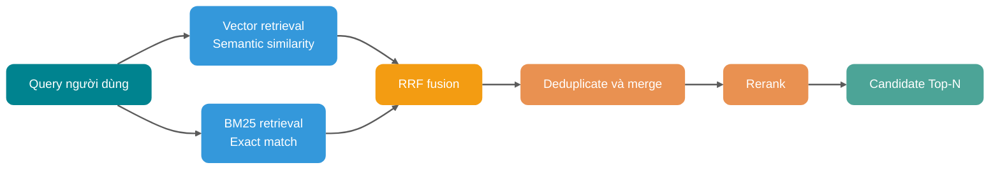
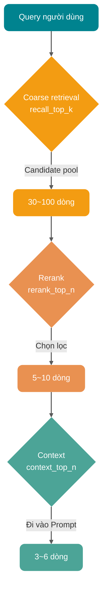
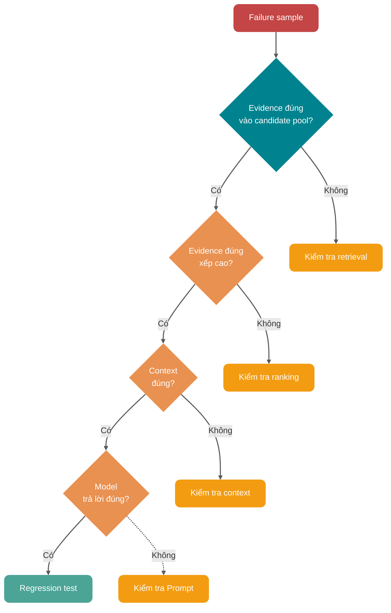

Khi RAG trả lời sai, thay Embedding model hoặc tăng Top-K ngay thường khó giải quyết vấn đề một cách ổn định. Lỗi phân tích bảng PDF, Chunk cắt đứt điều kiện, lọc quyền quá muộn hay candidate pool thiếu evidence đúng đều khiến model sinh nhận context sai.

Khi tuning, cần lần lượt định vị vấn đề qua document, index, retrieval, rerank, context và generation, sau đó replay các thay đổi trên evaluation set cố định.

## RAG thực sự đang tối ưu điều gì?

RAG giống một pipeline xử lý evidence hơn: tài liệu gốc trước hết được phân tích, làm sạch, chia Chunk, gắn nhãn và lập index; khi câu hỏi người dùng đến, hệ thống tiếp tục trải qua query understanding, retrieval, rerank và xây dựng context, cuối cùng mới giao cho LLM sinh câu trả lời.

Chỉ cần một khâu trong pipeline này gặp vấn đề, lỗi sẽ lan xuống các khâu sau.

| Khâu               | Vấn đề điển hình                                                   | Biểu hiện cuối cùng                                                   |
| ------------------ | ------------------------------------------------------------------ | --------------------------------------------------------------------- |
| Phân tích document | Bảng lệch cột, mất tiêu đề, thiếu số trang                         | Trích dẫn trong câu trả lời không chính xác, mất điều kiện quan trọng |
| Chia Chunk         | Block quá lớn, quá nhỏ, cắt đứt ranh giới ngữ nghĩa                | Retrieval nhiều noise hoặc đoạn được retrieve thiếu context           |
| Metadata           | Không lưu nguồn, thời gian, quyền, chương                          | Không thể filter, không thể trích dẫn, dễ vượt quyền                  |
| Retrieval          | Chỉ dùng vector retrieval, bỏ qua keyword và điều kiện có cấu trúc | Bỏ sót error code, SKU, version, proper noun                          |
| Rerank             | Đưa thẳng Top-K cho model                                          | Đoạn đúng bị xếp sau, model không thấy trọng tâm                      |
| Context            | Không deduplicate, không nén, không sắp xếp                        | Lãng phí Token, model bị noise gây nhiễu                              |
| Generation         | Prompt không giới hạn ranh giới evidence                           | Câu trả lời trôi chảy nhưng trích dẫn không khớp sự thật              |
| Evaluation         | Chỉ xem cảm nhận chủ quan, không lập test set                      | Thay đổi dựa vào cảm giác, liên tục rollback trên production          |

Một lần tuning RAG có hiệu quả hay không cuối cùng phải thể hiện ở tính hữu dụng, khả năng truy vết và độ ổn định của câu trả lời, cùng latency và cost phải trả. Với mỗi failure sample, ít nhất cần lưu lại năm kết quả kiểm tra: evidence đúng có được retrieve không, thứ hạng trong candidate, nội dung đi vào context, câu trả lời có bị evidence ràng buộc không, và thay đổi có reproduce được trên sample set cố định không. Thiếu các bản ghi này, việc lựa chọn vector database sẽ không có cơ sở đánh giá rõ ràng.

```mermaid
flowchart LR
    %% ========== Khai báo màu classDef ==========
    classDef client fill:#00838F,color:#FFFFFF,stroke:none,rx:10,ry:10
    classDef business fill:#E99151,color:#FFFFFF,stroke:none,rx:10,ry:10
    classDef infra fill:#9B59B6,color:#FFFFFF,stroke:none,rx:10,ry:10
    classDef success fill:#4CA497,color:#FFFFFF,stroke:none,rx:10,ry:10

    %% ========== Khai báo node ==========
    Doc[/Document gốc/]:::client
    Parse[Phân tích document]:::business
    Chunk[Chia Chunk]:::business
    Meta[Gắn Metadata]:::infra
    Index[Lập index]:::infra
    Query[Query người dùng]:::client
    Recall[Hybrid retrieval]:::business
    Rerank[Rerank]:::business
    Compress[Nén context]:::business
    LLM[LLM generation]:::business
    Answer[Câu trả lời cuối]:::success

    %% ========== Nối đường ==========
    Doc --> Parse --> Chunk --> Meta --> Index
    Query --> Recall
    Index --> Recall
    Recall --> Rerank --> Compress --> LLM --> Answer

    linkStyle default stroke-width:2px,stroke:#333333,opacity:0.8
```

## Vòng lặp tối ưu RAG

RAG production cần evaluation và replay. Nếu không, không thể biết một thay đổi đã cải thiện vấn đề nào và gây regression nào.

```mermaid
flowchart LR
    Q["Vấn đề production<br/>Failure sample"]:::client --> E["Đánh giá offline<br/>Tách metric"]:::infra
    E --> L["Định vị bottleneck<br/>Retrieval/Rerank/Generation"]:::business
    L --> T["Điều chỉnh strategy<br/>Chunk/Query/Rerank"]:::warning
    T --> G["Triển khai gray<br/>So sánh version"]:::gateway
    G --> M["Phản hồi monitoring<br/>Review thủ công"]:::success
    M --> Q

    classDef gateway fill:#7B68EE,color:#FFFFFF,stroke:none,rx:10,ry:10
    classDef business fill:#E99151,color:#FFFFFF,stroke:none,rx:10,ry:10
    classDef infra fill:#9B59B6,color:#FFFFFF,stroke:none,rx:10,ry:10
    classDef client fill:#00838F,color:#FFFFFF,stroke:none,rx:10,ry:10
    classDef success fill:#4CA497,color:#FFFFFF,stroke:none,rx:10,ry:10
    classDef warning fill:#F39C12,color:#FFFFFF,stroke:none,rx:10,ry:10
    linkStyle default stroke-width:2px,stroke:#333333,opacity:0.8
```

Mỗi lần điều chỉnh kích thước Chunk, strategy rewrite, Rerank model hay tham số Top-K, đều nên chạy lại cùng một nhóm câu hỏi, rồi so sánh Context Recall, Context Precision, Faithfulness, Answer Relevancy, latency và cost.

Không replay thì không biết hệ thống đã tốt hơn hay chỉ sai theo một cách khác.

## Quản trị data trước, tối ưu retrieval sau

Nếu data trước retrieval đã bị phân tích sai hoặc mất cấu trúc, retrieval và generation phía sau không thể khôi phục evidence gốc.

### Phân tích document quyết định giới hạn trên

PDF, Word, HTML, Markdown, record database và log ticket nhìn đều là text, nhưng cấu trúc thực tế khác nhau rất nhiều. Đặc biệt với bảng PDF, image, header, footer, footnote và bảng qua nhiều trang, nếu chỉ dùng text extraction thông thường thì thường xảy ra:

- Mất quan hệ giữa các cột trong bảng, khiến giá, version và điều kiện bị trộn lẫn.
- Header và footer bị ghi lặp vào mỗi Chunk, làm nhiễm vector space.
- Image và flowchart mất hoàn toàn, khiến câu trả lời thiếu bước quan trọng.
- Mất hierarchy của title, model không biết một đoạn thuộc chapter nào.

Với tài liệu R&D, tài liệu policy và product manual, **chất lượng phân tích thường quan trọng hơn việc đổi embedding model**.

Một gợi ý thực tế:

| Loại document      | Cách xử lý đề xuất                                          | Mục tiêu chính              |
| ------------------ | ----------------------------------------------------------- | --------------------------- |
| Markdown / HTML    | Giữ hierarchy của title, list và code block                 | Không phá cấu trúc tự nhiên |
| Tài liệu PDF       | Phân tích nội dung chính, bảng, số trang và chú thích image | Giữ ranh giới evidence      |
| Document dạng bảng | Chuyển thành record dạng cấu trúc hoặc bảng Markdown        | Giữ quan hệ giữa các field  |
| Tài liệu code      | Phân tầng theo package, class, method và comment            | Giữ ngữ nghĩa call          |
| Ticket/chat record | Chia theo session, thời gian và role                        | Giữ thứ tự context          |

Khi tỷ lệ bảng và image cao, có thể bổ sung OCR hoặc mô tả cấu trúc multimodal cho các document có hit rate thấp. Không đưa toàn bộ file trực tiếp cho vision model: trước hết bắt đầu từ document giá trị cao và failure sample thường gặp, quan sát xem lợi ích từ việc phân tích có bù được processing cost và thời gian chờ tăng thêm không.

### Vai trò của Metadata

Điều kiện filter trong retrieval request và thông tin nguồn của câu trả lời cuối đều phụ thuộc vào Metadata. Metadata vừa quyết định Chunk nào được vào candidate pool, vừa giúp kết quả quay về document gốc, số trang và version tương ứng.

Ít nhất nên lưu các field sau cho mỗi Chunk:

- `source_id`: ID của document gốc, thuận tiện cho việc trace và deduplicate.
- `source_type`: PDF, web, ticket, code, database record, v.v.
- `title`: title của document.
- `section_path`: path của chapter, ví dụ “Chính sách đổi trả / Phạm vi hậu mãi / Sản phẩm đặc biệt”.
- `page`: số trang hoặc vị trí đoạn.
- `created_at` / `updated_at`: filter theo thời gian và xác định version mới/cũ.
- `tenant_id` / `acl`: multi-tenant và access control.
- `business_tags`: product line, language, region, version, module.

Filter quyền phải tham gia query trước retrieval. Nếu vector database trước tiên trả về Top-10 nhưng 8 dòng không có quyền truy cập, sau filter còn 2 dòng không có nghĩa hệ thống chỉ tìm được 2 nội dung liên quan; một khi thiếu điều kiện quyền, context sẽ bị nhiễm trực tiếp.

Vì vậy, phạm vi có thể biểu đạt bằng Metadata nên được thu hẹp trước. Ví dụ, trước tiên giới hạn `tenant_id`, document type, version và thời gian cập nhật, sau đó mới tính vector similarity hoặc thực hiện hybrid retrieval.

## Strategy Chunk: đừng băm vụn knowledge

Ranh giới của Chunk quyết định đơn vị retrieval có thể mang theo bao nhiêu điều kiện và kết luận. Khi điều kiện bị cắt sang block liền kề, dù dùng rerank sau đó, hệ thống cũng chỉ có thể chọn trong candidate không đầy đủ.

### Kích thước Chunk không có giá trị vạn năng

512, 800, 1000 Token chỉ nên dùng để lập index thử nghiệm vòng đầu. Với câu có điều kiện trước như “Các trường hợp trên không áp dụng đổi trả không cần lý do trong bảy ngày”, chia quá nhỏ sẽ chỉ giữ lại kết luận; chia quá lớn thì một câu liên quan lại kéo cả đoạn giải thích không liên quan vào context.

Vòng đầu có thể bắt đầu trong các phạm vi sau:

- FAQ, policy ngắn, API description: có thể bắt đầu từ 200 đến 500 Token.
- Tài liệu kỹ thuật, tutorial, solution document: có thể bắt đầu từ 400 đến 800 Token.
- Regulation, contract, financial policy: chú trọng tính đầy đủ của điều khoản, ưu tiên chia theo title, điều, khoản và mục.
- Knowledge base về code: không chỉ chia theo Token, ưu tiên chia theo file, class, function và block comment.

Lập index riêng cho từng tham số candidate này, dùng cùng một nhóm câu hỏi để so sánh Context Recall, Context Precision, độ chính xác câu trả lời và số Token context trung bình, sau đó giữ lại một nhóm phù hợp với tập document hiện tại.

### Semantic chunking phù hợp với document ổn định

Semantic chunking kết hợp title, paragraph và quan hệ giữa các câu lân cận để xác định boundary, không cắt theo số character cố định. Khi topic trong document trộn lẫn, query thiên về khái niệm và có thể chấp nhận offline processing phức tạp hơn, thường có thể đưa nó vào thử nghiệm:

- Topic trong document trộn lẫn, một page liên tục trình bày nhiều khái niệm.
- Câu hỏi người dùng thiên về khái niệm thay vì tra một field cụ thể.
- Knowledge base cập nhật không thường xuyên và có thể chấp nhận offline preprocessing phức tạp hơn.

Cách chia này cũng có giới hạn áp dụng rõ ràng:

- Khi document thường xuyên incremental update, document thay đổi cần tính lại Embedding của câu hoặc paragraph, offline cost cao hơn chia theo cấu trúc. Semantic chunking phổ biến chỉ đánh giá nội dung lân cận trong một document, không yêu cầu mỗi lần phải cluster lại toàn bộ knowledge base.
- Cấu trúc document vốn đã rất rõ, chẳng hạn hierarchy title của Markdown.
- Query chủ yếu là tra chính xác number, field, status và config item.

Khi API document đã có OpenAPI path, method và parameter table, nên chia theo các cấu trúc này. Nếu chuyển sang dùng sentence Embedding để xác định boundary, parameter và điều kiện return có thể bị tách rời.

### Parent-Child Chunk là một thỏa hiệp rất thực dụng

Parent-Child Chunk xử lý riêng retrieval granularity và reading granularity. Dùng sub-Chunk 300 Token để lập vector index, đồng thời liên kết nó với parent paragraph 1200 Token; khi sub-block được hit, đưa parent paragraph vào context. Cách này vừa giúp query hit được cách diễn đạt ở granularity nhỏ, vừa giữ được điều kiện trước và phần giải thích liền kề, không cần chỉ dựa vào việc tăng Top-K để bù context. Document dài, tutorial, diễn giải policy và manual xử lý sự cố đều có thể dùng quan hệ liên kết này.

### Thêm semantic entry cho Chunk

“Hoàn tiền thế nào” và “đường dẫn yêu cầu refund” diễn đạt cùng một nhu cầu, nhưng độ tương đồng bề mặt của text chưa chắc đủ. Gặp khác biệt như vậy, có thể cung cấp thêm entry cho cùng một Chunk ở giai đoạn index:

- Sinh summary cho mỗi Chunk, đưa cả summary và body vào index.
- Sinh các câu hỏi có thể được trả lời cho mỗi Chunk, dùng question vector để hỗ trợ retrieval.
- Sinh title vector cho chapter để query dạng khái niệm trước tiên hit vào topic.
- Sinh mô tả có cấu trúc cho code hoặc table, tránh việc original text khó embedding.

Summary, question và mô tả có cấu trúc đều cần được sinh lại và maintain. Trước tiên xác minh trên document giá trị cao hoặc failure sample thường gặp xem các entry này có thể bổ sung evidence bị bỏ sót không, rồi mới quyết định mở rộng phạm vi.

## Tối ưu retrieval: đừng chỉ dựa vào vector similarity

Chuyển Query thành Embedding rồi lấy Top-K có thể làm baseline. Các exact term như error code, model và version dễ bị nội dung gần nghĩa nhưng sai chen mất, nên cần thêm keyword retrieval signal.

### Hybrid Search phù hợp với query nào?

Vector retrieval tìm candidate theo mức độ gần về ngữ nghĩa, còn BM25 match candidate theo term xuất hiện. Hai luồng có phạm vi bao phủ khác nhau với các loại query trong bảng sau.

| Loại query                                              | Biểu hiện của vector retrieval       | Biểu hiện của BM25          | Đề xuất                        |
| ------------------------------------------------------- | ------------------------------------ | --------------------------- | ------------------------------ |
| “Hủy subscription thế nào”                              | Có thể match “tắt auto-renewal”      | Có thể không match được     | Giữ vector retrieval           |
| “Error code E1027”                                      | Có thể retrieve sự cố tổng quát      | Hit chính xác error code    | Bắt buộc giữ keyword retrieval |
| “Thông số model ABX-4421”                               | Dễ tìm model tương tự                | Hit chính xác SKU           | Bắt buộc giữ keyword retrieval |
| “Khác biệt giữa các reject policy của Java thread pool” | Hiểu ngữ nghĩa khá tốt               | Có thể match keyword        | Hybrid ổn định hơn             |
| “Policy giá mới nhất v3.2”                              | Cần điều kiện ngữ nghĩa và thời gian | Có thể match version number | Metadata + Hybrid              |

Pipeline thực tế sẽ lấy song song semantic candidate và keyword candidate, dùng RRF hoặc weighted normalization để merge, sau đó deduplicate kết quả đã merge và giao cho Rerank. Microsoft Azure AI Search, Google Vertex AI Vector Search và Weaviate đều xem Hybrid Search và RRF là các solution phổ biến. RRF chỉ dựa vào rank của candidate để fusion, không cần quy đổi trực tiếp BM25 score và vector cosine score về cùng một scale.

Khi document có cấu trúc cao và query hầu như không chứa keyword, lợi ích của Hybrid có thể không rõ rệt. Ngược lại, với query có tỷ lệ cao về error code, product model, config item và proper noun, cần giữ keyword channel để tránh document tương tự nhưng không chứa entity chính xác bị xếp trước.

### Query Rewrite: trước hết biến câu hỏi thành query có thể retrieve

Input của người dùng thường thiếu object, thời gian và phạm vi cần cho retrieval. Ví dụ:

- “Lỗi này xử lý sao?”
- “Có hoàn tiền được không?”
- “Vấn đề rate limiting kia trên production lại xảy ra à?”

“Lỗi này xử lý sao” không nói rõ error code và service, “Có hoàn tiền được không” không nói rõ order status. Query Rewrite cần bổ sung cách diễn đạt có thể retrieve, nhưng không được thay đổi ý nghĩa câu hỏi thay người dùng.

Các strategy thường gặp:

| Strategy            | Tình huống áp dụng                              | Ví dụ                                                                                             |
| ------------------- | ----------------------------------------------- | ------------------------------------------------------------------------------------------------- |
| Rewrite chuẩn hóa   | Khẩu ngữ, viết tắt, thiếu context               | Đổi “Có hoàn tiền được không” thành “refund policy, điều kiện refund, quy trình refund”           |
| Multi-Query         | Một cách diễn đạt có thể có nhiều cách nói      | Đồng thời retrieve “hủy subscription”, “tắt auto-renewal”, “dừng membership plan”                 |
| Query Decomposition | Câu hỏi chứa nhiều sub-question                 | Tách “So sánh phí và xử lý tranh chấp của Stripe và Square” thành 4 sub-question                  |
| Step-back Query     | Câu hỏi quá chi tiết, thiếu background          | Retrieve “quy tắc tính phí subscription” trước, rồi trả lời câu hỏi hủy cụ thể                    |
| HyDE                | Query quá ngắn, khác biệt lớn với dạng document | Sinh hypothetical answer trước, rồi dùng vector của hypothetical answer để retrieve document thật |
| Self-Query          | Câu hỏi chứa điều kiện filter                   | Trích xuất filter theo năm và category từ “tìm policy liên quan Java năm 2025”                    |

Các component như `MultiQueryRetriever`, `SelfQueryRetriever` của LangChain đã đóng gói những strategy này. Dù có dùng các component đó hay không, Query gốc vẫn nên tham gia retrieval và fusion cùng kết quả rewrite: khi rewrite model hiểu sai “refund” thành “hủy subscription”, Query gốc vẫn giữ được entry retrieval đúng.

### Top-K không phải càng lớn càng tốt

Tăng Top-K làm tăng cơ hội evidence đúng vào candidate pool, đồng thời làm tăng input của Rerank, Prompt Token và tỷ lệ noise. Candidate pool, kết quả rerank và context cuối nên dùng các upper bound khác nhau:

- `recall_top_k`: candidate pool của coarse retrieval, ví dụ 30 đến 100.
- `rerank_top_n`: số lượng giữ lại sau rerank, ví dụ 5 đến 10.
- `context_top_n`: số lượng cuối cùng đi vào context, ví dụ 3 đến 6.

`recall_top_k` dùng để tránh bỏ sót retrieval, `rerank_top_n` dùng để kiểm soát cost của precision ranking, còn `context_top_n` do lượng evidence model thực tế có thể đọc quyết định. Ba giá trị này nên được điều chỉnh cùng nhau trên cùng một evaluation set.

## Rerank: sắp xếp lại “liên quan” thành “có thể trả lời”

Bi-encoder retrieval encode Query và document riêng biệt rồi tính vector distance, phù hợp để lấy candidate nhanh từ số lượng lớn document. Cross-Encoder hoặc Rerank model chuyên dụng encode Query và candidate document cùng nhau, cost cao hơn nhưng có thể đánh giá candidate có chứa điều kiện và kết luận cần cho câu trả lời không.

### Vì sao Rerank hữu ích?

Vector score đo mức độ gần nhau của cách diễn đạt; Rerank score phải phục vụ câu hỏi “nội dung này có thể trả lời query hiện tại không”.

Ví dụ:

Người dùng hỏi: “Vì sao thread pool kích hoạt reject policy?”

Vector retrieval có thể tìm được các đoạn sau:

1. Giải thích các parameter chính của thread pool.
2. Danh sách enum của reject policy.
3. Điều kiện kích hoạt reject policy sau khi queue đầy và số thread đạt `maximumPoolSize`.
4. Code example sử dụng thread pool.

Đoạn 1 và 2 rất gần về ngữ nghĩa, nhưng đoạn 3 mới là trọng tâm của câu trả lời. Giá trị của Rerank là đưa đoạn 3 lên đầu.

### Đặt Rerank ở đâu?

Có thể chia pipeline thành năm bước: pre-filter bằng Metadata, coarse retrieval bằng Hybrid Search lấy 30 đến 100 dòng, deduplicate và merge các đoạn liền kề, Rerank chọn 5 đến 10 dòng, cuối cùng nén rồi ghi vào Prompt.

Rerank không thể bổ sung document không tồn tại trong candidate pool. Trước tiên hãy kiểm tra Context Recall; nếu coarse retrieval không có đoạn đúng, cần quay lại kiểm tra phía parsing, Chunk và query thay vì tiếp tục đổi Rerank model.

### Chọn LLM Rerank hay Reranker chuyên dụng?

| Solution               | Ưu điểm                                          | Nhược điểm                                                                                  | Tình huống áp dụng                                      |
| ---------------------- | ------------------------------------------------ | ------------------------------------------------------------------------------------------- | ------------------------------------------------------- |
| Cross-Encoder Reranker | Đánh giá relevance chi tiết, cost kiểm soát được | Cần chọn model, có thể có bias về language và domain                                        | Pipeline production tổng quát                           |
| LLM scoring            | Có thể xuất lý do chấm điểm, rule linh hoạt      | Chậm, đắt, stability bị ảnh hưởng bởi Prompt; lý do không đồng nghĩa với sự thật quyết định | Traffic thấp, giá trị cao, phán đoán phức tạp           |
| Rule-based rerank      | Rẻ, kiểm soát được                               | Chỉ xử lý rule rõ ràng                                                                      | Time, permission, version, source priority              |
| Hybrid rerank          | Linh hoạt, phù hợp business phức tạp             | Engineering complexity cao                                                                  | Enterprise knowledge base, customer service, compliance |

Reranker chuyên dụng có thể đảm nhận relevance judgment trong main pipeline, còn các điều kiện xác định như thời gian, quyền và version giao cho rule xử lý; LLM scoring phù hợp với offline evaluation hoặc phán đoán phức tạp ở traffic thấp. Khi chọn model, cần so sánh riêng trên target language, domain data, latency và cost.

## Context engineering: đừng biến model thành thùng rác

Sau khi retrieval hoàn tất, vẫn phải quyết định đoạn nào đi vào Prompt theo thứ tự nào. Context window lớn hơn không có nghĩa có thể bỏ qua attention, latency, cost và signal-to-noise ratio; đoạn không liên quan sẽ chiếm vị trí đọc của model và gây ra các hậu quả sau:

- Chọn nhầm evidence, lấy đoạn tương tự nhưng không liên quan làm căn cứ.
- Bỏ qua thông tin quan trọng ở vị trí giữa.
- Câu trả lời dài hơn nhưng thiếu trọng tâm.
- Trích dẫn sai source.
- Cost và first-token latency tăng rõ rệt.

Mỗi đoạn đi vào Prompt đều phải hỗ trợ được một kết luận, điều kiện hoặc ngoại lệ trong query hiện tại.

### Nén context

Thao tác nén cần giữ evidence xoay quanh Query hiện tại, không phải tóm tắt tất cả candidate theo cùng một cách. Các lựa chọn thường gặp:

| Cách nén               | Cách làm                                        | Rủi ro                               |
| ---------------------- | ----------------------------------------------- | ------------------------------------ |
| Trích xuất có chọn lọc | Chỉ giữ câu gốc liên quan đến query             | Có thể bỏ sót điều kiện ẩn           |
| Summary theo query     | Nén đoạn dài thành summary xoay quanh query     | Có thể đưa vào bias do rewrite       |
| Trích xuất có cấu trúc | Trích xuất field, điều kiện, kết luận, ngoại lệ | Phụ thuộc thiết kế extraction Schema |

`ContextualCompressionRetriever` thể hiện cách kết hợp “retriever cơ sở và compressor”. Trong thực tế, có thể filter và deduplicate bằng rule trước, sau đó chỉ gọi LLM compression cho đoạn dài để tránh trả model-call cost cho từng Chunk.

### Thứ tự context cũng ảnh hưởng đến câu trả lời

Thứ tự trả về thường trộn lẫn retrieval channel, document source và version, không thể dùng trực tiếp làm thứ tự Prompt. Có thể tổ chức theo các rule sau:

- Đặt evidence liên quan nhất lên trước.
- Cố gắng giữ thứ tự gốc của các đoạn liền kề trong cùng một document.
- Gắn thời gian cập nhật và version cho các đoạn mâu thuẫn nhau.
- Giữ source information của đoạn được trích dẫn.
- Không trộn evidence confidence thấp với evidence confidence cao.

So sánh giữa các document có thể group theo topic, phân tích thời gian có thể sắp theo timeline, còn xử lý sự cố có thể tổ chức theo “hiện tượng, nguyên nhân, bước xử lý, lưu ý”. Context engineering xử lý cấu trúc của các evidence này trong model input, không chỉ số lượng retrieval.

### Prompt phải giới hạn ranh giới evidence

Prompt ít nhất nên ghi rõ các ranh giới sau:

- Chỉ trả lời dựa trên context được cung cấp.
- Khi context không đủ, nói rõ không thể phán đoán.
- Cố gắng đính kèm source cho mỗi kết luận quan trọng.
- Không coi document tương tự là fact của version hiện tại.

Đánh giá chất lượng evidence và kiểm tra citation vẫn phải thực hiện bên ngoài Prompt. Prompt có thể biểu đạt “từ chối khi evidence không đủ”, nhưng không thể tự xác minh model có tuân thủ hay không.

## Evaluation: tách riêng vấn đề retrieval và generation

Evaluation RAG cần được tách ra xem. Chỉ xem score của câu trả lời cuối rất khó biết khâu nào thực sự hỏng.

### Lập một evaluation set tối thiểu

Không cần ngay từ đầu tạo vài nghìn sample. Trước tiên bắt đầu từ 50 đến 100 câu hỏi giá trị cao:

- Câu hỏi người dùng thường gặp.
- Câu hỏi thất bại trên production.
- Câu hỏi quan trọng với business.
- Câu hỏi cần multi-hop reasoning.
- Câu hỏi cần exact match, ví dụ error code, version number, SKU.
- Câu hỏi dễ vượt quyền hoặc hết hạn.
- Câu hỏi mà hệ thống nên từ chối trả lời.

Mỗi sample tốt nhất nên có:

- `question`: câu hỏi gốc của người dùng.
- `golden_answer`: câu trả lời lý tưởng.
- `golden_context`: đoạn evidence hoặc document đáng lẽ phải hit.
- `metadata_filter`: điều kiện filter cần thiết.
- `answer_type`: factual QA, mô tả quy trình, so sánh, refusal, summary, v.v.

### Tách retrieval metric và generation metric

| Metric            | Đối tượng đo                  | Mô tả                                                        |
| ----------------- | ----------------------------- | ------------------------------------------------------------ |
| Hit Rate@K        | Retrieval                     | Evidence đúng có xuất hiện trong K kết quả đầu không         |
| MRR               | Ranking                       | Evidence đúng đầu tiên được xếp gần đầu đến mức nào          |
| Context Recall    | Tính đầy đủ của retrieval     | Evidence cần cho câu trả lời có được tìm đủ không            |
| Context Precision | Độ thuần của context          | Nội dung đưa vào context có bao nhiêu phần thực sự liên quan |
| Faithfulness      | Độ trung thành của generation | Câu trả lời có được context hỗ trợ không                     |
| Answer Relevancy  | Relevance của câu trả lời     | Câu trả lời có thực sự đáp ứng câu hỏi người dùng không      |
| Citation Accuracy | Độ chính xác của citation     | Vị trí citation có hỗ trợ kết luận tương ứng không           |
| Latency / Cost    | Engineering metric            | P95 latency, Token, thời gian rerank, cache hit rate         |

RAGAS, DeepEval, LangSmith và các tool khác đều hỗ trợ đánh giá xoay quanh context relevance, faithfulness và answer relevance. Tài liệu RAGAS tách khá rõ các metric như Context Precision, Context Recall, Faithfulness và Response Relevancy; DeepEval cũng hỗ trợ kết hợp retrieval metric và generation metric thành end-to-end test.

Tuy nhiên cần nhớ: **LLM-as-a-Judge không phải chân lý của việc chấm điểm, mà chỉ là một auxiliary signal.**

Trước khi đưa lên production, ít nhất cần lấy mẫu để review thủ công một nhóm kết quả, hiệu chỉnh xem evaluator tự động có thiên về câu trả lời dài không, có bỏ sót citation sai không, và có nhạy với thuật ngữ của domain tiếng Việt không.

### Mỗi thay đổi đều phải version hóa

Mỗi kết quả evaluation phải gắn được với các thông tin version sau:

- Version của document parser.
- Version của strategy Chunk.
- Version của Embedding model.
- Version của index parameter.
- Version của Query Rewrite Prompt.
- Version của Rerank model.
- Version của generation Prompt.
- Version của evaluation set.

Khi metric thay đổi sau khi knowledge base update, chỉ các bản ghi này mới giúp xác định regression đến từ parsing, index, retrieval hay generation.

## Lỗi thường gặp

### Chỉ tuning Embedding

Khi phân tích bảng PDF sai, Chunk làm mất điều kiện trước, Metadata chưa filter quyền, hoặc document đúng vốn không vào candidate pool, Embedding có tốt đến đâu cũng không thể bổ sung evidence bị thiếu. Trước tiên cần phân biệt vấn đề retrieval, ranking, context và generation trên evaluation set, sau đó mới quyết định có điều chỉnh Embedding không.

### Không làm evaluation

Một câu trả lời trông tốt hơn không chứng minh hiệu quả tổng thể tăng. Sau khi tăng Top-K, một số câu hỏi có thể lấy lại được evidence, nhưng câu hỏi khác lại bị noise gây nhiễu; không có sample set cố định thì rất khó thấy đồng thời hai thay đổi này. Evaluation set tối thiểu nên bao phủ câu hỏi thường gặp, failure, exact match và refusal.

### Mù quáng tăng Top-K

Top-K lớn hơn sẽ làm tăng rerank cost, Prompt Token và model latency, đồng thời giảm signal-to-noise ratio của context. Khi cần tăng retrieval coverage, có thể tăng candidate pool của coarse retrieval, sau đó dùng Rerank và compression để lọc noise; không ghép trực tiếp candidate mới vào context. Coarse retrieval Top-K, Rerank Top-N và Context Top-N cần được ghi nhận và đánh giá riêng.

### Nhồi context không liên quan cho model

Khi policy của nhiều version, document của product tương tự và các đoạn liền kề nhưng không liên quan bị trộn với nhau, model có thể ghép chúng thành kết luận trông hợp lý nhưng thực tế sai. Trước khi ghi vào Prompt, cần deduplicate, nén, sắp xếp theo evidence strength và giữ version cùng source.

### Bỏ qua khả năng refusal

Khi confidence của retrieval thấp, evidence mâu thuẫn hoặc người dùng không có quyền truy cập document quan trọng, hệ thống nên refusal, hỏi thêm hoặc chuyển cho người xử lý. Có thể thêm bước đánh giá chất lượng evidence sau retrieval, rồi tùy kết quả kích hoạt query rewrite, mở rộng phạm vi, external search hoặc refusal.

## Một quy trình kiểm tra sự cố có thể triển khai

Khi hiệu quả RAG trên production giảm, record kiểm tra trước hết cần xác nhận evidence đúng có vào candidate pool không, sau đó kiểm tra ranking, context và câu trả lời cuối. Cách này giúp tránh sửa Prompt, model và retrieval parameter cùng lúc.

### Bước một: phân loại failure sample

Trước tiên xem 20 đến 50 failure question và chia chúng thành các nhóm:

- Hoàn toàn không retrieve được document đúng.
- Retrieve được document đúng nhưng ranking thấp.
- Document đúng đã vào context nhưng câu trả lời không dùng đến.
- Câu trả lời đã dùng context nhưng hiểu sai.
- Trích dẫn source không tồn tại hoặc không liên quan.
- Đáng lẽ phải refusal nhưng lại cố trả lời.
- Filter theo quyền, thời gian hoặc version bị sai.

Giá trị của bước này rất cao vì mỗi nhóm vấn đề tương ứng với hướng sửa hoàn toàn khác nhau.

### Bước hai: trước tiên xem evidence đúng có vào candidate pool không

Khi evidence đúng không xuất hiện trong coarse retrieval Top-50, trước tiên kiểm tra:

- Document đã vào database chưa.
- Document đã được phân tích đúng chưa.
- Chunk có cắt đứt fact quan trọng không.
- Metadata filter có quá chặt không.
- Query có cần rewrite, decomposition hoặc HyDE không.
- Có cần BM25 hoặc Hybrid Search không.

Ở thời điểm này tiếp tục tuning Rerank không có ý nghĩa: candidate pool không có câu trả lời thì rerank chỉ có thể thay đổi thứ tự của các kết quả sai.

### Bước ba: evidence đúng ở trong candidate pool nhưng không vào context

Khi evidence đúng đã ở Top-50 nhưng không vào context cuối, hãy kiểm tra:

- Rerank model có phù hợp với language và domain không.
- Rerank input có quá dài và bị truncate không.
- Score fusion có khiến keyword result bị đẩy xuống không.
- Merge các Chunk liền kề có kéo noise vào cùng không.
- `rerank_top_n` có quá nhỏ không.

Các signal này lần lượt hướng đến Rerank model, fusion weight, kích thước candidate pool hoặc strategy deduplicate.

### Bước bốn: context đúng nhưng câu trả lời sai

Khi evidence đúng đã được ghi vào Prompt nhưng model vẫn trả lời sai, hãy kiểm tra:

- Prompt có yêu cầu trả lời dựa trên context không.
- Context có version xung đột với nhau không.
- Evidence có bị chìm ở vị trí giữa context không.
- Câu hỏi có cần multi-hop reasoning hoặc comparison table không.
- Có cần structured output và citation constraint không.
- Có cần nén trước rồi mới generation không.

Sau khi xác nhận ba nhóm vấn đề trước đã được loại trừ, mới điều chỉnh Prompt, context ordering, compression và generation model.

### Bước năm: lập regression test

Mỗi khi sửa một failure sample, cần đưa reproduction input, evidence kỳ vọng và tiêu chí đánh giá vào evaluation set. Các thay đổi sau đó dùng set này để replay, nhờ vậy mới phát hiện một lần sửa có gây regression mới không.

## Thứ tự triển khai từ đầu

Khi xây dựng enterprise RAG từ đầu, trước hết cần đảm bảo document parsing, denoise, hierarchy của title, số trang, table và Metadata có thể được sử dụng chính xác; đồng thời chạy evaluation replay bằng các câu hỏi bao phủ scenario thường gặp, failure, exact match, permission và refusal.

Sau khi có baseline, lần lượt so sánh fixed-length, structured, Parent-Child và semantic Chunk; dùng vector retrieval để xử lý nội dung gần nhau về ngữ nghĩa, dùng BM25 hoặc sparse vector để giữ exact term; cuối cùng thêm Query Rewrite cho câu hỏi khẩu ngữ, viết tắt, nhiều intent và multi-hop. Sau khi candidate pool được mở rộng, qua Rerank, deduplicate, crop, summary hoặc structured extraction mới hình thành context chịu ràng buộc bởi Token và noise.

Phía generation cần xử lý refusal khi evidence không đủ và citation của kết luận quan trọng. Trong giai đoạn gray release, ghi nhận metric theo version và liên tục thu thập failure sample. Mỗi vòng chỉ thay đổi một số ít variable, đồng thời ghi lại version của parser, Chunk, Embedding, index, Query Rewrite, Rerank và Prompt; lợi ích offline được regression set xác nhận vẫn cần tiếp tục quan sát trên traffic gray.

## Tổng kết

Một lần tuning replay bắt đầu từ nội dung có thể retrieve do parsing và Metadata tạo ra, đi qua Chunk, Hybrid Search, Query Rewrite, Rerank và context orchestration, cuối cùng kiểm tra evidence model thực tế đọc cùng câu trả lời. Evaluation set cố định và bản ghi version giúp mọi thay đổi ở từng khâu đều có thể được so sánh lặp lại.

## Tài liệu tham khảo

- [Production RAG: The Five Decisions Behind Every System That Works](https://www.bestblogs.dev/article/899eff0a)
- [Từ điển tối ưu RAG: Giải thích chi tiết 20 phương pháp tối ưu RAG](https://cloud.tencent.com/developer/article/2634637)
- [Weaviate Hybrid Search Documentation](https://docs.weaviate.io/weaviate/concepts/search/hybrid-search)
- [Microsoft Azure AI Search: Hybrid Search RRF](https://learn.microsoft.com/en-us/azure/search/hybrid-search-ranking)
- [Google Vertex AI Vector Search: Hybrid Search](https://docs.cloud.google.com/vertex-ai/docs/vector-search/about-hybrid-search)
- [Cohere Rerank Documentation](https://docs.cohere.com/docs/rerank-overview)
- [LangChain Retriever API Documentation](https://api.python.langchain.com/en/latest/langchain/retrievers.html)
- [RAGAS Metrics Documentation](https://docs.ragas.io/en/stable/concepts/metrics/available_metrics/context_precision/)
- [DeepEval RAG Evaluation Guide](https://deepeval.com/guides/guides-rag-evaluation)
