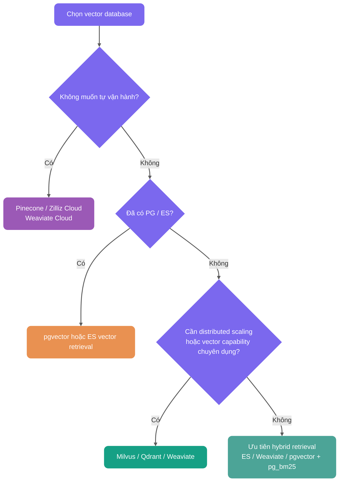

Lưu Embedding vào field thông thường và tính distance từng dòng có thể làm baseline cho exact retrieval khi dữ liệu ít. Khi quy mô dữ liệu, concurrency hoặc yêu cầu latency tăng lên, chi phí tính toán của full table scan cũng tăng tuyến tính theo số lượng vector. Khi đó cần đánh giá ANN index hoặc hệ thống vector retrieval chuyên dụng.

Bài viết bắt đầu từ distance metric và index algorithm, sau đó kết hợp PostgreSQL + pgvector để giải thích tham số, hành vi filtering và cách lựa chọn HNSW, IVFFLAT.

## Mối quan hệ giữa Embedding và vector retrieval là gì?

Vector database không trực tiếp hiểu text. Nó lưu trữ và retrieval Embedding.

Quy trình Embedding là: đưa một đoạn text cho Embedding model, model xuất ra một dense vector có số chiều cố định. Có thể hiểu sơ lược đó là “tọa độ ngữ nghĩa của text”. Ngữ nghĩa của hai đoạn text càng gần nhau thì distance của chúng trong vector space thường càng gần nhau.


Pipeline vector retrieval của RAG có thể được đơn giản hóa như sau:

```text
Document Chunk -> Embedding model -> document vector -> ghi vào vector database
User query -> Embedding model -> query vector -> retrieval Top-K document vector tương đồng nhất
```

Các khái niệm cơ bản có trong [RAG Basics](./rag-basis.md). Bài viết này tập trung vào nửa sau: làm thế nào để lưu trữ, index và retrieval các vector này hiệu quả.

## Vì sao scenario RAG cần vector database?

Semantic retrieval bằng vector là một trong các cách recall thường dùng của RAG. Hệ thống chuyển document và user query thành high-dimensional vector, sau đó tìm các đoạn Top-K tương đồng nhất làm context cho LLM. RAG cũng có thể dùng BM25, SQL, graph query hoặc external API để retrieval; cách cụ thể phụ thuộc vào dạng dữ liệu.

Vì vậy, vấn đề thực sự cần giải quyết trong scenario RAG không chỉ là “có lưu được Embedding hay không”, mà là có thể tìm ra Top-K liên quan nhất trong các high-dimensional vector ở quy mô lớn với latency thấp hay không.

Relational database truyền thống có thể lưu vector và tính similarity thông qua function hoặc SQL expression. Nhưng nếu không có vector index chuyên dụng thì thường chỉ có thể full table scan, rất khó đáp ứng low-latency retrieval ở production. Khi số lượng Chunk đạt hàng trăm nghìn, hàng triệu hoặc cao hơn, cần đưa vào vector database, vector search engine, hoặc database extension có khả năng vector index như PostgreSQL + pgvector.


### High-dimensional vector similarity search

Embedding thường là dense vector từ 768 đến 3072 chiều. Khi không có vector index, dù database có thể tính cosine similarity, inner product hoặc Euclidean distance, vẫn rất khó hoàn thành Top-K retrieval nhanh trên dữ liệu quy mô lớn.

Brute-force search là duyệt toàn bộ table để tính distance, độ phức tạp là O(n). Lấy 1 triệu vector 1024 chiều làm ví dụ, một query cần thực hiện khoảng:

```text
1,000,000 × 1,024 phép nhân
```

Latency thực tế rất dễ đạt mức giây, tùy thuộc vào hardware và implementation. Với hệ thống hỏi đáp realtime, latency mức giây về cơ bản không thể chấp nhận.

ANN (Approximate Nearest Neighbor, approximate nearest-neighbor retrieval) được tạo ra để giải quyết vấn đề này. Vector database giảm số lần tính distance thông qua graph navigation, không gian partition, quantization và các cách khác, không còn tính toán mọi vector trong mỗi lần.

Giá trị của ANN không nằm ở việc luôn trả về nearest neighbor chính xác 100%, mà ở trade-off engineering giữa recall, latency và resource consumption. Với index parameter và hardware phù hợp, ANN thường có thể tối ưu vector retrieval quy mô hàng triệu từ brute-force scan mức giây xuống vài chục millisecond hoặc thấp hơn. Tuy nhiên, hiệu quả cụ thể phải được đo bằng business data, Top-K, filter condition, concurrency và mục tiêu recall; không thể chỉ nhìn vào độ phức tạp lý thuyết.

| Metric         | Brute-force search                 | ANN index retrieval                          |
| -------------- | ---------------------------------- | -------------------------------------------- |
| Cách retrieval | Tính distance trên toàn bộ dữ liệu | Chỉ search candidate set                     |
| Recall         | Về lý thuyết 100%                  | Phụ thuộc vào index type và parameter        |
| Latency        | Dữ liệu càng lớn càng chậm         | Thường thấp hơn nhiều                        |
| Chi phí        | Chi phí tính toán cao              | Cần build index, chiếm thêm memory hoặc disk |

Bảng trên chỉ mô tả theo cấp độ. Performance thực tế liên quan đến hardware specification, concurrent load, data distribution, filter condition, Top-K và index parameter (như `ef_search`, `nprobe`). Khi lựa chọn và tuning, nên tham khảo [ann-benchmarks.com](https://ann-benchmarks.com); quan trọng hơn là verify trong business environment của chính bạn.

### Khả năng đáp ứng dữ liệu quy mô lớn

Vector database thường cung cấp các khả năng như persistence, incremental update, sharding và index construction. Database truyền thống cũng có thể lưu vector dưới dạng field; có cần vector database độc lập hay không phải kết hợp kiểm thử technology stack hiện có, vector dimension, filter condition, QPS, latency và recall target. Khi thiếu vector index, dữ liệu tăng sẽ trực tiếp làm tăng chi phí exact scan.

### Semantic retrieval khác keyword retrieval như thế nào?

Keyword retrieval và vector semantic search giải quyết hai loại vấn đề.

| Cách retrieval         | Nguyên lý                                       | Hạn chế                                                                                           |
| ---------------------- | ----------------------------------------------- | ------------------------------------------------------------------------------------------------- |
| BM25 keyword           | Literal matching, dựa trên thống kê tần suất từ | Dễ mất tác dụng khi gặp synonym hoặc cách diễn đạt lại, ví dụ “trả hàng” và “quy trình hoàn tiền” |
| Vector semantic search | Embedding capture semantic similarity           | Xử lý được synonym, context và implicit intent, nhưng phụ thuộc vào chất lượng Embedding          |

Document chunking strategy và Embedding model cùng quyết định theoretical upper bound của semantic recall; vector database chịu trách nhiệm hiện thực hóa upper bound này trong latency có thể chấp nhận.

RAG ở production thường còn cần một số khả năng:

- Metadata filtering, ví dụ `WHERE category='Java' AND version>='v2'`, query kết hợp với vector similarity.
- Hybrid Search, kết hợp vector, BM25 và RRF.
- Dynamic update, hỗ trợ incremental write. Tuy nhiên, update và delete với tần suất cao sẽ khiến vector index phình to, tích lũy dữ liệu invalid, làm recall hoặc latency dao động; cần liên tục theo dõi kết hợp với `VACUUM`, `REINDEX`, execution plan và business evaluation set.
- Permission và multi-tenant isolation, đây là yêu cầu cơ bản của enterprise RAG.

## Chọn vector similarity và distance metric như thế nào?

Vector database không làm keyword matching, mà tính distance hoặc similarity giữa query vector và document vector. Trong scenario RAG, các loại thường gặp là cosine distance, inner product và Euclidean distance.

Lấy pgvector làm ví dụ, ba cách viết thường dùng như sau:

| Metric                           | pgvector operator | operator class      | Đặc điểm                                                                                                          | Scenario phù hợp                                       |
| -------------------------------- | ----------------- | ------------------- | ----------------------------------------------------------------------------------------------------------------- | ------------------------------------------------------ |
| Euclidean distance (L2 Distance) | `<->`             | `vector_l2_ops`     | Đo absolute distance trong vector space, giá trị càng nhỏ càng tương đồng                                         | Model hoặc index tối ưu rõ ràng theo L2                |
| Inner Product                    | `<#>`             | `vector_ip_ops`     | pgvector trả về negative inner product, giá trị càng nhỏ càng tương đồng                                          | Vector đã normalized, ưu tiên computational efficiency |
| Cosine Distance                  | `<=>`             | `vector_cosine_ops` | Không nhạy với độ dài vector, giá trị càng nhỏ càng tương đồng; cosine similarity có thể tính bằng `1 - distance` | Text semantic retrieval, thường dùng nhất trong RAG    |

Nếu trong interview được hỏi “vì sao RAG thường dùng cosine similarity”, có thể trả lời như sau: text semantic retrieval quan tâm hơn đến việc direction có gần nhau hay không, chứ không phải bản thân độ dài vector; cosine distance không nhạy với độ dài, phù hợp hơn để đánh giá semantic similarity. Nếu output của Embedding model đã normalized, inner product và cosine thường tương đương về ranking, còn inner product tính trực tiếp hơn.

Không nên chọn tùy cảm tính. Hãy xem Embedding model có normalized hay không, metric được official recommendation là gì và vector database index có hỗ trợ operator class tương ứng hay không.

Trong thực tế, một pitfall dễ gặp nhất là: query operator phải nhất quán với index operator class. Ví dụ index dùng `vector_cosine_ops` thì query cũng phải dùng `<=>`; nếu không, PostgreSQL có thể không sử dụng được vector index này.

## Vector index algorithm là gì?

Vấn đề vector index algorithm cần giải quyết là: trong số lượng lớn high-dimensional vector, làm thế nào nhanh chóng tìm được một vài vector tương đồng nhất với query vector.

Khi không có index, chỉ có thể so sánh toàn bộ vector trong database một lần, đây là brute-force search. Với dữ liệu hàng triệu hoặc hàng trăm triệu, latency này không thể chấp nhận.

Mục tiêu của vector index là tổ chức dữ liệu trước để khi query có thể bỏ qua phần lớn vector không liên quan, chỉ thực hiện so sánh chính xác trong một candidate set nhỏ hơn nhiều.

Một phép so sánh đời thường:

- Không có index: tìm một người bằng cách gõ cửa từng nhà trong cả thành phố.
- Có index: trước tiên xác định khu vực, sau đó xác định đường phố, rồi xác định tòa nhà.

Trong thực tế, vector index algorithm có thể chia đại khái thành hai loại.


Phần lớn thời gian khi nói về vector index là nói về ANN algorithm. Lợi ích của index liên quan đến data distribution, hardware, Top-K, filter condition và recall target, không thể khái quát bằng một hệ số cố định. Khi tuning, cần đồng thời ghi lại query latency, resource consumption và recall.

### Exact Nearest Neighbor (ENN)

Mục tiêu của ENN là tìm được vector tương đồng nhất với độ chính xác 100%. Các cấu trúc spatial tree truyền thống như KD-Tree và VP-Tree đều thuộc hướng này.

Vấn đề là KD-Tree, VP-Tree và các spatial tree khác có ưu thế hơn trên dữ liệu low-dimensional; khi số chiều tăng, hiệu quả pruning thường giảm và query có thể gần với brute-force scan. Mức độ suy giảm phụ thuộc vào data distribution và implementation, không thể dùng một số chiều cố định làm ranh giới.

### Approximate Nearest Neighbor (ANN)

ANN là hướng chủ đạo của modern vector retrieval. Nó chấp nhận một trade-off engineering: không đảm bảo tìm được absolute nearest neighbor 100%, mà tìm được result đủ tương đồng với xác suất rất cao, đổi một phần recall loss lấy speedup vài bậc độ lớn.

Các ANN algorithm phổ biến chủ yếu có ba loại:

- Graph-based algorithm, ví dụ HNSW. Nó tổ chức vector thành multi-layer network graph, khi query thì di chuyển trên graph như navigation. HNSW thường đạt được balance tương đối tốt giữa query speed và recall, là một trong các loại algorithm có performance tổng thể rất mạnh hiện nay.
- Quantization-based algorithm, ví dụ IVF-PQ. Nó dùng clustering và compression để nén lượng lớn vector thành dữ liệu nhỏ hơn, giảm memory consumption, phù hợp hơn với scenario quy mô cực lớn.
- Hash-based algorithm, ví dụ LSH. Nó dùng hash function đặc biệt để các vector tương đồng có xác suất cao rơi vào cùng một bucket, từ đó thu hẹp search range.

## Có những vector index algorithm nào?

Trong RAG application, index algorithm ảnh hưởng trực tiếp đến recall, response latency và resource consumption.

Trước tiên phân biệt hai level:

| Level                       | Ví dụ                       | Mô tả                                                                 |
| --------------------------- | --------------------------- | --------------------------------------------------------------------- |
| Vector database             | Milvus, Qdrant, pgvector    | Hệ thống hoàn chỉnh phụ trách vector storage, retrieval và management |
| Index algorithm được hỗ trợ | HNSW, IVF-PQ, IVFFLAT, Flat | Implementation bên trong quyết định retrieval performance và recall   |

Có thể xem bảng này trước để nắm các index algorithm mainstream:

| Tên algorithm                 | Cơ chế                                        | Ưu điểm chính                                           | Nhược điểm chính                                         | Mô tả scenario phù hợp ổn định hơn                                                                                |
| ----------------------------- | --------------------------------------------- | ------------------------------------------------------- | -------------------------------------------------------- | ----------------------------------------------------------------------------------------------------------------- |
| Flat (brute-force search)     | Duyệt tất cả vector để tính distance          | Chính xác 100%, không loss                              | Query rất chậm khi dữ liệu lớn                           | Quy mô nhỏ, QPS thấp, offline evaluation, recall baseline                                                         |
| HNSW (graph index)            | Small-world graph điều hướng phân tầng        | Query nhanh, recall cao                                 | Memory consumption lớn, build tốn thời gian              | Quy mô vừa đến lớn, recall cao, latency thấp; thường gặp ở quy mô triệu, quy mô chục triệu cần đánh giá kỹ memory |
| IVFFLAT (inverted clustering) | Clustering + inverted index bucket            | Memory efficiency tốt hơn, build nhanh hơn              | Cần training trước, recall thấp hơn đôi chút             | Quan tâm hơn đến memory và build speed, chấp nhận một phần recall loss                                            |
| IVF-PQ (product quantization) | Clustering + vector compression mạnh          | Hỗ trợ dữ liệu cực lớn, overhead thấp                   | Precision loss lớn hơn                                   | Quy mô cực lớn, nhạy cảm với memory, chấp nhận quantization error                                                 |
| IVF_RABITQ                    | Clustering + random rotation bit quantization | Memory consumption thấp, recall tốt hơn PQ truyền thống | Algorithm mới hơn, ecosystem support vẫn đang phát triển | Quy mô cực lớn, nhạy cảm với memory, chấp nhận quantization error                                                 |

Nói thêm ngắn gọn về IVF_RABITQ. Đây là thế hệ quantization algorithm mới được đề xuất năm 2024, với ý tưởng cốt lõi là Random Rotation + Bit Quantization. Khác với PQ truyền thống chia vector thành các sub-vector rồi clustering riêng, RABITQ trước tiên random rotation vector để phân bố của các dimension đồng đều hơn, sau đó quantize mỗi dimension thành 1 bit và chỉ giữ lại sign bit. Cách này có thể nén memory đáng kể trong khi vẫn giữ recall cao, đồng thời distance calculation có thể được tăng tốc bằng bit operation. Milvus 2.6.x đã cung cấp index type `IVF_RABITQ`.

## Project của bạn sử dụng vector index algorithm nào?

Ở đây lấy project ["SpringAI Intelligent Interview Platform + RAG Knowledge Base"](https://javaguide.cn/zhuanlan/interview-guide.html) làm ví dụ.

Project sử dụng PostgreSQL pgvector extension và cấu hình HNSW index.

Vì sao chọn HNSW? Vì ở quy mô business hiện tại, nó khá cân bằng giữa retrieval speed, recall và engineering complexity.

Có thể hiểu HNSW như một multi-layer highway network.


HNSW có ba cơ chế cốt lõi.

Thứ nhất là hierarchical construction. Level cao nhất của node được quyết định bởi công thức `level = floor(-ln(random()) * mL)`, trong đó `mL` là level multiplier. Điều này khiến số lượng node ở level càng cao giảm theo cấp số nhân, tạo thành cấu trúc tương tự pyramid.

Thứ hai là greedy search. Retrieval bắt đầu từ top level, ở mỗi level đều di chuyển đến neighbor node gần query point nhất.

Thứ ba là coarse-to-fine. Upper level phụ trách nhanh chóng định vị semantic region, lower level phụ trách tìm candidate nearest neighbor tinh hơn.

Cách tìm này có thể nhanh chóng định vị candidate nearest neighbor, không cần so sánh mọi point như brute-force search.

HNSW thuộc ANN algorithm, mục tiêu là trade-off giữa speed và recall, không đảm bảo recall 100%. Điều chỉnh parameter có thể thay đổi recall và latency; có đáp ứng yêu cầu hay không phải xem business evaluation set và final answer quality.

HNSW thường có ba tuning parameter:

- `m`: số connection tối đa của mỗi node. `m` càng lớn, graph càng dày, recall càng cao, nhưng build time và memory consumption cũng tăng.
- `ef_construction`: search range khi build index. Giá trị càng lớn, index quality càng tốt, nhưng build càng chậm.
- `ef_search`: search range khi query. Runtime parameter này quan trọng nhất, ảnh hưởng trực tiếp đến query speed và recall.

Parameter mặc định HNSW của pgvector là `m = 16`, `ef_construction = 64`, `ef_search = 40`. Có thể tuning theo hướng sau:

| Parameter         | Range thường gặp | Ảnh hưởng khi tăng                                             | Đề xuất tuning                                                                              |
| ----------------- | ---------------- | -------------------------------------------------------------- | ------------------------------------------------------------------------------------------- |
| `m`               | 8-64             | Graph dày hơn, recall cao hơn, nhưng memory và build time tăng | Dùng default trước, nếu recall chưa đủ thì tăng lên 24 hoặc 32                              |
| `ef_construction` | 64-256+          | Index quality tốt hơn, nhưng build chậm hơn                    | Chỉ tăng khi offline build chậm hơn vẫn chấp nhận được                                      |
| `ef_search`       | 40-200+          | Query recall cao hơn, nhưng latency tăng                       | Phù hợp nhất để tuning online, dùng evaluation set tìm điểm cân bằng giữa recall và latency |

Một cách làm thực tế là cố định `m` và `ef_construction` để build index trước, sau đó điều chỉnh `ef_search` qua session parameter:

```sql
SET hnsw.ef_search = 100;
```

Sau đó dùng `EXPLAIN ANALYZE` để xác nhận có hit index hay không, rồi dùng một batch query được con người gắn nhãn để so sánh recall, latency và final answer quality dưới các `ef_search` khác nhau. Không cần tăng `ef_search` vô hạn; khi đạt recall business có thể chấp nhận thì nên dừng, nếu không chỉ đang đổi latency và CPU lấy một phần lợi ích rất nhỏ.

Cũng cần nghĩ trước về scalability. HNSW tiêu tốn nhiều memory. Nếu quy mô dữ liệu trong tương lai tăng lên hàng chục hoặc hàng trăm triệu, hoặc yêu cầu write throughput cao hơn, memory consumption và build cost của HNSW có thể trở thành bottleneck.

Khi đó có thể cân nhắc IVFFLAT. IVFFLAT dựa trên ý tưởng inverted index, clustering vector space thành nhiều bucket để thu hẹp search range. Cũng có thể đưa vào professional vector database như Milvus, vốn mature hơn trong distributed và large-scale scenario.

Một điểm dễ bị bỏ qua khác là filter condition.

Khi HNSW index của pgvector gặp `WHERE` filter condition, cần đặc biệt xem execution plan. Approximate index thường trước tiên tìm candidate theo vector distance, sau đó mới áp dụng filter condition. Nếu filter condition quá strict, result cuối cùng có thể ít hơn Top-K mong đợi; với một số query shape, thậm chí có thể degrade thành scan chậm hơn.

Ví dụ query “trả về 10 record tương đồng có `category='Java'` trong các document tương đồng”, nếu candidate set chỉ có 3 record thỏa điều kiện thì chỉ có thể trả về 3 record.

Có một số cách xử lý thường gặp:

1. Tăng candidate set: đặt `ef_search` hoặc `LIMIT` lớn hơn để nhiều candidate hơn đi vào filter stage.
2. Pre-filtering: filter metadata trước rồi mới vector search, nhưng có thể khiến index mất hiệu lực và degrade thành brute-force search.
3. Partial Index: PostgreSQL hỗ trợ HNSW index có condition, ví dụ `CREATE INDEX ... WHERE category = 'Java'`, nhưng cần tạo index độc lập cho các filter condition thường gặp.
4. Iterative Index Scan: pgvector 0.8.0+ hỗ trợ tiếp tục scan nhiều index hơn khi result sau filtering chưa đủ, giảm vấn đề “ANN trước rồi filter khiến Top-K không đủ”. Tuy nhiên vẫn cần kết hợp với các parameter như `hnsw.max_scan_tuples`, `ivfflat.max_probes` để kiểm soát cost.

## HNSW index và IVFFLAT index khác nhau như thế nào?

Khác biệt cốt lõi của hai loại này rất đơn giản: HNSW dựa vào graph connectivity để tìm neighbor, IVFFLAT dựa vào clustering để thu hẹp search range.

HNSW build multi-layer graph structure. Khi query, nó giống như di chuyển trên highway: trước tiên thực hiện bước nhảy lớn ở upper level, sau đó search local tinh hơn ở lower level. Ưu điểm là query nhanh, recall thường cao và ổn định; nhược điểm là memory consumption lớn, ngoài original vector còn phải lưu nhiều node connection relationship, index build thường cũng chậm hơn.

IVFFLAT dùng K-Means chia vector space thành nhiều bucket. Khi query, trước tiên tìm một số bucket gần nhất, sau đó chỉ brute-force search bên trong bucket. Ưu điểm là thân thiện với memory hơn, structure đơn giản, build thường nhanh hơn; nhược điểm là với cùng recall target, query performance và stability thường không bằng HNSW. Nếu data distribution thay đổi đáng kể, có thể còn cần retrain cluster center.

| Feature            | HNSW (graph index)                                                              | IVFFLAT (inverted clustering)                                          |
| ------------------ | ------------------------------------------------------------------------------- | ---------------------------------------------------------------------- |
| Nguyên lý bên dưới | Hierarchical small-world graph structure                                        | Clustering + inverted bucket structure                                 |
| Query speed        | Thường nhanh hơn, recall ổn định hơn                                            | Phụ thuộc vào `lists` và `probes`                                      |
| Memory consumption | Cao hơn, original vector + graph connection pointer                             | Thường thấp hơn HNSW                                                   |
| Build speed        | Chậm hơn, cần insert từng node                                                  | Thường nhanh hơn, nhưng cần clustering training                        |
| Data dynamism      | Incremental add thuận tiện, cần theo dõi index health sau nhiều update / delete | Có thể cần rebuild index khi data distribution thay đổi rõ rệt         |
| Scenario phù hợp   | Quy mô vừa đến lớn, recall cao, latency thấp                                    | Quan tâm hơn đến memory và build speed, chấp nhận một phần recall loss |

Chọn như thế nào?

Nếu ưu tiên low latency và high recall, đồng thời server có đủ memory thì ưu tiên HNSW. Nếu quan tâm hơn đến memory và build speed, chấp nhận một phần recall loss và sẵn sàng tuning `lists` / `probes`, có thể cân nhắc IVFFLAT.

## Có những vector database nào?

Việc lựa chọn vector database không có silver bullet; solution phù hợp với project mới là solution tốt.

### Traditional database extension

Các solution đại diện gồm PostgreSQL + pgvector và MongoDB Atlas Vector Search.

Ưu điểm của các solution này là technology stack thống nhất, không cần đưa thêm một database system; vector data và business data có thể được quản lý trong cùng transaction; team có SQL experience sẵn có thể tái sử dụng; cũng dễ kết hợp SQL filter condition với vector search.

Chúng phù hợp với giai đoạn đầu của project hoặc project quy mô vừa và nhỏ. Đặc biệt khi business data và vector data cần strong consistency, có thể quản lý trong cùng transaction, lợi thế của PostgreSQL + pgvector rất rõ ràng. Với team đã sử dụng PostgreSQL, learning cost và operation cost đều thấp.

### Search engine evolution

Solution đại diện là Elasticsearch và OpenSearch.

Ưu điểm của các solution này là hybrid search capability mạnh, có thể kết hợp BM25 keyword retrieval và vector semantic search. Chúng cũng giữ lại ưu thế của traditional search engine về long text, tokenization, highlighting và aggregation analysis, đồng thời distributed architecture đã mature.

Nếu business của bạn vốn đã phụ thuộc vào keyword retrieval, ví dụ e-commerce search, document retrieval, complex filtering và aggregation analysis, hoặc team đã có ES technology stack, việc tái sử dụng vector capability của ES / OpenSearch sẽ tự nhiên hơn.

### Native professional vector database

Các solution đại diện gồm Milvus, Weaviate và Qdrant.

Milvus có chức năng khá đầy đủ và community lớn; Weaviate tích hợp sẵn AI module, hỗ trợ GraphQL query và có usability tốt; Qdrant được viết bằng Rust, có memory efficiency cao và filtering capability cũng khá mạnh.

Các database này chuyên tối ưu cho vector retrieval, thường hỗ trợ nhiều index algorithm như HNSW, IVF, LSH; trong partition, multi-tenant, dynamic update và distance metric cũng chuyên nghiệp hơn.

Khi vector scale đạt hàng trăm triệu hoặc cao hơn, hoặc yêu cầu về QPS và latency rất khắt khe, native vector database thường phù hợp hơn pgvector. Cái giá cũng rất rõ ràng: thêm một system là thêm một bộ operation, monitoring, backup và learning cost.

### Cloud-managed vector database service

Các solution đại diện gồm Pinecone, Zilliz Cloud và Weaviate Cloud.

Ưu điểm của chúng là operation burden thấp, đưa vào sử dụng nhanh, thường cung cấp auto scaling và high-availability SLA. Khi ngân sách đầy đủ và team không muốn tự vận hành, các service này rất hấp dẫn.

Tuy nhiên, “managed” không có nghĩa là không cần quản lý. Index parameter, recall evaluation, permission isolation và cost monitoring vẫn do chính bạn phụ trách.

## Chọn vector database như thế nào?

Có thể phán đoán sơ bộ theo flowchart sau:



Khi lựa chọn, trước tiên xem technology stack hiện có và business constraint:

- Đã có PostgreSQL, đồng thời single-node resource, write throughput, filter query và latency đáp ứng evaluation target, có thể bắt đầu với pgvector.
- Đã có Elasticsearch / OpenSearch, và business phụ thuộc mạnh vào keyword, tokenization, highlighting và aggregation, có thể tái sử dụng vector retrieval của nó và kết hợp BM25.
- Khi cần distributed scaling, resource isolation độc lập, multi-tenant hoặc nhiều khả năng index chuyên dụng hơn, hãy đánh giá Milvus, Qdrant và Weaviate.
- Khi team không chuẩn bị tự xây cluster, có thể so sánh price, data residency và SLA của Pinecone, Zilliz Cloud và Weaviate Cloud.

Số lượng record chỉ có thể dùng để ước tính capacity, không thể một mình quyết định product. Cùng một triệu vector nhưng với dimension, filter ratio, QPS, Top-K và hardware khác nhau thì kết quả có thể chênh lệch rất lớn.

## Vì sao bạn chọn PostgreSQL + pgvector?

Ở đây lấy project ["SpringAI Intelligent Interview Platform + RAG Knowledge Base"](https://javaguide.cn/zhuanlan/interview-guide.html) làm ví dụ. Project này cần đồng thời lưu structured data, chẳng hạn resume và interview record, cũng như vector data, tức document Embedding.

So sánh các solution như sau:

| Solution                | Ưu điểm                                  | Chi phí chính                                      | Điều kiện phù hợp hơn                                                                             |
| ----------------------- | ---------------------------------------- | -------------------------------------------------- | ------------------------------------------------------------------------------------------------- |
| PostgreSQL + pgvector   | Một database quản lý, operation đơn giản | Vector load tranh chấp resource với business query | Đã sử dụng PostgreSQL, latency, recall và capacity đo thực tế đáp ứng yêu cầu                     |
| PostgreSQL + Milvus     | Tách business data và vector load        | Thêm một component, operation complexity tăng      | Cần scale vector retrieval độc lập, đồng thời giữ PostgreSQL transaction data                     |
| Pinecone / Zilliz Cloud | Managed service, giảm cluster operation  | Cost, data residency và vendor dependency          | Team coi trọng tốc độ đưa vào sử dụng hơn và chấp nhận constraint tương ứng về compliance và cost |

Có một số lý do chính để chọn pgvector.

Thứ nhất, architecture đơn giản. Không đưa thêm component, deployment và operation complexity thấp.

Thứ hai, performance đủ dùng. Speed và recall của HNSW index đáp ứng business requirement hiện tại.

Thứ ba, transaction consistency tốt. Vector data và business data nằm trong cùng database, tự nhiên hỗ trợ transaction.

Thứ tư, SQL query thuận tiện. Có thể kết hợp filter bằng điều kiện `WHERE`, nhưng cần chú ý filter condition có thể ảnh hưởng đến việc hit vector index, vì vậy bắt buộc phải kiểm tra execution plan.

```sql
-- Ví dụ cosine similarity search bằng pgvector
-- <=> là cosine distance operator (0 = hoàn toàn giống nhau, 2 = hoàn toàn ngược nhau)
-- Cosine similarity = 1 - cosine distance
SELECT content, 1 - (embedding <=> $1) as cosine_similarity
FROM vector_store
WHERE metadata->>'category' = 'Java'
ORDER BY embedding <=> $1  -- Sắp xếp tăng dần theo distance, càng nhỏ càng tương đồng
LIMIT 5;

-- ⚠️ Điều kiện quan trọng: distance operator dùng khi query phải khớp nghiêm ngặt với
-- operator class (ví dụ vector_cosine_ops) được chỉ định khi tạo HNSW index, nếu không query
-- sẽ không hit index và trực tiếp degrade thành full table scan.
-- Cách verify: dùng EXPLAIN ANALYZE kiểm tra execution plan có chứa Index Scan hay không.
```

## Chi tiết thực hành pgvector gồm những gì?

Cốt lõi của pgvector không phải là “có lưu được vector hay không”, mà là index, distance metric và query statement phải phối hợp với nhau.

### Ví dụ tạo HNSW index

```sql
-- Ví dụ kiểu embedding: vector(1536)
CREATE INDEX idx_document_embedding_hnsw
ON document_chunk
USING hnsw (embedding vector_cosine_ops)
WITH (m = 16, ef_construction = 64);
```

Nếu query dùng cosine distance `<=>`, index phải dùng `vector_cosine_ops`. Nếu query dùng `<->`, index phải đổi thành `vector_l2_ops`.

### Ví dụ tạo IVFFLAT index

```sql
CREATE INDEX idx_document_embedding_ivfflat
ON document_chunk
USING ivfflat (embedding vector_cosine_ops)
WITH (lists = 100);

-- Kiểm soát số cluster bucket được scan khi query
SET ivfflat.probes = 10;
```

IVFFLAT cần có một lượng dữ liệu nhất định rồi mới build index, vì trước tiên nó phải clustering. Starting recommendation trong tài liệu pgvector là: khi dữ liệu không quá 1 triệu row, trước tiên có thể lấy `rows / 1000`; khi vượt quá 1 triệu row, trước tiên có thể lấy `sqrt(rows)`; đây chỉ là initial value, vẫn cần tuning bằng business data. `probes` càng lớn thì recall thường càng cao, query cũng càng chậm.

### Index maintenance

Sau nhiều delete hoặc update, vector index có thể phình to, tích lũy invalid data, thậm chí khiến recall và latency dao động. Có thể thực hiện `VACUUM`, `REINDEX` vào thời gian thấp điểm của business, đồng thời theo dõi execution plan và business evaluation set.

`VACUUM` vẫn quan trọng, nhưng không phải công cụ khắc phục recall vạn năng. Index health cần được đánh giá đồng thời qua query latency, recall evaluation và execution plan.

Sau mỗi lần điều chỉnh distance operator, operator class, filter condition hoặc index parameter, đều phải dùng `EXPLAIN ANALYZE` để kiểm tra có hit index hay không.

### Version feature

- pgvector 0.5+ hỗ trợ HNSW index.
- pgvector 0.7+ bổ sung các type như `halfvec`, `sparsevec`, `bit` và nhiều khả năng distance hơn, phù hợp để tiếp tục compress storage hoặc xử lý sparse vector.
- pgvector 0.8.0+ hỗ trợ iterative index scans, có thể tiếp tục scan nhiều index hơn khi result sau filtering chưa đủ, giảm vấn đề Top-K không đủ. Production environment nên cố định version, chạy regression evaluation trước khi upgrade.

## Vì sao không chọn MySQL kết hợp với vector database?

Ưu thế lớn nhất của PostgreSQL trong scenario này là khả năng mở rộng mạnh. Developer có thể bổ sung nhiều capability thông qua extension mà không cần thay đổi database kernel.

Ví dụ:

- AI vector retrieval: pgvector extension, kết hợp chặt chẽ với PostgreSQL native ecosystem, hỗ trợ ACID, JOIN, backup recovery và SQL filtering, phù hợp với RAG project quy mô vừa và nhỏ muốn đơn giản hóa technology stack.
- Full-text search: `tsvector` built-in đáp ứng được nhu cầu cơ bản; với nhu cầu nâng cao hơn có thể cân nhắc pg_bm25.
- Time-series data: TimescaleDB.
- Geographic information: PostGIS.

Mô hình “một PG đảm nhiệm nhiều foundational capability” rất thân thiện với project quy mô vừa và nhỏ. Trước tiên dùng PostgreSQL để đơn giản hóa technology stack, khi quy mô data, QPS và yêu cầu multi-tenant isolation tiếp tục tăng thì tách ra các professional component như Elasticsearch, Milvus, Qdrant và Weaviate sẽ ổn định hơn.

Với MySQL cần xem theo version. MySQL 8.x, bao gồm 8.4 LTS, không có data type `VECTOR` chính thức. MySQL 9.x đã đưa vào data type `VECTOR` và các function liên quan, nhưng theo capability chính thức thì nó thiên về vector storage và basic function support hơn, chưa phải mature production-grade ANN retrieval solution.

Nếu project đã gắn sâu với MySQL, có thể tiếp tục dùng MySQL để lưu business data, sau đó kết hợp với external vector retrieval component như pgvector, Milvus, Qdrant, Weaviate, Elasticsearch / OpenSearch. Không cần vì RAG mà ép mọi thứ vào MySQL.


Để so sánh chi tiết MySQL và PostgreSQL, có thể tham khảo bài viết tôi đã viết: [MySQL vs PostgreSQL, nên lựa chọn như thế nào?](https://mp.weixin.qq.com/s/APWD-PzTcTqGUuibAw7GGw).

<!-- @include: @rag-project.snippet.md -->

## Tổng kết

Vector storage và vector index là infrastructure nền tảng không thể tránh khỏi của RAG system. Nếu chọn sai, về sau rất dễ rơi vào tình trạng “retrieval chậm, recall kém, cost cao”.

Khi không có vector index chuyên dụng, high-dimensional vector Top-K retrieval quy mô lớn thường chỉ có thể full table scan. ANN index hy sinh một phần precision để thực hiện engineering trade-off giữa recall, latency và resource consumption.

Trong các index algorithm mainstream, Flat là brute-force search, phù hợp với quy mô nhỏ, QPS thấp, offline evaluation và recall baseline; HNSW là graph index, query nhanh và recall cao nhưng memory consumption lớn; IVFFLAT là inverted clustering, thân thiện hơn với memory và build nhanh hơn nhưng cần tuning parameter và chấp nhận một phần recall loss; IVF-PQ hỗ trợ dữ liệu cực lớn thông qua product quantization nhưng sẽ mang lại precision loss.

HNSW phù hợp hơn với low latency và high recall, IVFFLAT phù hợp hơn với scenario nhạy cảm với memory và build cost. Về database selection, PostgreSQL + pgvector phù hợp với quy mô vừa và nhỏ, Milvus, Qdrant, Weaviate phù hợp hơn với large-scale hoặc professional vector retrieval, còn Pinecone và Zilliz Cloud phù hợp với scenario ít operation.

Trong interview thường hỏi:

- Embedding là gì? Vì sao cần chuyển text thành vector?
- Vì sao scenario RAG cần vector database?
- Cosine similarity và Euclidean distance khác nhau như thế nào? Trong scenario RAG dùng loại nào?
- Vì sao ANN algorithm có thể chấp nhận result không chính xác 100%?
- Có những vector index algorithm nào? Ưu nhược điểm của từng loại là gì?
- HNSW và IVFFLAT khác nhau như thế nào?
- Điều chỉnh parameter `ef_search` của HNSW như thế nào? Tăng và giảm sẽ lần lượt có tác động gì?
- Khác biệt cốt lõi nhất giữa vector database và traditional database là gì?
- Nếu vector data tăng từ 1 triệu lên 100 triệu, cần điều chỉnh gì về architecture?
- HNSW index của pgvector sẽ mất hiệu lực hoặc degrade thành scan chậm hơn trong trường hợp nào?
- Vì sao chọn PostgreSQL + pgvector?

Khi thực hành, nên hiểu rõ graph structure của HNSW và clustering principle của IVF trước, sau đó dùng pgvector hoặc Milvus dựng một Demo tối thiểu, so sánh recall và latency dưới các index parameter khác nhau. Không nên tuning các parameter như `ef_search`, `nprobe` theo cảm tính; tốt nhất hãy dùng business query thực tế để evaluation.

Vector database selection và index tuning trực tiếp quyết định RAG system có thể đứng vững trong production hay không. Chọn sai sẽ dẫn đến combo ba vấn đề: retrieval chậm, recall kém và cost bùng nổ.
