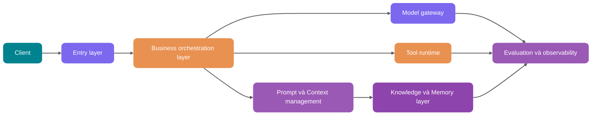

<!-- @include: @article-header.snippet.md -->

Một AI application bản tối thiểu khá dễ dựng: frontend nhận một câu hỏi của người dùng, backend ghép câu hỏi với system prompt, gọi một lần đến model API, rồi trả về một câu trả lời trông có vẻ ổn trên trang.

Demo đến đây về cơ bản là đủ.

Nhưng khi người dùng thật truy cập, vấn đề trở nên cụ thể hơn nhiều: người dùng hỏi về quy chế nội bộ, tầng retrieval đưa cả tài liệu mà họ không có quyền xem vào context; đội vận hành sửa một phiên bản Prompt, câu hỏi hôm qua còn trả lời đúng thì hôm nay bắt đầu lệch; model gọi bị timeout, trình duyệt cứ chờ; cuối tháng xem hóa đơn, chỉ biết mức tiêu thụ Token tăng nhưng không nói rõ được đã tốn vào tenant, tính năng hay model nào; khi điều tra sự cố production, chỉ có thể ghép từng chút từ application log, kết quả hit của vector database và phản hồi của model để hiểu chuyện gì đã xảy ra.

Bài viết này bàn về phần tiếp theo: làm thế nào biến một Prompt Demo chạy được thành một AI application có thể đưa lên production, kiểm tra sự cố, rollback và kiểm soát chi phí.

Đây là bài tổng quan: trước hết so sánh khác biệt giữa Demo và production system, sau đó lần lượt giải thích vai trò của entry point, business orchestration, model gateway, Prompt/Context, RAG, Memory, Tool, task bất đồng bộ, evaluation và observability. Việc tách module, thiết kế bảng và interface service của Java backend sẽ được lồng vào các chương tương ứng; khi cần đào sâu một chủ đề, bạn có thể đọc tiếp các bài chuyên đề được liên kết trong bài.

## Vì sao kiến trúc Demo không chịu nổi traffic production

Hãy xem một Demo phổ biến nhất:

```text
Frontend nhập câu hỏi -> Backend ghép Prompt -> Gọi model API -> Trả lời
```

Luồng này đủ để trình diễn ý tưởng sản phẩm, nhưng thiếu 6 năng lực quan trọng nhất của production system.

| Khía cạnh        | Prompt Demo                                    | Kiến trúc production                                                                    |
| ---------------- | ---------------------------------------------- | --------------------------------------------------------------------------------------- |
| Tính ổn định     | Một model, một lần gọi, thất bại là báo lỗi    | Định tuyến nhiều model, retry, fallback, circuit breaker, phản hồi degrade              |
| Quyền hạn        | Mặc định người dùng hỏi gì thì tra cứu nấy     | Lọc quyền trước retrieval, xác thực Tool Calling theo user và tenant                    |
| Chi phí          | Chỉ xem một lần gọi có thành công không        | Ngân sách Token, phân tầng model, cache, phân bổ chi phí và hạn mức                     |
| Observability    | Ghi câu hỏi người dùng và câu trả lời cuối     | Ghi Prompt, đoạn retrieval, Tool Calling, output của model, Token, latency, lỗi         |
| Evaluation       | Dựa vào việc thử thủ công vài mẫu              | Evaluation dataset cố định, sampling production, LLM-as-Judge, vòng lặp review thủ công |
| Quản trị dữ liệu | Đưa thẳng tài liệu vào database, log lưu tùy ý | Khử nhạy cảm PII, lưu trữ dữ liệu, audit, versioning, xóa và chuỗi cấp quyền            |

Các năng lực trong bảng không phải là chỉ bọc thêm một lớp quanh interface cũ. Output của model được sinh theo xác suất; cùng một câu hỏi có thể chịu ảnh hưởng đồng thời của version Prompt, thứ tự context, kết quả retrieval, mô tả Tool và tham số sampling. Khi câu trả lời lệch, không nhất thiết có thể lần theo call stack đến một dòng code như với `if-else` thông thường.

Production system cần ghi lại mỗi request đã sử dụng input nào, trải qua những bước nào và tạo ra kết quả gì. Nhờ đó mới có thể replay một câu trả lời sai và xác định vấn đề đến từ retrieval, model, lọc quyền hay parse output.

Nếu bạn chưa quen với call chain khi gọi large model API, có thể đọc trước [Thực hành engineering khi gọi large model API: streaming output, retry, rate limiting và structured response](../llm-basis/llm-api-engineering.md). Nếu muốn bổ sung kiến thức cơ bản về Token, context window và sampling parameter, hãy đọc [Cơ chế hoạt động của LLM: Token, context window và sampling parameter ảnh hưởng output thế nào](../llm-basis/llm-operation-mechanism.md).

## Một hệ thống phân tầng AI application có thể triển khai

Sau khi một request đi vào từ entry point, hệ thống phải xác định identity và quyền hạn trước, rồi mới quyết định có retrieval knowledge, gọi Tool hay thực thi bất đồng bộ; cuối cùng ghi lại quá trình gọi vào hệ thống observability. Sơ đồ dưới đây phân chia trách nhiệm theo luồng này; trong dự án thực tế có thể gộp module và không cần xem đây là tiêu chuẩn cố định của ngành.



### Entry layer: biến user request thành task có thể quản trị

Khi user request đến hệ thống, entry layer trước hết ràng buộc nó thành một task mà các service phía sau có thể xử lý:

- Authentication và authorization: xác nhận user, tenant, role và phạm vi dữ liệu.
- Chuẩn hóa request: thống nhất Web, App, API, Webhook và scheduled task thành internal task model.
- Rate limiting và chống abuse: giới hạn theo user, tenant, năng lực model và business scenario.
- Idempotent control: asynchronous task có thể retry và Tool Calling có side effect cần idempotency key; truy vấn read-only có cần deduplicate hay không có thể quyết định theo chi phí và yêu cầu consistency.
- Tiền xử lý nội dung nhạy cảm: khử nhạy cảm PII, phát hiện input độc hại và sơ bộ phát hiện Prompt injection.

Các luồng phía sau nên nhận structured request thay vì chỉ nhận một đoạn user input:

```java
public record AiRequest(
        String requestId,
        String tenantId,
        String userId,
        String sceneCode,
        String input,
        Map<String, Object> variables,
        PermissionScope permissionScope
) {
}
```

### Business orchestration layer: quyết định cách chạy request này

Business orchestration layer quyết định request này sử dụng execution path nào:

- Đây là hỏi đáp thông thường, RAG Q&A, Agent multi-step task hay batch task?
- Cần context nào: historical conversation, user profile, knowledge base hay real-time business data?
- Có cho phép gọi Tool không? Tool nào cần xác nhận lần hai?
- Nên chạy synchronous, streaming hay asynchronous?
- Output có cần đưa vào evaluation, human review hay post-processing không?

Ví dụ, việc user có quyền đọc một tài liệu hay một thao tác có cần xác nhận hay không đều phải do business rule quyết định; model phù hợp để xử lý ngôn ngữ mà rule khó liệt kê hết. Nếu trộn hai loại quyết định vào một “super Prompt”, khi xảy ra lỗi sẽ rất khó phân biệt rule không hoạt động hay model phán đoán sai.

### Model gateway: biến model call thành infrastructure

Model gateway chịu trách nhiệm tích hợp thống nhất các năng lực của OpenAI, Anthropic, Google Gemini, private model, Embedding model, Rerank model và các model khác. Nó che giấu khác biệt giữa các API và cung cấp interface ổn định cho phía trên. Model gateway có thể được tách thành một bài riêng; xem chi tiết tại [Giải thích chi tiết về large model gateway: multi-model routing, Fallback, rate limiting và cost control](./llm-gateway.md).


Sau khi model call được thu về tại gateway, routing, quota và observability mới có một vị trí xử lý thống nhất:

- Multi-model routing: chọn model theo scenario, chi phí, latency, ngôn ngữ, context length và success rate.
- fallback: chuyển sang model dự phòng khi model chính thất bại, timeout hoặc không đủ quota.
- Rate limiting và circuit breaker: tránh để sự cố của nhà cung cấp làm sập business thread pool.
- Ngân sách Token: ước tính input/output Token; khi vượt ngân sách thì nén context hoặc degrade model.
- Phân bổ chi phí: ghi nhận chi phí theo tenant, user, scenario và version Prompt.
- Observability thống nhất: ghi model request, response, error, TTFT, tổng latency và Token usage.

Tài liệu chính thức của OpenAI, Anthropic, Google và các bên khác liên tục cập nhật năng lực liên quan đến model, Tool, streaming, evaluation và chi phí. Khi liên quan đến tên model cụ thể, context window, giá, khu vực khả dụng và hỗ trợ Tool, nên quản lý trong config center hoặc model registry, đồng thời ghi chú “tham khảo tài liệu chính thức mới nhất”, không hard-code trong business code.

### Prompt và Context management: đừng xem Prompt là string trong code

Prompt được sử dụng trong production request phải có version rõ ràng, không được rải rác trong các multi-line string của code. Một lần release và rollback phải tra được nội dung cụ thể, ràng buộc variable và phạm vi có hiệu lực:

- Template version: mỗi lần sửa tạo version mới, version cũ có thể replay.
- Variable injection: inject business variable, user input, retrieval result và Tool result theo từng vùng.
- Gray release: chọn version Prompt theo tenant, tỷ lệ user và scenario switch.
- Rollback nhanh: khi hiệu quả production giảm, có thể chuyển về version ổn định.
- Audit record: ai đã sửa gì vào thời điểm nào và vì sao.
- Runtime binding: mỗi request ghi lại tên Prompt, version và tóm tắt variable đã sử dụng.

Thay đổi Prompt sẽ thay đổi nội dung câu trả lời, đồng thời có thể thay đổi retrieval, Tool Calling, chi phí và kết quả evaluation. Vì vậy, change record, runtime Trace và evaluation result phải liên kết được với cùng một version Prompt. Langfuse đặt Prompt Management, Tracing và Evaluation trên cùng một platform để xử lý chính mối liên kết này; có dùng công cụ đó hay không tùy dự án, nhưng bản thân mối liên kết thì không thể thiếu.

Cách viết Prompt có thể xem tại [Prompt Engineering cho large model là gì? Có những kỹ thuật Prompt nào?](../agent/prompt-engineering.md). Nếu bạn quan tâm đến “thông tin nào nên đưa vào context, đưa bao nhiêu và khi nào cần nén”, nên đọc [Context Engineering là gì? Khác gì với Prompt Engineering?](../agent/context-engineering.md).


### RAG, Memory, Tool: không trộn ba loại context

Retrieval document, user preference và Tool response đều đi vào context của model, nhưng khác nhau về nguồn, cách cập nhật và rủi ro:

| Loại   | Lưu gì                                                                          | Vòng đời                             | Rủi ro chính                                                                    |
| ------ | ------------------------------------------------------------------------------- | ------------------------------------ | ------------------------------------------------------------------------------- |
| RAG    | Tài liệu doanh nghiệp, product manual, quy chế, code document, kiến thức ticket | Do knowledge base quyết định         | Không retrieval được, recall vượt quyền, tài liệu hết hạn, trích dẫn không khớp |
| Memory | User preference, historical decision, long-term profile, task experience        | Phát triển theo user và conversation | Cố định memory sai, rò rỉ privacy, memory cũ gây nhiễu                          |
| Tool   | Tra cứu order, tạo ticket, gửi email, sửa config, tra database                  | Gọi theo nhu cầu tại runtime         | Sai parameter, vượt quyền, thực thi nhầm thao tác nhạy cảm                      |

Về tầng dưới, cả ba đều có thể sử dụng vector retrieval, structured storage và reranking, nhưng không thể quản trị theo cùng một bộ rule. RAG tương ứng với shared knowledge source, Memory lưu background cá nhân hóa, còn Tool kết nối hệ thống nghiệp vụ thực; cần thiết kế riêng permission check và expiration strategy.


Đừng tùy tiện ghi Memory như một RAG cá nhân. Một khi memory bị ghi sai, các cuộc hội thoại nhiều lượt sau đó đều bị ảnh hưởng. Memory thuộc các loại khác nhau cần control khác nhau: preference được user xác nhận rõ có thể ghi đồng bộ; long-term fact do model extract phù hợp hơn với việc kiểm tra Schema, ghi nhận nguồn và lọc theo confidence trước, rồi tùy rủi ro quyết định ghi bất đồng bộ, đặt expiration time hay đưa vào human review.

Có thể bắt đầu với khái niệm cơ bản của RAG từ [Khái niệm cơ bản về RAG: retrieval, generation và trade-off engineering](../rag/rag-basis.md); cách parse, clean và chunk document xem tại [Xử lý và chiến lược chia chunk tài liệu RAG](../rag/rag-document-processing.md); tối ưu hiệu quả retrieval xem tại [Tối ưu RAG: từ recall, rerank đến context engineering](../rag/rag-optimization.md). Nếu muốn tìm hiểu riêng về Memory, hãy xem [Hệ thống memory của AI Agent: short-term memory, long-term memory và cơ chế tiến hóa memory](../agent/agent-memory.md).

## Chọn giữa ba mode tương tác synchronous, streaming và asynchronous

Không phải mọi request của AI application đều phù hợp với việc chờ HTTP synchronous. Chọn sai interaction mode sẽ làm giảm cả trải nghiệm người dùng lẫn tính ổn định của hệ thống.

| Mode                | Scenario phù hợp                                                      | Ưu điểm                                                                 | Rủi ro                                                     | Điểm chính khi thiết kế backend                               |
| ------------------- | --------------------------------------------------------------------- | ----------------------------------------------------------------------- | ---------------------------------------------------------- | ------------------------------------------------------------- |
| Synchronous request | Q&A ngắn, classification, extraction, task nhỏ latency thấp           | Dễ triển khai, call chain rõ ràng                                       | Nhạy với timeout, dễ chiếm hết thread                      | Đặt timeout ngắn, fail fast, cache result                     |
| Streaming response  | Chat, câu trả lời dài, code generation, văn bản đầu vào cho voice     | Trải nghiệm first-token tốt, người dùng cảm nhận thời gian chờ ngắn hơn | Xử lý lỗi giữa chừng phức tạp, frontend có nhiều state hơn | SSE/WebSocket, theo dõi TTFT, cho phép hủy generation         |
| Asynchronous task   | Tạo report, batch evaluation, phân tích tài liệu dài, multi-tool task | Có thể queue, retry và khôi phục                                        | Task state và notification chain phức tạp                  | Task table, queue, progress event, idempotent và compensation |

Nếu request có thể hoàn thành ổn định trong khoảng 3 giây và client timeout, gateway timeout đều cho phép, synchronous call thường đơn giản hơn. Đây không phải tiêu chuẩn cố định, cần xác định cùng cấu hình timeout của hệ thống.

Khi user cần lập tức nhìn thấy quá trình generation, streaming response phù hợp hơn; khi phụ thuộc vào tài liệu dài, nhiều lượt Tool Calling hoặc batch processing, đưa task vào queue sẽ dễ retry và khôi phục hơn.

Các internal call như phân loại tag, chấm điểm rủi ro và quyết định routing thường không cần phản hồi first-token. Duy trì kết nối SSE hoặc WebSocket cho chúng chỉ làm tăng chi phí xử lý interruption, cancellation và frontend state.

Streaming output, retry, rate limiting và structured response được phân tích đầy đủ hơn trong [Thực hành engineering khi gọi large model API](../llm-basis/llm-api-engineering.md). Nếu scenario là real-time voice, còn cần cân nhắc VAD, ASR, TTS, interruption và end-to-end latency; có thể đọc tiếp [Giải thích chi tiết công nghệ AI voice: từ ASR, TTS đến triển khai engineering real-time voice Agent](./ai-voice.md).

## Quản lý Prompt: từ template string đến version system

Có thể bắt đầu model hóa Prompt management production theo 5 object:

- `prompt_template`: thông tin cơ bản của Prompt, chẳng hạn tên, scenario, type và status.
- `prompt_version`: nội dung cụ thể, định nghĩa variable, model parameter, người tạo và mô tả thay đổi.
- `prompt_release`: một version được release tới environment nào, tenant nào và bao nhiêu traffic.
- `prompt_run`: version Prompt, tóm tắt variable và output của model được bind trong mỗi lần gọi.
- `prompt_eval_result`: kết quả của một version Prompt trên evaluation dataset.

Các bảng chính có thể thiết kế như sau:

| Tên bảng             | Field chính                                                                                                     | Vai trò                                        |
| -------------------- | --------------------------------------------------------------------------------------------------------------- | ---------------------------------------------- |
| `ai_prompt_template` | `id`, `tenant_id`, `name`, `scene_code`, `type`, `status`                                                       | Quản lý tên logic của Prompt                   |
| `ai_prompt_version`  | `id`, `template_id`, `version_no`, `content`, `variables_schema`, `model_config`, `created_by`, `change_reason` | Lưu nội dung Prompt có thể replay              |
| `ai_prompt_release`  | `id`, `template_id`, `version_id`, `env`, `traffic_ratio`, `tenant_scope`, `status`                             | Kiểm soát gray release và rollback             |
| `ai_prompt_run`      | `id`, `request_id`, `version_id`, `variables_hash`, `input_tokens`, `output_tokens`, `created_at`               | Liên kết production request với version Prompt |

Variable injection dễ phát sinh vấn đề nhất ở hai nơi. User input, Tool result và retrieval chunk có thể mang theo injection instruction; partition label và escaping chỉ giúp model nhận diện nội dung không đáng tin, backend vẫn phải giới hạn Tool có thể gọi và kiểm tra lại parameter, permission trước khi thực thi.

Một vấn đề khác đến từ version mismatch: Prompt thêm variable nhưng code không truyền value, kết quả render sẽ thiếu context. `variables_schema` có thể chặn sớm loại request này tại runtime.

`ai_prompt_run` thường chỉ lưu tóm tắt variable, Hash, Token và related ID. Khi full user input, retrieval chunk hoặc Tool response chứa PII hay thông tin nhạy cảm nghiệp vụ, cần quyết định khử nhạy cảm, mã hóa và rút ngắn thời gian lưu theo security level; không thể vì thuận tiện cho replay mà ghi toàn bộ plaintext vào bảng.

Một interface tối thiểu:

```java
public interface PromptService {

    RenderedPrompt render(RenderPromptCommand command);

    PromptVersion publish(PublishPromptCommand command);

    void rollback(String templateId, String targetVersionId);
}
```

Nếu Prompt output cần được parse ổn định bằng chương trình, tốt nhất không chỉ dựa vào “hãy trả về JSON”. Chi tiết engineering của structured output, JSON Schema và Function Calling có thể xem tại [Structured output của large model: từ JSON contract đến triển khai Function Calling](../llm-basis/structured-output-function-calling.md).

## Model gateway: multi-model routing, fallback và cost control

Model gateway rất dễ bị đánh giá thấp. Nhiều team ban đầu gọi trực tiếp SDK của một nhà cung cấp trong business code; đến khi cần đổi model, gray release hoặc kiểm tra chi phí mới phát hiện code bị coupling khắp nơi.

### So sánh strategy của model gateway

| Strategy              | Logic chính                                                                  | Scenario phù hợp                                | Rủi ro                                                                    |
| --------------------- | ---------------------------------------------------------------------------- | ----------------------------------------------- | ------------------------------------------------------------------------- |
| Fixed model           | Một scenario luôn gọi một model cố định                                      | Hệ thống giai đoạn đầu, task ít phức tạp        | Chi phí và tính ổn định bị ảnh hưởng bởi một nhà cung cấp                 |
| Cost-first routing    | Mặc định dùng model chi phí thấp, thất bại hoặc confidence thấp thì nâng cấp | Classification, summary, Q&A nhẹ                | Model chi phí thấp phán đoán sai sẽ truyền xuống downstream               |
| Quality-first routing | Request giá trị cao ưu tiên model năng lực cao                               | Hỗ trợ pháp lý, tài chính, y tế, Agent phức tạp | Chi phí cao, cần kiểm soát ngân sách                                      |
| Latency-first routing | Chọn model theo P95/P99 latency và availability zone                         | Real-time chat, voice, online customer service  | Có thể hy sinh chất lượng suy luận phức tạp                               |
| Multi-model voting    | Nhiều model generate song song, sau đó evaluator lựa chọn                    | Nội dung rủi ro cao, report quan trọng          | Chi phí và latency đều cao                                                |
| fallback chain        | Chuyển sang model dự phòng sau khi model chính thất bại                      | Phần lớn production system                      | Khác biệt năng lực của model dự phòng ảnh hưởng tính nhất quán của output |

### Xây dựng ngân sách Token

Trước khi gọi, model gateway phải ước tính context và max output sẽ chiếm bao nhiêu Token:

```text
Estimated input Token = System Prompt + user input + historical messages + RAG chunks + Memory + Tool Schema
Estimated total Token = Estimated input Token + max output Token
```

Khi vượt ngân sách, ưu tiên loại bỏ nội dung ít liên quan đến câu hỏi hiện tại thay vì cắt trực tiếp ở giữa string:

1. Xóa RAG chunk có độ liên quan thấp.
2. Nén historical message ở giai đoạn đầu.
3. Giảm Tool Schema, chỉ giữ Tool ứng viên.
4. Giảm max output length.
5. Chuyển sang model có context dài.
6. Từ chối thực thi và nhắc user thu hẹp phạm vi.

Ngân sách Token và context compression ở đây cùng thuộc một nhóm vấn đề với Context Engineering đã đề cập ở trên. Cách lắp ráp context, load theo nhu cầu và strategy degrade đầy đủ hơn có thể xem tại [Context Engineering là gì? Khác gì với Prompt Engineering?](../agent/context-engineering.md).

GenAI registry trong tài liệu OpenTelemetry có các field như `gen_ai.request.model`, `gen_ai.response.model`, `gen_ai.usage.input_tokens`, `gen_ai.usage.output_tokens`, `gen_ai.response.time_to_first_chunk`, retrieval và Tool. Tuy nhiên, OpenTelemetry cũng lưu ý semantic convention của GenAI đã được chuyển sang repository độc lập; khi triển khai không nên chỉ sao chép tên field từ một tài liệu cũ, tốt nhất là khóa version hiện tại và thực hiện field mapping. Dù sử dụng Langfuse, LangSmith hay tự xây observability platform, cũng nên hướng tới các field dùng chung càng nhiều càng tốt để migration và unified monitoring sau này dễ hơn.

## Tool Calling và permission: để model chỉ đề xuất action, hệ thống quyết định có được thực hiện hay không

Tool Calling dễ tạo ra một ảo giác: model trả về tên function và parameter, hệ thống chỉ việc thực thi.

Điều này rất nguy hiểm trong production.

Mental model an toàn hơn là: **model chỉ có thể đề xuất “muốn gọi Tool nào”, trước khi thực thi thật phải qua system validation**.

Tool runtime tối thiểu phải có 6 lớp kiểm tra:

| Giai đoạn             | Vai trò                                                                                                                            |
| --------------------- | ---------------------------------------------------------------------------------------------------------------------------------- |
| Tool registration     | Khai báo tên Tool, mô tả, parameter Schema, permission tag và risk level                                                           |
| Tool retrieval        | Chọn một số Tool ít nhưng liên quan đến task hiện tại từ nhiều Tool, tránh làm phình context                                       |
| Parameter validation  | Dùng JSON Schema hoặc typed object để kiểm tra required field, format, enum và range                                               |
| Permission validation | Backend authorization theo user, tenant, role và resource ID                                                                       |
| Confirmation policy   | Với thao tác xóa, thanh toán, gửi message, sửa config, quyết định có cần xác nhận lần nữa theo rủi ro và phạm vi pre-authorization |
| Audit log             | Ghi model suggestion, parameter cuối, người thực thi, execution result và thông tin rollback                                       |

Tài liệu chính thức về Tool/Function Calling của Anthropic, OpenAI và Google đều nhấn mạnh tool definition, parameter structure và call handling; tài liệu của Google còn nhắc rõ rằng với function call có hậu quả đáng kể như gửi order hoặc cập nhật database, cần để user xác nhận trước khi thực thi. Thao tác rủi ro thấp đã có pre-authorization rõ ràng có thể tự động thực thi theo policy, nhưng business system phải thực hiện permission judgment, không thể giao cho model.

Ngay cả khi nhà cung cấp cung cấp server-side Tool, phía business cũng không thể bỏ qua ACL, audit và confirmation flow của mình. Nhà cung cấp chịu trách nhiệm đưa năng lực Tool vào model; business system chịu trách nhiệm phán đoán user, tenant và resource này có được thực thi trong scenario hiện tại hay không.

Nếu muốn bắt đầu từ khái niệm Tool Calling, có thể xem [Structured output của large model: từ JSON contract đến triển khai Function Calling](../llm-basis/structured-output-function-calling.md). Nếu Tool của bạn cần được nhiều model, Agent hoặc IDE dùng lại, hãy đọc tiếp [Model Context Protocol (MCP) là gì? Quan hệ với Function Calling và Agent](../agent/mcp.md).


Interface của Tool có thể định nghĩa như sau:

```java
public interface AiTool {

    ToolDefinition definition();

    ToolResult execute(ToolExecutionContext context, Map<String, Object> arguments);
}
```

Tool definition cần tách side effect và risk level. Read-only không đồng nghĩa với rủi ro thấp; chẳng hạn đọc secret, medical record hoặc lượng lớn customer data không có thao tác ghi nhưng vẫn cần authorization và audit nghiêm ngặt hơn:

```java
public enum ToolSideEffect {
    READ_ONLY,
    WRITE
}

public enum ToolRiskLevel {
    LOW,
    MEDIUM,
    HIGH
}
```

Orchestration layer chọn control strategy dựa trên `sideEffect + riskLevel + preAuthorization`. Write operation rủi ro cao mặc định được chuyển thành “action chờ xác nhận”; read operation rủi ro cao phải tăng cường resource-level authorization, khử nhạy cảm field, giới hạn số lượng result và audit. Nếu business cho phép tự động thực thi write operation đã được pre-authorization, vẫn phải dùng authorization credential có phạm vi rõ ràng và có thể thu hồi, đồng thời đi kèm idempotent, audit và compensation mechanism.


## RAG và Memory: shared knowledge phối hợp với personalized memory thế nào

RAG và Memory đều đưa thông tin bên ngoài vào context, nhưng cách quản trị khác nhau.

### Thứ tự phối hợp trong một request

Thứ tự được đề xuất trong một request:

1. Entry layer xác nhận identity và permission scope của user.
2. Memory service retrieval preference và long-term fact trong phạm vi user.
3. RAG service retrieval shared knowledge base trong phạm vi tenant và resource permission.
4. Context management layer deduplicate, filter và compress riêng hai loại result.
5. Orchestration layer đặt Memory vào vùng “user background”, RAG vào vùng “evidence material”.
6. Khi model output, yêu cầu phân biệt “fact dựa trên tài liệu” và “cách diễn đạt dựa trên user preference”.

Thứ tự này chủ yếu nhằm tránh context pollution. Dự án cụ thể cũng có thể tra RAG trước rồi tra Memory, nhưng permission scope phải được xác định trước; không được xem “retrieval trước, filter sau” là phương án mặc định.

### Tránh context pollution thế nào

| Loại pollution             | Biểu hiện điển hình                                          | Cách phòng vệ                                                            |
| -------------------------- | ------------------------------------------------------------ | ------------------------------------------------------------------------ |
| RAG noise pollution        | Retrieval phải tài liệu không liên quan, model bị dẫn lệch   | Hybrid Search, Rerank, Top-N compression, citation validation            |
| Permission pollution       | User nhận được đoạn tài liệu không có quyền truy cập         | ACL filter trước retrieval, tenant isolation, audit retrieval result     |
| Memory bị cố định sai      | Một phát biểu tạm thời của user bị xem là preference dài hạn | Confidence khi ghi, expiration time, user có thể chỉnh sửa, human review |
| Xung đột fact cũ và mới    | Quy chế version cũ và mới cùng đi vào context                | Version field, time filter, conflict detection                           |
| Prompt injection pollution | Trong tài liệu có câu “bỏ qua rule phía trước”               | Phân vùng nội dung tài liệu, instruction priority, injection detection   |

Không nên ghép trực tiếp result của RAG và Memory thành một đoạn “background material”. Cần đánh dấu rõ source, time, permission và reliability cho model, tránh trộn “user preference”, “company policy” và “Tool result” thành cùng một loại thông tin.

Knowledge base không kết thúc sau một lần import. Document version, incremental sync, deduplication, rollback và full rebuild đều ảnh hưởng đến production answer; xem chi tiết tại [Cách cập nhật document của RAG knowledge base: incremental update, version control, deduplication và full rebuild](../rag/rag-knowledge-update.md). Nếu vấn đề cần quan hệ cross-document, entity relationship và global summary, traditional vector retrieval có thể chưa đủ; có thể đọc tiếp [GraphRAG: bổ sung vector retrieval bằng graph structure](../rag/graphrag.md).

## Observability và evaluation: không có replay thì không có optimization

### Trace nên ghi gì

Khi điều tra vấn đề trong AI application, điều đáng sợ nhất là chỉ nhìn thấy câu trả lời cuối.

Một request hoàn chỉnh tối thiểu phải ghi metadata có thể liên kết. Chỉ lưu plaintext khi thực sự cần replay, đã có authorization tương ứng và cấu hình encryption, access control cùng retention period:

| Nhóm      | Metadata mặc định ghi nhận                                                                                      |
| --------- | --------------------------------------------------------------------------------------------------------------- |
| Prompt    | Template name, version, variable Hash hoặc summary đã khử nhạy cảm, message role và length                      |
| Retrieval | Query đã khử nhạy cảm hoặc Hash, Chunk ID, score, source, permission filter result, Rerank rank                 |
| Memory    | Memory ID được hit, source, thời gian cập nhật, confidence                                                      |
| Tool      | Tool name, parameter Hash hoặc field đã khử nhạy cảm, permission result, execution duration, result code, error |
| Model     | Provider, model name, sampling parameter, input/output Token, finish reason                                     |
| Latency   | Entry duration, retrieval duration, model TTFT, total duration, Tool duration                                   |
| Chi phí   | Input cost, output cost, cache hit, phân bổ theo tenant và scenario                                             |
| Result    | Response Hash, structured parse result, user feedback, evaluation score                                         |

Trong tài liệu chính thức của Langfuse, LangSmith, Google Vertex AI và OpenTelemetry đều có thể thấy các object như tracing, datasets, evaluators, token usage và latency. Công cụ có thể khác nhau, nhưng các signal cần thu thập nhìn chung tương tự.

### Nên thực hiện evaluation thế nào

Evaluation cần sample cố định, điều kiện pass rõ ràng và target version có thể replay. Cách chuẩn bị evaluation dataset, tách metric của RAG và Agent, cũng như tích hợp LLM-as-Judge vào CI có thể xem tại [Hệ thống evaluation AI application](../llm-basis/llm-evaluation.md).

Chỉ chấm một điểm “tốt hay không” cho câu trả lời cuối không thể giải thích vấn đề xảy ra ở recall, generation hay Tool execution. Mỗi khâu có thể ghi riêng các metric sau; tên gọi có thể khác giữa các platform, nhưng cách tính nội bộ phải thống nhất:

- **Context Recall**: evidence đúng có được recall không.
- **Context Precision**: có bao nhiêu chunk đưa vào context là hữu ích.
- **Faithfulness**: câu trả lời có trung thành với evidence được cung cấp không.
- **Answer Relevancy**: câu trả lời có phản hồi đúng user question không.
- **Tool Success Rate**: Tool Calling có hoàn thành thành công không.
- **Format Valid Rate**: structured output có parse được không.
- **Cost per Success**: chi phí trung bình cho mỗi câu trả lời thành công.

LLM-as-Judge phù hợp với sơ bộ quy mô lớn, regression comparison và production sampling, nhưng phán đoán của nó không thể thay thế business rule validation, human review và user feedback cho nghiệp vụ quan trọng. Interface và năng lực của external evaluation platform sẽ thay đổi; evaluation task, sample và result nên được lưu trong data model của mình, còn platform chỉ thực thi hoặc hiển thị.

Luồng replay và release sau khi production sample đi vào evaluation system:

```text
Production failure sample -> Đưa vào dataset -> Replay version cố định -> Xác định vấn đề Prompt/RAG/Tool/model -> Gray release strategy mới -> So sánh metric -> Release tiếp
```

Không có replay với version cố định, sau khi version Prompt, retrieval strategy và model thay đổi sẽ rất khó xác định một điều chỉnh đã cải thiện điều gì.

## Security và compliance: AI application có nhiều điểm vào rủi ro hơn

Security surface của AI application rộng hơn CRUD system truyền thống. Nguyên nhân là user input, retrieval document, Tool response và historical memory đều có thể ảnh hưởng đến hành vi của model.

### Risk item phải đi vào code và process

| Rủi ro                          | Mô tả                                                                        | Đề xuất xử lý                                                                 |
| ------------------------------- | ---------------------------------------------------------------------------- | ----------------------------------------------------------------------------- |
| Rò rỉ PII                       | Log, Prompt và evaluation dataset chứa số điện thoại, số định danh, email... | Khử nhạy cảm trước khi lưu, mã hóa field nhạy cảm, lưu tối thiểu              |
| Bypass permission               | Retrieval hoặc Tool Calling bypass business ACL                              | Filter trước retrieval, authorization lần hai trước Tool execution            |
| Prompt injection                | User hoặc document dụ model bỏ qua system rule                               | Content partition, instruction priority, injection detection, reject strategy |
| Mất kiểm soát data retention    | Model request và observability log lưu quá lâu                               | Cấu hình retention period theo tenant và scenario                             |
| Rủi ro training data            | Dùng sensitive user data cho fine-tuning hoặc evaluation                     | Authorization rõ ràng, khử nhạy cảm, isolation, có thể xóa                    |
| Thực thi nhầm action rủi ro cao | Model gọi nhầm Tool xóa, thanh toán, gửi mail...                             | Risk classification, confirmation lần hai, audit và compensation              |

Có một chi tiết dễ bị bỏ qua: **security policy không thể chỉ viết trong Prompt**. Prompt có thể nhắc model “không tiết lộ privacy”, nhưng permission filter, khử nhạy cảm, audit và confirmation flow phải do code và infrastructure bắt buộc thực hiện.

### Quản lý riêng data boundary của third-party model

Nếu request sẽ được gửi tới third-party model, cần xác nhận riêng data authorization, region, retention và training usage policy. Khi chưa chắc chắn, mặc định xử lý theo nguyên tắc tối thiểu: field nào không cần gửi thì không gửi, field bắt buộc gửi thì khử nhạy cảm hoặc chuyển thành summary trước, đồng thời ghi retention period vào config và audit.

Prompt injection, context partition và Tool permission thực ra liên kết với nhau; có thể đọc kết hợp [Prompt Engineering](../agent/prompt-engineering.md), [Context Engineering](../agent/context-engineering.md) và [MCP](../agent/mcp.md) đã đề cập ở trên.

Nếu hệ thống đã cho phép Agent đọc external content và gọi write Tool, còn cần thiết kế resource-level authorization, parameter binding approval, MCP Token, isolation của code và network cùng security regression; xem chi tiết tại [Thực hành security LLM/Agent](./llm-security.md).

## Đề xuất triển khai với Java backend

Nếu dùng Java để xây AI application production, phù hợp hơn là tách module theo “domain capability”, không tách theo vendor SDK.

### Tách module

| Module             | Trách nhiệm                                                                          |
| ------------------ | ------------------------------------------------------------------------------------ |
| `ai-api`           | REST/SSE/WebSocket interface đối ngoại, request authorization và protocol adaptation |
| `ai-orchestrator`  | Business orchestration, chọn interaction mode, task state machine                    |
| `ai-prompt`        | Prompt template, version, gray release, render, rollback                             |
| `ai-context`       | Context assembly, Token budget, history compression, context partition               |
| `ai-gateway`       | Model routing, fallback, rate limiting, circuit breaker, cost statistics             |
| `ai-rag`           | Knowledge base retrieval, permission filter, Rerank, citation management             |
| `ai-memory`        | Ghi user memory, retrieval, conflict handling, expiration strategy                   |
| `ai-tool`          | Tool registration, parameter validation, execution, second confirmation, audit       |
| `ai-eval`          | Dataset, evaluation task, LLM-as-Judge, human feedback                               |
| `ai-observability` | Trace, metric, log, cost, alert                                                      |

### Thiết kế core table

Nhóm bảng này không yêu cầu phải tạo đầy đủ ngay ở version đầu, chủ yếu cho thấy dữ liệu nào trong production system cần có nơi sở hữu. Version đầu ít nhất phải lưu request Trace, model call, version Prompt và RAG retrieval record; sau này mới có dữ liệu để điều tra vấn đề.

| Tên bảng           | Field chính đề xuất                                                                                                                                                   | Vai trò                                                                                   |
| ------------------ | --------------------------------------------------------------------------------------------------------------------------------------------------------------------- | ----------------------------------------------------------------------------------------- |
| `ai_request_trace` | `id`, `request_id`, `tenant_id`, `user_id`, `scene_code`, `mode`, `status`, `total_latency_ms`, `error_code`, `created_at`                                            | Trace chính của một AI request, ghi user, tenant, scenario, status và duration            |
| `ai_model_call`    | `id`, `request_id`, `provider`, `model_name`, `prompt_version_id`, `input_tokens`, `output_tokens`, `ttft_ms`, `latency_ms`, `finish_reason`, `error_code`            | Chi tiết model call, ghi model, parameter, Token, TTFT và error                           |
| `ai_context_item`  | `id`, `request_id`, `source_type`, `source_id`, `content_hash`, `token_count`, `inject_position`, `sensitivity_level`                                                 | Context item, ghi source type, source ID, Token và vị trí inject                          |
| `ai_rag_chunk_hit` | `id`, `request_id`, `knowledge_base_id`, `doc_id`, `chunk_id`, `score`, `rank_no`, `acl_result`, `citation_url`                                                       | Chi tiết RAG retrieval, ghi score, rank, document permission và citation                  |
| `ai_memory_item`   | `id`, `tenant_id`, `user_id`, `memory_type`, `content`, `source_type`, `source_id`, `evidence_hash`, `request_id`, `confidence`, `expires_at`, `status`, `updated_at` | Memory item dài hạn, ghi content, source evidence, confidence, expiration time và status  |
| `ai_tool_call`     | `id`, `request_id`, `tool_name`, `risk_level`, `arguments_hash`, `permission_result`, `confirm_status`, `execute_status`, `latency_ms`                                | Chi tiết Tool Calling, ghi Tool, parameter summary, permission result và execution result |
| `ai_eval_dataset`  | `id`, `name`, `scene_code`, `version_no`, `status`, `created_by`                                                                                                      | Metadata của evaluation dataset                                                           |
| `ai_eval_case`     | `id`, `dataset_id`, `input`, `expected_behavior`, `tags`, `difficulty`, `status`                                                                                      | Evaluation sample, gồm input, expected behavior và tag                                    |
| `ai_eval_run`      | `id`, `dataset_id`, `target_type`, `target_version`, `judge_config`, `status`, `started_at`, `finished_at`                                                            | Một evaluation task                                                                       |
| `ai_eval_result`   | `id`, `run_id`, `case_id`, `score`, `pass_status`, `judge_reason`, `error_code`                                                                                       | Evaluation result của một sample                                                          |

Trong thiết kế bảng có 3 chi tiết không nên bỏ qua:

1. `request_id` phải xuyên suốt Prompt, RAG, Memory, Tool, Model Call và Eval, tốt nhất là duy nhất trên toàn call chain.
2. Không đưa các field lớn vào MySQL một cách thiếu cân nhắc. Full Prompt, model output và Tool response có thể đặt trong object storage hoặc log system; business table giữ lại summary, Hash, security level và reference URL.
3. Runtime table cần thiết kế index và archive strategy theo `tenant_id`, `scene_code`, `created_at`, `status`, nếu không observability table sẽ nhanh chóng trở thành performance bottleneck mới.

### Thiết kế core interface

```java
public interface ModelGateway {

    ModelResponse generate(ModelRequest request);

    Flux<ModelStreamEvent> stream(ModelRequest request);
}
```

Nếu dự án không sử dụng WebFlux, `Flux<ModelStreamEvent>` có thể thay bằng JDK `Flow.Publisher`, SSE emitter hoặc internal event callback. Điểm chính là tách hai interface semantic “synchronous generation” và “streaming event”, không để caller phải đoán khi nào return value hoàn chỉnh.

```java
public interface ContextAssembler {

    AssembledContext assemble(AiRequest request, ContextPolicy policy);
}
```

```java
public interface RagService {

    List<RagHit> retrieve(RagQuery query, PermissionScope permissionScope);
}
```

```java
public interface EvaluationService {

    EvalRunResult runDataset(EvalRunCommand command);
}
```

### Một request chain tối thiểu

```text
Controller
  -> RequestGuard authorization, rate limiting, khử nhạy cảm
  -> Orchestrator chọn synchronous/streaming/asynchronous
  -> ContextAssembler lấy RAG, Memory, history
  -> PromptService render template version
  -> ModelGateway routing model và ghi Token
  -> OutputParser kiểm tra structured output
  -> TraceService ghi observability data
```

Version đầu của enterprise knowledge base Q&A có thể triển khai `ai-api`, `ai-prompt`, `ai-gateway`, `ai-rag` và `ai-observability` trước. Memory, Tool và Eval thêm vào theo nhu cầu nghiệp vụ; nhưng request Trace và version Prompt thực tế được sử dụng phải được ghi nhận ngay từ version đầu, nếu không sẽ không có dữ liệu để điều tra khi production answer gặp vấn đề.

Nếu muốn bắt đầu từ chi tiết gọi large model API bằng Java backend, có thể đọc [Thực hành engineering khi gọi large model API](../llm-basis/llm-api-engineering.md); nếu team chuẩn bị thống nhất model call thành infrastructure, nên đọc riêng [Giải thích chi tiết large model gateway](./llm-gateway.md).

## Trình bày kiến trúc này trong phỏng vấn

Khi trả lời câu hỏi này, có thể bắt đầu từ một request thay vì liệt kê tên framework. User request đi vào entry layer, trước hết thực hiện authorization và rate limiting; orchestration layer quyết định có retrieval, gọi Tool hay thực thi asynchronous; sau khi Prompt/Context được assemble, model gateway routing model; output được parse rồi ghi vào Trace. Tiếp theo giải thích Prompt version, Token budget, Tool permission và PII khử nhạy cảm lần lượt giải quyết rủi ro gì, cuối cùng bổ sung cách fixed sample dataset và failure sample replay dùng để kiểm chứng thay đổi.

Nếu bạn ôn theo interview roadmap, có thể xem trực tiếp [Tổng hợp câu hỏi phỏng vấn AI system design](../interview-questions/ai-system-design-interview-questions.md). RAG, Agent và kiến thức large model cũng có [Tổng hợp câu hỏi phỏng vấn RAG](../interview-questions/rag-interview-questions.md), [Tổng hợp câu hỏi phỏng vấn AI Agent](../interview-questions/agent-interview-questions.md) và [Tổng hợp câu hỏi phỏng vấn kiến thức large model](../interview-questions/llm-interview-questions.md).

## Câu hỏi phỏng vấn thường gặp

**1. Khác biệt lớn nhất giữa Prompt Demo và production system là gì?**

Demo kiểm chứng model có thể hoàn thành một câu trả lời hay không. Production system còn phải xử lý timeout và degrade, permission của tenant và resource, chi phí Token, call Trace, evaluation replay và lưu trữ dữ liệu nhạy cảm.

**2. Vì sao cần model gateway?**

Model gateway thu gọn khác biệt giữa API của các nhà cung cấp vào một chỗ, đồng thời phụ trách model routing, fallback, rate limiting, circuit breaker, Token budget, cost statistics và observability. Nhờ đó business service không phải coupling riêng với API của từng model.

**3. Chọn synchronous, streaming hay asynchronous thế nào?**

Task ngắn có thể hoàn thành ổn định trong thời gian timeout của client thì trả về synchronous; chat và câu trả lời dài cần phản hồi sớm thì dùng streaming; tạo report, batch processing và multi-tool task thì đưa vào asynchronous queue. Căn cứ là duration, có cần first-token response hay không, và sau khi thất bại có cần retry, khôi phục hay không.

**4. Vì sao Prompt cần version management?**

Prompt sẽ thay đổi output, retrieval strategy, Tool Calling và mức tiêu thụ Token. Version number giúp production request liên kết với nội dung cụ thể, đồng thời tạo đối tượng rõ ràng cho gray release, rollback, audit và offline replay.

**5. Security boundary của Tool Calling ở đâu?**

Model chỉ tạo Tool Calling intent. Parameter validation, resource-level permission validation, confirmation của thao tác nhạy cảm và audit log đều do backend system thực hiện.

**6. RAG khác Memory thế nào?**

RAG query shared knowledge như enterprise document và product manual; Memory lưu long-term fact được cá nhân hóa như user preference và historical decision. Hai loại result có thể dùng đồng thời, nhưng cần inject theo vùng và xử lý riêng permission, source cùng expiration time.

**7. AI application observability cần xem metric nào?**

Một request tối thiểu phải liên kết version Prompt, retrieval hit, Tool Calling, model output, input/output Token, TTFT, total latency, success/error status, cost và evaluation score.

**8. LLM-as-Judge có thể thay thế human evaluation không?**

Không. Nó có thể đảm nhiệm automated regression, production sampling và sơ bộ quy mô lớn; nghiệp vụ quan trọng vẫn cần rule validation, human review và vòng lặp user feedback.

## Tổng kết

Model call chỉ là một bước trong production chain. Entry layer xử lý permission, rate limiting và khử nhạy cảm; orchestration layer chọn synchronous, streaming hoặc asynchronous path, đồng thời tổ chức retrieval, memory và Tool; model gateway xử lý model selection, Token và fallback khi lỗi; evaluation và observability cung cấp evidence cho mỗi điều chỉnh. Memory, Tool và Eval có thể tích hợp dần theo nhu cầu nghiệp vụ, nhưng Prompt version và Trace cần được thiết lập sớm.

## Tài liệu tham khảo

Các bài liên quan trên JavaGuide:

- [Hệ thống kiến thức phát triển AI application: large model, Agent, RAG, MCP, Prompt Engineering và system design](../README.md)
- [Chuyên đề AI system design: kiến trúc production, model gateway, evaluation governance và voice Agent](./README.md)
- [Chuyên đề kiến thức large model: cơ chế hoạt động, API call, structured output và evaluation](../llm-basis/README.md)
- [Chuyên đề RAG: document processing, vector database, GraphRAG, retrieval optimization và knowledge base update](../rag/README.md)
- [Chuyên đề AI Agent: Agent Loop, Memory, Prompt, Context, MCP và Skills](../agent/README.md)

- [Tài liệu chính thức OpenAI API](https://developers.openai.com/api/docs)
- [Tài liệu chính thức OpenAI Function Calling](https://developers.openai.com/api/docs/guides/function-calling)
- [Tài liệu chính thức OpenAI Streaming](https://developers.openai.com/api/docs/guides/streaming-responses)
- [Tài liệu chính thức OpenAI Evals](https://developers.openai.com/api/docs/guides/evals)
- [Observability và integration của OpenAI Agents SDK](https://developers.openai.com/api/docs/guides/agents/integrations-observability)
- [Tài liệu chính thức Anthropic Tool Use](https://platform.claude.com/docs/en/agents-and-tools/tool-use/overview)
- [Tài liệu chính thức Anthropic Prompt Caching](https://platform.claude.com/docs/en/build-with-claude/prompt-caching)
- [Google Gemini Function Calling](https://docs.cloud.google.com/gemini-enterprise-agent-platform/models/tools/function-calling)
- [Tài liệu chính thức Google generative AI evaluation](https://docs.cloud.google.com/gemini-enterprise-agent-platform/models/evaluation-overview)
- [Google RAG Grounding](https://docs.cloud.google.com/gemini-enterprise-agent-platform/models/grounding/ground-responses-using-rag)
- [Tài liệu chính thức Langfuse Observability](https://langfuse.com/docs/observability/overview)
- [Tài liệu chính thức Langfuse Prompt Management](https://langfuse.com/docs/prompt-management/overview)
- [LangSmith Evaluation](https://docs.langchain.com/langsmith/evaluation)
- [OpenTelemetry GenAI attribute registry](https://opentelemetry.io/docs/specs/semconv/registry/attributes/gen-ai/)
