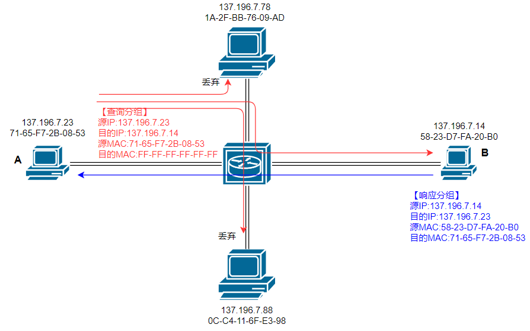
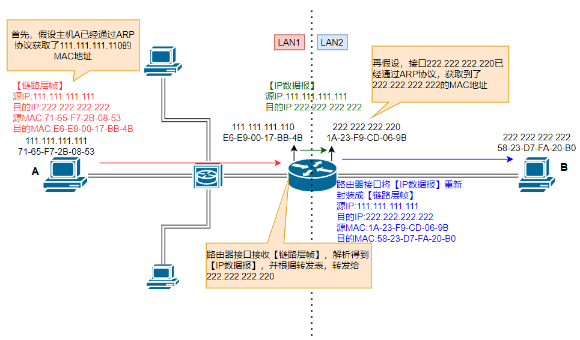

IP address chịu trách nhiệm định địa chỉ ở network layer, nhưng để data frame thực sự được forward trong LAN, vẫn cần biết MAC address của thiết bị next hop.

ARP giải quyết vấn đề chuyển đổi này: **đã biết IP address của đích thì làm thế nào tìm được MAC address tương ứng**. Nó có vẻ đơn giản, nhưng lại kết nối network layer với link layer, đồng thời là nền tảng để hiểu giao tiếp trong LAN, gateway forwarding và ARP spoofing.

Bài viết này tập trung trả lời các câu hỏi:

1. ARP nằm ở vị trí nào trong protocol stack?
2. ARP hoàn tất address resolution bằng broadcast inquiry và unicast response như thế nào?
3. ARP table có tác dụng gì, cache hết hạn sẽ gây ảnh hưởng gì?
4. Các ARP attack thường gặp xảy ra như thế nào và nên phòng thủ ra sao?

## MAC address

Trước khi tìm hiểu protocol ARP, cần nói qua về MAC address.

Tên đầy đủ của MAC address là **Media Access Control Address**, dùng để định danh interface ở link layer và truyền data frame trong local network. MAC address thuộc về network interface, không phải định danh vĩnh viễn của toàn bộ thiết bị; một thiết bị có thể có nhiều network interface, mỗi interface có thể dùng một MAC address khác nhau.

MAC address cũng thường được gọi là LAN address, physical address hoặc Ethernet address. Khác với IP address dùng cho routing ở network layer, MAC address chủ yếu được sử dụng trong link hiện tại hoặc broadcast domain.

> Cần biết thêm rằng không chỉ network resource mới có IP address; network device, chẳng hạn router, cũng có IP address. Xét về cấu trúc, router và các network device khác dùng để kết nối các network, thường là internal network, nên IP address của chúng thường là private IP. Khi thiết bị trong internal network giao tiếp với thiết bị bên ngoài, cần dùng protocol NAT.

MAC address thường gặp trong Ethernet là EUI-48 gồm 6 byte (48 bit). IEEE phân bổ các address block có kích thước khác nhau như MA-L, MA-M, MA-S, sau đó vendor tiếp tục phân bổ globally administered address; ngoài ra còn có locally administered address, không cần IEEE phân bổ trên toàn cầu. Operating system có thể sửa đổi hoặc randomize MAC address, vì vậy address không được đảm bảo không đổi vĩnh viễn; trong các network khác nhau cũng có thể xuất hiện các address giống nhau.

Cuối cùng, hãy nhớ MAC address có một address đặc biệt: `FF-FF-FF-FF-FF-FF` (địa chỉ gồm toàn bit 1), biểu thị broadcast address.

## Nguyên lý hoạt động của protocol ARP

Khi protocol ARP hoạt động, có một tiền đề quan trọng là **ARP table**.

Trong một LAN, mỗi network device tự duy trì một ARP table. ARP table ghi lại mapping giữa IP address và MAC address của một số network device khác; mapping này được lưu dưới dạng tuple `<IP, MAC, TTL>`. Trong đó, TTL là thời gian sống của mapping, giá trị điển hình là 20 phút. Sau thời gian đó, entry sẽ bị loại bỏ.

Nguyên lý hoạt động của ARP được trình bày trong hai scenario:

1. **Tìm MAC address trong cùng một LAN**;
2. **Tìm MAC address khi giao tiếp giữa hai LAN khác nhau**.

### Tìm MAC address trong cùng một LAN

Giả sử có scenario sau: host A có IP address `137.196.7.23` muốn gửi một IP datagram đến host B có IP address `137.196.7.14` trong cùng một LAN.

> Nhắc lại, khi host gửi IP datagram (network layer), nó chỉ biết IP address của đích mà chưa biết MAC address của đích; protocol ARP dùng để giải quyết vấn đề này.

Để đạt mục tiêu này, host A phải lấy MAC address của host B thông qua protocol ARP, đóng gói IP datagram vào link-layer frame và gửi đến next hop. Trong LAN đó, các sự kiện sau lần lượt diễn ra theo thứ tự thời gian:

1. Host A tra cứu ARP table của mình và phát hiện ARP table không có entry mapping tương ứng với IP address của host B, nên không thể biết MAC address của host B.

2. Host A tạo một ARP query packet và broadcast packet đó trong LAN hiện tại.

   ARP query packet và response packet có cùng format, gồm các field protocol address và hardware address của sender và target. Khi host A gửi request, sender IP, sender MAC và target IP trong ARP packet đều đã biết, nhưng target hardware address vẫn chưa biết, thường được điền bằng toàn bit 0. Chỉ **Ethernet frame** mang ARP request này mới đặt destination MAC thành broadcast address `FF-FF-FF-FF-FF-FF`, để mọi interface trong broadcast domain hiện tại đều nhận được request. Không được nhầm destination MAC của Ethernet frame với target hardware address bên trong ARP packet.

3. Query packet do host A tạo sẽ được broadcast trong LAN. Về lý thuyết, mọi device đều nhận được packet đó và kiểm tra xem destination IP của query packet có phải IP của mình không. Nếu đúng, query packet đã đến host B; nếu không, query packet không có hiệu lực với device hiện tại và bị loại bỏ.

4. Sau khi nhận query packet, host B xác nhận đây là query dành cho mình, sau đó tạo một ARP response packet. Packet này chỉ có một đích là host A và được gửi cho host A. Đồng thời, host B trích xuất thông tin IP address và MAC address trong query packet, rồi tạo một record mapping IP-MAC của host A trong ARP table của mình.

   ARP response packet có cấu trúc giống ARP query packet, nhưng sender và receiver IP address được đảo ngược. Sender MAC address là MAC của chính sender, còn target MAC address là MAC của host gửi query packet. Nói cách khác, ARP response packet chỉ có một đích chứ không phải broadcast.

5. Cuối cùng host A nhận response packet của host B, trích xuất IP address và MAC address trong packet, tạo thông tin mapping và thêm vào ARP table của mình.

Trong toàn bộ quá trình, cần bổ sung một số điểm:

1. Khi host A muốn gửi IP datagram cho host B, nếu thông tin mapping IP-MAC của host B đã có trong ARP table của host A, host A không cần broadcast mà chỉ cần lấy MAC address, tạo link-layer frame và gửi đi.
2. Thông tin mapping trong ARP table có thời gian sống, giá trị điển hình là 20 phút.
3. Sau khi target host nhận query packet từ host gửi query, nó sẽ lưu mapping IP-MAC của host gửi query vào ARP table của mình trước. Nhờ vậy, nó mới lấy được target MAC address để gửi response packet.

Tóm lại, ARP là protocol **broadcast inquiry, unicast response**.

### Tìm MAC address giữa các LAN khác nhau

Scenario phức tạp hơn là host A gửi và host B nhận không nằm trong cùng một subnet. Giả sử scenario thông thường, subnet của hai host được kết nối bằng một router. Cần lưu ý rằng trong trường hợp thông thường, khi nói network device có một IP address và một MAC address, cách nói chính xác hơn phải là một interface. Router là thiết bị kết nối các network nên có nhiều interface; mỗi interface cũng cần có IP address và MAC address không trùng nhau. Vì vậy, khi thảo luận về ARP table, mỗi interface của router đều tự duy trì một ARP table, chứ không phải một router chỉ duy trì một ARP table.

Ethernet broadcast frame sẽ được các interface trong broadcast domain hiện tại nhận, không phụ thuộc target IP trong ARP packet có cùng subnet với sender hay không; nhưng chỉ node xác định target IP là của mình mới phản hồi. Trước khi thực sự gửi IP datagram, host sẽ tra cứu routing table. Nếu destination address không nằm trong direct-connected prefix, host không resolve MAC của remote host mà dùng ARP để resolve MAC của router interface ở next hop. Các sự kiện sau lần lượt diễn ra theo thứ tự thời gian:

1. Host A tra cứu ARP table, muốn tìm MAC address của interface trên target router thuộc subnet của mình.

   Target router là router có thể forward packet đến subnet chứa host B; router này được xác định dựa trên IP address của host B.

2. Host A không tìm thấy MAC address của interface thuộc subnet của mình trên target router nên dùng protocol ARP để query MAC address đó. Vì target interface cùng subnet với host A, quá trình này giống tìm MAC address trong cùng một LAN.

3. Host A lấy được MAC address của target interface, trước tiên tạo IP datagram với source IP là IP address của A và destination IP là IP address của B, sau đó tạo link-layer frame với source MAC là MAC address của A và destination MAC là **MAC address của interface trên router kết nối với subnet hiện tại**. Host A gửi link-layer frame này bằng unicast đến target interface.

4. Target interface nhận link-layer frame do host A gửi, phân tích frame, tra cứu forwarding table theo destination IP và forward IP datagram đến interface kết nối với subnet chứa host B.

   Đến đây, frame đã được chuyển từ subnet của host A sang subnet của host B.

5. Router interface tra cứu ARP table, muốn tìm MAC address của host B.

6. Nếu router interface không tìm thấy MAC address của host B, nó dùng protocol ARP để broadcast inquiry và unicast response nhằm lấy MAC address của host B.

7. Router interface đóng gói lại IP datagram thành link-layer frame, đặt destination MAC address là MAC address của host B, rồi gửi unicast đến đích.

<!-- @include: @article-footer.snippet.md -->
