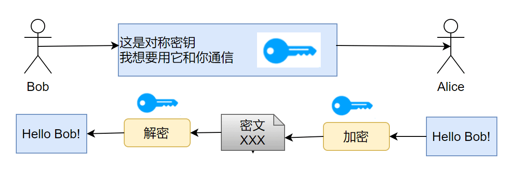
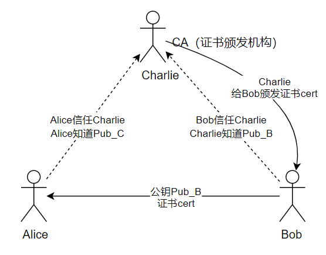

HTTP có thể truyền nội dung web, nhưng mặc định truyền dữ liệu ở dạng plaintext. Nếu request và response bị nghe lén, giả mạo hoặc chỉnh sửa trên mạng, bản thân HTTP không có đủ khả năng bảo vệ.

HTTPS không phải là một application-layer protocol hoàn toàn mới, mà là HTTP được bảo vệ bằng TLS. Trong HTTP/1.1 và các trường hợp HTTP/2 thường gặp, TLS thường chạy bên trên TCP; HTTP/3 ánh xạ ngữ nghĩa HTTP vào QUIC dựa trên UDP, đồng thời tích hợp TLS 1.3 trong QUIC.

Bài viết này chủ yếu trả lời một số câu hỏi:

1. Khác biệt cốt lõi giữa HTTP và HTTPS là gì?
2. HTTPS ngăn nghe lén, chỉnh sửa và giả mạo như thế nào?
3. SSL/TLS handshake đại khái thực hiện những việc gì?
4. Vì sao sau khi sử dụng HTTPS, vẫn cần quan tâm đến certificate, mixed content và tối ưu performance?

## Giao thức HTTP

### Giới thiệu giao thức HTTP

HTTP, viết đầy đủ là Hypertext Transfer Protocol. Đúng như tên gọi, HTTP dùng để quy định việc truyền hypertext, tức nhiều loại message khác nhau trên mạng, bao gồm cả text; cụ thể hơn, nó chủ yếu quy định cách browser và server hoạt động.

Ngoài ra, HTTP là một stateless protocol, nghĩa là server không duy trì bất kỳ message nào liên quan đến các request trước đây của client. Đây thực ra là một cách làm đơn giản: stateful protocol sẽ phức tạp hơn vì cần duy trì state (thông tin lịch sử), và nếu client hoặc server gặp sự cố, state sẽ không nhất quán, chi phí giải quyết sự không nhất quán này cũng cao hơn.

### Quy trình giao tiếp của giao thức HTTP

HTTP là application-layer protocol. Dưới đây dùng HTTP/1.1 dựa trên TCP làm ví dụ để giải thích quy trình giao tiếp; URL `http` có port mặc định là 80:

1. Server chờ request của client trên port 80.
2. Browser khởi tạo TCP connection đến server (tạo Socket).
3. Server tiếp nhận TCP connection từ browser.
4. Browser (HTTP client) và Web server (HTTP server) trao đổi HTTP message.
5. Đóng TCP connection.

### Ưu điểm của giao thức HTTP

Khả năng mở rộng mạnh, tốc độ nhanh, hỗ trợ đa nền tảng tốt.

## Giao thức HTTPS

### Giới thiệu giao thức HTTPS

HTTPS (Hypertext Transfer Protocol Secure) sử dụng TLS để cung cấp tính bí mật, tính toàn vẹn và xác thực danh tính cho HTTP, port mặc định là 443. HTTP/1.1 và HTTP/2 thường sử dụng TLS over TCP; HTTP/3 sử dụng QUIC tích hợp TLS 1.3, còn QUIC được xây dựng trên UDP.

Trong HTTPS, sau khi TLS handshake hoàn tất, dữ liệu giao tiếp được bảo vệ bằng các thuật toán đối xứng AEAD như AES-GCM và ChaCha20-Poly1305. Handshake có thể dùng (EC)DHE để thỏa thuận shared secret, hoặc dùng PSK trong các trường hợp như session resumption; TLS phiên bản cũ cũng từng hỗ trợ RSA key transport. ECDH/ECDHE là thuật toán key agreement, không phải dùng public key để mã hóa một symmetric key được tạo sẵn.

### Ưu điểm của giao thức HTTPS

Tính bí mật tốt, mức độ tin cậy cao.

## Cốt lõi của HTTPS — giao thức SSL/TLS

Khả năng bảo mật của HTTPS đến từ TLS. TLS cung cấp tính bí mật và tính toàn vẹn cho dữ liệu giao tiếp, đồng thời xác thực bên giao tiếp thông qua certificate và các cơ chế khác. Tiếp theo, bài viết tập trung giới thiệu nguyên lý hoạt động của TLS.

### SSL và TLS khác nhau thế nào?

**SSL và TLS không khác nhau quá nhiều.**

SSL là viết tắt của Secure Sockets Layer, được phát hành lần đầu vào năm 1996 (SSL 3.0). SSL 1.0 chưa từng xuất hiện, còn SSL 2.0 có nhiều khiếm khuyết nghiêm trọng (khiếm khuyết DROWN — Decrypting RSA with Obsolete and Weakened eNcryption). Không lâu sau, vào năm 1999, SSL 3.0 được nâng cấp thêm, **phiên bản mới được đặt tên là TLS 1.0**. Vì vậy, TLS dựa trên SSL, nhưng do cách gọi quen thuộc, protocol mã hóa cốt lõi trong HTTPS thường được gọi chung là SSL/TLS. Hiện nay SSL đã hoàn toàn bị loại bỏ, TLS 1.2 và TLS 1.3 là tiêu chuẩn thực tế của HTTPS hiện đại.

### Nguyên lý hoạt động của SSL/TLS

#### Mã hóa bất đối xứng

TLS sử dụng cơ chế mật mã bất đối xứng để thực hiện xác thực danh tính và/hoặc key agreement, sau đó dùng symmetric key để bảo vệ dữ liệu ứng dụng. Mật mã bất đối xứng không chỉ có một công dụng duy nhất là “mã hóa bằng public key, giải mã bằng private key”: digital signature dùng private key để ký, public key để xác minh; ECDHE thì thông qua temporary key của hai bên để thỏa thuận shared secret. Ví dụ về mailbox dưới đây chỉ dùng để minh họa khái niệm cơ bản của các public-key encryption scheme như RSA, không đại diện cho toàn bộ TLS handshake.

> Tại một bưu điện tự phục vụ, mỗi communication channel là một mailbox; mỗi chủ mailbox đều dựng biển hiệu bên cạnh, trên đó treo một chiếc chìa khóa: đây là public key của tôi, người gửi hãy đặt thư vào mailbox của tôi và khóa lại bằng public key.
>
> Nhưng public key chỉ có thể khóa chứ không thể mở. Chỉ chủ mailbox mới có thể mở khóa, vì chỉ người đó lưu giữ private key.
>
> Nhờ vậy, thông tin giao tiếp sẽ không bị người khác chặn bắt; điều này phụ thuộc vào tính bí mật của private key.

Public key và private key trong mã hóa bất đối xứng cần được tạo ra bằng một cơ chế toán học phức tạp (mật mã học cho rằng để đạt tính bảo mật cao, không nên tự tạo encryption scheme). Thuật toán tạo key pair phụ thuộc vào one-way trapdoor function.

> One-way function: với một one-way function f, cho một input bất kỳ x, việc tính output y=f(x) là dễ; nhưng với một output y, giả sử tồn tại f(x)=y, thì rất khó tính ngược x từ f.
>
> One-way trapdoor function: một dạng one-way function yếu hơn. Với one-way trapdoor function f và trapdoor h, cho một input bất kỳ x, có thể dễ dàng tính output y=f(x;h); nhưng với một output y, giả sử tồn tại f(x;h)=y, thì rất khó tính ngược x từ f, nhưng có thể suy ra x từ f và h.

Hình trên là một one-way function (không phải one-way trapdoor function). Giả sử có một bí kíp tuyệt thế: bất kỳ ai biết bí kíp này đều có thể ép nước táo thành quả táo, vậy bí kíp này chính là “trapdoor”.

Ở đây, cách tính của function f tương đương với public key, còn trapdoor h tương đương với private key. Public key f được công khai, bất kỳ ai cũng có thể dùng f để mã hóa input có sẵn; nhưng muốn khôi phục thông tin gốc từ thông tin đã mã hóa thì nhất định phải có private key.

#### Mã hóa đối xứng

TLS không dùng thuật toán mật mã bất đối xứng để trực tiếp mã hóa lượng lớn dữ liệu ứng dụng. Sau khi hoàn tất xác thực danh tính và thiết lập key trong giai đoạn handshake, record layer sử dụng symmetric AEAD algorithm để bảo vệ HTTP request và response.

> Mã hóa đối xứng: hai bên giao tiếp chia sẻ một key duy nhất k, thuật toán mã hóa và giải mã đã biết; bên mã hóa dùng key k để mã hóa, bên giải mã dùng key k để giải mã. Tính bảo mật phụ thuộc vào tính bí mật của key k.

Hai bên giao tiếp cần thiết lập traffic key mà chỉ hai bên biết trên network không an toàn. TLS 1.2 static RSA key exchange sẽ để client tạo `PreMasterSecret`, sau đó dùng RSA public key của server để mã hóa và gửi đi; TLS hiện đại thường dùng ECDHE, cho phép hai bên trao đổi temporary public key rồi tự tính ra cùng một shared secret. TLS 1.3 đã loại bỏ static RSA key exchange, cho phép các phương thức thiết lập key như (EC)DHE, PSK hoặc PSK+(EC)DHE. Dù dùng phương thức nào, cuối cùng đều sẽ suy ra symmetric traffic key để bảo vệ dữ liệu tiếp theo; không có cryptographic scheme nào có thể được gọi là “an toàn tuyệt đối”.

#### Độ tin cậy của việc truyền public key

Đến đây trong phần giới thiệu SSL/TLS, những người am hiểu information security sẽ nghĩ đến một rủi ro bảo mật. Hãy tưởng tượng tình huống sau:

> Client C và server S muốn giao tiếp bằng SSL/TLS. Theo nguyên lý giao tiếp SSL/TLS ở trên, C trước tiên cần biết public key của S, nhưng cách duy nhất để lấy public key của S là truyền public key của S trên network channel. Cần lưu ý một số tiền đề trong giao tiếp qua network channel:
>
> 1. Bất kỳ ai cũng có thể bắt các packet giao tiếp.
> 2. Tính bảo mật của packet giao tiếp do sender thiết kế.
> 3. Thiết kế của encryption scheme mặc định được công khai, còn (decryption) key mặc định được coi là an toàn.
>
> Vì vậy, giả sử public key của S không được mã hóa mà truyền trên channel, rất có thể tồn tại attacker A gửi cho C một packet giả, giả làm public key của S, nhưng thực chất là public key của máy chủ mồi AS. Khi C nhận public key của AS (nhưng tưởng đó là public key của S), C sẽ dùng public key của AS để mã hóa dữ liệu và truyền trên public channel. Khi đó A sẽ bắt các encrypted packet này, dùng private key của AS để giải mã và chặn lấy nội dung mà C định gửi cho S, trong khi C và S hoàn toàn không biết.
>
> Tương tự, ngay cả khi public key của S được mã hóa, cũng khó tránh khỏi vấn đề trust này: C đã bị AS dẫn dụ!

Để giải quyết vấn đề trust khi truyền public key, một tổ chức bên thứ ba đã ra đời — tổ chức cấp certificate (CA, Certificate Authority). CA mặc định là một bên thứ ba đáng tin cậy. CA cấp certificate cho từng server; certificate được lưu trên server và có đính kèm **digital signature** của CA (xem phần tiếp theo).

Khi server dùng certificate để xác thực, client sẽ nhận certificate chain do server cung cấp và xác minh xem signature chain có nối được đến trusted root cục bộ hay không; đồng thời kiểm tra hostname đích, validity period, key usage và path constraints cùng các thông tin khác. Chỉ khi tất cả kiểm tra này đều đạt, client mới có thể liên kết public key trong certificate với danh tính của dịch vụ đích. Các phương thức authentication không dùng certificate như PSK thuộc về một nhóm trường hợp khác.

#### Digital signature

Đến tiểu mục này, phần SSL/TLS đã gần kết thúc. Tiểu mục trước có đề cập đến digital signature. Digital signature cần giải quyết vấn đề ngăn certificate bị làm giả. Sở dĩ có thể tin cậy CA, một tổ chức bên thứ ba, là **nhờ công nghệ digital signature**.

Digital signature dùng để phát hiện nội dung certificate có bị chỉnh sửa hay không, đồng thời chứng minh signature được tạo bởi bên nắm giữ private key của CA. Nên mô tả quy trình này là “ký bằng private key, xác minh bằng public key”, thay vì cách nói mang tính khái quát “mã hóa bằng private key, giải mã bằng public key”. Cụ thể như sau:

> Sau khi xác minh thông tin đăng ký, CA dùng private key của mình để tạo digital signature cho phần cần ký của certificate, rồi đính kèm signature vào certificate.
>
> Server gửi certificate chain cho client. Client dùng public key trong issuer certificate để xác minh signature của certificate hiện tại, rồi lần lượt xác minh đến trusted root cục bộ.
>
> Xác minh signature chỉ là một phần của việc xác minh certificate. Client còn cần kiểm tra hostname đích, validity period, key usage, basic constraints và name constraints cùng các điều kiện khác. Chỉ sau khi tất cả đều đạt, client mới chấp nhận danh tính của server.

Tóm lại, cơ chế truyền public key kèm certificate hoạt động như sau:

1. Có server S, client C và CA, một tổ chức bên thứ ba được tin cậy.
2. CA xác minh thông tin đăng ký của S, tạo digital signature cho certificate chứa public key và thông tin danh tính của S.
3. S nhận certificate do CA cấp và truyền certificate đó cho C.
4. C nhận certificate chain của S, dùng public key của issuer ở từng cấp để xác minh signature, đồng thời xác nhận chain cuối cùng neo vào trusted root cục bộ.
5. C tiếp tục kiểm tra domain, validity period, key usage và các constraint của certificate. Chỉ sau khi tất cả đều đạt, C mới chấp nhận quan hệ liên kết giữa public key trong certificate và danh tính của dịch vụ đích.

Phần trình bày về digital signature ở đây khá đơn giản. Nếu bạn vẫn chưa hiểu rõ, mình đặc biệt khuyến nghị bạn xem video [Nguyên lý digital signature và digital certificate](https://www.bilibili.com/video/BV18N411X7ty/); đây là phần giải thích rõ ràng nhất mình từng xem.

## Tổng kết

- **Port**: HTTP mặc định là 80, HTTPS mặc định là 443.
- **URL prefix**: URL prefix của HTTP là `http://`, URL prefix của HTTPS là `https://`.
- **Tính bảo mật và phương thức truyền**: HTTP không sử dụng TLS mặc định không cung cấp tính bí mật, tính toàn vẹn và xác thực bên giao tiếp. HTTPS dùng TLS để bảo vệ HTTP; HTTP/1.1 và HTTP/2 thường dùng TLS over TCP, còn HTTP/3 dùng QUIC tích hợp TLS 1.3. TLS handshake chịu trách nhiệm xác thực bên giao tiếp và thiết lập traffic key; dữ liệu tiếp theo được bảo vệ bằng symmetric AEAD algorithm. Certificate chủ yếu dùng cho authentication, không thể nói một cách khái quát rằng “certificate đã mã hóa symmetric key”.

<!-- @include: @article-footer.snippet.md -->
