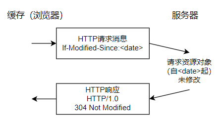
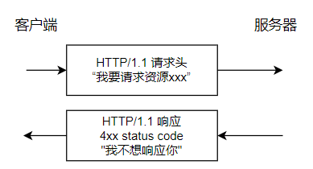
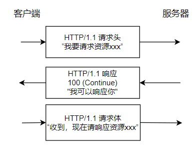

HTTP/1.0 và HTTP/1.1 chỉ chênh nhau một phiên bản nhỏ về tên gọi, nhưng có khác biệt rõ rệt về connection reuse, cache, Host header, status code và bandwidth optimization.

Những khác biệt này không chỉ là chi tiết giao thức đơn thuần, mà còn ảnh hưởng trực tiếp đến cách trình duyệt gửi request, cách server reuse connection, cách cache hoạt động và cách virtual host vận hành.

Bài viết này chủ yếu trả lời một số câu hỏi:

1. HTTP/1.1 bổ sung những status code thường gặp nào so với HTTP/1.0?
2. Cơ chế cache của HTTP/1.0 và HTTP/1.1 khác nhau thế nào?
3. Vì sao HTTP/1.1 mặc định hỗ trợ persistent connection?
4. Host header và bandwidth optimization lần lượt giải quyết vấn đề gì?

Trước khi bắt đầu, hãy ôn lại ngắn gọn về HTTP protocol:


## Response status code

HTTP/1.0 chỉ định nghĩa 16 status code. HTTP/1.1 bổ sung rất nhiều status code, riêng error response status code đã tăng thêm 24 loại. Ví dụ, `100 (Continue)` cho phép client xác nhận server có sẵn sàng nhận request body lớn trước khi gửi; `206 (Partial Content)` là status code cho range request; `409 (Conflict)` cho biết request mâu thuẫn với trạng thái hiện tại của resource; `410 (Gone)` cho biết resource đích không còn khả dụng, hơn nữa trạng thái này nhiều khả năng là vĩnh viễn và server cũng không biết địa chỉ forwarding khả dụng.

## Xử lý cache

Công nghệ cache tránh việc người dùng phải tương tác thường xuyên với origin server, nhờ đó tiết kiệm đáng kể network bandwidth và giảm latency khi người dùng nhận thông tin.

### HTTP/1.0

Cơ chế cache do HTTP/1.0 cung cấp rất đơn giản. Phía server dùng header `Expires` để đánh dấu thời hạn của response body; các request trước thời điểm `Expires` sẽ nhận được response body từ cache. Trong response body trả về client lần đầu, phía server có header `Last-Modified`, đánh dấu lần sửa đổi cuối cùng của resource được request trên server. Trong request header, dùng header `If-Modified-Since`; header này chỉ ra một thời điểm, có nghĩa client hỏi server: “Resource tôi muốn request có bị sửa đổi sau thời điểm đó không?”. Thông thường, giá trị `If-Modified-Since` trong request header chính là giá trị `Last-Modified` trong response body ở lần trước khi nhận resource đó.

Nếu server nhận được request header và xác định resource chưa bị sửa đổi sau thời điểm `If-Modified-Since`, server trả về cho client response `304 Not Modified`, nghĩa là “cache có thể dùng được, hãy lấy từ browser!”.

Nếu server xác định resource đã bị sửa đổi sau thời điểm `If-Modified-Since`, server trả về cho client response `200 OK` kèm nội dung resource hoàn toàn mới, nghĩa là “Resource bạn cần đã được tôi sửa rồi, đây là bản mới”.




### HTTP/1.1

Cơ chế cache của HTTP/1.1 tăng đáng kể tính linh hoạt và khả năng mở rộng dựa trên HTTP/1.0. Nguyên lý hoạt động cơ bản vẫn giống HTTP/1.0, nhưng bổ sung nhiều đặc tính chi tiết hơn. Trong đó, đặc tính phổ biến nhất ở request header là `Cache-Control`, xem thêm tài liệu Web MDN [Cache-Control](https://developer.mozilla.org/zh-CN/docs/Web/HTTP/Headers/Cache-Control).

## Connection

**HTTP/1.0 mặc định sử dụng short connection**, tức là mỗi lần client và server thực hiện một thao tác HTTP, chúng sẽ thiết lập một connection, rồi ngắt connection khi hoàn tất. Khi trang HTML hoặc trang Web thuộc loại khác mà browser truy cập chứa các Web resource khác (như file JavaScript, file image, file CSS...), mỗi khi gặp một Web resource như vậy, browser lại thiết lập một TCP connection mới, dẫn đến rất nhiều “handshake packet” và “teardown packet” chiếm dụng bandwidth.

**Để giải quyết vấn đề lãng phí resource của HTTP/1.0, HTTP/1.1 được tối ưu thành chế độ persistent connection mặc định.** Request message ở chế độ persistent connection sẽ thông báo cho server: “Tôi yêu cầu connection với bạn, và sau khi connection được thiết lập thành công, đừng đóng nó”. Vì vậy, TCP connection sẽ tiếp tục mở để phục vụ việc trao đổi dữ liệu client-server tiếp theo. Nói cách khác, khi dùng persistent connection, sau khi một Web page tải xong, TCP connection dùng để truyền HTTP data giữa client và server sẽ không đóng; khi client truy cập server này lần nữa, nó tiếp tục dùng connection đã được thiết lập đó.

Nếu TCP connection luôn được duy trì thì cũng lãng phí resource, vì vậy một số server software (như Apache) còn hỗ trợ tùy chọn timeout. Chỉ khi không có request mới nào đến trong thời gian timeout thì TCP connection mới bị đóng.

Cần lưu ý rằng HTTP/1.0 vẫn cung cấp tùy chọn persistent connection, bằng cách thêm `Connection: Keep-Alive` vào request header. Tương tự, trong HTTP/1.1, nếu không muốn dùng persistent connection, có thể thêm `Connection: close` vào request header để thông báo cho server: “Tôi không cần persistent connection, có thể đóng connection sau khi thiết lập thành công”.

**Persistent connection và short connection của HTTP protocol thực chất là persistent connection và short connection của TCP protocol.**

**Để triển khai persistent connection, cả client và server đều phải hỗ trợ persistent connection.**

## Xử lý Host header

Domain Name System (DNS) cho phép nhiều hostname bind vào cùng một IP address, nhưng HTTP/1.0 không tính đến vấn đề này. Giả sử có một resource URL là `http://example1.org/home.html`, request message của HTTP/1.0 sẽ request `GET /home.html HTTP/1.0`, tức là không thêm hostname. Khi message như vậy được gửi đến server, server không thể xác định URL thực tế mà client muốn request.

Vì vậy, HTTP/1.1 thêm field `Host` vào request header. Header của message sẽ là:

```plain
GET /home.html HTTP/1.1
Host: example1.org
```

Nhờ vậy, server có thể xác định URL thực sự mà client muốn request.

## Bandwidth optimization

### Range request

HTTP/1.1 giới thiệu cơ chế range request để tránh lãng phí bandwidth. Khi client muốn request một phần của file, hoặc cần tiếp tục download một file đã được download một phần nhưng bị gián đoạn, HTTP/1.1 có thể thêm header `Range` vào request để request một phần data (và chỉ có thể request dữ liệu dạng byte). Server có thể bỏ qua header `Range`, hoặc trả về response gồm nhiều range.

Vai trò chính của status code `206 (Partial Content)` là đảm bảo client và proxy server nhận diện chính xác partial content response, tránh nhầm nó với resource hoàn chỉnh và cache nhầm. Điều này rất quan trọng để xử lý đúng range request và quản lý cache.

Ví dụ điển hình về range request của HTTP/1.1:

```http
# Lấy 1024 byte đầu tiên của một file
GET /z4d4kWk.jpg HTTP/1.1
Host: i.imgur.com
Range: bytes=0-1023
```

Response `206 Partial Content`:

```http
HTTP/1.1 206 Partial Content
Content-Range: bytes 0-1023/146515
Content-Length: 1024
…
(nội dung nhị phân)
```

Giải thích đơn giản các field trong HTTP range response header:

- **Header `Content-Range`**: chỉ ra vị trí của data trả về trong toàn bộ resource, bao gồm byte bắt đầu, byte kết thúc và tổng length của resource. Ví dụ, `Content-Range: bytes 0-1023/146515` cho biết server trả về data từ byte 0 đến byte 1023 (tổng cộng 1024 byte), còn tổng length của toàn bộ resource là 146.515 byte.
- **Header `Content-Length`**: chỉ ra số byte thực tế được truyền trong response lần này. Ví dụ, `Content-Length: 1024` cho biết server đã truyền 1024 byte data.

Request header `Range` không chỉ request được một byte range đơn lẻ, mà còn có thể request nhiều range cùng lúc. Cách này được gọi là “multiple range requests”.

Client muốn lấy byte 0 đến 499 và byte 1000 đến 1499 của resource:

```http
GET /path/to/resource HTTP/1.1
Host: example.com
Range: bytes=0-499,1000-1499
```

Server trả về nhiều byte range, nội dung của mỗi range được phân tách bằng dấu phân cách:

```http
HTTP/1.1 206 Partial Content
Content-Type: multipart/byteranges; boundary=3d6b6a416f9b5

--3d6b6a416f9b5
Content-Type: application/octet-stream
Content-Range: bytes 0-499/2000

(khối dữ liệu từ byte 0 đến 499)

--3d6b6a416f9b5
Content-Type: application/octet-stream
Content-Range: bytes 1000-1499/2000

(khối dữ liệu từ byte 1000 đến 1499)

--3d6b6a416f9b5--
```

### Status code 100

HTTP/1.1 bổ sung status code `100`. Khi client chuẩn bị gửi request body lớn, có thể thêm `Expect: 100-continue` vào request header và chỉ gửi request header trước. Khi server sẵn sàng nhận request body, server trả về `100 Continue`, sau đó client tiếp tục gửi; server cũng có thể trả về final response ngay để client không cần truyền request body. Quy trình như hình dưới đây:





HTTP/1.0 không có status code `100 (Continue)`, cũng không có cơ chế xác nhận trước như trên thông qua `Expect: 100-continue`; khi server HTTP/1.0 nhận được `Expect` header không nhận diện được, server nên bỏ qua header này.

### Compression

Nhiều loại data sẽ được pre-compress khi truyền đi. Việc compression data có thể tối ưu đáng kể việc sử dụng bandwidth. Tuy nhiên, HTTP/1.0 cung cấp ít tùy chọn compression data, không hỗ trợ lựa chọn chi tiết về compression, cũng không thể phân biệt compression end-to-end hay compression hop-by-hop.

HTTP/1.1 phân biệt content-codings và transfer-codings. Content coding luôn theo kiểu end-to-end, transfer coding luôn theo kiểu hop-by-hop.

HTTP/1.0 có header `Content-Encoding` để encode message theo kiểu end-to-end. HTTP/1.1 thêm header `Transfer-Encoding` để encode message khi truyền theo kiểu hop-by-hop. HTTP/1.1 cũng thêm header `Accept-Encoding`, được client dùng để chỉ ra loại content coding nào mà nó có thể xử lý.

## Tổng kết

1. **Connection**: HTTP/1.0 dùng short connection, HTTP/1.1 hỗ trợ persistent connection.
2. **Response status code**: HTTP/1.1 bổ sung rất nhiều status code, riêng error response status code đã tăng thêm 24 loại. Ví dụ, `100 (Continue)` cho phép client xác nhận server có sẵn sàng nhận request body lớn trước khi gửi; `206 (Partial Content)` là status code cho range request; `409 (Conflict)` cho biết request mâu thuẫn với trạng thái hiện tại của resource; `410 (Gone)` cho biết resource đích không còn khả dụng, hơn nữa trạng thái này nhiều khả năng là vĩnh viễn và server cũng không biết địa chỉ forwarding khả dụng.
3. **Xử lý cache**: HTTP/1.0 chủ yếu dùng `If-Modified-Since`, `Expires` trong header làm tiêu chuẩn xác định cache; HTTP/1.1 bổ sung nhiều chiến lược cache control hơn, chẳng hạn `Entity Tag`, `If-Unmodified-Since`, `If-Match`, `If-None-Match` và nhiều cache header khác để kiểm soát chiến lược cache.
4. **Bandwidth optimization và sử dụng network connection**: HTTP/1.0 có một số hiện tượng lãng phí bandwidth, chẳng hạn client chỉ cần một phần của object nhưng server lại gửi toàn bộ object, đồng thời không hỗ trợ resume download. HTTP/1.1 thêm header field `Range` vào request header, cho phép chỉ request một phần resource, với status code là `206 (Partial Content)`, nhờ đó developer có thể tự do lựa chọn để tận dụng đầy đủ bandwidth và connection.
5. **Xử lý Host header**: HTTP/1.1 thêm field `Host` vào request header.

## Tài liệu tham khảo

[Key differences between HTTP/1.0 and HTTP/1.1](http://www.ra.ethz.ch/cdstore/www8/data/2136/pdf/pd1.pdf)

<!-- @include: @article-footer.snippet.md -->
