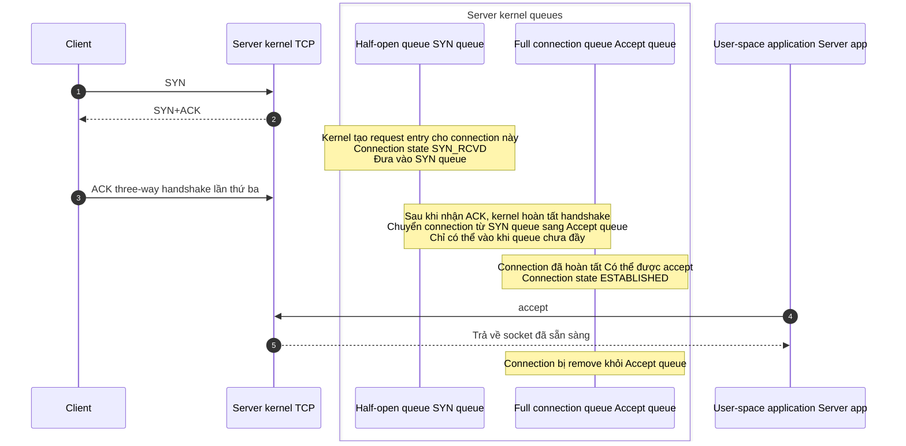
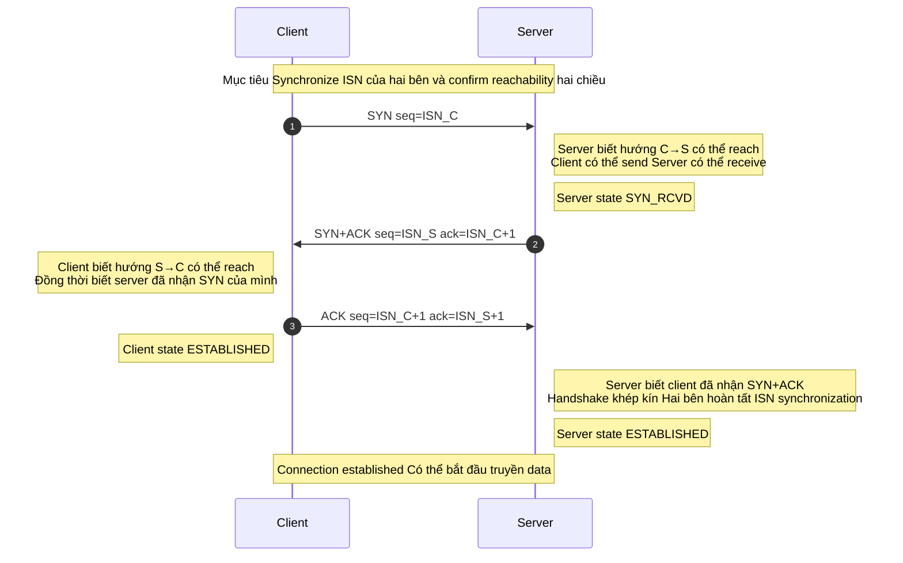
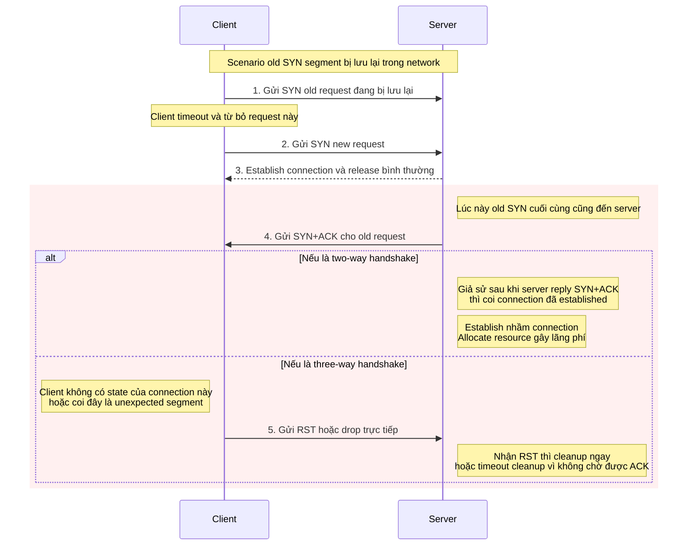
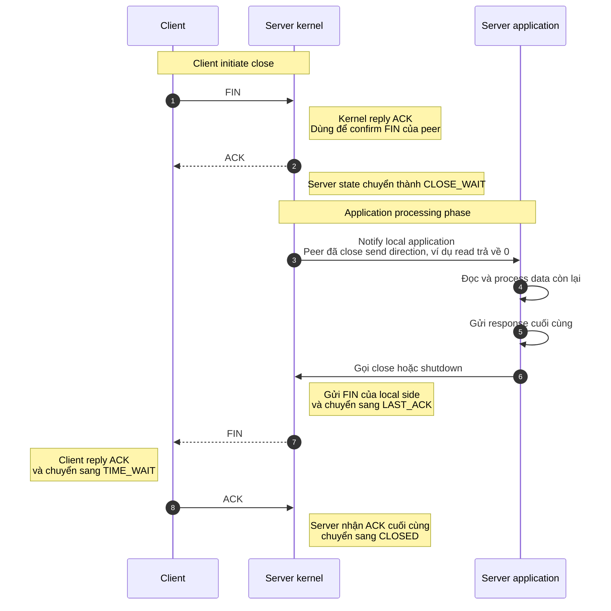
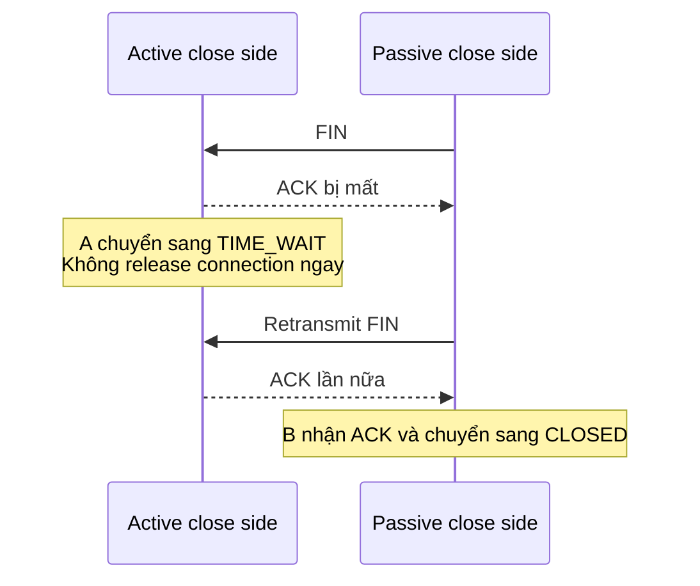

TCP three-way handshake và four-way teardown rất dễ bị học thuộc thành một flowchart: client gửi `SYN`, server trả `SYN+ACK`, cuối cùng gửi thêm một `ACK`; khi đóng connection thì đi lại theo thứ tự `FIN`, `ACK`, `FIN`, `ACK`.

Nhưng khi thực sự troubleshoot vấn đề network, xem packet capture hoặc trao đổi về interview question, chỉ nhớ thứ tự thường là chưa đủ. Ví dụ: vì sao establish connection không cần two-way handshake? Sau khi server nhận three-way handshake, connection thực sự được đặt vào queue nào? Vì sao ACK và FIN trong four-way teardown thường được gửi tách nhau? Và trong điều kiện nào chúng có thể được gộp thành three-way teardown?

Bài viết này xoay quanh việc establish và release TCP connection, giải thích rõ các vấn đề đó:

1. Mỗi bước của TCP three-way handshake thực hiện việc gì?
2. Vì sao establish connection cần three-way handshake thay vì two-way hoặc four-way handshake?
3. Half-open queue và full connection queue lần lượt lưu những gì?
4. Mỗi bước của TCP four-way teardown thực hiện việc gì?
5. Nên hiểu thế nào về các chi tiết như `TIME_WAIT`, `CLOSE_WAIT` và three-way teardown?

> **Quy ước thuật ngữ**: Trong phần nội dung bài viết này thống nhất dùng cách viết có dấu gạch dưới như `SYN_RCVD`, `TIME_WAIT`; RFC thường viết là `SYN-RECEIVED`, `TIME-WAIT`, còn lệnh `ss` của Linux thường hiển thị là `syn-recv`, `time-wait`. Chúng đều chỉ cùng một nhóm TCP state, chỉ khác cách viết trong các ngữ cảnh khác nhau.

## Establish connection: TCP three-way handshake

Trong scenario phổ biến nhất, một bên chủ động initiate connection và một bên passive listen, TCP connection thường được establish qua three-way handshake:

1. **Three-way handshake lần thứ nhất (SYN)**: Client gửi cho server một SYN (Synchronize Sequence Numbers) segment, trong đó chứa initial sequence number (Initial Sequence Number, ISN) do client tạo ra, ví dụ `seq=x`. Sau khi gửi, client chuyển sang state `SYN_SENT`, chờ server confirm.
2. **Three-way handshake lần thứ hai (SYN+ACK)**: Sau khi nhận SYN, nếu đồng ý establish connection, server sẽ trả về một SYN+ACK segment. Segment này chứa hai thông tin quan trọng:
   - **SYN**: Server cũng cần synchronize initial sequence number của mình, nên sẽ mang theo ISN do server tạo ra, ví dụ `seq=y`.
   - **ACK**: Dùng để confirm đã nhận SYN của client, confirmation number được đặt bằng initial sequence number của client cộng một, tức `ack=x+1`.
   - Sau khi gửi segment này, server chuyển sang state `SYN_RCVD`.
3. **Three-way handshake lần thứ ba (ACK)**: Sau khi nhận SYN+ACK của server, client gửi cho server segment confirmation cuối cùng. Vì SYN của client tiêu thụ một sequence number, sequence number của ACK segment này thường là `seq=x+1`; nó dùng để confirm SYN của server, confirmation number là `ack=y+1`. Sau khi gửi, client chuyển sang state `ESTABLISHED`. Sau khi nhận ACK này, server cũng chuyển sang state `ESTABLISHED`.

Đến đây, hai bên đã hoàn tất việc synchronize initial sequence number và confirm connection này có thể bắt đầu truyền data hai chiều.

### Half-open queue và full connection queue là gì?

Trong quá trình TCP three-way handshake, server kernel thường dùng hai queue để quản lý connection request. Dưới đây lấy hành vi phổ biến trên Linux làm ví dụ; các hệ điều hành, kernel version, socket option và deployment environment khác nhau có thể có chi tiết khác biệt.

1. **Half-open queue (SYN Queue)**:
   - Lưu các request có “handshake chưa hoàn tất”. Sau khi server nhận SYN và trả lời SYN+ACK, connection chuyển sang `SYN_RCVD`, chờ ACK cuối cùng của client.
   - Nếu vẫn không nhận được ACK, kernel sẽ retransmit SYN+ACK theo chính sách retransmission, cuối cùng timeout và cleanup.
   - Các parameter liên quan thường gặp gồm `net.ipv4.tcp_max_syn_backlog`. Trong scenario SYN Flood còn liên quan đến `net.ipv4.tcp_syncookies`.
2. **Full connection queue (Accept Queue)**:

   - Lưu các connection “đã hoàn tất handshake nhưng application chưa accept”. Sau khi server nhận ACK cuối cùng, connection chuyển thành `ESTABLISHED` và vào full connection queue, chờ application layer lấy ra bằng `accept()`.
   - Queue capacity chịu ảnh hưởng chung của `listen(fd, backlog)` và system limit `net.core.somaxconn`. Trong thực tế, effective limit thường có thể hiểu gần đúng là `min(backlog, somaxconn)`, nhưng hành vi cụ thể vẫn phụ thuộc vào kernel version và application configuration.

Tóm lại:

| Queue                                | Tác dụng                                                     | State         | Điều kiện remove                           |
| ------------------------------------ | ------------------------------------------------------------ | ------------- | ------------------------------------------ |
| Half-open queue (SYN Queue)          | Lưu connection chưa hoàn tất handshake                       | `SYN_RCVD`    | Nhận ACK / retransmission timeout          |
| Full connection queue (Accept Queue) | Lưu connection đã hoàn tất handshake, chờ application accept | `ESTABLISHED` | Được application layer lấy bằng `accept()` |

Khi full connection queue đầy, `net.ipv4.tcp_abort_on_overflow` sẽ ảnh hưởng đến processing strategy:

- `0` (default): Linux thường không lập tức trả về RST mà có thể drop ACK của three-way handshake lần thứ ba, khiến server tiếp tục dừng ở state handshake chưa hoàn tất và retransmit SYN+ACK. Sau khi client gửi ACK lần thứ ba, client thường đã coi `connect()` là success; nhưng server chưa đưa connection vào full connection queue, nên khi client gửi data tiếp theo, có thể mãi không nhận được response bình thường, cuối cùng biểu hiện thành first-packet blocking, read timeout hoặc retry.
- `1`: Trực tiếp reply `RST` cho client để connection fail nhanh.

Khi troubleshoot, có thể dùng `ss -ltn` để xem listening socket. Với state `LISTEN`, `Recv-Q` thường biểu thị số connection đang chờ application accept trong backlog hiện tại, còn `Send-Q` biểu thị backlog limit của socket. Nếu `Recv-Q` liên tục gần `Send-Q`, cần nghi ngờ việc application accept không kịp, backlog quá nhỏ, thread pool bị block, GC jitter hoặc connection spike trong thời gian ngắn.

Khi half-open queue đầy, nếu `tcp_syncookies=1`, Linux sẽ enable SYN Cookie khi SYN backlog overflow: server encode thông tin cần thiết vào SYN+ACK trả về thay vì giữ full half-open state cho từng request. Nói cách khác, khi SYN Cookie có hiệu lực, server không allocate state thông thường cho SYN này trong half-open queue; chỉ sau khi nhận ACK cuối cùng hợp lệ, kernel mới validate cookie và reconstruct thông tin cần thiết cho connection.

Nhưng SYN Cookie là một protection measure, không phải capacity expansion measure. Nó có thể giảm tác động của SYN Flood lên half-open queue nhưng vẫn tiêu thụ CPU; nếu attack traffic đã lấp đầy bandwidth, SYN Cookie cũng không thể khôi phục availability từ gốc. Ngoài ra, một phần capability của TCP extension có thể bị hạn chế trong SYN Cookie mode, gây performance degradation trên high-latency, high-bandwidth link. `tcp_syncookies=2` thiên về mục đích test hơn, không nên dùng làm default configuration trong production environment.

### Vì sao cần three-way handshake?

TCP three-way handshake chủ yếu thực hiện hai việc: **synchronize initial sequence number của hai bên**, đồng thời **confirm send/receive path của hai bên đều khả dụng**. Reliable data delivery thực sự còn phụ thuộc vào confirmation, retransmission, window control và congestion control trong quá trình truyền sau đó.

#### 1. Confirm send/receive capability của hai bên và synchronize initial sequence number

TCP dựa vào sequence number (SEQ) và confirmation number (ACK) để bảo đảm data có thứ tự, loại bỏ trùng lặp và retransmission. Three-way handshake thông qua việc trao đổi và confirm ISN của hai bên giúp hai đầu thống nhất “bắt đầu send/receive data từ sequence number nào”, đồng thời tránh chuyển sang established state chỉ dựa trên thông tin một chiều.

Có thể ghi nhớ bằng bảng sau:

| Bước | Segment      | Có thể confirm điều gì                                                                                |
| ---- | ------------ | ----------------------------------------------------------------------------------------------------- |
| 1    | C→S: SYN     | Server biết: client có thể send, server có thể receive, hướng C→S có thể reach                        |
| 2    | S→C: SYN+ACK | Client biết: server có thể send, client có thể receive; đồng thời confirm server đã nhận SYN của mình |
| 3    | C→S: ACK     | Server biết: client đã nhận SYN+ACK, hướng S→C cũng được server confirm; handshake khép kín           |

Lưu ý: Khi bước 2 hoàn tất, chỉ client confirm được reachability hai chiều; lúc này server vẫn chưa biết SYN+ACK do mình gửi có đến được client hay không. Chỉ sau khi nhận ACK của three-way handshake lần thứ 3, server mới thực sự confirm được vòng khép kín này. Đây cũng là lý do cốt lõi khiến two-way handshake không đủ.

#### 2. Ngăn connection request đã hết hiệu lực bị establish nhầm

Hãy hình dung scenario: SYN1 của connection request đầu tiên do client gửi bị lưu lại vì network delay. Sau khi client timeout, client gửi lại SYN2 và establish connection thành công; sau khi truyền data xong, connection cũng được release. Lúc này SYN1 bị delay mới đến server.

- **Nếu là two-way handshake**: Sau khi nhận SYN1 đã hết hiệu lực này, server có thể nhầm đó là một connection request mới, lập tức allocate resource và establish connection. Nhưng client đã không còn ý định với connection này, sẽ không tiếp tục phối hợp truyền data; server sẽ đơn phương duy trì một connection không hiệu lực.
- **Khi có three-way handshake**: Sau khi nhận SYN1 đã hết hiệu lực và reply SYN+ACK, server vẫn phải chờ ACK cuối cùng của client. Vì client hiện không có state của connection này, client có thể drop trực tiếp hoặc gửi RST. Server không nhận được ACK hợp lệ, cuối cùng sẽ cleanup connection nhầm này.

Vì vậy, three-way handshake không phải chỉ là “gửi thêm một packet”; nó khiến quá trình establish connection tạo thành một vòng khép kín, ngăn các request cũ, delay hoặc duplicate trong network can thiệp vào connection mới.

### Lần handshake thứ 2 đã trả về ACK, vì sao vẫn phải trả về SYN?

ACK trong three-way handshake lần thứ hai dùng để confirm “server đã nhận SYN của client”, tức confirm request theo hướng C→S đã đến nơi.

Đồng thời mang SYN vì server cũng cần synchronize ISN của mình cho client và yêu cầu client confirm. Chỉ khi ISN của hai bên đều synchronize xong, reliable transmission sau đó mới có một sequence number starting point chung.

Nói ngắn gọn: ACK nghĩa là “tôi đã nhận SYN của bạn”, còn SYN nghĩa là “tôi cũng muốn synchronize initial sequence number của mình, hãy confirm cho tôi”.

> SYN (Synchronize Sequence Numbers) là synchronization signal được dùng khi TCP establish connection. Client gửi SYN trước, server reply bằng SYN+ACK, cuối cùng client dùng ACK để confirm. Nhờ vậy, hai bên hoàn tất synchronize initial sequence number và establish một TCP connection có thể dùng cho reliable data transmission.

### Có thể mang data trong quá trình three-way handshake không?

Trong TCP thông thường, ACK của three-way handshake lần thứ ba có thể mang data. RFC 9293 cũng cho phép segment mang data xuất hiện trong connection synchronization phase, nhưng receiver không được deliver phần data này cho application trước khi confirm data hợp lệ; thông thường phải chờ connection chuyển sang `ESTABLISHED` thì application layer mới đọc được data đó.

Nếu ACK của three-way handshake lần thứ ba bị mất, nhưng sau đó client gửi một segment mang data và có ACK flag, server có thể coi segment nhận được là confirmation hợp lệ của three-way handshake lần thứ ba. Sau khi connection được coi là established, server tiếp tục process data đó.

Cần lưu ý, điều này không giống TCP Fast Open (TFO). TFO nói về việc SYN lần đầu đã mang application data, cần client, server và system configuration cùng support, không phải hành vi mặc định của TCP thông thường.

## Release connection: TCP four-way teardown

TCP là full-duplex communication, send direction của hai đầu độc lập với nhau. Khi close connection, hai direction thường phải lần lượt hoàn tất quá trình “tôi không send nữa” và “tôi confirm bạn không send nữa”, nên về mặt logic thường được gọi là “four-way teardown”.

Tuy nhiên cần lưu ý: four-way teardown nói về logical action, không nhất thiết khi packet capture luôn nhìn thấy 4 segment độc lập. Trong một số scenario, ACK và FIN có thể được gộp trong cùng một segment.

Flow điển hình như sau:

1. **Four-way teardown lần thứ nhất (FIN)**: Khi client hoặc bất kỳ bên nào quyết định close send direction của mình, bên đó gửi một FIN segment, biểu thị mình không còn data để send. Segment này chứa một sequence number, ví dụ `seq=u`. Sau khi gửi, bên chủ động close chuyển sang state `FIN_WAIT_1`.
2. **Four-way teardown lần thứ hai (ACK)**: Sau khi nhận FIN, server reply ACK với confirmation number `ack=u+1`. Sau khi gửi, server chuyển sang state `CLOSE_WAIT`. Sau khi nhận ACK, client chuyển sang state `FIN_WAIT_2`. Lúc này connection ở trạng thái **half-close (Half-Close)**: send direction từ client đến server đã close, nhưng server vẫn có thể tiếp tục send data còn lại đến client.
3. **Four-way teardown lần thứ ba (FIN)**: Sau khi confirm đã send xong toàn bộ data còn lại, server cũng gửi FIN, biểu thị mình đã sẵn sàng close send direction. Segment này cũng chứa một sequence number, ví dụ `seq=v`; thường vẫn mang confirmation number hiện tại, ví dụ `ack=u+1`. Sau khi gửi, server chuyển sang state `LAST_ACK`, chờ confirmation cuối cùng của client.
4. **Four-way teardown lần thứ tư (ACK)**: Sau khi nhận FIN của server, client reply ACK cuối cùng với confirmation number `ack=v+1`. Sau khi gửi, client chuyển sang state `TIME_WAIT`. Sau khi nhận ACK này, server chuyển sang `CLOSED`. Client chờ 2MSL trong state `TIME_WAIT`, sau đó cuối cùng chuyển sang `CLOSED`.

Ở đây, để dễ hiểu, lấy client initiate close làm ví dụ. Trong thực tế, bên nào chủ động close connection thì bên đó sẽ vào `TIME_WAIT`, điều này không nhất thiết liên quan đến role “client / server”.

> Cần phân biệt: **half-close (Half-Close)** nghĩa là một direction đã send FIN, còn direction kia vẫn có thể tiếp tục send data; **half-open connection (Half-Open Connection)** thường chỉ việc một bên crash, restart hoặc mất state, trong khi bên kia vẫn cho rằng connection còn tồn tại. Hai khái niệm này không giống nhau.

Các path state phổ biến khi TCP establish và close connection như sau. Hình đã lược bỏ các branch ít gặp hoặc bất thường như simultaneous open, simultaneous close, RST và CLOSING.

### Vì sao cần four-way teardown?

Vì TCP là full-duplex. A không muốn send nữa không có nghĩa là B cũng lập tức không còn data để send.

Ví dụ, A và B đang gọi điện, cuộc gọi sắp kết thúc:

1. A nói: “Tôi không còn gì để nói nữa.” (A gửi FIN)
2. B trả lời: “Tôi biết rồi.” Nhưng B có thể vẫn còn điều muốn nói. (B trả ACK)
3. B nói nốt phần còn lại, cuối cùng nói: “Tôi cũng nói xong rồi.” (B gửi FIN)
4. A trả lời: “Biết rồi.” (A trả ACK)

Trong TCP, điều này tương ứng với việc hai direction lần lượt close và lần lượt confirm.

### Vì sao thường không thể gộp ACK và FIN do server gửi thành three-way teardown?

Lý do then chốt là: **thời điểm trigger của reply ACK** và **send FIN** thường khác nhau.

- Khi server nhận FIN của client, TCP protocol stack trong kernel cần reply ACK để confirm “tôi đã nhận request close send direction của bạn”. Lúc này server chuyển sang `CLOSE_WAIT`, chờ local application process data còn lại.
- Chỉ sau khi server application process xong và gọi `close()` hoặc `shutdown()`, kernel mới send FIN của local side.
- Vì “kernel tự động reply ACK” và “application quyết định send FIN” được decouple về thời gian, chúng thường không thể merge. Chỉ khi server cũng đúng lúc chuẩn bị close ngay thì mới có thể thấy FIN+ACK được gộp trong cùng một segment.

### Vì sao CLOSE_WAIT bị tích tụ?

`CLOSE_WAIT` là state mà passive close side đi vào sau khi nhận FIN và reply ACK. Trong điều kiện bình thường, đây chỉ là một transitional state: sau khi application đọc được signal peer close send direction, process xong data còn lại rồi gọi `close()` hoặc `shutdown()`, connection sẽ tiếp tục chuyển sang `LAST_ACK`.

Nếu machine xuất hiện nhiều `CLOSE_WAIT`, nguyên nhân thường không phải TCP parameter chưa được tune mà là application layer chưa close connection kịp thời. Các nguyên nhân thường gặp gồm: exception branch bỏ sót `close()`, logic return connection về pool không nhất quán với logic close thực tế, business thread bị slow query hoặc external call block, khiến code mãi không chạy đến vị trí close socket.

Khi troubleshoot, có thể dùng `ss -tan state close-wait` để xem connection nào đang dừng ở `CLOSE_WAIT`, sau đó kết hợp application log, thread stack và connection pool monitoring để định vị code path cụ thể. Điểm cốt lõi của `CLOSE_WAIT` là “local application vẫn chưa close”, nên chỉ tune TCP parameter thường không giải quyết được root cause.

### Khi nào xuất hiện three-way teardown?

Four-way teardown chuyển thành three-way teardown về bản chất không phải thiếu một close step, mà là **ACK của four-way teardown lần thứ hai và FIN của lần thứ ba được gộp trong cùng một segment**.

Điều kiện khá điển hình là: passive close side sau khi nhận FIN đã không còn data chờ send, application cũng lập tức quyết định close connection.

Ở đây còn cần kết hợp TCP delayed ACK để hiểu. Mục đích của delayed ACK là tạo cơ hội để ACK được gộp với window update, application response hoặc outbound segment khác, giảm số lượng pure ACK segment. RFC 1122 yêu cầu ACK không được delay quá mức, còn chờ bao lâu cụ thể do implementation quyết định. Trong các implementation như Linux, nếu ACK “confirm FIN của peer” vẫn đang chờ merge, local application lại nhanh chóng gọi `close()` hoặc `shutdown()`, kernel có thể gửi FIN+ACK: vừa confirm FIN của peer, vừa biểu thị “bên tôi cũng không send data nữa”.

Khi packet capture, flow sẽ trở thành:

1. Active close side gửi FIN;
2. Passive close side gửi FIN+ACK;
3. Active close side reply ACK và chuyển sang `TIME_WAIT`.

Có hai chi tiết dễ nhầm lẫn:

- Three-way teardown không vi phạm full-duplex close semantics của TCP. Hai direction vẫn phải close, chỉ là “confirmation” và “close send direction” của passive close side tình cờ được đặt trong cùng một TCP segment.
- Việc có thể merge hay không còn liên quan đến TCP implementation cụ thể, delayed ACK strategy và thời điểm application close. Nếu ACK đã được kernel send riêng, sau đó send FIN thì không thể “quay lại” để merge; nếu bật strategy fast confirmation tương tự `TCP_QUICKACK`, khiến ACK được send độc lập càng sớm càng tốt, sẽ dễ thấy four-way teardown đầy đủ hơn.

### Nếu ACK của server ở four-way teardown lần thứ hai không đến được client thì sao?

Sau khi client gửi FIN lần thứ nhất, client chuyển sang `FIN_WAIT_1` và start retransmission timer. Nếu trong timeout không nhận được ACK confirm FIN từ peer, client sẽ retransmit FIN.

Nếu server nhận duplicate FIN, server thường send ACK lần nữa. Nếu vì vấn đề network mà ACK liên tục không đến được nơi, sau khi đạt retry hoặc timeout threshold nhất định, client có thể báo lỗi hoặc từ bỏ. Hành vi cụ thể chịu ảnh hưởng của implementation và parameter: trong Linux, nếu socket đã bị application close và trở thành orphaned socket, các retry tiếp theo chịu ảnh hưởng trực tiếp hơn từ `tcp_orphan_retries`; còn RTO retransmission timeout trên connection đang sống thông thường liên quan đến `tcp_retries2`.

### Vì sao phải chờ 2MSL sau four-way teardown lần thứ tư?

Ở four-way teardown lần thứ tư, ACK cuối cùng mà active close side gửi cho passive close side có thể bị mất. Nếu passive close side không nhận được ACK, nó sẽ retransmit FIN. Khi active close side vẫn ở `TIME_WAIT`, nó có thể reply ACK lần nữa.

Nếu active close side lập tức chuyển sang `CLOSED` sau khi send ACK cuối cùng, khi FIN retransmit từ peer đến nơi, local side có thể đã không còn connection state tương ứng, chỉ có thể reply RST, khiến peer thấy connection close bất thường hoặc bị reset.

**MSL (Maximum Segment Lifetime)** là thời gian tồn tại tối đa của segment trong network. 2MSL không phải RTT tối đa của một request-response, mà là một waiting window bảo thủ: vừa dành cơ hội xử lý FIN retransmit sau khi ACK cuối cùng bị mất, vừa cố gắng bảo đảm các segment delay trong old connection biến mất khỏi network.

Cần lưu ý, MSL trong RFC là một protocol-layer concept, còn system implementation cụ thể có thể khác nhau. Trong implementation phổ biến của Linux, thời gian giữ `TIME_WAIT` thường là 60 giây, tương ứng với constant `TCP_TIMEWAIT_LEN` trong kernel, không phải “2 lần MSL” được tính động theo network environment thực tế. Một hiểu lầm phổ biến khác: `tcp_fin_timeout` kiểm soát timeout `FIN_WAIT_2` của orphaned connection, không phải `TIME_WAIT`. Muốn giảm port pressure do `TIME_WAIT`, nên ưu tiên xem connection reuse, port range, active close side và điều kiện của `tcp_tw_reuse`, thay vì cố dùng `tcp_fin_timeout` để rút ngắn `TIME_WAIT`.

## Các vấn đề thường gặp về TIME_WAIT: vì sao phải chờ, có gây vấn đề không, có thể reuse không?

Nội dung này đã được viết thành bài riêng, xem [Giải thích chi tiết TCP TIME_WAIT: vì sao phải chờ, có gây vấn đề không, có thể reuse không?](./tcp-time-wait.md).

## Tổng kết

Cốt lõi của TCP three-way handshake không phải là “vừa đúng ba packet được gửi”, mà là thông qua `SYN`, `ACK` và việc synchronize initial sequence number để client và server đều confirm connection có khả năng communication hai chiều. Nếu thiếu một handshake, server có thể không confirm được client đã nhận SYN+ACK của mình hay chưa, đồng thời connection cũng dễ bị các old connection request trong network can thiệp hơn.

Trong quá trình handshake, server liên quan đến half-open queue và full connection queue: queue trước lưu connection chưa hoàn tất handshake, queue sau lưu connection đã established và đang chờ application `accept()`. Khi troubleshoot các vấn đề như establish connection chậm, timeout ngẫu nhiên, SYN Flood hoặc accept không kịp, hai queue này là những điểm quan sát rất quan trọng.

Cốt lõi của TCP four-way teardown là hai send direction của full-duplex connection phải close riêng. Active close side gửi FIN chỉ biểu thị “tôi không send data nữa”, không có nghĩa peer cũng lập tức không còn data để send. Vì vậy, ACK và FIN thường được send riêng; chỉ khi passive close side không có data chờ send, application lập tức close connection và ACK còn có thể chờ merge nhờ các mechanism như delayed ACK, ACK và FIN mới có thể được gộp thành một FIN+ACK, khiến packet capture trông như three-way teardown. `CLOSE_WAIT` thường nhắc chúng ta rằng application của passive close side vẫn chưa thực sự close connection.

Cuối cùng, `TIME_WAIT` không phải thời gian chờ dư thừa. Nó vừa tạo cơ hội xử lý FIN retransmit sau khi ACK cuối cùng bị mất, vừa cố gắng ngăn delayed segment từ old connection ảnh hưởng đến connection mới về sau. Hiểu state và thời điểm trigger của segment hữu ích hơn việc chỉ ghi nhớ “mấy lần handshake, mấy lần teardown”.

## Tài liệu tham khảo

- 《Computer Network (ấn bản thứ 7)》
- 《HTTP qua hình ảnh》
- TCP and UDP Tutorial: <https://www.9tut.com/tcp-and-udp-tutorial>
- Bắt đầu từ một vấn đề production, giải thích chi tiết half-open queue và full connection queue của TCP: <https://mp.weixin.qq.com/s/YpSlU1yaowTs-pF6R43hMw>
- RFC 9293: Transmission Control Protocol (TCP): <https://www.rfc-editor.org/rfc/rfc9293>
- RFC 1122: Requirements for Internet Hosts - Communication Layers: <https://www.rfc-editor.org/rfc/rfc1122>
- RFC 1337: TIME-WAIT Assassination Hazards in TCP: <https://www.rfc-editor.org/rfc/rfc1337>
- tcp(7) - Linux manual page: <https://www.man7.org/linux/man-pages/man7/tcp.7.html>
- Tài liệu Linux kernel ip-sysctl: <https://www.kernel.org/doc/Documentation/networking/ip-sysctl.txt>
- Linux kernel `include/net/tcp.h`: <https://codebrowser.dev/linux/linux/include/net/tcp.h.html>
- SoByte - Vì sao TCP cần state TIME_WAIT: <https://www.sobyte.net/post/2022-10/tcp-time-wait/>

<!-- @include: @article-footer.snippet.md -->
