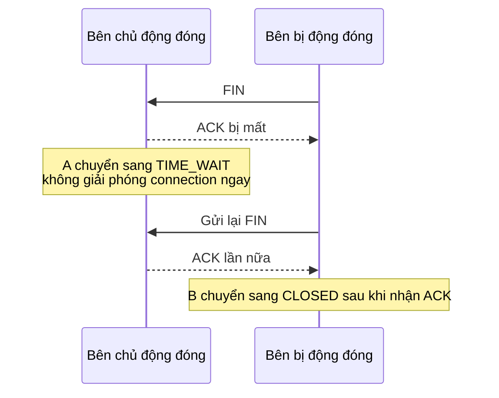

Bước cuối của TCP four-way handshake là sau khi bên chủ động đóng gửi ACK, bên đó không đóng ngay mà chuyển sang trạng thái `TIME_WAIT`, mặc định phải chờ 60 giây.

60 giây này thường bị hiểu nhầm: có người cho rằng đây là lãng phí tài nguyên, có người muốn dùng kernel parameter để cưỡng chế tắt, có người lại điều tra lẫn lộn `CLOSE_WAIT` và `TIME_WAIT`.

Bài viết này trả lời một số câu hỏi thường gặp nhất trong production:

1. `TIME_WAIT` rốt cuộc đang chờ điều gì?
2. Việc tích tụ nhiều `TIME_WAIT` có thực sự gây ra vấn đề không?
3. Có thể tùy tiện bật `tcp_tw_reuse` không?
4. Phân biệt `TIME_WAIT` và `CLOSE_WAIT` như thế nào?

## TIME_WAIT không chỉ là “chờ một lúc rồi đóng”

ACK đã được gửi đi, vì sao vẫn phải giữ port và chờ thêm hàng chục giây?

Sau khi bên chủ động đóng gửi ACK cuối cùng, connection không được giải phóng ngay mà chuyển sang `TIME_WAIT`. Sơ đồ trạng thái connection trong RFC 9293 cũng cho thấy `TIME_WAIT` sẽ xóa TCB sau khi timeout 2MSL rồi chuyển sang `CLOSED`.

Cần chú ý một chi tiết: không phải “ai nhận FIN thì chắc chắn người đó chuyển sang TIME_WAIT”. Sau khi bên bị động đóng nhận FIN, bên đó thường chuyển sang `CLOSE_WAIT` trước, chờ application phía mình xử lý xong dữ liệu còn lại và gọi `close()` hoặc `shutdown()`. Trường hợp phổ biến hơn là bên chủ động đóng nhận FIN cuối cùng từ peer, gửi ACK cuối cùng rồi chuyển sang `TIME_WAIT`.

**Bên nào chủ động đóng connection thì bên đó dễ chuyển sang TIME_WAIT hơn.** Ví dụ client chủ động ngắt HTTP short connection, `TIME_WAIT` thường xuất hiện ở client; nếu server chủ động ngắt connection, server cũng có thể tích tụ nhiều `TIME_WAIT`.

Trông như chỉ chờ thêm một lúc, nhưng thực tế là để giải quyết hai vấn đề.

## Nguyên nhân thứ nhất: Cho ACK cuối cùng cơ hội khắc phục

Sau khi bên chủ động đóng gửi ACK cuối cùng, nếu ACK này bị mất trên network, bên bị động đóng sẽ cho rằng FIN của mình chưa được xác nhận nên gửi lại FIN. Bên chủ động đóng vẫn đang ở `TIME_WAIT` nên có thể gửi lại ACK; nếu đã chuyển sang `CLOSED`, bên đó có thể trả về RST, khiến peer nhận biết việc đóng bất thường hoặc connection bị reset.



**MSL (Maximum Segment Lifetime)** là thời gian sống tối đa của segment trong network. 2MSL không phải RTT tối đa của một request-response, mà là một khoảng thời gian chờ bảo thủ: vừa dành cơ hội xử lý việc retransmit FIN sau khi ACK cuối cùng bị mất, vừa cố gắng bảo đảm các packet đến trễ thuộc connection cũ biến mất khỏi network.

Cần lưu ý, MSL trong RFC là khái niệm ở protocol layer, còn implementation cụ thể có thể khác nhau tùy system. Trong implementation phổ biến của Linux, thời gian giữ `TIME_WAIT` thường là 60 giây. Một hiểu nhầm phổ biến khác: `tcp_fin_timeout` điều khiển timeout `FIN_WAIT_2` của orphaned connection, không phải `TIME_WAIT`. Muốn giảm áp lực port do `TIME_WAIT` gây ra, trước tiên nên xem connection reuse, port range, bên chủ động đóng và điều kiện của `tcp_tw_reuse`, thay vì cố dùng `tcp_fin_timeout` để rút ngắn thời gian `TIME_WAIT`.

## Nguyên nhân thứ hai: Không để packet của connection cũ trộn vào connection mới

TCP định vị connection bằng four-tuple: source IP, source port, destination IP, destination port. Nếu connection cũ vừa đóng xong và lập tức dùng lại cùng một four-tuple để tạo connection mới, packet của connection cũ đến trễ có thể tình cờ rơi vào receive window của connection mới và bị xử lý như dữ liệu của connection mới.

Ví dụ:

```text
Connection cũ: client:50000 -> server:443
Packet dữ liệu SEQ=301 do server gửi đã đi vòng trong network và mãi chưa đến.

Sau khi connection cũ đóng, client nhanh chóng reuse cùng source port:
Connection mới: client:50000 -> server:443

Lúc này SEQ=301 cũ đến client.
Nếu vừa khớp vào receive window của connection mới, nó có thể bị nhận nhầm.
```

Sequence number space của TCP là từ 0 đến 2^32 - 1 và sẽ quay vòng theo modulo 2^32, nên không thể chỉ dựa vào sequence number để phân biệt packet của connection mới và cũ vĩnh viễn. System thực tế còn có timestamp, PAWS (Protection Against Wrapped Sequences), ISN ngẫu nhiên và các cơ chế bảo vệ khác, nhưng chúng không phải giải pháp vạn năng có thể “thay thế hoàn toàn TIME_WAIT”. RFC 1337 cũng thảo luận rủi ro của TIME_WAIT do duplicate packet cũ gây ra.

## Nhiều TIME_WAIT rốt cuộc có vấn đề không?

Bản thân `TIME_WAIT` là trạng thái bình thường. Vấn đề thực sự thường xuất hiện khi bên chủ động đóng tạo một lượng lớn connection tới cùng một destination IP + destination port trong thời gian ngắn, khiến các local ephemeral port bị chiếm dụng.

Có thể xem và điều chỉnh local ephemeral port range của Linux qua `net.ipv4.ip_local_port_range`. Range mặc định trong tài liệu kernel upstream là `32768 60999`, nhưng môi trường thực tế phải lấy output trên máy hiện tại làm chuẩn:

```bash
cat /proc/sys/net/ipv4/ip_local_port_range
```

Nếu client liên tục tạo connection tới cùng một destination IP + destination port trong thời gian ngắn, còn các connection cũ đều dừng ở `TIME_WAIT`, ephemeral port khả dụng ở local có thể bị dùng hết, khiến connection mới không thể được cấp source port. Một lỗi thường gặp là:

```text
Cannot assign requested address
```

Có thể phán đoán theo hướng này:

- **Nếu thấy nhiều TIME_WAIT trên server**: trước tiên kiểm tra xem server có chủ động đóng connection không, ví dụ server chủ động ngắt short connection, gateway chủ động đóng upstream connection, connection pool chủ động loại bỏ connection.
- **Nếu thấy nhiều TIME_WAIT trên client hoặc gateway**: tập trung kiểm tra short connection storm, connection pool không reuse, HTTP keep-alive chưa bật, upstream thường xuyên ngắt connection.

Cũng có thể thực hiện một ước tính sơ bộ:

```text
Giới hạn short connection tới cùng destination IP:Port ≈ Số ephemeral port khả dụng / Thời gian giữ TIME_WAIT
```

Ví dụ range port mặc định `32768~60999` có khoảng 28 nghìn port. Nếu `TIME_WAIT` được giữ khoảng 60 giây, giới hạn tạo mới short connection liên tục tới cùng destination IP:Port vào khoảng vài trăm QPS. Kết quả thực tế còn chịu ảnh hưởng của connection reuse, port reservation, NAT, kernel policy và rule reuse four-tuple khác nhau ở remote, nên không thể chỉ nhìn tổng số `TIME_WAIT` rồi kết luận.

## Vì sao không nên tùy tiện bật tcp_tw_reuse?

`tcp_tw_reuse` cho phép reuse socket ở trạng thái `TIME_WAIT` cho active connection mới khi protocol xác định các điều kiện là an toàn. Nó trông như một shortcut để giảm áp lực port, nhưng loại parameter này thay đổi waiting strategy của TCP đối với packet của connection cũ, không thể xem là một switch dùng chung cho mọi trường hợp.

Cần xem xét theo ba khía cạnh:

1. **Nó dựa vào timestamp và các điều kiện khác để đánh giá “packet mới có đủ mới hay không”.** Timestamp có thể lọc một phần packet cũ, nhưng không thể bao phủ mọi tình huống bất thường. RFC 1337 tập trung thảo luận rủi ro trạng thái `TIME_WAIT` bị packet cũ như RST kết thúc sớm. Nếu data segment cũ rơi vào receive window có thể chấp nhận của connection mới, dữ liệu mới và cũ có thể bị trộn lẫn; ảnh hưởng của ACK cũ lại phụ thuộc vào sequence number, window và chi tiết implementation, không nên xếp trực tiếp cùng RST cũ như cùng một loại rủi ro ngắt connection.
2. **Theo tài liệu Linux upstream hiện tại, `tcp_tw_reuse` có thể nhận 0/1/2, giá trị mặc định là 2**, nghĩa là chỉ cho phép reuse loopback traffic; `1` mới là bật global. Tuy nhiên tài liệu kernel phiên bản cũ, man page của distribution hoặc tài liệu lịch sử có thể vẫn ghi “mặc định tắt”. Máy thực tế bắt buộc phải căn cứ vào `sysctl net.ipv4.tcp_tw_reuse`. Tài liệu kernel cũng nêu rõ không nên thay đổi khi chưa có chuyên gia tư vấn hoặc nhu cầu rõ ràng.
3. **Không được nhầm `tcp_tw_reuse` với `tcp_tw_recycle` đã bị deprecated.** `tcp_tw_recycle` có thể gây timestamp conflict trong môi trường NAT, khiến lượng lớn connection bị drop bất thường; nó đã bị loại bỏ sau Linux 4.12. Nhiều bài viết cũ trên Internet vẫn khuyên bật đồng thời `tcp_tw_reuse` và `tcp_tw_recycle`, không được sao chép nguyên cấu hình này.

Tóm lại: có thể cân nhắc `tcp_tw_reuse`, nhưng phải kết hợp các yếu tố như phiên bản Linux, có phải loopback hay không, có đi qua NAT hay không, có bật timestamp hay không, có thực sự xảy ra port exhaustion hay không để đánh giá. Vấn đề nào có thể giải quyết ở application layer thì nên ưu tiên giải quyết ở application layer.

## TIME_WAIT và CLOSE_WAIT: Một bên chờ bình thường, một bên giống application chưa hoàn tất đóng connection

Khi điều tra connection state, `CLOSE_WAIT` thường đáng lo hơn `TIME_WAIT`.

Sau khi nhận FIN từ peer, kernel phía local sẽ trả ACK rồi chuyển sang `CLOSE_WAIT`, chờ application xử lý xong dữ liệu còn lại và gọi `close()` hoặc `shutdown()`. Trong Java service, việc `CLOSE_WAIT` tích tụ thường liên quan đến connection không được đóng đúng cách. Ví dụ, Socket tự viết, response body của HTTP client không được close, return sớm trong nhánh exception hoặc connection của connection pool không được trả lại đều có thể khiến kernel đã ACK FIN của peer nhưng application chậm gọi `close()`.

Có thể phán đoán trước theo hướng này:

- **TIME_WAIT**: bên chủ động đóng đang chờ 2MSL, thường là một phần trong protocol design.
- **CLOSE_WAIT**: bên bị động đóng đã biết peer không gửi nữa, nhưng application phía local vẫn chưa đóng socket. Khi tích tụ nhiều, trước tiên nên nghi ngờ application code chưa release connection, thread bị kẹt, connection pool trả connection bất thường, flow đọc ghi chưa đi tới finally.

| Trạng thái | Bên thường gặp    | Ý nghĩa                                                    | Hướng điều tra                                                                      |
| ---------- | ----------------- | ---------------------------------------------------------- | ----------------------------------------------------------------------------------- |
| TIME_WAIT  | Bên chủ động đóng | Chờ cơ hội gửi lại ACK cuối cùng và chờ packet cũ biến mất | Short connection, connection pool, keep-alive, port range                           |
| CLOSE_WAIT | Bên bị động đóng  | Peer đã đóng, application phía local vẫn chưa close        | Code có release socket không, thread có bị kẹt không, connection pool có leak không |

## Khi điều tra, đừng chỉ nhìn số lượng, hãy xem trước bên nào đang chủ động đóng


Khi thấy nhiều `TIME_WAIT` hoặc `CLOSE_WAIT`, có thể dùng các command dưới đây để xác định hướng điều tra:

`ss` là command do `iproute2` cung cấp trên Linux, macOS mặc định không có. Nếu môi trường development là macOS, có thể dùng `netstat` và `lsof` để thay thế.

```bash
# Linux: xem số lượng từng TCP state
ss -ant | awk 'NR>1 {cnt[$1]++} END {for (s in cnt) print s, cnt[s]}'

# macOS: xem số lượng từng TCP state
netstat -anp tcp | awk '$1 ~ /^tcp/ {cnt[$NF]++} END {for (s in cnt) print s, cnt[s]}'

# Linux: xem các destination tập trung nhiều TIME-WAIT
ss -ant state time-wait | awk 'NR>1 {print $5}' | sort | uniq -c | sort -nr | head

# macOS: xem các remote tập trung nhiều TIME-WAIT
netstat -anp tcp | awk '$1 ~ /^tcp/ && $NF=="TIME_WAIT" {print $(NF-1)}' | sort | uniq -c | sort -nr | head

# Linux: xem CLOSE-WAIT thuộc process nào (cần sudo để thấy process information)
sudo ss -tanp state close-wait

# macOS: xem CLOSE-WAIT thuộc process nào
sudo lsof -nP -iTCP -sTCP:CLOSE_WAIT

# Linux: xem tình trạng accept queue của listening socket
ss -ltn
```


Ý nghĩa khi phân tích các command:

- **TIME_WAIT tập trung ở một remote service**: kiểm tra có quá nhiều short connection không, HTTP connection reuse có hoạt động không, connection pool có cấu hình quá nhỏ không, connection pool có thường xuyên bị hủy không, hoặc peer có thường xuyên chủ động ngắt không.
- **CLOSE_WAIT tập trung ở một local process**: ưu tiên kiểm tra application code, đặc biệt là các nhánh exception có đóng response body, socket hoặc connection object hay không.
- **Recv-Q của LISTEN socket trong thời gian dài gần bằng Send-Q**: tập trung điều tra accept queue bị tích tụ, xem application có accept kịp thời không, thread pool có bị kẹt không, backlog có cấu hình quá nhỏ không.
- Nếu là gateway, proxy, crawler hoặc pressure-test client, `TIME_WAIT` thường gặp hơn; nếu các dependency call bên trong Java server bị leak, `CLOSE_WAIT` thường gặp hơn.

## Đề xuất tối ưu có chừng mực

Điều tra theo thứ tự ưu tiên:

1. **Ưu tiên giảm short connection không cần thiết**: bật HTTP keep-alive, reuse connection trong connection pool.
2. **Xác nhận bên nào đang chủ động đóng connection**: server, client, gateway và connection pool đều có thể là bên chủ động đóng.
3. **Kiểm tra việc release resource ở application side**: đặc biệt là HTTP response body, Socket, database connection và connection trong connection pool.
4. **Mở rộng local port range**: chỉ cân nhắc điều chỉnh `ip_local_port_range` khi short connection từ client thực sự rất cao và có bằng chứng port exhaustion.
5. **Cuối cùng mới xem kernel parameter**: `tcp_tw_reuse`, `tcp_abort_on_overflow`, `tcp_syncookies` đều phải được đánh giá dựa trên phiên bản Linux, mô hình connection của ứng dụng, có đi qua NAT hay không, có bị tấn công hay không và có dữ liệu quan sát thực tế hay không; không nên sao chép nguyên cấu hình trên Internet.

Nhiều `TIME_WAIT` chưa chắc là sự cố; nhiều `CLOSE_WAIT` thường cần kiểm tra code trước. Hai trạng thái này đều trông như “connection chưa đóng sạch”, nhưng hướng vấn đề hoàn toàn khác nhau.

## Tài liệu tham khảo

- RFC 9293: Transmission Control Protocol (TCP): <https://www.rfc-editor.org/rfc/rfc9293>
- RFC 1337: TIME-WAIT Assassination Hazards in TCP: <https://www.rfc-editor.org/rfc/rfc1337>
- Tài liệu ip-sysctl của Linux kernel: <https://www.kernel.org/doc/Documentation/networking/ip-sysctl.txt>
- SoByte - Vì sao TCP cần trạng thái TIME_WAIT: <https://www.sobyte.net/post/2022-10/tcp-time-wait/>

<!-- @include: @article-footer.snippet.md -->
