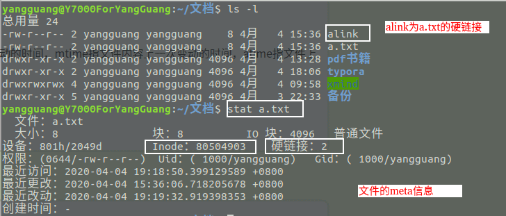
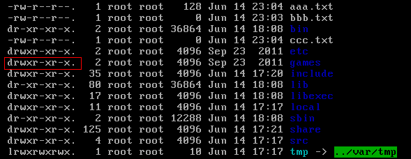
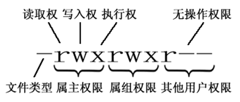
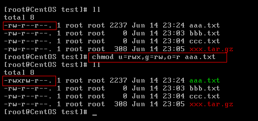

Giới thiệu ngắn gọn một số khái niệm và lệnh Linux thường gặp mà lập trình viên Java cần biết.

## Làm quen với Linux

### Giới thiệu Linux

Có thể khái quát Linux là gì qua ba điểm sau:

- **Hệ điều hành kiểu Unix**: Linux là một operating system tự do, mã nguồn mở và tương tự Unix.
- **Linux về bản chất là Linux kernel**: Nói chính xác, từ Linux chỉ biểu thị Linux kernel; bản thân Linux kernel không thể trở thành một operating system hoạt động bình thường. Vì vậy mới có nhiều Linux distribution.
- **Cha đẻ của Linux (Linus Benedict Torvalds)**: Một nhân vật huyền thoại trong lĩnh vực lập trình, một cao thủ thực thụ và hình mẫu đáng ngưỡng mộ. Ông là tác giả đầu tiên của **Linux kernel**, sau đó khởi xướng open-source project này và giữ vai trò kiến trúc sư chính của Linux kernel. Ông cũng khởi xướng Git, một open-source project, và là developer chủ chốt.


### Linux ra đời

Năm 1989, Linus Torvalds gia nhập lữ đoàn Nyland của Quân đội Phần Lan, thực hiện nghĩa vụ quân sự 11 tháng với quân hàm thiếu úy, chủ yếu phục vụ tại bộ phận máy tính và làm nhiệm vụ tính toán đạn đạo. Trong thời gian phục vụ, ông mua giáo trình do Andrew Stuart Tanenbaum viết cùng source code của Minix và bắt đầu nghiên cứu operating system. Năm 1990, sau khi xuất ngũ và trở lại trường đại học, ông bắt đầu tiếp xúc với Unix.

> **Minix** là một phiên bản mini của operating system tương tự Unix, do giáo sư Tanenbaum tạo ra để phục vụ giảng dạy và sử dụng thiết kế microkernel. Nó đã truyền cảm hứng cho việc tạo ra Linux kernel.

Năm 1991, Linus Torvalds công khai source code của Linux kernel. Linux lấy một chú chim cánh cụt đáng yêu làm biểu tượng, tượng trưng cho tinh thần dám nghĩ dám làm và yêu cuộc sống.


### Các Linux distribution thường gặp


Linus Torvalds chỉ công khai source code của Linux kernel. Như đã đề cập ở trên, kernel của operating system có vai trò quản lý riêng. Một số tổ chức hoặc nhà cung cấp đóng gói Linux kernel cùng nhiều software và tài liệu, đồng thời cung cấp giao diện cài đặt hệ thống và các công cụ cấu hình, thiết lập, quản lý hệ thống, từ đó tạo thành Linux distribution.

> Kernel chủ yếu chịu trách nhiệm quản lý memory, hardware device, file system và application của system.

Linux distribution có thể được chia đại khái thành hai loại:

- **Distribution do công ty thương mại duy trì**: Chẳng hạn Red Hat Enterprise Linux (RHEL) do Red Hat duy trì và hỗ trợ.
- **Distribution do tổ chức cộng đồng duy trì**: Chẳng hạn CentOS dựa trên Red Hat Enterprise Linux (RHEL), Ubuntu dựa trên Debian.

Đối với người mới học Linux, hiện không nên mặc định chọn CentOS. CentOS Linux 8 đã ngừng được duy trì vào cuối năm 2021, CentOS Linux 7 cũng đã kết thúc vòng đời vào tháng 6 năm 2024; CentOS Stream hiện nay là upstream continuous delivery branch của RHEL, có định vị khác với “phiên bản tái xây dựng tương thích với RHEL ổn định” trước đây.

Các lựa chọn an toàn hơn là:

- Muốn học môi trường enterprise server và hệ sinh thái RHEL: ưu tiên Rocky Linux hoặc AlmaLinux.
- Muốn nhanh chóng làm quen, có nhiều tài liệu, thường gặp trên cả desktop và server: chọn Ubuntu LTS.
- Muốn ổn định, nhẹ và gần với community distribution: chọn Debian.

Nếu môi trường công ty của bạn vẫn sử dụng CentOS, có thể học version tương ứng theo môi trường thực tế; nhưng khi cài mới môi trường học tập, nên chọn distribution vẫn còn được duy trì.

## Linux file system

### Giới thiệu Linux file system

Trong Linux operating system, mọi tài nguyên do operating system quản lý, chẳng hạn network interface card, disk drive, printer, thiết bị input/output, regular file hoặc directory, đều được xem là file. Đây là một khái niệm quan trọng trong Linux system: “mọi thứ đều là file”.

Khái niệm này bắt nguồn từ triết lý UNIX, tức quản lý và truy cập mọi resource bằng cách trừu tượng hóa chúng thành file. Linux file system cũng kế thừa ý tưởng thiết kế của UNIX file system. Thiết kế này giúp Linux system quản lý và thao tác các loại resource khác nhau thông qua một file interface thống nhất, cho phép thao tác file theo một cách thống nhất. Ví dụ, có thể xử lý network interface, disk drive, device file theo cách tương tự việc đọc và ghi file, khiến việc thao tác và quản lý các resource này thống nhất và đơn giản hơn.

Ý tưởng thiết kế lấy file làm trung tâm mang lại tính linh hoạt và khả năng mở rộng cho Linux system, giúp Linux trở thành một operating system mạnh mẽ. Đồng thời, đây cũng là một đặc điểm lớn của Linux system, được đông đảo user và developer yêu thích và đánh giá cao.

### Giới thiệu inode

inode là nền tảng của Linux/Unix file system. Vậy inode thực sự là gì và có tác dụng gì?

Có thể khái quát inode là gì qua năm điểm sau:

1. Hard disk sử dụng sector (Sector) làm physical storage unit nhỏ nhất, còn operating system và file system thường sử dụng block (Block) làm đơn vị đọc ghi; một block gồm nhiều sector. Sector của disk truyền thống thường có kích thước 512 byte, disk hiện đại cũng thường có physical sector 4 KB (chẳng hạn thiết bị 512e/4Kn); block size của file system cũng thường là 4 KB, nhưng hai khái niệm này không giống nhau. File metadata (chẳng hạn permission, size, modification time và mapping của data block hoặc extent) thường được ghi trong inode (index node). inode number chỉ được đảm bảo duy nhất trong cùng một file system, nhiều hard-link directory entry có thể trỏ tới cùng một inode. Solid-state disk (SSD) dù không có physical sector theo nghĩa của mechanical disk truyền thống, vẫn cung cấp logical block interface ra bên ngoài.
2. Trong các file system như ext2/ext3/ext4, kích thước bản ghi inode trên disk được xác định khi tạo file system; layout metadata của các Linux file system khác có thể khác nhau.
3. Tốc độ truy cập inode rất nhanh vì system có thể định vị trực tiếp metadata của file thông qua inode number mà không cần duyệt toàn bộ file system.
4. Các file system như ext2/ext3/ext4 xác định số lượng inode có thể sử dụng khi tạo file system. Khi dùng hết inode, dù vẫn còn disk space cho data block cũng không thể tạo file mới. Không phải Linux file system nào cũng sử dụng bảng inode cố định; khi kiểm tra cần kết hợp với implementation cụ thể của file system.
5. Có thể dùng lệnh `stat` để xem thông tin inode của file, bao gồm inode number, file type, permission, owner, file size và modification time.

Nói đơn giản: inode dùng để lưu thông tin file được chia thành bao nhiêu block, địa chỉ của từng block, owner, creation time, permission, size và các thông tin khác.

Tóm tắt lại inode và block:

- **inode**: Ghi lại thông tin thuộc tính của file, có thể dùng lệnh `stat` để xem thông tin inode.
- **block/extent**: Dùng để lưu file content hoặc mô tả phạm vi data block liên tục. Cách allocation và sharing cụ thể tùy thuộc vào file system, không thể khái quát rằng “một block luôn chỉ thuộc về một file”.



Linux/Unix file system sử dụng inode để định danh file system object. Khi rename file trong cùng một file system, thông thường chỉ directory entry bị thay đổi, inode number không đổi; sau khi xóa hard-link cuối cùng, nếu cũng không còn process nào tiếp tục mở file, inode sẽ được giải phóng và số của nó có thể được sử dụng lại sau này. Khi truy cập file qua path, vẫn phải phân giải directory entry trước, không thể bỏ qua việc tra cứu path và dùng inode number như một file identifier toàn cục ổn định.

Tuy nhiên, việc sử dụng inode number cũng khiến file system trở nên trừu tượng và phức tạp hơn ở tầng user và application, cần thông qua system command hoặc file system interface để truy cập và quản lý thông tin inode của file.

### Hard link và soft link

Trên Linux/Unix-like system, hard link và symbolic link có implementation khác nhau: hard link là một directory entry khác trỏ tới cùng inode, còn symbolic link là một special file có inode riêng.

**1. Hard Link**

- Trong Linux/Unix-like file system, mỗi file và directory có một inode number duy nhất để định danh file hoặc directory đó. Hard link thiết lập liên kết thông qua inode number, hard link và source file có cùng inode number, hoàn toàn bình đẳng với nhau theo góc nhìn của file system (có thể xem chúng là hard link của nhau, cùng bắt nguồn từ một file), xóa bất kỳ một mục nào cũng không ảnh hưởng đến mục còn lại. Có thể tạo hard link cho file để tránh việc file quan trọng bị xóa nhầm.
- Chỉ khi source file và mọi hard-link file tương ứng đều bị xóa thì file mới thực sự bị xóa.
- Hard link có một số hạn chế: không thể tạo hard link cho directory hoặc file không tồn tại, đồng thời hard link không thể đi qua ranh giới file system.
- Lệnh `ln` dùng để tạo hard link.

**2. Soft Link (Symbolic Link hoặc Symlink)**

- Soft link có inode number khác source file và trỏ tới một file path.
- Sau khi source file bị xóa, soft link vẫn tồn tại nhưng trỏ tới một file path không hợp lệ.
- Soft link tương tự shortcut trong Windows.
- Khác với hard link, có thể tạo soft link cho directory hoặc file không tồn tại, đồng thời soft link có thể đi qua ranh giới file system.
- Lệnh `ln -s` dùng để tạo soft link.

**Tại sao hard link không thể vượt qua file system?**

Như đã đề cập, hard link thiết lập liên kết thông qua inode number; hard link và source file dùng chung inode number.

Mỗi file system có một inode namespace riêng, directory entry chỉ có thể tham chiếu tới inode trong file system hiện tại, không thể trực tiếp trỏ tới inode thuộc file system khác. Vì vậy, hard link không thể đi qua ranh giới file system; nguyên nhân không đơn giản là do inode number bị trùng.

### Các file type trong Linux

Linux hỗ trợ nhiều file type, trong đó các file type quan trọng gồm: **regular file**, **directory file**, **link file**, **device file**, **pipe file**, **Socket file** và các loại khác.

- **Regular file (-)**: Dùng để lưu thông tin và dữ liệu, Linux user có thể xem, thay đổi và xóa regular file theo permission. Ví dụ: image, sound, PDF, text, video, source code và nhiều loại khác.
- **Directory file (d, directory file)**: Directory cũng là một loại file, dùng để biểu thị và quản lý file trong system; directory file chứa các file name và subdirectory name. Mở directory thực chất là mở directory file.
- **Symbolic link file (l, symbolic link)**: Lưu chuỗi target path. Khi truy cập symbolic link, kernel sẽ phân giải lại target theo path này.
- **Character device (c, char)**: Dùng để truy cập character device, chẳng hạn keyboard.
- **Device file (b, block)**: Dùng để truy cập block device, chẳng hạn hard disk, floppy disk.
- **Pipe file (p, pipe)**: Một loại special file dùng cho communication giữa các process.
- **Socket file (s, socket)**: Dùng cho network communication giữa các process, cũng có thể dùng cho communication giữa các process trên cùng máy mà không qua network.

Mỗi file type có mục đích và attribute khác nhau, có thể dùng các command như `ls`, `file` để xem thông tin về file type.

```bash
# Regular file (-)
-rw-r--r--  1 user  group  1024 Apr 14 10:00 file.txt

# Directory file (d, directory file)
drwxr-xr-x  2 user  group  4096 Apr 14 10:00 directory/

# Socket file (s, socket)
srwxrwxrwx  1 user  group    0 Apr 14 10:00 socket
```

### Directory tree của Linux

Linux sử dụng cấu trúc phân cấp gọi là directory tree để tổ chức file và directory. Directory tree bắt đầu tại root directory (/), mở rộng xuống dưới và tạo thành một loạt directory và subdirectory. Mỗi directory có thể chứa file và các subdirectory khác. Cấu trúc phân cấp rõ ràng, giống như một cái cây lộn ngược.


**Mô tả các directory thường gặp:**

- **/bin:** Chứa binary executable file (ls, cat, mkdir và các file khác), các command thường dùng nằm ở đây.
- **/etc:** Chứa system management và configuration file.
- **/home:** Chứa file của mọi user, là điểm bắt đầu của user home directory. Ví dụ, home directory của user `user` là `/home/user`, có thể biểu thị bằng `~user`.
- **/usr:** Dùng để lưu system application.
- **/opt:** Vị trí chứa các optional application package được cài đặt thêm. Thông thường có thể cài tomcat và các phần mềm tương tự vào đây.
- **/proc:** Directory của virtual file system, là mapping của system memory. Có thể truy cập trực tiếp directory này để lấy system information.
- **/root:** Home directory của superuser (system administrator) (tầng đặc quyền^o^).
- **/sbin:** Chứa binary executable file, chỉ root mới có thể truy cập. Đây là nơi lưu system-level management command và program dành cho system administrator, chẳng hạn ifconfig.
- **/dev:** Dùng để lưu device file.
- **/mnt:** Mount point để system administrator tạm thời mount file system khác.
- **/boot:** Chứa các file dùng trong quá trình system boot.
- **/lib và /lib64:** Chứa library file liên quan đến hoạt động của system.
- **/tmp:** Dùng để lưu nhiều temporary file, là điểm lưu trữ temporary file dùng chung.
- **/var:** Dùng để lưu file có data cần thay đổi trong runtime, cũng là vùng tràn của một số file lớn, chẳng hạn log file của các service (system startup log và các log khác).
- **/lost+found:** Directory này thường rỗng; các file “không có nơi để về” còn lại sau khi system shutdown bất thường (trong Windows gọi là `.chk`) nằm ở đây.

## Các lệnh Linux thường dùng

Dưới đây chỉ liệt kê một số command thường dùng.

Có thể dùng website tra nhanh Linux command rất hữu ích này. Nếu quên hoặc không hiểu một số command, bạn có thể tìm lời giải tại đây: Sổ tay tra nhanh Linux command online: <https://wangchujiang.com/linux-command/>.


Ngoài ra, website [shell.how](https://www.shell.how/) có thể giải thích ý nghĩa của các command thường gặp, hỗ trợ bạn học Linux basic command và các command khác (chẳng hạn Git, NPM).


### Chuyển directory

- `cd usr`: Chuyển tới directory `usr` trong directory hiện tại.
- `cd .. (hoặc cd../)`: Chuyển tới directory cha.
- `cd /`: Chuyển tới root directory của system.
- `cd ~`: Chuyển tới user home directory.
- **`cd -`:** Chuyển tới directory của lệnh trước đó.

### Thao tác directory

- `ls`: Hiển thị danh sách file và subdirectory trong directory. Ví dụ: `ls /home` hiển thị danh sách file và subdirectory trong directory `/home`.
- `ll`: `ll` là alias của `ls -l`; command `ll` có thể xem thông tin chi tiết của mọi directory và file trong directory đó.
- `mkdir [option] directory-name`: Tạo directory mới (thêm). Ví dụ: `mkdir -m 755 my_directory` tạo directory mới tên `my_directory` và đặt permission là 755; owner có permission đọc, ghi, execute, còn group và user khác chỉ có permission đọc, execute, không thể sửa nội dung directory (chẳng hạn tạo hoặc xóa file). Nếu muốn mọi user (bao gồm group và user khác) có permission đọc, ghi, execute đối với directory, cần đặt permission là `777`, tức `mkdir -m 777 my_directory`.
- `find [path] [expression]`: Tìm file hoặc directory trong directory được chỉ định và các subdirectory của nó (tra cứu), rất mạnh và linh hoạt. Ví dụ: ① Liệt kê toàn bộ file và folder trong directory hiện tại và subdirectory: `find .`; ② Tìm file name kết thúc bằng `.txt` trong directory `/home`: `find /home -name "*.txt"`, không phân biệt hoa thường: `find /home -iname "*.txt"`; ③ Tìm mọi file kết thúc bằng `.txt` và `.pdf` trong directory hiện tại và subdirectory: `find . \( -name "*.txt" -o -name "*.pdf" \)` hoặc `find . -name "*.txt" -o -name "*.pdf"`.
- `pwd`: Hiển thị path của current working directory.
- `rmdir [option] directory-name`: Xóa directory rỗng (xóa). Ví dụ: `rmdir -p my_directory` xóa directory rỗng tên `my_directory`, đồng thời đệ quy xóa directory cha rỗng của `my_directory` cho đến khi gặp directory không rỗng hoặc root directory.
- `rm [option] file-or-directory-name`: Xóa file/directory (xóa). Ví dụ: `rm -r my_directory` xóa directory tên `my_directory`; `-r` (recursive, đệ quy) nghĩa là đệ quy xóa directory được chỉ định cùng toàn bộ subdirectory và file của nó.
- `cp [option] source-file/directory target-file/directory`: Sao chép file hoặc directory. Ví dụ: `cp file.txt /home/file.txt` sao chép file `file.txt` tới directory `/home` và đổi tên thành `file.txt`. `cp -r source destination` sao chép directory `source` cùng toàn bộ subdirectory và file bên trong tới directory `destination`, đồng thời giữ nguyên attribute của source file và cấu trúc directory.
- `mv [option] source-file/directory target-file/directory`: Di chuyển file hoặc directory, cũng có thể dùng để rename file hoặc directory. Ví dụ: `mv file.txt /home/file.txt` di chuyển file `file.txt` tới directory `/home` và đổi tên thành `file.txt`. Kết quả của `mv` khác `cp`: `mv` giống như file được “chuyển nhà”, số lượng file không tăng, còn `cp` sao chép file nên số lượng file tăng.

### Thao tác file

Các command như `mv`, `cp`, `rm` đều áp dụng cho file và directory, nên ở đây không liệt kê lại.

- `touch [option] file-name..`: Tạo file mới hoặc cập nhật file đã tồn tại (thêm). Ví dụ: `touch file1.txt file2.txt file3.txt` tạo 3 file.
- `ln [option] <source-file> <hard-link/soft-link-file>`: Tạo hard link/soft link. Ví dụ: `ln -s file.txt file_link` tạo soft link tên `file_link`, trỏ tới file `file.txt`. Option `-s` biểu thị tạo soft link, s là viết tắt của symbolic (soft link còn gọi là symbolic link).
- `cat/more/less/tail file-name`: Xem file (tra cứu). Command `tail -f file` có thể theo dõi thay đổi của một file theo thời gian thực, chẳng hạn log file của Tomcat thay đổi theo quá trình chạy của program; có thể dùng `tail -f catalina-2016-11-11.log` để theo dõi thay đổi của file.
- `vim file-name`: Sửa nội dung file (sửa). Vim editor là một component mạnh trong Linux và là phiên bản nâng cao của vi editor. Vim editor có rất nhiều command và shortcut, nhưng ở đây không trình bày từng cái; bạn cũng không cần nghiên cứu quá sâu, chỉ cần biết cách dùng vim ở mức cơ bản là được. Trong development thực tế, vim editor chủ yếu dùng để sửa configuration file. Các bước thường dùng là: `vim file------>vào file----->command mode------>nhấn i để vào edit mode----->edit file------->nhấn Esc để vào chế độ dòng lệnh----->nhập :wq/q!` (nhập wq nghĩa là ghi nội dung và thoát, tức save; nhập q! nghĩa là force exit không save).

### Nén file

**1) Đóng gói và nén file:**

Trong Linux, file được đóng gói thường có đuôi `.tar`, command nén thường tạo file có đuôi `.gz`. Thông thường việc đóng gói và nén được thực hiện cùng nhau, nên file sau khi đóng gói và nén thường có đuôi `.tar.gz`.

Command: `tar -zcvf archive-name files-to-archive`, trong đó:

- z: Gọi lệnh nén gzip để nén.
- c: Đóng gói file.
- v: Hiển thị quá trình thực hiện.
- f: Chỉ định tên file.

Ví dụ, giả sử directory `test` có ba file lần lượt là: `aaa.txt`, `bbb.txt`, `ccc.txt`. Nếu muốn đóng gói directory `test` và đặt tên archive sau khi nén là `test.tar.gz`, có thể dùng command `tar -zcvf test.tar.gz aaa.txt bbb.txt ccc.txt` hoặc `tar -zcvf test.tar.gz /test/`.

**2) Giải nén archive:**

Command: `tar [-xvf] compressed-file`

Trong đó x biểu thị giải nén.

Ví dụ:

- Để giải nén `test.tar.gz` trong `/test` vào directory hiện tại, có thể dùng command `tar -xvf test.tar.gz`.
- Để giải nén `test.tar.gz` trong `/test` vào root directory `/usr`: `tar -xvf test.tar.gz -C /usr` (`-C` biểu thị chỉ định vị trí giải nén).

### Truyền file

- `scp [option] source-file remote-file` (scp là secure copy, copy an toàn): Dùng SSH protocol để truyền file an toàn, có thể upload từ local tới remote host và download từ remote host về local. Ví dụ: `scp -r my_directory user@remote:/home/user` upload local directory `my_directory` vào directory `/home/user` trên remote server. `scp -r user@remote:/home/user/my_directory` download directory `my_directory` trong directory `/home/user` trên remote server về local. Lưu ý, command `scp` cần thiết lập SSH connection giữa local và remote system để truyền file, vì vậy phải bảo đảm remote server đã cấu hình SSH service, đồng thời có permission và authentication method chính xác.
- `rsync [option] source-file remote-file`: Có thể copy file hiệu quả giữa local và remote system, đồng thời xử lý incremental copy một cách thông minh, tiết kiệm bandwidth và time. Ví dụ: `rsync -r my_directory user@remote:/home/user` upload local directory `my_directory` vào directory `/home/user` trên remote server.
- `ftp` (File Transfer Protocol): Cung cấp cách đơn giản để connect tới remote FTP server và thực hiện các thao tác upload, download, delete file. Trước khi sử dụng cần connect và login vào remote FTP server. Sau khi vào FTP command-line interface, có thể dùng command `put` để upload local file tới remote host, dùng `get` để download file từ remote host về local, dùng `delete` để xóa file trên remote host. Phần này không trình diễn.

### File permission

Mỗi file trong operating system đều có permission, user sở hữu và group sở hữu riêng. Permission là cơ chế operating system dùng để hạn chế resource access. Trong Linux, permission thường gồm read (readable), write (writable) và execute (executable), được chia thành ba nhóm, lần lượt tương ứng với file owner (owner), file group (group) và other user (other), từ đó hạn chế user hoặc group nào được thực hiện thao tác nào trên file cụ thể.

Có thể dùng command **`ls -l`** để xem permission của file hoặc directory trong một directory.

Ví dụ: chạy `ls -l` trong một directory bất kỳ.



Giải thích thông tin ở cột đầu tiên như sau:



> Tiếp theo sẽ giải thích chi tiết file type, permission trong Linux, file owner, group sở hữu và other group là gì.

**File type:**

- d: Biểu thị directory.
- -: Biểu thị file.
- l: Biểu thị soft link (có thể xem là shortcut trong Windows).

**Permission trong Linux gồm các loại sau:**

- r: Permission read, r cũng có thể biểu thị bằng số 4.
- w: Permission write, w cũng có thể biểu thị bằng số 2.
- x: Permission execute, x cũng có thể biểu thị bằng số 1.

**Sự khác nhau giữa permission của file và directory:**

Đối với file và directory, read, write, execute có ý nghĩa khác nhau.

Đối với file:

| Tên permission |              Thao tác có thể thực hiện |
| :------------- | -------------------------------------: |
| r              |   Có thể dùng cat để xem nội dung file |
| w              |               Có thể sửa nội dung file |
| x              | Có thể chạy file dưới dạng binary file |

Đối với directory:

| Tên permission |              Thao tác có thể thực hiện |
| :------------- | -------------------------------------: |
| r              |   Có thể xem danh sách trong directory |
| w              | Có thể tạo và xóa file trong directory |
| x              |        Có thể dùng cd để vào directory |

root truyền thống thường có các capability cần thiết để bypass kiểm tra discretionary access control (DAC) của regular file, nhưng điều đó không có nghĩa root có thể bypass mọi hạn chế như capabilities, LSM, mount option và immutable flag. Object có permission `000` cũng không thể đơn giản khái quát rằng root chắc chắn có thể execute hoặc access.

**Mỗi user trong Linux phải thuộc một group, không thể tồn tại độc lập bên ngoài group. Mỗi file trong Linux có khái niệm owner, group sở hữu và other group.**

- **Owner (u)**: Thông thường là người tạo file. Ai tạo file thì mặc nhiên trở thành owner của file đó. Dùng command `ls ‐ahl` có thể xem owner của file, cũng có thể dùng `chown user-name file-name` để thay đổi owner.
- **Group sở hữu file (g)**: Khi user tạo file, group sở hữu file là group mà user đó thuộc về. Dùng command `ls ‐ahl` có thể xem group của file, cũng có thể dùng `chgrp group-name file-name` để thay đổi group sở hữu.
- **Other group (o)**: Ngoài user là owner và user thuộc group sở hữu file, các user khác trong system đều thuộc other group của file.

> Tiếp theo hãy xem cách thay đổi permission của file/directory.

**Command thay đổi permission của file/directory: `chmod`**

Ví dụ: thay đổi permission của `aaa.txt` trong `/test` để file owner có toàn bộ permission, group của file owner có permission read/write, user khác chỉ có permission read.

**`chmod u=rwx,g=rw,o=r aaa.txt`** hoặc **`chmod 764 aaa.txt`**



**Bổ sung một nội dung khá thường dùng:**

Giả sử đã cài zookeeper, muốn service tự động start mỗi lần boot thì phải làm thế nào?

Phần lớn Linux distribution phổ biến hiện nay sử dụng systemd để quản lý service. Cách khuyến nghị là viết một unit file `zookeeper.service`, sau đó dùng các command dưới đây để thiết lập auto-start khi boot:

```bash
sudo systemctl enable zookeeper
sudo systemctl start zookeeper
sudo systemctl status zookeeper
```

Nếu sửa service file, trước tiên cần chạy `sudo systemctl daemon-reload` để systemd reload configuration. `chkconfig --add zookeeper`, `chkconfig --list` là cách làm của thời kỳ SysV init, chỉ dùng trong distribution cũ hoặc môi trường tương thích.

### Quản lý user

Linux system là một time-sharing operating system hỗ trợ nhiều user và nhiều task. Bất kỳ user nào muốn sử dụng system resource đều phải xin account từ system administrator trước, sau đó đăng nhập vào system với identity của account này.

Một mặt, user account giúp system administrator theo dõi user sử dụng system và kiểm soát quyền truy cập system resource của họ; mặt khác, account giúp user tổ chức file và bảo đảm an toàn cho user.

**Command liên quan đến Linux user management:**

- `useradd [option] user-name`: Tạo user account. Account được tạo bằng command `useradd` thực tế được lưu trong text file `/etc/passwd`.
- `userdel [option] user-name`: Xóa user account.
- `usermod [option] user-name`: Sửa attribute và configuration của user account, chẳng hạn user name, user ID và home directory.
- `passwd [option] user-name`: Thiết lập authentication information của user, bao gồm password, password expiration time và các thông tin khác. Ví dụ: `passwd -S user-name` hiển thị password status của account; `passwd -d user-name` xóa password khiến password field rỗng, việc có cho phép login bằng password rỗng hay không phụ thuộc vào PAM và configuration của login service; `passwd -l user-name` chỉ lock password authentication, các authentication method khác như SSH key vẫn có thể sử dụng; `passwd user-name` dùng để đổi password.
- `su [option] user-name` (su là Switch User, chuyển user): Chuyển identity giữa user đang login và user khác.

### Quản lý user group

Mỗi user có một user group, system có thể quản lý tập trung toàn bộ user trong một user group. Quy định về user group khác nhau giữa các Linux system. Ví dụ, trong Linux, user thuộc user group cùng tên với user; user group này được tạo đồng thời khi tạo user.

User group management gồm thêm, xóa và sửa user group. Việc thêm, xóa và sửa group thực tế là cập nhật file `/etc/group`.

**Command liên quan đến Linux system user group management:**

- `groupadd [option] user-group`: Thêm user group mới.
- `groupdel user-group`: Xóa user group đã tồn tại.
- `groupmod [option] user-group`: Sửa attribute của user group.

### Trạng thái system

- `top [option]`: Dùng để xem realtime CPU usage, memory usage, process information và các thông tin khác của system.
- `htop [option]`: Tương tự `top` nhưng cung cấp interface interactive và thân thiện hơn, cho phép user thao tác, hỗ trợ color theme, cuộn ngang hoặc dọc để xem process list và hỗ trợ mouse.
- `uptime [option]`: Dùng để xem system đã chạy tổng cộng bao lâu, average load của system và các thông tin khác.
- `vmstat [interval] [repeat-count]`: vmstat (Virtual Memory Statistics) có nghĩa là thống kê virtual memory status, nhưng cũng có thể báo cáo overall system status về process, memory, I/O và các thành phần khác.
- `free [option]`: Dùng để xem memory usage của system, bao gồm used memory, available memory, buffer, cache và các thông tin khác.
- `df [option] [file-system]`: Dùng để xem disk space usage của system, bao gồm tổng disk space, used space, available space và các thông tin khác; có thể chỉ định file system. Ví dụ: `df -a` xem toàn bộ file system.
- `du [option] [file]`: Dùng để xem disk space usage của directory hoặc file được chỉ định, có thể dùng các option khác nhau để kiểm soát format và unit của output.
- `sar [option] [time-interval] [repeat-count]`: Dùng để thu thập, báo cáo và phân tích performance statistics của system, bao gồm CPU usage, memory usage, disk I/O, network activity và các thông tin chi tiết khác. Điểm đặc biệt là có thể sample system liên tục để thu được lượng lớn sample data. Sample data và kết quả phân tích có thể lưu vào file; khi sử dụng, system chỉ tiêu tốn rất ít resource.
- `ps [option]`: Dùng để xem process information trong system, bao gồm process ID, status, resource usage và các thông tin khác. `ps -ef`/`ps -aux`: Hai command này đều xem các process đang chạy trong system hiện tại, khác nhau ở format hiển thị. Nếu muốn xem process cụ thể, có thể dùng format như `ps aux|grep redis` (xem process chứa chuỗi redis), hoặc dùng `pgrep redis -a`.
- `systemctl [command] [service-name]`: Dùng để quản lý service và unit của system, có thể xem status, start, stop, restart system service và các thao tác khác.
- `journalctl [option]`: Dùng để xem systemd log, rất thường dùng khi kiểm tra service start thất bại hoặc system error. Ví dụ: `journalctl -u nginx -f` xem realtime service log của nginx, `journalctl -xe` xem context của system error gần đây.

### Network communication

- `ping [option] target-host`: Kiểm tra network connection với target host.
- `ifconfig` hoặc `ip`: Dùng để xem network interface information của system, bao gồm IP address, MAC address, status của network interface và các thông tin khác.
- `netstat [option]`: Dùng để xem network connection status và network statistics, có thể xem current network connection, listening port, network protocol và các thông tin khác.
- `ss [option]`: Tiện dụng hơn `netstat`, cung cấp network connection information nhanh và chi tiết hơn.
- `nload`: `sar` và `nload` đều có thể monitor network traffic, nhưng output của `sar` là data dạng text nên không trực quan. `nload` là tool chuyên dùng để realtime monitor network traffic, cung cấp terminal interface dạng graphical, trực quan hơn. Tuy nhiên, `nload` không lưu historical data nên không phù hợp để phân tích trend dài hạn. Ngoài ra, system không cài sẵn tool này, cần cài thủ công.
- `sudo hostnamectl set-hostname new-hostname`: Thay đổi host name và vẫn có hiệu lực sau khi restart. `sudo hostname new-hostname` cũng có thể đổi host name. Tuy nhiên, cần lưu ý dùng command `hostname` để đổi host name chỉ có hiệu lực tạm thời; sau khi system restart, host name sẽ trở lại giá trị ban đầu.

### Khác

- `sudo + other command`: Thực thi command với quyền của system administrator, nghĩa là command thực thi qua sudo giống như do root trực tiếp thực thi.
- `grep [option] "search-content" file-path`: Một text search command mạnh và thường dùng. Nó có thể đối sánh theo string hoặc regular expression được chỉ định trong file hoặc command output, phù hợp với nhiều scenario như log analysis, text filtering và quick locating. Ví dụ: không phân biệt hoa thường, tìm các dòng chứa error trong syslog: `grep -i "error" /var/log/syslog`; tìm mọi process liên quan đến java: `ps -ef | grep "java"`.
- `kill -9 process-pid`: Kết thúc process (`-9` biểu thị force terminate), trước tiên dùng ps để tìm process, sau đó dùng kill để kết thúc process.
- `shutdown`: `shutdown -h now`: Chỉ định shutdown ngay lập tức; `shutdown +5 "System will shutdown after 5 minutes"`: Chỉ định shutdown sau 5 phút, đồng thời gửi warning tới user đang login.
- `reboot`: `reboot`: Restart system. `reboot -w`: Mô phỏng reboot (chỉ ghi log chứ không thực sự reboot).

## Linux environment variable

Trong Linux system, environment variable dùng để định nghĩa một số parameter của runtime environment, chẳng hạn home directory khác nhau của mỗi user (HOME).

### Phân loại environment variable

Theo scope, environment variable có thể chia đơn giản thành:

- User-level environment variable: `~/.bashrc`, `~/.bash_profile`.
- System-level environment variable: `/etc/bashrc`, `/etc/environment`, `/etc/profile`, `/etc/profile.d`.

Load order của environment variable configuration file không cố định theo một tuyến duy nhất, mà phụ thuộc shell hiện tại là login shell, non-login interactive shell hay non-interactive shell. Lấy Bash làm ví dụ, login shell thường đọc `/etc/profile`, sau đó đọc file đầu tiên tồn tại và có thể đọc được trong `~/.bash_profile`, `~/.bash_login` hoặc `~/.profile` của user; interactive non-login shell thường đọc `~/.bashrc`. Nhiều distribution sẽ load `~/.bashrc` thủ công trong `~/.bash_profile`, vì vậy load chain thực tế còn chịu ảnh hưởng của default configuration của distribution.

Nếu muốn sửa system-level environment variable file, administrator cần có write permission đối với file đó.

Nên cấu hình user-level environment variable trong `~/.bash_profile`, system-level environment variable trong `/etc/profile.d`.

Theo lifecycle, environment variable có thể chia đơn giản thành:

- Permanent: User cần sửa configuration file liên quan, variable có hiệu lực lâu dài.
- Temporary: User dùng command `export` để declare environment variable trong terminal hiện tại, variable mất hiệu lực khi đóng shell terminal.

### Đọc environment variable

Có thể dùng command `export` để output toàn bộ environment variable hiện được định nghĩa trong system.

```bash
# Liệt kê value hiện tại của environment variable
export -p
```

Ngoài command `export`, command `env` cũng có thể liệt kê toàn bộ environment variable.

Command `echo` có thể output value của environment variable được chỉ định.

```bash
# Output value hiện tại của environment variable PATH
echo $PATH
# Output value hiện tại của environment variable HOME
echo $HOME
```

### Sửa environment variable

Có thể dùng command `export` để sửa environment variable được chỉ định. Tuy nhiên, cách sửa environment variable này chỉ có hiệu lực với shell terminal hiện tại và mất hiệu lực khi đóng shell terminal. Thay đổi có hiệu lực ngay sau khi thực hiện.

```bash
export JAVA_HOME="/path/to/jdk"
export PATH="$JAVA_HOME/bin:$PATH"
```

Có thể dùng command `vim` để sửa environment variable configuration file. Cách này khiến thay đổi environment variable có hiệu lực lâu dài.

```bash
vim ~/.bash_profile
```

Nếu sửa system-level environment variable thì thay đổi có hiệu lực với mọi user; nếu sửa user-level environment variable thì chỉ có hiệu lực với user hiện tại.

Sau khi sửa, cần dùng command `source` để áp dụng thay đổi hoặc đóng shell terminal rồi login lại.

```bash
source ~/.bash_profile
```

<!-- @include: @article-footer.snippet.md -->
