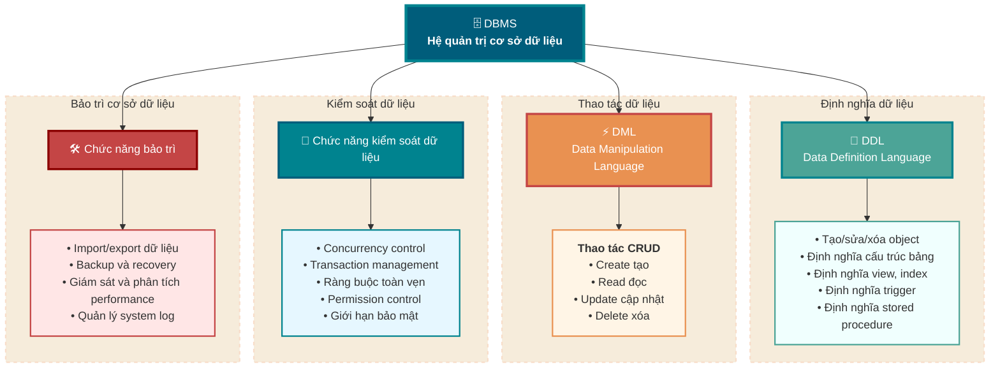
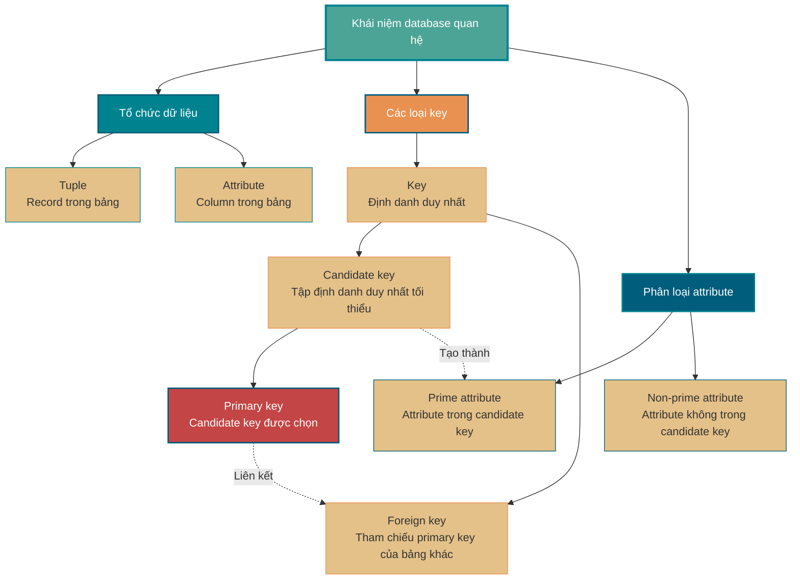
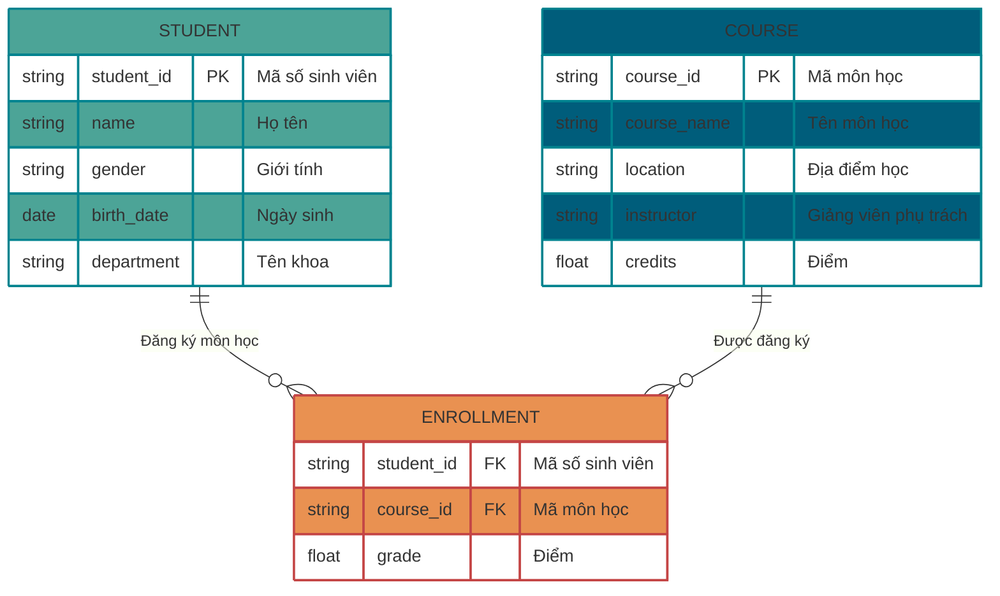
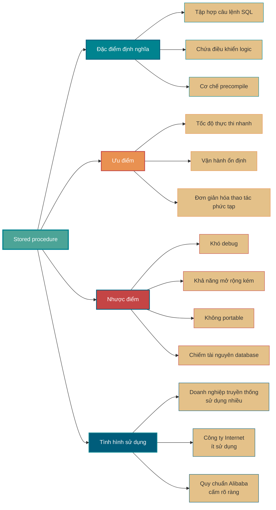
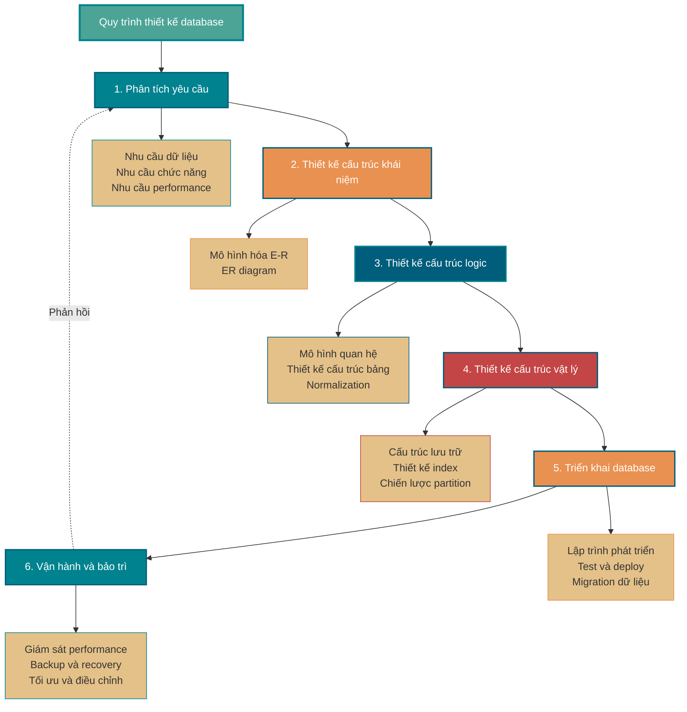

<!-- @include: @small-advertisement.snippet.md -->

Đây là phần kiến thức nền tảng về database, bạn nhất định phải hiểu và ghi nhớ. Tuy chỉ là kiến thức lý thuyết nhưng phần này rất quan trọng, là nền tảng cho việc học database MySQL sau này. PS: Vì phần này liên quan đến quá nhiều nội dung mang tính khái niệm nên đã tham khảo các phần giới thiệu tương ứng trên Wikipedia và Baidu Baike.

## Database, DBMS, Database System và DBA là gì?

Bốn khái niệm này mô tả các cấp độ khác nhau, từ dữ liệu đến việc quản lý toàn bộ hệ thống. Ta thường dùng ví dụ thư viện để liên kết và hiểu chúng.

- **Database (Database - DB):** Giống như toàn bộ sách và tài liệu được lưu trên các kệ trong thư viện. Về mặt kỹ thuật, database là tập hợp dữ liệu có cấu trúc được tổ chức, mô tả và lưu trữ theo một mô hình dữ liệu nhất định, có thể được nhiều người dùng chia sẻ. Đây là thông tin cốt lõi mà chúng ta truy cập và lưu trữ.
- **Database Management System (Database Management System - DBMS):** Giống như hệ thống quản lý của toàn bộ thư viện, bao gồm quy tắc phân loại và biên mục sách, quy trình mượn trả, hệ thống kiểm tra an toàn, v.v. Về mặt kỹ thuật, DBMS là một phần mềm lớn, chẳng hạn MySQL, Oracle và PostgreSQL mà ta thường dùng. Nhiệm vụ cốt lõi của nó là tổ chức, lưu trữ dữ liệu một cách khoa học, truy xuất và bảo trì dữ liệu hiệu quả; che giấu sự phức tạp của thao tác file ở tầng dưới, cung cấp một bộ interface tiêu chuẩn (như SQL) để thao tác dữ liệu, đồng thời xử lý các vấn đề phức tạp như concurrency control, transaction management và permission control.
- **Database System (Database System - DBS):** Là toàn bộ thư viện đang vận hành bình thường. Đây là khái niệm lớn hơn, không chỉ bao gồm sách (DB) và hệ thống quản lý (DBMS), mà còn bao gồm phần cứng, ứng dụng và người sử dụng.
- **Database Administrator (Database Administrator - DBA):** Giống như người quản lý thư viện, chịu trách nhiệm để toàn bộ database system vận hành bình thường. Phạm vi công việc rất rộng, gồm thiết kế, cài đặt, giám sát, performance tuning, backup và recovery, quản lý bảo mật, v.v., nhằm bảo đảm hệ thống ổn định, hiệu quả và an toàn.

DB và DBMS thường bị nhầm lẫn, nên nhắc lại ngắn gọn: **Thông thường khi nói "dùng database MySQL", thực tế là dùng MySQL (DBMS) để quản lý một hoặc nhiều database (DB).**

## DBMS có những chức năng chính nào?

DBMS thường cung cấp bốn chức năng cốt lõi:

1. **Định nghĩa dữ liệu:** Đây là nền tảng của DBMS. Nó cung cấp một ngôn ngữ định nghĩa dữ liệu (Data Definition Language - DDL), cho phép tạo, sửa và xóa các object khác nhau trong database. Việc này không chỉ bao gồm định nghĩa cấu trúc bảng (như tên field, kiểu dữ liệu), mà còn gồm định nghĩa view, index, trigger, stored procedure, v.v.
2. **Thao tác dữ liệu:** Đây là chức năng được developer sử dụng nhiều nhất hằng ngày. Nó cung cấp một ngôn ngữ thao tác dữ liệu (Data Manipulation Language - DML), cốt lõi là các thao tác quen thuộc thêm, xóa, sửa, truy vấn (CRUD). Nhờ đó, ta có thể thao tác và truy xuất dữ liệu trong database một cách thuận tiện.
3. **Kiểm soát dữ liệu:** Đây là yếu tố then chốt để bảo đảm dữ liệu đúng, an toàn và đáng tin cậy. Chức năng này thường bao gồm concurrency control, transaction management, ràng buộc toàn vẹn, permission control, giới hạn bảo mật, v.v.
4. **Bảo trì database:** Các chức năng này nhằm bảo đảm hệ thống database vận hành ổn định lâu dài. Chúng bao gồm import và export dữ liệu, backup và recovery database, giám sát và phân tích performance, cũng như quản lý system log.

## Bạn biết những loại DBMS nào?

### Cơ sở dữ liệu quan hệ

Ngoài cơ sở dữ liệu quan hệ (RDBMS) được dùng phổ biến nhất như MySQL (lựa chọn hàng đầu trong nhóm mã nguồn mở), PostgreSQL (đầy đủ tính năng nhất), Oracle (cấp doanh nghiệp), chúng dựa trên cấu trúc bảng chặt chẽ và SQL, rất phù hợp với dữ liệu có cấu trúc và các trường hợp cần bảo đảm transaction, chẳng hạn giao dịch ngân hàng và hệ thống order.

Trong những năm gần đây, để đáp ứng nhu cầu về lượng dữ liệu khổng lồ, concurrency cao và cấu trúc dữ liệu đa dạng do ứng dụng Internet mang lại, nhiều database NoSQL và NewSQL đã xuất hiện.

### Database NoSQL

Đặc điểm chung của chúng là nhằm đạt performance và khả năng mở rộng theo chiều ngang tối đa, nên đã đánh đổi ở một số khía cạnh (thường là transaction).

**1. Database key-value, đại diện là Redis.**

- **Đặc điểm:** Mô hình dữ liệu cực kỳ đơn giản, chính là một Map khổng lồ, truy xuất Value thông qua Key. Thao tác trên memory nên performance cực cao.
- **Trường hợp sử dụng:** Rất phù hợp để làm cache, lưu trữ session, counter và các trường hợp yêu cầu performance đọc ghi cực cao.

**2. Database document, đại diện là MongoDB.**

- **Đặc điểm:** Lưu trữ các document bán cấu trúc (như JSON/BSON), cấu trúc linh hoạt, không cần định nghĩa trước cấu trúc bảng.
- **Trường hợp sử dụng:** Đặc biệt phù hợp với các nghiệp vụ có cấu trúc dữ liệu thay đổi và phát triển nhanh, như chân dung người dùng, hệ thống quản lý nội dung, lưu trữ log, v.v.

**3. Database dạng column, đại diện là HBase, Cassandra.**

- **Đặc điểm:** Dữ liệu được lưu theo column family thay vì theo row. Điều này giúp performance cực cao khi đọc một số ít column trên số lượng lớn row.
- **Trường hợp sử dụng:** Được thiết kế riêng cho việc lưu trữ và phân tích lượng dữ liệu khổng lồ, rất phù hợp với phân tích big data, lưu trữ dữ liệu giám sát, hệ thống recommendation và các trường hợp cần ghi throughput cao, scan theo range.

**4. Database graph, đại diện là Neo4j.**

- **Đặc điểm:** Mô hình dữ liệu gồm node (Nodes) và edge (Edges), chuyên dùng để lưu trữ và truy vấn các quan hệ phức tạp giữa các entity.
- **Trường hợp sử dụng:** Trong các trường hợp như mạng xã hội (quan hệ bạn bè), recommendation engine (quan hệ user-product), knowledge graph và phát hiện gian lận (quan hệ dòng tiền), performance vượt xa database quan hệ.

### Database NewSQL

Vì NoSQL không hỗ trợ transaction, nhiều hệ thống có yêu cầu rất cao về an toàn dữ liệu (như hệ thống tài chính, order và giao dịch) không phù hợp để sử dụng NoSQL. Tuy nhiên, các hệ thống này thường có nhu cầu lưu trữ lượng dữ liệu lớn.

Các hệ thống này thường chỉ có thể nâng cao năng lực lưu trữ bằng cách mua máy tính có performance mạnh hơn hoặc sử dụng middleware database. Cách thứ nhất có chi phí tài chính quá cao, cách thứ hai có chi phí phát triển quá cao.

Vì vậy, **NewSQL** ra đời!

Nói đơn giản, NewSQL là: **distributed storage + SQL + transaction**. NewSQL không chỉ có khả năng quản lý lưu trữ dữ liệu khổng lồ của NoSQL, mà còn giữ được các đặc tính như hỗ trợ ACID và SQL của database truyền thống. Vì vậy, NewSQL còn có thể được gọi là **database quan hệ phân tán**.

Một số mục tiêu trong thiết kế database NewSQL:

1. Mở rộng theo chiều ngang (Scale Out): Tăng năng lực tải của hệ thống bằng cách thêm máy. Tương tự là Scale Up (mở rộng theo chiều dọc), tức nâng cấp thiết bị phần cứng để tăng năng lực tải của hệ thống.
2. Tính nhất quán mạnh (Strict Consistency): Ở mọi thời điểm, dữ liệu trên tất cả các node đều giống nhau.
3. High Availability: Hệ thống gần như luôn có thể cung cấp dịch vụ.
4. Hỗ trợ SQL tiêu chuẩn (Structured Query Language): Các database quan hệ như PostgreSQL, MySQL và Oracle đều hỗ trợ SQL.
5. Transaction (ACID): atomicity (Atomicity), consistency (Consistency), isolation (Isolation) và durability (Durability).
6. Tương thích với database quan hệ phổ biến: Tương thích với các database quan hệ thường dùng như MySQL, Oracle và PostgreSQL.
7. Cloud Native: Có thể triển khai theo hướng công cụ hóa và tự động hóa trên public cloud, private cloud và hybrid cloud.
8. HTAP (Hybrid Transactional/Analytical Processing): Hỗ trợ xử lý kết hợp OLTP và OLAP.

Các database NewSQL tiêu biểu: F1/Spanner của Google, [OceanBase](https://open.oceanbase.com/) của Alibaba, [TiDB](https://pingcap.com/zh/product-community/) của PingCAP.

## Tuple, key, candidate key, primary key, foreign key, prime attribute và non-prime attribute là gì?

Trong lý thuyết database quan hệ, việc hiểu các khái niệm cốt lõi như tuple, key, candidate key, primary key, foreign key, prime attribute và non-prime attribute có ý nghĩa rất quan trọng đối với thiết kế database và normalization. Các khái niệm này tạo thành nền tảng lý thuyết của database quan hệ.

### Khái niệm cơ bản

- **Tuple:** Tuple là đơn vị cơ bản trong database quan hệ, tương ứng với một record trong bảng hai chiều. Mỗi tuple chứa đầy đủ thông tin của một entity. Ví dụ, toàn bộ thông tin của một sinh viên (mã số, họ tên, tuổi, v.v.) tạo thành một tuple trong bảng sinh viên.
- **Key:** Key là tập hợp một hoặc nhiều attribute có thể định danh duy nhất tuple trong relation. Vai trò chính của key là bảo đảm tính duy nhất và toàn vẹn của dữ liệu.

### Phân loại key

- **Candidate key (Candidate Key):** Candidate key là tập attribute tối thiểu có thể định danh duy nhất tuple; mọi tập con thực sự của nó đều không thể định danh duy nhất tuple. Một relation có thể có nhiều candidate key. Ví dụ, trong bảng sinh viên, nếu "mã số sinh viên" có thể định danh duy nhất sinh viên, đồng thời "số căn cước" cũng có thể định danh duy nhất sinh viên, thì {mã số sinh viên} và {số căn cước} đều là candidate key.
- **Primary key (Primary Key):** Primary key là một key được chọn từ các candidate key, dùng để định danh duy nhất tuple trong relation. Mỗi relation chỉ có một primary key nhưng có thể có nhiều candidate key. Khi chọn primary key, thường cân nhắc các yếu tố như tính đơn giản, tính ổn định và không mang ý nghĩa nghiệp vụ.
- **Foreign key (Foreign Key):** Foreign key là attribute hoặc nhóm attribute trong một relation, tương ứng với primary key của một relation khác. Foreign key dùng để thiết lập và duy trì liên kết giữa hai relation, là cơ chế quan trọng để thực hiện referential integrity. Ví dụ, nếu "mã số sinh viên" trong bảng đăng ký môn học tham chiếu đến primary key "mã số sinh viên" của bảng sinh viên, thì "mã số sinh viên" trong bảng đăng ký môn học là foreign key.

### Phân loại attribute

- **Prime attribute (Prime Attribute):** Prime attribute là attribute nằm trong bất kỳ candidate key nào. Nếu một relation có nhiều candidate key, tất cả attribute xuất hiện trong các candidate key đó đều là prime attribute. Ví dụ, trong relation công nhân (mã công nhân, số căn cước, họ tên, giới tính, phòng ban), nếu {mã công nhân} và {số căn cước} đều là candidate key, thì "mã công nhân" và "số căn cước" đều là prime attribute.
- **Non-prime attribute (Non-prime Attribute):** Non-prime attribute là attribute không nằm trong bất kỳ candidate key nào. Giá trị của các attribute này hoàn toàn phụ thuộc vào candidate key. Trong relation công nhân nói trên, "họ tên", "giới tính" và "phòng ban" đều là non-prime attribute.

## ER diagram là gì?

Khi thực hiện một project, bạn nhất định nên thử vẽ ER diagram để làm rõ thiết kế database. Đây cũng là nội dung người phỏng vấn thường hỏi khi trao đổi về project của bạn.

**ER diagram** là viết tắt của Entity Relationship Diagram (sơ đồ quan hệ thực thể), cung cấp phương pháp biểu diễn entity type, attribute và relationship.

ER diagram gồm 3 yếu tố sau:

- **Entity:** Thường là object nghiệp vụ trong thế giới thực, tất nhiên cũng có thể dùng object logic. Ví dụ, một hệ thống quản lý trường học sẽ có các entity như sinh viên, giáo viên, môn học, lớp, v.v. Trong ER diagram, entity được biểu diễn bằng hình chữ nhật.
- **Attribute:** Là attribute mà một entity sở hữu, dùng để mô tả các yếu tố cấu thành entity; trong thiết kế sản phẩm có thể hiểu là field. Trong ER diagram, attribute được biểu diễn bằng hình elip.
- **Relationship:** Là quan hệ giữa các entity, được biểu diễn bằng hình thoi trong ER diagram. Quan hệ này không chỉ thể hiện liên kết nghiệp vụ, mà còn có thể biểu thị bằng số lượng quan hệ giữa các entity. Ví dụ, một lớp có nhiều sinh viên là một relationship giữa các entity.

Hình dưới đây là ER diagram của việc đăng ký môn học. Mỗi sinh viên có thể đăng ký một số môn học, một môn học cũng có thể được nhiều người đăng ký, nên quan hệ giữa chúng là nhiều-nhiều (M: N). Ngoài ra, còn hai loại relationship khác giữa các entity là 1-1 (1:1) và 1-nhiều (1: N).

## Bạn biết về các normal form của database không?

Database có 3 normal form:

- 1NF (First Normal Form): Attribute không thể phân chia tiếp.
- 2NF (Second Normal Form): Trên nền tảng 1NF, loại bỏ partial functional dependency của non-prime attribute đối với key.
- 3NF (Third Normal Form): Trên nền tảng 2NF, loại bỏ transitive functional dependency của non-prime attribute đối với key.

### 1NF (First Normal Form)

Attribute (tương ứng với field trong bảng) không thể bị chia nhỏ hơn nữa, nghĩa là field này chỉ có thể có một giá trị và không thể chia thành nhiều field khác. **1NF là yêu cầu cơ bản nhất của mọi database quan hệ**, nghĩa là các bảng được tạo trong database quan hệ nhất định phải thỏa mãn 1NF.

### 2NF (Second Normal Form)

2NF loại bỏ partial functional dependency của non-prime attribute đối với key trên nền tảng 1NF. Hình dưới đây minh họa quá trình chuyển từ 1NF sang 2NF. Trên nền tảng 1NF, 2NF thêm một column gọi là primary key; mọi non-prime attribute đều phụ thuộc vào primary key.

Một số khái niệm quan trọng:

- **Functional dependency:** Trong một bảng, nếu khi giá trị của attribute (hoặc nhóm attribute) X được xác định thì chắc chắn xác định được giá trị của attribute Y, ta nói Y có functional dependency vào X, viết là X → Y.
- **Partial functional dependency:** Nếu X→Y và tồn tại một tập con thực sự X0 của X sao cho X0→Y, thì gọi là Y có partial functional dependency vào X. Ví dụ, trong relation R về thông tin cơ bản của sinh viên (mã số sinh viên, số căn cước, họ tên), hiển nhiên giá trị của mã số sinh viên là duy nhất. Trong relation R, (mã số sinh viên, số căn cước) -> (họ tên), (mã số sinh viên) -> (họ tên), (số căn cước) -> (họ tên); vì vậy họ tên có partial functional dependency vào (mã số sinh viên, số căn cước).
- **Full functional dependency:** Trong một relation, nếu một non-prime attribute phụ thuộc vào toàn bộ key thì gọi là full functional dependency. Ví dụ, trong relation R về thông tin cơ bản của sinh viên (mã số sinh viên, lớp, họ tên), giả sử các lớp khác nhau có thể có cùng mã số sinh viên nhưng trong cùng một lớp thì mã số không trùng. Trong relation R, (mã số sinh viên, lớp) -> (họ tên), nhưng (mã số sinh viên) -> (họ tên) không đúng và (lớp) -> (họ tên) cũng không đúng, nên họ tên có full functional dependency vào (mã số sinh viên, lớp).
- **Transitive functional dependency:** Trong relation schema R(U), giả sử X, Y, Z là các tập con attribute khác nhau của U. Nếu X xác định Y, Y xác định Z, X không chứa Y, Y không xác định được X và (X∪Y)∩Z là tập rỗng, thì gọi Z có transitive functional dependency vào X. Transitive functional dependency gây dư thừa và bất thường dữ liệu. Các tập con Y và Z trong transitive functional dependency thường cùng thuộc về một đối tượng, nên có thể gộp chúng vào một bảng. Ví dụ, trong relation R (mã số sinh viên, họ tên, tên khoa, trưởng khoa), mã số sinh viên → tên khoa, tên khoa → trưởng khoa, nên tồn tại transitive functional dependency của non-prime attribute trưởng khoa đối với mã số sinh viên.

### 3NF (Third Normal Form)

3NF loại bỏ transitive functional dependency của non-prime attribute đối với key trên nền tảng 2NF. Thiết kế database đáp ứng yêu cầu 3NF về cơ bản giải quyết được các vấn đề dư thừa dữ liệu quá mức, bất thường khi thêm, sửa và xóa. Ví dụ, trong relation R (mã số sinh viên, họ tên, tên khoa, trưởng khoa), mã số sinh viên → tên khoa, tên khoa → trưởng khoa, nên tồn tại transitive functional dependency của non-prime attribute trưởng khoa đối với mã số sinh viên. Vì vậy, thiết kế bảng này không đáp ứng yêu cầu 3NF.

## Primary key và foreign key khác nhau thế nào?

Xét từ định nghĩa và thuộc tính, điểm khác nhau là:

- **Primary key (Primary Key):** Vai trò cốt lõi là định danh duy nhất mỗi row trong bảng. Vì vậy, giá trị của column primary key phải là duy nhất (Unique) và không được rỗng (Not Null). Một bảng chỉ có thể có một primary key. Primary key bảo đảm entity integrity.
- **Foreign key (Foreign Key):** Vai trò cốt lõi là thiết lập và cưỡng chế quan hệ liên kết giữa hai bảng. Giá trị của foreign key trong một bảng phải tương ứng với giá trị candidate key của một row trong bảng khác (thường là primary key, cũng có thể là unique key), hoặc là giá trị NULL. Vì vậy, giá trị foreign key có thể trùng và cũng có thể rỗng. Một bảng có thể có nhiều foreign key, lần lượt liên kết với các bảng khác nhau. Foreign key bảo đảm referential integrity.

Dùng ví dụ thương mại điện tử đơn giản: giả sử có hai bảng: `users` (bảng người dùng) và `orders` (bảng order).

- Trong bảng `users`, column `user_id` là **primary key**. `user_id` của mỗi người dùng đều là duy nhất, ta dùng nó để phân biệt Trương Tam và Lý Tứ.
- Trong bảng `orders`, `order_id` là **primary key** của chính bảng này. Đồng thời bảng có một column `user_id`, column này là **foreign key**, tham chiếu đến primary key `user_id` của bảng `users`.

Ràng buộc foreign key này bảo đảm rằng:

1. Bạn không thể tạo một order không thuộc về bất kỳ user đã biết nào (`user_id` không tồn tại trong bảng `users`).
2. Bạn không thể xóa một user đã đặt order (trừ khi thiết lập các quy tắc đặc biệt như cascade delete).

## Vì sao không khuyến nghị dùng foreign key và cascade?

Về foreign key và cascade, Alibaba Java Coding Guidelines nói như sau:

> 【Bắt buộc】Không được sử dụng foreign key và cascade; mọi khái niệm foreign key phải được xử lý ở application layer.
>
> Giải thích: Lấy quan hệ giữa sinh viên và điểm làm ví dụ. `student_id` trong bảng sinh viên là primary key, còn `student_id` trong bảng điểm là foreign key. Nếu cập nhật `student_id` trong bảng sinh viên và đồng thời kích hoạt cập nhật `student_id` trong bảng điểm thì đó là cascade update. Foreign key và cascade update phù hợp với single-machine có concurrency thấp, không phù hợp với distributed system và cluster concurrency cao; cascade update là blocking mạnh, có nguy cơ gây ra update storm trong database; foreign key ảnh hưởng đến tốc độ insert của database.

Vì sao không nên dùng foreign key? Phần lớn mọi người có thể trả lời như sau:

1. **Tăng độ phức tạp:** a. Mỗi lần thực hiện DELETE hoặc UPDATE đều phải cân nhắc ràng buộc foreign key, khiến việc phát triển rất khó chịu và dữ liệu test cực kỳ bất tiện; b. Quan hệ master-slave của foreign key là cố định. Nếu một ngày yêu cầu thay đổi và field này trong database không còn cần liên kết với bảng khác, sẽ phát sinh nhiều phiền phức.
2. **Tăng công việc bổ sung:** Database phải tăng thêm công việc bảo trì foreign key. Sau các thao tác thêm, xóa, cập nhật liên quan đến field foreign key, database cần kích hoạt thao tác tương ứng để kiểm tra, bảo đảm dữ liệu nhất quán và chính xác, từ đó buộc phải tiêu tốn tài nguyên database. Nếu bảo trì ở application layer thì có thể giảm áp lực cho database.
3. **Không thân thiện với sharding:** Vì foreign key không thể có hiệu lực khi sharding database và table.
4. ……

Cá nhân tôi cho rằng câu trả lời trên chưa thật sự toàn diện, chỉ nêu một vấn đề thường gặp của foreign key. Thực tế, foreign key cũng có nhiều lợi ích, chẳng hạn:

1. Bảo đảm tính nhất quán và toàn vẹn của dữ liệu database;
2. Thao tác cascade thuận tiện, giảm lượng code của chương trình;
3. ……

Vì vậy, đừng vội từ bỏ hoàn toàn khái niệm foreign key. Nếu nó tồn tại thì có lý do, và nếu hệ thống không liên quan đến sharding database và table, concurrency không quá cao, vẫn có thể cân nhắc sử dụng foreign key.

## Stored procedure là gì?

Stored procedure là tập hợp câu lệnh SQL được precompile trong database. Nó đóng gói nhiều câu lệnh SQL và các câu lệnh điều khiển logic của chương trình (như IF-ELSE, vòng lặp WHILE, v.v.) thành một object database có thể gọi lại.

**Ưu điểm của stored procedure:**

Trong các ứng dụng doanh nghiệp truyền thống, stored procedure có giá trị thực tiễn nhất định. Khi logic nghiệp vụ phức tạp và cần thực thi nhiều câu lệnh SQL để hoàn thành một thao tác nghiệp vụ, có thể đóng gói các câu lệnh này thành stored procedure để đơn giản hóa quá trình gọi. Vì stored procedure đã được compile và lưu trong database ngay khi tạo, nên khi thực thi không cần compile lại; do đó performance thực thi tốt hơn dynamic SQL. Đồng thời, sau khi debug xong, stored procedure vận hành tương đối ổn định và đáng tin cậy.

**Hạn chế của stored procedure:**

Tuy nhiên, trong kiến trúc Internet hiện đại, stored procedure ngày càng ít được sử dụng. Các nguyên nhân chính gồm: khó debug và thiếu công cụ debug hoàn thiện; khả năng mở rộng kém, vì sửa logic nghiệp vụ cần trực tiếp sửa object database; khả năng portable kém, vì syntax stored procedure giữa các hệ thống database khác nhau khá lớn; chiếm tài nguyên database, làm tăng tải cho database server; khó quản lý version, không thuận tiện cho version control code.

**Quy chuẩn ngành:**

Dựa trên các nguyên nhân trên, quy chuẩn phát triển của nhiều công ty Internet hạn chế hoặc cấm rõ ràng việc sử dụng stored procedure. Ví dụ, Alibaba Java Coding Guidelines quy định rõ không được sử dụng stored procedure, khuyến nghị đặt logic nghiệp vụ ở application layer để giữ cho database đơn giản và hiệu quả.

## DROP, DELETE và TRUNCATE khác nhau thế nào?

Trong thao tác database, `DROP`, `DELETE` và `TRUNCATE` là ba lệnh xóa dữ liệu thường dùng. Chúng có khác biệt rõ rệt về chức năng, performance và trường hợp sử dụng.

**Lệnh DROP:**

- Syntax: `DROP TABLE table_name`
- Tác dụng: Xóa hoàn toàn cả table, bao gồm cấu trúc bảng, dữ liệu, index, trigger, constraint và mọi object liên quan.
- Trường hợp sử dụng: Dùng khi table không còn cần thiết.

**Lệnh TRUNCATE:**

- Syntax: `TRUNCATE TABLE table_name`
- Tác dụng: Xóa toàn bộ dữ liệu trong table nhưng giữ lại cấu trúc table.
- Đặc điểm: Field tự tăng (AUTO_INCREMENT) được reset về giá trị ban đầu (thường là 1).
- Trường hợp sử dụng: Dùng khi cần nhanh chóng xóa dữ liệu table nhưng vẫn giữ cấu trúc table.

**Lệnh DELETE:**

- Syntax: `DELETE FROM table_name WHERE condition`
- Tác dụng: Xóa các row dữ liệu thỏa mãn điều kiện; nếu không có mệnh đề WHERE thì xóa toàn bộ dữ liệu.
- Đặc điểm: Field tự tăng không bị reset mà tiếp tục tăng từ giá trị trước đó.
- Trường hợp sử dụng: Dùng khi cần chọn lọc để xóa một phần dữ liệu.

`TRUNCATE`, `DELETE` không có mệnh đề `WHERE` và `DROP` đều xóa dữ liệu trong table, nhưng **`TRUNCATE` và `DELETE` chỉ xóa dữ liệu chứ không xóa cấu trúc (định nghĩa) table; khi thực thi câu lệnh `DROP`, cấu trúc của table cũng bị xóa, nghĩa là table tương ứng không còn tồn tại sau khi thực thi `DROP`.**

### Ảnh hưởng đến cấu trúc table

- `DROP`: Xóa cấu trúc table và toàn bộ dữ liệu, table không còn tồn tại.
- `TRUNCATE`: Chỉ xóa dữ liệu, giữ lại cấu trúc và định nghĩa table.
- `DELETE`: Chỉ xóa dữ liệu, giữ lại cấu trúc và định nghĩa table.

### Trigger

- Thao tác `DELETE` sẽ kích hoạt trigger DELETE tương ứng.
- `TRUNCATE` và `DROP` không kích hoạt trigger DELETE.

### Transaction và rollback

- `DROP` và `TRUNCATE` là thao tác DDL, có hiệu lực ngay sau khi thực thi và không thể rollback.
- `DELETE` là thao tác DML, có thể rollback (trong transaction).

### Tốc độ thực thi

Nhìn chung: `DROP` > `TRUNCATE` > `DELETE` (tôi chưa kiểm thử thực tế).

- Khi thực thi lệnh `DELETE`, database sẽ ghi log `binlog`; việc ghi log cần tốn thời gian, nhưng có ưu điểm là thuận tiện cho rollback và khôi phục dữ liệu.
- Khi thực thi lệnh `TRUNCATE`, database không tạo log, nên nhanh hơn `DELETE`. Ngoài ra, nó còn reset giá trị tự tăng của table và khôi phục index về kích thước ban đầu.
- Lệnh `DROP` giải phóng toàn bộ không gian mà table chiếm dụng.

Lưu ý: Bạn nên quan tâm nhiều hơn đến trường hợp sử dụng thay vì hiệu suất thực thi.

## DML và DDL khác nhau thế nào?

- DML là viết tắt của Data Manipulation Language, tức ngôn ngữ thao tác database, chỉ các thao tác trên record của table trong database, chủ yếu gồm insert, update, delete và query record. Đây là các thao tác được developer sử dụng thường xuyên nhất hằng ngày.
- DDL là viết tắt của Data Definition Language, tức ngôn ngữ định nghĩa dữ liệu. Nói đơn giản, đây là ngôn ngữ dùng để tạo, xóa và sửa các object bên trong database. Điểm khác biệt lớn nhất giữa DDL và DML là DML chỉ thao tác trên dữ liệu bên trong table, không liên quan đến việc định nghĩa hoặc sửa cấu trúc table, càng không liên quan đến object khác. Câu lệnh DDL thường được DBA sử dụng, developer thường ít sử dụng.

Ngoài ra, vì `SELECT` không phá hủy table nên ở một số nơi `SELECT` được tách riêng và gọi là DQL (Data Query Language), tức ngôn ngữ truy vấn database.

## Thiết kế database thường gồm những bước nào?

### 1. Giai đoạn phân tích yêu cầu

**Mục tiêu:** Tìm hiểu và phân tích sâu nhu cầu người dùng, xác định ranh giới hệ thống.
**Công việc chính:**

- Thu thập và phân tích nhu cầu dữ liệu: xác định cần lưu trữ dữ liệu nào, kích thước dữ liệu và tần suất cập nhật dữ liệu.
- Làm rõ nhu cầu chức năng: hệ thống cần hỗ trợ những thao tác nghiệp vụ nào và mức độ ưu tiên của từng thao tác.
- Xác định nhu cầu performance: yêu cầu response time, số user đồng thời và data throughput.
- Xác định nhu cầu bảo mật: quyền truy cập dữ liệu, yêu cầu mã hóa và yêu cầu audit.
  **Sản phẩm đầu ra:** Tài liệu đặc tả yêu cầu, bản nháp data dictionary.

### 2. Giai đoạn thiết kế cấu trúc khái niệm

**Mục tiêu:** Chuyển yêu cầu thành conceptual model của thế giới thông tin.
**Công việc chính:**

- Xác định entity: xác định các object chính trong hệ thống.
- Định nghĩa attribute: làm rõ đặc điểm của từng entity.
- Thiết lập relationship: xác định quan hệ giữa các entity (1-1, 1-nhiều, nhiều-nhiều).
- Vẽ E-R diagram (entity-relationship diagram).
  **Sản phẩm đầu ra:** E-R diagram, tài liệu conceptual data model.

### 3. Giai đoạn thiết kế cấu trúc logic

**Mục tiêu:** Chuyển conceptual model thành logical model được DBMS cụ thể hỗ trợ.
**Công việc chính:**

- Chuyển E-R diagram sang relational model: chuyển entity thành table, attribute thành field.
- Xử lý normalization: loại bỏ dư thừa dữ liệu và bất thường khi update thông qua normalization (thường đạt 3NF).
- Định nghĩa integrity constraint: primary key, foreign key, unique constraint và check constraint.
- Tối ưu model: thực hiện denormalization phù hợp theo nhu cầu performance.
  **Sản phẩm đầu ra:** Logical data model, tài liệu thiết kế cấu trúc table.

### 4. Giai đoạn thiết kế cấu trúc vật lý

**Mục tiêu:** Xác định phương án lưu trữ vật lý và phương thức truy cập dữ liệu.
**Công việc chính:**

- Chọn storage engine: như InnoDB, MyISAM của MySQL.
- Thiết kế chiến lược index: xác định loại index và field cần tạo.
- Thiết kế partition: partition các table lớn để nâng cao performance.
- Xác định storage parameter: kích thước tablespace, vị trí data file và cấu hình buffer.
- Xây dựng chiến lược backup: tần suất và phương thức full backup, incremental backup.
  **Sản phẩm đầu ra:** Tài liệu thiết kế vật lý, phương án thiết kế index.

### 5. Giai đoạn triển khai database

**Mục tiêu:** Chuyển thiết kế thành hệ thống database vận hành thực tế.
**Công việc chính:**

- Tạo database và cấu trúc table: viết và thực thi câu lệnh DDL.
- Phát triển stored procedure và trigger (nếu cần).
- Viết application API.
- Import dữ liệu ban đầu.
- System integration test: functional test, performance test và stress test.
- Đào tạo người dùng và viết tài liệu.
  **Sản phẩm đầu ra:** Database script, test report và user manual.

### 6. Giai đoạn vận hành và bảo trì

**Mục tiêu:** Bảo đảm hệ thống database vận hành ổn định và hiệu quả.
**Công việc chính:**

- Giám sát hằng ngày: giám sát performance, dung lượng và phân tích error log.
- Tối ưu performance: tối ưu query, điều chỉnh index và tuning parameter.
- Backup và recovery dữ liệu: backup định kỳ, diễn tập recovery.
- Quản lý bảo mật: quản lý quyền, cập nhật security patch và audit.
- Quy hoạch capacity: dự đoán tăng trưởng dữ liệu, mở rộng capacity từ sớm.
- Quản lý thay đổi: đánh giá và thực hiện thay đổi yêu cầu.
  **Sản phẩm đầu ra:** Báo cáo vận hành, phương án tối ưu và record thay đổi.

### Nguyên tắc thiết kế

Trong toàn bộ quá trình thiết kế cần tuân thủ các nguyên tắc: data independence, integrity, security, khả năng mở rộng và standardization.

## Tham khảo

- <https://blog.csdn.net/rl529014/article/details/48391465>
- <https://www.zhihu.com/question/24696366/answer/29189700>
- <https://blog.csdn.net/bieleyang/article/details/77149954>

<!-- @include: @article-footer.snippet.md -->
