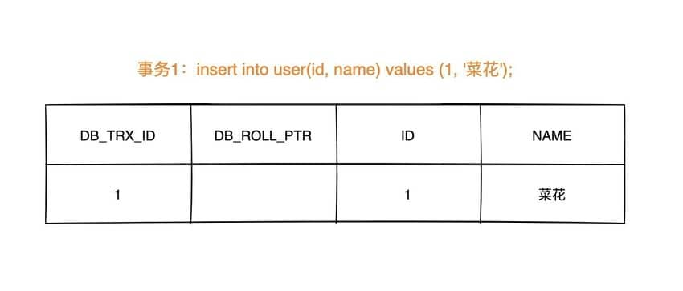
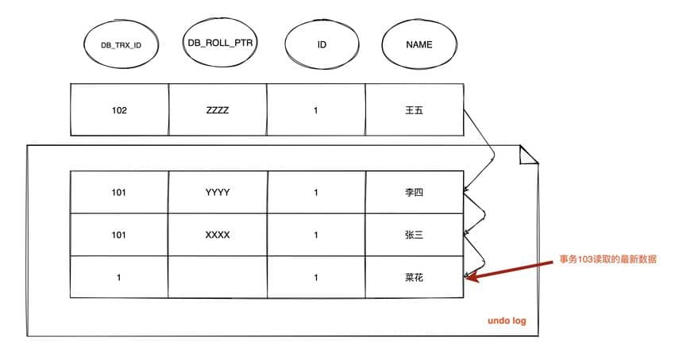

## Multi-Version Concurrency Control (MVCC)

MVCC là cơ chế concurrency control, dùng để duy trì consistency và isolation của dữ liệu khi nhiều transaction đồng thời đọc và ghi database. Cơ chế này được thực hiện bằng cách duy trì nhiều version của dữ liệu trên mỗi row. Khi một transaction sửa đổi dữ liệu, InnoDB sẽ **trực tiếp cập nhật row hiện tại** (cập nhật tại chỗ), đồng thời **lưu version cũ vào Undo Log**. Khi các transaction khác thực hiện snapshot read (Snapshot Read), chúng dựa trên **ReadView** và version chain trong **Undo Log** để đọc consistent view của dữ liệu tại một thời điểm, nhờ đó tránh việc thao tác đọc bị thao tác ghi chặn.

1. Thao tác đọc (SELECT):

Khi một transaction thực hiện thao tác đọc, nó sẽ dùng snapshot read. Snapshot read được tạo dựa trên trạng thái của database tại thời điểm transaction bắt đầu, vì vậy transaction sẽ không đọc các thay đổi chưa commit của transaction khác. Cụ thể:

- Với thao tác đọc, transaction sẽ tìm các row phù hợp và chọn version phù hợp với thời điểm bắt đầu transaction để đọc.
- Nếu một row có nhiều version, transaction sẽ chọn version mới nhất không muộn hơn thời điểm bắt đầu, bảo đảm transaction chỉ đọc dữ liệu đã tồn tại trước khi nó bắt đầu.
- Transaction đọc dữ liệu snapshot, vì vậy việc các transaction đồng thời khác sửa đổi row sẽ không ảnh hưởng đến thao tác đọc của transaction hiện tại.

2. Thao tác ghi (INSERT, UPDATE, DELETE):

Khi một transaction thực hiện thao tác ghi, nó sẽ tạo một version mới và ghi dữ liệu đã sửa đổi vào database. Cụ thể:

- Với thao tác ghi, transaction sẽ tạo một version mới cho row cần sửa đổi và ghi dữ liệu đã sửa đổi vào version mới.
- Version mới sẽ mang version number của transaction hiện tại để các transaction khác có thể đọc đúng version tương ứng.
- Version gốc vẫn tồn tại để các transaction khác thực hiện snapshot read, bảo đảm chúng không bị ảnh hưởng bởi thao tác ghi của transaction hiện tại.

3. Commit và rollback transaction:

- Khi một transaction commit, các thay đổi mà nó thực hiện sẽ trở thành version mới nhất của database và hiển thị với các transaction khác.
- Khi một transaction rollback, các thay đổi mà nó thực hiện sẽ bị hoàn tác và không hiển thị với các transaction khác.

4. Thu hồi version:

Để ngăn số version trong database tăng vô hạn, MVCC sẽ định kỳ thu hồi version. Cơ chế thu hồi sẽ xóa các version cũ không còn cần thiết, từ đó giải phóng không gian.

MVCC thực hiện concurrency control bằng cách tạo nhiều version của dữ liệu và sử dụng snapshot read. Thao tác đọc sử dụng snapshot của version cũ, thao tác ghi tạo version mới và bảo đảm version gốc vẫn khả dụng. Nhờ đó, các transaction khác nhau có thể thực thi đồng thời ở một mức độ nhất định mà không gây ảnh hưởng lẫn nhau, qua đó cải thiện performance khi xử lý đồng thời và consistency của database.

## Consistent Nonlocking Read và Locking Read

### Consistent Nonlocking Read

Để triển khai [**Consistent Nonlocking Read**](https://dev.mysql.com/doc/refman/5.7/en/innodb-consistent-read.html), cách làm thường dùng là thêm một field version number hoặc timestamp, tăng version number lên 1 hoặc cập nhật timestamp đồng thời với lúc update dữ liệu. Khi query, so sánh version number hiện tại có thể nhìn thấy với version number của record tương ứng; nếu version của record nhỏ hơn version có thể nhìn thấy thì record đó có thể nhìn thấy.

Trong `InnoDB Storage Engine`, [multi versioning](https://dev.mysql.com/doc/refman/5.7/en/innodb-multi-versioning.html) chính là cơ chế triển khai nonlocking read. Nếu row đang bị `DELETE` hoặc `UPDATE`, thao tác đọc sẽ không chờ lock trên row được giải phóng. Ngược lại, `InnoDB Storage Engine` sẽ đọc snapshot của row; cách đọc dữ liệu lịch sử này được gọi là snapshot read.

Ở hai isolation level `Repeatable Read` và `Read Committed`, nếu thực hiện câu lệnh `select` thông thường (không bao gồm `select ... lock in share mode` và `select ... for update`) thì sẽ sử dụng **Consistent Nonlocking Read (MVCC)**. Ngoài ra, trong `Repeatable Read`, `MVCC` đảm bảo repeatable read và ngăn chặn một phần phantom read.

### Locking Read

Nếu thực hiện một trong các câu lệnh sau thì đó là [**Locking Read**](https://dev.mysql.com/doc/refman/5.7/en/innodb-locking-reads.html):

- `select ... lock in share mode`
- `select ... for update`
- `insert`, `update`, `delete`

Trong locking read, version mới nhất của dữ liệu được đọc; kiểu đọc này còn được gọi là `current read`. Locking read sẽ lock các record được đọc:

- `select ... lock in share mode`: thêm `S` lock cho record; các transaction khác cũng có thể thêm `S` lock, nhưng sẽ bị block nếu thêm `X` lock.

- `select ... for update`, `insert`, `update`, `delete`: thêm `X` lock cho record, các transaction khác không thể thêm bất kỳ lock nào.

Trong consistent nonlocking read, ngay cả khi record được đọc đã bị transaction khác thêm `X` lock thì record vẫn có thể được đọc, vì đây là dữ liệu snapshot. Như đã nói ở trên, trong `Repeatable Read`, `MVCC` ngăn chặn một phần phantom read. “Một phần” ở đây nghĩa là trong trường hợp **consistent nonlocking read**, chỉ có thể đọc dữ liệu được insert trước lần query đầu tiên (xác định visibility của dữ liệu dựa trên Read View; Read View được tạo ở lần query đầu tiên). Tuy nhiên, nếu là **current read**, mỗi lần đọc đều đọc dữ liệu mới nhất. Khi một transaction khác insert dữ liệu giữa hai lần query thì sẽ xảy ra phantom read. Vì vậy, **khi triển khai `Repeatable Read`, nếu thực hiện current read thì `InnoDB` sẽ sử dụng `Next-key Lock` cho các record được đọc để ngăn transaction khác insert dữ liệu vào gap**.

## Triển khai MVCC trong InnoDB

Việc triển khai `MVCC` phụ thuộc vào: **hidden field, Read View, undo log**. Trong quá trình triển khai nội bộ, `InnoDB` xác định visibility của dữ liệu dựa trên `DB_TRX_ID` của row và `Read View`; nếu không thể nhìn thấy, nó sẽ dùng `DB_ROLL_PTR` của row để tìm historical version trong `undo log`. Version dữ liệu mà mỗi transaction đọc được có thể khác nhau; trong cùng một transaction, user chỉ có thể nhìn thấy các thay đổi đã commit trước khi transaction đó tạo `Read View` và các thay đổi do chính transaction đó thực hiện.

### Hidden Field

Ở bên trong, `InnoDB Storage Engine` thêm ba [hidden field](https://dev.mysql.com/doc/refman/5.7/en/innodb-multi-versioning.html) cho mỗi row:

- `DB_TRX_ID (6 byte)`: biểu thị transaction id của lần cuối cùng insert hoặc update row đó. Ngoài ra, thao tác `delete` được xem như update ở bên trong; điểm khác biệt là field `deleted_flag` trong `Record header` sẽ đánh dấu record đã bị xóa.
- `DB_ROLL_PTR (7 byte)`: rollback pointer, trỏ đến `undo log` của row đó. Nếu row chưa được update thì giá trị này rỗng.
- `DB_ROW_ID (6 byte)`: nếu chưa thiết lập primary key và table không có unique non-null index, `InnoDB` sẽ dùng id này để tạo clustered index.

### ReadView

```c
class ReadView {
  /* ... */
private:
  trx_id_t m_low_limit_id;      /* Các transaction có ID lớn hơn hoặc bằng ID này đều không thể nhìn thấy */

  trx_id_t m_up_limit_id;       /* Các transaction có ID nhỏ hơn ID này đều có thể nhìn thấy */

  trx_id_t m_creator_trx_id;    /* Transaction ID tạo Read View này */

  trx_id_t m_low_limit_no;      /* Transaction Number, Undo Logs nhỏ hơn Number này đều có thể được purge */

  ids_t m_ids;                  /* Danh sách transaction đang active khi tạo Read View */

  m_closed;                     /* Đánh dấu Read View đã close hay chưa */
}
```

[`Read View`](https://github.com/facebook/mysql-8.0/blob/8.0/storage/innobase/include/read0types.h#L298) chủ yếu dùng để xác định visibility; bên trong lưu “các transaction active khác hiện không thể nhìn thấy đối với transaction hiện tại”.

Các field chính:

- `m_low_limit_id`: transaction ID lớn nhất từng xuất hiện + 1, tức transaction ID tiếp theo sẽ được cấp. Các version dữ liệu lớn hơn hoặc bằng ID này đều không thể nhìn thấy.
- `m_up_limit_id`: transaction ID nhỏ nhất trong danh sách active transaction `m_ids`; nếu `m_ids` rỗng thì `m_up_limit_id` bằng `m_low_limit_id`. Các version dữ liệu nhỏ hơn ID này đều có thể nhìn thấy.
- `m_ids`: danh sách ID của các active transaction khác chưa commit khi `Read View` được tạo. Khi tạo `Read View`, các transaction chưa commit hiện tại được ghi lại; về sau, ngay cả khi chúng sửa đổi giá trị của row, transaction hiện tại cũng không thể nhìn thấy các thay đổi đó. `m_ids` không bao gồm chính transaction hiện tại và các transaction đã commit (đang ở trong memory).
- `m_creator_trx_id`: transaction ID của transaction tạo `Read View`.

**Sơ đồ visibility của transaction** ([nguồn hình](https://leviathan.vip/2019/03/20/InnoDB%E7%9A%84%E4%BA%8B%E5%8A%A1%E5%88%86%E6%9E%90-MVCC/#MVCC-1)):


### undo-log

`undo log` chủ yếu có hai tác dụng:

- Dùng để khôi phục dữ liệu về trạng thái trước khi sửa đổi khi transaction rollback.
- Tác dụng còn lại là phục vụ `MVCC`: khi đọc record, nếu record đang bị transaction khác giữ lock hoặc version hiện tại không thể nhìn thấy đối với transaction này, có thể đọc version trước đó qua `undo log`, từ đó triển khai nonlocking read.

**Trong `InnoDB Storage Engine`, `undo log` được chia thành hai loại: `insert undo log` và `update undo log`:**

1. **`insert undo log`**: là `undo log` được tạo ra trong thao tác `insert`. Vì record do thao tác `insert` tạo ra chỉ hiển thị với chính transaction đó, không hiển thị với các transaction khác, nên `undo log` này có thể được xóa trực tiếp sau khi transaction commit. Không cần thực hiện thao tác `purge`.

**Trạng thái ban đầu của dữ liệu khi `insert`:**



2. **`update undo log`**: là `undo log` được tạo ra trong thao tác `update` hoặc `delete`. `undo log` này có thể cần cung cấp cơ chế `MVCC`, vì vậy không thể xóa ngay khi transaction commit. Khi commit, nó được đưa vào linked list của `undo log` và chờ `purge thread` thực hiện xóa cuối cùng.

**Khi dữ liệu được sửa đổi lần đầu:**


**Khi dữ liệu được sửa đổi lần thứ hai:**


Việc cùng một transaction hoặc nhiều transaction khác nhau sửa đổi cùng một row sẽ khiến `undo log` của row đó trở thành một linked list; đầu linked list là record mới nhất, cuối linked list là record cũ nhất.

### Thuật toán xác định visibility của dữ liệu

Trong `InnoDB Storage Engine`, sau khi tạo transaction mới, trước mỗi câu lệnh `select`, một snapshot (Read View) sẽ được tạo; **snapshot lưu ID của các transaction hiện đang active (chưa commit) trong database hiện tại**. Nói đơn giản hơn, snapshot lưu danh sách ID của các transaction khác hiện không nên được transaction này nhìn thấy (tức `m_ids`). Khi user muốn đọc một row trong transaction này, `InnoDB` sẽ so sánh `DB_TRX_ID` của row với một số biến trong `Read View` và transaction ID hiện tại để xác định có thỏa điều kiện visibility hay không.

[Thuật toán so sánh cụ thể](https://github.com/facebook/mysql-8.0/blob/8.0/storage/innobase/include/read0types.h#L161) như sau ([nguồn hình](https://leviathan.vip/2019/03/20/InnoDB%E7%9A%84%E4%BA%8B%E5%8A%A1%E5%88%86%E6%9E%90-MVCC/#MVCC-1)):


1. Nếu `DB_TRX_ID < m_up_limit_id`, điều đó cho biết transaction sửa đổi row gần nhất (`DB_TRX_ID`) đã commit trước khi transaction hiện tại tạo snapshot, vì vậy giá trị của row có thể nhìn thấy đối với transaction hiện tại.

2. Nếu `DB_TRX_ID >= m_low_limit_id`, điều đó cho biết transaction sửa đổi row gần nhất (`DB_TRX_ID`) chỉ sửa đổi row sau khi transaction hiện tại tạo snapshot, vì vậy giá trị của row không thể nhìn thấy đối với transaction hiện tại. Chuyển đến bước 5.

3. Nếu `m_ids` rỗng, điều đó cho biết transaction sửa đổi row đã commit trước khi transaction hiện tại tạo snapshot, vì vậy giá trị của row có thể nhìn thấy đối với transaction hiện tại.

4. Nếu `m_up_limit_id <= DB_TRX_ID < m_low_limit_id`, điều đó cho biết transaction sửa đổi row gần nhất (`DB_TRX_ID`) có thể đang ở “trạng thái active” hoặc “trạng thái đã commit” tại thời điểm transaction hiện tại tạo snapshot; vì vậy cần tìm trong danh sách active transaction `m_ids` (source code sử dụng binary search vì danh sách đã được sắp xếp).

   - Nếu tìm thấy `DB_TRX_ID` trong danh sách active transaction `m_ids`, điều đó cho biết: ① trước khi transaction hiện tại tạo snapshot, giá trị của row đã được transaction có ID `DB_TRX_ID` sửa đổi nhưng chưa commit; hoặc ② sau khi transaction hiện tại tạo snapshot, giá trị của row được transaction có ID `DB_TRX_ID` sửa đổi. Trong cả hai trường hợp, giá trị của row không thể nhìn thấy đối với transaction hiện tại. Chuyển đến bước 5.

   - Nếu không tìm thấy trong danh sách active transaction, điều đó cho biết “transaction có id là trx_id” đã commit sau khi sửa đổi “giá trị của row” nhưng trước khi transaction hiện tại tạo snapshot, nên row có thể nhìn thấy đối với transaction hiện tại.

5. Lấy snapshot record từ `undo log` mà pointer `DB_ROLL_PTR` của row trỏ đến, dùng `DB_TRX_ID` của snapshot record để quay lại bước 1 và bắt đầu xác định lại, cho đến khi tìm thấy snapshot version thỏa điều kiện hoặc trả về rỗng.

## Khác biệt MVCC trong isolation level RC và RR

Trong isolation level `RC` và `RR` (isolation level mặc định của `InnoDB Storage Engine`), `InnoDB Storage Engine` sử dụng `MVCC` (consistent nonlocking read), nhưng thời điểm tạo `Read View` ở hai isolation level này khác nhau:

- Trong isolation level RC, tạo `Read View` (danh sách `m_ids`) trước **mỗi câu lệnh `select`**.
- Trong isolation level RR, chỉ tạo `Read View` (danh sách `m_ids`) trước **câu lệnh `select` đầu tiên** sau khi transaction bắt đầu.

## MVCC giải quyết vấn đề non-repeatable read

Mặc dù RC và RR đều dùng `MVCC` để đọc dữ liệu snapshot, nhưng do **thời điểm tạo Read View khác nhau**, nên isolation level RR đảm bảo repeatable read.

Ví dụ:


### Trường hợp tạo ReadView trong RC

**1. Giả sử timeline đến T4, khi đó version chain của row có id = 1 là:**


Vì trong isolation level RC, mỗi lần query đều tạo `Read View`, đồng thời transaction 101 và 102 chưa commit, nên `Read View` do transaction `103` tạo lúc này có **`m_ids` là: [101,102]**, `m_low_limit_id` là: 104, `m_up_limit_id` là: 101, `m_creator_trx_id` là: 103.

- Lúc này `DB_TRX_ID` của record mới nhất là 101, `m_up_limit_id <= 101 < m_low_limit_id`, nên cần tìm trong danh sách `m_ids`. Phát hiện `DB_TRX_ID` tồn tại trong danh sách, vì vậy record này không thể nhìn thấy.
- Dựa vào `DB_ROLL_PTR` để tìm record version trước đó trong `undo log`; `DB_TRX_ID` của record trước đó vẫn là 101 nên không thể nhìn thấy.
- Tiếp tục tìm record trước đó có `DB_TRX_ID` là 1, thỏa `1 < m_up_limit_id`, có thể nhìn thấy. Vì vậy transaction 103 đọc được dữ liệu là `name = Cải Hoa`.

**2. Timeline đến T6, version chain của dữ liệu là:**


Vì trong isolation level RC, `Read View` được tạo lại, lúc này transaction 101 đã commit còn 102 chưa commit, nên **`m_ids`** trong `Read View` là: **[102]**, `m_low_limit_id` là: 104, `m_up_limit_id` là: 102, `m_creator_trx_id` là: 103.

- Lúc này `DB_TRX_ID` của record mới nhất là 102, `m_up_limit_id <= 102 < m_low_limit_id`, nên cần tìm trong danh sách `m_ids`. Phát hiện `DB_TRX_ID` tồn tại trong danh sách, vì vậy record này không thể nhìn thấy.

- Dựa vào `DB_ROLL_PTR` để tìm record version trước đó trong `undo log`; `DB_TRX_ID` của record trước đó là 101, thỏa `101 < m_up_limit_id`, nên record có thể nhìn thấy. Vì vậy tại thời điểm T6, dữ liệu nhận được khi query là `name = Lý Tứ`, không giống kết quả query ở thời điểm T4, xảy ra non-repeatable read!

**3. Timeline đến T9, version chain của dữ liệu là:**


`Read View` được tạo lại; lúc này transaction 101 và 102 đều đã commit, nên **`m_ids`** rỗng, do đó `m_up_limit_id = m_low_limit_id = 104`. Transaction ID của version mới nhất là 102, thỏa `102 < m_low_limit_id`, có thể nhìn thấy; kết quả query là `name = Triệu Lục`.

> **Tóm tắt:** **Trong isolation level RC, transaction sẽ tạo và thiết lập Read View mới trước mỗi lần query, do đó xảy ra non-repeatable read.**

### Trường hợp tạo ReadView trong RR

Trong isolation level repeatable read, chỉ tạo một Read View (danh sách `m_ids`) ở lần đầu tiên đọc dữ liệu sau khi transaction bắt đầu.

**1. Version chain trong trường hợp T4 là:**


Khi thực hiện câu lệnh `select` hiện tại, một `Read View` được tạo; lúc này **`m_ids` là: [101,102]**, `m_low_limit_id` là: 104, `m_up_limit_id` là: 101, `m_creator_trx_id` là: 103.

Lúc này giống như trong isolation level RC:

- `DB_TRX_ID` của record mới nhất là 101, `m_up_limit_id <= 101 < m_low_limit_id`, nên cần tìm trong danh sách `m_ids`. Phát hiện `DB_TRX_ID` tồn tại trong danh sách, vì vậy record này không thể nhìn thấy.
- Dựa vào `DB_ROLL_PTR` để tìm record version trước đó trong `undo log`; `DB_TRX_ID` của record trước đó vẫn là 101 nên không thể nhìn thấy.
- Tiếp tục tìm record trước đó có `DB_TRX_ID` là 1, thỏa `1 < m_up_limit_id`, có thể nhìn thấy. Vì vậy transaction 103 đọc được dữ liệu là `name = Cải Hoa`.

**2. Tình huống tại thời điểm T6:**



Trong isolation level RR, chỉ tạo `Read View` một lần, vì vậy lúc này vẫn dùng **`m_ids`: [101,102]**, `m_low_limit_id` là: 104, `m_up_limit_id` là: 101, `m_creator_trx_id` là: 103.

- `DB_TRX_ID` của record mới nhất là 102, `m_up_limit_id <= 102 < m_low_limit_id`, nên cần tìm trong danh sách `m_ids`. Phát hiện `DB_TRX_ID` tồn tại trong danh sách, vì vậy record này không thể nhìn thấy.

- Dựa vào `DB_ROLL_PTR` để tìm record version trước đó trong `undo log`; `DB_TRX_ID` của record trước đó là 101 nên không thể nhìn thấy.

- Tiếp tục dựa vào `DB_ROLL_PTR` để tìm record version trước đó trong `undo log`; `DB_TRX_ID` của record trước đó vẫn là 101 nên không thể nhìn thấy.

- Tiếp tục tìm record trước đó có `DB_TRX_ID` là 1, thỏa `1 < m_up_limit_id`, có thể nhìn thấy. Vì vậy transaction 103 đọc được dữ liệu là `name = Cải Hoa`.

**3. Tình huống tại thời điểm T9:**


Tình huống lúc này hoàn toàn giống T6. Vì `Read View` đã được tạo nên vẫn dùng **`m_ids`: [101,102]**, kết quả query vẫn là `name = Cải Hoa`.

## MVCC➕Next-key-Lock ngăn phantom read

`InnoDB Storage Engine` giải quyết vấn đề phantom read trong isolation level RR thông qua `MVCC` và `Next-key Lock`:

**1. Thực hiện `select` thông thường, lúc này đọc dữ liệu theo cách MVCC snapshot read**

Trong snapshot read, isolation level RR chỉ tạo `Read View` ở lần query đầu tiên sau khi transaction bắt đầu và sử dụng nó cho đến khi transaction commit. Vì các version của record được transaction khác update hoặc insert sau khi `Read View` được tạo không thể nhìn thấy đối với transaction hiện tại, nên repeatable read được đảm bảo và “phantom read” trong snapshot read được ngăn chặn.

**2. Thực hiện current read như `select...for update`/`lock in share mode`, `insert`, `update`, `delete`**

Trong current read, mọi lần đọc đều lấy dữ liệu mới nhất. Nếu transaction khác insert record mới và record đó nằm đúng trong phạm vi query của transaction hiện tại thì sẽ xảy ra phantom read! `InnoDB` sử dụng [Next-key Lock](https://dev.mysql.com/doc/refman/5.7/en/innodb-locking.html#innodb-next-key-locks) để ngăn tình huống này. Khi thực hiện current read, ngoài việc lock các record được đọc, nó còn lock gap của các record đó để ngăn transaction khác insert dữ liệu trong phạm vi query. Chỉ cần ngăn insert thì sẽ không xảy ra phantom read.

## Tài liệu tham khảo

- **MySQL InnoDB Storage Engine Internals, 2nd Edition**
- [Mối quan hệ giữa isolation level và lock trong InnoDB](https://tech.meituan.com/2014/08/20/innodb-lock.html)
- [MySQL triển khai transaction và isolation level bằng MVCC như thế nào](https://blog.csdn.net/qq_35190492/article/details/109044141)
- [Phân tích transaction InnoDB - MVCC](https://leviathan.vip/2019/03/20/InnoDB%E7%9A%84%E4%BA%8B%E5%8A%A1%E5%88%86%E6%9E%90-MVCC/)

<!-- @include: @article-footer.snippet.md -->
