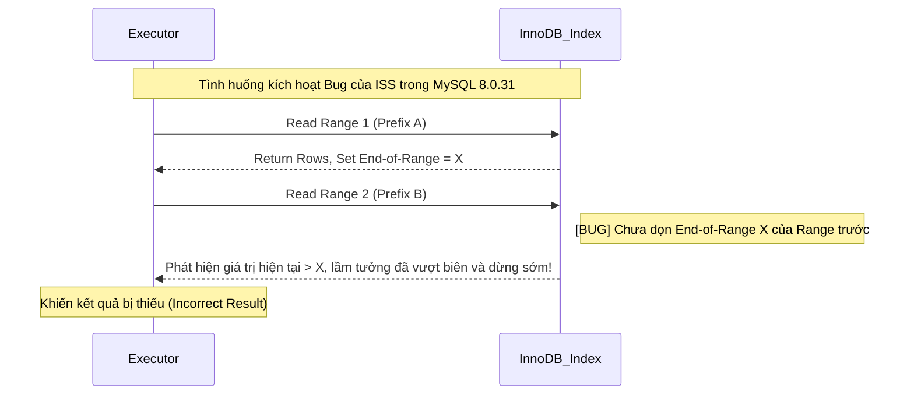

Trong tối ưu performance database, index là một trong những biện pháp tối ưu trực tiếp và hiệu quả nhất. Tuy nhiên, **tạo index không có nghĩa là chắc chắn index sẽ được sử dụng**. Trong quá trình phát triển thực tế, chúng ta thường gặp tình huống khó hiểu: rõ ràng đã tạo index trên cột, nhưng truy vấn vẫn chậm như sên; phân tích bằng `EXPLAIN` mới phát hiện hóa ra lại là full table scan.

Có nhiều nguyên nhân khiến index không được sử dụng, vừa do cách viết câu lệnh SQL, vừa do thiết kế index không phù hợp. Một số trường hợp rất dễ nhận ra (như vi phạm nguyên tắc tiền tố bên trái), một số khác lại khó nhận ra (như chuyển đổi kiểu ngầm định). Nếu không hiểu sâu các trường hợp này, bạn rất dễ để lại rủi ro performance tiềm ẩn trong môi trường production.

Bài viết này sẽ hệ thống hóa các trường hợp index MySQL thường không được sử dụng, phân tích nguyên lý phía sau và đưa ra đề xuất tối ưu tương ứng, giúp bạn nhanh chóng xác định và giải quyết vấn đề trong quá trình phát triển hằng ngày cũng như khi kiểm tra sự cố.

### Truy vấn SELECT \* (cân nhắc chi phí)

- **Định nghĩa cốt lõi**: Bản thân `SELECT *` **không trực tiếp khiến index không được sử dụng**. Đây là truy vấn **không được covering index bao phủ**; nếu điều kiện `WHERE` khớp với index thì index vẫn được xem xét ban đầu.
- **Quyết định về chi phí back to table**: Khi các cột truy vấn cần không nằm trong index tree, MySQL phải dùng primary key để tra lại clustered index và lấy toàn bộ dữ liệu của hàng (back to table). Optimizer sẽ so sánh chi phí giữa "index scan + back to table" và "full table scan trực tiếp". Nếu tỷ lệ kết quả truy vấn trên tổng lượng dữ liệu tương đối cao (thường ngưỡng là 20%~30%), optimizer sẽ cho rằng hiệu suất sequential IO của full table scan cao hơn random IO của việc back to table, từ đó **chủ động bỏ index**.
- **Cân nhắc theo tình huống**:
  - **Trường hợp covering index**: Nếu truy vấn chỉ cần các cột đã được index bao phủ, sử dụng covering index có thể tránh back to table và đạt performance tốt nhất.
  - **Khi không thể tránh back to table**: Nếu nghiệp vụ thực sự cần nhiều cột không có trong index, chỉ cần dùng `SELECT các cột cần thiết`. Khi cần phần lớn các cột, khả năng đọc hiểu code có thể quan trọng hơn micro-optimization kiểu "bớt vài cột"; khi đó dùng `SELECT *` cũng không sao.
- **Đề xuất áp dụng**: Ưu tiên `SELECT các cột cần thiết`, tốt nhất là để covering index bao phủ; nếu cần nhiều cột và không thể tránh back to table thì không cần máy móc "bớt cột".

### Vi phạm nguyên tắc tiền tố bên trái

- **Định nghĩa cốt lõi**: Nguyên tắc khớp tiền tố bên trái nghĩa là khi sử dụng composite index, MySQL sẽ lần lượt khớp các cột trong điều kiện truy vấn từ trái sang phải theo thứ tự các cột trong index. Nếu điều kiện truy vấn khớp với cột ngoài cùng bên trái của index, MySQL sẽ sử dụng index để lọc dữ liệu.
- **Hiệu ứng ngắt của range query**: Trong composite index, nếu một cột sử dụng range query (ví dụ `>`, `<`, `BETWEEN`, `LIKE "abc%"` khớp tiền tố), bản thân cột đó và các cột đứng trước vẫn có thể khớp bình thường và dùng để định vị chính xác trong index, nhưng các cột đứng sau cột đó sẽ không thể sử dụng
  index để định vị nhanh (tức là không thể dùng binary search kiểu `ref`). Nguyên nhân là trong cấu trúc index B+Tree, chỉ khi cột dẫn trước hoàn toàn bằng nhau thì các cột phía sau mới có thứ tự. Một khi cột dẫn trước trở thành một range, các cột phía sau sẽ tương đối không có thứ tự trong toàn bộ khoảng quét, từ đó làm mất khả năng định vị chính xác. Tuy nhiên, trong MySQL 5.6 trở lên, các cột phía sau chưa hoàn toàn mất hiệu lực mà chuyển sang sử dụng cơ chế **Index Condition Pushdown (ICP)**, trực tiếp lọc điều kiện trong quá trình range scan để giảm số lần back to table.
- **Index Skip Scan (ISS)**: MySQL 8.0.13 giới thiệu **Index Skip Scan**, cho phép khi thiếu tiền tố bên trái, thực hiện skip scan cây index phía sau bằng cách liệt kê toàn bộ giá trị distinct của cột dẫn trước.
  - **Hướng dẫn tránh lỗi theo phiên bản**: Trong **MySQL 8.0.31**, ISS có Bug nghiêm trọng ([[Bug #109145]](https://bugs.mysql.com/bug.php?id=109145)); khi đọc qua các range, giá trị biên cũ không được dọn dẹp, có thể khiến truy vấn trực tiếp **mất dữ liệu**.
  - **Đề xuất áp dụng**: ISS có performance tốt nhất khi cardinality của cột dẫn trước rất thấp (như enum giới tính, trạng thái), vì optimizer cần liệt kê mọi giá trị distinct của cột dẫn trước để lần lượt skip scan; càng ít giá trị distinct thì càng ít lần skip. Tuy nhiên, bản thân "cardinality thấp" không phải điều kiện giới hạn chính thức; optimizer sẽ đánh giá tổng hợp chi phí để quyết định có kích hoạt ISS hay không. Trong môi trường production, **nghiêm cấm dựa vào ISS để bù đắp thiết kế index kém**; phải điều chỉnh thứ tự composite index hoặc bổ sung điều kiện trên cột dẫn trước để đáp ứng tiền tố bên trái.

**Sơ đồ đường đi khi Index Skip Scan thất bại:**



Ví dụ index không được sử dụng:

```sql
-- Index: (sname, s_code, address)
SELECT * FROM students WHERE s_code = 1;                  -- Bỏ qua cột ngoài cùng bên trái sname, index không được sử dụng
SELECT * FROM students WHERE sname = 'A' AND address = 'Shanghai'; -- Bỏ qua cột ở giữa, chỉ sname dùng index (ICP có thể tối ưu việc lọc)
SELECT * FROM students WHERE sname = 'A' AND s_code > 1 AND address = 'Shanghai'; -- Sau range query, address không thể dùng để định vị, chỉ dùng để lọc
```

### Tính toán, áp dụng hàm hoặc chuyển đổi kiểu trên cột index

- **Định nghĩa cốt lõi**: Index B+Tree lưu trữ **giá trị gốc** của cột. Một khi áp dụng hàm (như `ABS()`, `DATE()`) hoặc phép tính số học cho cột index trong điều kiện `WHERE`, giá trị của cột đó đã thay đổi về mặt logic.
- **Hiệu ứng phá vỡ tính có thứ tự**: Vì B+Tree được sắp xếp dựa trên giá trị gốc, kết quả sau khi xử lý bằng hàm không có thứ tự trong index tree. Database không thể dùng binary search để định vị nhanh mà buộc phải thực hiện full table scan.
- **Functional Index**: MySQL 8.0 hỗ trợ **Functional Index**, có thể tạo index cho giá trị sau khi tính toán, nhưng phạm vi sử dụng có hạn; ưu tiên hàng đầu vẫn là tối ưu cách viết SQL.

Ví dụ index không được sử dụng:

```sql
SELECT * FROM students WHERE height + 1 = 170;            -- Tính toán trên cột index
SELECT * FROM students WHERE DATE(create_time) = '2022-01-01'; -- Dùng hàm trên cột index
```

Đề xuất tối ưu:

```sql
SELECT * FROM students WHERE height = 169;                -- Chuyển phép tính sang bên phải dấu bằng
SELECT * FROM students WHERE create_time BETWEEN '2022-01-01 00:00:00' AND '2022-01-01 23:59:59';
```

### Truy vấn LIKE bắt đầu bằng wildcard

- **Định nghĩa cốt lõi**: Truy vấn `LIKE` phải bắt đầu bằng ký tự cụ thể mới có thể tận dụng tính có thứ tự của index, ví dụ `WHERE sname LIKE 'Guide%';`. Nguyên nhân là B+Tree được sắp xếp từ trái sang phải. Wildcard ở tiền tố (`%`) phá vỡ tính có thứ tự và không thể định vị điểm bắt đầu.
- **Cơ chế khiến index không được sử dụng khi có wildcard ở tiền tố**: Nếu bắt đầu bằng `%` (như `'%abc'`), vì index được sắp xếp theo ký tự từ trái sang phải nên tiền tố không xác định có nghĩa là giá trị có thể xuất hiện ở bất kỳ vị trí nào trong index tree, khiến không thể xác định điểm bắt đầu của khoảng tìm kiếm.
- **Đề xuất áp dụng**:
  - Nếu bắt buộc phải truy vấn mơ hồ toàn bộ, hãy cố gắng chỉ truy vấn các cột được index bao phủ; khi đó `EXPLAIN` sẽ hiển thị `type: index` (**Index Full Scan**). Dù quét toàn bộ index tree nhưng không cần back to table nên performance vẫn tốt hơn `ALL`.
  - Tìm kiếm mơ hồ quy mô lớn trong nghiệp vụ cốt lõi nên được thực hiện bằng **Elasticsearch** hoặc search engine khác.

Ví dụ index không được sử dụng:

```sql
SELECT * FROM students WHERE sname LIKE '%Guide';          -- Mơ hồ ở tiền tố, full table scan
SELECT * FROM students WHERE sname LIKE '%Guide%';         -- Mơ hồ cả trước và sau, full table scan
```

### Kết nối OR và Index Merge

- **Định nghĩa cốt lõi**: Trong một nhóm điều kiện nối bằng `OR`, chỉ cần **một cột bất kỳ không có index** thì MySQL sẽ từ bỏ toàn bộ index và chuyển sang thực hiện full table scan.
- **Cơ chế Index Merge**: Nếu cả hai phía của `OR` đều có index, MySQL 5.1+ có thể kích hoạt tối ưu **Index Merge**, lần lượt quét hai index rồi hợp nhất kết quả. Tuy nhiên, nếu lượng dữ liệu sau khi lọc bằng hai index đều rất lớn, chi phí hợp nhất tập kết quả có thể cao hơn full table scan và vẫn từ bỏ index.
- **Đề xuất áp dụng**:
  - Ưu tiên viết lại `OR` thành `UNION ALL`. `UNION ALL` cho phép mỗi phần truy vấn độc lập sử dụng index, đồng thời tránh vấn đề optimizer ước tính chi phí `OR` không chính xác.
  - Lưu ý: Chỉ dùng `UNION ALL` khi xác định tập kết quả không trùng lặp; nếu không, phải dùng `UNION` (liên quan đến temporary table để loại trùng và phát sinh chi phí bổ sung).

Ví dụ index không được sử dụng:

```sql
-- Giả sử sname và address đều có index, nhưng mỗi điều kiện khớp hơn 30% dữ liệu
SELECT * FROM students WHERE sname = 'Student 1' OR address = 'Shanghai'; -- Có thể từ bỏ index và full table scan

-- Đề xuất viết lại thành
SELECT * FROM students WHERE sname = 'Student 1'
UNION ALL
SELECT * FROM students WHERE address = 'Shanghai'; -- Mỗi phần tự sử dụng index
```

**Cách xác minh**: Nếu `EXPLAIN` xuất hiện `type: index_merge` và `Extra: Using union; Using where`, nghĩa là đã sử dụng Index Merge.

### Sử dụng IN / NOT IN không phù hợp

**Độ dài danh sách `IN`**:

- `eq_range_index_dive_limit` (mặc định **200**) không trực tiếp khiến index không được sử dụng mà ảnh hưởng đến **chiến lược ước tính số hàng**:
  - **<= 200**: MySQL sử dụng **Index Dive** (đi sâu vào index tree để thăm dò) nhằm ước tính chính xác số hàng; ước tính chi phí chính xác và index nhiều khả năng vẫn được sử dụng.
  - **> 200**: Khi độ dài danh sách `IN` vượt `eq_range_index_dive_limit` (MySQL 5.7.4+ mặc định là 200), optimizer chuyển từ Index Dive chính xác sang ước tính dựa trên `index_statistics`. Nếu thống kê cardinality của table đã cũ, việc này có thể khiến chi phí được ước tính bất thường, từ đó bỏ range scan và chọn full table scan.
- Có thể tăng `eq_range_index_dive_limit` hoặc viết lại thành `JOIN` với temporary table để tránh vấn đề này.

**`NOT IN`**:

- **Danh sách hằng số** (như `NOT IN (1,2,3)`): thường thực hiện full table scan vì phải duyệt toàn bộ B+Tree để chứng minh giá trị "không nằm trong tập hợp".
- **Cột index liên kết với subquery**: `WHERE id NOT IN (SELECT user_id FROM orders WHERE user_id > 1000)` có thể sử dụng index `user_id` của table `orders`.
- **Thay thế được khuyến nghị**: Ưu tiên dùng `NOT EXISTS` hoặc `LEFT JOIN / IS NULL`, vừa có performance tốt hơn vừa có ngữ nghĩa rõ ràng hơn.

Ví dụ index không được sử dụng:

```sql
SELECT * FROM students WHERE s_code IN (1, 2, 3, ..., 500); -- Danh sách quá dài, có thể chuyển sang ước tính thống kê và dẫn đến phán đoán sai
SELECT * FROM students WHERE s_code NOT IN (1, 2, 3);     -- Danh sách hằng số, full table scan
```

### Chuyển đổi kiểu ngầm định

Đây là bẫy khó nhận ra nhất trong quá trình phát triển; **hướng chuyển đổi quyết định index có được sử dụng hay không**.

| Tình huống                 | Ví dụ               | Hướng chuyển đổi                              | Index có được sử dụng không |
| -------------------------- | ------------------- | --------------------------------------------- | --------------------------- |
| **Cột chuỗi + giá trị số** | `varchar_col = 123` | Chuỗi chuyển thành số (xảy ra trên cột index) | ❌ Không được sử dụng       |
| **Cột số + giá trị chuỗi** | `int_col = '123'`   | Chuỗi chuyển thành số (xảy ra trên hằng số)   | ✅ Được sử dụng             |

**Điểm then chốt**:

- Chỉ khi **chuyển đổi xảy ra trên cột index** thì index mới không được sử dụng.
- Khi so sánh chuỗi với số, theo mặc định MySQL chuyển chuỗi thành **số thực dấu phẩy động (DOUBLE)** để so sánh (xem [quy tắc 7 trong tài liệu chính thức MySQL](https://dev.mysql.com/doc/refman/8.0/en/type-conversion.html)). Chuyển đổi kiểu ngầm định xảy ra trên cột index tương đương với việc áp dụng một hàm chuyển đổi không thể đảo ngược trên cột index, phá vỡ tính có thứ tự của B+Tree và khiến truy vấn chỉ có thể thực hiện full table scan.
- `int_col = '123'` sẽ được chuyển thành `int_col = CAST('123' AS DOUBLE)`, chuyển đổi xảy ra ở phía hằng số nên không ảnh hưởng đến việc sử dụng index.

**Giới thiệu chi tiết**: [Chuyển đổi ngầm định trong MySQL khiến index không được sử dụng](https://javaguide.cn/database/mysql/index-invalidation-caused-by-implicit-conversion.html)

### Bẫy tối ưu sắp xếp ORDER BY

Ngay cả khi điều kiện `WHERE` chính xác, truy vấn vẫn có thể chậm nếu xử lý `ORDER BY` không tốt.

**Điều kiện kích hoạt `Using filesort`**:

- Trường sắp xếp không nằm trong index
- Thứ tự index không nhất quán với `ORDER BY` (như index `(a,b)` nhưng `ORDER BY b,a`)
- `WHERE` và `ORDER BY` lần lượt sử dụng các index khác nhau
- `SELECT *` chứa các cột không nằm trong index (cần back to table để sắp xếp)

**Giải pháp tối ưu**:

- Sử dụng **covering index** để đồng thời đáp ứng `WHERE` và `ORDER BY`. Ví dụ index là `(name, age)`, truy vấn `SELECT name, age FROM users WHERE name = 'A' ORDER BY age`.
- Điều chỉnh thứ tự index để khớp với `ORDER BY`.

**Cách xác minh**: Khi cột `Extra` trong `EXPLAIN` xuất hiện `Using filesort`, nghĩa là đã kích hoạt filesort.

### Tổng kết

Bài viết đã hệ thống hóa các trường hợp index MySQL thường không được sử dụng. Xét từ cơ chế bên trong, có thể quy về hai nhóm cốt lõi sau:

**1. Cách viết SQL xung đột với logic bên trong (phá vỡ tính có thứ tự của B+Tree)**

Đây là nhóm vấn đề thường gặp nhất; bản chất là điều kiện truy vấn khiến B+Tree bên dưới mất khả năng định vị nhanh bằng "binary search".

- **Vi phạm nguyên tắc tiền tố bên trái**: Bỏ qua cột dẫn trước của composite index hoặc gặp range query (như `>`, `<`, `BETWEEN`, `LIKE "abc%"`) khiến các cột phía sau không còn định vị chính xác mà chuyển thành range scan kèm lọc.
- **Xử lý trên cột index**: Tính toán số học hoặc áp dụng hàm lên cột index ở bên trái `WHERE` khiến giá trị gốc thay đổi về mặt logic và trở nên không có thứ tự trong index tree.
- **Chuyển đổi kiểu ngầm định (khó nhận ra và nguy hiểm)**: Khi "cột kiểu chuỗi" được so sánh với "giá trị kiểu số", MySQL mặc định áp dụng hàm chuyển đổi lên cột, trực tiếp phá vỡ tính có thứ tự của tree.
- **Wildcard ở đầu mẫu LIKE**: Như `LIKE "%abc"`; sự không xác định của ký tự tiền tố khiến optimizer không thể xác định điểm bắt đầu của khoảng quét.
- **Bẫy sắp xếp ORDER BY**: Cột sắp xếp không khớp index, hướng sắp xếp không nhất quán với cấu trúc index, v.v. làm phát sinh việc sắp xếp bổ sung trong memory hoặc disk (`Using filesort`).

**2. Quyết định chi phí của optimizer (đánh đổi dựa trên chi phí I/O)**

Nhóm vấn đề này không phải do bản thân index không thể sử dụng, mà do sau khi tính toán, MySQL optimizer cho rằng tổng chi phí của việc **không dùng index thông thường** lại nhỏ hơn. **Cần đặc biệt lưu ý: optimizer chọn full table scan hoặc truy vấn back to table thường là quyết định chi phí chính xác, không phải "vấn đề performance"**.

- **Truy vấn back to table là hiện tượng bình thường**: Khi truy vấn cần các cột không được covering index bao phủ, back to table là thao tác bình thường và không thể tránh. Lọc bằng index rồi back to table để lấy các cột nghiệp vụ là mô hình truy vấn tiêu chuẩn, không phải biểu hiện "performance kém". Chỉ khi số lần back to table quá nhiều (như lượng dữ liệu khớp vượt 20%~30%) và có phương án full table scan tốt hơn thì mới cần chú ý.
- **Full table scan có thể là lựa chọn tối ưu nhất**: Optimizer thường chọn full table scan dựa trên tính toán chi phí hợp lý. Khi selectivity của index thấp (lượng dữ liệu khớp lớn), full table scan bằng sequential IO thường hiệu quả hơn việc back to table bằng random IO. Đây không phải là trường hợp index bị vô hiệu hóa, mà là optimizer đã chọn execution path tốt hơn.
- **Cân nhắc theo tình huống của `SELECT *`**: Ưu tiên `SELECT các cột cần thiết`; tốt nhất là khớp covering index để tránh back to table. Nếu cần nhiều cột không có trong index và không thể tránh back to table thì không cần máy móc "bớt cột"; khi cần phần lớn các cột, khả năng đọc hiểu code có thể quan trọng hơn micro-optimization kiểu "truyền ít hơn vài cột".
- **Điều kiện `OR` gây full table scan**: Chỉ cần một phía của điều kiện nối bằng `OR` không có index tương ứng là sẽ kích hoạt full table scan. Ngay cả khi cả hai phía đều có index, nếu chi phí dự kiến của Index Merge quá cao thì vẫn bị từ bỏ.
- **Danh sách `IN` quá dài gây sai lệch ước tính**: Khi độ dài danh sách `IN` vượt ngưỡng hệ thống (mặc định 200), optimizer chuyển từ thăm dò chuyên sâu chính xác (Index Dive) sang ước tính thống kê sơ lược, rất dễ phán đoán sai chi phí thực thi do thông tin thống kê đã cũ.

**Đề xuất thực tế**:

1. **Hình thành thói quen phân tích bằng `EXPLAIN`**: Sau khi viết SQL phức tạp, nhất định phải dùng `EXPLAIN` để phân tích execution plan, chú ý các cột `type`, `key`, `rows`, `Extra`. **Lưu ý**: `type: ALL` không nhất thiết là vấn đề, có thể là quyết định chính xác của optimizer.
2. **Chọn chiến lược truy vấn theo tình huống**:
   - Nếu các cột truy vấn được index bao phủ, ưu tiên dùng covering index để tránh back to table
   - Nếu bắt buộc lấy nhiều cột không có trong index, tránh tách thành nhiều truy vấn chỉ để "bớt cột", nhằm giảm số lần round trip mạng
3. **Sử dụng kiểu dữ liệu nhất quán**: Giữ kiểu của điều kiện truy vấn nhất quán với kiểu của cột để tránh chuyển đổi kiểu ngầm định.
4. **Thiết kế composite index hợp lý**: Sắp xếp thứ tự các cột theo tần suất truy vấn và selectivity, ưu tiên đáp ứng các truy vấn thường xuyên.
5. **Cân nhắc ES cho tìm kiếm mơ hồ quy mô lớn**: Với truy vấn mơ hồ cả trước và sau (`%keyword%`), nên sử dụng Elasticsearch hoặc search engine khác.

Tối ưu index là kỹ năng cơ bản khi tối ưu performance database, nhưng cũng cần cân nhắc theo nghiệp vụ thực tế và phân bố dữ liệu. Chỉ khi hiểu nguyên nhân gốc rễ khiến index không được sử dụng, bạn mới có thể nhanh chóng xác định và giải quyết vấn đề performance.

**Đọc thêm**:

- [Giải thích chi tiết về MySQL index](https://javaguide.cn/database/mysql/mysql-index.html)
- [Phân tích execution plan của MySQL](https://javaguide.cn/database/mysql/mysql-query-execution-plan.html)
- [Chuyển đổi ngầm định trong MySQL khiến index không được sử dụng](https://javaguide.cn/database/mysql/index-invalidation-caused-by-implicit-conversion.html)
