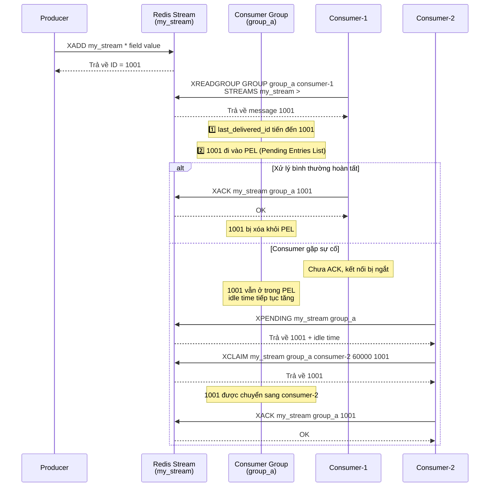

Nói ngắn gọn: **có thể, nhưng còn tùy trường hợp cụ thể. So với message queue chuyên dụng (như Kafka, RabbitMQ), Redis vẫn còn một số hạn chế.**

Trước khi chính thức bắt đầu, hãy cùng xem: **một MQ production-grade cần có những năng lực cốt lõi nào?**

| Khía cạnh năng lực                 | Định nghĩa                                                           | Chỉ số/đặc điểm chính                                           |
| :--------------------------------- | :------------------------------------------------------------------- | :-------------------------------------------------------------- |
| **Persistence**                    | Message sau khi được ghi sẽ không bị mất do tiến trình/nút gặp sự cố | Flush đồng bộ/xác nhận nhiều replica, RPO ≈ 0                   |
| **At-least-once delivery**         | Message cuối cùng sẽ được consumer xử lý, cho phép trùng lặp         | Cần kết hợp với tính idempotent của consumer                    |
| **Consumer acknowledgement**       | Consumer chủ động thông báo xử lý thành công                         | Cơ chế ACK, retry khi timeout, dead-letter queue                |
| **Message retry**                  | Khi xử lý thất bại, message có thể được tự động gửi lại              | Chiến lược backoff, số lần retry tối đa, chuyển vào dead letter |
| **Consumer group**                 | Nhiều consumer phối hợp xử lý, tự động failover khi gặp sự cố        | Load balancing trong group, phân bổ partition, Rebalance        |
| **Khả năng chứa message tồn đọng** | Khả năng đệm khi tốc độ production > tốc độ consumption              | Lưu trữ trên disk, TTL, cảnh báo message tồn đọng               |
| **Đảm bảo thứ tự**                 | Message được xử lý theo thứ tự gửi                                   | Có thứ tự theo partition/toàn cục, chi phí khi mất thứ tự       |
| **Khả năng mở rộng**               | Horizontal scaling để tăng throughput hoặc khả năng phục hồi         | Cơ chế sharding, Broker stateless, tự động scale in/out         |

Redis cung cấp nhiều cách triển khai MQ, từ cấu trúc dữ liệu `List` thời kỳ đầu, đến `Pub/Sub`, rồi `Stream` được bổ sung trong Redis 5.0 (được triển khai dựa trên linked list có thứ tự, hỗ trợ consumer group và cơ chế ACK, có thể dùng để xây dựng message queue nhẹ).

### Giai đoạn 1: Sử dụng cấu trúc dữ liệu List trong giai đoạn đầu

**Trước Redis 2.0, nếu muốn dùng Redis làm message queue thì chỉ có thể triển khai bằng List.**

Có thể dùng `RPUSH/LPOP` hoặc `LPUSH/RPOP` để triển khai message queue đơn giản:

```bash
# Producer tạo message
> RPUSH myList msg1 msg2
(integer) 2
> RPUSH myList msg3
(integer) 3
# Consumer xử lý message
> LPOP myList
"msg1"
```

Tuy nhiên, cách dùng `RPUSH/LPOP` hoặc `LPUSH/RPOP` có vấn đề về performance. Ta phải liên tục polling và gọi `RPOP` hoặc `LPOP` để consume message. Khi List rỗng, phần lớn request polling đều vô ích, gây lãng phí rất nhiều tài nguyên hệ thống.

Vì vậy, Redis cũng cung cấp các command đọc dạng blocking là `BLPOP`, `BRPOP` (các command có tiền tố B (Blocking) đều là command blocking), đồng thời hỗ trợ tham số timeout. Nếu List rỗng, Redis server sẽ không trả kết quả ngay mà chờ đến khi List có dữ liệu mới rồi mới trả về, hoặc chờ tối đa hết một khoảng timeout rồi trả về rỗng. Nếu đặt timeout bằng 0 thì có thể chờ vô hạn cho đến khi pop được message.

```bash
# Timeout là 10s
# Nếu có dữ liệu thì trả về ngay, nếu không sẽ chờ tối đa 10 giây
> BRPOP myList 10
null
```

List triển khai chức năng message queue quá đơn giản, các tính năng như cơ chế acknowledgement vẫn phải tự triển khai. **Điểm nghiêm trọng nhất là nó không hỗ trợ một message được nhiều consumer xử lý (broadcast), hơn nữa message sẽ biến mất ngay khi được lấy ra. Nếu consumer xử lý thất bại, message sẽ mất vĩnh viễn.**

### Giai đoạn 2: Áp dụng mô hình Pub/Sub (publish/subscribe)

**Redis 2.0 bổ sung tính năng publish/subscribe (Pub/Sub), giải quyết vấn đề List không có cơ chế broadcast khi triển khai message queue.**


Pub/Sub có một khái niệm gọi là **Channel**, cơ chế publish/subscribe được triển khai dựa trên Channel này.

Pub/Sub gồm hai vai trò là publisher và subscriber (còn gọi là consumer):

- Publisher dùng `PUBLISH` để gửi message đến Channel được chỉ định.
- Subscriber dùng `SUBSCRIBE` để subscribe các Channel mà mình quan tâm. Một subscriber có thể subscribe một hoặc nhiều Channel.

Nói cách khác, nhiều consumer có thể subscribe cùng một Channel. Producer publish message vào Channel này, tất cả subscriber đều nhận được.

Ở đây, ta khởi động 3 Redis client để minh họa đơn giản:


Pub/Sub vừa hỗ trợ unicast vừa hỗ trợ broadcast, đồng thời hỗ trợ pattern matching đơn giản bằng regular expression trên Channel.

Pub/Sub có một thiếu sót nghiêm trọng: **nó fire-and-forget, hoàn toàn không có persistence và không đảm bảo reliability**. Nếu một consumer offline khi message được publish, hoặc mạng chập chờn trong chốc lát, message đó sẽ mất vĩnh viễn đối với consumer này. Ngoài ra, nó cũng **không có cơ chế ACK**, không thể biết consumer đã xử lý thành công hay chưa, càng không thể giải quyết vấn đề **message tồn đọng**. Vì vậy, Pub/Sub chỉ phù hợp với một số thông báo realtime có yêu cầu reliability cực thấp, tuyệt đối không được dùng cho bất kỳ message queue dùng cho nghiệp vụ nghiêm túc nào.

### Giai đoạn 3: Stream được bổ sung trong Redis 5.0

Redis 5.0 bổ sung cấu trúc dữ liệu `Stream`. Đây là một message log có thứ tự được triển khai dựa trên Radix Tree, hỗ trợ sẵn consumer group và cơ chế ACK, có thể dùng để xây dựng message queue nhẹ.

**Tại sao lại dùng Radix Tree?** Nhiều người thắc mắc, tại sao không tiếp tục dùng `List/LinkedList`?

1. **Nén bộ nhớ ở mức cao**: Message ID của `Stream` (như `1625000000000-0`) có tính tuần tự cao và phần prefix trùng lặp nhiều. Radix Tree là một compressed prefix tree, nó gộp các node có cùng prefix. Mỗi phần tử của List/LinkedList đều có overhead của linked list node, đồng thời không thể tận dụng đặc điểm prefix lặp lại của ID để tiết kiệm không gian.
2. **Truy vấn hiệu quả**: Khi xử lý hàng triệu message tồn đọng, Radix Tree vẫn duy trì hiệu năng query rất cao. Đây cũng là nền tảng giúp `Stream` hỗ trợ range query trên lượng dữ liệu lớn (`XRANGE`). Ngược lại, `List/LinkedList` chỉ có thể thao tác từ đầu hoặc cuối, không thể query hiệu quả theo range của ID; để thực thi `XRANGE` cần duyệt toàn bộ List.

Nó tiếp thu các khái niệm cốt lõi của những MQ chuyên dụng như Kafka:

1. **Consumer group**: Thực hiện load balancing message giữa nhiều consumer, hỗ trợ tự động failover khi gặp sự cố.
2. **Persistence**: Có thể dùng RDB và AOF để đảm bảo message không bị mất sau khi Redis khởi động lại (phụ thuộc cấu hình `appendfsync`; ở chế độ `everysec`, thông thường có thể mất tối đa 1 giây dữ liệu).
3. **Cơ chế ACK**: Sau khi xử lý xong message, consumer cần chủ động dùng `XACK` để xác nhận; nếu không, message sẽ được giữ trong `Pending List`. Điều này đảm bảo message được xử lý thành công ít nhất một lần.
4. **Message replay và chuyển giao**: Hỗ trợ replay message theo time range bằng `XRANGE`, và dùng `XCLAIM` để chuyển message đang pending cho consumer khác xử lý.

> 🌈 Tiến hóa theo phiên bản:
>
> - Redis 8.2: `XACKDEL`, `XDELEX`, `XADD` và command `XTRIM` cung cấp khả năng kiểm soát chi tiết cách các thao tác trên stream tương tác với nhiều consumer group, đơn giản hóa việc điều phối xử lý message giữa các application khác nhau.
> - Redis 8.6: Hỗ trợ xử lý message idempotent (produce tối đa một lần), ngăn các entry trùng lặp khi dùng chế độ at-least-once delivery. Tính năng này cho phép commit message đáng tin cậy và tự động loại bỏ trùng lặp.

Cấu trúc của `Stream` như sau:


Đây là một linked list message có thứ tự, mỗi message có một ID duy nhất và nội dung tương ứng. ID là tổ hợp của timestamp và sequence number, dùng để đảm bảo tính duy nhất và tính tăng dần của message. Nội dung là một hoặc nhiều cặp key-value (tương tự kiểu dữ liệu Hash cơ bản), dùng để lưu dữ liệu của message.

Dưới đây là giải thích ngắn gọn về một số khái niệm trong hình:

- `Consumer Group`: Consumer group dùng để tổ chức và quản lý nhiều consumer. Bản thân consumer group không xử lý message mà phân phối message cho các consumer, để consumer thực sự xử lý.
- `last_delivered_id`: Cursor biểu thị vị trí hiện tại khi consume của consumer group. Bất kỳ consumer nào trong consumer group đọc message cũng khiến last_delivered_id tiến lên.
- `pending_ids`: Ghi lại ID của các message đã được client consume nhưng chưa ACK.

Dưới đây là các command thường dùng khi sử dụng `Stream` làm message queue:

- `XADD`: Thêm message mới vào stream.
- `XREAD`: Đọc message từ stream.
- `XREADGROUP`: Đọc message từ consumer group.
- `XRANGE`: Đọc message trong stream theo range của message ID.
- `XREVRANGE`: Tương tự `XRANGE`, nhưng trả kết quả theo thứ tự ngược lại.
- `XDEL`: Xóa message khỏi stream.
- `XTRIM`: Cắt ngắn stream, có thể chỉ định policy trim (`MAXLEN`/`MINID`).
- `XLEN`: Lấy độ dài của stream.
- `XGROUP CREATE`: Tạo consumer group.
- `XGROUP DESTROY`: Xóa consumer group.
- `XGROUP DELCONSUMER`: Xóa một consumer khỏi consumer group.
- `XGROUP SETID`: Đặt last delivered message ID mới cho consumer group.
- `XACK`: Xác nhận message trong consumer group đã được xử lý.
- `XPENDING`: Query các message đang pending (chưa được xác nhận) của consumer group.
- `XCLAIM`: Chuyển message đang pending từ consumer này sang consumer khác.
- `XINFO`: Lấy thông tin chi tiết về stream (`XINFO STREAM`), consumer group (`XINFO GROUPS`) hoặc consumer (`XINFO CONSUMERS`).

Sơ đồ sequence dưới đây thể hiện luồng chuyển message và cơ chế ACK của consumer group trong Stream:



Nhìn chung, `Stream` đã có thể đáp ứng các yêu cầu cơ bản của một message queue. Tuy nhiên, khi sử dụng thực tế cần lưu ý những điểm sau:

1. **Hạn chế về persistence**: Stream của Redis 5.0 phụ thuộc vào persistence bất đồng bộ bằng RDB/AOF, khi khôi phục sau sự cố có thể mất các message gần nhất chưa được persist (phụ thuộc cấu hình `appendfsync`). Ở chế độ `everysec` của AOF, thông thường có thể mất tối đa 1 giây dữ liệu.
2. **Giới hạn về message tồn đọng**: Dữ liệu của Redis Stream được lưu trong memory, chịu giới hạn bởi dung lượng memory của server. So với storage trên disk của Kafka, Redis Stream không phù hợp với trường hợp message tồn đọng khối lượng lớn.
3. **Quản lý consumer group**: Thông tin trạng thái của Consumer Group (như `last_delivered_id`) cần được duy trì định kỳ; các message Pending không được xử lý trong thời gian dài sẽ chiếm memory.

Bảng dưới đây so sánh Redis Stream với các MQ phổ biến:

| Khía cạnh                | Redis Stream                           | RabbitMQ                                                   | Kafka                                                             | In-memory queue                                       |
| :----------------------- | :------------------------------------- | :--------------------------------------------------------- | :---------------------------------------------------------------- | :---------------------------------------------------- |
| **Throughput**           | Cao (hàng trăm nghìn QPS)              | Trung bình (hàng chục nghìn QPS)                           | **Cực cao (hàng triệu, mở rộng ngang nhờ partition)**             | Cực cao (giới hạn bởi CPU/memory)                     |
| **Latency**              | **Cực thấp (sub-millisecond)**         | **Thấp (mức microsecond/millisecond, realtime tốt)**       | Trung bình (mức millisecond, chịu ảnh hưởng của batch processing) | Cực thấp (mức nanosecond/microsecond)                 |
| **Persistence**          | Có (RDB/AOF bất đồng bộ)               | Có (disk)                                                  | **Hỗ trợ mạnh (ghi tuần tự trực tiếp trên disk)**                 | Không                                                 |
| **Message tồn đọng**     | Thông thường (giới hạn bởi memory)     | Trung bình (performance giảm rõ rệt khi tồn đọng nhiều)    | **Rất mạnh (storage trên disk mức TB, performance ổn định)**      | Kém (dễ OOM)                                          |
| **Message replay**       | Có (theo ID/time)                      | **Không hỗ trợ (ở mode queue truyền thống)**               | **Hỗ trợ mạnh (theo Offset/time)**                                | Không hỗ trợ                                          |
| **Reliability**          | Trung bình (rủi ro mất dữ liệu do AOF) | **Cao (cơ chế Confirm/acknowledgement hoàn thiện)**        | **Cực cao (nhiều replica + cấu hình consistency mạnh)**           | Thấp                                                  |
| **Độ phức tạp vận hành** | Thấp (chỉ cần vận hành Redis)          | Trung bình (môi trường Erlang, quản lý cluster)            | Cao (phụ thuộc ZK hoặc KRaft)                                     | Cực thấp                                              |
| **Trường hợp sử dụng**   | Nhẹ, latency thấp, đã có sẵn Redis     | **Routing phức tạp, reliability cao, nghiệp vụ tài chính** | **Big data, log aggregation, stream processing throughput cao**   | Decoupling trong process, yêu cầu performance cực cao |

### Tổng kết

**Quay lại câu hỏi ban đầu: Redis có thể làm MQ hay không?**

- **Nếu nghiệp vụ đơn giản, dữ liệu ít, ưu tiên performance tối đa** và có thể chấp nhận xác suất mất dữ liệu cực thấp, dùng **Redis Stream** là lựa chọn tối ưu. Cách này loại bỏ chi phí deploy và bảo trì MQ, đồng thời tái sử dụng component Redis hiện có (phần lớn project cần MQ thường cũng cần Redis).
- **Nếu là nghiệp vụ cấp tài chính, dữ liệu khổng lồ, cần đảm bảo nghiêm ngặt không mất message**, bắt buộc chọn các MQ trưởng thành hơn như **Kafka, RabbitMQ**.

Để xem thêm các kiến thức Redis thường gặp và bài tổng hợp câu hỏi phỏng vấn, bạn có thể đọc những bài viết sau:

- [Tổng hợp câu hỏi phỏng vấn Redis thường gặp (phần 1)](https://javaguide.cn/database/redis/redis-questions-01.html "Tổng hợp câu hỏi phỏng vấn Redis thường gặp (phần 1)") (kiến thức cơ bản về Redis, ứng dụng, kiểu dữ liệu, cơ chế persistence, mô hình thread, v.v.)
- [Tổng hợp câu hỏi phỏng vấn Redis thường gặp (phần 2)](https://javaguide.cn/database/redis/redis-questions-02.html "Tổng hợp câu hỏi phỏng vấn Redis thường gặp (phần 2)") (transaction Redis, tối ưu performance, vấn đề production, cluster, quy chuẩn sử dụng, v.v.)
- [Làm thế nào để triển khai delayed task dựa trên Redis](https://javaguide.cn/database/redis/redis-delayed-task.html "Làm thế nào để triển khai delayed task dựa trên Redis")
- [Giải thích chi tiết 5 kiểu dữ liệu cơ bản của Redis](https://javaguide.cn/database/redis/redis-data-structures-01.html "Giải thích chi tiết 5 kiểu dữ liệu cơ bản của Redis")
- [Giải thích chi tiết 3 kiểu dữ liệu đặc biệt của Redis](https://javaguide.cn/database/redis/redis-data-structures-02.html "Giải thích chi tiết 3 kiểu dữ liệu đặc biệt của Redis")
- [Tại sao Redis dùng skip list để triển khai sorted set](https://javaguide.cn/database/redis/redis-skiplist.html "Tại sao Redis dùng skip list để triển khai sorted set")
- [Giải thích chi tiết cơ chế persistence của Redis](https://javaguide.cn/database/redis/redis-persistence.html "Giải thích chi tiết cơ chế persistence của Redis")
- [Giải thích chi tiết memory fragmentation của Redis](https://javaguide.cn/database/redis/redis-memory-fragmentation.html "Giải thích chi tiết memory fragmentation của Redis")
- [Tổng hợp các nguyên nhân gây blocking thường gặp trong Redis](https://javaguide.cn/database/redis/redis-common-blocking-problems-summary.html "Tổng hợp các nguyên nhân gây blocking thường gặp trong Redis")

Project [Nền tảng phỏng vấn thông minh SpringAI + Knowledge Base RAG](https://javaguide.cn/zhuanlan/interview-guide.html) của tôi dùng Redis Stream làm message queue. Trong trường hợp sử dụng của project này, đây gần như là lựa chọn phù hợp nhất và hoàn toàn đáp ứng nhu cầu.


