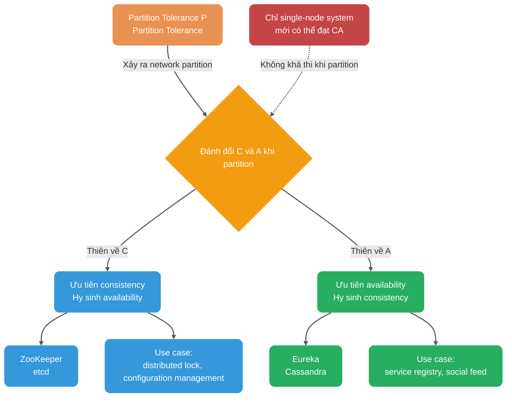
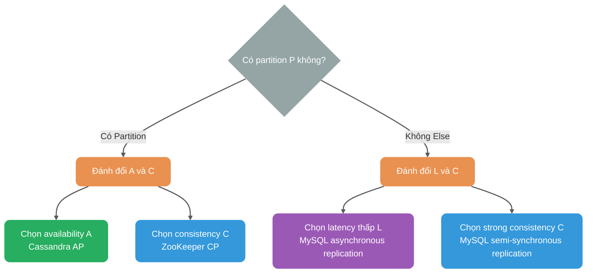
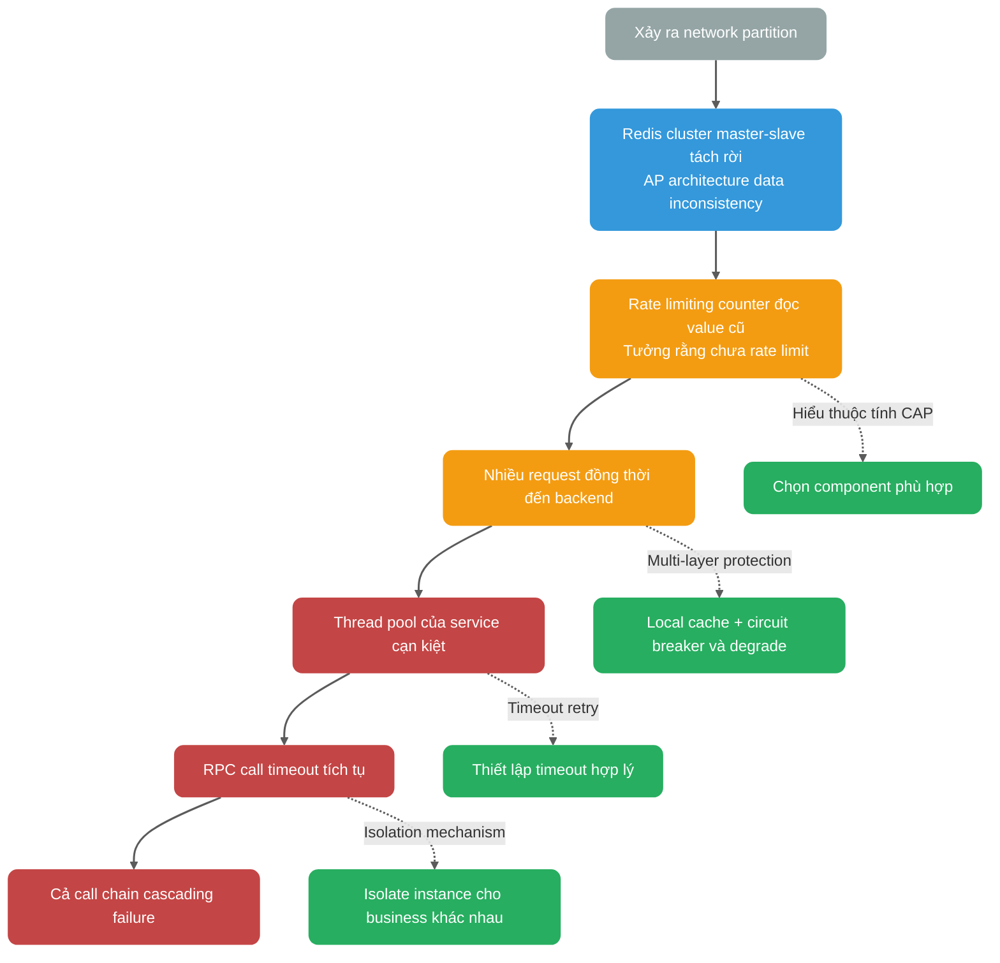
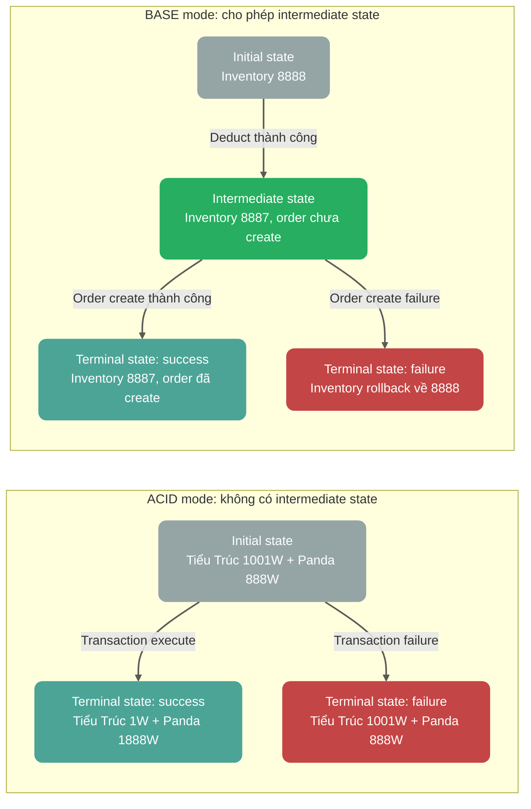
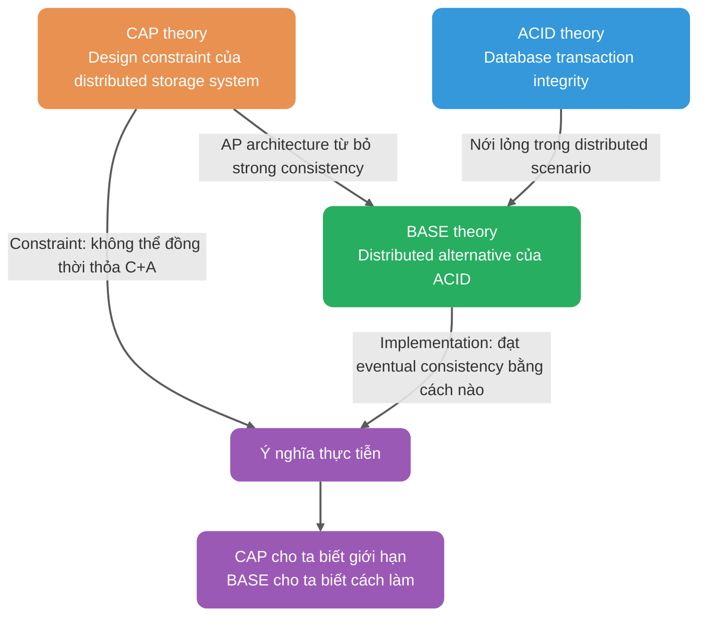

Những bạn từng trải qua technical interview hẳn không còn xa lạ với hai theory CAP & BASE!

Khi tham gia phỏng vấn năm xưa, không hề nói quá, chỉ cần hỏi đến nội dung liên quan đến distributed system thì interviewer gần như đều hỏi hai theory nền tảng này. Một là vì đây là kiến thức nền bắt buộc để học distributed system, hai là vì nhiều interviewer khá quen thuộc với chúng (dễ đặt câu hỏi).

Chúng ta rất cần hiểu rõ hai theory này và có thể dùng cách hiểu của mình để giải thích cho người khác.

Bài viết này chủ yếu giải quyết vấn đề “khi xảy ra partition, hệ thống sẽ đánh đổi như thế nào”. Nếu muốn tiếp tục hiểu vì sao các thiết kế Leader, Quorum, Lease, Gossip xuất hiện, bạn có thể đọc tiếp [Giải thích chi tiết về distributed coordination](./centralized-and-decentralized.md); nếu muốn xem cách triển khai eventual consistency ở phía nghiệp vụ, bạn có thể đọc tiếp [Giải pháp distributed transaction](../distributed-transaction.md).

## CAP theory

[CAP theory/theorem](https://zh.wikipedia.org/wiki/CAP%E5%AE%9A%E7%90%86) bắt nguồn từ năm 2000, do giáo sư Eric Brewer của University of California, Berkeley đề xuất tại hội thảo về nguyên lý distributed computing (PODC), vì vậy CAP theorem còn được gọi là **Brewer’s theorem**.

Hai năm sau, Seth Gilbert và Nancy Lynch của Massachusetts Institute of Technology công bố proof cho Brewer conjecture, từ đó CAP theory chính thức trở thành một theorem trong lĩnh vực distributed systems.

### Giới thiệu

CAP theorem thảo luận về Consistency (tính nhất quán), Availability (tính sẵn sàng) và Partition Tolerance (khả năng chịu partition).

> **Lưu ý quan trọng**: Bên dưới, cách gọi «thiên về CP / thiên về AP» chỉ dùng để mô tả trực giác. Theo định nghĩa nghiêm ngặt của CAP (C=Linearizability, A=mỗi node không lỗi đều phải response), nhiều system không thể được phân loại hoàn toàn rõ ràng: các operation khác nhau trong cùng một system có đặc điểm consistency/availability khác nhau, và nhiều system không thỏa CAP-C cũng không thỏa CAP-A.


Khi đề xuất CAP conjecture, Brewer không đưa ra định nghĩa nghiêm ngặt cho **Consistency**, **Availability** và **Partition Tolerance**.

Vì vậy, có nhiều cách diễn giải phổ biến về CAP; dưới đây là một trong những cách diễn giải phổ biến và được khuyến nghị hơn.

Trong theoretical computer science, CAP theorem chỉ ra rằng đối với một distributed system, khi thiết kế read/write operation, chỉ có thể đồng thời thỏa mãn hai trong ba điểm sau:

- **Consistency (tính nhất quán)**: Trong ngữ cảnh proof của Gilbert/Lynch (2002), consistency C của CAP là **Atomic Consistency**, thường được xem tương đương với **Linearizability (linear consistency)**. Tức là mọi operation được linearize theo thứ tự thời gian thực; ngay khi write operation hoàn tất, mọi read operation sau đó phải trả về value đã write (hoặc value mới hơn). **Lưu ý:** Consistency ở đây khác với Consistency (ràng buộc nhất quán) trong database ACID; latter chỉ trạng thái database trước và sau transaction phải thỏa integrity constraint.
- **Availability (tính sẵn sàng)**: Node không lỗi phải trả response cho mọi request (không xét response nhanh hay chậm). **Lưu ý**: Đây là định nghĩa nghiêm ngặt trong CAP theory, không bao gồm metric latency/SLA trong engineering (chẳng hạn “trả về trong 1s”).
- **Partition Tolerance (khả năng chịu partition)**: P trong CAP về bản chất giả định một asynchronous network (có thể latency/packet loss/partition), không phải một feature mà bạn “chọn có hay không”. Đánh đổi thực sự là: khi xảy ra partition, bạn phải lựa chọn giữa **linear consistency (Consistency=Linearizability trong CAP)** và **CAP-Availability (mọi node không lỗi đều phải trả response không lỗi cho request)**.

**Network partition là gì?**

Trong distributed system, network giữa nhiều node vốn đang connected, nhưng do một số failure (chẳng hạn network của một phần node gặp vấn đề), một số node không còn connected với nhau; toàn bộ network bị chia thành nhiều vùng. Đây gọi là **network partition**.


### Không phải “chọn 2 trong 3”

Khi giải thích theorem này, phần lớn mọi người thường nói đơn giản: “Bạn chỉ có thể đồng thời đạt được hai trong ba yếu tố consistency, availability, partition tolerance, không thể đạt cả ba”. Thực tế, đây là cách nói rất dễ gây hiểu lầm; hơn nữa, 12 năm sau khi CAP theory ra đời, cha đẻ của CAP đã viết lại paper trước đó vào năm 2012.

> **Khi xảy ra network partition, nếu muốn tiếp tục cung cấp service thì strong consistency và availability chỉ có thể chọn một.**
>
> Nói ngắn gọn: Partition Tolerance P trong CAP theory không nhất thiết phải thỏa mãn, nhưng khi chọn thỏa mãn P thì trên cơ sở đó chỉ có thể thỏa mãn Availability A hoặc Consistency C.

**Tại sao không thể chọn kiến trúc CA?**

Vì distributed system không thể tách rời network communication, còn network failure là trạng thái thường xuyên xảy ra:

- Heartbeat detection có thể packet loss do network jitter, dẫn đến phán đoán nhầm node failure.
- Trong quá trình data synchronization, packet loss có thể gây inconsistency; để đạt consistency, system liên tục retry và làm request bị block.

**Vì vậy, trong asynchronous network model (partition có thể xảy ra), khi partition xảy ra, phải đánh đổi giữa linear consistency và CAP-Availability.** Chỉ single-node system mới có thể bảo đảm CA: vì chỉ có một node nên sau khi write data thành công, mọi request đều thấy cùng một data; chỉ cần node này còn sống thì system vẫn available.

Hình dưới đây thể hiện core trade-off của CAP theory và xu hướng của một số system phổ biến:



Ở đây cần đưa vào **PACELC theory** (mở rộng của CAP) để giải thích toàn diện hơn:

PACELC theory do Daniel J. Abadi đề xuất chỉ ra: **nếu tồn tại partition (P), phải lựa chọn giữa availability (A) và consistency (C); nếu không (E, Else), phải lựa chọn giữa latency (L) và consistency (C).**



Ý nghĩa thực tế: ngay cả khi không có network partition, distributed system vẫn phải đánh đổi giữa latency thấp (asynchronous replication) và strong consistency (synchronous replication). Ví dụ:

- **Cassandra**: Có thể điều chỉnh consistency level của read/write (ONE/QUORUM/ALL) để đánh đổi giữa latency và consistency.
- **MySQL master-slave**: Có thể chọn asynchronous replication (latency thấp) hoặc semi-synchronous replication (strong consistency).

ZooKeeper và HBase là kiến trúc CP, Cassandra và Eureka là kiến trúc AP, còn Nacos hỗ trợ cả kiến trúc CP lẫn AP.

**Điểm then chốt khi chọn CP hay AP nằm ở business scenario hiện tại, không có đáp án cố định**: chẳng hạn, scenario cần bảo đảm strong consistency như distributed lock và configuration management sẽ chọn CP; scenario ưu tiên high availability như service registry của microservice sẽ chọn AP.

**Ngoài ra, cần bổ sung một điểm**: khi không có partition, có thể đồng thời đạt linear consistency và CAP-Availability “có response”; nhưng trong engineering thường vẫn phải đánh đổi giữa latency và consistency (đây là nội dung phần ELC trong PACELC theory).

### Phạm vi áp dụng của CAP theory

**Kết luận quan trọng**: CAP theory chủ yếu thảo luận trade-off giữa consistency và availability của một data object trong scenario replication.

| Gần với model thảo luận của CAP         | Cần phân tích ở cấp shard/object/operation                           |
| --------------------------------------- | -------------------------------------------------------------------- |
| Redis master-slave/sentinel cluster     | Business system (stateless service)                                  |
| MySQL master-slave/multi-master cluster | Redis-Cluster (mỗi shard vẫn có replica)                             |
| MongoDB replica set                     | MongoDB-Cluster (sharding và replica cùng tồn tại)                   |
| ZooKeeper, etcd                         | Database sharding (cross-shard transaction cần coordination bổ sung) |
| Kafka, RocketMQ                         | Phần lớn microservice application\*                                  |

**Giải thích**:

- **CAP discussion model**: ngữ nghĩa replication của một read/write register đơn lẻ (single register).
- **Complex system**: cần tách ra để thảo luận ngữ nghĩa consistency của “từng object/partition/operation”.
- **Sharding + replica**: mỗi shard của sharding system thường vẫn có replica, nên trade-off consistency và availability vẫn tồn tại.

> **Mối liên hệ sâu giữa business system và CAP**:
>
> Bản thân business system tuy không liên quan đến replica synchronization, nhưng **chịu ảnh hưởng sâu sắc từ thuộc tính CAP của component bên dưới**. Bỏ qua điểm này có thể khiến system xảy ra cascading failure khi gặp network partition.
>
> **Business scenario chịu ảnh hưởng của thuộc tính CAP**:
>
> | Business scenario                 | Component bên dưới                         | Ảnh hưởng của CP component                           | Ảnh hưởng của AP component                      |
> | --------------------------------- | ------------------------------------------ | ---------------------------------------------------- | ----------------------------------------------- |
> | RPC routing                       | Service registry (chẳng hạn Nacos CP mode) | Không available trong lúc đăng ký, request bị reject | Có thể route đến instance đã offline, cần retry |
> | Distributed lock                  | Redis (AP) / ZooKeeper (CP)                | Performance thấp hơn nhưng đáng tin cậy              | Performance cao nhưng lock có thể mất hiệu lực  |
> | Rate limiting và circuit breaking | Redis counter                              | Có thể đọc counter cũ, rate limiting mất hiệu lực    | Như bên trái                                    |
> | Cache update                      | Redis master-slave                         | Có thể mất data khi chuyển master                    | Như bên trái                                    |
> | Message consumption               | Kafka                                      | Đồng bộ consumer progress chậm, consume trùng        | Như bên trái                                    |
>
> **Khuyến nghị thực tiễn**: Business developer không cần “thực hành” CAP theory, nhưng **bắt buộc phải hiểu CAP theory** để:
>
> - Chọn component phù hợp cho các business scenario khác nhau (CP hoặc AP).
> - Hiểu đặc điểm hành vi của component đã chọn khi network partition xảy ra.
> - Thiết kế fault tolerance mechanism phù hợp với business requirement (retry, circuit breaker, degrade).

Nhiều developer cho rằng mình đang “thực hành CAP theory”, nhưng thực tế chỉ đang lựa chọn trên các component có sẵn (dùng CP hay AP), chứ không thực sự thực hành theory này. Người thực sự cần thực hành CAP là engineer phát triển các distributed storage component như Redis và MySQL.

### Áp dụng tư tưởng CAP trong business

Ngoài việc phát triển distributed storage component, trong business development, phần lớn là **lựa chọn** architecture phù hợp chứ không phải bản thân việc thực hành CAP theory:

| Scenario                          | Lựa chọn thiên về CP                         | Lựa chọn thiên về AP                        | Business trade-off                          |
| --------------------------------- | -------------------------------------------- | ------------------------------------------- | ------------------------------------------- |
| Database master-slave replication | Synchronous replication (strong consistency) | Asynchronous replication (high performance) | Data consistency vs response speed          |
| Distributed lock implementation   | ZooKeeper (strong consistency)               | Redis (high performance)                    | Lock reliability vs acquisition speed       |
| Service registry                  | ZooKeeper, Consul (CP mode)                  | Eureka, Nacos (AP mode)                     | Registry accuracy vs discovery availability |
| Rate limiting counter             | Redis (strong consistency command)           | Redis (cho phép expired)                    | Rate limiting precision vs performance      |

**Nguyên tắc lựa chọn**:

- **Quan tâm performance**: Ưu tiên component cho phép asynchronous replication; write vào master node là có thể trả success, response nhanh, nhưng có risk mất data/đọc phải data cũ nên cần kết hợp retry mechanism.
- **Quan tâm data safety**: Ưu tiên component yêu cầu majority confirmation; write phải chờ quorum node confirm, response chậm hơn nhưng có thể giảm risk mất data.

**Lưu ý**: Việc có mất data hay không phụ thuộc nhiều hơn vào persistence, replication confirmation strategy và failure model, không thể đơn giản phán đoán bằng “nhãn CP/AP”.

**Case cascading failure**:

Một scenario cascading failure điển hình do bỏ qua CAP:



**Biện pháp bảo vệ**:

1. **Hiểu thuộc tính CAP của component bên dưới**: Biết hành vi của component khi network partition xảy ra.
2. **Multi-layer protection**: Không chỉ phụ thuộc vào một component duy nhất, mà kết hợp local cache, circuit breaker và degrade.
3. **Timeout và retry**: Thiết lập timeout hợp lý, tránh chờ vô hạn.
4. **Isolation mechanism**: Business khác nhau sử dụng instance của component bên dưới khác nhau, tránh failure lan rộng.

### Case áp dụng CAP thực tế

Ở đây tôi dùng service registry để thảo luận về ứng dụng thực tế của CAP. Vì nhiều bạn chưa biết service registry dùng để làm gì, ở đây sẽ lấy Dubbo làm ví dụ đơn giản.

Hình dưới đây là architecture diagram của Dubbo. **Service registry Registry đóng vai trò gì trong đó? Cung cấp service nào?**

Service registry chịu trách nhiệm register và tìm kiếm service address, tương đương directory service. Service provider và consumer chỉ tương tác với service registry lúc startup; service registry không forward request nên pressure tương đối thấp.


Các component phổ biến có thể làm service registry gồm: ZooKeeper, Eureka, Nacos...

#### ZooKeeper 3.8.x (CP architecture)

ZooKeeper thiên về **CP architecture**. ZooKeeper 3.x cung cấp **Linearizable Writes** thông qua ZAB protocol, nhưng read behavior cần được phân biệt:

- **Sync read**: Bắt buộc synchronize với Leader, bảo đảm linear consistency (Linearizability).
- **Read thông thường**: Mặc định cung cấp **Sequential Consistency**, bảo đảm thứ tự của global update operation; trong cùng một session, client view tuyệt đối không rollback, nhưng có thể đọc phải data hơi cũ (tồn tại read lag).

> **Khác biệt quan trọng**: Sequential consistency ≠ eventual consistency. Read thông thường của ZooKeeper bảo đảm mọi client nhìn thấy cùng **thứ tự update** (global zxid order), chỉ là tồn tại read lag; còn eventual consistency không bảo đảm global order, chỉ bảo đảm cuối cùng converge. Default read của ZK gần với read “stale-but-ordered” (sequential/session guarantee rất mạnh), chứ không phải ngữ cảnh eventual consistency kiểu Dynamo.

Trong thời gian Leader election hoặc khi số Follower node không đủ Quorum (N/2+1), ZooKeeper sẽ reject service để duy trì consistency, biểu hiện là unavailable (hy sinh A).

Khi deploy nhiều node, cluster sử dụng Quorum mode: majority node (n/2+1) phải đồng ý với change thì change mới có hiệu lực.

ZooKeeper cung cấp Watcher mechanism (async notification khi có change) và version number mechanism (zxid kiểm tra freshness) để giảm read lag.

Failure path và state machine behavior:

| Failure scenario                          | System state                              | Client behavior                                                                                |
| ----------------------------------------- | ----------------------------------------- | ---------------------------------------------------------------------------------------------- |
| Quorum failure (hơn một nửa node failure) | **LOOKING** state, đang Leader election   | Write request bị reject, read request có thể trả data cũ hoặc timeout                          |
| Follower và Leader partition              | Follower vào **ELECTION** state           | Follower này không thể tham gia vote nhưng có thể trả read (data lag)                          |
| Leader partition với majority             | Leader tự downgrade, cluster election lại | Write của Leader cũ bị mất, client cần retry (phát hiện zxid rollback)                         |
| Mất Watcher                               | Do network jitter hoặc GC pressure        | Client cần retry (exponential backoff + Jitter), monitor queue `Watches` để chống backpressure |

#### Eureka (AP architecture)

Eureka sử dụng AP architecture: các node peer-to-peer, giữ data consistency thông qua Peer replication/synchronization (periodic full pull + incremental update), không có Leader election. **Lưu ý**: Trong hệ sinh thái Spring Cloud, dạng dependency 1.x từng phổ biến hơn; Netflix/eureka 2.x vẫn đang được maintain và release liên tục.

Failure path và state machine behavior:

| Failure scenario                                       | System state                                             | Client behavior                                                                                                                                         | Self-preservation mechanism                                                                                                 |
| ------------------------------------------------------ | -------------------------------------------------------- | ------------------------------------------------------------------------------------------------------------------------------------------------------- | --------------------------------------------------------------------------------------------------------------------------- |
| Network partition (split-brain)                        | Hai phía partition **chạy độc lập**, đều read/write được | Client có thể đọc registry information cũ (inconsistency window = heartbeat interval 30s + gossip propagation latency, P99 <60s trong topology 10 node) | Khi renewal threshold < 85% thì trigger **self-preservation**, tạm dừng loại instance để tránh “kill nhầm” healthy instance |
| Một nửa node failure                                   | Node còn lại tiếp tục service nhưng data có thể diverge  | Read operation bình thường, write có thể chỉ tồn tại trên minority node                                                                                 | Trigger self-preservation, sau khi node phục hồi sẽ tự merge qua gossip                                                     |
| Node restart tạm thời                                  | Batch pull registry từ Peer (Registry Fetch)             | Service discovery tạm thời unavailable (< 1min), cache phát huy tác dụng                                                                                | Normal mode, tự động recovery                                                                                               |
| Registration storm (nhiều instance register đồng thời) | Write queue tích tụ, có thể làm request bị drop          | Một phần registration request timeout, client cần retry                                                                                                 | Có thể cấu hình rate limiting và backpressure (chẳng hạn Ribbon retry strategy)                                             |

**Giải thích chi tiết self-preservation mechanism**:

Eureka Server xác định có vào self-preservation hay không thông qua logic sau:

```
Expected renewal mỗi phút E = số instance hiện tại N × (60 / số giây của heartbeat interval)
Threshold T = E × 0.85
Nếu số renewal thực tế R trong 1 phút gần nhất < T, thì vào self-preservation: tạm dừng eviction
(E/T được update theo N trong mỗi fixed period, period phổ biến khoảng 15 phút)
```

Khi heartbeat interval mặc định là 30 giây, số renewal kỳ vọng mỗi phút = số instance × 2.

Khi `actual renewal rate < 85%`:

1. Vào mode **SELF PRESERVATION**.
2. Dừng loại instance hết hạn (EvictionTask pause).
3. Log output: `ENTER SELF PRESERVATION MODE`.

**Trade-off trong thiết kế**: Thà giữ lại instance “zombie” còn hơn kill nhầm instance healthy, vì trong microservice scenario, service degrade tạm thời vẫn tốt hơn việc service unavailable trên quy mô lớn. Client thường cấu hình retry và circuit breaker để xử lý instance unavailable.

#### Tóm tắt

Việc chọn CP hay AP phụ thuộc vào scenario: ZooKeeper phù hợp với requirement strong consistency, chẳng hạn configuration management; Eureka phù hợp với service registry có high availability, chẳng hạn microservice discovery.

Nacos hỗ trợ cả CP lẫn AP.

### Tóm tắt

CAP theory chỉ dẫn rằng: với tiền đề distributed system có thể xuất hiện network partition (P), chúng ta phải đánh đổi giữa strong consistency (C) và high availability (A).

- **CP architecture**: Hy sinh availability, bảo đảm strong consistency. Phù hợp với scenario yêu cầu data consistency rất cao (chẳng hạn financial transaction, distributed lock).
- **AP architecture**: Hy sinh consistency, bảo đảm high availability. Phù hợp với scenario yêu cầu availability của system cao và có thể chấp nhận data inconsistency tạm thời (chẳng hạn social feed, product search).
- **PACELC**: Khi không có partition (E), cần đánh đổi giữa latency (L) và consistency (C).

### Đọc thêm

1. [CAP theorem simplified](https://medium.com/@ravindraprasad/cap-theorem-simplified-28499a67eab4) (tiếng Anh, case thú vị)
2. [CAP theory thần kỳ được áp dụng ở đâu](https://juejin.im/post/6844903936718012430) (tiếng Trung, liệt kê nhiều ví dụ thực tế)
3. [Hãy dừng gọi database là CP hoặc AP](https://martin.kleppmann.com/2015/05/11/please-stop-calling-databases-cp-or-ap.html) (tiếng Anh, mang đến một góc nhìn khác)

## BASE theory

[BASE theory](https://dl.acm.org/doi/10.1145/1394127.1394128) bắt nguồn từ năm 2008, do architect Dan Pritchett của eBay công bố trên ACM, với title paper là “Base: An ACID Alternative”.

> **Insight then chốt**: Nhìn từ title của paper, có thể thấy **BASE trước hết là alternative của ACID**. Tuy nhiên cần lưu ý rằng BASE cũng có mối liên hệ chặt chẽ với CAP theory: **eventual consistency chính là nguyên tắc chỉ dẫn để AP architecture trong CAP đạt convergence trong engineering practice**.

### Giới thiệu

**BASE** là acronym của ba cụm từ **Basically Available (cơ bản available)**, **Soft-state (soft state)** và **Eventually Consistent (eventual consistency)**. BASE theory bắt nguồn từ việc tổng kết distributed practice của các internet system quy mô lớn.

### Quan hệ giữa BASE và ACID

Để hiểu BASE theory, trước hết cần nhìn lại **Consistency** trong ACID theory:

**Định nghĩa consistency của ACID**: Trước và sau khi transaction execute, database chỉ có thể chuyển từ một consistent state sang một consistent state khác.

Lấy việc transfer money làm ví dụ: Tiểu Trúc chuyển 1000W cho Panda.

- **Initial state**: Tiểu Trúc 1001W, Panda 888W, tổng cộng 1889W.
- **Result state**: Tiểu Trúc 1W, Panda 1888W, tổng cộng 1889W.

Dù transaction thành công hay failure, thay đổi của toàn bộ data phải consistency, tương tự law of conservation of energy.

**Thách thức trong distributed scenario**:

Trong distributed system, product service và order service được deploy tách rời; [deduct inventory, create order] cần gọi qua network, giữa chúng tất nhiên tồn tại time gap:

```
Thời điểm T1: Inventory 8888 → 8887 (deduct thành công)
Thời điểm T2: Network call đến order service...
Thời điểm T3: Order create thành công
```

Trong T1~T3, system ở **intermediate state**: inventory đã giảm nhưng order chưa được create. Sau khi tách thành các service, không thể dùng single-database ACID transaction để bảo đảm atomic commit và isolation toàn cục; system khách quan sẽ tồn tại intermediate state. BASE chấp nhận intermediate state và dùng compensation/retry để cuối cùng converge state.

**Giải pháp của BASE theory**:

BASE theory thừa nhận và cho phép intermediate state này tồn tại:

- **Soft-state**: Cho phép data trong system tồn tại intermediate state và cho rằng intermediate state này không ảnh hưởng đến availability tổng thể của system.
- **Eventually consistent**: Intermediate state cuối cùng sẽ chuyển thành terminal state (hoặc success hoặc rollback).

Hình so sánh dưới đây giúp hiểu trực quan sự khác nhau giữa ACID và BASE trong transaction processing:



Vì vậy, **BASE theory là alternative của ACID trong distributed scenario**, chứ không phải phần bổ sung cho CAP theory.

### Ba yếu tố của BASE theory


#### Basically Available

Basically Available nghĩa là distributed system được phép hy sinh một phần availability khi xảy ra failure không thể dự đoán. Tuy nhiên, điều này tuyệt đối không tương đương với system unavailable.

**“Cho phép hy sinh một phần availability” nghĩa là gì?**

- **Hy sinh response time**: Trong điều kiện bình thường, xử lý request của user cần 0.5s để trả result, nhưng vì system failure, thời gian xử lý request tăng thành 3s.
- **Hy sinh system function**: Trong điều kiện bình thường, user có thể sử dụng toàn bộ function của system, nhưng vì traffic đột ngột tăng mạnh, một phần non-core function của system không thể sử dụng.

#### Soft state

Soft state là cho phép data trong system tồn tại intermediate state và cho rằng intermediate state này không ảnh hưởng đến availability tổng thể của system.

> **Khác biệt với ACID**: ACID theory yêu cầu transaction lập tức vào terminal state (success hoặc failure) sau khi execute, không cho phép intermediate state; BASE theory thừa nhận intermediate state là tồn tại khách quan của distributed system, chỉ cần intermediate state cuối cùng chuyển thành terminal state là đủ.

Ví dụ:

- **ACID mode**: Trong bank transfer transaction, deduct và credit phải cùng success hoặc cùng failure, không cho phép intermediate state “deduct thành công nhưng credit chưa hoàn tất”.
- **BASE mode**: Trong e-commerce order transaction, cho phép intermediate state “inventory đã giảm nhưng order chưa create” tồn tại, chỉ cần cuối cùng đạt consistency (hoặc order create thành công, hoặc inventory rollback).

#### Eventual consistency

Eventual consistency nhấn mạnh: **nếu system không có update operation mới trong một khoảng thời gian, mọi replica cuối cùng sẽ converge về cùng một value.**

Cần lưu ý rằng từ “eventual consistency” có ý nghĩa khác nhau trong hai ngữ cảnh:

| Ngữ cảnh                                  | Ý nghĩa                                                              | Scenario điển hình                            |
| ----------------------------------------- | -------------------------------------------------------------------- | --------------------------------------------- |
| **Replica storage (CAP context)**         | Replica data cuối cùng đồng bộ consistency                           | Cassandra data replication                    |
| **Transaction state (BASE/ACID context)** | Transaction intermediate state cuối cùng chuyển thành terminal state | Distributed transaction (chẳng hạn TCC, Saga) |

**Eventual consistency của replica storage**:

“Một khoảng thời gian” không được xác định cụ thể, có thể ở mức millisecond (LAN synchronization) hoặc minute (cross-region replication). Trong production environment, cần chủ động đẩy nhanh convergence thông qua **Read Repair**, **Anti-Entropy (anti-entropy/background synchronization)** hoặc **Quorum write**.

**Eventual consistency của transaction state**:

Lấy distributed transaction làm ví dụ: [deduct inventory, create order, deduct balance]

- Thời điểm T1: Inventory đã deduct (intermediate state).
- Thời điểm T2: Order đã create (intermediate state).
- Thời điểm T3: Balance đã deduct (terminal state: transaction success).

Hoặc trong failure scenario:

- Thời điểm T1: Inventory đã deduct (intermediate state).
- Thời điểm T2: Order create failure (trigger rollback).
- Thời điểm T3: Inventory rollback (terminal state: transaction failure).

System sẽ bảo đảm đạt state data consistency trong một khoảng thời gian nhất định, không cần bảo đảm strong consistency của system data theo thời gian thực.

Ba level của distributed consistency:

1. **Strong consistency**: System write gì thì read ra đúng cái đó.
2. **Weak consistency**: Không nhất thiết read được value vừa write mới nhất, cũng không bảo đảm sau bao lâu sẽ read được data mới nhất; chỉ cố gắng bảo đảm data đạt consistent state tại một thời điểm nào đó.
3. **Eventual consistency**: Bản nâng cấp của weak consistency; system bảo đảm đạt consistent state trong một khoảng thời gian nhất định.

**Trong industry, eventual consistency thường được ưa chuộng hơn, nhưng một số scenario có yêu cầu data consistency cực kỳ nghiêm ngặt, chẳng hạn bank transfer, vẫn cần bảo đảm strong consistency.**

Vậy các cách cụ thể để implement eventual consistency là gì?

- **Read repair (Read Repair)**: Khi read data, detect inconsistency và repair. Phù hợp với scenario read nhiều write ít.
- **Write repair (Hinted Handoff)**: Khi write data, nếu target node unavailable thì cache data lại, đợi node recovery rồi retransmit. **Write repair** tối ưu write latency nhưng làm tăng risk inconsistency khi read (data có thể vẫn ở trong cache queue và chưa persist xuống target node).
- **Async repair (Anti-Entropy/anti-entropy)**: So sánh và repair difference giữa các replica ở background. Thách thức then chốt trong engineering implementation là **detect data difference hiệu quả**: brute-force compare từng record (O(n)) không khả thi trên large data set; production system dùng **Merkle Tree** để locate difference với overhead thấp.

**Khuyến nghị lựa chọn**:

- **Write repair**: Phù hợp với write nhiều read ít, tối ưu write performance nhưng hy sinh inconsistency window.
- **Read repair**: Phù hợp với read nhiều write ít, bảo đảm read data chính xác.
- **Anti-Entropy**: Đóng vai trò bảo đảm ở background, phù hợp với scenario data scale lớn nhưng yêu cầu eventual consistency cao.

### Tại sao nhiều người xem BASE là phần bổ sung của CAP?

Đây là cách nói **đúng một phần nhưng chưa đủ chính xác**. Cách hiểu chính xác hơn là:

1. **BASE trước hết là alternative của ACID**: Từ title [“Base: An ACID Alternative”](https://spawn-queue.acm.org/doi/10.1145/1394127.1394128) của paper có thể thấy mục đích ban đầu của BASE theory là giải quyết vấn đề ACID quá strict trong distributed transaction scenario.

2. **BASE có mối liên hệ nội tại với AP architecture của CAP**:

   - Chọn AP architecture nghĩa là từ bỏ strong consistency (C).
   - Sau khi từ bỏ strong consistency, system đạt convergence bằng cách nào? Câu trả lời là **eventual consistency**.
   - Vì vậy, BASE theory (đặc biệt là eventual consistency) là nguyên tắc chỉ dẫn **bắt buộc phải áp dụng** khi AP architecture được triển khai trong engineering practice.

3. **Nguồn gốc của hiểu lầm**: Nhiều người hiểu nhầm “BASE liên quan đến AP” thành “BASE là phần bổ sung của CAP”. Thực tế:
   - **BASE không phải phần bổ sung hoặc sửa đổi của CAP theory**.
   - **BASE là engineering practice guide cho AP architecture**: khi đã chọn AP, BASE chỉ dẫn cách làm cho system cuối cùng đạt consistency trong engineering practice.

**Cách hiểu đúng**:



| Dimension            | CAP theory                                 | BASE theory                                                                             |
| -------------------- | ------------------------------------------ | --------------------------------------------------------------------------------------- |
| Lĩnh vực quan tâm    | Distributed storage system (có replica)    | Mọi distributed system                                                                  |
| Ý nghĩa consistency  | Data consistency (replica synchronization) | State consistency (transaction terminal state)                                          |
| Ý nghĩa availability | System available khi node failure          | Một phần function available khi một phần node failure                                   |
| Quan hệ cốt lõi      | -                                          | ① Distributed alternative của ACID<br/>② Engineering practice guide của AP architecture |

> **Ý nghĩa thực tiễn**: CAP cho ta biết không thể bảo đảm strong consistency trong AP architecture; BASE cho ta biết cách dùng eventual consistency để system đạt convergence trong AP architecture. Hai theory có quan hệ **constraint và implementation**, không phải quan hệ bổ sung.

Nếu CAP là design constraint của distributed storage system (cho biết không thể làm gì), thì BASE là practice guide của distributed system (đặc biệt là business system, cho biết nên làm thế nào): **phần lớn application scenario không cần strong consistency; chấp nhận intermediate state và cuối cùng đạt consistency là lựa chọn thực tế hơn.**

### Tóm tắt

**ACID là theory về database transaction integrity, CAP là design theory của distributed storage system, BASE là alternative của ACID trong distributed scenario và đồng thời là engineering practice guide của AP architecture.**

> **Quan hệ tương ứng then chốt**:
>
> - **Consistency của CAP** = data consistency (data synchronization giữa các replica node).
> - **Consistency của BASE** = state consistency (consistency của transaction terminal state) = consistency của ACID.
> - **Availability của CAP** = availability của master-slave cluster (system vẫn available khi node failure).
> - **Availability của BASE** = availability của sharded cluster (node failure một phần chỉ ảnh hưởng đến một phần user).
> - **Quan hệ giữa CAP và BASE**: Sau khi chọn AP architecture, BASE theory chỉ dẫn cách đạt convergence của system thông qua eventual consistency trong engineering practice.

<!-- @include: @article-footer.snippet.md -->
