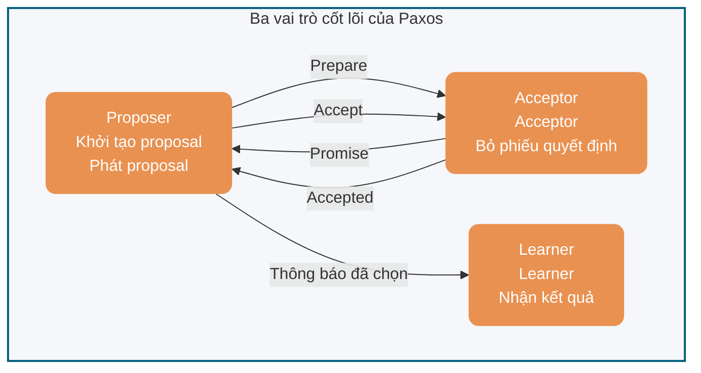
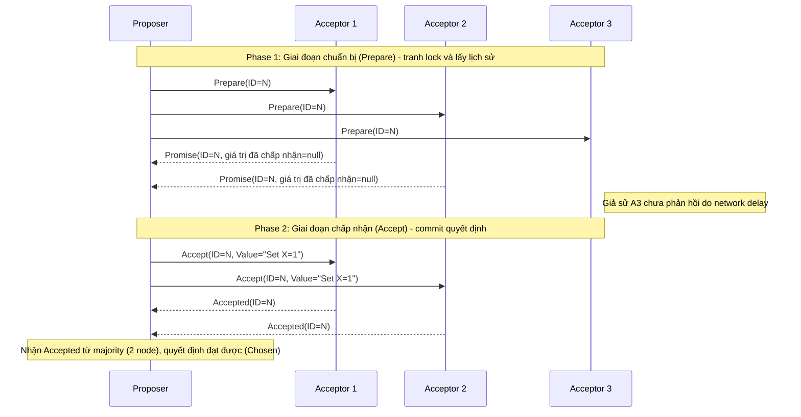
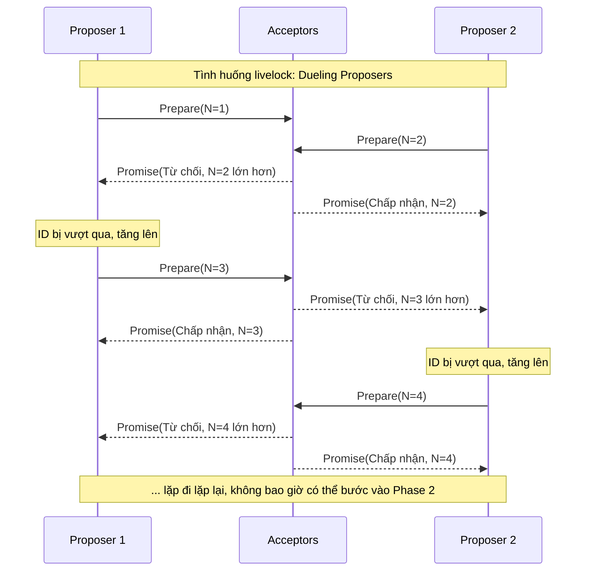
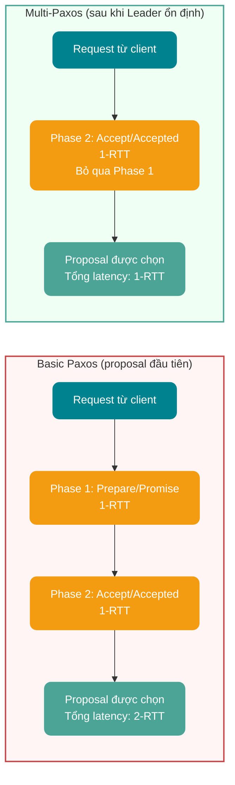
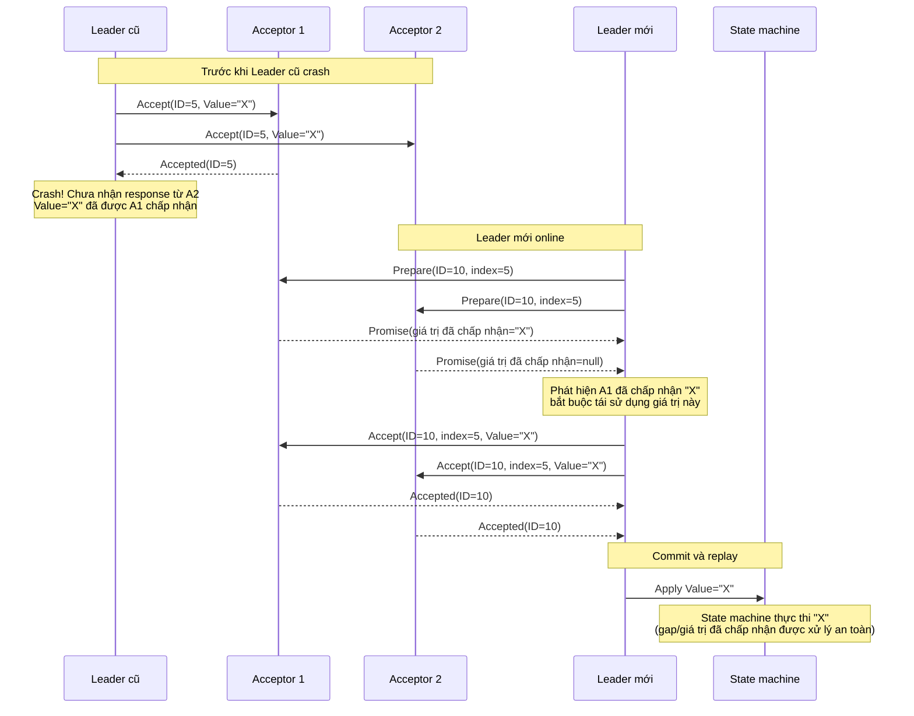
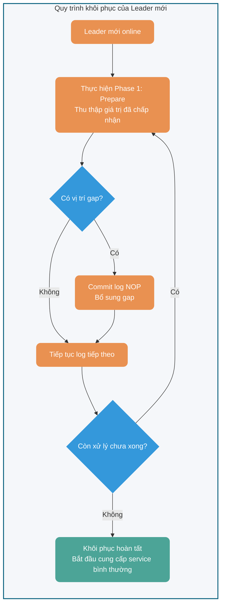

## Bối cảnh

Thuật toán Paxos là một thuật toán **consensus** của hệ thống phân tán do Leslie Lamport đề xuất vào năm **1990**. Đây là một trong những thuật toán consensus phân tán đầu tiên được công nhận rộng rãi (với điều kiện không xảy ra vấn đề các tướng Byzantine, tức là không có node độc hại).

Để giới thiệu thuật toán Paxos, Lamport đã viết riêng một bài báo hài hước và thú vị. Trong bài báo này, ông hư cấu một thành bang Hy Lạp tên là Paxos để giới thiệu thuật toán Paxos một cách trực quan hơn.

Tuy nhiên, các reviewer không đánh giá cao sự hài hước của bài báo. Vì vậy, họ nói với Lamport: “Nếu muốn bài báo này được xuất bản thành công, anh phải xóa toàn bộ bối cảnh câu chuyện liên quan đến Paxos”. Lamport nghe vậy thì không vui: “Tại sao tôi phải sửa? Các reviewer này đúng là thiếu tế bào hài hước, không xuất bản được thì thôi!”.

Vì thế, bài báo đề xuất thuật toán Paxos khi đó đã không được xuất bản thành công.

Mãi đến năm 1998, hai nhà nghiên cứu kỹ thuật của Systems Research Center (SRC) cần tìm một số thuật toán phân tán phù hợp để phục vụ hệ thống phân tán họ đang xây dựng. Thuật toán Paxos vừa hay có thể giải quyết một phần nhu cầu của họ. Vì vậy, Lamport đã gửi bài báo cho họ. Sau khi đọc, hai chuyên gia này thấy bài báo khá hay. Do đó, vào **1998**, Lamport đã xuất bản lại bài báo [《The Part-Time Parliament》](http://lamport.azurewebsites.net/pubs/lamport-paxos.pdf).

Sau khi bài báo được xuất bản, nhiều học giả kêu rằng không thể hiểu nổi, trong lời nói còn có chút ý trêu chọc. Sao có thể chịu được chuyện này? Năm **2001**, Lamport lại viết riêng bài báo [《Paxos Made Simple》](http://lamport.azurewebsites.net/pubs/paxos-simple.pdf) để đơn giản hóa phần giới thiệu về Paxos, chủ yếu trình bày phần consensus hai giai đoạn và tiện thể không quên châm biếm nhóm học giả này.

Bài báo 《Paxos Made Simple》 chỉ dài 14 trang, ngắn gọn hơn nhiều so với 33 trang của 《The Part-Time Parliament》. Quan trọng nhất là phần tóm tắt của bài báo này chỉ có một câu:


> The Paxos algorithm, when presented in plain English, is very simple.

Ý dịch đại khái là: Khi tôi mô tả thuật toán Paxos bằng tiếng Anh không hoa mỹ, nó thực sự rất đơn giản!

Bạn có cảm nhận được sự châm biếm đầy ắp từ chuyên gia Lamport không?

## Giới thiệu

Bài viết này chia Paxos thành hai phần:

- **Thuật toán Basic Paxos**: mô tả cách nhiều node đạt consensus về một giá trị đơn lẻ (value).
- **Tư tưởng Multi-Paxos**: thực thi nhiều instance Basic Paxos để đạt consensus về một chuỗi giá trị.

Vai trò của thuật toán consensus là giúp nhiều node trong hệ thống phân tán đạt đồng thuận về một proposal nào đó. “Proposal” có thể chỉ nhiều loại đối tượng khác nhau trong các hệ thống khác nhau, chẳng hạn bầu leader, sắp xếp sự kiện đều có thể là proposal.

Do thuật toán Paxos được công nhận là khó hiểu và khó triển khai, năm 2013 đã ra đời [thuật toán Raft](./raft-algorithm.md) dễ hiểu hơn.

**Về mối quan hệ giữa Raft và Paxos**: Về mặt học thuật, Raft không phải là biến thể chặt chẽ của Paxos — hai thuật toán có khác biệt bản chất trong triết lý thiết kế bên trong (như log gap, quyền hạn của Leader). Nhưng về mặt thực tiễn kỹ thuật, thiết kế của Raft bắt nguồn từ Multi-Paxos, có thể hiểu là “thiết kế lại lấy cảm hứng từ Multi-Paxos”. Phần sau của bài viết sẽ so sánh chi tiết sự khác biệt giữa hai thuật toán.

Trong các tình huống không Byzantine (không có node độc hại), ngoài Raft, **giao thức ZAB**, **Fast Paxos** và các thuật toán consensus khác đều là những cải tiến dựa trên Paxos.

Trong các tình huống Byzantine (có node độc hại), thường sử dụng các thuật toán consensus như **Proof-of-Work (PoW)**, **Proof-of-Stake (PoS)**, với ứng dụng điển hình là hệ thống blockchain.

## Thuật toán Basic Paxos

### Định nghĩa vai trò

Basic Paxos có 3 vai trò quan trọng:

1. **Proposer**: còn có thể gọi là coordinator, chịu trách nhiệm tiếp nhận request từ client và khởi tạo proposal. Thông tin proposal thường gồm proposal ID và giá trị được đề xuất (value).
2. **Acceptor**: còn có thể gọi là voter, chịu trách nhiệm bỏ phiếu cho proposal và phải ghi nhớ lịch sử bỏ phiếu của mình.
3. **Learner**: chịu trách nhiệm học (learn) giá trị đã được chọn. Trong triển khai replicated state machine (RSM), giá trị này thường tương ứng với một command đang chờ thực thi; state machine sẽ apply command theo thứ tự rồi lớp service đối ngoại trả về kết quả.


**Sơ đồ tương tác giữa các vai trò**:



Để giảm số node cần thiết khi triển khai thuật toán, một node có thể kiêm nhiều vai trò. Ngoài ra, để một proposal được chọn, nó phải được hơn một nửa số Acceptor chấp nhận. Nhờ vậy, thuật toán Basic Paxos vẫn có khả năng chịu lỗi: khi ít hơn một nửa số node gặp sự cố, cluster vẫn có thể hoạt động bình thường.

### Quy trình thực thi Basic Paxos

Basic Paxos đạt consensus qua hai giai đoạn: giai đoạn **Prepare/Promise** và giai đoạn **Accept/Accepted**.



#### Phase 1: Prepare/Promise

Proposer chọn một proposal ID n (phải duy nhất trên toàn hệ thống và tăng dần), rồi gửi request `Prepare(n)` đến hơn một nửa số Acceptor.

**Logic xử lý của Acceptor** (logic xử lý với mỗi proposal ID n):

- Nếu n > proposal ID lớn nhất max_n mà Acceptor đã thấy
  - Trả về `Promise(n, max_v)`, trong đó max_v là giá trị của proposal có ID lớn nhất đã được chấp nhận trước đó (nếu có)
  - Cam kết không chấp nhận proposal có ID < n nữa
- Nếu n ≤ max_n
  - Từ chối hoặc bỏ qua request này

**Mục đích**: giúp Proposer biết các proposal hiện đã được chấp nhận hoặc sắp được chấp nhận trong hệ thống, tránh đề xuất giá trị xung đột.

#### Phase 2: Accept/Accepted

Khi nhận được response Promise từ hơn một nửa số Acceptor, Proposer chọn giá trị max_v lớn nhất trong các response (nếu không có thì tùy ý chọn một giá trị), rồi gửi request `Accept(n, v)` đến hơn một nửa số Acceptor.

**Logic xử lý của Acceptor**:

- Nếu n ≥ max_n mà Acceptor đã cam kết ở Phase 1
  - Chấp nhận proposal, ghi lại (n, v) và trả về `Accepted(n, v)`
- Nếu không
  - Từ chối request này

#### Điều kiện hội tụ

Khi nhận được response `Accept(n, v)` từ hơn một nửa số Acceptor, proposal v được **chọn (chosen)**. Proposer thông báo cho tất cả Learner rằng proposal đã được chọn.

### Đảm bảo an toàn

Basic Paxos đảm bảo các tính chất an toàn sau:

1. **Tính nhất quán**: một khi một giá trị được chọn, mọi giá trị được chọn sau đó đều là giá trị này
2. **Tính kết thúc**: nếu không có Proposer cạnh tranh và việc truyền thông đáng tin cậy, cuối cùng sẽ chọn được một giá trị

**Cơ chế cốt lõi**: thông qua việc thu thập Promise ở Phase 1, Proposer chỉ có thể chọn giá trị mà các Acceptor đã cam kết (hoặc chọn giá trị mới), nhờ đó đảm bảo không có các giá trị xung đột cùng được chọn.

### Vấn đề về tính sống

Basic Paxos có rủi ro **livelock**:

- Nếu nhiều Proposer đồng thời khởi tạo proposal và proposal ID tăng đan xen
- Có thể không proposal nào nhận được hơn một nửa số Accept
- Hệ thống rơi vào cạnh tranh vô hạn và không thể đạt consensus

**Ví dụ livelock** (Dueling Proposers):

Giả sử hai Proposer P1 và P2 đồng thời khởi tạo proposal:

1. P1 gửi `Prepare(1)`, P2 gửi `Prepare(2)`
2. Các Acceptor cam kết với P2 có ID lớn hơn
3. P1 phát hiện ID của mình bị vượt qua nên gửi `Prepare(3)`
4. P2 phát hiện ID của mình bị vượt qua nên gửi `Prepare(4)`
5. ... lặp đi lặp lại, không bao giờ có thể bước vào Phase 2

**Sơ đồ tuần tự của livelock**:



**Giải pháp**: sử dụng cơ chế Leader ổn định được giới thiệu trong Multi-Paxos.

**Thuật toán exponential backoff ngẫu nhiên (Randomized Exponential Backoff)**:

Để ngăn nhiều Proposer cạnh tranh gây livelock, các triển khai production thường sử dụng randomized backoff:

Khi request Prepare của Proposer bị từ chối (ID quá nhỏ):

1. Chờ một khoảng thời gian ngẫu nhiên: `base_delay * random(1, 2^attempt)`
2. Chọn proposal ID lớn hơn (ví dụ: `n = n + k`, `k > 0`)
3. Thử lại giai đoạn Prepare

Ví dụ tham số:

- `base_delay`: 10ms
- `attempt`: số lần retry (1, 2, 3...)
- Thời gian backoff tối đa: `max(1s, base_delay * 2^10)`

Cơ chế này đảm bảo các bên cạnh tranh không retry cùng lúc, cuối cùng một Proposer nào đó có thể hoàn tất Phase 1 thành công.

**Xử lý partition**: nếu xảy ra network partition, phía majority có thể tiếp tục bầu Leader và commit proposal mới; phía minority không thể hình thành quorum, chỉ có thể chờ partition được khôi phục.

## Tư tưởng Multi-Paxos

### Tư tưởng cốt lõi

Thuật toán Basic Paxos chỉ có thể đạt consensus về một giá trị đơn lẻ. Để đạt consensus về một chuỗi giá trị, chúng ta cần tư tưởng Multi-Paxos.

Tư tưởng tối ưu hóa cốt lõi của Multi-Paxos là **tái sử dụng Leader**: thông qua Basic Paxos chọn một Proposer ổn định làm Leader, các proposal tiếp theo do Leader này trực tiếp khởi tạo và bỏ qua giai đoạn Prepare/Promise của Phase 1.

### Cơ chế tối ưu

#### 1. Bầu Leader ổn định

- Thông qua Basic Paxos chọn một Proposer duy nhất làm Leader
- Sau khi Leader crash, thực hiện một vòng Basic Paxos mới để bầu Leader mới
- Tránh livelock do nhiều Proposer cạnh tranh

#### 2. Bỏ qua Phase 1

- Sau khi Leader ổn định, các proposal tiếp theo đi thẳng vào Phase 2 (giai đoạn Accept)
- Không cần thực hiện Prepare/Promise mỗi lần, giảm một vòng RPC
- **Tối ưu latency**: mỗi proposal của Basic Paxos cần 2-RTT (Prepare + Accept), các proposal tiếp theo của Multi-Paxos chỉ cần 1-RTT (chỉ Accept), **latency commit proposal giảm 50%** (2-RTT → 1-RTT)

**Sơ đồ so sánh tối ưu hiệu năng**:



#### 3. Sequence log

- Gán một **log index** tăng dần cho mỗi proposal
- Đảm bảo thứ tự toàn cục: Leader append log theo thứ tự, Acceptor chấp nhận theo index
- Hỗ trợ **gap**: proposal ở một vị trí có thể tạm thời bị thiếu do Leader chuyển đổi, sau đó có thể được bổ sung

#### 4. Log gap và bổ sung NOP

**Mô tả vấn đề**: khi Leader mới online, có thể gặp một tình huống khó xử — Leader trước đã đạt consensus tại một vị trí log nào đó nhưng Leader mới không biết giá trị này. Nếu Leader mới cố commit một giá trị mới ở vị trí đó, nó sẽ ghi đè giá trị đã được chọn, phá vỡ tính nhất quán.

**Giải pháp: log NOP (No-Operation)**

Multi-Paxos giải quyết vấn đề này bằng cách đưa log NOP vào:

1. **Phát hiện tình huống**: ở giai đoạn Phase 1 (Prepare), Leader mới thu thập các giá trị đã được Acceptor trả về
2. **Bắt buộc tái sử dụng**: nếu phát hiện một vị trí đã có giá trị được chọn, Leader mới **bắt buộc** tái sử dụng giá trị đó, không được đề xuất giá trị mới
3. **NOP làm placeholder**: với vị trí gap (không có giá trị nào đã được chấp nhận), Leader mới có thể commit giá trị đặc biệt NOP (no-op)
4. **State machine bỏ qua**: dù log NOP chiếm một vị trí log, state machine sẽ bỏ qua khi replay và không thực thi logic nghiệp vụ nào

**Quy trình ví dụ**:

```
Trước khi Leader cũ crash:
Index 1: Value=A (chosen)
Index 2: Value=B (chosen)
Index 3: <gap> (chưa hoàn tất)

Sau khi Leader mới online:
Index 1: Tái sử dụng Value=A
Index 2: Tái sử dụng Value=B
Index 3: Commit NOP (bổ sung gap, không thực thi logic nghiệp vụ)
Index 4: Commit Value=C (log nghiệp vụ bình thường)
```

**Quy trình khôi phục gap và giá trị đã được chấp nhận**:



### Quy trình thực thi Multi-Paxos

1. **Bầu Leader**: thông qua Basic Paxos chọn Leader
2. **Replication log**: Leader nhận request từ client, append vào log cục bộ và cấp index tăng dần
3. **Accept trực tiếp**: Leader gửi `Accept(index, value)` đến Acceptor (bỏ qua Prepare)
4. **Xử lý response**: Acceptor chấp nhận log theo index và ghi vào cục bộ
5. **Xác nhận commit**: sau khi hơn một nửa số Acceptor chấp nhận log tại một vị trí, vị trí đó có thể commit

### Khả năng chịu lỗi và khôi phục

- **Leader crash**: Leader mới so sánh log để tìm các vị trí đã commit và bổ sung các log chưa commit
- **Network partition**: phía majority tiếp tục cung cấp service, phía minority chờ khôi phục
- **Log gap**: Leader mới có thể bổ sung các vị trí log chưa commit của Leader cũ

**Sơ đồ quy trình khôi phục của Leader mới**:



⚠️ **Lưu ý**: Multi-Paxos chỉ là một tư tưởng, cốt lõi của tư tưởng này là đạt consensus về một chuỗi giá trị thông qua nhiều instance Basic Paxos. Nói cách khác, Basic Paxos là cốt lõi của tư tưởng Multi-Paxos, còn Multi-Paxos chỉ là thực thi Basic Paxos nhiều lần hơn.

Do tư tưởng Multi-Paxos do Lamport đề xuất thiếu các chi tiết cần thiết để triển khai (chẳng hạn bầu leader thế nào, xử lý log gap ra sao), nên khá khó hiểu và khó triển khai.

Tuy nhiên, bạn cũng không cần lo lắng: chúng ta không cần tự triển khai thuật toán consensus dựa trên tư tưởng Multi-Paxos. Trong ngành đã có những triển khai nổi tiếng. Chẳng hạn, dù Raft không phải biến thể chặt chẽ của Paxos, nó kế thừa các tư tưởng cốt lõi của Paxos (bầu Leader, replication log), đồng thời đơn giản hóa các chi tiết triển khai nên dễ hiểu và dễ triển khai kỹ thuật hơn. Trong dự án thực tế, bạn có thể ưu tiên cân nhắc thuật toán Raft.

## Paxos và Raft

Sau năm 2014, thuật toán Raft trở thành lựa chọn mới được ưa chuộng trong ngành nhờ tính dễ hiểu cao. Cần khẳng định rõ rằng Raft không phải biến thể của Paxos; hai thuật toán có khác biệt căn bản trong triết lý thiết kế bên trong.

| **Chiều so sánh**                   | **Multi-Paxos**                                                                             | **Raft**                                                                                          | **Ảnh hưởng kỹ thuật cốt lõi**                                                                                                        |
| ----------------------------------- | ------------------------------------------------------------------------------------------- | ------------------------------------------------------------------------------------------------- | ------------------------------------------------------------------------------------------------------------------------------------- |
| **Luồng và ràng buộc của log**      | Cho phép commit không theo thứ tự, cho phép xuất hiện **log gap**.                          | Bắt buộc append theo thứ tự (Append-Only), **tuyệt đối không cho phép log gap**.                  | Raft dễ triển khai, replay state machine rất mượt; Paxos có giới hạn concurrency cao hơn nhưng độ khó triển khai tăng theo cấp số mũ. |
| **Bầu Leader và quyền hạn**         | Leader chỉ là một biện pháp tối ưu hiệu năng (bỏ qua Phase 1), không phải vai trò bắt buộc. | **Mô hình Strong Leader**. Mọi dữ liệu lấy Leader làm chuẩn, log chỉ đi từ Leader đến Follower.   | Raft đơn giản hóa logic khôi phục dữ liệu bằng cách giới hạn việc chỉ node có log đầy đủ nhất mới được bầu làm Leader.                |
| **Phòng vệ livelock**               | Cần bổ sung randomized backoff hoặc thuật toán bầu chọn bên ngoài.                          | Giao thức tích hợp sẵn cơ chế phòng vệ bầu chọn dựa trên timeout ngẫu nhiên (Randomized Timeout). | Tính sẵn sàng sử dụng (Out-of-the-box) của Raft cao hơn Paxos rất nhiều.                                                              |
| **Đại diện triển khai trong ngành** | Apache ZooKeeper (dựa trên ZAB, tương tự Multi-Paxos), Google Spanner                       | etcd, HashiCorp Consul, TiKV                                                                      | Hạ tầng microservice hiện đại có xu hướng chọn Raft.                                                                                  |

## Ứng dụng thực tế

Các hệ thống dựa trên thuật toán Paxos hoặc biến thể của nó gồm:

- **Google Chubby**: dịch vụ distributed lock triển khai dựa trên Paxos
- **Apache ZooKeeper 3.8+**: dựa trên giao thức ZAB (tương tự Multi-Paxos, ghi được broadcast qua Leader và hỗ trợ thứ tự FIFO)
- **etcd 3.5+**: dựa trên thuật toán Raft (consensus nhất quán mạnh, hỗ trợ thay đổi member động và transaction nhẹ Txn)
- **HashiCorp Consul**: dựa trên thuật toán Raft (service discovery và quản lý cấu hình)

Các hệ thống này đóng vai trò quan trọng trong các lĩnh vực coordination phân tán, quản lý cấu hình, service discovery và những lĩnh vực khác.

> **Ghi chú phiên bản**: các hệ thống trên sẽ có những tối ưu giao thức theo quá trình phát triển phiên bản (chẳng hạn etcd 3.4 giới thiệu tối ưu Keep-Alive cho lease, ZooKeeper 3.5 giới thiệu dynamic reconfiguration). Trước khi deploy production, bạn nên tham khảo Release Notes của phiên bản tương ứng.

## Khuyến nghị triển khai production

### Chỉ số observability (Observability Checklist)

| Loại            | Chỉ số chính                    | Ngưỡng cảnh báo đề xuất | Mô tả                                                       |
| --------------- | ------------------------------- | ----------------------- | ----------------------------------------------------------- |
| **Latency**     | Latency commit proposal (p99)   | > 100ms                 | Từ lúc client gửi request đến khi nhận xác nhận từ majority |
| **Throughput**  | Tốc độ xử lý proposal           | < 50% QPS dự kiến       | Có thể do network partition hoặc node gặp sự cố             |
| **Bầu chọn**    | Số lần chuyển Leader            | > 3 lần/giờ             | Chuyển Leader thường xuyên cho thấy cluster không ổn định   |
| **Gap**         | Số vị trí log chưa commit       | > 100                   | Quá nhiều gap ảnh hưởng đến replay state machine            |
| **Split-brain** | Sự kiện nhiều Leader cạnh tranh | = 0                     | Tuyệt đối không được xảy ra                                 |

### Khuyến nghị chaos engineering

| Tình huống kiểm thử   | Mục tiêu xác minh                                                       | Công cụ đề xuất          |
| --------------------- | ----------------------------------------------------------------------- | ------------------------ |
| **Leader crash**      | Xác minh bầu Leader nhanh và không mất dữ liệu                          | Chaos Mesh, Chaos Monkey |
| **Network partition** | Xác minh phía majority tiếp tục cung cấp service, phía minority chờ đợi | Toxiproxy                |
| **Network jitter**    | Xác minh cơ chế randomized backoff tránh livelock                       | tc (netem)               |
| **Clock drift**       | Xác minh tính duy nhất của proposal ID không bị ảnh hưởng               | --                       |

### Anti-pattern thường gặp (Anti-Patterns)

1. **Bỏ qua việc xử lý gap**: khi replay state machine gặp vị trí gap thì bỏ qua trực tiếp, có thể làm mất request của client
2. **Proposal ID cố định**: dùng timestamp hoặc node ID làm proposal ID, không thể đảm bảo tăng dần trên toàn hệ thống
3. **Không có cơ chế timeout**: request Prepare/Accept chờ vô hạn, khiến hệ thống bị treo
4. **Bỏ qua giá trị đã được chấp nhận**: Leader mới bắt buộc commit giá trị của mình, phá vỡ tính nhất quán

## Tổng kết

- Thuật toán Paxos là thuật toán consensus phân tán do Lamport đề xuất vào năm 1990 và là nền tảng lý thuyết của consensus nhất quán mạnh
- Basic Paxos đạt consensus về một giá trị đơn lẻ qua hai giai đoạn (Prepare/Promise, Accept/Accepted)
- Multi-Paxos tối ưu bằng cách tái sử dụng Leader và bỏ qua Phase 1, từ đó đạt consensus về một chuỗi giá trị (latency proposal giảm từ 2-RTT xuống 1-RTT)
- Thuật toán Raft kế thừa tư tưởng Multi-Paxos nhưng thiết kế lại các chi tiết triển khai (mô hình Strong Leader, cấm log gap), nên dễ hiểu và dễ triển khai kỹ thuật hơn
- Trong dự án thực tế, nên ưu tiên chọn các triển khai hoàn thiện như Raft, etcd và ZooKeeper

## Tài liệu tham khảo

- [《Paxos Made Simple》](http://lamport.azurewebsites.net/pubs/paxos-simple.pdf) - Lamport, 2001
- [《The Part-Time Parliament》](http://lamport.azurewebsites.net/pubs/lamport-paxos.pdf) - Lamport, 1998
- [《In Search of an Understandable Consensus Algorithm》](https://raft.github.io/raft.pdf) - Ongaro & Ousterhout, 2014 (bài báo về Raft)
- <https://zh.wikipedia.org/wiki/Paxos>
- Tính nhất quán và thuật toán consensus trong hệ thống phân tán: <http://www.xuyasong.com/?p=1970>

<!-- @include: @article-footer.snippet.md -->
