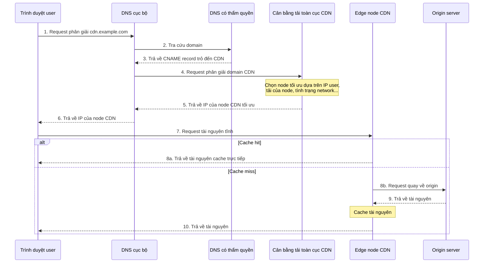

## CDN là gì?

**CDN** là viết tắt của Content Delivery Network/Content Distribution Network, dịch ra là **mạng phân phối nội dung**.

Có thể tách khái niệm mạng phân phối nội dung thành hai phần:

- **Nội dung**: các tài nguyên tĩnh như hình ảnh, video, tài liệu, JS, CSS, HTML...
- **Mạng phân phối**: phân phối các tài nguyên tĩnh này đến server trong các data center ở nhiều vị trí địa lý khác nhau, từ đó thực hiện **truy cập gần nhất**. Ví dụ, người dùng ở Bắc Kinh truy cập trực tiếp dữ liệu tại data center ở Bắc Kinh.

Nói đơn giản, **CDN phân phối tài nguyên tĩnh đến nhiều nơi để thực hiện truy cập gần nhất, từ đó tăng tốc truy cập tài nguyên tĩnh và giảm tải cho server cũng như bandwidth của origin**.

Có thể hình dung CDN giống như hệ thống kho vận khổng lồ của JD.com. JD Logistics có rất nhiều kho trên toàn quốc, mạng lưới kho gần như phủ khắp các quận, huyện. Khi người dùng đặt hàng, sản phẩm được chuyển ngay từ kho gần nhất đến trạm giao hàng tương ứng, rồi shipper của JD giao đến tận nhà.


Có thể xem CDN là một **dịch vụ cache đặc biệt** nằm ở tầng phía trên của service, được phân bố trên nhiều nơi và chủ yếu xử lý request tài nguyên tĩnh.


Chúng ta thường so sánh tăng tốc toàn site với mạng phân phối nội dung, nhưng đừng nhầm lẫn hai khái niệm này! **Tăng tốc toàn site** (các cloud provider khác nhau có tên gọi khác nhau, Tencent Cloud gọi là ECDN, Alibaba Cloud gọi là DCDN) có thể tăng tốc cả tài nguyên tĩnh và tài nguyên động, còn **mạng phân phối nội dung (CDN)** chủ yếu dành cho **tài nguyên tĩnh**.


Phần lớn công ty đều sử dụng dịch vụ CDN khi phát triển project, nhưng rất ít công ty tự xây dựng dịch vụ CDN. Xét về chi phí, độ ổn định và tính dễ sử dụng, nên chọn trực tiếp dịch vụ CDN có sẵn của cloud provider chuyên nghiệp (như Alibaba Cloud, Tencent Cloud, Huawei Cloud, QingCloud) hoặc CDN provider (như Wangsu, ChinaCache).

## Vì sao không triển khai service trực tiếp ở nhiều nơi khác nhau?

Nhiều bạn có thể thắc mắc: **đã là truy cập gần nhất, tại sao không triển khai service trực tiếp ở nhiều nơi khác nhau?**

Điều này liên quan đến vấn đề **tách biệt kiến trúc giữa tài nguyên tĩnh và request động**:

1. **Vấn đề chi phí**: triển khai service hoàn chỉnh ở nhiều nơi cần triển khai nhiều bộ application, database và middleware, chi phí rất cao; còn CDN chỉ cần lưu trữ tài nguyên tĩnh nên chi phí có thể kiểm soát.
2. **Đặc tính tài nguyên khác nhau**: tài nguyên tĩnh (hình ảnh, JS, CSS) có đặc điểm **dung lượng lớn, truy cập thường xuyên, nội dung không đổi**, rất phù hợp để cache và phân phối; request động cần tính toán theo thời gian thực nên bắt buộc phải quay về origin xử lý.
3. **Tiêu hao tài nguyên hệ thống**: nếu dùng application server để xử lý trực tiếp request tài nguyên tĩnh, sẽ tiêu tốn nhiều CPU, memory và bandwidth, có thể ảnh hưởng đến hoạt động bình thường của nghiệp vụ cốt lõi.
4. **Tối ưu chuyên biệt**: CDN đã tối ưu rất nhiều cho việc truyền tải tài nguyên tĩnh (như nén thông minh, tối ưu protocol, edge computing), những năng lực này application server thông thường không có.

> **Lưu ý**: triển khai nhiều bản sao của cùng một service ở nhiều nơi (như disaster recovery cùng thành phố, disaster recovery khác thành phố, active-active cùng thành phố, active-active khác thành phố) nhằm đạt **high availability**, không phải để truy cập gần nhất.

## Nguyên lý hoạt động của CDN là gì?

Để hiểu nguyên lý hoạt động của CDN, cần nắm được ba vấn đề cốt lõi sau:

1. Tài nguyên tĩnh được cache vào các node CDN như thế nào?
2. Làm thế nào tìm được node CDN phù hợp nhất?
3. Làm thế nào ngăn tài nguyên tĩnh bị sử dụng trái phép?

Trong môi trường production, còn cần quan tâm thêm hai chỉ số:

- **Hit rate của cache**: hit rate càng cao, càng ít user phải quay về origin, áp lực lên origin càng nhỏ.
- **Thời gian và tỷ lệ lỗi khi quay về origin**: khi đường dẫn quay về origin chậm hoặc origin phát sinh nhiều lỗi hơn, các node CDN cũng sẽ bị kéo chậm.

Vì vậy, CDN không phải cứ kết nối vào là chắc chắn nhanh. Nếu cấu hình rule cache không hợp lý, URL tài nguyên tĩnh không ổn định hoặc cache thường xuyên bị refresh, ngược lại có thể khiến lượng lớn request dồn về origin, làm áp lực lên origin còn lớn hơn khi không dùng CDN.

### Tài nguyên tĩnh được cache vào các node CDN như thế nào?

CDN chủ yếu cache tài nguyên tĩnh theo hai cách: **warm-up** và **quay về origin**.

- **Warm-up (Prefetch)**: chủ động đẩy tài nguyên của origin đến các node CDN. Nhờ đó, khi user request tài nguyên lần đầu, có thể lấy trực tiếp từ node CDN mà không cần quay về origin, phù hợp với các dịp khuyến mãi lớn hoặc khi phát hành nội dung hot.

- **Quay về origin (Origin Pull)**: khi node CDN không có tài nguyên mà user request hoặc cache của tài nguyên đã hết hạn, node CDN cần lấy nội dung mới nhất của tài nguyên từ origin.

> **Lưu ý**: khi request của user kích hoạt việc quay về origin, tốc độ phản hồi của request đó sẽ chậm hơn cả khi không dùng CDN. So với truy cập origin trực tiếp, request phải đi qua thêm một quy trình gọi node CDN. Vì vậy, nâng cao **hit rate của cache** là mục tiêu cốt lõi khi tối ưu CDN.

Vòng đời đầy đủ của cache CDN như hình dưới đây:


Nếu tài nguyên được cập nhật, có thể thực hiện thao tác **refresh**, xóa tài nguyên cũ trong cache trên node CDN và buộc node CDN quay về origin lấy tài nguyên mới nhất ở request tiếp theo.

Gần như mọi cloud provider đều cung cấp chức năng refresh và warm-up cache cho dịch vụ CDN (hình dưới là các chức năng tương ứng của dịch vụ CDN trên Alibaba Cloud):


**Hit rate** và **tỷ lệ quay về origin** là hai chỉ số cốt lõi để đánh giá chất lượng dịch vụ CDN:

- **Hit rate**: tỷ lệ request của user được node CDN phản hồi trực tiếp, **càng cao càng tốt**.
- **Tỷ lệ quay về origin**: tỷ lệ request của user phải quay về origin để lấy dữ liệu, **càng thấp càng tốt**.

Các cách tối ưu hit rate thường gặp:

- **Thêm content hash vào tên file tài nguyên tĩnh**: ví dụ `app.8f3a1c.js`, khi nội dung thay đổi thì tên file thay đổi, phù hợp để đặt thời gian cache dài.
- **Cache ngắn cho file entry**: các file entry như HTML, sitemap, robots không phù hợp để cache lâu, tránh tham chiếu đến tài nguyên cũ đã bị xóa.
- **Warm-up tài nguyên hot trước**: trước khi diễn ra khuyến mãi, sự kiện hoặc phát hành package cài đặt, đẩy trước tài nguyên hot đến các node CDN.
- **Giảm refresh không cần thiết**: refresh toàn site sẽ khiến lượng lớn edge node đồng thời quay về origin, nên refresh chính xác theo URL hoặc directory.
- **Giữ tài nguyên của version cũ trong một khoảng thời gian**: sau khi deploy version mới, không nên xóa ngay các file hash cũ, tránh trường hợp HTML cũ truy cập tài nguyên cũ rồi nhận 404.

Nếu hit rate đột ngột giảm, có thể ưu tiên kiểm tra rule cache có thay đổi không, URL tài nguyên có chứa parameter ngẫu nhiên không, có xảy ra refresh toàn bộ không, và origin có trả về response header cấm cache không.

### Làm thế nào tìm được node CDN phù hợp nhất?

**GSLB (Global Server Load Balance, cân bằng tải toàn cục)** là bộ não của CDN, chịu trách nhiệm điều phối giữa nhiều node CDN. Cách triển khai phổ biến nhất là **GSLB dựa trên DNS**.

Quy trình điều phối đầy đủ của request CDN như hình dưới đây:



**Mô tả chi tiết quy trình**:

1. Trình duyệt user gửi request phân giải domain đến server DNS cục bộ.
2. DNS cục bộ truy vấn DNS có thẩm quyền và phát hiện domain này đã được cấu hình **CNAME (Canonical Name) alias record**, trỏ đến domain của CDN provider.
3. DNS cục bộ tiếp tục gửi request phân giải đến **GSLB** của CDN.
4. GSLB dựa trên các chỉ số như **địa chỉ IP của user, trạng thái node CDN (tải, performance, response time, bandwidth)** để đánh giá tổng hợp và trả về địa chỉ IP của node CDN tối ưu.
5. Trình duyệt user gửi request tài nguyên trực tiếp đến node CDN đó (edge server).
6. Node CDN kiểm tra cache cục bộ. Nếu hit thì trả về trực tiếp; nếu miss hoặc đã hết hạn thì lấy tài nguyên từ origin rồi trả về user.

> **Bổ sung**: hình trên đã được đơn giản hóa. Trên thực tế, có thể xem GSLB là sự kết hợp giữa **DNS chuyên dụng của CDN** và **hệ thống load balancing**. DNS chuyên dụng của CDN trả về địa chỉ IP của hệ thống load balancing, trình duyệt request hệ thống load balancing qua IP này, từ đó tìm được node CDN tương ứng.

### Làm thế nào ngăn tài nguyên bị lạm dụng?

Nếu tài nguyên tĩnh bị user hoặc website khác lạm dụng trái phép, sẽ phát sinh nhiều chi phí bandwidth. Một số cơ chế chống hotlink thường gặp:

| Cơ chế chống hotlink             | Nguyên lý                                                                   | Mức độ bảo mật | Chi phí triển khai | Độ khó bypass                                   |
| -------------------------------- | --------------------------------------------------------------------------- | -------------- | ------------------ | ----------------------------------------------- |
| **Chống hotlink bằng Referer**   | Dựa trên trường Referer trong HTTP request header để xác định nguồn request | Thấp           | Thấp               | Thấp (có thể giả mạo hoặc để trống Referer)     |
| **Chống hotlink bằng timestamp** | URL chứa chữ ký và thời gian hết hạn, URL mất hiệu lực sau khi hết hạn      | Trung bình     | Trung bình         | Trung bình (cần lấy được thuật toán tạo chữ ký) |
| **Allowlist/blocklist IP**       | Giới hạn hoặc cho phép IP cụ thể truy cập                                   | Trung bình     | Thấp               | Trung bình (có thể bypass qua proxy)            |
| **Xác thực bằng Token**          | Business server tạo Token, node CDN kiểm tra                                | Cao            | Cao                | Cao                                             |

#### Chống hotlink bằng Referer

Kiểm tra trường **Referer** trong HTTP request header để xác định nguồn request có hợp lệ hay không. Có thể cấu hình allowlist domain được phép truy cập; request từ nguồn không nằm trong allowlist sẽ bị từ chối.

Gần như mọi CDN provider đều hỗ trợ cơ chế chống hotlink cơ bản này:


> **Lưu ý**: nếu cấu hình chống hotlink cho phép Referer trống, attacker có thể ẩn Referer để bypass kiểm tra chống hotlink. Vì vậy, chống hotlink bằng Referer thường cần kết hợp với các cơ chế khác.

#### Chống hotlink bằng timestamp

**Chống hotlink bằng timestamp** có độ bảo mật cao hơn. Nguyên lý cốt lõi là: URL chứa **chuỗi chữ ký** và **thời gian hết hạn**; khi xử lý request, node CDN sẽ kiểm tra chữ ký và thời gian hết hạn. URL hết hạn sẽ bị từ chối truy cập.

Chuỗi chữ ký thường được tạo bằng cách tính hash MD5 trên **encryption key + request path + thời gian hết hạn**.

Ví dụ URL chống hotlink bằng timestamp:

```plain
http://cdn.example.com/video/123.mp4?wsSecret=79aead3bd7b5db4adeffb93a010298b5&wsTime=1601026312
```

- `wsSecret`: chuỗi chữ ký, do server tạo dựa trên key và thông tin request.
- `wsTime`: timestamp hết hạn (định dạng Unix timestamp).


Phần lớn CDN provider đều hỗ trợ cơ chế chống hotlink bằng timestamp có thể dùng ngay:


> **Khuyến nghị**: trong môi trường production, nên dùng phương án kết hợp **chống hotlink bằng Referer + chống hotlink bằng timestamp** để cân bằng giữa độ bảo mật và chi phí triển khai. Với các trường hợp yêu cầu bảo mật rất cao (như nội dung trả phí), có thể bổ sung cơ chế xác thực bằng Token.

## CDN tăng tốc tài nguyên động như thế nào?

CDN truyền thống chủ yếu cache và tăng tốc tài nguyên tĩnh (như hình ảnh, CSS, JS). Với **tài nguyên động** (như API, truy vấn thời gian thực, request thanh toán, các trang động `.jsp`/`.asp`/`.php`...), nội dung thay đổi theo thời gian thực nên không thể cache; CDN truyền thống thường quay thẳng về origin, hiệu quả tăng tốc có giới hạn.

**Tăng tốc dynamic (Dynamic Content Acceleration)** được thiết kế để giải quyết vấn đề này. Nó không cache nội dung mà nâng cao tốc độ và độ ổn định truyền tải request động thông qua các kỹ thuật như định tuyến thông minh và tối ưu protocol.

Tăng tốc dynamic chủ yếu được thực hiện bằng ba kỹ thuật sau:

1. **Định tuyến thông minh (thăm dò đường truyền tối ưu)**: sau khi request động được gửi từ phía user, nó đến edge node CDN gần user nhất trước. CDN dùng **công nghệ giám sát network theo thời gian thực** để thăm dò chất lượng đường truyền trên toàn mạng (gồm latency, tỷ lệ packet loss, tải bandwidth), tránh các node bị nghẽn hoặc chất lượng kém trên public network và chọn đường truyền tối ưu đến origin.

2. **Tối ưu protocol truyền tải**:

   - **Tối ưu TCP**: tối ưu TCP slow start và thuật toán congestion control, nâng cao hiệu quả truyền tải trong môi trường latency cao hoặc packet loss.
   - **Reuse connection**: edge node duy trì persistent connection (Keep-Alive) với origin, giảm latency do phải handshake thường xuyên.

3. **Tăng tốc kết hợp tài nguyên tĩnh và động**: CDN hiện đại (như Alibaba Cloud DCDN, Tencent Cloud ECDN) có thể tự động nhận diện loại tài nguyên trong request của user:
   - **Tài nguyên tĩnh**: trả về trực tiếp từ cache trên edge node.
   - **Tài nguyên động**: quay về origin thông qua định tuyến thông minh.

> **Tóm tắt trong một câu**: tăng tốc dynamic = thăm dò thông minh + định tuyến dynamic + tối ưu protocol, giúp request động chạy nhanh và ổn định hơn.

Tăng tốc dynamic cũng có giới hạn: nó tối ưu đường truyền network, không giảm thời gian tính toán nghiệp vụ, truy vấn database hoặc gọi API bên thứ ba. Nếu API chậm do SQL, tranh chấp lock hoặc dependency downstream, chỉ dùng tăng tốc dynamic thì không thể giải quyết nguyên nhân gốc. Khi phỏng vấn có thể trả lời: tài nguyên tĩnh chủ yếu dựa vào cache hit, request động chủ yếu dựa vào tối ưu đường truyền và quản trị performance của origin; đây là hai loại vấn đề khác nhau.

## CDN tối ưu tốc độ truy cập HTTPS như thế nào?

HTTPS an toàn nhưng quá trình TLS handshake và encryption/decryption sẽ làm tăng latency. CDN dùng nhiều kỹ thuật để tối ưu tăng tốc HTTPS, vừa đảm bảo bảo mật vừa nâng cao tốc độ truy cập.

| Kỹ thuật tối ưu   | Mô tả nguyên lý                                                                                                                                      | Hiệu quả                                                                    |
| ----------------- | ---------------------------------------------------------------------------------------------------------------------------------------------------- | --------------------------------------------------------------------------- |
| **Reuse session** | Sau khi user thiết lập kết nối HTTPS lần đầu, node cache thông tin session; khi truy cập lại, reuse parameter của session để giảm full TLS handshake | Giảm latency handshake                                                      |
| **OCSP Stapling** | Node CDN định kỳ cache trạng thái certificate rồi gửi kèm cho trình duyệt trong TLS handshake, tránh việc trình duyệt phải truy vấn riêng CA         | Nâng cao hiệu quả handshake                                                 |
| **False Start**   | Bắt đầu truyền encrypted data khi TLS handshake chưa hoàn tất hoàn toàn                                                                              | Giảm chi phí một RTT                                                        |
| **HTTP/2**        | Hỗ trợ multiplexing và header compression                                                                                                            | Giảm số connection và latency truyền tải                                    |
| **QUIC**          | Protocol truyền tải dựa trên UDP, thiết lập connection với 0-RTT                                                                                     | Giảm thời gian thiết lập connection, cải thiện trải nghiệm trên network yếu |

**Ưu điểm của việc CDN quản lý certificate**:

CDN provider (như Tencent Cloud, Alibaba Cloud) thường cung cấp dịch vụ **SSL certificate miễn phí** và **tự động gia hạn**, với các ưu điểm sau:

- **Không cần vận hành thủ công**: user không cần tự cập nhật certificate, tránh truy cập thất bại do certificate hết hạn.
- **Cấu hình linh hoạt**: hỗ trợ upload certificate trong CDN console hoặc đăng ký certificate miễn phí bằng một click.
- **Nhiều chế độ encryption**: có thể chọn “**encryption một nửa**” (user đến CDN dùng HTTPS, CDN đến origin dùng HTTP) hoặc “**encryption toàn trình**” (cả hai đầu đều dùng HTTPS).

**Khuyến nghị cấu hình tăng tốc HTTPS**:

1. **Cấu hình cơ bản**: bật HTTPS trong CDN console và cấu hình certificate.
2. **Tối ưu performance**: bật **OCSP Stapling** và **HTTP/2**.
3. **Tăng cường bảo mật**: nếu cần security level cao hơn, có thể bật **HSTS** (buộc trình duyệt truy cập bằng HTTPS).
4. **Tối ưu network yếu**: bật hỗ trợ protocol **QUIC** để cải thiện trải nghiệm truy cập trên thiết bị di động trong môi trường network yếu.

Trong môi trường production, cũng cần chú ý tính nhất quán giữa certificate và protocol quay về origin. Nếu user đến CDN dùng HTTPS nhưng CDN đến origin dùng HTTP, giữa đường truyền vẫn tồn tại rủi ro truyền plaintext; nếu origin bắt buộc HTTPS, việc quay về origin từ CDN cũng phải cấu hình đúng certificate verification và SNI, nếu không dễ xảy ra lỗi quay về origin.

## Tổng kết

- **Giá trị cốt lõi của CDN**: phân phối tài nguyên tĩnh đến nhiều nơi để thực hiện **truy cập gần nhất**, tăng tốc truy cập tài nguyên tĩnh và giảm tải cho origin server cũng như bandwidth.
- **Chọn dịch vụ CDN**: xét về chi phí, độ ổn định và tính dễ sử dụng, nên chọn dịch vụ có sẵn của cloud provider chuyên nghiệp (như Alibaba Cloud, Tencent Cloud, Huawei Cloud) hoặc CDN provider (như Wangsu, ChinaCache).
- **Vai trò của GSLB**: GSLB (cân bằng tải toàn cục) là bộ não của CDN, chịu trách nhiệm dựa trên vị trí user, trạng thái node và các yếu tố khác để điều phối request của user đến **node CDN tối ưu**.
- **Chỉ số cốt lõi**: **hit rate** càng cao càng tốt, **tỷ lệ quay về origin** càng thấp càng tốt.
- **Cơ chế chống hotlink**: khuyến nghị dùng phương án kết hợp **chống hotlink bằng Referer + chống hotlink bằng timestamp** để cân bằng giữa độ bảo mật và chi phí triển khai.
- **Tăng tốc dynamic**: nâng cao tốc độ và độ ổn định truyền tải của request động (API, truy vấn thời gian thực...) bằng ba kỹ thuật **định tuyến thông minh**, **tối ưu protocol truyền tải** và **tăng tốc kết hợp tài nguyên tĩnh và động**.
- **Tăng tốc HTTPS**: tối ưu TLS handshake và quá trình truyền tải bằng các kỹ thuật như **reuse session**, **OCSP Stapling**, **False Start**, **HTTP/2**, **QUIC**, vừa đảm bảo bảo mật vừa nâng cao tốc độ truy cập.

## Tài liệu tham khảo

- Chống hotlink bằng timestamp - Qiniu Cloud CDN: <https://developer.qiniu.com/fusion/kb/1670/timestamp-hotlinking-prevention>
- CDN là gì? Giải thích rõ trong một bài viết: <https://mp.weixin.qq.com/s/Pp0C8ALUXsmYCUkM5QnkQw>
- “HTTP qua lăng kính” - 37 | CDN: Tăng tốc dịch vụ network của chúng ta: <http://gk.link/a/11yOG>

<!-- @include: @article-footer.snippet.md -->
