> Bài viết này do FrancisQ đóng góp! So với bản gốc, bài viết chủ yếu được hoàn thiện ở các điểm sau:
>
> - [Phân tích nguyên nhân RocketMQ đọc ghi với performance cao và cách triển khai cụ thể của việc consume theo thứ tự](https://github.com/Snailclimb/JavaGuide/pull/2133)
> - [Bổ sung giới thiệu về các loại message, loại consumer, consumer group và producer group](https://github.com/Snailclimb/JavaGuide/pull/2134)
> - [RocketMQ 5.x hỗ trợ phân bổ theo message](https://github.com/Snailclimb/JavaGuide/issues/2778)

## Nhập môn Message Queue

Trong phỏng vấn RocketMQ, câu hỏi thường không dừng ở “Message Queue là gì?”. Câu hỏi đào sâu thường gặp hơn là: Vì sao NameServer có thể được thiết kế rất nhẹ, master-slave của Broker đồng bộ thế nào, CommitLog và ConsumeQueue lần lượt đảm nhiệm gì, message thứ tự, message transaction và message timer lần lượt được thực hiện dựa trên cơ chế nào.

Nếu bạn chưa từng dùng MQ một cách có hệ thống, trước hết hãy nhớ ba trường hợp: asynchronous, decoupling, peak shaving. Khi tìm hiểu kiến trúc, storage và mô hình consume của RocketMQ, về cơ bản đều không thể bỏ qua ba vấn đề này.

### Vì sao Message Queue xuất hiện?

Trong monolith application, gọi trực tiếp giữa các interface là cách đơn giản nhất; sau khi hệ thống được tách thành nhiều service, khi call chain dài lên, synchronous call sẽ truyền tiếp cả response time, lỗi và peak traffic. Message Queue được đặt ở giữa, trước tiên lưu message lại, để downstream consume theo nhịp riêng.

### Message Queue có thể dùng để làm gì?

#### Asynchronous

Bạn có thể hỏi, giao tiếp giữa các application đâu phải chỉ có Message Queue mới giải quyết được, vậy tại sao nhất thiết phải chèn một Message Queue vào giữa? Giao tiếp trực tiếp không được sao?

Điều này dẫn đến một khái niệm khác là **synchronous communication**. Chẳng hạn, Dubbo được dùng khá phổ biến trong ngành là một framework RPC phù hợp cho synchronous communication giữa các hệ thống.

Lấy hệ thống mua vé làm ví dụ: yêu cầu là sau khi người dùng mua vé xong, họ nhận được SMS thông báo mua thành công.


Bỏ qua thời gian tốn cho giao tiếp mạng ở giữa, giả sử hệ thống mua vé xử lý mất 150ms, hệ thống SMS xử lý mất 200ms, tổng thời gian của toàn bộ flow là 150ms + 200ms = 350ms.

Tất nhiên, nhìn qua thì không có vấn đề gì. Nhưng phân tích kỹ sẽ thấy: người dùng đã mua xong ngay khi hệ thống mua vé xử lý hoàn tất, trong khi synchronous call lại bắt toàn bộ request phải kéo dài. Hệ thống SMS chỉ là chức năng hỗ trợ, dùng để cải thiện trải nghiệm người dùng, không phải nghiệp vụ cốt lõi. Toàn bộ call flow trở nên **đầu nặng chân nhẹ**: mua vé là flow không tốn nhiều thời gian, nhưng vì synchronous call nên phải chờ thao tác tốn thời gian hơn là gửi SMS hoàn tất mới trả kết quả. Nếu thêm yêu cầu gửi email thì sao?


Khi đó call chain của hệ thống lại dài thêm, tổng thời gian thành 550ms.

Khi xếp hàng lấy cơm ở căng tin, giữa chúng ta và nhân viên căng tin chính là mô hình synchronous.

Chúng ta cần nói với nhân viên: “Hãy thêm cho tôi một đùi gà, thêm một phần khoai tây chua cay, lấy thêm cơm”.

Sau đó nhân viên lấy cơm và chuẩn bị món, còn chúng ta phải chờ quá trình này hoàn tất.

Cuối cùng chúng ta nhận cơm từ nhân viên rồi đi tìm chỗ ngồi.

Nghĩ lại, sau khi truyền đạt yêu cầu, chúng ta **synchronous wait để nhân viên chuẩn bị cơm**. Nếu thêm nhiều món hơn, flow lấy cơm và chuẩn bị món của nhân viên sẽ dài hơn, thời gian chờ của chúng ta cũng tăng theo.

Khi ăn ở nhà hàng, chúng ta gọi nhân viên mang một tô mì bò thêm trứng ốp la **(truyền một message)**, rồi có thể tự làm việc của mình tại bàn **(làm việc khác)**; đến khi mì được mang ra mới bắt đầu ăn. Thời gian nấu mì không ngắn đi, nhưng chúng ta chỉ cần truyền một message rồi có thể làm việc khác. Đây chính là khái niệm **asynchronous**.

Vì vậy, để giải quyết vấn đề này, các lập trình viên thông minh cũng thêm vào giữa hai bên một middleware tương tự nhân viên phục vụ là Message Queue. Khi đó chúng ta có thể cải tạo mô hình như sau.


Sau khi lưu message vào Message Queue, chúng ta có thể trả về ngay (chúng ta nói với nhân viên muốn ăn gì rồi chơi điện thoại), nên tổng thời gian chỉ là 150ms + 10ms = 160ms.

> Tuy nhiên cần chú ý, tổng thời gian của toàn bộ flow không thay đổi, cũng như việc chỉ nói với nhân viên muốn ăn gì không làm tốc độ nấu mì nhanh hơn.

#### Decoupling

Quay lại flow synchronous call ban đầu, hãy dùng pseudocode để khái quát đơn giản.


Sau đó ở bước hai, khi thêm việc gửi email, chúng ta phải sửa code; nếu lại thêm yêu cầu cộng điểm cho người dùng sau khi mua xong, chẳng phải lại phải sửa code sao?


Nếu vẫn thấy có thể chấp nhận, khi cần bỏ service gửi email thì chẳng phải lại phải sửa code và restart application sao?


Việc sửa code thường xuyên như vậy rõ ràng rất phiền phức. Khi đó có thể **dùng Message Queue để decoupling**. Cần chú ý rằng các thao tác gửi SMS, gửi email, cộng điểm ở phía sau đều phụ thuộc vào `result`, tức kết quả xử lý của việc mua vé (như order number, user account...). Nói cách khác, các service phía sau đều cần cùng một message để xử lý. Vì vậy có thể dùng mô hình **“broadcast message”** để thực hiện.

“Broadcast” ở đây không phải broadcast thực sự, mà là các hệ thống downstream đóng vai trò consumer để **subscribe** một topic cụ thể. Chẳng hạn topic có thể đặt tên là `Đặt vé`, hệ thống mua vé làm producer gửi message vào Message Queue; sau khi consumer subscribe topic, nó pull message từ Message Queue và consume. Ở phía producer chỉ cần quan tâm **produce message vào topic chỉ định**, còn **consumer chỉ cần quan tâm pull message từ topic chỉ định**.


> Nếu không có Message Queue, mỗi khi có nghiệp vụ mới tham gia, chúng ta phải gọi interface mới trong hệ thống chính; khi bỏ một nghiệp vụ nào đó, cũng phải xóa lời gọi interface tương ứng trong hệ thống chính. Có Message Queue, chúng ta chỉ cần quan tâm message có đến queue hay không; ai muốn subscribe và xử lý message sau khi nhận được là việc của downstream. Điều này hiển nhiên giảm đáng kể khối lượng development và integration test.

#### Peak shaving

Quay lại bối cảnh hệ thống synchronous call, hãy thử nghĩ: nếu lúc này có lượng lớn request mua vé thì toàn bộ hệ thống sẽ thế nào?


Giả sử có 10.000 request đi vào hệ thống mua vé. Server chạy nghiệp vụ chính thường có cấu hình khá tốt, hệ thống mua vé có thể chịu được 10.000 request người dùng. Nhưng điều đó cũng có nghĩa là đồng thời sẽ phát sinh 10.000 request gọi service SMS. SMS không phải nghiệp vụ chính nên tài nguyên phần cứng được trang bị sẽ không quá cao. Lúc này hệ thống SMS có chịu được peak 10.000 request không? Rất có thể hệ thống sẽ **crash ngay**.

SMS không phải nghiệp vụ chính, có thể **xử lý thỏa hiệp** không? Nếu gửi thông tin mua vé thành công vào Message Queue, để hệ thống SMS **lấy và consume message từ Message Queue trong khả năng của mình**, thì dù tốc độ xử lý chậm hơn một chút cũng không sao, chỉ cần hệ thống không crash là chấp nhận được.

Availability của hệ thống là quan trọng nhất. SMS mã xác thực đến điện thoại người dùng chậm vài giây thường vẫn có thể chấp nhận.

### Message Queue mang lại lợi ích gì?

Tóm lại là ba keyword: **asynchronous, decoupling, peak shaving**. Đây không chỉ là giá trị cốt lõi của Message Queue mà còn là tư tưởng quan trọng trong thiết kế distributed architecture.

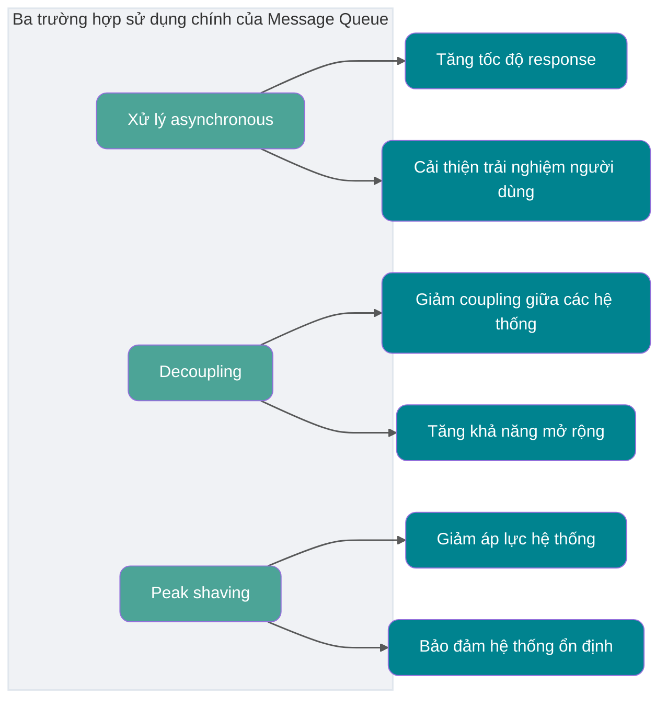

### Message Queue có gây tác dụng phụ không?

Không có công nghệ nào là “viên đạn bạc”, Message Queue cũng có tác dụng phụ.

Chẳng hạn, lời gọi giữa hai hệ thống vốn đang hoạt động tốt, nay chèn thêm Message Queue ở giữa, nếu Message Queue down thì sao? Chẳng phải **availability của hệ thống bị giảm** sao?

Vậy có phải phải bảo đảm HA (high availability) không? Có phải phải triển khai cluster không? Như vậy **độ phức tạp của toàn bộ hệ thống có tăng lên** không?

Tạm gác các vấn đề trên, nếu bên gửi gửi thất bại rồi retry thì có thể tạo ra message trùng lặp.

Hoặc consumer xử lý thất bại và request được gửi lại, cũng sẽ tạo ra message trùng lặp.

Với một số microservice, consume message trùng lặp sẽ gây phiền phức hơn. Chẳng hạn cộng điểm, nếu cộng nhiều lần thì có bất công với người dùng khác không?

Vậy **giải quyết vấn đề consume trùng lặp** thế nào?

Nếu message lúc này cần bảo đảm thứ tự nghiêm ngặt thì sao? Chẳng hạn producer produce một chuỗi message có thứ tự (xóa, thêm, sửa bản ghi có id bằng 1), nhưng trong publish-subscribe model, topic không có thứ tự. Khi đó consumer có thể consume theo thứ tự khác với thứ tự producer gửi, chẳng hạn thứ tự consume là sửa, xóa, thêm. Nếu bản ghi liên quan đến tiền thì chẳng phải sẽ xảy ra vấn đề lớn sao?

Vậy **giải quyết vấn đề consume message theo thứ tự** thế nào?

Lấy distributed system đã nói ở trên làm ví dụ: sau khi người dùng mua vé xong, có cần cộng điểm tài khoản không? Trong cùng một hệ thống, chúng ta thường dùng transaction để giải quyết; nếu dùng `Spring`, chỉ cần thêm annotation `@Transactional` vào pseudocode bên trên. Nhưng giữa các hệ thống khác nhau thì bảo đảm transaction thế nào? Không thể hệ thống này trừ tiền thành công mà hệ thống điểm kia không cộng điểm, hoặc hệ thống này trừ tiền thất bại mà hệ thống điểm kia lại cộng điểm.

Vậy **giải quyết distributed transaction** thế nào?

Chúng ta vừa nói Message Queue có thể peak shaving. Nếu consumer consume quá chậm hoặc producer produce message quá nhanh thì chẳng phải message sẽ bị dồn trong Message Queue sao?

Vậy **giải quyết message backlog** thế nào?

Availability giảm, độ phức tạp tăng, đồng thời còn kéo theo một loạt vấn đề như consume trùng lặp, consume theo thứ tự, distributed transaction và message backlog. Giải quyết các vấn đề này thế nào?


Sau đây chúng ta lần lượt thảo luận cách giải quyết các vấn đề này.

## RocketMQ là gì?


Trước khi thảo luận cách giải quyết các vấn đề trên, hãy tìm hiểu cấu trúc bên trong của RocketMQ. Bạn nên mang theo các câu hỏi khi đọc và tìm hiểu.

RocketMQ là một **message system publish-subscribe dựa trên Topic**. Một Topic có thể chứa nhiều MessageQueue; MessageQueue là đơn vị queue nhỏ nhất để lưu trữ và truyền message. RocketMQ có các đặc điểm **performance cao, reliability cao, realtime cao và distributed**, được phát triển bằng Java. Cuối năm 2016, đội ngũ Alibaba đóng góp RocketMQ cho Apache và nó trở thành dự án cấp cao nhất của Apache. Trong nội bộ Alibaba, RocketMQ đã phục vụ tốt hàng nghìn application lớn nhỏ của tập đoàn; riêng ngày Double 11 hằng năm, lượng message luân chuyển qua RocketMQ lên tới hàng nghìn tỷ.

RocketMQ có throughput cao, latency thấp và high availability, đã được kiểm chứng qua các kịch bản quy mô lớn như Double 11.

Từ RocketMQ 5.x, phía chính thức nhấn mạnh hơn vào cloud-native architecture: lớp Proxy hỗ trợ gRPC, SDK đa ngôn ngữ và truy cập đa protocol; Broker tập trung hơn vào message storage và high availability. Điều đó có nghĩa khi chọn công nghệ cho dự án mới, ngoài NameServer, Broker, Producer và Consumer truyền thống, cũng cần xem có cần Proxy, gRPC SDK, triển khai Kubernetes và khả năng observability cloud-native hay không.

## Queue model và Topic model là gì?

Trước khi nói về technical architecture của RocketMQ, hãy tìm hiểu hai khái niệm **queue model** và **Topic model**.

Trước hết, tại sao Message Queue lại được gọi là Message Queue?

Thực tế, middleware message thời kỳ đầu được triển khai theo model **queue**. Có thể do nguyên nhân lịch sử, chúng ta quen gọi middleware message là Message Queue.

Tuy nhiên, ngày nay các middleware message ưu tú như RocketMQ và Kafka không chỉ dùng một **queue** để lưu trữ message.

### Queue model

Giống như cách chúng ta hiểu về queue, queue model của middleware message thực sự chỉ là một queue.


Đặc điểm của queue model: **một message chỉ có thể được một consumer consume**.

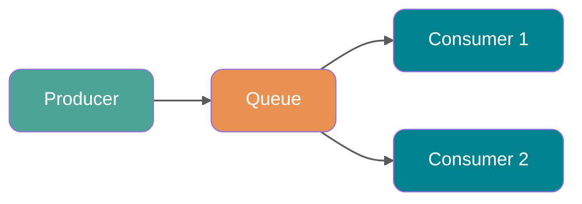

Ngay từ đầu tôi đã nhắc đến khái niệm **“broadcast”**, nghĩa là nếu cần gửi một message đến nhiều consumer (chẳng hạn cần gửi thông tin cho hệ thống SMS và email), một queue đơn lẻ sẽ không đáp ứng được.

Tất nhiên có thể để Producer produce message vào nhiều queue, mỗi queue tương ứng với một consumer. Vấn đề được giải quyết, nhưng việc tạo nhiều queue và copy nhiều bản message sẽ ảnh hưởng đáng kể đến tài nguyên và performance. Hơn nữa, producer sẽ phải biết số lượng consumer cụ thể để copy số lượng Message Queue tương ứng, trái với nguyên tắc **decoupling** của middleware message.

### Topic model

Có cách nào tốt để giải quyết vấn đề này không? Có, đó là **Topic model**, còn có thể gọi là **publish-subscribe model**.

> Nếu hứng thú, bạn có thể tìm hiểu Observer pattern trong design pattern và tự triển khai một lần. Tôi tin bạn sẽ thu hoạch được điều gì đó.

Trong Topic model, producer của message được gọi là **Publisher**, consumer của message được gọi là **Subscriber**, container lưu message được gọi là **Topic**.

Publisher gửi message vào Topic chỉ định; Subscriber phải **subscribe Topic trước** mới có thể nhận message của Topic đó.


Đặc điểm của Topic model: **một Topic có thể được nhiều Consumer Group subscribe, mỗi Consumer Group có consume progress độc lập**. Trong cluster consume mode, thường chỉ một consumer instance trong cùng Consumer Group xử lý một message; trong broadcast consume mode, mọi consumer trong cùng Consumer Group đều nhận được message.

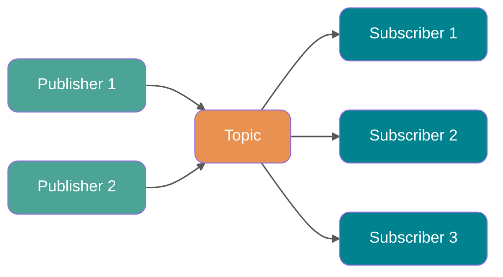

### Message model trong RocketMQ

Message model trong RocketMQ được triển khai theo **Topic model**. Vậy **Topic** được triển khai thế nào?

Với việc triển khai Topic model, thiết kế tầng dưới của mỗi middleware message khác nhau. Chẳng hạn Kafka dùng **Partition**, RocketMQ dùng **Queue**, RabbitMQ dùng Exchange. Có thể hiểu **Topic model/publish-subscribe model** là một tiêu chuẩn, còn các middleware chỉ triển khai theo tiêu chuẩn đó.

Vậy **Topic model** trong RocketMQ được triển khai thế nào? Hãy xem một hình:


Trong toàn bộ hình có ba role là `Producer Group`, Topic và `Consumer Group`. Hình này gần với model thời kỳ đầu và model tương thích. Khi hiểu 5.x cần nhớ: trong domain model mới, producer là anonymous và lightweight; producer group không còn là khái niệm trọng tâm.

- `Producer Group`: trong client thời kỳ đầu và các kịch bản tương thích, đại diện cho một loại producer. Chẳng hạn có nhiều hệ thống flash sale làm producer, gộp các hệ thống đó lại là một `Producer Group`; chúng thường produce cùng loại message.
- `Consumer Group`: đại diện cho một loại consumer. Chẳng hạn có nhiều hệ thống SMS làm consumer, gộp các hệ thống đó lại là một `Consumer Group`; chúng thường consume cùng loại message.
- Topic: đại diện cho một loại message, chẳng hạn order message, logistics message...

Bạn có thể thấy producer trong producer group gửi message đến Topic, còn **Topic chứa nhiều queue**. Sau mỗi lần produce message, producer sẽ gửi message vào một queue cụ thể dưới Topic chỉ định.

Mỗi Topic có nhiều queue (phân bố trên các Broker khác nhau; nếu là cluster thì các Broker lại phân bố trên các server khác nhau). Trong cluster consume mode, nhiều máy trong một consumer cluster cùng consume nhiều queue của một `topic`.

**So sánh chiến lược load balancing**

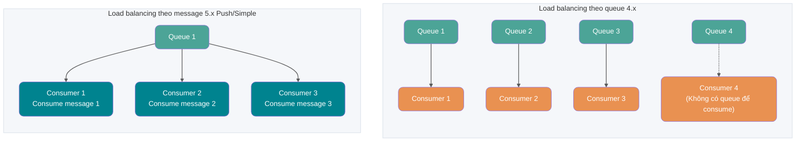

- **Load balancing theo queue (chiến lược mặc định 4.x)**: một queue chỉ được một consumer consume. Nếu một consumer down, các consumer khác trong group sẽ tiếp quản consumer đó để tiếp tục consume. Số queue thường lớn hơn hoặc bằng số consumer; consumer ít hơn queue là tình huống thường gặp, chỉ là một consumer sẽ được phân nhiều queue. Nếu số consumer nhiều hơn số queue, các consumer dư sẽ idle. Nhược điểm của model này là dễ tạo **long-tail effect**: nếu một consumer xử lý chậm, message trong queue tương ứng sẽ backlog, trong khi các consumer khác lại idle.
- **Load balancing theo message (chiến lược mặc định của PushConsumer/SimpleConsumer 5.x)**: trong RocketMQ 5.x, PushConsumer và SimpleConsumer mặc định dùng load balancing theo message; nhiều consumer trong cùng consumer group có thể chia message trong Topic theo đơn vị message. PullConsumer vẫn dùng load balancing theo queue. Sau khi consumer lấy một message, server sẽ lock message đó, bảo đảm message không hiển thị với consumer khác cho đến khi consume thành công hoặc timeout. Model này giải quyết hiệu quả long-tail effect vì message không còn bind tĩnh vào một consumer mà được phân động cho consumer idle.

Số consumer nhỏ hơn số queue không phải vấn đề, chỉ là concurrency bị giới hạn bởi số consumer. Điều thực sự cần tránh là số queue quá ít, khiến khi scale out consumer sau này không có đủ queue để phân bổ. Như hình dưới đây.


**Vì sao mỗi Consumer Group phải duy trì một consume position trên mỗi queue?**

Vì hình vừa vẽ chỉ có một Consumer Group. Trong publish-subscribe model thường có nhiều Consumer Group, và consume position của mỗi Consumer Group trên mỗi queue khác nhau. Nếu có nhiều Consumer Group, sau khi một Consumer Group consume xong message thì message không bị xóa (vì các Consumer Group khác cũng cần message); hệ thống chỉ duy trì một **consume offset** cho mỗi Consumer Group. Mỗi lần Consumer Group consume xong và trả về response thành công, queue sẽ tăng consume offset được duy trì lên một, nhờ đó message vừa consume không bị consume lại.


Có thể bạn còn một câu hỏi: **vì sao một Topic cần duy trì nhiều queue?**

Câu trả lời là **tăng concurrency**. Quả thực, mỗi Topic chỉ có một queue cũng có thể hoạt động. Hãy thử nghĩ, nếu mỗi Topic chỉ có một queue, queue này vẫn duy trì consume position của mỗi Consumer Group, như vậy vẫn có thể thực hiện **publish-subscribe model**. Như hình dưới đây.


Nhưng khi đó producer chẳng phải chỉ có thể gửi message vào một queue sao? Hơn nữa vì phải duy trì consume position, một queue chỉ có thể tương ứng với một consumer trong một Consumer Group, vậy các Consumer khác chẳng phải không có việc để làm sao? Xét từ hai góc độ này, concurrency giảm đi rất nhiều.

Tóm lại, RocketMQ thực hiện **Topic model/publish-subscribe model** bằng cách **cấu hình nhiều queue trong một Topic và để mỗi queue duy trì consume position của từng Consumer Group**.

## Kiến trúc RocketMQ

Sau khi hiểu message model, việc hiểu technical architecture của RocketMQ sẽ dễ hơn nhiều.

Các component cốt lõi của RocketMQ gồm **NameServer, Broker, Producer, Consumer**; từ version 5.0 còn có thêm component **Proxy**.

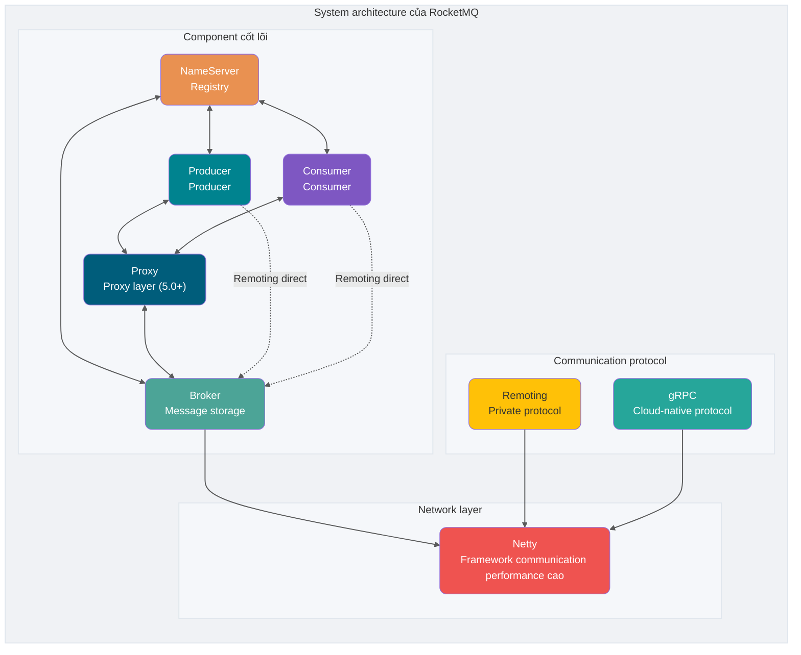

### Điểm chính của component cốt lõi

| Component      | Điểm kỹ thuật                                                                  |
| -------------- | ------------------------------------------------------------------------------ |
| **NameServer** | Registry nhẹ, các node không đồng bộ data                                      |
| **Broker**     | Message storage và delivery, hỗ trợ master-slave                               |
| **Proxy**      | Bổ sung trong 5.0, protocol adaptation và compute offload (component tùy chọn) |
| **Producer**   | Nhiều cách send: synchronous, asynchronous, oneway                             |
| **Consumer**   | Ba consume mode: Push/Pull/Simple                                              |

### NameServer (Registry)

NameServer chịu trách nhiệm lưu trữ metadata, đóng vai trò “hệ thần kinh trung ương” của cluster. Chức năng cốt lõi là cung cấp routing information cho producer và consumer, giúp chúng tìm được địa chỉ Broker tương ứng.

**Chức năng cốt lõi:**

1. **Quản lý Broker**: khi Broker khởi động, chủ động kết nối NameServer và report metadata.
2. **Quản lý routing information**: producer và consumer lấy routing table của Broker từ NameServer.

**Cơ chế heartbeat:**

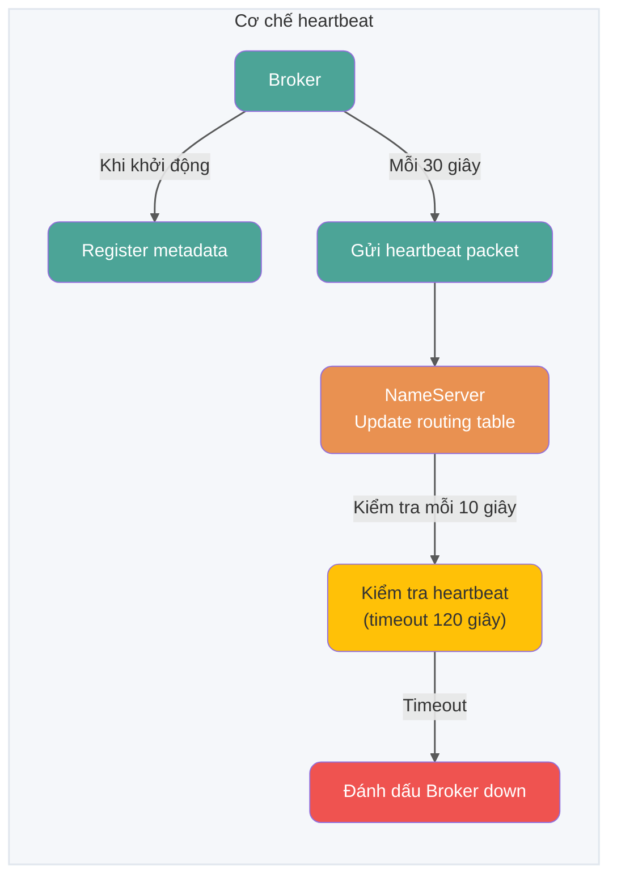

**Metadata bao gồm:**

- Địa chỉ, tên và BrokerId của Broker
- Địa chỉ master node
- Cấu hình queue của toàn bộ Topic trên Broker đó

### Broker (Message storage)

Broker chịu trách nhiệm lưu trữ, delivery, query message và bảo đảm high availability của service.

**Cơ chế storage:**

1. **Ghi message**: sau khi nhận message, append tuần tự vào file CommitLog
2. **Chia file**: khi file vượt kích thước cố định (mặc định 1G), tạo file mới
3. **Chia logic**: MessageQueue là logical partition, ConsumeQueue là message index

**Một Topic phân bố trên nhiều Broker, một Broker có thể cấu hình nhiều Topic; đây là quan hệ nhiều-nhiều**.

Nếu một Topic có volume message rất lớn, nên cấu hình thêm vài queue cho nó (như đã nói ở trên, để tăng concurrency), đồng thời **phân bố càng nhiều càng tốt trên các Broker khác nhau để giảm áp lực cho một Broker**.

Khi volume message giữa các Topic khá đồng đều, một Broker có càng nhiều queue thì áp lực lên Broker đó càng lớn.


### Producer

**Flow send:**

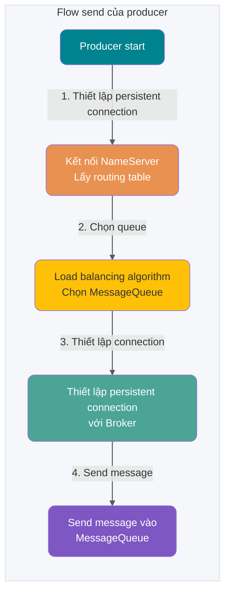

**Ba cách send:**

- **Oneway**: trả về ngay sau khi send, không quan tâm thành công hay không
- **Sync**: chờ response sau khi send
- **Async**: trả về ngay sau khi send, xử lý response trong callback method

### Consumer

**Flow consume:**

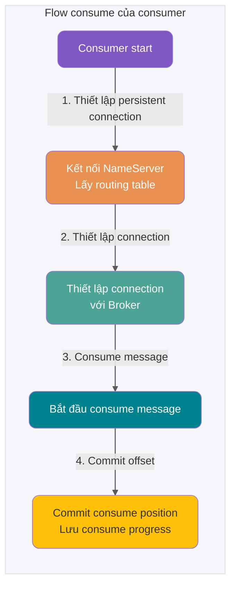

**Ba consume mode:**

- **Pull**: consumer chủ động gửi pull request đến Broker
- **Push**: dùng long polling; chỉ trả về khi Broker có message
- **Pop**: bổ sung trong RocketMQ 5.0; server quản lý rebalance và position

### Network protocol

RocketMQ hiện thường có hai cách truy cập là Remoting và gRPC:

| Hạng mục          | Remoting (traditional protocol)                            | gRPC (SDK mới 5.x)                                                                   |
| ----------------- | ---------------------------------------------------------- | ------------------------------------------------------------------------------------ |
| **Maturity**      | Được dùng lâu trong hệ sinh thái Java, path ngắn           | Phù hợp truy cập đa ngôn ngữ và cloud-native, thường truy cập qua Proxy              |
| **Extensibility** | Truy cập đa ngôn ngữ cần adaptation riêng                  | Dựa trên standard protocol, hệ sinh thái client và gateway governance thân thiện hơn |
| **Trade-off**     | Phù hợp client 4.x hiện có và high-performance link nội bộ | Khi link thêm một lớp Proxy, cần chú ý thêm đến latency và capacity                  |

### Network module (dựa trên Netty)

RPC communication của RocketMQ dùng Netty làm communication library tầng dưới, được mở rộng và tối ưu sâu dựa trên multi-thread Reactor model.

**Tóm tắt thread model:**

- **Reactor main thread**: 1 thread, chịu trách nhiệm listen connection
- **Reactor thread pool**: mặc định 3 thread, xử lý network data
- **Business thread pool**: điều chỉnh động theo số CPU core

### Proxy (Proxy layer, bổ sung trong 5.0)

RocketMQ 5.0 giới thiệu component **Proxy**, đây là biểu hiện cốt lõi của architecture **tách compute và storage**. Proxy làm proxy layer giữa client và Broker, tách các logic compute như protocol adaptation của client, permission management và consume management khỏi Broker, để Broker tập trung hơn vào message storage và high availability. Thiết kế này rất quan trọng với cloud-native architecture, giúp compute layer scale độc lập theo chiều ngang.

**Hai deployment mode:**

| Mode             | Mô tả                                                            | Kịch bản phù hợp                                                 |
| ---------------- | ---------------------------------------------------------------- | ---------------------------------------------------------------- |
| **Local mode**   | Proxy và Broker deploy cùng process, chỉ cần thêm cấu hình Proxy | Upgrade êm từ version cũ hoặc kịch bản không có nhu cầu đặc biệt |
| **Cluster mode** | Proxy và Broker deploy độc lập                                   | Cần scale linh hoạt hoặc tùy biến protocol adaptation            |

**Vai trò cốt lõi:**

- **Protocol adaptation**: hỗ trợ truy cập bằng gRPC, thuận tiện cho client đa ngôn ngữ
- **Compute offload**: tách logic compute như authentication, authorization và consume management khỏi Broker, giảm tải Broker
- **Scale linh hoạt**: Proxy stateless, có thể scale ngang độc lập

> **Lưu ý**: trong version 5.0, client dùng SDK mới (gRPC protocol) cần truy cập qua Proxy; SDK cũ (Remoting protocol) vẫn có thể connect trực tiếp đến Broker.

Giá trị của Proxy không chỉ là “thêm một lớp proxy”. Trong cloud-native scenario, Proxy có thể tách các logic compute như protocol access, authentication, authorization, traffic governance và consume management khỏi Broker, giúp Broker ổn định hơn khi đảm nhiệm storage. Đổi lại, link có thêm một hop, cần chú ý thêm đến scale ngang, latency, rate limiting và monitoring của Proxy.

### Vì sao nhất thiết phải có NameServer?

Hãy xem một architecture model đơn giản:


Bạn có thể nhận ra một vấn đề: NameServer dùng để làm gì? Cho Producer, Consumer và Broker trực tiếp produce và consume message không được sao?

Broker cần bảo đảm high availability. Nếu toàn bộ hệ thống chỉ dựa vào một Broker thì áp lực sẽ rất lớn, vì vậy cần nhiều Broker để bảo đảm **load balancing**. Nếu consumer và producer kết nối trực tiếp với nhiều Broker, mỗi lần Broker thay đổi sẽ ảnh hưởng đến từng producer và consumer, tạo ra coupling. Registry NameServer dùng để giải quyết vấn đề này.

**Design philosophy của NameServer:**

NameServer là **stateless, các node không giao tiếp với nhau**. Điều này đối lập rõ rệt với strong consistency của ZooKeeper (cần election mechanism), thể hiện design philosophy theo đuổi **performance tối đa và architecture đơn giản** của RocketMQ. Mỗi Broker duy trì persistent connection với mọi NameServer và định kỳ report thông tin của mình. Ngay cả khi một node NameServer down, availability của toàn bộ cluster cũng không bị ảnh hưởng.

Dưới đây là architecture diagram từ website chính thức:


So với architecture diagram rút gọn ở trên, khác biệt chủ yếu nằm ở một số chi tiết:

Thứ nhất, Broker **được triển khai thành cluster và còn triển khai master-slave**. Vì message phân bố trên các Broker, khi một Broker down thì việc đọc ghi message trên Broker đó sẽ bị ảnh hưởng. Do đó RocketMQ cung cấp cấu trúc `master/slave`; `slave` định kỳ đồng bộ data từ `master` (sync flush hoặc async flush). Nếu `master` down, **`slave` cung cấp consume service nhưng không thể ghi message** (sẽ giải thích chi tiết sau).

Thứ hai, để bảo đảm HA, NameServer cũng được deploy thành cluster nhưng theo kiểu **decentralized**. Điều đó có nghĩa không có master node; có thể thấy các node NameServer không thực hiện `Info Replicate`. Trong RocketMQ, **một Broker duy trì persistent connection với mọi NameServer**, và **mỗi 30 giây** Broker gửi heartbeat đến mọi NameServer, heartbeat chứa thông tin cấu hình Topic của chính nó. NameServer **mỗi 10 giây** kiểm tra heartbeat; nếu một Broker **hơn 120 giây** không có heartbeat thì coi Broker đó đã down.

Thứ ba, khi producer cần gửi message đến Broker, **trước tiên phải lấy routing information của Broker từ NameServer**, sau đó dùng phương pháp **round-robin** để produce data vào từng queue nhằm đạt hiệu quả **load balancing**.

Thứ tư, sau khi lấy routing information của mọi Broker từ NameServer, consumer gửi request `Pull` đến Broker để lấy message data. Consumer có thể khởi động ở hai mode: **broadcast và cluster**. Ở broadcast mode, một message được gửi đến **mọi consumer trong cùng một Consumer Group**; ở cluster mode, message chỉ được gửi cho một consumer.

## Message trong RocketMQ

### Message thường

Message thường thường được dùng trong các kịch bản decoupling microservice, event-driven và data integration. Phần lớn các kịch bản này yêu cầu channel truyền data có khả năng truyền tin đáng tin cậy, nhưng không có yêu cầu đặc biệt về thời điểm hay thứ tự xử lý message. Lấy giao dịch e-commerce online làm ví dụ: hệ thống order upstream đóng gói event người dùng đặt hàng và thanh toán thành message thường độc lập rồi gửi đến server RocketMQ; downstream subscribe message từ server khi cần và xử lý task theo logic consume local. Các message độc lập với nhau, không cần tạo quan hệ. Ngoài ra còn có hệ thống log: trong kịch bản thu thập log offline, component tracking thu thập operation log liên quan của frontend application rồi chuyển tiếp đến RocketMQ.

**Lifecycle của message thường**


- Khởi tạo: message được producer build và khởi tạo xong, ở trạng thái chờ gửi đến server.
- Chờ consume: message đã được gửi đến server, hiển thị với consumer và chờ consumer consume.
- Đang consume: message được consumer lấy về và xử lý theo logic nghiệp vụ local của consumer. Lúc này server chờ consumer xử lý xong và commit consume result; nếu sau một khoảng thời gian vẫn không nhận được response của consumer, RocketMQ sẽ retry message.
- Commit consume: consumer xử lý xong và commit consume result đến server; nếu consume thất bại hoặc timeout, message sẽ được redeliver theo retry policy, sau khi vượt số lần retry tối đa có thể đi vào dead-letter queue. RocketMQ không xóa message ngay chỉ vì một Consumer Group consume thành công, mà rolling cleanup theo cơ chế lưu message. Trước khi hết retention hoặc storage space không đủ khiến message bị xóa, consumer vẫn có thể rewind message để consume lại.
- Xóa message: RocketMQ rolling cleanup data message cũ nhất theo cơ chế lưu message và xóa message khỏi physical file.

### Timer/Delay message

> **Ghi chú: timer message và delay message về bản chất giống nhau, đều là server dựa trên thời gian timer do message đặt để deliver message cho consumer tại một thời điểm cố định.**

Trong các kịch bản trigger distributed timer scheduling và xử lý task timeout, cần trigger timer event chính xác và đáng tin cậy. Dùng timer message của RocketMQ có thể đơn giản hóa logic development của timer scheduling task, đồng thời cung cấp khả năng trigger có performance cao, extensibility và reliability cao.

**Kịch bản điển hình 1: distributed timer scheduling**

Trong distributed timer scheduling, cần triển khai các timer task với nhiều độ chính xác khác nhau, chẳng hạn chạy file cleanup lúc 5 giờ mỗi ngày, trigger message push mỗi 2 phút. Giải pháp timer scheduling truyền thống dựa trên database có performance không cao và triển khai phức tạp trong distributed scenario.

**Kịch bản điển hình 2: xử lý task timeout**

Lấy giao dịch e-commerce làm ví dụ: sau khi order được đặt nhưng chưa thanh toán, không thể đóng order ngay mà cần chờ một khoảng thời gian rồi mới đóng order. Timer message của RocketMQ có thể trigger việc kiểm tra timeout task.

Xử lý timeout task dựa trên timer message có các ưu điểm sau:

- **Độ chính xác linh hoạt hơn, ngưỡng development thấp**: 5.x không còn chỉ phụ thuộc vào fixed delay level mà có thể đặt delivery time theo timestamp; tuy nhiên delivery grain mặc định vẫn ở mức giây, không nên hiểu là trigger đúng giờ nghiêm ngặt đến từng millisecond.
- **Performance cao và có thể mở rộng**: cách database scan truyền thống khá phức tạp, cần gọi interface scan thường xuyên và dễ tạo performance bottleneck. Timer message của RocketMQ có khả năng concurrency cao và scale ngang.

**Nguyên tắc đặt timer**

Timer được đặt cho timer message của RocketMQ là một system timestamp dự kiến trigger; delay time cũng cần chuyển thành timestamp sau thời điểm hiện tại, không phải một khoảng delay duration.

- **Time format**: Unix timestamp ở mức millisecond
- **Giá trị timer duration tối đa**: mặc định 24 giờ, không hỗ trợ tùy chỉnh
- **Timer phải được đặt sau thời điểm hiện tại**, nếu không timer không có hiệu lực và server sẽ deliver message ngay

**Ví dụ:**

- Timer message: system time hiện tại là 2022-06-09 17:30:00, muốn message được deliver lúc 19:20:00 thì timestamp là 1654773600000
- Delay message: system time hiện tại là 2022-06-09 17:30:00, muốn deliver sau 1 giờ thì timestamp là 1654770600000

**Khác biệt giữa version 4.x và 5.x**

- **Version 4.x**: chỉ hỗ trợ delay message, mặc định chia thành 18 level (1s 5s 10s 30s 1m 2m 3m 4m 5m 6m 7m 8m 9m 10m 20m 30m 1h 2h); cũng có thể thêm delay level và duration tùy chỉnh trong config file.
- **Version 5.x**: hỗ trợ đặt delivery time bằng Unix timestamp ở mức millisecond, linh hoạt hơn fixed delay level của 4.x; nhưng timer grain mặc định là 1000ms, delivery thực tế còn chịu ảnh hưởng của server load, storage recovery... không nên hiểu là trigger đúng giờ nghiêm ngặt đến từng millisecond.

**Lifecycle của timer message**


- **Khởi tạo**: message được producer build và khởi tạo xong, ở trạng thái chờ gửi đến server.
- **Đang chờ timer**: message được gửi đến server. Khác với message thường, server không build message index ngay mà lưu timer message **riêng trong timer storage system**, chờ đến thời điểm timer.
- **Chờ consume**: khi đến thời điểm timer, server ghi message lại vào storage engine thường; message hiển thị với downstream consumer và chờ consumer consume.
- **Đang consume**: message được consumer lấy và xử lý theo logic nghiệp vụ local của consumer. Lúc này server chờ consumer xử lý xong và commit result; nếu sau một khoảng thời gian không nhận response, RocketMQ sẽ retry message.
- **Commit consume**: consumer xử lý xong và commit consume result đến server; nếu consume thất bại hoặc timeout, message vẫn được redeliver theo retry policy, sau khi vượt số lần retry tối đa có thể đi vào dead-letter queue. RocketMQ không xóa message ngay chỉ vì một Consumer Group consume thành công, mà rolling cleanup theo cơ chế lưu message.
- **Xóa message**: Apache RocketMQ rolling cleanup data message cũ nhất theo cơ chế lưu message và xóa message khỏi physical file.

**Giới hạn sử dụng**

1. **Tính nhất quán của message type**: timer message chỉ được dùng trong Topic có MessageType là Delay
2. **Giới hạn độ chính xác của timer**: tham số timer duration chính xác đến millisecond nhưng precision mặc định là 1000ms (precision theo giây)

**Khuyến nghị sử dụng**

Logic triển khai timer message cần trước tiên đi qua timer storage để chờ trigger; chỉ sau khi đến thời điểm timer mới deliver cho consumer. Vì vậy, nếu đặt thời điểm timer của một lượng lớn timer message trùng nhau, khi đến thời điểm đó sẽ có lượng lớn message cần xử lý đồng thời, gây áp lực quá lớn lên hệ thống, làm chậm message delivery và ảnh hưởng độ chính xác của timer.

### Ordered message

**Ordered message là gì**

Ordered message là một loại message nâng cao do Apache RocketMQ cung cấp, hỗ trợ consumer lấy message theo thứ tự gửi, qua đó thực hiện xử lý theo thứ tự trong các kịch bản nghiệp vụ.

**Kịch bản sử dụng**

Trong các kịch bản xử lý event theo thứ tự, matching transaction và realtime incremental data sync, các hệ thống không đồng nhất cần duy trì state synchronization có strong consistency; thay đổi event ở upstream cần được truyền xuống downstream theo thứ tự để xử lý.

- **Matching transaction**: trong matching transaction chứng khoán, cổ phiếu, với các order có cùng giá, giữ nguyên nguyên tắc ai ra giá trước thì giao dịch trước; hệ thống xử lý order downstream phải xử lý nghiêm ngặt theo thứ tự ra giá.
- **Realtime incremental data sync**: trong incremental sync thay đổi database, source database upstream thực hiện thêm, xóa, sửa theo nhu cầu, dùng binary operation log làm message truyền qua RocketMQ đến search system downstream; downstream khôi phục data message theo thứ tự để refresh state data theo thứ tự.

**Bảo đảm message ordering thế nào**

Message ordering của RocketMQ gồm hai phần: **ordering khi produce** và **ordering khi consume**.

**Ordering khi produce**

Nếu cần bảo đảm thứ tự produce message thì phải thỏa mãn:

1. **Một producer duy nhất**: ordering khi produce message chỉ hỗ trợ một producer
2. **Send tuần tự**: khi producer send song song bằng nhiều thread, không thể xác định thứ tự trước sau giữa các message từ các thread khác nhau

Producer thỏa mãn các điều kiện trên khi gửi ordered message đến RocketMQ sẽ bảo đảm message có cùng **MessageGroup** được lưu trong cùng một queue theo thứ tự gửi.

**MessageGroup**

Quan hệ thứ tự của ordered message trong RocketMQ được xác định và nhận diện qua MessageGroup. Khi gửi ordered message, cần đặt MessageGroup cho từng message.

- Nhiều message có **cùng MessageGroup** tuân theo quan hệ FIFO
- Message thuộc **MessageGroup khác nhau** hoặc không có MessageGroup không có ordering relation

Dựa trên logic xác định thứ tự bằng MessageGroup, có thể chia nhỏ theo business logic, tăng parallelism và throughput khi vẫn bảo đảm thứ tự cục bộ của nghiệp vụ.

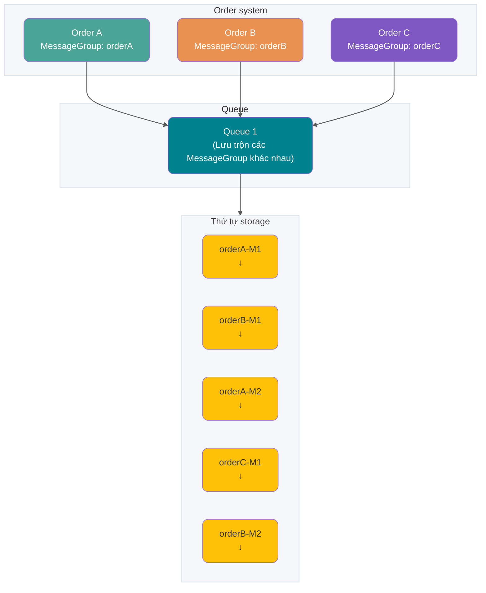

**Giải thích**:

- M1, M2 của MessageGroup orderA giữ nguyên thứ tự
- M1, M2 của MessageGroup orderB giữ nguyên thứ tự
- MessageGroup khác nhau có thể được lưu trộn trong cùng một queue

**Ordering khi consume**

Nếu cần bảo đảm thứ tự consume message thì phải thỏa mãn:

1. **Delivery order**: RocketMQ bảo đảm deliver message theo thứ tự server storage thông qua client SDK và communication protocol của server
2. **Retry hữu hạn**: ordered message chỉ được redeliver trong giới hạn số lần retry; sau khi vượt số lần retry tối đa sẽ không retry nữa và bỏ qua việc consume message đó

**Ảnh hưởng của loại consumer đến ordered consume**

- **PushConsumer**: RocketMQ bảo đảm deliver từng message một cho consumer theo thứ tự storage
- **SimpleConsumer**: consumer có thể pull nhiều message một lần; khi đó business phải tự bảo đảm thứ tự consume message

**Kết hợp ordering khi produce và ordering khi consume**

| Ordering khi produce                              | Ordering khi consume | Hiệu quả ordering                                                      |
| ------------------------------------------------- | -------------------- | ---------------------------------------------------------------------- |
| Đặt MessageGroup, bảo đảm send theo thứ tự        | Ordered consume      | Bảo đảm nghiêm ngặt thứ tự theo grain MessageGroup                     |
| Đặt MessageGroup, bảo đảm send theo thứ tự        | Concurrent consume   | Consume concurrent, cố gắng xử lý theo thứ tự thời gian                |
| Không đặt MessageGroup, send message không thứ tự | Ordered consume      | Chỉ bảo đảm thứ tự lưu trong queue, không bảo đảm thứ tự business send |
| Không đặt MessageGroup, send message không thứ tự | Concurrent consume   | Consume concurrent, cố gắng xử lý theo thứ tự thời gian                |

**Giới hạn sử dụng**

1. **Tính nhất quán của message type**: ordered message chỉ được dùng trong Topic có MessageType là FIFO; trong RocketMQ 5.x còn phải đặt MessageGroup cho ordered message và cấu hình Consumer Group thành ordered delivery, nếu không message vẫn có thể được deliver theo kiểu concurrent
2. Khi ordered message consume thất bại và retry, để bảo đảm ordering, các message phía sau không được consume mà phải chờ message phía trước consume xong mới được xử lý

**Khuyến nghị sử dụng**

1. **Consume tuần tự**: nên xử lý consume message tuần tự, tránh consume nhiều message một lần gây loạn thứ tự
2. **Phân tán MessageGroup càng đều càng tốt**: nên chia nghiệp vụ theo grain MessageGroup, chẳng hạn dùng order ID hoặc user ID làm keyword của MessageGroup. Như vậy message của cùng một end user được xử lý theo thứ tự, còn message của user khác không cần bảo đảm thứ tự

### Transaction message

**Transaction message là gì**

Transaction message là một loại message nâng cao do Apache RocketMQ cung cấp, hỗ trợ bảo đảm eventual consistency giữa message production và local transaction trong distributed scenario. Nói đơn giản, đó là gộp local transaction (thao tác DML của database) và send message vào cùng một transaction.

**Kịch bản sử dụng**

Đặc điểm của distributed system call là thực thi một core business logic đồng thời cần gọi nhiều downstream business để xử lý. Bảo đảm kết quả thực thi của nghiệp vụ cốt lõi và nhiều downstream business hoàn toàn nhất quán là vấn đề chính mà distributed transaction cần giải quyết.

Lấy giao dịch e-commerce làm ví dụ, thao tác cốt lõi là người dùng thanh toán order, đồng thời liên quan đến thay đổi của nhiều subsystem downstream như logistics delivery, điểm thưởng và xóa trạng thái shopping cart:

- **Update state của order system branch chính**: chuyển từ chưa thanh toán sang thanh toán thành công
- **Thêm state của logistics system**: thêm record logistics chờ giao hàng, tạo order logistics record
- **Thay đổi state của point system**: thay đổi điểm người dùng, update user points table
- **Thay đổi state của shopping cart system**: clear shopping cart, update user shopping cart record

**Vấn đề của giải pháp truyền thống**

- **Giải pháp XA transaction truyền thống**: distributed transaction system dựa trên XA protocol có thể thực hiện consistency, nhưng trong môi trường nhiều branch, phạm vi lock resource lớn và concurrency thấp
- **Giải pháp dựa trên message thường**: message thường và order transaction không bảo đảm consistency, dễ xảy ra các tình huống send message thành công nhưng order thất bại, hoặc order thành công nhưng send message thất bại

**Giải pháp transaction message của RocketMQ**

Giải pháp transaction message của RocketMQ có ưu điểm performance cao, extensibility và development nghiệp vụ đơn giản; hỗ trợ two-phase commit, bind two-phase commit với local transaction để thực hiện **eventual consistency giữa local transaction và send message**.

**Flow xử lý transaction message**

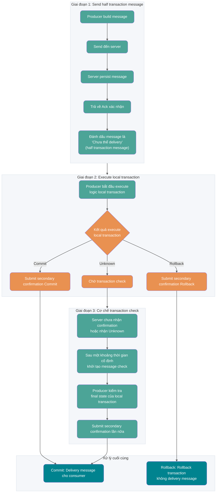

1. Producer gửi message đến RocketMQ server
2. Sau khi persist message thành công, server trả về Ack cho producer xác nhận message đã send thành công; lúc này message được đánh dấu là “chưa thể delivery”, message ở trạng thái này gọi là **half transaction message**
3. Producer bắt đầu execute local transaction logic
4. Producer submit kết quả secondary confirmation (Commit hoặc Rollback) đến server theo kết quả execute local transaction
5. Nếu server chưa nhận secondary confirmation hoặc kết quả nhận được là Unknown, sau một khoảng thời gian cố định server sẽ khởi tạo **message check** với producer
6. Sau khi nhận message check, producer cần kiểm tra final result của local transaction tương ứng với message
7. Producer submit secondary confirmation lần nữa theo final state của local transaction đã kiểm tra

**Lifecycle của transaction message**

- **Khởi tạo**: half transaction message được producer build và khởi tạo xong, ở trạng thái chờ gửi đến server
- **Transaction chờ commit**: sau khi half transaction message được gửi đến server, message được persist trong storage liên quan đến transaction nhưng chưa đi vào trạng thái có thể consume thông thường; cần chờ local transaction ở phase hai trả về Commit hoặc Rollback rồi mới quyết định có delivery hay không. Lúc này message không hiển thị với downstream consumer
- **Rollback message**: nếu kết quả execute transaction ở phase hai là rollback rõ ràng, server rollback half transaction message và flow transaction kết thúc
- **Commit, chờ consume**: nếu kết quả execute transaction ở phase hai là commit rõ ràng, server lưu half transaction message lại vào storage system thường; lúc này message hiển thị với downstream consumer
- **Đang consume**: message được consumer lấy và xử lý theo logic nghiệp vụ local của consumer
- **Commit consume**: consumer xử lý xong và submit consume result đến server; nếu consume thất bại hoặc timeout, vẫn đi vào flow retry, dead-letter hoặc compensation
- **Xóa message**: RocketMQ rolling cleanup data message cũ nhất theo cơ chế lưu message

**Giới hạn sử dụng**

1. **Tính nhất quán của message type**: transaction message chỉ được dùng trong Topic có MessageType là Transaction
2. **Tính transaction khi consume**: transaction message của RocketMQ bảo đảm consistency giữa local main-branch transaction và transaction send message đến downstream, nhưng không bảo đảm consistency giữa consume result của message và upstream transaction
3. **Khả năng hiển thị của intermediate state**: transaction message mang tính eventual consistency; trước khi message được commit và xử lý xong ở downstream consumer, state giữa downstream branch và upstream transaction sẽ không nhất quán
4. **Cơ chế transaction timeout**: lifecycle của transaction message có timeout mechanism. Sau khi half transaction message được producer gửi đến server, nếu server không thể xác nhận state commit hoặc rollback trong thời gian chỉ định thì message mặc định bị rollback
5. **Cơ chế transaction check**: server mặc định **mỗi 60 giây** check các half transaction message chưa được confirm; timeout tối đa mặc định của half transaction message là **4 giờ**, sau timeout sẽ bị rollback bắt buộc. Version cũ hoặc một số implementation của cloud vendor có thể còn expose tham số số lần check tối đa; khi phỏng vấn và cấu hình production cần xác nhận theo version thực tế.

**Khuyến nghị sử dụng**

1. **Tránh nhiều transaction pending gây timeout**: producer nên tránh để local transaction trả về kết quả unknown; quá nhiều transaction check sẽ làm giảm performance hệ thống
2. **Xử lý đúng transaction “đang thực hiện”**: khi message check, với transaction đang thực hiện không được trả về Rollback hoặc Commit mà nên tiếp tục giữ trạng thái Unknown
3. **Có thể query local transaction state**: transaction check phụ thuộc producer query final state của local transaction; nên persist vào database hoặc reliable storage, không chỉ để trong process memory
4. **Downstream consume vẫn cần idempotent**: transaction message giải quyết consistency giữa “local transaction và send message”, không bảo đảm business của consumer chắc chắn thành công; consume side vẫn cần retry, idempotent và compensation

### Về việc send message

#### Không nên tạo nhiều producer trong một process

Producer và Topic của Apache RocketMQ có quan hệ nhiều-nhiều, hỗ trợ một producer gửi message đến nhiều Topic. Khi tạo và khởi tạo producer, nên tuân theo nguyên tắc đủ dùng và reuse tối đa. Nếu cần send message đến nhiều Topic thì không cần tạo một producer cho từng Topic.

#### Không nên thường xuyên tạo và hủy producer

Producer của Apache RocketMQ là underlying resource có thể reuse, tương tự database connection pool. Vì vậy không cần dynamic create producer mỗi lần send message rồi destroy producer sau khi send xong. Việc create và destroy thường xuyên sẽ tạo nhiều short connection request ở server, ảnh hưởng nghiêm trọng đến performance hệ thống.

Ví dụ đúng:

```java
Producer p = ProducerBuilder.build();
for (int i =0;i<n;i++){
    Message m= MessageBuilder.build();
    p.send(m);
 }
p.shutdown();
```

## Phân loại consumer

### PushConsumer (Push-mode consumer)

**Đặc điểm cốt lõi:**

Đây là loại consumer được đóng gói ở mức cao. Consume message chỉ cần thông qua consumer listener để listen và trả về result. Việc lấy message, submit consume state và retry consume đều do client SDK của RocketMQ hoàn tất.

**Kịch bản phù hợp:**

- Processing time của message có thể ước lượng
- Không có nhu cầu asynchronous hoặc custom nâng cao
- Muốn phát triển nhanh

**Ví dụ sử dụng:**

```java
public static void main(String[] args) throws InterruptedException, MQClientException {
    // Tạo consumer Push mode
    DefaultMQPushConsumer consumer = new DefaultMQPushConsumer("CID_JODIE_1");

    // Subscribe Topic
    consumer.subscribe("TopicTest", "*");

    // Đặt vị trí bắt đầu consume
    consumer.setConsumeFromWhere(ConsumeFromWhere.CONSUME_FROM_FIRST_OFFSET);

    // Register message listener
    consumer.registerMessageListener(new MessageListenerConcurrently() {
        @Override
        public ConsumeConcurrentlyStatus consumeMessage(
                List<MessageExt> msgs,
                ConsumeConcurrentlyContext context) {
            System.out.printf("Receive New Messages: %s %n", msgs);
            // Logic xử lý nghiệp vụ
            return ConsumeConcurrentlyStatus.CONSUME_SUCCESS;
        }
    });

    consumer.start();
}
```

**Kết quả thực thi của consumer listener:**

- **Trả về consume success**: biểu thị message được xử lý thành công, server update consume progress theo consume result
- **Trả về consume failure**: biểu thị message xử lý thất bại, cần quyết định có retry consume theo logic retry hay không
- **Throw exception**: xử lý như consume failure, cần quyết định có retry consume theo logic retry hay không

**Lưu ý khi sử dụng:**

Khi PushConsumer consume, không được xử lý message theo các cách sau:

1. **Cách sai 1**: message chưa xử lý xong đã trả về consume success. Nếu consume message thất bại, RocketMQ server không thể nhận biết nên sẽ không retry consume.

2. **Cách sai 2**: phân phối message sang thread khác do tự định nghĩa trong consumer listener rồi trả về consume result sớm. Nếu consume message thất bại, RocketMQ server cũng không thể nhận biết nên sẽ không retry consume.

**Nguyên lý hoạt động của Push mode:**

1. **Load balancing**: thread RebalanceService load balance theo số queue và số consumer, đưa pullRequest của queue được phân bổ vào pullRequestQueue
2. **Pull message**: thread PullMessageService liên tục lấy pullRequest từ pullRequestQueue, pull message từ Broker và cache vào ProcessQueue
3. **Consume message**: thread ConsumeMessageService lấy message từ ProcessQueue và gọi listener để xử lý nghiệp vụ
4. **Commit position**: tự động commit consume position sau khi consume xong
5. **Flow control protection**: kiểm tra cache threshold trước khi pull (1000 message hoặc 100M), nếu vượt thì trì hoãn pull

### SimpleConsumer

SimpleConsumer là loại consumer có interface atomic. Việc lấy message, submit consume state và retry consume đều do business logic của consumer chủ động gọi để hoàn tất.

**Invisible Time:**

Cơ chế cốt lõi của SimpleConsumer là **Invisible Time**. Sau khi consumer lấy message, message đó không hiển thị với consumer khác trong Invisible Time được chỉ định. Nếu consume xong và submit ACK trong Invisible Time, message được đánh dấu đã consume; nếu quá timeout mà chưa submit ACK, message hiển thị trở lại và có thể được consumer khác lấy. Cơ chế này khác với retry queue định thời của PushConsumer: SimpleConsumer thực hiện retry control linh hoạt hơn bằng cách dynamic update Invisible Time.

Ví dụ từ website chính thức:

```java
// Ví dụ consume: dùng SimpleConsumer consume message thường, chủ động lấy message, xử lý và submit.
ClientServiceProvider provider = ClientServiceProvider.loadService();
String topic = "YourTopic";
FilterExpression filterExpression = new FilterExpression("YourFilterTag", FilterExpressionType.TAG);
SimpleConsumer simpleConsumer = provider.newSimpleConsumerBuilder()
        // Đặt Consumer Group.
        .setConsumerGroup("YourConsumerGroup")
        // Đặt endpoint.
        .setClientConfiguration(ClientConfiguration.newBuilder().setEndpoints("YourEndpoint").build())
        // Đặt subscription relation đã bind trước.
        .setSubscriptionExpressions(Collections.singletonMap(topic, filterExpression))
        // Đặt thời gian chờ tối đa để nhận message từ server
        .setAwaitDuration(Duration.ofSeconds(1))
        .build();
try {
    // SimpleConsumer cần chủ động lấy và xử lý message.
    List<MessageView> messageViewList = simpleConsumer.receive(10, Duration.ofSeconds(30));
    messageViewList.forEach(messageView -> {
        System.out.println(messageView);
        // Sau khi xử lý consume xong, cần chủ động gọi ACK để submit consume result.
        try {
            simpleConsumer.ack(messageView);
        } catch (ClientException e) {
            logger.error("Failed to ack message, messageId={}", messageView.getMessageId(), e);
        }
    });
} catch (ClientException e) {
    // Nếu pull failure do flow control của hệ thống..., cần khởi tạo lại request lấy message.
    logger.error("Failed to receive message", e);
}
```

SimpleConsumer phù hợp với các kịch bản sau:

- Processing duration của message không thể kiểm soát: nếu không thể ước lượng processing duration và thường có message xử lý lâu, nên dùng SimpleConsumer; khi consume có thể custom processing duration dự kiến, nếu duration dự kiến không phù hợp thực tế cũng có thể sửa trước bằng interface.
- Cần các kịch bản custom nâng cao như asynchronous và batch consume: SDK của SimpleConsumer không đóng gói thread phức tạp bên trong, hoàn toàn để business logic tự custom, có thể thực hiện asynchronous dispatch, batch consume...
- Cần custom consume rate: SimpleConsumer do business logic chủ động gọi interface lấy message, nên có thể tự do điều chỉnh tần suất lấy message và custom consume rate.

**Nguyên lý hoạt động của SimpleConsumer:**

1. **Chủ động lấy message**: business gọi interface `receive()` để chủ động lấy message
2. **Xử lý nghiệp vụ**: business tự xử lý message đã lấy
3. **Chủ động submit ACK**: sau khi xử lý consume xong, business chủ động gọi interface `ack()` để submit consume result
4. **Khả năng kiểm soát cao**: business hoàn toàn kiểm soát thời điểm xử lý và consume rate của message

### PullConsumer (Pull-mode consumer)

**Đặc điểm cốt lõi:**

Trong Pull mode, **application tham gia nhiều vào quá trình pull message và có khả năng kiểm soát cao**, có thể tự quyết định khi nào pull message và pull message từ offset nào.

**So sánh với Push mode:**

| Đặc tính                    | Push mode                            | Pull mode                   |
| --------------------------- | ------------------------------------ | --------------------------- |
| **Quyền kiểm soát**         | Client SDK tự động pull              | Application chủ động pull   |
| **Khả năng kiểm soát**      | Không đủ cao                         | Cao                         |
| **Độ phức tạp development** | Đơn giản, chỉ cần implement listener | Cần quản lý quá trình pull  |
| **Kịch bản phù hợp**        | Có thể ước lượng message processing  | Cần kiểm soát pull chi tiết |

**Ví dụ sử dụng (DefaultMQPullConsumer):**

```java
@Test
public void testPullConsumer() throws Exception {
    DefaultMQPullConsumer consumer = new DefaultMQPullConsumer("group1_pull");
    consumer.setNamesrvAddr(this.nameServer);
    String topic = "topic1";
    consumer.start();

    // Lấy MessageQueue tương ứng với Topic
    Set<MessageQueue> messageQueues = consumer.fetchSubscribeMessageQueues(topic);
    int maxNums = 10; // Số message tối đa mỗi lần pull

    while (true) {
        boolean found = false;
        for (MessageQueue messageQueue : messageQueues) {
            // Lấy consume position
            long offset = consumer.fetchConsumeOffset(messageQueue, false);
            // Pull message
            PullResult pullResult = consumer.pull(messageQueue, "tag8", offset, maxNums);

            switch (pullResult.getPullStatus()) {
                case FOUND:
                    found = true;
                    List<MessageExt> msgs = pullResult.getMsgFoundList();
                    System.out.println("Đã nhận message, số lượng----" + msgs.size());
                    // Xử lý message
                    for (MessageExt msg : msgs) {
                        System.out.println("Xử lý message——" + msg.getMsgId());
                    }
                    // Update consume position
                    long nextOffset = pullResult.getNextBeginOffset();
                    consumer.updateConsumeOffset(messageQueue, nextOffset);
                    break;
                case NO_NEW_MSG:
                    System.out.println("Không có message mới");
                    break;
                case NO_MATCHED_MSG:
                    System.out.println("Không có message phù hợp");
                    break;
                case OFFSET_ILLEGAL:
                    System.err.println("offset không hợp lệ");
                    break;
            }
        }
        if (!found) {
            // Không có queue nào có message mới thì tạm dừng một lúc
            TimeUnit.MILLISECONDS.sleep(5000);
        }
    }
}
```

**Ví dụ sử dụng (DefaultLitePullConsumer - khuyến nghị):**

```java
DefaultLitePullConsumer litePullConsumer =
        new DefaultLitePullConsumer("lite_pull_consumer_test");
litePullConsumer.setConsumeFromWhere(ConsumeFromWhere.CONSUME_FROM_FIRST_OFFSET);
litePullConsumer.subscribe("TopicTest", "*");
litePullConsumer.start();

try {
    while (running) {
        // Application chủ động gọi method poll để pull message
        List<MessageExt> messageExts = litePullConsumer.poll();
        System.out.printf("%s%n", messageExts);
    }
} finally {
    litePullConsumer.shutdown();
}
```

**Kịch bản phù hợp:**

- **Cần kiểm soát chi tiết thời điểm pull**: có thể tự quyết định khi nào pull message theo nhu cầu nghiệp vụ
- **Cần kiểm soát consume rate**: có thể linh hoạt điều chỉnh tần suất pull
- **Kịch bản batch consume**: có thể pull nhiều message một lần để batch process
- **Nhu cầu consume đặc biệt**: chẳng hạn cần bắt đầu consume từ offset cụ thể hoặc cần tạm dừng consume

**Nguyên lý hoạt động của Pull mode:**

1. **Load balancing**: khi thread RebalanceService phát hiện consume snapshot thay đổi, khởi động message pull thread
2. **Pull message**: sau khi PullTaskImpl pull được message, đưa message vào consumeRequestCache
3. **Consume message**: application gọi method `poll`, liên tục pull message từ consumeRequestCache để xử lý nghiệp vụ

### So sánh ba loại consumer

| Hạng mục                    | PushConsumer                                                                                                          | SimpleConsumer                                                                       | PullConsumer                                                             |
| --------------------------- | --------------------------------------------------------------------------------------------------------------------- | ------------------------------------------------------------------------------------ | ------------------------------------------------------------------------ |
| Cách dùng interface         | Dùng listener callback interface trả về consume result; consumer chỉ được xử lý logic consume trong phạm vi listener. | Business tự implement xử lý message và chủ động gọi interface trả về consume result. | Business tự pull message theo queue và có thể chọn submit consume result |
| Quản lý consume concurrency | SDK quản lý consume concurrency.                                                                                      | Business tự quản lý consume thread.                                                  | Business tự quản lý consume thread.                                      |
| Grain load balancing        | SDK 5.x mặc định theo message, version cũ theo queue                                                                  | SDK 5.x mặc định theo message                                                        | Theo queue, batch throughput tốt hơn nhưng dễ mất cân bằng               |
| Độ linh hoạt của interface  | Đóng gói cao, kém linh hoạt.                                                                                          | Interface atomic, có thể custom linh hoạt.                                           | Interface atomic, có thể custom linh hoạt.                               |
| Kịch bản phù hợp            | Phù hợp development business message không có flow custom.                                                            | Phù hợp development business cần custom flow ở mức cao.                              | Chỉ khuyến nghị tích hợp trong stream processing framework               |

**Khuyến nghị lựa chọn:**

- **Kịch bản thường**: ưu tiên **PushConsumer**, development đơn giản, SDK tự quản lý pull và submit
- **Processing duration của message không kiểm soát được**: dùng **SimpleConsumer**, có thể custom processing duration
- **Cần kiểm soát chi tiết**: dùng **PullConsumer**, hoàn toàn tự kiểm soát flow pull

**Lưu ý**: trong production, nghiêm cấm dùng lẫn PullConsumer với hai loại consumer còn lại dưới cùng ConsumerGroup, nếu không sẽ khiến consume message bất thường.

## Consumer Group và Producer Group

### Producer Group

Trong domain model mới của RocketMQ 5.x, **producer là runtime entity lightweight và anonymous**, thường không còn cần quản lý ProducerGroup như version cũ. Tuy nhiên trong client 3.x/4.x, hệ sinh thái Spring hoặc compatibility mode vẫn có thể thấy cấu hình ProducerGroup; khi migration không nên xóa đơn giản mà cần xác nhận theo client version thực tế.

### Consumer Group

Consumer Group là group load balancing của nhiều consumer có hành vi consume giống nhau. Consumer Group không phải entity cụ thể mà là một logical resource. Thông qua Consumer Group có thể scale ngang consume performance và thực hiện high availability disaster recovery.

**Vai trò cốt lõi của Consumer Group:**

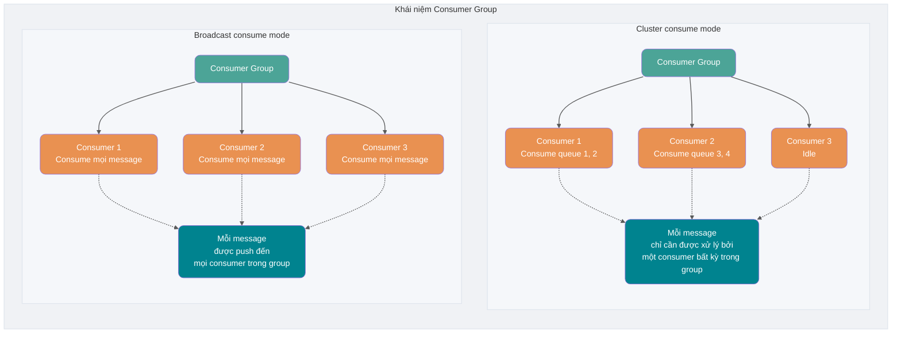

Subscription relation, delivery ordering và retry policy của consumer trong Consumer Group là nhất quán.

- Subscription relation: Apache RocketMQ quản lý subscription relation theo grain Consumer Group, thực hiện quản lý và truy vết subscription relation.
- Delivery ordering: khi Apache RocketMQ server deliver message cho consumer, hỗ trợ ordered delivery và concurrent delivery; delivery mode được cấu hình thống nhất trong Consumer Group.
- Retry policy: retry policy khi consumer consume message thất bại, gồm số lần retry, cấu hình dead-letter queue...

RocketMQ server version 5.x: hành vi consume của các consumer trên được lấy thống nhất từ Consumer Group liên kết, vì vậy hành vi consume của mọi consumer trong cùng group chắc chắn nhất quán; client không cần quan tâm.

RocketMQ server version lịch sử 3.x/4.x: logic consume trên do interface của consumer client định nghĩa, vì vậy khi cấu hình consumer client, bạn cần tự bảo đảm hành vi consume của consumer trong cùng group nhất quán (theo website chính thức).

**So sánh hai consume mode:**

| Chiều so sánh        | Cluster consume mode                                                        | Broadcast consume mode                                      |
| -------------------- | --------------------------------------------------------------------------- | ----------------------------------------------------------- |
| **Consume message**  | Mỗi message chỉ cần được xử lý bởi một consumer bất kỳ trong Consumer Group | Mỗi message được push đến mọi consumer trong Consumer Group |
| **Scale up/down**    | Có thể tăng hoặc giảm consume capacity bằng cách scale số consumer          | Scale số consumer không làm tăng hoặc giảm consume capacity |
| **Kịch bản phù hợp** | Cần tăng consume capacity và tránh consume trùng lặp                        | Cần mọi consumer đều nhận message                           |

## Giải quyết ordered consume và duplicate consume thế nào?

Thực ra đây là những vấn đề đã được nhắc đến khi giới thiệu tác dụng phụ của Message Queue. Nói cách khác, các vấn đề này không chỉ liên quan đến RocketMQ mà mọi middleware message đều cần giải quyết.

Ở phần giới thiệu technical architecture của RocketMQ, tôi đã cho bạn thấy **RocketMQ bảo đảm high availability thế nào**. Phần này không nói về triển khai vận hành; nếu hứng thú, bạn có thể tự làm theo ví dụ trên website chính thức để triển khai cluster RocketMQ của riêng mình.

> Về cơ bản architecture của Kafka tương tự RocketMQ, chỉ là Kafka thời kỳ đầu phụ thuộc ZooKeeper để quản lý metadata, còn **Partition** của Kafka tương đương **Queue** trong RocketMQ. Một số khác biệt nhỏ sẽ được nhắc đến sau.
>
> Bổ sung: Kafka thời kỳ đầu phụ thuộc ZooKeeper để quản lý metadata, còn version mới đã giới thiệu KRaft mode. So sánh ở đây là tư tưởng architecture “Partition/Queue dùng để tăng parallelism”, không nên tiếp tục mặc định đơn giản rằng Kafka luôn phụ thuộc ZooKeeper.

### Ordered consume

Trong phần giới thiệu technical architecture ở trên, chúng ta đã biết **Topic của RocketMQ không có thứ tự, chỉ ở cấp queue mới bảo đảm ordering**.

Điều này dẫn đến hai khái niệm **ordering thường** và **strict ordering**.

Ordering thường nghĩa là message consumer nhận từ **cùng một consume queue có thứ tự**, còn message nhận từ các queue khác nhau có thể không có thứ tự. Ordered message thường **không bảo đảm ordering trong thời gian ngắn khi Broker restart**.

Strict ordering nghĩa là **mọi message** consumer nhận được đều có thứ tự. Strict ordered message **vẫn bảo đảm ordering ngay cả trong tình huống bất thường**.

Strict ordering nghe có vẻ tốt, nhưng triển khai sẽ phải trả giá rất lớn. Nếu dùng strict ordering mode, chỉ cần một máy trong Broker cluster unavailable thì cả cluster đều unavailable. Còn dùng gì nữa? Hiện nay kịch bản chính của nó chỉ là sync `binlog`.

Nói chung, MQ thường có thể chịu được việc loạn thứ tự trong thời gian ngắn, nên khuyến nghị dùng normal ordering mode.

Hiện tại chúng ta dùng **normal ordering mode**. Từ phần trên, ta biết khi Producer produce message sẽ round-robin (phụ thuộc load balancing strategy) để gửi message vào các MessageQueue khác nhau của cùng Topic. Nếu có vài message lần lượt là create, pay và ship của cùng một order, dưới round-robin thì **ba message này sẽ được gửi vào các queue khác nhau**; vì ở các queue khác nhau nên không thể dùng đặc tính ordering ở cấp queue của RocketMQ để bảo đảm thứ tự message.


Giải quyết thế nào?

Thực ra rất đơn giản: chỉ cần đưa các message cùng một semantic vào cùng một queue (ở đây là cùng một order), sau đó dùng **Hash modulo** để bảo đảm cùng một order nằm trong cùng một queue.

**Version 4.x: dùng MessageQueueSelector**

RocketMQ 4.x triển khai custom queue selection logic bằng cách implement `MessageQueueSelector`:

```java
SendResult sendResult = producer.send(msg, new MessageQueueSelector() {
    @Override
    public MessageQueue select(List<MessageQueue> mqs, Message msg, Object arg) {
        // Tính queue index theo order ID hoặc business keyword
        Long orderId = (Long) arg;
        int index = Math.floorMod(Long.hashCode(orderId), mqs.size());
        return mqs.get(index);
    }
}, orderId);
```

**Version 5.x: dùng MessageGroup**

RocketMQ 5.x giới thiệu khái niệm **MessageGroup**, bảo đảm ordering trong cùng group bằng cách đặt MessageGroup:

```java
Message message = messageBuilder.setTopic("topic")
        .setTag("messageTag")
        // Đặt group sắp xếp cho ordered message
        .setMessageGroup("fifoGroup001")  // Chẳng hạn dùng order ID làm MessageGroup
        .setBody("messageBody".getBytes())
        .build();
```

**Queue selection algorithm**

RocketMQ triển khai hai queue selection algorithm:

- **Round-robin algorithm** (mặc định): lần lượt gửi message vào các queue thuộc topic được chỉ định, bảo đảm message phân bố đều
- **Minimum delivery latency algorithm**: mỗi lần delivery message, thống kê delivery latency và ưu tiên queue có message latency thấp khi chọn queue

```java
// Bật minimum delivery latency algorithm
producer.setSendLatencyFaultEnable(true);
```

### Xử lý tình huống đặc biệt

#### Send exception

Sau khi chọn queue, client kết nối với Broker và gửi message qua network request đến Broker. Nếu Broker down hoặc send message timeout do network fluctuation, RocketMQ sẽ retry.

Chọn MessageQueue của Broker khác để send, mặc định retry hai lần, có thể tự cấu hình.

```java
producer.setRetryTimesWhenSendFailed(5);
```

#### Message quá lớn

Cần phân biệt hai giới hạn: client có thể cấu hình nén message body khi vượt threshold (chẳng hạn Java 4.x client thường có default là 4KB), còn trong parameter chính thức của RocketMQ 5.x, message body tối đa mặc định là 4MB và kích thước này không bao gồm hiệu quả bổ sung sau nén. Không nên nhét trực tiếp file lớn vào message body; thông thường đặt file trong object storage hoặc file system, còn trong MQ chỉ truyền business ID và file address.

### Duplicate consume

RocketMQ và phần lớn Message Queue thường được thiết kế theo **at-least-once delivery** trong thực tế: chỉ cần xảy ra consume failure, timeout, client restart hoặc network fluctuation, cùng một business message có thể được delivery lại. Vì vậy, tư tưởng cốt lõi để giải quyết duplicate consume là hai chữ **idempotent**. Trong programming, một operation _idempotent_ có đặc điểm là ảnh hưởng của việc thực thi nhiều lần bất kỳ giống với ảnh hưởng của một lần thực thi. Chẳng hạn có hệ thống cộng điểm khi xử lý order; mỗi khi có message, hệ thống cộng điểm tương ứng cho người dùng tạo order. Một lần, Message Queue gửi thông tin order của FrancisQ cho order system, yêu cầu cộng 500 điểm cho FrancisQ. Nhưng sau khi point system nhận và xử lý xong thông tin order của FrancisQ, lúc trả response xử lý thành công về Message Queue thì network fluctuation xảy ra (tất nhiên còn nhiều tình huống khác như Broker restart bất ngờ), khiến response không gửi thành công.

Message Queue không nhận được response của point system thì có thử send lại message không? Vấn đề là nếu send lại, chẳng may tài khoản FrancisQ lại được cộng thêm 500 điểm thì sao?

Vì vậy consumer cần implement **idempotent**, tức kết quả xử lý cùng một message không thay đổi dù thực thi bao nhiêu lần.

Vậy implement idempotent cho business thế nào? Cần kết hợp business cụ thể. Redis `SETNX` có thể dùng để deduplicate ngắn hạn hoặc kiểm soát idempotent yếu, nhưng không nên coi đây là cơ sở duy nhất cho mọi scenario; với các scenario strong consistency như order, payment và inventory, nên dùng **database unique key, idempotent table hoặc business state machine** làm lớp bảo đảm, để duplicate message không gây duplicate write hoặc duplicate deduction.

Điều quan trọng nhất là **dùng giải pháp tương ứng với scenario cụ thể**. Bạn cần biết message consume của mình hoàn toàn không được lặp hay có thể chịu duplicate consume, sau đó chọn strong validation hoặc weak validation. Dù sao trong lĩnh vực CS cũng hiếm khi có “viên đạn bạc” về công nghệ.

Idempotent ở consume side của RocketMQ nên ưu tiên thiết kế theo business unique key thay vì chỉ phụ thuộc message ID. Chẳng hạn payment message của order dùng payment number hoặc order number làm unique key; inventory deduction message dùng business serial number làm unique key. Như vậy dù message retry, compensation hoặc redelivery, chỉ cần business unique key không đổi là có thể tránh duplicate write.

Trong toàn bộ lĩnh vực Internet, idempotent không chỉ áp dụng cho duplicate consume của Message Queue. Các phương pháp triển khai idempotent này cũng áp dụng để **giải quyết duplicate request hoặc duplicate call trong các scenario khác**. Chẳng hạn thiết kế HTTP service thành idempotent để **giải quyết việc frontend hoặc APP submit lặp form data**, hoặc thiết kế một microservice thành idempotent để giải quyết **duplicate call do framework RPC tự động retry**.

## RocketMQ triển khai distributed transaction thế nào?

Giải thích distributed transaction thế nào? Mọi người đều biết transaction: **hoặc tất cả cùng execute hoặc không execute gì cả**. Trong cùng một hệ thống, chúng ta có thể dễ dàng triển khai transaction; nhưng trong distributed architecture, nhiều service được deploy trên các hệ thống khác nhau và cần gọi lẫn nhau. Chẳng hạn đặt order rồi cộng điểm: nếu không bảo đảm distributed transaction, sẽ xảy ra tình huống system A đặt order nhưng system B cộng điểm thất bại, hoặc system A không đặt order nhưng system B lại cộng điểm. Trường hợp trước không thân thiện với người dùng, trường hợp sau bất lợi cho operator; cả hai đều không mong muốn.

Vậy giải quyết vấn đề này thế nào?

Các cách triển khai distributed transaction phổ biến hiện nay gồm 2PC, TCC và transaction message (cơ chế half message). Mỗi cách có scenario phù hợp riêng nhưng cũng có vấn đề riêng, **không cách nào là giải pháp hoàn hảo**.

RocketMQ dùng **transaction message kết hợp transaction check mechanism** để giải quyết distributed transaction. Tôi đã vẽ một hình, bạn có thể đối chiếu với hình để hiểu.


**Giải thích chi tiết flow xử lý transaction message**

1. **Send half transaction message**: producer gửi message đến RocketMQ server
2. **Server confirmation**: sau khi persist message thành công, server trả về Ack cho producer xác nhận message đã send thành công; lúc này message được đánh dấu là “chưa thể delivery”, trạng thái này gọi là **half transaction message**
3. **Execute local transaction**: producer bắt đầu execute local transaction logic
4. **Submit secondary confirmation**: producer submit kết quả secondary confirmation (Commit hoặc Rollback) đến server theo kết quả execute local transaction
5. **Transaction check**: nếu server chưa nhận secondary confirmation hoặc nhận kết quả Unknown, sau một khoảng thời gian cố định server sẽ khởi tạo **message check** với producer
6. **Check local transaction**: producer nhận message check và kiểm tra final result của local transaction tương ứng
7. **Submit confirmation lần nữa**: producer submit secondary confirmation lần nữa theo final state của local transaction đã kiểm tra

Half message được send ở bước đầu tiên có nghĩa là **trước khi transaction commit, message này không hiển thị với consumer**.

> Làm thế nào để ghi message nhưng không hiển thị với user? Cách làm của transaction message trong RocketMQ là: nếu message là half message, backup Topic gốc và consume queue của message, sau đó **đổi Topic** thành `RMQ_SYS_TRANS_HALF_TOPIC`. Vì Consumer Group không subscribe Topic này nên consume side không thể consume half message, **sau đó RocketMQ khởi động một timer task để pull message từ Topic `RMQ_SYS_TRANS_HALF_TOPIC` và consume**, lấy transaction state check request từ một service provider theo Producer Group, rồi quyết định commit hoặc rollback message theo transaction state.

Hãy thử nghĩ, nếu không có **transaction check mechanism** bắt đầu từ bước 5, khi bước 4 không send thành công do network fluctuation, MQ sẽ không biết có cần deliver message cho consumer hay không. RocketMQ dùng transaction check như trên để giải quyết; còn Kafka thường throw exception trực tiếp để user tự xử lý.

Cũng cần chú ý, thao tác MQ Server hướng đến system B đã không còn liên quan đến system A. Nói cách khác, distributed transaction trong Message Queue là: **local transaction và persist message vào Message Queue mới là cùng một transaction**. Điều này tạo ra **eventual consistency**, vì toàn bộ flow là asynchronous, **mỗi system chỉ cần bảo đảm transaction trong phần của mình**.

Vấn đề gặp trong thực tế: transaction message cần một transaction listener để listen local transaction có thành công hay không, nhưng transaction listener interface chỉ cho phép được implement một lần. Điều đó có nghĩa phải viết local transaction của các transaction message khác nhau trong một interface method, chắc chắn tạo ra nhiều coupling và type checking. Dùng Function interface để wrap toàn bộ business flow, truyền nó làm parameter vào interface method của listener; sau đó gọi method `apply()` của Function để execute business, transaction cũng được execute trong `apply()`. Nhờ vậy listener và business decouple, giúp cách làm khả thi trong production environment.

Ngoài ra, khi transaction check không nên chỉ query Redis. Final state của transaction phải lấy từ transaction table hoặc business table được commit cùng database với local transaction; Redis nhiều nhất chỉ nên làm cache hoặc bản sao để tăng tốc query. Ví dụ dưới đây giữ cách viết Redis để minh họa tư tưởng; trong production cần persist local transaction state vào reliable storage và dùng business unique key hoặc database constraint để bảo đảm idempotent ở consume side.

1. Mô phỏng yêu cầu thêm user browsing record

```java
@PostMapping("/add")
@ApiOperation("Thêm user browsing record")
public Result<TransactionSendResult> add(Long userId, Long forecastLogId) {

        // Functional programming: persist browsing record
        Function<String, Boolean> function = transactionId -> viewHistoryHandler.addViewHistory(transactionId, userId, forecastLogId);

        Map<String, Long> hashMap = new HashMap<>();
        hashMap.put("userId", userId);
        hashMap.put("forecastLogId", forecastLogId);
        String jsonString = JSON.toJSONString(hashMap);

        // Send transaction message; nhận local transaction operation bằng Function interface và truyền làm parameter vào method
        TransactionSendResult transactionSendResult = mqProducerService.sendTransactionMessage(jsonString, MQDestination.TAG_ADD_VIEW_HISTORY, function);
        return Result.success(transactionSendResult);
}
```

2. Method send transaction message

```java
/**
 * Send transaction message
 *
 * @param msgBody
 * @param tag
 * @param function
 * @return
 */
public TransactionSendResult sendTransactionMessage(String msgBody, String tag, Function<String, Boolean> function) {
    // Build message body
    Message<String> message = buildMessage(msgBody);

    // Build message delivery information
    String destination = buildDestination(tag);

    TransactionSendResult result = rocketMQTemplate.sendMessageInTransaction(destination, message, function);
    return result;
}
```

3. Producer message listener, chỉ một class được phép implement listener này

```java
@Slf4j
@RocketMQTransactionListener
public class TransactionMsgListener implements RocketMQLocalTransactionListener {

    @Autowired
    private RedisService redisService; // Cache minh họa, không dùng làm nguồn duy nhất của transaction state trong production

    /**
     * Execute local transaction (thực thi khi send message thành công)
     *
     * @param message
     * @param o
     * @return commit or rollback or unknown
     */
    @Override
    public RocketMQLocalTransactionState executeLocalTransaction(Message message, Object o) {

        // 1. Lấy transaction ID
        String transactionId = null;
        try {
            transactionId = message.getHeaders().get("rocketmq_TRANSACTION_ID").toString();
            // 2. Kiểm tra function object được truyền vào có rỗng không; nếu rỗng nghĩa là không có business cần execute, trực tiếp discard message
            if (o == null) {
                // Message trả về state ROLLBACK sẽ bị discard
                log.info("Rollback transaction message, không có business cần xử lý transactionId={}", transactionId);
                return RocketMQLocalTransactionState.ROLLBACK;
            }
            // Convert Object o thành Function object
            Function<String, Boolean> function = (Function<String, Boolean>) o;
            // Execute business; transaction cũng được execute trong function.apply
            Boolean apply = function.apply(transactionId);
            if (apply) {
                log.info("Commit transaction, xử lý message bình thường transactionId={}", transactionId);
                // Message trả về state COMMIT sẽ lập tức được consumer consume
                return RocketMQLocalTransactionState.COMMIT;
            }
        } catch (Exception e) {
            log.info("Có exception, trả về ROLLBACK transactionId={}", transactionId);
            return RocketMQLocalTransactionState.ROLLBACK;
        }
        return RocketMQLocalTransactionState.ROLLBACK;
    }

    /**
     * Transaction check mechanism, kiểm tra local transaction state
     *
     * @param message
     * @return
     */
    @Override
    public RocketMQLocalTransactionState checkLocalTransaction(Message message) {

        String transactionId = message.getHeaders().get("rocketmq_TRANSACTION_ID").toString();

        // Ví dụ query Redis; production nên query final state trong local transaction table hoặc business table
        MqTransaction mqTransaction = redisService.getCacheObject("mqTransaction:" + transactionId);
        if (Objects.isNull(mqTransaction)) {
            return RocketMQLocalTransactionState.ROLLBACK;
        }
        return RocketMQLocalTransactionState.COMMIT;
    }
}
```

4. Mô phỏng business scenario; method này phải được extract sang class khác. Nếu caller và callee ở cùng một class sẽ xảy ra vấn đề transaction mất hiệu lực.

```java
@Component
public class ViewHistoryHandler {

    @Autowired
    private IViewHistoryService viewHistoryService;

    @Autowired
    private IMqTransactionService mqTransactionService;

    @Autowired
    private RedisService redisService; // Cache minh họa, transaction state vẫn phải lấy database làm chuẩn

    /**
     * Persist browsing record
     *
     * @param transactionId
     * @param userId
     * @param forecastLogId
     * @return
     */
    @Transactional
    public Boolean addViewHistory(String transactionId, Long userId, Long forecastLogId) {
        // Build browsing record
        ViewHistory viewHistory = new ViewHistory();
        viewHistory.setUserId(userId);
        viewHistory.setForecastLogId(forecastLogId);
        viewHistory.setCreateTime(LocalDateTime.now());
        boolean save = viewHistoryService.save(viewHistory);

        // Local transaction information
        MqTransaction mqTransaction = new MqTransaction();
        mqTransaction.setTransactionId(transactionId);
        mqTransaction.setCreateTime(new Date());
        mqTransaction.setStatus(MqTransaction.StatusEnum.VALID.getStatus());

        // Transaction state phải được persist cùng local business data trong cùng transaction
        mqTransactionService.save(mqTransaction);

        // Redis chỉ là cache replica, không phải nguồn duy nhất của transaction state
        redisService.setCacheObject("mqTransaction:" + transactionId, mqTransaction, 4L, TimeUnit.HOURS);

        // Bỏ comment để mô phỏng exception và rollback transaction
        // int i = 10 / 0;

        return save;
    }
}
```

5. Consume message và xử lý idempotent

```java
@Service
@RocketMQMessageListener(topic = MQDestination.TOPIC, selectorExpression = MQDestination.TAG_ADD_VIEW_HISTORY, consumerGroup = MQDestination.TAG_ADD_VIEW_HISTORY)
public class ConsumerAddViewHistory implements RocketMQListener<Message> {
    // Method này được execute khi listener nhận message
    @Override
    public void onMessage(Message message) {
        // Idempotent validation
        String transactionId = message.getTransactionId();

        // Ví dụ query Redis; scenario strong consistency nên dùng business unique key, idempotent table hoặc database constraint để bảo đảm
        MqTransaction mqTransaction = redisService.getCacheObject("mqTransaction:" + transactionId);

        // Không tồn tại transaction record
        if (Objects.isNull(mqTransaction)) {
            return;
        }

        // Đã consume
        if (Objects.equals(mqTransaction.getStatus(), MqTransaction.StatusEnum.CONSUMED.getStatus())) {
            return;
        }

        String msg = new String(message.getBody());
        Map<String, Long> map = JSON.parseObject(msg, new TypeReference<HashMap<String, Long>>() {
        });
        Long userId = map.get("userId");
        Long forecastLogId = map.get("forecastLogId");

        // Xử lý business downstream
        // TODO Ghi lại sở thích người dùng và update user profile

        // TODO Update lượt xem của bài viết 'dự đoán chứng khoán' và tính lại thứ hạng exposure của bài viết

        // Update state thành đã consume
        mqTransaction.setUpdateTime(new Date());
        mqTransaction.setStatus(MqTransaction.StatusEnum.CONSUMED.getStatus());
        redisService.setCacheObject("mqTransaction:" + transactionId, mqTransaction, 4L, TimeUnit.HOURS);
        log.info("Đã nhận message: msg={}", JSON.toJSONString(map));
    }
}
```

## Giải quyết message backlog thế nào?

Ở trên đã nói một chức năng rất quan trọng của Message Queue là **peak shaving**. Nếu peak quá lớn khiến message backlog trong queue thì làm sao?

Có thể khái quát vấn đề này: nguyên nhân gốc tạo message backlog chỉ có hai là producer produce quá nhanh hoặc consumer consume quá chậm.

Có thể suy nghĩ từ nhiều góc độ. Khi traffic đạt peak do producer produce quá nhanh, có thể dùng các cách **rate limiting và degradation**; cũng có thể thêm nhiều consumer instance để scale ngang, tăng consume capacity nhằm bắt kịp production spike. Nếu consumer consume quá chậm, trước tiên kiểm tra **consumer có xuất hiện nhiều consume error hay không**, hoặc in log để xem có thread nào bị kẹt, lock resource không được release...

> Tất nhiên cách nhanh nhất để giải quyết message backlog vẫn là thêm consumer instance, nhưng **đồng thời cũng cần tăng số queue của mỗi Topic**.
>
> **Lưu ý**: trong RocketMQ 4.x và các version trước đó, **một queue chỉ được một consumer consume**. Nếu chỉ thêm consumer instance thì sẽ xảy ra tình huống như architecture diagram ban đầu (một số consumer không có queue để consume).
>
> PushConsumer và SimpleConsumer của RocketMQ 5.x mặc định dùng **load balancing theo message**; nhiều consumer trong cùng Consumer Group có thể cùng consume message trong một queue theo grain message, nên ngay cả khi số consumer lớn hơn số queue vẫn có thể tăng consume parallelism. PullConsumer vẫn theo grain queue, khi scale out vẫn cần chú ý số queue.


Khi điều tra message backlog trong production, có thể theo thứ tự sau:

1. **Xác nhận phạm vi backlog trước**: chỉ một Topic, một queue hay toàn bộ Broker bị backlog.
2. **Xem production rate và consume rate**: production tăng đột biến thì rate limiting hoặc peak shaving; consume giảm thì kiểm tra consumer.
3. **Kiểm tra consumer processing time**: tập trung vào slow SQL, external interface, lock contention, thread pool và batch size.
4. **Xem quan hệ queue và consumer**: 4.x và PullConsumer cần chú ý số queue có giới hạn concurrency không; 5.x PushConsumer/SimpleConsumer còn cần chú ý load balancing theo message.
5. **Scale tạm thời và compensation**: khi cần, tạm thời scale consumer, tăng queue, tách Topic; backlog lịch sử dùng batch task để xử lý dần.

Đừng chỉ chăm chăm “thêm consumer”. Nếu ordered consume trên một queue bị kẹt hoặc business processing vốn đã chậm, thêm consumer cũng không cải thiện rõ rệt.

## Rewind consume là gì?

Rewind consume là việc Consumer đã consume message thành công nhưng do nhu cầu nghiệp vụ cần consume lại. Trong RocketMQ, sau khi Broker delivery message thành công cho Consumer, **message vẫn cần được giữ lại**. Việc consume lại thường dựa theo time dimension. Chẳng hạn do Consumer system failure, sau khi khôi phục cần consume lại data từ một giờ trước, khi đó Broker phải cung cấp cơ chế rollback consume progress theo time dimension. RocketMQ hỗ trợ rewind consume theo time, độ chính xác đến millisecond.

## RocketMQ bảo đảm đọc ghi performance cao thế nào?

### Cách IO truyền thống


Đọc ghi IO truyền thống thực ra là thao tác read + write, toàn bộ flow gồm các bước sau:

- User gọi method `read()` để bắt đầu đọc data; lúc này xảy ra một context switch từ user space sang kernel space, tức switch 1 trong hình
- DMA copy data trên disk vào kernel buffer
- Copy data từ kernel buffer vào user buffer để user, tức code chúng ta viết, lấy được data của file
- Method `read()` return; lúc này context switch từ kernel space về user space, tức switch 2
- Sau khi có data, gọi method `write()`; context switch từ user space sang kernel space, tức switch 3
- CPU copy data trong user buffer vào Socket buffer
- Copy data trong Socket buffer đến network card
- Method `write()` return; context switch từ kernel space về user space, tức switch 4

Toàn bộ flow có 4 context switch và 4 lần data copy. Trong high-concurrency scenario, điều này chắc chắn ảnh hưởng nghiêm trọng đến performance đọc ghi, nên zero-copy được đưa vào.

### Zero-copy

#### mmap

mmap (memory map) là một phương pháp memory-mapped file, tức map một file hoặc object khác vào address space của process, tạo quan hệ ánh xạ một-một giữa disk address của file và một virtual address trong virtual address space của process.

Nói đơn giản, kernel buffer và application buffer được share, nhờ đó giảm một lần CPU copy từ read buffer sang user buffer. Dựa trên đó, architecture ở trên trở thành:


Đọc ghi IO dựa trên mmap trở thành thao tác mmap + write, tức dùng mmap thay cho read trong IO truyền thống.

Khi user gọi mmap, kernel chủ yếu thiết lập mapping relation giữa file và virtual address space của process, chưa copy toàn bộ file vào memory ở bước này. Khi thực sự truy cập mapping region, nếu page tương ứng chưa có trong Page Cache thì mới trigger page fault và load disk data vào memory; sau đó user gọi write, vẫn cần copy data từ kernel buffer sang Socket buffer.

Xảy ra 4 context switch và 3 lần IO copy. Trong Java, implementation là:

```java
FileChannel fileChannel = new RandomAccessFile("test.txt", "rw").getChannel();
MappedByteBuffer mappedByteBuffer = fileChannel.map(FileChannel.MapMode.READ_WRITE, 0, fileChannel.size());
```

#### sendfile

Giống mmap, `sendfile()` giảm một lần CPU copy, đồng thời giảm hai lần context switch.


Như hình, khi user gọi `sendfile()` sẽ xảy ra switch 1; sau đó DMA copy data vào kernel buffer, kernel gửi data đến buffer liên quan của Socket rồi ghi vào network card; `sendfile()` return và xảy ra switch 2. Số lần copy cụ thể khác nhau tùy operating system và năng lực network card, nhưng lợi ích cốt lõi là giảm data copy và context switch giữa user space và kernel space. Java cũng cung cấp API tương ứng:

```java
FileChannel channel = FileChannel.open(Paths.get("./test.txt"), StandardOpenOption.WRITE, StandardOpenOption.CREATE);
// Dùng method transferTo để truyền data đến target
channel.transferTo(position, len, target);
```

Trong code trên không có thao tác đọc ghi file mà truyền trực tiếp data của file đến target buffer. Nói cách khác, sendfile không biết data cụ thể của file; mmap thì khác, nó có thể sửa data trong kernel buffer. Nếu cần sửa nội dung file rồi mới truyền, chỉ mmap đáp ứng được.

Qua các giới thiệu trên, có thể kết luận: zero-copy giảm CPU copy và context switch, qua đó cải thiện hiệu quả đọc ghi file và network transmission.

RocketMQ nhanh không chỉ vì mmap. Quan trọng hơn là CommitLog append tuần tự, Page Cache, ConsumeQueue fixed-length index, và trade-off giữa flush strategy và replication strategy. mmap chủ yếu giảm chi phí copy bổ sung và system call trên file read/write path, chỉ là một mắt xích quan trọng trong đó.

## Flush mechanism của RocketMQ

Sau khi hiểu architecture và design principle của RocketMQ, tiếp theo thảo luận vài vấn đề cốt lõi:

- Queue trong Topic tồn tại dưới dạng nào?
- Message trong queue được storage và persist thế nào?
- **Sync flush** và **async flush** là gì? Chúng ảnh hưởng đến persistence thế nào?

### Sync flush và async flush


Như hình, sync flush cần chờ ACK flush thành công. Sync flush là một bảo đảm tốt cho message reliability của `MQ`, nhưng **ảnh hưởng khá lớn đến performance**, thường phù hợp với các business scenario đặc biệt như tài chính.

Async flush thường mở một thread để thực hiện flush bất đồng bộ. Message flush được thực hiện bằng cách submit cho background async thread, **giảm read/write latency**, cải thiện performance và throughput của `MQ`, thường phù hợp với business scenario không yêu cầu message guarantee quá cao như gửi SMS mã xác thực.

Thông thường, **async flush chỉ làm mất một phần data khi Broker down bất ngờ**. Có thể đặt parameter `FlushDiskType` của Broker để điều chỉnh flush strategy (`ASYNC_FLUSH` hoặc `SYNC_FLUSH`).

### Sync replication và async replication

Sync flush và async flush ở trên là ở cấp một node; sync replication và async replication chủ yếu nói đến trong master-slave mode của `Broker`, khi master node trả message cho client có cần đồng bộ slave node hay không.

- Sync replication, còn gọi là “sync double-write”, nghĩa là **chỉ trả về write success sau khi message được sync double-write đến master và slave**.
- Async replication: **trả về write success ngay sau khi message được ghi vào master**.

Tuy nhiên nhiều việc không có giải pháp hoàn hảo. Chẳng hạn càng nhiều node ghi message thì reliability càng được bảo đảm, nhưng performance cũng giảm theo. Vì vậy lập trình viên cần chọn master-slave replication strategy phù hợp theo business scenario cụ thể.

Vậy **async replication có ảnh hưởng đến message reliability giống async flush không?**

Câu trả lời là có. Flush strategy quyết định message có được ghi vào local disk hay không, replication strategy quyết định message đã sync đến replica hay chưa. Trong async replication, khi master node trả về success, message có thể chưa được replicate đến slave; nếu master node down lúc đó và data không thể khôi phục, slave có thể thiếu phần message này. Khi yêu cầu reliability cao hơn, thường chọn sync flush + sync replication hoặc dùng majority replication như DLedger.

Chẳng hạn trong async replication, master đã trả success cho producer nhưng message chưa kịp sync đến slave. Nếu master chỉ tạm thời unavailable thì sau khi khôi phục vẫn có thể tiếp tục hoàn tất replication; nếu data master mất hoặc xảy ra lỗi không thể đảo ngược, slave có thể vĩnh viễn thiếu phần message này. Điều bị ảnh hưởng không chỉ là availability mà còn là reliability.

Trong kiến trúc một master và một slave, nếu master node down thì toàn bộ hệ thống không thể tiếp tục produce message. Có giải quyết được vấn đề availability này không? **Có thể dùng multi-master-slave architecture** để giải quyết; trong architecture ban đầu, mỗi Topic được phân bố trên các Broker khác nhau.


Tuy nhiên replication method này cũng gây ra một vấn đề: không thể bảo đảm **strict ordering**. Ở phần trên đã nói cách bảo đảm ordering là gửi message cùng một semantic vào cùng một queue, dùng queue dưới Topic để bảo đảm thứ tự. Nếu master node A phụ trách một chuỗi message cùng semantic của order A rồi bị down, các node khác không thể thay thế master node A. Nếu node bất kỳ cũng có thể lưu bất kỳ message nào thì không còn ordering.

RocketMQ dùng DLedger để giải quyết vấn đề này. Khi ghi message, DLedger yêu cầu **message phải được replicate đến hơn một nửa số node** rồi mới trả write success cho client, đồng thời hỗ trợ dynamic switch master node thông qua election.

> DLedger cũng không hoàn hảo: trong quá trình election không thể cung cấp service; phải dùng từ ba node trở lên; nếu đa số node đồng thời down thì không thể bảo đảm availability; performance của việc yêu cầu replicate message đến hơn một nửa số node vẫn có khoảng cách nhất định so với async replication trực tiếp.

### Storage mechanism

Đến đây, các vấn đề về flush và replication đã được giải quyết.

Tiếp theo thảo luận **queue tồn tại dưới dạng nào và message trong queue được storage, persist thế nào**. Điều này liên quan đến thiết kế storage structure của RocketMQ. Trước hết giới thiệu ba role chính trong message storage architecture của RocketMQ là CommitLog, ConsumeQueue và IndexFile.

**Ba component chính của storage architecture:**

- **CommitLog**: **storage chính của message body và metadata**, lưu nội dung message body do Producer ghi vào; message body không có độ dài cố định. Kích thước file đơn lẻ mặc định **1G**, tên file dài 20 ký tự và được thêm số 0 ở bên trái; phần còn lại là starting offset. Chẳng hạn `00000000000000000000` đại diện file đầu tiên, starting offset là 0; khi file đầu tiên đầy, file thứ hai là `00000000001073741824`, starting offset là 1073741824, cứ thế tiếp tục. Message chủ yếu được **ghi tuần tự vào log file**; khi file đầy thì ghi sang file tiếp theo.
- **ConsumeQueue**: physical index file của một MessageQueue thuộc Topic chỉ định, **mục đích chính là cải thiện performance consume message**. Vì RocketMQ là Topic-based subscription model, nếu duyệt CommitLog file để tìm message theo Topic và queue thì rất kém hiệu quả. ConsumeQueue lưu **physical starting offset trong CommitLog**, message size và HashCode của message Tag. ConsumeQueue folder tổ chức theo ba tầng topic/queue/file, storage path cụ thể là: `$HOME/store/consumequeue/{topic}/{queueId}/{fileName}`. ConsumeQueue dùng thiết kế fixed-length, mỗi entry gồm **20 byte** (8 byte physical offset của commitlog + 4 byte message length + 8 byte tag hashcode), mỗi file gồm **300.000 entry**, kích thước mỗi ConsumeQueue khoảng **5.72M**.
- **IndexFile**: index file, cung cấp cách query message theo key hoặc time range.

Tóm lại, phần quan trọng nhất trong toàn bộ message storage structure là `CommitLog` và ConsumeQueue. MessageQueue là logical queue dưới Topic, ConsumeQueue là physical index file tương ứng với logical queue đó; không nên đồng nhất hoàn toàn hai khái niệm này.


RocketMQ dùng **hybrid storage structure**, nghĩa là mọi queue trong một Broker instance dùng chung một log data file (CommitLog) để lưu message. Kafka lại cấp một storage file độc lập cho mỗi partition (Partition).

Lý do RocketMQ làm vậy là **tăng write efficiency**. Không chia theo Topic nghĩa là có xác suất lớn hơn để lấy được message **theo batch** và ghi tuần tự, nhưng cũng tạo ra một vấn đề: nếu duyệt toàn bộ CommitLog file khi đọc message thì efficiency rất thấp.

Vì vậy RocketMQ dùng ConsumeQueue làm index file cho từng queue để **tăng read efficiency**. Có thể tính trực tiếp global position của index theo message sequence trong queue (index sequence × fixed index length 20), đọc trực tiếp index đó, rồi dựa trên global position của message được ghi trong index để tìm message.

Kết hợp architecture diagram để hiểu storage structure:


> Nếu chưa hiểu phần trên, bạn nhất định phải đọc kỹ phần phân tích flow bên dưới!

Trước hết, ConsumeQueue ở phía trên cùng của hình có thể được hiểu là index file của một MessageQueue, không phải message body.

Trong hình, các ô vuông màu đỏ ở bên trái đại diện cho message đã được ghi, còn ô vuông nét đứt đại diện cho message đang chờ ghi. Producer bên trái gửi message và chỉ định Topic, `QueueId` cùng message content cụ thể. Trong Broker không phân biệt message type mà **lưu tất cả message tuần tự vào CommitLog**. Theo Topic và `QueueId` do producer chỉ định, lưu offset trong CommitLog, message size và tag hash của message vào ConsumeQueue index file tương ứng.

Mỗi queue đều lưu `ConsumeOffset`, tức consume position của từng Consumer Group. Khi consumer pull message để consume, chỉ cần dựa vào `ConsumeOffset` để lấy message tiếp theo chưa consume.

Đó là core principle của storage architecture RocketMQ.

Cuối cùng để lại một câu hỏi suy ngẫm: **vì sao CommitLog file được thiết kế có kích thước cố định?** Gợi ý: liên quan đến **memory mapping mechanism (mmap)**.

## Tổng kết

Bài viết đã giới thiệu có hệ thống các điểm kiến thức cốt lõi của RocketMQ. Dưới đây là phần ôn lại nội dung chính:

**Giá trị cốt lõi của Message Queue**

- **Asynchronous**: tăng response speed của hệ thống, xử lý asynchronous flow không cốt lõi
- **Decoupling**: giảm coupling giữa các hệ thống, thực hiện loose coupling thông qua publish-subscribe model
- **Peak shaving**: giảm áp lực traffic tức thời, bảo vệ downstream system không bị quá tải

**Điểm chính trong architecture RocketMQ**

| Component      | Trách nhiệm cốt lõi                                                             |
| -------------- | ------------------------------------------------------------------------------- |
| **NameServer** | Stateless registry, các node không giao tiếp, theo đuổi sự đơn giản và hiệu quả |
| **Broker**     | Message storage và delivery, hỗ trợ master-slave architecture và DLedger mode   |
| **Proxy**      | Bổ sung trong 5.0, tách compute và storage, hỗ trợ gRPC protocol                |
| **Producer**   | Producer của message, hỗ trợ synchronous, asynchronous và oneway send           |
| **Consumer**   | Consumer của message, hỗ trợ ba mode Push, Pull và Simple                       |

**So sánh message type**

| Message type            | Kịch bản phù hợp                      | Đặc tính chính                              |
| ----------------------- | ------------------------------------- | ------------------------------------------- |
| **Message thường**      | Decoupling microservice, event-driven | Không yêu cầu ordering, các message độc lập |
| **Ordered message**     | Xử lý order, data sync                | Strict ordering trong cùng MessageGroup     |
| **Timer message**       | Delay task, xử lý timeout             | 5.x hỗ trợ đặt delivery theo timestamp      |
| **Transaction message** | Distributed transaction               | Half message mechanism + transaction check  |

**Nâng cấp cốt lõi của version 5.x**

- **Load balancing theo message**: PushConsumer/SimpleConsumer 5.x mặc định sử dụng, giảm mất cân bằng load theo queue
- **Tách compute và storage**: component Proxy đảm nhiệm protocol adaptation và logic compute, Broker tập trung vào storage
- **Tăng cường timer message**: không còn chỉ bị giới hạn bởi fixed delay level, có thể đặt delivery time bằng timestamp đến millisecond, grain mặc định ở mức giây
- **gRPC SDK đa ngôn ngữ**: giảm chi phí client đa ngôn ngữ truy cập, phù hợp hơn với cloud-native và kịch bản multi-protocol

**Thiết kế performance cao**

- **Ghi tuần tự**: CommitLog ghi tuần tự, tận dụng đầy đủ performance cao của disk sequential IO
- **Zero-copy**: kết hợp mmap, Page Cache và các mechanism khác để giảm data copy và system call cost
- **Index design**: ConsumeQueue làm message index, tránh duyệt CommitLog

**Bảo đảm reliability**

- **Flush strategy**: sync flush tăng reliability của local persistence, async flush tăng performance
- **Master-slave replication**: sync replication tăng reliability của replica, async replication tăng throughput nhưng có thể mất message chưa replicate
- **DLedger**: dựa trên Raft protocol để tự động switch master-slave, tăng high availability

<!-- @include: @article-footer.snippet.md -->
