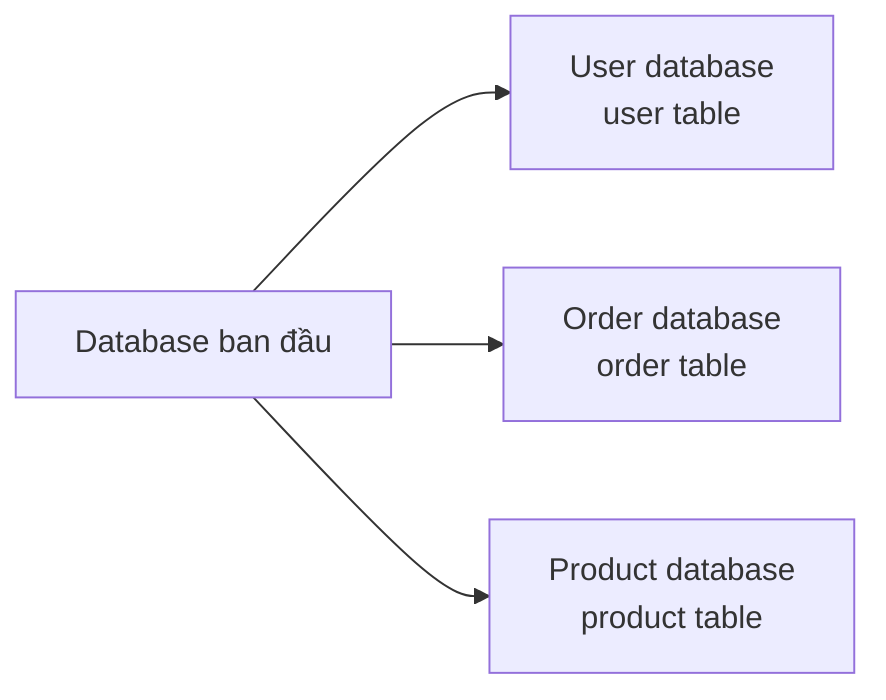
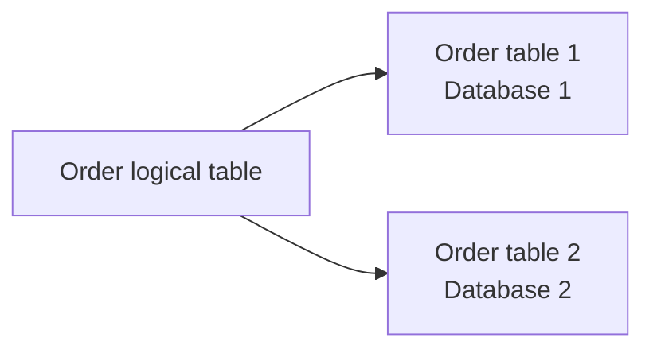
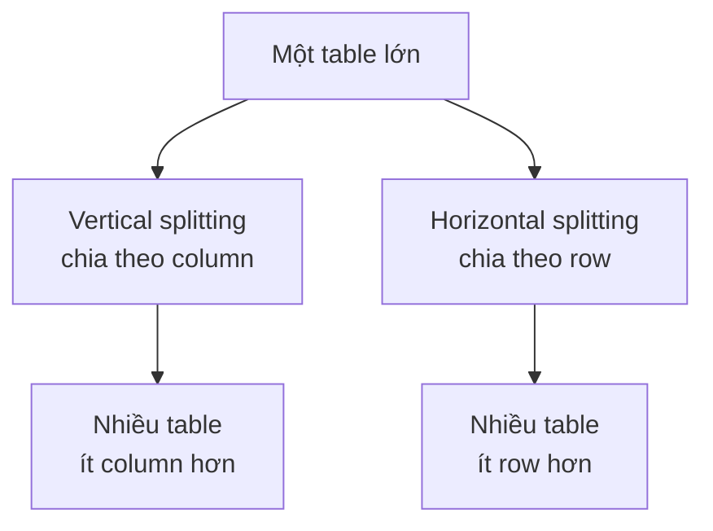

## Tách đọc ghi

### Tách đọc ghi là gì?

**Tách đọc ghi chủ yếu nhằm phân tán thao tác đọc và thao tác ghi của database đến các node database khác nhau.** Write request vẫn đi vào primary database, read request được phân bổ cho một hoặc nhiều read-only replica, vì vậy lợi ích chính là nâng cao khả năng mở rộng đọc của database. Chỉ khi primary database vốn bị nhiều read request làm chậm thì việc chuyển read traffic ra ngoài mới có thể gián tiếp giúp write path.

Tôi vẽ đơn giản một hình để giúp những bạn chưa hiểu rõ về tách đọc ghi dễ hình dung hơn.


Thông thường, chúng ta sẽ chọn một primary, nhiều replica, tức một primary database phụ trách ghi, các replica database khác phụ trách đọc. Primary và replica sẽ đồng bộ dữ liệu với nhau để bảo đảm dữ liệu trong replica chính xác. Kiến trúc này tương đối đơn giản để triển khai, đồng thời phù hợp với đặc điểm của hệ thống là ít ghi, nhiều đọc.

### Triển khai tách đọc ghi thế nào?

Bất kể dùng phương án triển khai tách đọc ghi cụ thể nào, để thực hiện tách đọc ghi thường gồm các bước sau:

1. Triển khai nhiều database, chọn một database làm primary database, một hoặc nhiều database khác làm replica database.
2. Bảo đảm primary database và replica database thiết lập quan hệ replication. Đây chính là **replication primary/replica** thường được nhắc đến. Cần lưu ý, replication mặc định của MySQL là asynchronous, replica thường tạm thời chậm hơn primary.
3. Hệ thống giao write request cho primary database xử lý, read request cho replica database xử lý.

Trong dự án thực tế, có hai cách thường dùng:

**1. Cách dùng proxy**


Có thể thêm một proxy layer giữa application và database. Mọi data request của application đều giao cho proxy layer xử lý. Proxy layer chịu trách nhiệm tách read request và write request, rồi route chúng đến database tương ứng.

Các middleware có chức năng tương tự gồm **MySQL Router** (chính thức, phương án thay thế cho MySQL Proxy), **ProxySQL**, **MaxScale**, **MyCat**, v.v. **Atlas** là phương án thời kỳ đầu dựa trên MySQL Proxy. Khi chọn cho dự án mới, cần chú ý trạng thái maintenance, khả năng tương thích với version MySQL mới và mức độ hoạt động của community.

Nói thêm về MySQL Router: từ 8.2, MySQL Router hỗ trợ transparent read/write splitting, tài liệu hiện tại cũng vẫn giữ capability này. Nó route read traffic đến read-only instance, write traffic đến writable instance; phía application không cần tự xác định loại SQL. Có thể xem giới thiệu cụ thể trong blog chính thức [MySQL 8.2 – transparent read/write splitting](https://blogs.oracle.com/mysql/post/mysql-82-transparent-readwrite-splitting) và tài liệu chính thức [Read/Write Splitting](https://dev.mysql.com/doc/mysql-router/9.7/en/router-read-write-splitting.html).

Tuy nhiên, transparent read/write splitting không có nghĩa là mọi SQL đều có thể giao mù quáng cho Router. Các câu lệnh `FOR UPDATE`, `LOCK IN SHARE MODE`, `GET_LOCK()` bắt buộc phải đi qua writable instance; một số function hoặc câu lệnh nhìn như chỉ đọc nhưng có thể tạo ra write effect cũng có thể thất bại trên read-only instance. Trước khi dùng trong production, cần kết hợp statement support list chính thức với business SQL để kiểm tra.

**2. Cách dùng component**

Với cách này, có thể thêm third-party component để thực hiện route read request và write request.

Nếu dự án dùng Java stack, **ShardingSphere-JDBC** là lựa chọn khá phổ biến, chỉ cần thêm jar package là dùng được, chi phí vận hành cũng thấp hơn proxy độc lập một chút.

Bạn có thể xem [cấu hình tách đọc ghi của ShardingSphere-JDBC](https://shardingsphere.apache.org/document/current/cn/features/readwrite-splitting/) trên trang chính thức của ShardingSphere.

### Nguyên lý replication primary/replica là gì?

MySQL binlog (binary log, tức file binary log) chủ yếu ghi lại mọi thay đổi dữ liệu trong MySQL database (tất cả câu lệnh DDL và DML mà database thực thi). Vì vậy, dựa vào MySQL binlog của primary, có thể đồng bộ dữ liệu của primary sang replica.

Dưới đây vẫn dùng cách gọi “primary/replica” để dễ đọc. Từ MySQL 8.0, phía chính thức từng bước dùng Source/Replica thay cho master/slave: từ 8.0.22 bắt đầu khuyến nghị các alias như `START REPLICA`, từ 8.0.23 bắt đầu khuyến nghị các command mới như `CHANGE REPLICATION SOURCE TO`; MySQL 8.4 đã loại bỏ các câu lệnh SQL cũ như `START SLAVE`, `CHANGE MASTER TO`. Script và monitoring item mới nên ưu tiên naming mới, chẳng hạn `SHOW REPLICA STATUS`, `replica_parallel_workers`, `rpl_semi_sync_source_wait_point`.

Quy trình cụ thể và chi tiết hơn như sau (hình lấy từ [MySQL Master-Slave Replication on the Same Machine](https://www.toptal.com/mysql/mysql-master-slave-replication-tutorial)):


1. Primary ghi thay đổi dữ liệu trong database vào binlog.
2. Replica kết nối với primary và yêu cầu các update event trong binlog.
3. Primary tạo binlog dump thread và gửi nội dung binlog cho replica.
4. I/O receiver thread của replica nhận update event và ghi vào relay log.
5. Applier thread của replica đọc relay log rồi apply event vào local. Nếu dùng statement-based logging, có thể hiểu là replay SQL; nếu dùng row-based logging, chủ yếu là apply row change event.

Thông thường, cứ thấy binlog là bạn nên nghĩ đến replication primary/replica. Ngoài replication primary/replica, binlog còn có thể giúp thực hiện data recovery.

Mở rộng thêm:

Bạn có từng dùng một tool mã nguồn mở của Alibaba tên là canal chưa? Tool này giúp đồng bộ dữ liệu giữa MySQL và các data source khác như Elasticsearch hoặc một MySQL database khác. Rõ ràng, nguyên lý bên trong của tool này cũng dựa vào binlog. canal mô phỏng quy trình replication primary/replica của MySQL, parse binlog rồi đồng bộ dữ liệu sang data source khác.

Ngoài ra, Redis, một distributed cache component thường dùng, cũng thực hiện tách đọc ghi thông qua replication primary/replica.

Tóm tắt ngắn gọn:

**Replication primary/replica của MySQL dựa vào binlog. Ngoài ra, các tool phổ biến dùng để đồng bộ MySQL sang data source khác, chẳng hạn canal, nhìn chung cũng dựa vào binlog ở tầng bên trong.**

### Làm thế nào để tránh đọc phải dữ liệu cũ ở replica?

Tách đọc ghi có thể nâng cao read concurrency của database, nhưng cũng tạo ra một vấn đề: dữ liệu giữa primary và replica có latency. Ví dụ, sau khi ghi vào primary, cần thời gian để dữ liệu primary đồng bộ sang replica. Khoảng thời gian này khiến dữ liệu primary và replica tạm thời không nhất quán, tức **replication latency primary/replica**.

Application thường không thể tránh bản thân replication latency, chỉ có thể tránh route strong-consistency read request đến replica đang bị chậm. Nếu business scenario không thể chấp nhận đọc dữ liệu cũ, có thể tham khảo các cách sau.

Tách đọc ghi còn phải đặc biệt chú ý đến ranh giới của transaction và request path. Trong cùng một business transaction, nếu ghi trước rồi đọc sau thì read tiếp theo thường nên tiếp tục đi qua primary, không thể để proxy hoặc middleware route read request sang replica. Nếu không sẽ xảy ra vấn đề “vừa ghi xong nhưng chính mình lại không đọc được dữ liệu”. Với các read-your-writes scenario như login state, payment status, truy vấn detail ngay sau khi tạo order, có thể route read về primary trong thời gian ngắn dựa theo user session, request path hoặc business marker.

#### Buộc route read request đến primary

Với một số ít business bắt buộc strong consistency, chẳng hạn truy vấn số dư ngay sau khi thanh toán, có thể dùng Hint để buộc truy vấn primary.

```java
try (HintManager hintManager = HintManager.getInstance()) {
    hintManager.setWriteRouteOnly();
    // Tiếp tục thao tác JDBC
}
```

> ShardingSphere 5.x dùng `setWriteRouteOnly()`; version cũ 4.x tương ứng là `setMasterRouteOnly()`, cần điều chỉnh code mẫu theo version thực tế.

> **Lưu ý**: Nghiêm cấm dùng phương án này trên phạm vi lớn! Mục đích ban đầu của tách đọc ghi là giảm read pressure cho primary. Nếu nhiều read request vì latency mà quay về primary, trong các scenario high concurrency như promotion hoặc flash sale, primary dễ bị quá tải. Cách cân nhắc hợp lý hơn là chỉ đọc từ primary trên core strong-consistency path; các path không cốt lõi chấp nhận eventual consistency ở business layer, chẳng hạn hiển thị “đang đồng bộ dữ liệu”.

Với phương án này, có thể giao mọi read request bắt buộc lấy dữ liệu mới nhất cho primary xử lý.

#### Đọc sau một khoảng trễ

Một số bạn có thể nghĩ: nếu replication primary/replica có latency thì đọc sau khi chờ latency. Ví dụ latency là 0.5s thì đọc sau 1s. Ý tưởng này nhìn đơn giản nhưng không đáng tin cậy.

Tuy nhiên, nếu thiết kế business flow như sau thì sẽ tốt hơn nhiều: với các scenario nhạy cảm về dữ liệu, sau khi hoàn tất write request, tránh thực hiện request ngay lập tức. Ví dụ sau khi thanh toán thành công, chuyển đến trang thanh toán thành công; chỉ sau khi bạn nhấn quay lại mới trả về tài khoản của mình.

#### Chờ replica bắt kịp vị trí chỉ định

Nếu dùng GTID, sau khi ghi thành công có thể lấy GTID tương ứng với transaction này, rồi gọi `WAIT_FOR_EXECUTED_GTID_SET(gtid_set, timeout)` trên replica để chờ replica apply đến vị trí đó rồi mới đọc. Tương tự, `SOURCE_POS_WAIT()` có thể chờ replica đọc và apply đến vị trí binlog chỉ định.

Cách này có thể thực hiện việc “chờ replica bắt kịp trước khi đọc từ replica chỉ định”, nhưng sẽ làm tăng read latency và implementation complexity, không phù hợp với mọi request có tần suất cao. Với core path có high concurrency, cách thường gặp hơn vẫn là đọc primary trong thời gian ngắn sau khi ghi, hoặc route read-your-writes theo session/user.

#### Tổng kết

Về cách tránh đọc dữ liệu cũ ở replica, ở đây đã giới thiệu ba phương án. Thực tế, đọc sau một khoảng trễ không thể hoàn toàn tránh đọc dữ liệu cũ, chỉ có thể giảm xác suất xảy ra latency; trong dự án thực tế, nó thường không được dùng làm phương án cốt lõi.

Nhìn chung, để tránh strong-consistency read request đọc phải dữ liệu cũ, vẫn nên buộc các read request bắt buộc lấy dữ liệu mới nhất đi qua primary. Nếu phần lớn business scenario của dự án không yêu cầu độ chính xác dữ liệu quá cao, có thể để các path không cốt lõi chấp nhận eventual consistency.

Replica cũng không cung cấp năng lực đọc miễn phí. Báo cáo phức tạp, full table scan, phân trang lớn và slow SQL chạy trên replica sẽ ảnh hưởng đến việc applier thực thi, từ đó làm replication latency nặng hơn. Sau khi tách đọc ghi, vẫn cần xử lý slow SQL, index, connection pool và report traffic.

### Khi nào xuất hiện replication latency primary/replica? Làm thế nào để giảm latency nhiều nhất có thể?

Ở phần trên cũng đã đề cập đến replication latency primary/replica và cách tránh nó. Sau đây sẽ phân tích chi tiết hơn nguyên nhân xuất hiện replication latency primary/replica và cách giảm latency nhiều nhất có thể.

Để hiểu khi nào xuất hiện replication latency primary/replica, trước hết cần hiểu replication latency primary/replica là gì.

Replication latency của MySQL là tình trạng dữ liệu trên replica chậm hơn dữ liệu trên primary. Tình trạng này có thể do hai nguyên nhân sau:

1. Tốc độ I/O thread của replica nhận binlog không theo kịp tốc độ primary ghi binlog, khiến dữ liệu trong relay log của replica chậm hơn dữ liệu trong binlog của primary;
2. Tốc độ applier thread của replica thực thi relay log không theo kịp tốc độ I/O receiver thread của replica nhận binlog, khiến dữ liệu của replica chậm hơn dữ liệu trong relay log của replica.

Có 3 thời điểm chính liên quan đến replication primary/replica:

1. Primary thực thi xong một transaction và ghi vào binlog, gọi thời điểm này là T1;
2. I/O receiver thread của replica nhận binlog và ghi vào relay log, gọi thời điểm này là T2;
3. Applier thread của replica đọc relay log và apply vào local, gọi thời điểm này là T3.

> **Lưu ý**: Mô tả trên dựa trên mode **asynchronous replication** mặc định của MySQL. Nếu bật semi-synchronous replication và đặt `rpl_semi_sync_source_wait_point=AFTER_SYNC`, primary sẽ ghi và đồng bộ binlog xong rồi chờ ít nhất một replica xác nhận đã nhận transaction event, sau đó mới commit vào storage engine và trả về client. Điều này nâng cao an toàn dữ liệu khi failover, nhưng không có nghĩa replica đã hoàn tất apply.

Kết hợp với nguyên lý replication primary/replica đã nói ở trên, có thể suy ra:

- Chênh lệch giữa T2 và T1 phản ánh performance của I/O receiver thread trên replica và hiệu quả truyền network. Chênh lệch càng nhỏ thì performance của I/O receiver thread và hiệu quả truyền network càng cao.
- Chênh lệch giữa T3 và T2 phản ánh tốc độ thực thi của applier thread trên replica. Chênh lệch càng nhỏ thì tốc độ thực thi của applier thread càng nhanh.

Vậy khi nào xuất hiện replication latency primary/replica? Dưới đây là một số trường hợp thường gặp:

1. **Performance của máy replica kém hơn primary**: Tốc độ replica nhận binlog, ghi relay log và apply relay log event sẽ chậm hơn (tức giá trị T2-T1 và T3-T2 lớn hơn), từ đó gây latency. Cách xử lý là chọn máy có cấu hình tương đương hoặc cao hơn primary làm replica, hoặc tối ưu performance cho replica, chẳng hạn điều chỉnh parameter, tăng cache, dùng SSD.
2. **Replica xử lý quá nhiều read request**: Replica vừa phải thực thi mọi write operation của primary, vừa phải phản hồi read request. Nếu read request quá nhiều, chúng sẽ chiếm CPU, memory, network và các resource khác của replica, ảnh hưởng đến hiệu quả replication (tức giá trị T2-T1 và T3-T2 lớn hơn, tương tự trường hợp trước). Cách xử lý là thêm cache (khuyến nghị), dùng kiến trúc một primary nhiều replica để phân tán read request, hoặc dùng hệ thống khác cung cấp năng lực query, chẳng hạn đưa binlog vào Hadoop, Elasticsearch và các hệ thống khác.
3. **Transaction lớn**: Transaction chạy lâu, lâu chưa commit có thể gọi là transaction lớn. Vì transaction lớn chạy lâu, hơn nữa transaction lớn trên replica tốn nhiều thời gian và resource hơn transaction lớn trên primary, nên dễ gây replication latency primary/replica hơn. Cách xử lý là tránh sửa dữ liệu hàng loạt, cố gắng chia thành nhiều batch. Trường hợp tương tự là slow SQL có thời gian thực thi dài; trong dự án thực tế cần tối ưu slow SQL.
4. **Quá nhiều replica**: Primary phải đồng bộ binlog đến mọi replica. Nếu số lượng replica quá nhiều, thời gian và overhead replication sẽ tăng (giá trị T2-T1 lớn hơn, nhưng nguyên nhân ở đây là replication pressure trên primary). Cách xử lý là giảm số lượng replica, hoặc chia replica thành nhiều tầng để replica tầng trên tiếp tục đồng bộ cho replica tầng dưới, giảm pressure cho primary.
5. **Network latency**: Nếu tốc độ truyền network giữa primary và replica chậm, hoặc xảy ra packet loss, jitter và các vấn đề khác, hiệu quả truyền binlog sẽ bị ảnh hưởng, gây latency trên replica. Cách xử lý là tối ưu network environment, chẳng hạn tăng bandwidth, giảm latency, tăng stability.
6. **Replication single-thread**: MySQL 5.5 trở về trước chỉ hỗ trợ replication single-thread. Để tối ưu performance replication, MySQL 5.6 giới thiệu **multi-thread replication**, nhưng chỉ hỗ trợ parallel theo database. MySQL 5.7 tiếp tục hoàn thiện và hỗ trợ parallel theo group commit. Sau MySQL 8.0.22 có thể dùng naming mới: `replica_parallel_workers > 0` để bật multi-thread applier, kết hợp với các strategy như `replica_parallel_type=LOGICAL_CLOCK` nhằm nâng cao khả năng parallel apply.
7. **Replication mode**: Replication mặc định của MySQL là asynchronous, nên chắc chắn tồn tại vấn đề latency. Fully synchronous replication không có latency nhưng performance quá kém. Semi-synchronous replication là phương án cân bằng; so với asynchronous replication, nó chủ yếu giải quyết data safety chứ không hoàn toàn loại bỏ read latency. Nó có thể khiến primary chờ ít nhất một replica nhận transaction event trước khi trả về commit success, nhưng replica đã apply xong hay chưa vẫn phụ thuộc vào tiến độ của applier. Vì vậy, semi-sync không thể trực tiếp bảo đảm “ghi xong đọc ngay từ replica chắc chắn nhận được giá trị mới nhất”. Từ MySQL 5.5, MySQL hỗ trợ **semi-sync replication** dưới dạng plugin; MySQL 5.7 giới thiệu **enhanced semi-sync replication**.
8. ……

## Sharding

Tách đọc ghi chủ yếu xử lý read concurrency của database, chưa giải quyết vấn đề storage của database. Hãy thử nghĩ: **nếu lượng dữ liệu trong một table MySQL quá lớn thì phải làm sao?**

Nói cách khác, **làm thế nào để giải quyết storage pressure của MySQL?**

Một trong các câu trả lời là **sharding**.

Trước khi quyết định sharding, nên xác nhận trước các điểm sau:

1. Slow SQL, index, pagination, cache và tách đọc ghi đã được tối ưu chưa.
2. Data volume của một table, capacity của một database, số connection và write QPS có thật sự gần bottleneck hay chưa.
3. Core query có thể được bao phủ bởi một Sharding Key ổn định hay không.
4. Business có thể chấp nhận complexity do cross-shard query, distributed transaction và data migration mang lại hay không.

Sharding không phải bước đầu tiên để tối ưu database, mà giống một phương án mở rộng capacity sau khi các cách tối ưu thông thường không còn đủ.

### Tách database là gì?

**Tách database** là phân tán dữ liệu trong database đến các database khác nhau, có thể tách database theo chiều dọc hoặc chiều ngang.

**Tách database theo chiều dọc** là chia một database đơn theo business. Các business khác nhau dùng database khác nhau, từ đó phân tán pressure của một database sang nhiều database.

Ví dụ, tách riêng user table, order table và product table thành user database, order database và product database.



**Tách database theo chiều ngang** là chia cùng một table vào các database khác nhau theo một rule nhất định. Mỗi database có thể nằm trên server khác nhau, nhờ đó đạt horizontal scaling và giải quyết bottleneck về storage và performance của một table.

Ví dụ, data volume của order table quá lớn, bạn thực hiện horizontal splitting cho order table (horizontal table splitting), rồi đặt 2 order table sau khi tách vào 2 database khác nhau.



Trong dự án thực tế, horizontal database splitting thường xuất hiện cùng horizontal table splitting: trước hết chia cùng một logical table theo row thành nhiều physical table, sau đó phân bố các physical table này lên các database instance khác nhau.

### Tách table là gì?

**Tách table** là chia dữ liệu của một table, có thể là vertical splitting hoặc horizontal splitting.

**Tách table theo chiều dọc** là chia theo column của table, tách một table có nhiều column thành nhiều table.

Ví dụ, có thể tách một số column trong user information table thành một table riêng.

**Tách table theo chiều ngang** là chia theo row của table, tách một table có nhiều row thành nhiều table, có thể giải quyết vấn đề data volume của một table quá lớn.

Ví dụ, có thể tách user information table thành nhiều user information table để tránh việc data volume quá lớn của một table ảnh hưởng đến performance.

Horizontal splitting chỉ giải quyết vấn đề data volume lớn của một table. Để nâng cao performance, chúng ta thường đặt các table sau khi tách vào những database khác nhau. Nói cách khác, horizontal table splitting thường xuất hiện cùng horizontal database splitting.



### Khi nào cần sharding?

Có thể cân nhắc sharding trong các scenario sau:

- Data volume của một table đạt từ hàng chục triệu row trở lên (ngưỡng cụ thể phụ thuộc vào complexity của table structure, số lượng index, hardware configuration và các yếu tố khác), khiến database bắt đầu đọc ghi chậm.
- Dung lượng data trong database ngày càng lớn, thời gian backup ngày càng dài.
- Concurrency của application quá lớn (nên ưu tiên các phương pháp tối ưu performance khác, thay vì sharding).

Tuy nhiên, chi phí sharding rất cao, nếu không cần thiết thì cố gắng không dùng. Cũng không phải cứ table đạt hàng chục triệu row là nhất định phải sharding. Vì mỗi table có các field khác nhau, data volume có thể lưu ở performance chấp nhận được cũng khác nhau; vẫn cần phân tích theo tình huống cụ thể.

Nếu bottleneck performance chủ yếu đến từ slow SQL, index design hoặc cách lưu time field, thông thường nên tối ưu MySQL theo cách thông thường trước, sau đó mới cân nhắc sharding:

- Phân tích MySQL execution plan: [https://javaguide.cn/database/mysql/mysql-query-execution-plan.html](https://javaguide.cn/database/mysql/mysql-query-execution-plan.html)
- Giải thích chi tiết MySQL index: [https://javaguide.cn/database/mysql/mysql-index.html](https://javaguide.cn/database/mysql/mysql-index.html)
- Tổng hợp các scenario MySQL index mất hiệu lực: [https://javaguide.cn/database/mysql/mysql-index-invalidation.html](https://javaguide.cn/database/mysql/mysql-index-invalidation.html)
- Đề xuất lưu trữ data dạng time của MySQL: [https://javaguide.cn/database/mysql/some-thoughts-on-database-storage-time.html](https://javaguide.cn/database/mysql/some-thoughts-on-database-storage-time.html)

Trước đây có một bài viết phân tích “[InnoDB có thể lưu tối đa bao nhiêu dữ liệu với B+ tree có chiều cao 3](https://juejin.cn/post/7165689453124517896)”, nội dung khá hay, nếu quan tâm bạn có thể xem.

### Các sharding algorithm thường gặp là gì?

Sharding algorithm chủ yếu giải quyết vấn đề sau khi data được horizontal sharding thì data cần được lưu vào table nào.

Các sharding algorithm thường gặp gồm:

- **Hash sharding**: tính hash của Sharding Key đã chỉ định, sau đó xác định table chứa data dựa vào giá trị hash. Hash sharding khá phù hợp với scenario random read/write, nhưng không phù hợp lắm với scenario thường xuyên cần range query. Hash sharding giúp data của mỗi table phân bố tương đối đều, nhưng không thân thiện với dynamic scaling (chẳng hạn thêm table hoặc database).
- **Range sharding**: phân bổ data theo một range cụ thể (chẳng hạn time range hoặc ID range). Ví dụ, record có `id` từ `1~299999` vào table thứ nhất, record từ `300000~599999` vào table thứ hai. Range sharding phù hợp với scenario thường xuyên cần range lookup và data phân bố đều, nhưng không phù hợp lắm với random read/write (data chưa được phân tán, dễ xuất hiện hot data).
- **Consistent hash sharding**: tổ chức hash space thành cấu trúc hình vòng, map Sharding Key và node (database hoặc table) lên vòng này, sau đó theo rule clockwise xác định node chứa data hoặc xử lý request, giảm vấn đề dynamic scaling không thân thiện của hash truyền thống. Consistent hash phù hợp hơn với KV hoặc cache scenario; trong sharding relational database, nó không được dùng nhiều, còn range query, cross-shard transaction và secondary index vẫn cần thiết kế riêng.

Trên các algorithm cơ bản trên, còn có thể kết hợp với business để tạo ra routing strategy phức tạp hơn:

- **Mapping table routing**: duy trì một routing table độc lập để ghi mapping giữa Sharding Key và data node. Cách này linh hoạt nhưng cần maintenance thêm một bộ routing data. Bản thân routing table phải cân nhắc cache, consistency, scaling và high availability; nếu không có thể trở thành bottleneck hoặc single point mới.
- **Geo routing**: dùng geographic location làm Sharding Key, kết hợp với range hoặc mapping table để lưu data gần nhau tại một data center cụ thể (thường dùng trong NewSQL multi-primary architecture).

### Chọn Sharding Key thế nào?

Sharding Key là field quan trọng của data sharding, ảnh hưởng trực tiếp đến data distribution và query efficiency. Nhìn chung, Sharding Key nên có các đặc điểm sau:

- Có tính phổ quát, tức có thể bao phủ phần lớn query scenario, cố gắng giảm số lượng shard liên quan trong một query và giảm pressure cho database;
- Có tính phân tán, tức có thể phân tán data đều đến các shard, tránh data skew và hot data;
- Có tính ổn định, tức value của Sharding Key không thay đổi, tránh data migration và consistency issue;
- Có tính mở rộng, tức có thể hỗ trợ tăng giảm shard động, tránh overhead re-sharding data.

Trong dự án thực tế, Sharding Key rất khó đáp ứng toàn bộ đặc điểm trên, cần cân nhắc giữa các yếu tố. Một số business ghi logical shard number vào business ID, chẳng hạn giữ một đoạn `buyer_route` trong order ID, nhờ đó chỉ cần có order ID cũng có thể suy ra route. Tuy nhiên, không nên lấy trực tiếp vài chữ số cuối của user ID làm routing key. Nếu user ID đến từ Snowflake, auto-increment segment hoặc generator có quy luật khác, các chữ số thấp không nhất thiết phân bố đều; thông thường nên hash trước rồi mới lấy modulo.

Có thể tham khảo lựa chọn Sharding Key cho các business thường gặp:

| Business scenario   | Sharding Key ứng viên          | Lưu ý                                                                          |
| ------------------- | ------------------------------ | ------------------------------------------------------------------------------ |
| Order system        | User ID, merchant ID, order ID | Xem query path chính; user query order và merchant query order có thể xung đột |
| IM message          | Session ID, user ID            | Cần đánh giá kỹ thứ tự trong cùng session và hot group chat                    |
| Multi-tenant system | Tenant ID                      | Tenant lớn dễ tạo hot data, cần tách riêng tenant lớn                          |
| Payment flow        | User ID, transaction number    | Cần thiết kế trước strong-consistency query và reconciliation path             |

Nếu một business vốn có nhiều high-frequency query path, có thể cân nhắc thêm một bản query dimension data, hoặc giao một phần query cho search engine, wide table, report system, thay vì ép một Sharding Key đáp ứng mọi nhu cầu.

Số lượng shard cũng không nên chỉ nhìn vào data volume hiện tại. Quá ít physical shard khiến việc scaling sau này diễn ra thường xuyên; quá nhiều physical shard làm tăng số connection, routing, aggregate query và operation cost. Cách thường gặp là thiết kế trước nhiều logical shard, chẳng hạn 512 hoặc 1024 bucket, rồi map nhiều bucket vào một số ít physical database/table. Khi scaling, migrate bucket mapping thay vì thay đổi business modulo rule.

Sau đây lấy order scenario làm ví dụ.

Order table là ví dụ rất điển hình trong sharding, vì nó vốn có nhiều query path:

- Theo user dimension: user xem order list của mình, order detail, after-sales record; điều kiện thường gặp là `buyer_id + create_time/status`.
- Theo order dimension: query order detail qua `order_id`, xử lý payment callback, định vị after-sales order.
- Theo merchant dimension: merchant backend xem order list, filter theo status, export order trong một khoảng thời gian gần đây.

Phần lớn order system sẽ ưu tiên order list của user, thay vì chỉ sharding theo `order_id`. Điểm đánh đổi nằm ở query pattern: order detail là point query, còn order list của user là high-frequency range query. Nếu hash modulo theo `order_id`, order của cùng một user sẽ bị phân tán trên nhiều shard, pagination, sorting và filtering đều phải thực hiện cross-shard.

Khi sharding theo buyer ID, route có thể được tính như sau:

```text
slot = hash(buyer_id) % (db_count * table_count)
db_index = slot / table_count
// Lưu ý: chia cho số table của mỗi database, không phải số database
table_index = slot % table_count
```

Điểm dễ viết sai ở đây là `db_index`: trước hết `slot` phải chia cho số table trong mỗi database để có database number; sau đó lấy modulo theo số table để có table number.

Chỉ sharding theo `buyer_id` vẫn chưa đủ. Khi query bằng `order_id`, có hai cách thường gặp: duy trì một routing table `order_id -> buyer_route`, hoặc ghi `buyer_route` vào vị trí cố định trong order ID. Cách trước cần thêm một query và một phần storage; cách sau yêu cầu thiết kế trước số lượng bit trong rule tạo order ID.

Merchant dimension cũng cần được xử lý riêng. Trong B2C scenario, merchant và buyer thường có quan hệ many-to-many, không thể giải quyết query của merchant chỉ bằng cách ghi buyer route vào order ID. Nếu merchant backend chỉ query với tần suất thấp, có thể giới hạn time range và giao cho Elasticsearch, ClickHouse hoặc wide table; nếu là core path có tần suất cao, thường cần tạo merchant order index table sharding theo `seller_id`, hoặc thêm một bản merchant order read model.

Order main table và order detail table nên cố gắng dùng cùng một routing rule. Ví dụ `t_order` và `t_order_item` đều sharding theo `buyer_route`, để việc tạo order và query order detail nằm trên cùng một shard. Trong ShardingSphere, scenario tương tự có thể cấu hình binding table, nhưng có tiền đề rõ ràng: cùng một nhóm table dùng cùng sharding rule, và điều kiện liên kết trong SQL chứa Sharding Key. Chỉ cấu hình binding table nhưng SQL không có điều kiện Sharding Key thì vẫn có thể xảy ra cross-shard routing.

### Sharding sẽ mang lại vấn đề gì?

Hãy nhớ rằng, với bất kỳ technical decision nào trong công ty, không chỉ cần cân nhắc công nghệ có đáp ứng yêu cầu hay phù hợp với business scenario hiện tại hay không, mà còn phải chú ý đến cost do nó mang lại.

Sau khi thêm sharding, hệ thống sẽ gặp những challenge nào?

- **Thao tác join**: cần phân biệt single-database join và cross-shard join. Khi trong một database có index và execution plan phù hợp, join là capability cơ bản của relational database, không nên phủ định tất cả. Khó khăn sau khi sharding là cross-shard join: data có thể phân bố trong nhiều database/table, middleware cần broadcast, route, merge, thậm chí thực hiện Cartesian combination, khiến performance và implementation complexity tăng lên. Với nơi cần cross-shard join, có thể thực hiện nhiều query rồi assemble data ở business layer, nhưng cần cân nhắc yêu cầu consistency của nhiều query.
- **Vấn đề transaction**: table trong cùng một database bị phân bố trên các database khác nhau. Nếu một operation liên quan đến nhiều database, transaction tích hợp sẵn của database không còn đáp ứng yêu cầu. Khi đó cần thêm distributed transaction. Website cũng có bài tổng hợp các giải pháp distributed transaction thường gặp: <https://javaguide.cn/distributed-system/distributed-transaction.html>.
- **Distributed ID**: sau khi tách database, data nằm trên các database ở các server khác nhau, auto-increment primary key của database không còn bảo đảm primary key được tạo ra là unique. Làm thế nào để tạo global unique primary key cho các data node khác nhau? Khi đó cần thêm distributed ID vào hệ thống. Có thể xem bài viết [Giới thiệu distributed ID và tổng hợp phương án triển khai](https://javaguide.cn/distributed-system/distributed-id.html) để biết thêm chi tiết.
- **Vấn đề global unique constraint**: unique index trong một database chỉ bảo đảm unique trong một shard. Ví dụ, nếu phone number, username hoặc merchant order number không phải Sharding Key, database khó trực tiếp bảo đảm global unique. Cách thường gặp là tạo global unique index table, dùng business registry để reserve trước, hoặc điều chỉnh thiết kế Sharding Key và business constraint.
- **Vấn đề query theo non-Sharding Key**: nếu query condition không có Sharding Key, middleware không thể xác định cần truy cập shard nào, thường chỉ có thể broadcast SQL đến nhiều shard rồi merge kết quả. Khi số shard ít, còn có thể chấp nhận; khi số shard tăng, read fan-out sẽ làm chậm core path. Cách xử lý thường gặp là bổ sung routing table, redundant index table, hoặc giao backend search cho search engine, wide table, report system.
- **Vấn đề cross-database aggregation và pagination query**: sharding khiến các aggregation query thông thường như `group by`, `order by` trở nên phức tạp bất thường. Nguyên nhân là các operation này cần aggregate và sort data trên nhiều shard, thay vì trong một database. Cross-shard pagination cũng rất khó; chẳng hạn query page 1000, mỗi shard có thể phải trả về data ứng viên của N page đầu, sau đó middleware merge, sort rồi lấy page đích. Số shard càng nhiều thì hệ số khuếch đại càng lớn. Backend query có result set lớn phù hợp hơn với search engine, wide table hoặc offline report system.
- **Khó dynamic scaling (Resharding)**: đặc biệt khi dùng hash modulo truyền thống, một khi mở rộng từ `hash(key) % 32` lên `hash(key) % 64`, mapping của rất nhiều data sẽ thay đổi. Cách ổn định hơn là cố định trước một nhóm logical shard, chẳng hạn 1024 bucket, rồi duy trì mapping `bucket -> physical database/table`; khi scaling, migrate một phần bucket thay vì để business ID gắn trực tiếp với số lượng physical table. Cũng có thể dùng consistent hash hoặc distributed database hỗ trợ automatic Rebalance, chẳng hạn TiDB.
- **Operation và change cost**: sau khi sharding, DDL change, điều chỉnh index, data backup, data correction, troubleshooting và capacity assessment đều phải bao phủ nhiều database/table. Trước khi release cần chuẩn bị batch change tool, rollback plan và shard-level monitoring, nếu không chi phí maintenance về sau sẽ rất cao.
- ……

Ngoài ra, sau khi thêm sharding, thường cần DBA tham gia, đồng thời cần nhiều database server hơn; tất cả đều là cost.

### Có phương án nào được khuyến nghị cho sharding không?

Apache ShardingSphere là một distributed database ecosystem, có thể cung cấp capability như sharding, elastic scaling và encryption trên database hiện có.

Dự án ShardingSphere được Dangdang donate cho Apache, hiện chủ yếu cung cấp hai cách tích hợp là **ShardingSphere-JDBC** và **ShardingSphere-Proxy**.

ShardingSphere phù hợp với scenario “vẫn dùng relational database truyền thống nhưng muốn có capability sharding, read/write splitting, encryption và governance thông qua middleware”. Nó không sửa MySQL kernel; nó cung cấp transparent routing, rewrite, merge và governance ở JDBC hoặc Proxy layer. Ngoài read/write splitting và sharding, nó còn cung cấp distributed transaction, database governance, shadow database, data encryption và data masking.

So với việc tự xây dựng hoàn toàn routing layer, ShardingSphere có ba ưu điểm chính: ShardingSphere-JDBC gần native JDBC call path hơn, bớt một network proxy layer; hai cách tích hợp JDBC và Proxy có thể bao phủ Java application và hệ thống multi-language; sharding, tách đọc ghi, encryption, shadow database và governance được cấu hình trong cùng một rule system, nên chi phí mở rộng về sau thấp hơn.

ShardingSphere cung cấp các capability sau:


Khi chọn phương án thực tế, chủ yếu cần xem team phù hợp với cách tích hợp nào hơn:

- **ShardingSphere-JDBC**: tích hợp dưới dạng jar package, phù hợp với Java application, bớt một network forwarding layer; application phải tự thêm dependency và quản lý configuration.
- **ShardingSphere-Proxy**: deploy dưới dạng proxy service độc lập, application truy cập qua MySQL/PostgreSQL protocol, phù hợp với hệ thống multi-language hoặc team muốn tập trung sharding rule tại proxy layer, nhưng sẽ tăng operation cost của một proxy layer.

Tuy nhiên, vẫn cần nhắc thêm: **hiện nay cũng có nhiều công ty chọn distributed relational database như TiDB.** Lấy TiDB làm ví dụ, data ở tầng bên trong được chia thành nhiều Region theo key range. Khi Region vượt ngưỡng, nó tiếp tục được tách và cluster sẽ schedule chúng đến các TiKV node khác nhau. Cách này giúp giảm một phần vấn đề routing, scaling và migration do manual sharding mang lại, nhưng vẫn phải đánh giá SQL compatibility, migration cost, operation capability và mức độ phù hợp với ecosystem hiện có.

Automatic Region splitting cũng không có nghĩa business hoàn toàn không cần quan tâm đến hot data. Auto-increment primary key được ghi liên tục, time-increment key, hot data của tenant lớn và việc ghi ban đầu vào một Region vẫn có thể tạo hot data; production environment vẫn cần đánh giá hot data dựa trên business write pattern.

### Sau khi sharding, di chuyển data thế nào?

Sau khi sharding, làm thế nào để migrate data từ database cũ (single database, single table) sang database mới (database system sau khi sharding)?

Phương án tương đối đơn giản và thường dùng là **migration khi dừng service**, viết script để ghi data từ database cũ vào database mới. Ví dụ, lúc 2 giờ sáng khi số người dùng hệ thống ít hơn, hiển thị thông báo hệ thống sẽ maintenance và upgrade trong khoảng 1 giờ. Sau đó dùng script đồng bộ toàn bộ data từ database cũ sang database mới.

Nếu không muốn dừng service để migrate data, có thể dùng cách tiếp cận “backfill data hiện có + incremental sync + grey release traffic switching”. Dual-write ở application layer thường rất khó đạt atomicity thực sự, trừ khi thêm distributed transaction hoặc đưa dual-write vào cùng một storage system có transaction capability. Mục tiêu thực tế hơn là bảo đảm có thể retry, trace và validate.

Migration không dừng service thường gồm các bước:

1. **Tạo database và table mới**: xác nhận sharding rule, index, unique constraint, default value và character set.
2. **Backfill data hiện có**: chia batch và ghi data từ database cũ vào database mới theo primary key range hoặc time range.
3. **Incremental sync**: dùng Canal, Debezium hoặc CDC tự xây dựng để subscribe binlog, đồng bộ change mới phát sinh trong thời gian backfill data hiện có sang database mới.
4. **Dual-read validation**: sample hoặc so sánh toàn bộ các field quan trọng, amount, status và count.
5. **Grey read traffic switching**: cho một phần nhỏ read traffic đi qua database mới, quan sát routing và result.
6. **Chuyển write traffic**: sau khi xác nhận incremental data đã bắt kịp, chuyển write traffic sang database mới.
7. **Giữ rollback window**: tiếp tục giữ database cũ trong một khoảng thời gian, đến khi xác nhận database mới ổn định.

Để tránh data cũ ghi đè data mới, ưu tiên dùng monotonic version number, binlog position, GTID, business event version hoặc incrementing sequence. `update_time` có thể hỗ trợ troubleshooting, nhưng không nên dùng làm căn cứ duy nhất cho concurrency control. Khi ghi vào database mới, có thể dùng condition tương tự:

```sql
WHERE target.version IS NULL OR target.version < incoming.version
```

Delete cũng cần tombstone/version, nếu không insert event cũ có thể ghi lại data đã bị delete.

Trước khi release migration, nên chuẩn bị một checklist:

- **Data validation**: validate count, amount, status và các field quan trọng theo shard và time range.
- **Grey read traffic**: trước hết cho một lượng nhỏ read-only request đi qua database mới, xác nhận routing và query result bình thường.
- **Rollback plan**: giữ write path và data sync path của database cũ, khi có vấn đề có thể nhanh chóng chuyển lại.
- **Idempotent write**: migration script, dual-write task và compensation task đều phải có thể thực thi lặp lại.
- **Monitoring và alerting**: theo dõi sync latency, failed retry, shard hot data, cross-database query latency và số database connection.

## Tổng kết

- Tách đọc ghi chủ yếu nhằm phân tán thao tác đọc và ghi của database đến các node khác nhau; lợi ích cốt lõi là nâng cao khả năng mở rộng đọc và giảm read pressure cho primary.
- Tách đọc ghi dựa trên replication primary/replica; replication primary/replica của MySQL dựa vào binlog.
- **Tách database** là phân tán data trong database đến các database khác nhau. **Tách table** là chia data của một table, có thể là vertical splitting hoặc horizontal splitting.
- Sau khi thêm sharding, hệ thống cần giải quyết các vấn đề như transaction, distributed ID, cross-shard join, query theo non-Sharding Key, cross-database aggregation và data migration.
- Với business như order table, không nên chỉ nhìn point query theo `order_id`, mà còn phải xem các entry như order list của user, query của merchant backend, payment callback và operation search.
- Nếu bắt buộc phải tự triển khai sharding, có thể ưu tiên tìm hiểu ShardingSphere; nếu team chấp nhận thêm distributed relational database, cũng có thể đánh giá phương án như TiDB, nhưng cần tính trước migration cost và operation cost.

<!-- @include: @article-footer.snippet.md -->
