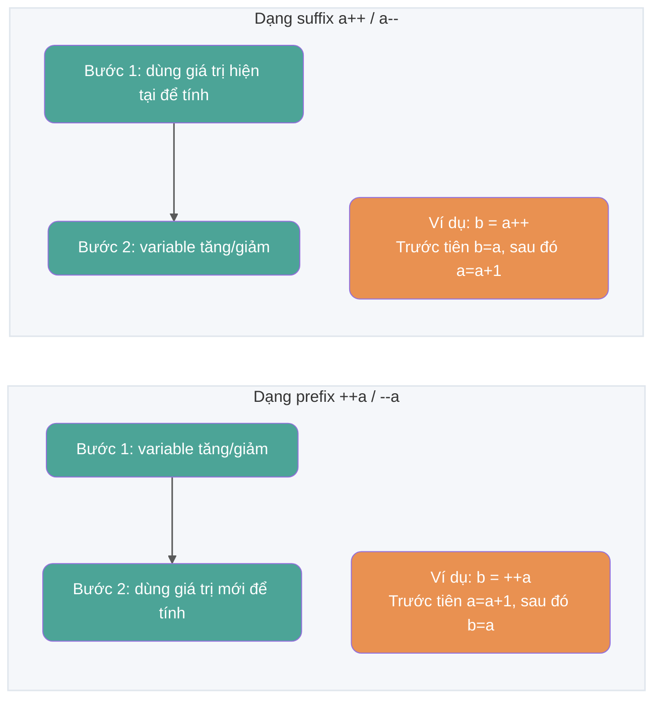
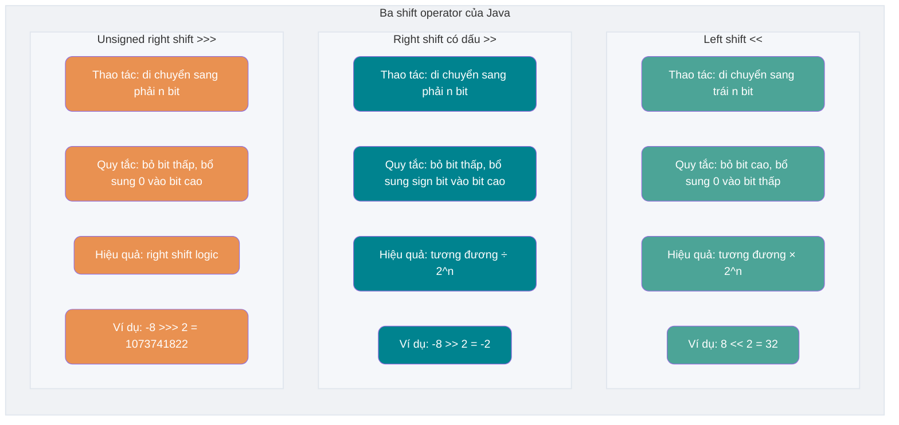
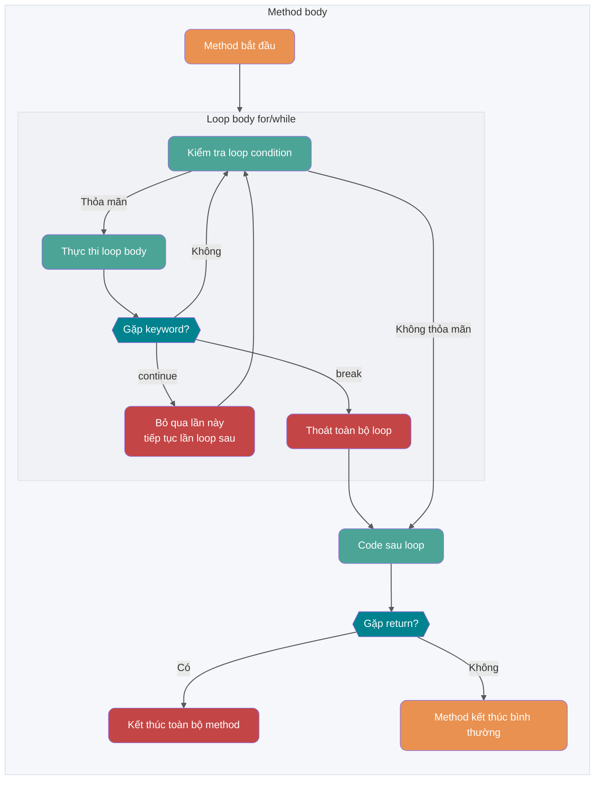
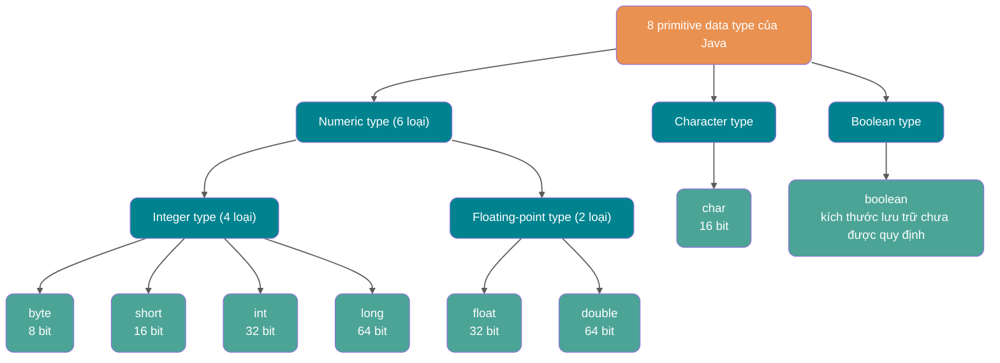
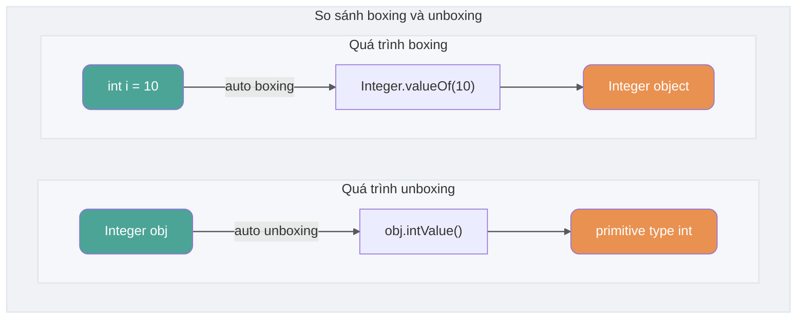

## Khái niệm cơ bản và kiến thức thường thức

### Ngôn ngữ Java có những đặc điểm nào?

1. Dễ học (cú pháp đơn giản, dễ bắt đầu);
2. Hướng đối tượng (encapsulation, inheritance, polymorphism);
3. Không phụ thuộc nền tảng (JVM thực hiện tính không phụ thuộc nền tảng);
4. Hỗ trợ nhiều thread (ngôn ngữ C++ không có cơ chế hỗ trợ nhiều thread tích hợp, vì vậy phải gọi chức năng nhiều thread của hệ điều hành để lập trình, còn ngôn ngữ Java cung cấp sẵn hỗ trợ nhiều thread);
5. Đáng tin cậy (có cơ chế xử lý exception và quản lý bộ nhớ tự động);
6. An toàn (bản thân thiết kế ngôn ngữ Java cung cấp nhiều cơ chế bảo vệ an toàn như access modifier, hạn chế chương trình truy cập trực tiếp tài nguyên hệ điều hành);
7. Hiệu quả (nhờ tối ưu bằng các kỹ thuật như JIT compiler, hiệu năng chạy của ngôn ngữ Java vẫn rất tốt);
8. Hỗ trợ lập trình mạng và rất thuận tiện;
9. Tồn tại đồng thời compilation và interpretation;
10. …

> **🐛 Đính chính (xem [issue#544](https://github.com/Snailclimb/JavaGuide/issues/544))**: Bắt đầu từ C++11 (năm 2011), C++ đã đưa vào thư viện đa thread. Trên Windows, Linux và macOS đều có thể dùng `std::thread` và `std::async` để tạo thread. Tham khảo: <http://www.cplusplus.com/reference/thread/thread/?kw=thread>

🌈 Mở rộng một chút:

“Write Once, Run Anywhere (viết một lần, chạy mọi nơi)” là khẩu hiệu quảng bá thật sự kinh điển và đã được truyền đi nhiều năm! Vì vậy, đến hôm nay vẫn có nhiều người cho rằng khả năng cross-platform là ưu thế lớn nhất của ngôn ngữ Java. Trên thực tế, cross-platform không còn là điểm bán hàng lớn nhất của Java, các tính năng mới của JDK cũng vậy. Công nghệ virtualization trên thị trường hiện đã rất hoàn thiện, chẳng hạn bạn có thể dễ dàng thực hiện cross-platform bằng Docker. Theo tôi, chính ecosystem mạnh mẽ của Java mới là điều quan trọng!

### Java SE vs Java EE

- Java SE (Java Platform, Standard Edition): phiên bản tiêu chuẩn của nền tảng Java, nền tảng của ngôn ngữ lập trình Java, bao gồm các class library cốt lõi và các thành phần cốt lõi như JVM hỗ trợ phát triển và chạy ứng dụng Java. Java SE có thể dùng để xây dựng desktop application hoặc server application đơn giản.
- Java EE (Java Platform, Enterprise Edition): phiên bản doanh nghiệp của nền tảng Java, xây dựng trên nền tảng Java SE, bao gồm các tiêu chuẩn và đặc tả hỗ trợ phát triển, deploy enterprise application (chẳng hạn Servlet, JSP, EJB, JDBC, JPA, JTA, JavaMail, JMS). Java EE có thể dùng để xây dựng server-side Java application phân tán, portable, robust, scalable và an toàn, chẳng hạn Web application.

Nói đơn giản, Java SE là phiên bản nền tảng của Java, Java EE là phiên bản nâng cao của Java. Java SE phù hợp hơn để phát triển desktop application hoặc server application đơn giản, Java EE phù hợp hơn để phát triển enterprise application phức tạp hoặc Web application.

Ngoài Java SE và Java EE, còn có Java ME (Java Platform, Micro Edition). Java ME là phiên bản thu gọn của Java, chủ yếu dùng để phát triển application cho thiết bị điện tử tiêu dùng embedded, chẳng hạn điện thoại, PDA, set-top box, tủ lạnh, điều hòa. Không cần tập trung vào Java ME, chỉ cần biết có thứ này là được, hiện nay đã không còn dùng đến.

### ⭐️ JVM vs JDK vs JRE

#### JVM

JVM (Java Virtual Machine) là máy ảo chạy Java bytecode. JVM có implementation riêng cho các hệ thống khác nhau (Windows, Linux, macOS), mục đích là với cùng một bytecode, chúng đều cho ra cùng một kết quả. Bytecode và implementation JVM của các hệ thống khác nhau là chìa khóa giúp ngôn ngữ Java “compile một lần, chạy mọi nơi”.

Như hình dưới đây, các ngôn ngữ lập trình khác nhau (Java, Groovy, Kotlin, JRuby, Clojure ...) được compiler tương ứng compile thành file `.class`, rồi cuối cùng chạy trên các platform khác nhau (Windows, Mac, Linux) thông qua JVM.


**JVM không chỉ có một loại! Chỉ cần đáp ứng đặc tả JVM thì mọi công ty, tổ chức hoặc cá nhân đều có thể phát triển JVM riêng của mình.** Nói cách khác, HotSpot VM mà chúng ta thường tiếp xúc chỉ là một implementation của đặc tả JVM.

Ngoài HotSpot VM thường dùng nhất, còn có J9 VM, Zing VM, JRockit VM và các JVM khác. Wikipedia có phần so sánh các JVM phổ biến: [Comparison of Java virtual machines](https://en.wikipedia.org/wiki/Comparison_of_Java_virtual_machines), bạn có thể xem nếu quan tâm. Ngoài ra, bạn có thể tìm thấy đặc tả JVM tương ứng với JDK của từng phiên bản trên [Java SE Specifications](https://docs.oracle.com/javase/specs/index.html).


#### JDK và JRE

JDK (Java Development Kit) là một bộ công cụ phát triển Java đầy đủ chức năng, dành cho developer sử dụng để tạo và compile chương trình Java. Nó bao gồm JRE (Java Runtime Environment), compiler javac và các tool khác như javadoc (trình tạo tài liệu), jdb (debugger), jconsole (monitoring tool), javap (decompiler) v.v.

JRE là environment cần thiết để chạy chương trình Java đã compile, chủ yếu gồm hai phần sau:

1. **JVM**: chính là JVM đã đề cập ở trên.
2. **Java Class Library**: một tập hợp class library standard, cung cấp các chức năng và API thường dùng (như thao tác I/O, giao tiếp mạng, data structure v.v.).

Nói đơn giản, JRE chỉ bao gồm environment và class library cần để chạy chương trình Java, còn JDK không chỉ bao gồm JRE mà còn có các tool dùng để develop và debug chương trình Java.

Nếu cần viết, compile chương trình Java hoặc dùng development tool đi kèm JDK thì cần cài JDK. Một số application compile Java source code tại runtime (chẳng hạn chuyển JSP thành Servlet) cũng có thể cần JDK. Java core reflection API thuộc runtime library, bản thân việc dùng reflection không yêu cầu cài đầy đủ JDK.

Hình dưới đây thể hiện rõ quan hệ giữa JDK, JRE và JVM.


Tuy nhiên, từ JDK 9 trở đi không cần phân biệt quan hệ giữa JDK và JRE nữa, thay vào đó là module system (JDK được tổ chức lại thành 94 module) + tool [jlink](http://openjdk.java.net/jeps/282) (command-line tool mới được phát hành cùng Java 9, dùng để tạo Java runtime image tùy chỉnh chỉ chứa các module mà application nhất định cần). Ngoài ra, từ JDK 11, Oracle không còn cung cấp bản download JRE riêng.

Trong bài viết [Tổng quan tính năng mới của Java 9](https://javaguide.cn/java/new-features/java9.html), khi giới thiệu module system, tôi đã đề cập:

> Sau khi module system được đưa vào, JDK được tổ chức lại thành 94 module. Java application có thể dùng tool jlink mới để tạo custom runtime image chỉ chứa các JDK module mà nó phụ thuộc. Nhờ vậy có thể giảm đáng kể kích thước Java runtime environment.

Nói cách khác, có thể dùng jlink để tạo một runtime nhỏ hơn theo nhu cầu của mình, thay vì application nào cũng dùng cùng một JRE bất kể là application gì.

Java runtime image tùy chỉnh, dạng module giúp đơn giản hóa việc deploy Java application, tiết kiệm memory, đồng thời tăng security và maintainability. Điều này rất quan trọng để đáp ứng nhu cầu của modern application architecture như virtualization, containerization, microservice và cloud-native development.

### ⭐️ Bytecode là gì? Lợi ích của việc dùng bytecode là gì?

Trong Java, code mà JVM có thể hiểu được gọi là bytecode (tức file có extension `.class`). Nó không hướng đến processor cụ thể nào mà chỉ hướng đến virtual machine. Ngôn ngữ Java dùng bytecode để phần nào giải quyết vấn đề hiệu năng thực thi thấp của ngôn ngữ interpreted truyền thống, đồng thời vẫn giữ đặc điểm portable của ngôn ngữ interpreted. Vì vậy, chương trình Java khi chạy tương đối hiệu quả (tuy nhiên vẫn có khoảng cách nhất định so với C, C++, Rust, Go và các ngôn ngữ khác), hơn nữa vì bytecode không nhắm đến một machine cụ thể nên chương trình Java không cần compile lại mà vẫn có thể chạy trên máy tính dùng nhiều operating system khác nhau.

**Quy trình từ source code đến khi chương trình Java chạy như hình dưới đây**:


Điều cần đặc biệt chú ý là bước `.class->machine code`. Lấy HotSpot làm ví dụ, sau khi JVM load bytecode, trước hết nó có thể interpret và nhận diện các method, code block thường xuyên được gọi (tức hot code), sau đó compiler **JIT (Just in Time Compilation)** compile hot bytecode thành machine code. Khi JVM process hiện tại thực thi các code này ở những lần sau, nó có thể dùng trực tiếp machine code đã compile. Điều này cũng giải thích vì sao chúng ta thường nói **Java là ngôn ngữ tồn tại đồng thời compilation và interpretation**. Tuy nhiên, đặc tả JVM không yêu cầu implementation cụ thể nhất thiết phải có interpreter hoặc JIT compiler.

> 🌈 Đọc thêm:
>
> - [Nền tảng | Giải thích và thực hành nguyên lý Java JIT compiler - Meituan Technical Team](https://mp.weixin.qq.com/s/7PH8o1tbjLsM4-nOnjbwLw)
> - [Xây dựng microservice application bằng static compilation - Alibaba Middleware](https://mp.weixin.qq.com/s/4haTyXUmh8m-dBQaEzwDJw)


> HotSpot dùng cách lazy evaluation, theo quy luật 80/20, chỉ một phần nhỏ code tiêu thụ phần lớn system resource (hot code), và đó chính là phần JIT cần compile. JVM thu thập thông tin dựa trên số lần code được thực thi và đưa ra tối ưu tương ứng, vì vậy số lần thực thi càng nhiều thì tốc độ càng nhanh.

Quan hệ giữa JDK, JRE, JVM và JIT như hình dưới đây.


Hình dưới đây là mô hình cấu trúc khái quát của JVM.


### ⭐️ Vì sao nói ngôn ngữ Java “tồn tại đồng thời compilation và interpretation”?

Thực ra vấn đề này đã được đề cập khi nói về bytecode, vì khá quan trọng nên ở đây nhắc lại.

Chúng ta có thể chia ngôn ngữ lập trình cấp cao thành hai loại theo cách chương trình được thực thi:

- **Compiled**: [Compiled language](https://zh.wikipedia.org/wiki/%E7%B7%A8%E8%AD%AF%E8%AA%9E%E8%A8%80) dùng [compiler](https://zh.wikipedia.org/wiki/%E7%B7%A8%E8%AD%AF%E5%99%A8) để dịch source code một lần thành machine code có thể được platform đó thực thi. Thông thường, tốc độ thực thi của compiled language khá nhanh, nhưng hiệu suất phát triển thấp hơn. Các compiled language phổ biến có C, C++, Go, Rust v.v.
- **Interpreted**: [Interpreted language](https://zh.wikipedia.org/wiki/%E7%9B%B4%E8%AD%AF%E8%AA%9E%E8%A8%80) dùng [interpreter](https://zh.wikipedia.org/wiki/直譯器) để diễn giải code từng câu thành machine code rồi thực thi. Hiệu suất phát triển của interpreted language khá nhanh, nhưng tốc độ thực thi chậm hơn. Các interpreted language phổ biến có Python, JavaScript, PHP v.v.


Theo giới thiệu của Wikipedia:

> Kỹ thuật [JIT compilation](https://zh.wikipedia.org/wiki/即時編譯) được phát triển để cải thiện hiệu suất của interpreted language đã thu hẹp khoảng cách giữa hai loại language này. Kỹ thuật này kết hợp ưu điểm của compiled language và interpreted language: giống compiled language, trước hết compile source code của chương trình thành [bytecode](https://zh.wikipedia.org/wiki/字节码). Khi thực thi, bytecode lại được interpret rồi thực thi. [Java](https://zh.wikipedia.org/wiki/Java) và [LLVM](https://zh.wikipedia.org/wiki/LLVM) là những sản phẩm tiêu biểu của kỹ thuật này.
>
> Đọc thêm: [Nền tảng | Giải thích và thực hành nguyên lý Java JIT compiler](https://mp.weixin.qq.com/s/7PH8o1tbjLsM4-nOnjbwLw)

**Vì sao nói ngôn ngữ Java “tồn tại đồng thời compilation và interpretation”?**

Đó là vì các Java implementation phổ biến dùng đồng thời compilation và interpretation: Java source code trước hết được compiler tạo thành bytecode (file `.class`), bytecode có thể được JVM interpret và thực thi, hoặc được JIT compile thành machine code tại runtime. Bytecode không bắt buộc phải được interpreter thực thi, chiến lược thực thi cụ thể do JVM implementation quyết định.

### AOT có ưu điểm gì? Vì sao không dùng hoàn toàn AOT?

JDK 9 từng đưa vào tool AOT (Ahead of Time Compilation) mang tính thử nghiệm `jaotc` thông qua JEP 295, nhưng tool này đã bị loại bỏ trong JDK 17. Vì vậy, JDK tiêu chuẩn từ JDK 17 trở đi không còn chứa AOT compiler tích hợp này; phần thảo luận dưới đây nói về AOT theo nghĩa chung và các toolchain độc lập như GraalVM Native Image (Native Image là một kỹ thuật AOT do GraalVM cung cấp, sẽ được giới thiệu thêm ở phần sau). Khác với JIT, AOT compile code thành machine code trước khi chương trình chạy, có thể giảm chi phí warm-up tại runtime và cải thiện tốc độ startup, nhưng memory usage cụ thể, peak performance và use case phụ thuộc vào AOT implementation được dùng và application workload.

So sánh dưới đây lấy HotSpot JIT phổ biến và GraalVM Native Image làm ví dụ. Cách implementation của các AOT tool khác nhau không hoàn toàn giống nhau, hiệu quả thực tế còn chịu ảnh hưởng bởi build parameter, application workload và việc có dùng PGO (Profile-Guided Optimization, tức dùng performance information thu thập trong quá trình chạy thực tế của chương trình để hỗ trợ optimization) hay không.

| Tiêu chí so sánh             | JIT (JIT compilation)                                              | AOT (AOT compilation)                                                                           |
| ---------------------------- | ------------------------------------------------------------------ | ----------------------------------------------------------------------------------------------- |
| **Thời điểm compile**        | Compile tại runtime theo tình hình thực thi code                   | Compile trước ở build stage                                                                     |
| **Startup và warm-up**       | Sau startup thường cần interpret và compile hot code               | Thường startup nhanh hơn, không cần chờ JIT warm-up                                             |
| **Performance khi chạy lâu** | Có thể liên tục tối ưu hot code nhờ thông tin thu thập tại runtime | Thiếu đầy đủ thông tin runtime, hiệu quả cụ thể phụ thuộc implementation và build configuration |
| **Runtime memory**           | Cần lưu compiler, performance data và machine code được tạo        | Các implementation như Native Image thường dùng ít runtime memory hơn                           |
| **Dependency khi chạy**      | Cần JVM và runtime tương ứng                                       | Native Image có thể tạo executable native độc lập                                               |
| **Tính dynamic**             | Hỗ trợ runtime loading, reflection và bytecode generation          | Công cụ closed-world analysis thường cần metadata hoặc xử lý ở build stage                      |
| **Use case phổ biến**        | Service chạy lâu, coi trọng throughput liên tục                    | CLI, Serverless, elastic scaling và service nhạy với cold start                                 |


Ưu thế của AOT chủ yếu thể hiện ở startup speed và runtime memory usage, phù hợp hơn với application cold start thường xuyên, instance có lifecycle ngắn hoặc cần scale nhanh. JIT có thể tối ưu hot code theo thông tin thu thập tại runtime, vì vậy service chạy lâu thường dễ phát huy ưu thế này hơn. Không thể kết luận trực tiếp throughput và latency của hai bên chỉ dựa vào phương thức compile, mà cần kết hợp toolchain cụ thể và workload thực tế để test.

Nhắc đến AOT thì không thể không nhắc đến [GraalVM](https://www.graalvm.org/)! GraalVM là một JDK hiệu năng cao (một bản phân phối JDK đầy đủ), có thể chạy Java và các ngôn ngữ JVM khác, cũng như các ngôn ngữ non-JVM như JavaScript, Python. GraalVM không chỉ cung cấp AOT compilation mà còn cung cấp JIT compilation. Nếu quan tâm, bạn có thể xem tài liệu chính thức của GraalVM: <https://www.graalvm.org/latest/docs/>. Nếu thấy tài liệu chính thức khó hiểu, bạn cũng có thể tìm một số bài viết, chẳng hạn:

- [Xây dựng microservice application bằng static compilation](https://mp.weixin.qq.com/s/4haTyXUmh8m-dBQaEzwDJw)
- [Hướng đến Native: ví dụ và giải thích nguyên lý kỹ thuật Spring&Dubbo AOT](https://cn.dubbo.apache.org/zh-cn/blog/2023/06/28/%e8%b5%b0%e5%90%91-native-%e5%8c%96springdubbo-aot-%e6%8a%80%e6%9c%af%e7%a4%ba%e4%be%8b%e4%b8%8e%e5%8e%9f%e7%90%86%e8%ae%b2%e8%a7%a3/)

**AOT có nhiều ưu điểm như vậy, tại sao không dùng hoàn toàn phương thức compile này?**

Lấy GraalVM Native Image làm ví dụ, khi build native executable, nó thực hiện closed-world analysis: builder xuất phát từ program entry point, phân tích những class, method và field nào có thể được truy cập tại runtime, chỉ đưa reachable code và metadata cần thiết vào artifact cuối cùng. Chương trình vẫn có thể nhận dynamic input và tạo object; code hoàn toàn không biết ở build stage sẽ không tự động được đưa vào kết quả phân tích.

Tên class trong đoạn code dưới đây đến từ runtime parameter, builder không thể chỉ dựa vào quan hệ gọi static để xác định cần giữ lại class nào:

```java
String className = args[0];
Class<?> clazz = Class.forName(className);
Object instance = clazz.getDeclaredConstructor().newInstance();
```

Reflection, dynamic proxy và JNI vẫn có thể dùng trong Native Image. Với dynamic access mà static analysis không suy luận được, thường cần [reachability metadata](https://www.graalvm.org/latest/reference-manual/native-image/metadata/) để khai báo trước class, method, field, proxy interface và JNI element có thể được truy cập tại runtime. Việc dynamic load class không xác định tại runtime, tạo và load bytecode mới sẽ bị hạn chế nghiêm ngặt hơn vì code tương ứng không tồn tại ở build stage.

Spring dùng AOT processing để thích ứng với cách thực thi này. Ở build stage, nó phân tích application context, tạo Java source code, proxy bytecode cùng `RuntimeHints` cần cho reflection, resource và proxy. CGLIB thường dùng ASM để tạo proxy class tại runtime; trong Native Image, công việc này có thể được hoàn thành trước ở build stage. Sau khi framework hoặc application cung cấp build-time adaptation tương ứng, Spring, CGLIB và ASM vẫn có thể tham gia build và chạy AOT application. Cơ chế cụ thể có thể tham khảo [official document về Spring AOT](https://docs.spring.io/spring-framework/reference/core/aot.html).

AOT chuyển một phần công việc và thông tin runtime sang build stage, đồng thời làm tăng build time, chi phí duy trì metadata và adaptation compatibility. Với application phụ thuộc runtime dynamic loading, Java Agent hoặc tạo nhiều dynamic bytecode, JIT mode thường thuận tiện hơn; với application nhạy cảm về cold start và memory usage, AOT hấp dẫn hơn.

### Oracle JDK vs OpenJDK

Có thể trước khi xem câu hỏi này, nhiều người cũng như tôi chưa từng tiếp xúc hoặc sử dụng OpenJDK. Vậy giữa Oracle JDK và OpenJDK có khác biệt lớn không? Dưới đây, tôi giải đáp câu hỏi thường bị nhiều người bỏ qua này thông qua một số tài liệu đã thu thập.

Trước hết, năm 2006 công ty SUN mở mã nguồn Java, từ đó có OpenJDK. Năm 2009 Oracle mua lại công ty Sun, sau đó tự xây dựng một Oracle JDK trên nền tảng OpenJDK. Oracle JDK không open source, hơn nữa trong vài phiên bản đầu (Java 8 ~ Java 11) còn bổ sung một số feature và tool riêng so với OpenJDK.

Tiếp theo, với Java 7, OpenJDK và Oracle JDK rất gần nhau. Oracle JDK được build dựa trên OpenJDK 7, chỉ bổ sung một số feature nhỏ và do các engineer của Oracle tham gia maintain.

Đoạn dưới đây trích từ một blog do Oracle đăng chính thức năm 2012:

> Hỏi: Source code trong repository OpenJDK khác gì với code dùng để build Oracle JDK?
>
> Đáp: Rất gần nhau - quy trình build version Oracle JDK của chúng tôi dựa trên build OpenJDK 7, chỉ bổ sung một vài phần, chẳng hạn deployment code, trong đó gồm implementation của Oracle Java plugin và Java WebStart, cùng một số third-party component closed source như graphics rasterizer, một số third-party component open source như Rhino và một số thứ lặt vặt như document bổ sung hoặc third-party font. Trong tương lai, mục tiêu của chúng tôi là open source mọi phần của Oracle JDK, ngoại trừ những phần được xem là commercial feature.

Cuối cùng, tóm tắt đơn giản sự khác nhau giữa Oracle JDK và OpenJDK:

1. **Có open source hay không**: OpenJDK là reference model và hoàn toàn open source, còn Oracle JDK được implementation dựa trên OpenJDK và không hoàn toàn open source (quan điểm cá nhân: như mọi người đều biết, JDK ban đầu do SUN company phát triển, sau đó SUN company bán cho Oracle company. Oracle company nổi tiếng với Oracle database, mà Oracle database lại closed source, nên lúc này Oracle company không muốn open source hoàn toàn. Tuy nhiên SUN company ban đầu đã open source JDK, nếu sau khi mua lại Oracle lại đóng source thì chắc chắn sẽ khiến nhiều Java developer không hài lòng và làm mọi người mất niềm tin vào Java. Vì vậy Oracle company đã chọn một cách xử lý: open source một phần core code để mọi người sử dụng, phân biệt với JDK do mọi người tự phát triển, gọi của các bạn là OpenJDK, còn tôi gọi là Oracle JDK. Tôi phát hành bản của tôi, các bạn tiếp tục phát triển bản của các bạn; nếu các bạn tạo ra điều gì thú vị, tôi sẽ dùng trong Oracle JDK phát hành sau này, đôi bên cùng có lợi!). Open source project OpenJDK: [https://github.com/openjdk/jdk](https://github.com/openjdk/jdk).
2. **Có miễn phí hay không**: License của Oracle JDK phụ thuộc vào version cụ thể và version update. Oracle JDK 21 và các update cụ thể sau đó được phép sử dụng miễn phí, bao gồm sử dụng commercial trong production, trong thời hạn NFTC; chẳng hạn Oracle dự kiến dùng NFTC cho update JDK 21 đến tháng 9 năm 2026 và cho update JDK 25 đến tháng 9 năm 2028. Sau khi thời hạn miễn phí kết thúc, license của các update tiếp theo sẽ thay đổi; version đã download vẫn dùng license tại thời điểm download. Oracle OpenJDK build dùng GPLv2 + Classpath Exception.
3. **Tính năng**: Oracle JDK bổ sung một số feature và tool riêng trên nền tảng OpenJDK, chẳng hạn Java Flight Recorder (JFR, một monitoring tool), Java Mission Control (JMC, một monitoring tool) và các tool khác. Tuy nhiên, sau Java 11, feature của OracleJDK và OpenJDK về cơ bản giống nhau; phần lớn private component trước đây trong OracleJDK cũng đã được đóng góp cho các tổ chức open source.
4. **Hỗ trợ dài hạn**: Bản thân dự án OpenJDK không cam kết cung cấp commercial LTS service; Oracle và nhiều nhà cung cấp OpenJDK distribution sẽ cung cấp long-term support cho các version cụ thể. Java 8, 11, 17, 21, 25 là các Oracle LTS version, Oracle dự kiến phát hành một LTS version mỗi hai năm trong tương lai.
5. **License**: License của Oracle JDK thay đổi theo version và version update, có thể là NFTC hoặc OTN; BCL chỉ dùng cho các version phát hành trước ngày 16 tháng 4 năm 2019. Oracle OpenJDK dùng GPLv2 + Classpath Exception.

> Oracle JDK đã tốt như vậy, tại sao vẫn cần OpenJDK?
>
> Đáp:
>
> 1. OpenJDK là open source, open source có nghĩa là bạn có thể sửa đổi và tối ưu theo nhu cầu của mình, chẳng hạn Alibaba phát triển Dragonwell8 dựa trên OpenJDK: [https://github.com/alibaba/dragonwell8](https://github.com/alibaba/dragonwell8)
> 2. OpenJDK miễn phí cho mục đích thương mại (đây cũng là lý do JDK được cài mặc định qua yum package manager là OpenJDK chứ không phải Oracle JDK). Mặc dù Oracle JDK cũng miễn phí cho mục đích thương mại (chẳng hạn JDK 8), nhưng không phải mọi version đều miễn phí.
> 3. Các feature version của OpenJDK và Oracle JDK đều tuân theo nhịp phát hành sáu tháng; chu kỳ update và support của mỗi distribution có thể khác nhau.
>
> Dựa trên những lý do trên, OpenJDK vẫn cần tồn tại!


**Nên chọn Oracle JDK hay OpenJDK?**

Khuyến nghị chọn OpenJDK hoặc distribution dựa trên OpenJDK, chẳng hạn Amazon Corretto của AWS, Alibaba Dragonwell của Alibaba.

🌈 Mở rộng một chút:

- BCL (Oracle Binary Code License Agreement): có thể sử dụng JDK (hỗ trợ commercial), nhưng không được sửa đổi.
- OTN (Oracle Technology Network License Agreement): JDK mới phát hành từ version 11 trở đi đều dùng license này, có thể sử dụng cá nhân, nhưng dùng commercial cần trả phí.

### Java và C++ khác nhau thế nào?

Tôi biết nhiều người chưa học C++, nhưng interviewer lại rất thích đem Java và C++ ra so sánh! Không còn cách nào khác!!! Dù chưa học C++, bạn cũng phải ghi nhớ.

Mặc dù Java và C++ đều là ngôn ngữ hướng đối tượng, đều hỗ trợ encapsulation, inheritance và polymorphism, nhưng chúng vẫn có khá nhiều điểm khác nhau:

- Java không cung cấp pointer để truy cập trực tiếp memory, vì vậy memory của chương trình an toàn hơn.
- Class của Java chỉ inheritance đơn, C++ hỗ trợ multiple inheritance; mặc dù class của Java không thể multiple inheritance, interface lại có thể multiple inheritance.
- Java có cơ chế garbage collection (GC) để quản lý memory tự động, không cần programmer tự giải phóng memory không dùng.
- C++ đồng thời hỗ trợ method overloading và operator overloading, nhưng Java chỉ hỗ trợ method overloading (operator overloading làm tăng độ phức tạp, không phù hợp với tư tưởng thiết kế ban đầu của Java).
- …

## Cú pháp cơ bản

### Có những dạng comment nào?

Java có ba loại comment:

1. **Comment một dòng**: thường dùng để giải thích tác dụng của một dòng code trong method.

2. **Comment nhiều dòng**: thường dùng để giải thích tác dụng của một đoạn code.

3. **Document comment**: thường dùng để tạo tài liệu phát triển Java.

Comment một dòng và document comment được dùng nhiều hơn, còn comment nhiều dòng tương đối ít dùng trong phát triển thực tế.


Khi viết code, nếu lượng code ít thì bản thân chúng ta hoặc thành viên khác trong team vẫn có thể dễ dàng đọc hiểu. Nhưng khi cấu trúc project trở nên phức tạp, chúng ta cần dùng comment. Comment không được thực thi (compiler sẽ xóa toàn bộ comment trong code trước khi compile code, bytecode không giữ comment), nó là phần programmer viết cho chính mình, là tài liệu hướng dẫn code, có thể giúp người đọc code nhanh chóng hiểu rõ quan hệ logic giữa các đoạn code. Vì vậy, tạo thói quen thêm comment ngay khi viết program là một thói quen rất tốt.

Cuốn 《Clean Code》 chỉ rõ:

> **Comment trong code không phải càng chi tiết càng tốt. Trên thực tế, code tốt bản thân đã là comment; chúng ta nên cố gắng chuẩn hóa và làm đẹp code để giảm comment không cần thiết.**
>
> **Nếu programming language đủ biểu đạt, không cần comment; hãy cố gắng diễn đạt bằng code.**
>
> Ví dụ:
>
> Bỏ comment phức tạp dưới đây, chỉ cần tạo một function có cùng ý nghĩa với comment là được
>
> ```java
> // check to see if the employee is eligible for full benefits
> if ((employee.flags & HOURLY_FLAG) && (employee.age > 65))
> ```
>
> Nên thay bằng
>
> ```java
> if (employee.isEligibleForFullBenefits())
> ```

### Identifier và keyword khác nhau thế nào?

Khi viết program, chúng ta cần đặt tên cho program, class, variable, method v.v., từ đó có **identifier**. Nói đơn giản, **identifier là một cái tên**.

Một số identifier được ngôn ngữ Java gán cho ý nghĩa đặc biệt và chỉ được dùng ở nơi nhất định, những identifier đặc biệt này là **keyword**. Nói đơn giản, **keyword là identifier được gán ý nghĩa đặc biệt**. Ví dụ, trong đời sống hằng ngày, nếu muốn mở một cửa hàng, chúng ta phải đặt tên cho cửa hàng; cái “tên” đó chính là identifier. Nhưng tên cửa hàng không thể là “đồn cảnh sát”, vì “đồn cảnh sát” đã được gán một ý nghĩa đặc biệt; “đồn cảnh sát” chính là keyword trong đời sống hằng ngày.

### Các keyword của ngôn ngữ Java gồm những gì?

| Phân loại                          | Keyword  |            |          |              |            |           |        |
| :--------------------------------- | -------- | ---------- | -------- | ------------ | ---------- | --------- | ------ |
| Access control                     | private  | protected  | public   |              |            |           |        |
| Class, method và variable modifier | abstract | class      | extends  | final        | implements | interface | native |
|                                    | new      | static     | strictfp | synchronized | transient  | volatile  | enum   |
| Program control                    | break    | continue   | return   | do           | while      | if        | else   |
|                                    | for      | instanceof | switch   | case         | default    | assert    |        |
| Error handling                     | try      | catch      | throw    | throws       | finally    |           |        |
| Liên quan đến package              | import   | package    |          |              |            |           |        |
| Primitive type                     | boolean  | byte       | char     | double       | float      | int       | long   |
|                                    | short    |            |          |              |            |           |        |
| Variable reference                 | super    | this       | void     |              |            |           |        |
| Reserved word                      | goto     | const      |          |              |            |           |        |

> Tips: mọi keyword đều viết thường và được hiển thị bằng màu đặc biệt trong IDE.
>
> Keyword `default` rất đặc biệt: nó vừa thuộc program control, vừa thuộc class, method và variable modifier, đồng thời thuộc access control.
>
> - Trong program control, khi không match được trường hợp nào trong `switch`, có thể dùng `default` để viết trường hợp match mặc định.
> - Trong class, method và variable modifier, từ JDK 8 bắt đầu hỗ trợ default method, có thể dùng keyword `default` để định nghĩa implementation mặc định của method.
> - Trong access control, nếu trước một method không có modifier nào thì mặc định sẽ có một modifier `default`, nhưng nếu thêm modifier này vào thì sẽ báo lỗi.

⚠️ Lưu ý: mặc dù `true`, `false` và `null` trông giống keyword, nhưng thực tế chúng là literal, đồng thời cũng không thể dùng làm identifier.

Tài liệu chính thức: [https://docs.oracle.com/javase/tutorial/java/nutsandbolts/\_keywords.html](https://docs.oracle.com/javase/tutorial/java/nutsandbolts/_keywords.html)

### ⭐️ Operator tăng và giảm

Trong quá trình viết code, một tình huống thường gặp là cần tăng hoặc giảm 1 cho variable kiểu integer. Java cung cấp operator tăng (`++`) và operator giảm (`--`) để đơn giản hóa thao tác này.

Operator `++` và `--` có thể đặt trước variable hoặc sau variable:

- **Dạng prefix** (ví dụ `++a` hoặc `--a`): trước hết tăng/giảm giá trị của variable, sau đó mới dùng variable, ví dụ `b = ++a` trước tiên tăng `a` lên 1 rồi gán giá trị sau khi tăng cho `b`.
- **Dạng suffix** (ví dụ `a++` hoặc `a--`): trước hết dùng giá trị hiện tại của variable, sau đó mới tăng/giảm giá trị của variable. Ví dụ `b = a++` trước tiên gán giá trị hiện tại của `a` cho `b`, sau đó tăng `a` lên 1.

Để dễ nhớ, có thể dùng câu: **Ký hiệu ở trước thì tăng/giảm trước, ký hiệu ở sau thì tăng/giảm sau**.



Hãy xem một câu hỏi viết tay thường gặp kiểm tra operator tăng và giảm: sau khi chạy đoạn code dưới đây, giá trị của `a`, `b`, `c`, `d` và `e` là bao nhiêu?

```java
int a = 9;
int b = a++;
int c = ++a;
int d = c--;
int e = --d;
```

Đáp án: `a = 11`, `b = 9`, `c = 11`, `d = 10`, `e = 10`.

### ⭐️ Shift operator

Shift operator là một trong những operator cơ bản nhất, hầu như mọi programming language đều có operator này. Trong shift operation, dữ liệu được thao tác được xem là số nhị phân; shift là operation di chuyển nó sang trái hoặc phải một số bit.

Shift operator được dùng khá rộng rãi trong nhiều framework cũng như source code của chính JDK. Source code method `hash` của `HashMap` (JDK 1.8) có sử dụng shift operator:

```java
static final int hash(Object key) {
    int h;
    // key.hashCode(): trả về hash value, tức hashcode
    // ^: XOR theo bit
    // >>>: right shift không dấu, bỏ qua sign bit, các vị trí trống đều bổ sung 0
    return (key == null) ? 0 : (h = key.hashCode()) ^ (h >>> 16);
  }

```

**Các lý do chính để dùng shift operator**:

1. **Hiệu quả**: shift operator tương ứng trực tiếp với shift instruction của processor. Processor hiện đại có hardware instruction chuyên dụng để thực hiện shift operation, thường hoàn thành trong một clock cycle. Ngược lại, các arithmetic operation như multiplication và division cần nhiều clock cycle hơn ở tầng hardware.
2. **Tiết kiệm memory**: thông qua shift operation, có thể dùng một integer (như `int` hoặc `long`) để lưu nhiều boolean value hoặc flag bit, từ đó tiết kiệm memory.

Shift operator thường được dùng nhất để nhân hoặc chia nhanh cho lũy thừa của 2. Ngoài ra, nó còn đóng vai trò quan trọng trong các mặt sau:

- **Quản lý bit field**: chẳng hạn lưu trữ và thao tác nhiều boolean value.
- **Hash algorithm và encryption/decryption**: làm xáo trộn dữ liệu thông qua shift và các operation AND, OR.
- **Data compression**: chẳng hạn Huffman coding có thể nhanh chóng xử lý và thao tác binary data thông qua shift operator để tạo format nén gọn.
- **Data validation**: chẳng hạn CRC (cyclic redundancy check) tạo và kiểm tra data integrity thông qua shift và polynomial division.
- **Memory alignment**: dễ dàng tính và điều chỉnh địa chỉ alignment của dữ liệu thông qua shift operation.

Nắm vững kiến thức cơ bản nhất về shift operator vẫn rất cần thiết, không chỉ giúp sử dụng nó trong code mà còn giúp hiểu code có liên quan đến shift operator trong source code.



Java có ba shift operator:

- `<<`: left shift operator, di chuyển sang trái một số bit, bỏ bit cao, bổ sung 0 vào bit thấp. `x << n` tương đương x nhân với 2 mũ n (khi không overflow).
- `>>`: right shift có dấu, di chuyển sang phải một số bit, bổ sung sign bit vào bit cao, bỏ bit thấp. Bit cao của số dương bổ sung 0, bit cao của số âm bổ sung 1. `x >> n` tương đương x chia cho 2 mũ n.
- `>>>`: unsigned right shift, bỏ qua sign bit, các vị trí trống đều bổ sung 0.

Mặc dù bản chất shift operation có thể chia thành left shift và right shift, nhưng trong ứng dụng thực tế, right shift cần xem xét cách xử lý sign bit.

Vì `double`, `float` có biểu diễn đặc biệt trong binary nên không thể thực hiện shift operation.

Shift operator thực tế chỉ hỗ trợ type `int` và `long`; trước khi shift `short`, `byte`, `char`, compiler đều chuyển chúng thành type `int` rồi mới thao tác.

**Nếu số bit cần shift vượt quá số bit mà giá trị chiếm dụng thì sao?**

Khi số bit left/right shift của type int lớn hơn hoặc bằng 32, trước hết sẽ lấy phần dư (%) rồi mới thực hiện left/right shift. Nghĩa là left/right shift 32 bit tương đương không shift (32%32=0), left/right shift 42 bit tương đương left/right shift 10 bit (42%32=10). Khi type long thực hiện left/right shift, vì binary tương ứng của long là 64 bit nên cơ số của phép lấy dư cũng thành 64.

Nói cách khác: `x<<42` tương đương `x<<10`, `x>>42` tương đương `x>>10`, `x >>>42` tương đương `x >>> 10`.

**Ví dụ code về left shift operator**:

```java
int i = -1;
System.out.println("Dữ liệu ban đầu: " + i);
System.out.println("Chuỗi nhị phân tương ứng với dữ liệu ban đầu: " + Integer.toBinaryString(i));
i <<= 10;
System.out.println("Dữ liệu sau khi left shift 10 bit " + i);
System.out.println("Chuỗi nhị phân tương ứng với dữ liệu sau khi left shift 10 bit " + Integer.toBinaryString(i));
```

Output:

```plain
Dữ liệu ban đầu: -1
Chuỗi nhị phân tương ứng với dữ liệu ban đầu: 11111111111111111111111111111111
Dữ liệu sau khi left shift 10 bit -1024
Chuỗi nhị phân tương ứng với dữ liệu sau khi left shift 10 bit 11111111111111111111110000000000
```

Vì khi số bit left shift lớn hơn hoặc bằng 32 sẽ lấy phần dư (%) trước rồi mới left shift, nên trong code dưới đây left shift 42 bit tương đương left shift 10 bit (42%32=10), output giống code trước.

```java
int i = -1;
System.out.println("Dữ liệu ban đầu: " + i);
System.out.println("Chuỗi nhị phân tương ứng với dữ liệu ban đầu: " + Integer.toBinaryString(i));
i <<= 42;
System.out.println("Dữ liệu sau khi left shift 10 bit " + i);
System.out.println("Chuỗi nhị phân tương ứng với dữ liệu sau khi left shift 10 bit " + Integer.toBinaryString(i));
```

Right shift operator tương tự, do giới hạn độ dài nên không trình bày ở đây.

### Sự khác nhau giữa `continue`, `break` và `return` là gì?

Trong loop structure, khi loop condition không còn thỏa mãn hoặc số lần loop đạt yêu cầu, loop sẽ kết thúc bình thường. Tuy nhiên đôi khi trong quá trình loop, khi một condition nào đó xảy ra, có thể cần kết thúc loop sớm; khi đó cần dùng các keyword sau:

1. `continue`: thoát khỏi lần loop hiện tại và tiếp tục lần loop tiếp theo.
2. `break`: thoát khỏi toàn bộ loop body và tiếp tục thực thi statement bên dưới loop.

`return` dùng để thoát khỏi method hiện tại và kết thúc việc chạy method đó. `return` thường có hai cách dùng:

1. `return;`: dùng trực tiếp return để kết thúc thực thi method, dùng cho method không có return value.
2. `return value;`: return một giá trị cụ thể, dùng cho method có return value.



Hãy suy nghĩ: kết quả chạy của các statement dưới đây là gì?

```java
public static void main(String[] args) {
    boolean flag = false;
    for (int i = 0; i <= 3; i++) {
        if (i == 0) {
            System.out.println("0");
        } else if (i == 1) {
            System.out.println("1");
            continue;
        } else if (i == 2) {
            System.out.println("2");
            flag = true;
        } else if (i == 3) {
            System.out.println("3");
            break;
        } else if (i == 4) {
            System.out.println("4");
        }
        System.out.println("xixi");
    }
    if (flag) {
        System.out.println("haha");
        return;
    }
    System.out.println("heihei");
}
```

Kết quả chạy:

```plain
0
xixi
1
2
xixi
3
haha
```

## ⭐️ Primitive data type

### Bạn biết những primitive data type nào trong Java?

Java có 8 primitive data type, gồm:

- 6 numeric type:
  - 4 integer type: `byte`, `short`, `int`, `long`
  - 2 floating-point type: `float`, `double`
- 1 character type: `char`
- 1 boolean type: `boolean`.



Default value và kích thước của 8 primitive data type này như sau:

| Primitive type | Số bit        | Byte          | Default value | Range                                                                                                                      |
| :------------- | :------------ | :------------ | :------------ | :------------------------------------------------------------------------------------------------------------------------- |
| `byte`         | 8             | 1             | 0             | -128 ~ 127                                                                                                                 |
| `short`        | 16            | 2             | 0             | -32768 (-2^15) ~ 32767 (2^15 - 1)                                                                                          |
| `int`          | 32            | 4             | 0             | -2147483648 ~ 2147483647                                                                                                   |
| `long`         | 64            | 8             | 0L            | -9223372036854775808 (-2^63) ~ 9223372036854775807 (2^63 -1)                                                               |
| `char`         | 16            | 2             | '\u0000'      | 0 ~ 65535 (2^16 - 1)                                                                                                       |
| `float`        | 32            | 4             | 0f            | khoảng -3.4028235E38 ~ 3.4028235E38, giá trị dương khác 0 nhỏ nhất khoảng 1.4E-45, gồm cả ±0, ±∞, NaN                      |
| `double`       | 64            | 8             | 0d            | khoảng -1.7976931348623157E308 ~ 1.7976931348623157E308, giá trị dương khác 0 nhỏ nhất khoảng 4.9E-324, gồm cả ±0, ±∞, NaN |
| `boolean`      | chưa quy định | chưa quy định | false         | true, false                                                                                                                |

Có thể thấy các số dương lớn nhất mà `byte`, `short`, `int`, `long` biểu diễn được đều bị giảm 1. Tại sao vậy? Vì trong cách biểu diễn bù hai nhị phân, bit cao nhất dùng để biểu diễn sign (0 biểu thị số dương, 1 biểu thị số âm), các bit còn lại biểu diễn phần giá trị. Vì vậy, nếu muốn biểu diễn số dương lớn nhất, cần đặt tất cả bit ngoại trừ bit cao nhất thành 1. Nếu cộng thêm 1 sẽ overflow và biến thành số âm.

Với `boolean`, official document không định nghĩa rõ, nó phụ thuộc vào implementation cụ thể của JVM vendor. Về logic có thể hiểu là chiếm 1 bit, nhưng thực tế còn phải cân nhắc yếu tố lưu trữ hiệu quả của computer.

Ngoài ra, kích thước storage mà mỗi primitive type của Java chiếm dụng không thay đổi theo machine hardware architecture như hầu hết language khác. Tính bất biến của kích thước storage này là một trong những lý do khiến Java program portable hơn program viết bằng phần lớn language khác (mục 2.2 của 《Java Programming Thought》 có đề cập).

**Lưu ý:**

1. Integer literal mặc định được parse theo `int`; nếu vượt range của `int` hoặc cần viết rõ thành `long` literal thì thêm **L** sau giá trị. `int` literal có thể chuyển đổi qua assignment thì có thể gán trực tiếp cho `long`, ví dụ `long n = 1;`.
2. Floating-point literal có dấu thập phân hoặc exponent mặc định là `double`; khi gán cho `float` thường cần thêm **f hoặc F**; integer literal nếu có thể chuyển đổi thì có thể gán trực tiếp cho `float`, ví dụ `float n = 1;`.
3. `char a = 'h'`char: single quote, `String a = "hello"`: double quote.

8 primitive type này lần lượt có wrapper class tương ứng là: `Byte`, `Short`, `Integer`, `Long`, `Float`, `Double`, `Character`, `Boolean`.

### Primitive type và wrapper type khác nhau thế nào?

- **Mục đích sử dụng**: ngoài việc định nghĩa một số constant và local variable, ở các nơi khác như method parameter và object property chúng ta hiếm khi dùng primitive type để định nghĩa variable. Hơn nữa, wrapper type có thể dùng cho generic, primitive type thì không.
- **Cách lưu trữ**: local variable của primitive data type được lưu trong local variable table của stack frame hiện tại, instance field của primitive data type thuộc một phần object state. Wrapper type là object type, instance của nó thường được allocate trên heap, nhưng JIT có thể loại bỏ allocation thực tế thông qua escape analysis và scalar replacement.
- **Kích thước chiếm dụng**: so với wrapper type (object type), primitive data type thường chiếm ít memory hơn nhiều.
- **Default value**: member variable kiểu wrapper nếu không assign sẽ là `null`, còn primitive type có default value và không phải `null`.
- **Cách so sánh**: với primitive data type, `==` so sánh value. Với wrapper data type, `==` so sánh hai reference có trỏ đến cùng một object hay không (hoặc đều là `null`). Khi so sánh numeric value mà wrapper object biểu diễn, thường dùng `equals()` hoặc method `compare()`/`compareTo()` tương ứng.

**Tại sao nói object instance thường nằm trên heap?** JVM specification định nghĩa heap là runtime data area dùng để allocate class instance và array. Tuy nhiên, JIT có thể loại bỏ allocation thực tế của một số object thông qua escape analysis và scalar replacement; điều này không có nghĩa là phải allocate toàn bộ object trên stack.

⚠️ Lưu ý: **Nói primitive data type được lưu trên stack là một hiểu lầm phổ biến!** Vị trí lưu trữ primitive data type phụ thuộc vào loại variable: local variable được lưu trong local variable table của stack frame, instance field là một phần của object trên heap; static field thuộc về class, cách lưu trữ cụ thể do JVM implementation quyết định, không thể khẳng định chung là ở method area hoặc metaspace.

```java
public class Test {
    // Member variable, lưu trên heap
    int a = 10;
    // Cách lưu trữ static field là chi tiết của JVM implementation; trong HotSpot từ JDK 8 trở đi, nó nằm trên Java heap.
    // Variable thuộc về class, không thuộc về object.
    static int b = 20;

    public void method() {
        // Local variable, lưu trên stack
        int c = 30;
        static int d = 40; // Compile error, không thể dùng static để modifier local variable trong method
    }
}
```

### Bạn biết cơ chế cache của wrapper type không?

Phần lớn wrapper type của Java primitive data type dùng cơ chế cache để cải thiện performance.

4 wrapper class `Byte`, `Short`, `Integer`, `Long` mặc định tạo cache cho value tương ứng trong khoảng **[-128, 127]**, `Character` tạo cache cho value trong khoảng **[0,127]**, còn `Boolean` trực tiếp trả về `TRUE` hoặc `FALSE`.

Với `Integer`, có thể dùng JVM parameter `-XX:AutoBoxCacheMax=<size>` để thay đổi upper limit của cache, nhưng không thể thay đổi lower limit -128. Trong thực tế không nên đặt giá trị quá lớn để tránh lãng phí memory, thậm chí OOM.

Với `Byte`, `Short`, `Long`, `Character` không có parameter tương tự `-XX:AutoBoxCacheMax` để thay đổi, nên range cache là cố định và không thể điều chỉnh bằng JVM parameter. `Boolean` trực tiếp trả về instance `TRUE` và `FALSE` được định nghĩa sẵn, không có khái niệm cache range.

**Source code cache của Integer:**

```java
public static Integer valueOf(int i) {
    if (i >= IntegerCache.low && i <= IntegerCache.high)
        return IntegerCache.cache[i + (-IntegerCache.low)];
    return new Integer(i);
}
private static class IntegerCache {
    static final int low = -128;
    static final int high;
    static {
        // high value may be configured by property
        int h = 127;
    }
}
```

**Source code cache của `Character`:**

```java
public static Character valueOf(char c) {
    if (c <= 127) { // must cache
      return CharacterCache.cache[(int)c];
    }
    return new Character(c);
}

private static class CharacterCache {
    private CharacterCache(){}
    static final Character cache[] = new Character[127 + 1];
    static {
        for (int i = 0; i < cache.length; i++)
            cache[i] = new Character((char)i);
    }

}
```

**Source code cache của `Boolean`:**

```java
public static Boolean valueOf(boolean b) {
    return (b ? TRUE : FALSE);
}
```

Nếu vượt range tương ứng thì vẫn tạo object mới; kích thước range cache chỉ là sự cân bằng giữa performance và resource.

Wrapper class của hai floating-point type `Float`, `Double` không implement cơ chế cache.

```java
Integer i1 = 33;
Integer i2 = 33;
System.out.println(i1 == i2);// Output true

Float i11 = 333f;
Float i22 = 333f;
System.out.println(i11 == i22);// Output false

Double i3 = 1.2;
Double i4 = 1.2;
System.out.println(i3 == i4);// Output false
```

Hãy xem một câu hỏi: output của code dưới đây là `true` hay `false`?

```java
Integer i1 = 40;
Integer i2 = new Integer(40);
System.out.println(i1==i2);
```

Dòng `Integer i1=40` sẽ xảy ra boxing, tức dòng code này tương đương `Integer i1=Integer.valueOf(40)`. Vì vậy, `i1` trực tiếp dùng object trong cache. Còn `Integer i2 = new Integer(40)` sẽ trực tiếp tạo object mới.

Vì vậy đáp án là `false`. Bạn trả lời đúng không?

Hãy nhớ: **khi so sánh value giữa tất cả các integer wrapper class object, luôn dùng method equals**.


### Bạn biết autoboxing và unboxing không? Nguyên lý là gì?

**Autoboxing và unboxing là gì?**

- **Boxing**: bọc primitive type bằng reference type tương ứng;
- **Unboxing**: chuyển wrapper type thành primitive data type;



Ví dụ:

```java
Integer i = 10;  // boxing
int n = i;   // unboxing
```

Bytecode tương ứng với hai dòng code trên là:

```java
   L1

    LINENUMBER 8 L1

    ALOAD 0

    BIPUSH 10

    INVOKESTATIC java/lang/Integer.valueOf (I)Ljava/lang/Integer;

    PUTFIELD AutoBoxTest.i : Ljava/lang/Integer;

   L2

    LINENUMBER 9 L2

    ALOAD 0

    ALOAD 0

    GETFIELD AutoBoxTest.i : Ljava/lang/Integer;

    INVOKEVIRTUAL java/lang/Integer.intValue ()I

    PUTFIELD AutoBoxTest.n : I

    RETURN
```

Từ bytecode, chúng ta nhận thấy boxing thực chất gọi method `valueOf()` của wrapper class, còn unboxing thực chất gọi method `xxxValue()`.

Vì vậy,

- `Integer i = 10` tương đương `Integer i = Integer.valueOf(10)`
- `int n = i` tương đương `int n = i.intValue()`;

Lưu ý: **Nếu thường xuyên boxing và unboxing, performance của system cũng sẽ bị ảnh hưởng nghiêm trọng. Nên cố gắng tránh thao tác boxing và unboxing không cần thiết.**

```java
private static long sum() {
    // Nên dùng long thay vì Long
    Long sum = 0L;
    for (long i = 0; i <= Integer.MAX_VALUE; i++)
        sum += i;
    return sum;
}
```

### Vì sao tính toán floating-point có nguy cơ mất precision?

Demo code về việc mất precision khi tính floating-point:

```java
float a = 2.0f - 1.9f;
float b = 1.8f - 1.7f;
System.out.printf("%.9f",a);// 0.100000024
System.out.println(b);// 0.099999905
System.out.println(a == b);// false
```

**Vì sao xảy ra vấn đề này?**

Điều này liên quan rất nhiều đến cơ chế computer lưu floating-point. Computer dùng binary format có bit width hữu hạn để biểu diễn `float` và `double`; nhiều decimal fraction sau khi chuyển sang binary sẽ lặp vô hạn, chỉ có thể round thành số bit hữu hạn, từ đó có nguy cơ mất precision. Tuy nhiên, các value như 0.5, 0.25 có thể biểu diễn bằng binary fraction hữu hạn thì có thể được biểu diễn chính xác.

Ví dụ, 0.2 trong hệ thập phân không thể chuyển chính xác thành binary fraction:

```java
// Quy trình chuyển 0.2 thành số nhị phân là liên tục nhân với 2 cho đến khi không còn phần thập phân,
// trong quá trình này, phần integer thu được xếp từ trên xuống chính là kết quả binary.
0.2 * 2 = 0.4 -> 0
0.4 * 2 = 0.8 -> 0
0.8 * 2 = 1.6 -> 1
0.6 * 2 = 1.2 -> 1
0.2 * 2 = 0.4 -> 0 (xảy ra vòng lặp)
...
```

Về floating-point, bạn nên xem bài viết [Computer System Basics (4) Floating-point](http://kaito-kidd.com/2018/08/08/computer-system-float-point/) này.

### Làm thế nào để giải quyết vấn đề mất precision khi tính floating-point?

`BigDecimal` có thể biểu diễn chính xác decimal number và cung cấp phép tính cho phép chỉ định rõ precision và rounding rule. Khi dùng precision hữu hạn, phép chia có rounding hoặc chuyển thành `float`, `double` vẫn có thể xảy ra rounding. Thông thường, phần lớn business scenario cần kết quả tính toán decimal chính xác (chẳng hạn scenario liên quan đến tiền) đều dùng `BigDecimal`.

```java
BigDecimal a = new BigDecimal("1.0");
BigDecimal b = new BigDecimal("1.00");
BigDecimal c = new BigDecimal("0.8");

BigDecimal x = a.subtract(c);
BigDecimal y = b.subtract(c);

System.out.println(x); /* 0.2 */
System.out.println(y); /* 0.20 */
// So sánh content, không phải so sánh value
System.out.println(Objects.equals(x, y)); /* false */
// So sánh value bằng compareTo, bằng nhau trả về 0
System.out.println(0 == x.compareTo(y)); /* true */
```

Về giới thiệu chi tiết `BigDecimal`, bạn có thể xem bài viết [Giải thích chi tiết BigDecimal](https://javaguide.cn/java/basis/bigdecimal.html) tôi đã viết.

### Dữ liệu vượt quá integer type `long` nên biểu diễn thế nào?

Primitive numeric type đều có một range biểu diễn; nếu vượt range này thì có nguy cơ numeric overflow.

Trong Java, integer type 64 bit `long` là integer type lớn nhất.

```java
long l = Long.MAX_VALUE;
System.out.println(l + 1); // -9223372036854775808
System.out.println(l + 1 == Long.MIN_VALUE); // true
```

`BigInteger` dùng array `int[]` bên trong để lưu integer data có kích thước bất kỳ.

So với phép tính trên integer type thông thường, performance của phép tính `BigInteger` tương đối thấp hơn.

## Variable

### ⭐️ Member variable và local variable khác nhau thế nào?


- **Dạng cú pháp**: xét về syntax, member variable thuộc về class, còn local variable là variable được định nghĩa trong code block hoặc method, hoặc là parameter của method; member variable có thể được modifier bởi `public`, `private`, `static` v.v., còn local variable không thể được modifier bởi access control modifier và `static`; tuy nhiên member variable và local variable đều có thể được modifier bởi `final`.
- **Cách lưu trữ**: nếu member variable được modifier bởi `static` thì nó thuộc về class; nếu không có `static` thì thuộc về instance. Instance field là một phần object state, method parameter và local variable được lưu trong local variable table của stack frame hiện tại. JIT optimization có thể loại bỏ một phần storage thực tế.
- **Thời gian tồn tại**: xét về thời gian variable tồn tại trong memory, member variable là một phần của object, tồn tại cùng lúc object được tạo; local variable tự động được tạo khi method được gọi và biến mất khi method kết thúc.
- **Default value**: xét về việc variable có default value hay không, nếu member variable không được gán initial value thì tự động nhận default value của type (ngoại lệ: member variable được modifier bởi `final` cũng phải được gán rõ); local variable thì không tự động được gán value.

**Tại sao member variable có default value?**

JLS quy định class variable, instance variable và array element khi được tạo sẽ được initialize bằng default value tương ứng của type, chẳng hạn numeric type là 0, `boolean` là `false`, reference type là `null`. Local variable không được default initialize và chịu ràng buộc của quy tắc “definite assignment”: trước khi đọc local variable, compiler phải xác định được nó đã được assign. Đây là hai quy tắc initialization được language specification quy định trực tiếp, không phải vì compiler không thể dự đoán khi nào member variable được assign.

Ví dụ code về member variable và local variable:

```java
public class VariableExample {

    // Member variable
    private String name;
    private int age;

    // Local variable trong method
    public void method() {
        int num1 = 10; // Local variable được allocate trên stack
        String str = "Hello, world!"; // Local variable được allocate trên stack
        System.out.println(num1);
        System.out.println(str);
    }

    // Local variable trong method có parameter
    public void method2(int num2) {
        int sum = num2 + 10; // Local variable được allocate trên stack
        System.out.println(sum);
    }

    // Local variable trong constructor
    public VariableExample(String name, int age) {
        this.name = name; // Gán value cho member variable
        this.age = age; // Gán value cho member variable
        int num3 = 20; // Local variable được allocate trên stack
        String str2 = "Hello, " + this.name + "!"; // Local variable được allocate trên stack
        System.out.println(num3);
        System.out.println(str2);
    }
}

```

### Static variable có tác dụng gì?

Static variable là variable được modifier bởi keyword `static`. Nó được mọi instance của class chia sẻ; dù class tạo bao nhiêu object thì chúng vẫn dùng chung một static variable. Nói cách khác, static variable chỉ được allocate memory một lần, kể cả khi tạo nhiều object, từ đó tiết kiệm memory.


Static variable được truy cập bằng class name, chẳng hạn `StaticVariableExample.staticVar` (nếu được modifier bởi keyword `private` thì không thể truy cập như vậy).

```java
public class StaticVariableExample {
    // Static variable
    public static int staticVar = 0;
}
```

Thông thường, static variable được modifier bởi keyword `final` để trở thành constant.

```java
public class ConstantVariableExample {
    // Constant
    public static final int constantVar = 0;
}
```

### Character constant và string constant khác nhau thế nào?

- **Hình thức**: character constant được bao bởi single quote và là một character, string constant được bao bởi double quote và là 0 hoặc nhiều character.
- **Ý nghĩa**: character constant là một value `char`, biểu diễn UTF-16 code unit và có thể tham gia numeric operation; string constant là reference đến `String` object, không phải memory address được expose ở cấp language.
- **Kích thước chiếm dụng**: value `char` là unsigned integer 16 bit. Memory usage của `String` object là chi tiết của JVM implementation, không thể suy ra trực tiếp từ số byte sau khi encode string.

⚠️ Lưu ý: `char` trong Java chiếm hai byte.

Ví dụ code về character constant và string constant:

```java
public class StringExample {
    // Character constant
    public static final char LETTER_A = 'A';

    // String constant
    public static final String GREETING_MESSAGE = "Hello, world!";
    public static void main(String[] args) {
        System.out.println("Số byte character constant chiếm dụng: "+Character.BYTES);
        System.out.println("Số byte của string sau khi encode UTF-8: "+GREETING_MESSAGE.getBytes(java.nio.charset.StandardCharsets.UTF_8).length);
    }
}
```

Output:

```plain
Số byte character constant chiếm dụng: 2
Số byte của string sau khi encode UTF-8: 13
```

## Method

### Return value của method là gì? Method có những loại nào?

**Return value của method** là kết quả được tạo ra sau khi code trong một method body nào đó được thực thi (với điều kiện method đó có thể tạo ra kết quả). Tác dụng của return value là nhận kết quả để có thể dùng cho operation khác!

Có thể chia method thành các loại sau theo return value và parameter type của method:

**1. Method không parameter, không return value**

```java
public void f1() {
    //......
}
// Method dưới đây cũng không có return value, dù có dùng return
public void f(int a) {
    if (...) {
        // Biểu thị kết thúc thực thi method, statement output bên dưới sẽ không thực thi
        return;
    }
    System.out.println(a);
}
```

**2. Method có parameter, không return value**

```java
public void f2(Parameter 1, ..., Parameter n) {
    //......
}
```

**3. Method có return value, không parameter**

```java
public int f3() {
    //......
    return x;
}
```

**4. Method có return value và parameter**

```java
public int f4(int a, int b) {
    return a * b;
}
```

### Vì sao static method không thể gọi non-static member?

Static method chạy trong static context, không có `this` của instance hiện tại một cách ngầm định, nên không thể truy cập trực tiếp instance member. Static method vẫn có thể truy cập instance member của object thông qua explicit object reference; điều này không liên quan đến việc class đã load hoặc member đã “allocate memory” hay chưa.

```java
public class Example {
    // Định nghĩa character constant
    public static final char LETTER_A = 'A';

    // Định nghĩa string constant
    public static final String GREETING_MESSAGE = "Hello, world!";

    public static void main(String[] args) {
        // Output value của character constant
        System.out.println("Giá trị của character constant: " + LETTER_A);

        // Output value của string constant
        System.out.println("Giá trị của string constant: " + GREETING_MESSAGE);
    }
}
```

### ⭐️ Static method và instance method khác nhau thế nào?

**1. Cách gọi**

Khi gọi static method từ bên ngoài, có thể dùng cách `ClassName.methodName`, cũng có thể dùng cách `object.methodName`, còn instance method chỉ có cách sau. Nói cách khác, **gọi static method không cần tạo object**.

Tuy nhiên, cần lưu ý thông thường không khuyến nghị dùng cách `object.methodName` để gọi static method. Cách này rất dễ gây nhầm lẫn; static method không thuộc về một object cụ thể của class mà thuộc về class đó.

Vì vậy, thông thường khuyến nghị dùng cách `ClassName.methodName` để gọi static method.

```java
public class Person {
    public void method() {
      //......
    }

    public static void staicMethod(){
      //......
    }
    public static void main(String[] args) {
        Person person = new Person();
        // Gọi instance method
        person.method();
        // Gọi static method
        Person.staicMethod()
    }
}
```

**2. Có giới hạn khi truy cập class member hay không**

Khi static method truy cập member của class hiện tại, chỉ được phép truy cập static member (tức static member variable và static method), không được truy cập instance member (tức instance member variable và instance method), còn instance method không có giới hạn này.

### ⭐️ Overloading và override khác nhau thế nào?

> Overloading là cùng một method có thể xử lý khác nhau tùy theo input data.
>
> Override là khi subclass kế thừa method tương ứng của superclass, input data giống nhau nhưng cần tạo response khác với superclass thì phải override method của superclass.

#### Overloading

Xảy ra trong cùng một class (hoặc giữa superclass và subclass), method name phải giống nhau, parameter type, số lượng hoặc thứ tự khác nhau; return value và access modifier có thể khác nhau.

Cuốn 《Java Core Technology》 giới thiệu overloading như sau:

> Nếu nhiều method (chẳng hạn constructor của `StringBuilder`) có cùng name nhưng parameter khác nhau thì sinh ra overloading.
>
> ```java
> StringBuilder sb = new StringBuilder();
> StringBuilder sb2 = new StringBuilder("HelloWorld");
> ```
>
> Compiler phải chọn method cụ thể để thực thi. Nó chọn method tương ứng bằng cách match parameter type mà mỗi method cung cấp với value type được dùng trong method call cụ thể. Nếu compiler không tìm được parameter match thì sẽ tạo compile-time error, vì không có match hoặc không có method nào tốt hơn method khác (quá trình này gọi là overloading resolution).

Java cho phép overload mọi method, không chỉ constructor.

Tóm lại: overloading là nhiều method cùng name trong một class thực thi logic khác nhau dựa trên parameter truyền vào khác nhau.

#### Override

Override là quan hệ declaration giữa instance method của subclass và instance method có thể truy cập của superclass, được compiler kiểm tra theo rule; ở runtime xảy ra dynamic dispatch đối với override method.

1. Method name và parameter list phải giống nhau, return value type của method subclass phải nhỏ hơn hoặc bằng return value type của method superclass, phạm vi exception được throw nhỏ hơn hoặc bằng superclass, phạm vi access modifier lớn hơn hoặc bằng superclass.
2. Nếu access modifier của method superclass là `private/final/static` thì subclass không thể override method đó, nhưng method được modifier bởi `static` có thể được declare lại.
3. Constructor không thể bị override.

#### Tổng kết

Tóm lại: **Override là việc subclass cải tạo lại method của superclass; hình thức bên ngoài không thể thay đổi, còn logic bên trong có thể thay đổi.**

| Điểm khác nhau        | Overloading                                                                                                                            | Overriding                                                                                                                |
| --------------------- | -------------------------------------------------------------------------------------------------------------------------------------- | ------------------------------------------------------------------------------------------------------------------------- |
| **Phạm vi xảy ra**    | Trong cùng một class.                                                                                                                  | Giữa superclass và subclass (có quan hệ inheritance).                                                                     |
| **Method signature**  | Method name **phải giống nhau**, nhưng **parameter list phải khác nhau** (type, số lượng hoặc thứ tự parameter ít nhất khác một điểm). | Method name và parameter list **phải hoàn toàn giống nhau**.                                                              |
| **Return type**       | **Không liên quan** đến return value type, có thể tùy ý thay đổi.                                                                      | Return type của subclass method phải **giống** return type của superclass method hoặc là **subclass** của nó.             |
| **Access modifier**   | **Không liên quan** đến access modifier, có thể tùy ý thay đổi.                                                                        | Access permission của subclass method **không được thấp hơn** superclass method (public > protected > default > private). |
| **Thời điểm binding** | Compile-time binding hay static binding                                                                                                | Runtime binding (Run-time Binding) hay dynamic binding                                                                    |

**Override method phải tuân theo “hai giống, hai nhỏ, một lớn”** (nội dung dưới đây trích từ 《Crazy Java Lecture》, [issue#892](https://github.com/Snailclimb/JavaGuide/issues/892)):

- “Hai giống” nghĩa là method name giống nhau, parameter list giống nhau;
- “Hai nhỏ” nghĩa là return value type của subclass method phải nhỏ hơn hoặc bằng return value type của superclass method, exception class mà subclass method declare throw phải nhỏ hơn hoặc bằng exception class mà superclass method declare throw;
- “Một lớn” nghĩa là access permission của subclass method phải lớn hơn hoặc bằng access permission của superclass method.

⭐️ Về **return value type của override**, cần giải thích thêm: nếu return type là void hoặc primitive data type thì khi override không thể sửa. Nhưng nếu return value là reference type thì khi override có thể trả về subclass của reference type đó.

```java
public class Hero {
    public String name() {
        return "Superhero";
    }
}
public class SuperMan extends Hero{
    @Override
    public String name() {
        return "Superman";
    }
    public Hero hero() {
        return new Hero();
    }
}

public class SuperSuperMan extends SuperMan {
    @Override
    public String name() {
        return "Super super hero";
    }

    @Override
    public SuperMan hero() {
        return new SuperMan();
    }
}
```

### Variable-length parameter là gì?

Bắt đầu từ Java 5, Java hỗ trợ định nghĩa variable-length parameter. Variable-length parameter cho phép truyền parameter có độ dài không cố định khi gọi method. Ví dụ method dưới đây có thể nhận 0 hoặc nhiều parameter.

```java
public static void method1(String... args) {
   //......
}
```

Ngoài ra, variable parameter chỉ có thể là parameter cuối cùng của function, nhưng trước nó có thể có hoặc không có parameter nào khác.

```java
public static void method2(String arg1, String... args) {
   //......
}
```

**Khi gặp overloading thì phải làm gì? Method có fixed parameter hay variable parameter sẽ được match trước?**

Đáp án là method có fixed parameter sẽ được match trước, vì độ match của fixed parameter cao hơn.

Hãy chứng minh bằng ví dụ dưới đây.

```java
/**
 * Tìm JavaGuide trên WeChat và trả lời "面试突击" (đột kích phỏng vấn) để nhận miễn phí sổ tay phỏng vấn Java do tác giả tự viết
 *
 * @author Guide
 * @date 2021/12/13 16:52
 **/
public class VariableLengthArgument {

    public static void printVariable(String... args) {
        for (String s : args) {
            System.out.println(s);
        }
    }

    public static void printVariable(String arg1, String arg2) {
        System.out.println(arg1 + arg2);
    }

    public static void main(String[] args) {
        printVariable("a", "b");
        printVariable("a", "b", "c", "d");
    }
}
```

Output:

```plain
ab
a
b
c
d
```

Ngoài ra, sau khi compile, Java variable parameter thực tế sẽ được chuyển thành một array; có thể thấy điều đó từ file `class` được tạo sau khi compile.

```java
public class VariableLengthArgument {

    public static void printVariable(String... args) {
        String[] var1 = args;
        int var2 = args.length;

        for(int var3 = 0; var3 < var2; ++var3) {
            String s = var1[var3];
            System.out.println(s);
        }

    }
    // ......
}
```

## Tham khảo

- What is the difference between JDK and JRE?: <https://stackoverflow.com/questions/1906445/what-is-the-difference-between-jdk-and-jre>
- Oracle vs OpenJDK: <https://www.educba.com/oracle-vs-openjdk/>
- Differences between Oracle JDK and OpenJDK: <https://stackoverflow.com/questions/22358071/differences-between-oracle-jdk-and-openjdk>
- Hiểu hoàn toàn về Java shift operator: <https://juejin.cn/post/6844904025880526861>

<!-- @include: @article-footer.snippet.md -->
