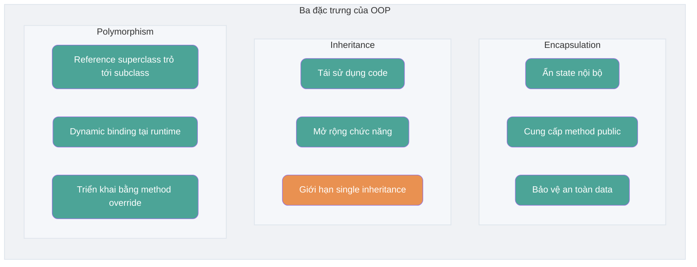
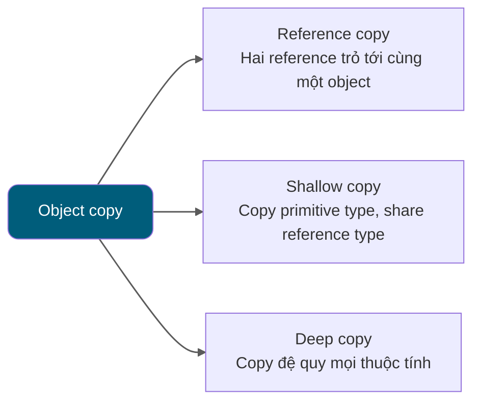

<!-- @include: @article-header.snippet.md -->

## Kiến thức cơ bản về lập trình hướng đối tượng

### ⭐️ Sự khác nhau giữa lập trình hướng đối tượng và lập trình hướng thủ tục

Lập trình hướng thủ tục (Procedural-Oriented Programming, POP) và lập trình hướng đối tượng (Object-Oriented Programming, OOP) là hai paradigm lập trình phổ biến. Điểm khác nhau chính giữa chúng nằm ở cách giải quyết vấn đề:

- **Lập trình hướng thủ tục (POP)**: Lập trình hướng thủ tục chia quá trình giải quyết vấn đề thành từng method, rồi giải quyết vấn đề thông qua việc thực thi từng method.
- **Lập trình hướng đối tượng (OOP)**: Lập trình hướng đối tượng trước hết trừu tượng hóa các object, sau đó giải quyết vấn đề bằng cách để object thực thi method.

So với POP, chương trình được phát triển bằng OOP thường có các ưu điểm sau:

- **Dễ bảo trì**: Nhờ cấu trúc và tính encapsulation tốt, chương trình OOP thường dễ bảo trì hơn.
- **Dễ tái sử dụng**: Thông qua inheritance và polymorphism, thiết kế OOP khiến code có tính tái sử dụng cao hơn, thuận tiện mở rộng chức năng.
- **Dễ mở rộng**: Thiết kế module hóa khiến việc mở rộng hệ thống trở nên dễ dàng và linh hoạt hơn.

Cách lập trình POP thường đơn giản và trực tiếp hơn, phù hợp để xử lý một số nhiệm vụ tương đối đơn giản.

Chênh lệch performance giữa POP và OOP chủ yếu phụ thuộc vào cơ chế runtime của chúng, chứ không chỉ phụ thuộc vào bản thân paradigm lập trình. Vì vậy, so sánh performance một cách đơn giản giữa hai bên là một ngộ nhận phổ biến (issue liên quan: [Lập trình hướng thủ tục: performance của lập trình hướng thủ tục cao hơn lập trình hướng đối tượng??](https://github.com/Snailclimb/JavaGuide/issues/431)).


Khi lựa chọn paradigm lập trình, performance không phải là yếu tố cân nhắc duy nhất. Khả năng bảo trì, khả năng mở rộng và hiệu suất phát triển cũng quan trọng không kém.

Các ngôn ngữ lập trình hiện đại về cơ bản đều hỗ trợ nhiều paradigm lập trình: vừa có thể dùng cho lập trình hướng thủ tục, vừa có thể dùng cho lập trình hướng đối tượng.

Dưới đây là ví dụ tính diện tích và chu vi hình tròn, lần lượt minh họa hai cách giải quyết khác nhau theo hướng đối tượng và hướng thủ tục.

**Hướng đối tượng**:

```java
public class Circle {
    // Định nghĩa bán kính hình tròn
    private double radius;

    // Constructor
    public Circle(double radius) {
        this.radius = radius;
    }

    // Tính diện tích hình tròn
    public double getArea() {
        return Math.PI * radius * radius;
    }

    // Tính chu vi hình tròn
    public double getPerimeter() {
        return 2 * Math.PI * radius;
    }

    public static void main(String[] args) {
        // Tạo hình tròn có bán kính 3
        Circle circle = new Circle(3.0);

        // In diện tích và chu vi hình tròn
        System.out.println("Diện tích hình tròn là: " + circle.getArea());
        System.out.println("Chu vi hình tròn là: " + circle.getPerimeter());
    }
}
```

Chúng ta định nghĩa một lớp `Circle` để biểu diễn hình tròn. Lớp này chứa thuộc tính bán kính hình tròn và các method tính diện tích, chu vi.

**Hướng thủ tục**:

```java
public class Main {
    public static void main(String[] args) {
        // Định nghĩa bán kính hình tròn
        double radius = 3.0;

        // Tính diện tích và chu vi hình tròn
        double area = Math.PI * radius * radius;
        double perimeter = 2 * Math.PI * radius;

        // In diện tích và chu vi hình tròn
        System.out.println("Diện tích hình tròn là: " + area);
        System.out.println("Chu vi hình tròn là: " + perimeter);
    }
}
```

Chúng ta trực tiếp định nghĩa bán kính hình tròn, rồi dùng bán kính đó để tính diện tích và chu vi hình tròn.

### Dùng operator nào để tạo một object? Instance của object khác gì với reference của object?

Có thể dùng operator `new` để tạo instance của object. Heap của JVM dùng để phân bổ class instance và array; reference value có thể được lưu trong local variable, object field, static field hoặc array element, không nhất thiết phải nằm trong stack.

- Một object reference có thể trỏ tới 0 hoặc 1 object (một sợi dây có thể không buộc quả bóng nào, cũng có thể buộc một quả bóng);
- Một object có thể được n reference trỏ tới (có thể dùng n sợi dây buộc một quả bóng).

### ⭐️ Sự khác nhau giữa object equality và reference equality

- Object equality thường được định nghĩa bởi `equals()`, dùng để so sánh logical state hoặc value theo quy ước của type.
- Reference equality được xác định bằng `==`, biểu thị hai reference có trỏ tới cùng một object hay không (hoặc cùng là `null`). Ngôn ngữ Java không expose hoặc so sánh physical memory address.

Ví dụ:

```java
String str1 = "hello";
String str2 = new String("hello");
String str3 = "hello";
// Dùng == để so sánh reference equality của string
System.out.println(str1 == str2);
System.out.println(str1 == str3);
// Dùng method equals để so sánh equality của string
System.out.println(str1.equals(str2));
System.out.println(str1.equals(str3));

```

Kết quả:

```plain
false
true
true
true
```

Có thể thấy từ kết quả output của code trên:

- `str1` và `str2` không bằng nhau, còn `str1` và `str3` bằng nhau. Vì operator `==` so sánh reference của string có bằng nhau hay không.
- Nội dung của `str1`, `str2`, `str3` đều bằng nhau. Vì method `equals` so sánh nội dung của string; dù object reference của các string này khác nhau, chỉ cần nội dung bằng nhau thì chúng được xem là bằng nhau.

### Nếu một class không khai báo constructor thì chương trình có thực thi đúng không?

Constructor là một method đặc biệt, chủ yếu dùng để hoàn tất việc khởi tạo object.

Nếu một class không khai báo constructor thì vẫn có thể thực thi! Vì ngay cả khi class không khai báo constructor, nó vẫn có constructor mặc định không tham số. Nếu tự thêm constructor cho class (dù có tham số hay không), Java sẽ không thêm constructor mặc định không tham số nữa.

Chúng ta vẫn vô thức sử dụng constructor. Đây cũng là lý do khi tạo object, phía sau phải thêm một cặp ngoặc (vì cần gọi constructor không tham số). Nếu overload constructor có tham số, hãy nhớ viết cả constructor không tham số (dù có dùng hay không), vì điều này giúp tránh bớt lỗi khi tạo object.

### Constructor có những đặc điểm nào? Có thể bị override không?

Constructor có các đặc điểm sau:

- **Tên giống tên class**: Tên của constructor phải hoàn toàn giống tên class.
- **Không có giá trị trả về**: Constructor không có return type và không thể khai báo bằng `void`.
- **Tự động thực thi**: Khi tạo object của class, constructor sẽ tự động thực thi mà không cần gọi rõ ràng.

Constructor **không thể bị override**, nhưng **có thể bị overload**. Vì vậy, một class có thể có nhiều constructor; các constructor này có thể có parameter list khác nhau để cung cấp những cách khởi tạo object khác nhau.

### ⭐️ Ba đặc trưng của lập trình hướng đối tượng

#### Encapsulation

Encapsulation là việc ẩn thông tin state của một object (tức thuộc tính) bên trong object, không cho object bên ngoài truy cập trực tiếp vào thông tin nội bộ của object. Tuy nhiên, có thể cung cấp một số method cho bên ngoài truy cập để thao tác với thuộc tính. Điều này giống như chúng ta không nhìn thấy thông tin linh kiện bên trong điều hòa treo trên tường (tức thuộc tính), nhưng có thể điều khiển điều hòa bằng remote (method). Nếu không muốn thuộc tính bị bên ngoài truy cập, chúng ta có thể không cung cấp method cho bên ngoài. Nhưng nếu một class không cung cấp method để bên ngoài truy cập thì class đó cũng không có nhiều ý nghĩa. Cũng giống như nếu không có remote điều hòa thì không thể điều khiển điều hòa làm lạnh; bản thân điều hòa cũng mất ý nghĩa (tất nhiên hiện nay còn nhiều cách khác, ví dụ này chỉ để minh họa).

```java
public class Student {
    private int id;//Đóng gói thuộc tính id
    private String name;//Đóng gói thuộc tính name

    //Method lấy id
    public int getId() {
        return id;
    }

    //Method thiết lập id
    public void setId(int id) {
        this.id = id;
    }

    //Method lấy name
    public String getName() {
        return name;
    }

    //Method thiết lập name
    public void setName(String name) {
        this.name = name;
    }
}
```

#### Inheritance

Các object thuộc type khác nhau thường có một số điểm chung. Ví dụ, các bạn học sinh Minh, Hồng, Lý đều có các đặc trưng của học sinh (lớp, mã số học sinh...). Đồng thời, mỗi object còn có các đặc trưng riêng khiến chúng khác nhau. Ví dụ Minh học toán khá giỏi, Hồng có tính cách được yêu mến; Lý có sức khỏe tốt. Inheritance là kỹ thuật dùng định nghĩa của một class đã tồn tại làm cơ sở để xây dựng class mới. Định nghĩa của class mới có thể bổ sung data hoặc chức năng mới, cũng có thể dùng chức năng của superclass, nhưng không thể lựa chọn một phần để inheritance từ superclass. Nhờ inheritance, có thể nhanh chóng tạo class mới, nâng cao khả năng tái sử dụng code, khả năng bảo trì chương trình, tiết kiệm nhiều thời gian tạo class mới và nâng cao hiệu suất phát triển.

**Hãy nhớ 3 điểm sau về inheritance:**

1. Object của subclass chứa instance state do superclass khai báo, nhưng member `private` của superclass không được subclass inheritance; subclass cũng không thể trực tiếp truy cập các member này.
2. Subclass có thể có thuộc tính và method riêng, tức subclass có thể mở rộng superclass.
3. Subclass có thể triển khai method của superclass theo cách riêng. (Sẽ giới thiệu sau).

#### Polymorphism

Polymorphism, đúng như tên gọi, biểu thị một object có nhiều state, được thể hiện cụ thể bằng việc reference của superclass trỏ tới instance của subclass.

**Đặc điểm của polymorphism:**

- Giữa object type và reference type có quan hệ inheritance (class)/implementation (interface);
- Method được gọi bởi variable thuộc reference type thực sự thuộc class nào phải đợi đến runtime mới xác định được;
- Polymorphism không thể gọi method “chỉ tồn tại trong subclass nhưng không tồn tại trong superclass”;
- Nếu subclass override method của superclass thì method thực sự được thực thi là method đã override của subclass; nếu subclass không override method của superclass thì thực thi method của superclass.



### Interface và abstract class có điểm chung và khác nhau nào?

#### Điểm chung của interface và abstract class

- **Instantiation**: Interface và abstract class đều không thể được instantiate trực tiếp, chỉ có thể tạo object cụ thể sau khi được implement (interface) hoặc inheritance (abstract class).
- **Abstract method**: Interface và abstract class đều có thể chứa abstract method. Abstract method không có method body, bắt buộc phải được triển khai trong subclass hoặc implementation class.

#### Điểm khác nhau giữa interface và abstract class

- **Mục đích thiết kế**: Interface chủ yếu dùng để ràng buộc behavior của class; khi implement một interface, bạn có behavior tương ứng. Abstract class chủ yếu dùng để tái sử dụng code, nhấn mạnh quan hệ thuộc về.
- **Inheritance và implementation**: Một class chỉ có thể inheritance một class (bao gồm abstract class), vì Java không hỗ trợ multiple inheritance. Nhưng một class có thể implement nhiều interface, và một interface cũng có thể inheritance nhiều interface khác.
- **Member variable**: Member variable trong interface chỉ có thể có type `public static final`, không thể sửa đổi và bắt buộc phải có giá trị khởi tạo. Member variable của abstract class có thể có bất kỳ modifier nào (`private`, `protected`, `public`), có thể được định nghĩa lại hoặc gán giá trị trong subclass.
- **Method**:
  - Trước Java 8, method trong interface mặc định là `public abstract`, tức chỉ có method declaration. Từ Java 8, có thể định nghĩa method `default` và method `static` trong interface. Từ Java 9, interface có thể chứa method `private`.
  - Abstract class có thể chứa abstract method và non-abstract method. Abstract method không có method body, bắt buộc phải được triển khai trong subclass. Non-abstract method có implementation cụ thể, có thể dùng trực tiếp trong abstract class hoặc override trong subclass.

Java 8 đưa method `default` và method `static` vào interface, Java 9 lại cho phép interface khai báo method `private`. Các method này khiến việc sử dụng interface linh hoạt hơn.

Method `default` được đưa vào từ Java 8 dùng để cung cấp implementation mặc định cho method của interface và có thể bị override trong implementation class. Nhờ đó, có thể thêm chức năng mới vào interface hiện có mà không cần sửa implementation class, qua đó tăng khả năng mở rộng và backward compatibility của interface.

```java
public interface MyInterface {
    default void defaultMethod() {
        System.out.println("This is a default method.");
    }
}
```

Method `static` được đưa vào từ Java 8 không thể bị override trong implementation class, chỉ có thể gọi trực tiếp qua tên interface (`MyInterface.staticMethod()`), tương tự static method trong class. Method `static` thường dùng để định nghĩa một số utility method chung, liên quan đến interface và thường ít được sử dụng.

```java
public interface MyInterface {
    static void staticMethod() {
        System.out.println("This is a static method in the interface.");
    }
}
```

Java 9 cho phép sử dụng method `private` trong interface. Method `private` có thể dùng để chia sẻ code bên trong interface mà không expose ra bên ngoài.

```java
public interface MyInterface {
    // Method default
    default void defaultMethod() {
        commonMethod();
    }

    // Method static
    static void staticMethod() {
        commonMethod();
    }

    // Private static method, có thể được gọi bởi method static và default
    private static void commonMethod() {
        System.out.println("This is a private method used internally.");
    }

      // Private instance method, chỉ có thể được gọi bởi method default.
    private void instanceCommonMethod() {
        System.out.println("This is a private instance method used internally.");
    }
}
```

### Bạn có biết sự khác nhau giữa deep copy và shallow copy không? Reference copy là gì?



Về sự khác nhau giữa deep copy và shallow copy, trước hết tôi đưa ra kết luận:

- **Shallow copy**: Shallow copy tạo một object mới trên heap (đây là một điểm khác với reference copy). Tuy nhiên, nếu thuộc tính bên trong object gốc là reference type thì shallow copy sẽ trực tiếp copy reference của object bên trong. Nói cách khác, object copy và object gốc dùng chung cùng một object bên trong.
- **Deep copy**: Deep copy copy hoàn toàn toàn bộ object, bao gồm cả các object bên trong mà object đó chứa.

Nếu chưa hiểu hoàn toàn kết luận trên cũng không sao, hãy xem một ví dụ cụ thể!

#### Shallow copy

Code ví dụ về shallow copy như sau. Ở đây chúng ta implement interface `Cloneable` và override method `clone()`.

Implementation của method `clone()` rất đơn giản, chỉ trực tiếp gọi method `clone()` của superclass `Object`.

```java
public class Address implements Cloneable{
    private String name;
    // Lược bỏ constructor, method Getter&Setter
    @Override
    public Address clone() {
        try {
            return (Address) super.clone();
        } catch (CloneNotSupportedException e) {
            throw new AssertionError();
        }
    }
}

public class Person implements Cloneable {
    private Address address;
    // Lược bỏ constructor, method Getter&Setter
    @Override
    public Person clone() {
        try {
            Person person = (Person) super.clone();
            return person;
        } catch (CloneNotSupportedException e) {
            throw new AssertionError();
        }
    }
}
```

Test:

```java
Person person1 = new Person(new Address("Wuhan"));
Person person1Copy = person1.clone();
// true
System.out.println(person1.getAddress() == person1Copy.getAddress());
```

Từ output có thể thấy object clone của `person1` và `person1` vẫn sử dụng cùng một object `Address`.

#### Deep copy

Ở đây chúng ta chỉ cần sửa method `clone()` của class `Person`, đồng thời copy cả object `Address` bên trong object `Person`.

```java
@Override
public Person clone() {
    try {
        Person person = (Person) super.clone();
        person.setAddress(person.getAddress().clone());
        return person;
    } catch (CloneNotSupportedException e) {
        throw new AssertionError();
    }
}
```

Test:

```java
Person person1 = new Person(new Address("Wuhan"));
Person person1Copy = person1.clone();
// false
System.out.println(person1.getAddress() == person1Copy.getAddress());
```

Từ output có thể thấy rõ object clone của `person1` và object `Address` mà `person1` chứa đã là hai object khác nhau.

**Vậy reference copy là gì?** Nói đơn giản, reference copy là hai reference khác nhau cùng trỏ tới một object.

Tôi đã vẽ riêng một hình để mô tả shallow copy, deep copy và reference copy:


## ⭐️ Object

### Các method thường gặp của class Object là gì?

Class Object là một class đặc biệt, là superclass của mọi class, chủ yếu cung cấp các method sau. Cần lưu ý rằng `finalize()` đã deprecated từ JDK 9 và được đánh dấu sẽ bị loại bỏ trong JDK 18; không nên dùng trong code mới:

```java
/**
 * Native method, dùng để trả về Class object của object hiện tại tại runtime, được sửa bằng keyword final nên subclass không được override.
 */
public final native Class<?> getClass()
/**
 * Native method, dùng để trả về hash code của object, chủ yếu được sử dụng trong hash table, chẳng hạn HashMap trong JDK.
 */
public native int hashCode()
/**
 * Dùng để so sánh 2 reference có trỏ tới cùng một object hay không. Class String đã override method này để so sánh value của string có bằng nhau hay không.
 */
public boolean equals(Object obj)
/**
 * Native method, dùng để tạo và trả về một bản copy của object hiện tại.
 */
protected native Object clone() throws CloneNotSupportedException
/**
 * Trả về một string biểu diễn hash code dạng hexadecimal của instance tên class. Khuyến nghị mọi subclass của Object nên override method này.
 */
public String toString()
/**
 * Native method và không thể override. Đánh thức một thread đang wait trên monitor của object này (monitor về bản chất là khái niệm lock). Nếu có nhiều thread đang wait thì chỉ đánh thức ngẫu nhiên một thread.
 */
public final native void notify()
/**
 * Native method và không thể override. Giống notify, điểm khác duy nhất là đánh thức tất cả thread đang wait trên monitor của object này thay vì một thread.
 */
public final native void notifyAll()
/**
 * Native method và không thể override. Tạm dừng thực thi của thread. Lưu ý: method sleep không release lock, còn method wait thì release lock; timeout là thời gian chờ.
 */
public final native void wait(long timeout) throws InterruptedException
/**
 * Có thêm tham số nanos, biểu thị khoảng thời gian bổ sung (đơn vị nanosecond, phạm vi 0-999999). Vì vậy thời gian timeout còn phải cộng thêm nanos nanosecond.
 */
public final void wait(long timeout, int nanos) throws InterruptedException
/**
 * Giống 2 method wait trước đó, chỉ khác là method này chờ liên tục, không có khái niệm timeout.
 */
public final void wait() throws InterruptedException
/**
 * Thao tác được kích hoạt khi instance bị garbage collector thu hồi.
 */
protected void finalize() throws Throwable { }
```

### Sự khác nhau giữa == và equals()

Tác dụng của **`==`** khác nhau đối với primitive type và reference type:

- Với primitive data type, `==` so sánh value.
- Với reference data type, `==` so sánh reference có trỏ tới cùng một object hay không (hoặc cùng là `null`), không so sánh physical memory address.

> Với `==`, bất kể so sánh primitive type hay reference type, thứ được so sánh đều là value của operand; reference value mô tả object mà nó trỏ tới, nhưng ngôn ngữ Java không định nghĩa nó là physical memory address có thể quan sát.

**`equals()`** không thể dùng để phán đoán variable của primitive data type, chỉ dùng để phán đoán hai object có bằng nhau hay không. Method `equals()` tồn tại trong class `Object`, mà class `Object` là superclass trực tiếp hoặc gián tiếp của mọi class, vì vậy mọi class đều có method `equals()`.

Method `equals()` của class `Object`:

```java
public boolean equals(Object obj) {
     return (this == obj);
}
```

Method `equals()` có hai trường hợp sử dụng:

- **Class không override method `equals()`**: Khi dùng `equals()` để so sánh hai object của class đó, kết quả tương đương dùng “==” để so sánh hai object; mặc định sử dụng method `equals()` của class `Object`.
- **Class override method `equals()`**: Thông thường chúng ta override method `equals()` để so sánh các thuộc tính trong hai object có bằng nhau hay không; nếu thuộc tính bằng nhau thì trả về true (tức xem hai object này là bằng nhau).

Ví dụ (chỉ để minh họa. Thực tế, nếu viết như bên dưới thì các IDE thông minh như IDEA sẽ nhắc bạn thay `==` bằng `equals()`):

```java
String a = new String("ab"); // a là một reference
String b = new String("ab"); // b là một reference khác, nội dung object giống nhau
String aa = "ab"; // Đặt trong string constant pool
String bb = "ab"; // Tìm trong string constant pool
System.out.println(aa == bb);// true
System.out.println(a == b);// false
System.out.println(a.equals(b));// true
System.out.println(42 == 42.0);// true
```

Method `equals` trong `String` đã được override, vì method `equals` của `Object` xác định hai reference có trỏ tới cùng một object hay không, còn method `equals` của `String` so sánh value của string.

Khi tạo object type `String` bằng string literal (ví dụ `String aa = "ab"`), VM sẽ tìm trong string constant pool xem đã có object có value giống value sắp tạo hay chưa. Nếu có thì gán nó cho reference hiện tại; nếu không thì tạo một object `String` trong string constant pool rồi gán cho reference hiện tại. Nhưng khi dùng keyword `new` để tạo object (ví dụ `String a = new String("ab")`), VM luôn **tạo một object mới** trong heap và dùng value trong string constant pool (nếu chưa có thì trước tiên tạo string object `"ab"` trong string constant pool) để khởi tạo, sau đó gán cho reference hiện tại.

Method `equals()` của class `String`:

```java
public boolean equals(Object anObject) {
    if (this == anObject) {
        return true;
    }
    if (anObject instanceof String) {
        String anotherString = (String)anObject;
        int n = value.length;
        if (n == anotherString.value.length) {
            char v1[] = value;
            char v2[] = anotherString.value;
            int i = 0;
            while (n-- != 0) {
                if (v1[i] != v2[i])
                    return false;
                i++;
            }
            return true;
        }
    }
    return false;
}
```

### hashCode() dùng để làm gì?

Tác dụng của `hashCode()` là lấy hash code (`int` integer), còn gọi là mã hash. Hash code này dùng để xác định vị trí index của object trong hash table.


`hashCode()` được định nghĩa trong class `Object` của JDK, nghĩa là mọi class trong Java đều chứa function `hashCode()`. Ngoài ra cần lưu ý method `hashCode()` của `Object` là native method, tức được triển khai bằng C hoặc C++.

> ⚠️ Lưu ý: Trong **Oracle OpenJDK8**, method này mặc định được triển khai bằng “trạng thái cục bộ của thread để tạo số ngẫu nhiên Marsaglia's xor-shift”, không phải “address” hoặc “chuyển đổi từ address”; các JDK/VM khác nhau có thể khác nhau. Trong **Oracle OpenJDK8** có sáu cách tạo (cách thứ năm là trả về address), bật cách thứ năm bằng VM parameter: -XX:hashCode=4. Tham khảo source code:
>
> - <https://hg.openjdk.org/jdk8u/jdk8u/hotspot/file/87ee5ee27509/src/share/vm/runtime/globals.hpp> (dòng 1127)
> - <https://hg.openjdk.org/jdk8u/jdk8u/hotspot/file/87ee5ee27509/src/share/vm/runtime/synchronizer.cpp> (bắt đầu từ dòng 537)

```java
public native int hashCode();
```

Hash table lưu trữ key-value (key-value pair), đặc điểm là: **có thể nhanh chóng tìm ra “value” tương ứng dựa trên “key”. Trong đó có sử dụng hash code! (Có thể nhanh chóng tìm được object cần thiết)**

### Vì sao cần có hashCode?

Hãy lấy ví dụ “HashSet kiểm tra duplicate như thế nào” để giải thích vì sao cần có hashCode.

Khi thêm object vào HashSet, HashSet trước tiên gọi method `hashCode()` của object để lấy một “hash value”, rồi dùng hash function nội bộ để chuyển đổi đơn giản thêm một lần nữa đối với hash value này (chẳng hạn lấy phần dư), quyết định data này nên được đặt vào bucket nào của array bên dưới (bucket tương ứng với một vị trí nào đó trong array bên dưới):

1. Nếu bucket đó hiện đang rỗng thì trực tiếp insert node tương ứng với object vào bucket.
2. Nếu bucket đó đã có element khác, HashSet sẽ lần lượt so sánh trong linked list hoặc red-black tree tương ứng với bucket:
   - Với node có **hash value khác nhau**, trực tiếp bỏ qua;
   - Với node có **hash value giống nhau**, tiếp tục gọi method equals() để kiểm tra hai object có “bằng nhau” hay không:
     – Nếu `equals()` trả về true, nghĩa là collection đã có element tương đương với object hiện tại, `HashSet` sẽ không thêm nó lần nữa;
     – Nếu trả về false thì xem là element mới, thêm object đó dưới dạng node mới vào linked list hoặc red-black tree của **cùng bucket**.

Bằng cách trước tiên dùng `hashCode()` thu hẹp phạm vi ứng viên vào cùng một bucket, sau đó gọi `equals()` trên số lượng nhỏ element trong bucket để phán đoán chính xác, `HashSet` giảm đáng kể số lần gọi `equals()`, từ đó nâng cao performance thực thi của việc tìm kiếm và insert.

**Vậy tại sao JDK vẫn cung cấp đồng thời hai method này?**

Vì trong một số container (chẳng hạn `HashMap`, `HashSet`), sau khi có `hashCode()`, hiệu suất phán đoán element có nằm trong container tương ứng sẽ cao hơn (tham khảo quá trình thêm element vào `HashSet`).

Ở trên chúng ta cũng đã đề cập quá trình thêm element vào `HashSet`. Nếu khi so sánh, `HashSet` gặp nhiều object có cùng `hashCode`, nó sẽ tiếp tục dùng `equals()` để phán đoán có thực sự giống nhau hay không. Nói cách khác, `hashCode` giúp chúng ta thu hẹp đáng kể chi phí tìm kiếm.

**Vậy tại sao không chỉ cung cấp method `hashCode()`?**

Vì hai object có `hashCode` bằng nhau không có nghĩa hai object bằng nhau.

**Vậy tại sao hai object có cùng `hashCode` nhưng vẫn không nhất thiết bằng nhau?**

Vì hash algorithm mà `hashCode()` sử dụng có thể tình cờ khiến nhiều object trả về cùng một hash value. Hash algorithm càng kém thì càng dễ collision, nhưng điều này cũng liên quan đến đặc tính phân bố của miền value (hash collision nghĩa là các object khác nhau nhận cùng `hashCode`).

Tóm lại:

- Nếu hai object có `hashCode` bằng nhau thì hai object đó chưa chắc bằng nhau (hash collision).
- Chỉ khi hai object có `hashCode` bằng nhau và method `equals()` cũng trả về `true`, chúng ta mới xem hai object đó là bằng nhau.
- Nếu hai object có `hashCode` khác nhau thì có thể trực tiếp xem hai object đó không bằng nhau.

Sau khi đọc phần giới thiệu trước đây về `hashCode()` và `equals()`, chắc hẳn câu hỏi tiếp theo không thể làm khó bạn nữa.

### Vì sao khi override equals() bắt buộc phải override method hashCode()?

Vì `hashCode` của hai object bằng nhau bắt buộc phải bằng nhau. Nói cách khác, nếu method `equals` phán đoán hai object bằng nhau thì `hashCode` của hai object đó cũng phải bằng nhau.

Nếu khi override `equals()` mà không override method `hashCode()` thì có thể dẫn tới việc hai object được method `equals` phán đoán là bằng nhau nhưng `hashCode` lại khác nhau.

**Suy nghĩ**: Nếu override `equals()` mà không override method `hashCode()`, khi dùng `HashMap` có thể xảy ra vấn đề gì?

**Tóm tắt**:

- Nếu method `equals` phán đoán hai object bằng nhau thì `hashCode` của hai object đó cũng phải bằng nhau.
- Hai object có cùng `hashCode` chưa chắc bằng nhau (hash collision).

Có thể xem thêm nội dung về `hashCode()` và `equals()` tại: [Giải đáp một số vấn đề về Java hashCode() và equals()](https://www.cnblogs.com/skywang12345/p/3324958.html)

## String

### ⭐️ Sự khác nhau giữa String, StringBuffer và StringBuilder?

**Tính mutable**

`String` là immutable (sẽ phân tích chi tiết ở phần sau). Mỗi lần sửa đều tạo object mới và trỏ reference tới instance mới, còn `StringBuffer` và `StringBuilder` đều mutable. Khi sửa string, chúng không tạo object mới mà thao tác trực tiếp trên character array ban đầu.

`StringBuilder` và `StringBuffer` đều inheritance từ class `AbstractStringBuilder`. `AbstractStringBuilder` cũng dùng character array để lưu string, nhưng không dùng keyword `final` và `private` để modifier; quan trọng nhất là class `AbstractStringBuilder` còn cung cấp nhiều method sửa string, chẳng hạn method `append`.

```java
abstract class AbstractStringBuilder implements Appendable, CharSequence {
    char[] value;
    public AbstractStringBuilder append(String str) {
        if (str == null)
            return appendNull();
        int len = str.length();
        ensureCapacityInternal(count + len);
        str.getChars(0, len, value, count);
        count += len;
        return this;
    }
    //...
}
```

**Tính thread-safe**

Object trong `String` là immutable, cũng có thể hiểu là constant, nên thread-safe. `AbstractStringBuilder` là superclass chung của `StringBuilder` và `StringBuffer`, định nghĩa một số thao tác cơ bản trên string như `expandCapacity`, `append`, `insert`, `indexOf`. `StringBuffer` thêm synchronized lock cho method hoặc method được gọi, nên thread-safe. `StringBuilder` không thêm synchronized lock cho method, nên không thread-safe.


**Performance**

Chênh lệch performance giữa hai bên chủ yếu đến từ cơ chế thread-safe:

- Method của `StringBuffer` thường là synchronized (thread-safe), nên có thêm một phần overhead performance;
- `StringBuilder` không có overhead synchronized (không thread-safe), nên trong single-thread scenario thường có performance tốt hơn.
  Trong cùng điều kiện, dùng `StringBuilder` so với `StringBuffer` chỉ có thể đạt mức tăng performance khoảng 10%~15%, nhưng phải chấp nhận rủi ro không an toàn trong môi trường multi-thread.
  Ngoài ra, chênh lệch performance cụ thể không cố định. Trong JVM hiện đại, nhờ lock optimization (chẳng hạn lock elimination), chênh lệch performance giữa hai bên trong một số scenario có thể khá nhỏ.

**Tóm tắt cách sử dụng ba class:**

- Thao tác với lượng data nhỏ: dùng `String`
- Thao tác lượng data lớn trong string buffer ở single-thread: dùng `StringBuilder`
- Thao tác lượng data lớn trong string buffer ở multi-thread: dùng `StringBuffer`

### ⭐️ Vì sao String là immutable?

Class `String` dùng keyword `final` để modifier character array lưu string, ~~vì vậy object `String` là immutable.~~

```java
public final class String implements java.io.Serializable, Comparable<String>, CharSequence {
    private final char value[];
  //...
}
```

> 🐛 Đính chính: Chúng ta biết class được modifier bằng keyword `final` không thể inheritance, method được modifier bằng `final` không thể override, variable được modifier bằng `final` nếu là primitive data type thì value không thể thay đổi, nếu là reference type thì không thể trỏ sang object khác. Vì vậy, việc dùng keyword `final` để modifier array lưu string không phải nguyên nhân cốt lõi khiến `String` immutable, bởi string mà array này lưu là mutable (trường hợp variable reference type được modifier bằng `final`).
>
> `String` thực sự immutable vì các nguyên nhân sau:
>
> 1. Array lưu string được modifier bằng `final` và là private, đồng thời class `String` không cung cấp/expose method sửa string này.
> 2. Class `String` được modifier bằng `final` nên không thể inheritance, qua đó tránh subclass phá vỡ tính immutable của `String`.
>
> Đọc thêm: [Hiểu thế nào về tính immutable của value type String? - Câu hỏi Zhihu](https://www.zhihu.com/question/20618891/answer/114125846)
>
> Bổ sung (từ [issue 675](https://github.com/Snailclimb/JavaGuide/issues/675)): Sau Java 9, implementation của `String`, `StringBuilder` và `StringBuffer` chuyển sang dùng array `byte` để lưu string.
>
> ```java
> public final class String implements java.io.Serializable,Comparable<String>, CharSequence {
>     // Annotation @Stable biểu thị variable nhiều nhất chỉ bị sửa một lần, gọi là “stable”.
>     @Stable
>     private final byte[] value;
> }
>
> abstract class AbstractStringBuilder implements Appendable, CharSequence {
>     byte[] value;
>
> }
> ```

**Vì sao Java 9 đổi implementation bên trong của `String` từ `char[]` thành `byte[]`?**

String phiên bản mới hỗ trợ hai scheme encoding: Latin-1 và UTF-16. Nếu tất cả character trong string có thể biểu diễn bằng Latin-1 thì dùng Latin-1; nếu không thì dùng UTF-16. Chữ Hán không nằm trong phạm vi character của Latin-1. Ở scheme Latin-1, nội dung mỗi character dùng một byte để lưu, so với `char[]` trước đây có thể tiết kiệm một nửa không gian dữ liệu character.

JDK chính thức cho biết phần lớn string object chỉ chứa các character có thể biểu diễn bằng Latin-1.


Nếu string chứa character không thể biểu diễn bằng Latin-1 (ví dụ chữ Hán), bên trong sẽ dùng UTF-16, mỗi code unit dùng hai byte.

Đây là phần giới thiệu chính thức: <https://openjdk.java.net/jeps/254>.

### ⭐️ Nối string bằng “+” hay StringBuilder?

Java không hỗ trợ user-defined operator overload, nhưng language specification định nghĩa riêng operator `+` và `+=` cho string concatenation.

```java
String str1 = "he";
String str2 = "llo";
String str3 = "world";
String str4 = str1 + str2 + str3;
```

Bytecode tương ứng với code trên như sau:


Với bytecode JDK 8 được hiển thị ở đây, phép nối string bằng “+” được `javac` chuyển thành lời gọi `StringBuilder.append()`. Từ JDK 9, `javac` mặc định chuyển sang dùng `invokedynamic` và `StringConcatFactory`, vì vậy không thể xem `StringBuilder` là implementation bắt buộc ở mọi version.

Tuy nhiên, nếu dùng “+” để nối string trong loop thì có một thiếu sót khá rõ: **compiler sẽ không tạo một `StringBuilder` duy nhất để tái sử dụng, dẫn đến tạo quá nhiều object `StringBuilder`**.

```java
String[] arr = {"he", "llo", "world"};
String s = "";
for (int i = 0; i < arr.length; i++) {
    s += arr[i];
}
System.out.println(s);
```

Object `StringBuilder` được tạo bên trong loop, nghĩa là mỗi lần loop sẽ tạo một object `StringBuilder`.


Nếu trực tiếp dùng object `StringBuilder` để nối string thì sẽ không gặp vấn đề này.

```java
String[] arr = {"he", "llo", "world"};
StringBuilder s = new StringBuilder();
for (String value : arr) {
    s.append(value);
}
System.out.println(s);
```


Nếu dùng IDEA, cơ chế code inspection tích hợp trong IDEA cũng sẽ nhắc bạn sửa code.

Trong JDK 9, phép cộng string “+” được đổi sang dùng dynamic method `makeConcatWithConstants()` để triển khai. Bằng cách phân bổ space trước, nó giảm một phần việc tạo temporary object. Tuy nhiên, optimization này chủ yếu nhắm tới phép nối string đơn giản, chẳng hạn `a+b+c`. Với lượng lớn thao tác nối trong loop, memory vẫn được phân bổ dynamic từng lần (tương tự khái niệm append từng cặp), không hiệu quả bằng việc dùng `StringBuilder` thủ công. Cải tiến này được đề xuất trong [JEP 280](https://openjdk.org/jeps/280) của JDK9. Để tìm hiểu chi tiết phần cải tiến này, nên đọc bài viết: [Vẫn dùng StringBuilder một cách máy móc? Hãy ôn lại phép nối string](https://juejin.cn/post/7182872058743750715) và tham khảo [issue#2442](https://github.com/Snailclimb/JavaGuide/issues/2442).

### String#equals() khác gì với Object#equals()?

Method `equals` trong `String` đã được override, so sánh value của String có bằng nhau hay không. Method `equals` của `Object` xác định hai reference có trỏ tới cùng một object hay không.

### ⭐️ Bạn có biết tác dụng của string constant pool không?

**String constant pool** là một vùng do JVM dành riêng cho string (class String) để nâng cao performance và giảm memory consumption, mục đích chính là tránh tạo string trùng lặp.

```java
// 1.Tìm string object "ab" trong string constant pool, nếu không có thì tạo "ab" và đưa vào string constant pool
// 2.Gán reference của string object "ab" cho aa
String aa = "ab";
// Trực tiếp trả về string object "ab" trong string constant pool và gán cho reference bb
String bb = "ab";
System.out.println(aa==bb); // true
```

Có thể xem thêm phần giới thiệu về string constant pool trong bài [Giải thích chi tiết về memory area của Java](https://javaguide.cn/java/jvm/memory-area.html).

### Câu `String s1 = new String("abc");` tạo ra bao nhiêu string object?

Đáp án trước: sẽ tạo 1 hoặc 2 string object.

1. `"abc"` không tồn tại trong string constant pool: sẽ tạo 2 string object. Một object trong string constant pool, được trigger tạo bởi instruction `ldc`. Một object trong heap, được tạo bởi `new String()` và khởi tạo bằng `"abc"` trong constant pool.
2. `"abc"` đã tồn tại trong string constant pool: sẽ tạo 1 string object. Object này nằm trong heap, được tạo bởi `new String()` và khởi tạo bằng `"abc"` trong constant pool.

Bắt đầu phân tích chi tiết.

Bắt đầu phân tích chi tiết.

1. Nếu string object `“abc”` không tồn tại trong string constant pool thì trước hết tạo string object `"abc"` trong string constant pool, sau đó tạo thêm một string object `"abc"` trong heap.

Code ví dụ (JDK 1.8):

```java
String s1 = new String("abc");
```

Bytecode tương ứng:

```java
// Phân bổ một String object chưa được initialize trong heap.
// #2 là symbol reference trong constant pool, trỏ tới class java/lang/String.
// Trong giai đoạn resolve của class loading, symbol reference này được resolve thành direct reference, tức trỏ tới class java/lang/String thực tế.
0 new #2 <java/lang/String>
// Copy reference của String object trên đỉnh stack để chuẩn bị cho lời gọi constructor tiếp theo.
// Lúc này operand stack có hai reference object giống nhau: một dùng để truyền cho constructor, một dùng để giữ reference tới object mới, sau đó lưu vào local variable table.
3 dup
// JVM trước tiên kiểm tra string constant pool có tồn tại "abc" hay không.
// Nếu "abc" đã tồn tại trong constant pool thì trực tiếp trả về reference của string đó;
// Nếu "abc" chưa tồn tại trong constant pool thì JVM tạo string literal đó trong constant pool và trả về reference của nó.
// Reference này được push lên operand stack để làm tham số cho constructor.
4 ldc #3 <abc>
// Gọi constructor, dùng "abc" load từ constant pool để initialize String object trong heap
// String object mới sẽ chứa nội dung giống "abc" trong constant pool, nhưng là object độc lập được lưu trong heap.
6 invokespecial #4 <java/lang/String.<init> : (Ljava/lang/String;)V>
// Lưu reference tới String object trong heap vào local variable table
9 astore_1
// Return, kết thúc method
10 return
```

Instruction `ldc (load constant)` quả thực load nhiều loại constant từ constant pool, bao gồm string constant, integer constant, floating-point constant, thậm chí class reference. Với string constant, behavior của instruction `ldc` như sau:

1. **Load string từ constant pool**: `ldc` trước tiên kiểm tra string constant pool đã có string object có cùng nội dung hay chưa.
2. **Tái sử dụng string object có sẵn**: Nếu string constant pool đã có string object có cùng nội dung, `ldc` load reference tới object đó lên operand stack.
3. **Nếu không có thì tạo object mới và thêm vào constant pool**: Nếu string constant pool không có string object có cùng nội dung, JVM tạo string object mới trong constant pool và load reference của nó lên operand stack.

4. Nếu string object `"abc"` đã tồn tại trong string constant pool thì chỉ tạo 1 string object `"abc"` trong heap.

Code ví dụ (JDK 1.8):

```java
// String object "abc" đã tồn tại trong string constant pool
String s1 = "abc";
// Đoạn code sau chỉ tạo 1 string object "abc" trong heap
String s2 = new String("abc");
```

Bytecode tương ứng:

```java
0 ldc #2 <abc>
2 astore_1
3 new #3 <java/lang/String>
6 dup
7 ldc #2 <abc>
9 invokespecial #4 <java/lang/String.<init> : (Ljava/lang/String;)V>
12 astore_2
13 return
```

Ở đây không chú thích chi tiết bytecode trên nữa. Lệnh `ldc` tại vị trí 7 không tạo string object mới `"abc"` trong heap, vì tại vị trí 0 đã thực thi lệnh `ldc` một lần và đã tạo string object `"abc"` trong heap. Lệnh `ldc` tại vị trí 7 sẽ trực tiếp trả về reference tương ứng với string object `"abc"` trong string constant pool.

### Method String#intern có tác dụng gì?

`String.intern()` là một method `native` (native method), dùng để xử lý reference của string object trong string constant pool. Quy trình hoạt động có thể tóm tắt thành hai trường hợp:

1. **String object có cùng nội dung đã tồn tại trong constant pool**: Nếu string constant pool đã có một object `String` có nội dung giống string gọi method `intern()`, method `intern()` trực tiếp trả về reference của object đó trong constant pool.
2. **String object có cùng nội dung chưa tồn tại trong constant pool**: Nếu string constant pool chưa có object có nội dung giống string gọi method `intern()`, method `intern()` thêm reference của string object hiện tại vào string constant pool rồi trả về reference đó.

Tóm tắt:

- Tác dụng chính của method `intern()` là bảo đảm tính duy nhất của string reference trong constant pool.
- Khi gọi `intern()`, nếu string có cùng nội dung đã tồn tại trong constant pool thì trả về reference của object đã có trong constant pool; nếu không thì thêm string đó vào constant pool rồi trả về reference của nó.

Code ví dụ (JDK 1.8):

```java
// s1 trỏ tới object "Java" trong string constant pool
String s1 = "Java";
// s2 cũng trỏ tới object "Java" trong string constant pool, cùng là một object với s1
String s2 = s1.intern();
// Tạo một object "Java" mới trong heap, s3 trỏ tới object đó
String s3 = new String("Java");
// s4 trỏ tới object "Java" trong string constant pool, cùng là một object với s1
String s4 = s3.intern();
// s1 và s2 trỏ tới cùng một object trong constant pool
System.out.println(s1 == s2); // true
// s3 trỏ tới object trong heap, s4 trỏ tới object trong constant pool nên khác nhau
System.out.println(s3 == s4); // false
// s1 và s4 đều trỏ tới cùng một object trong constant pool
System.out.println(s1 == s4); // true
```

### Điều gì xảy ra khi thực hiện phép “+” giữa variable và constant type String?

Trước tiên hãy xem trường hợp nối string không có keyword `final` (JDK1.8):

```java
String str1 = "str";
String str2 = "ing";
String str3 = "str" + "ing";
String str4 = str1 + str2;
String str5 = "string";
System.out.println(str3 == str4);//false
System.out.println(str3 == str5);//true
System.out.println(str4 == str5);//false
```

> **Lưu ý**: Để so sánh value của String có bằng nhau hay không, có thể dùng method `equals()`. Method `equals` trong `String` đã được override. Method `equals` của `Object` xác định hai reference có trỏ tới cùng một object hay không, còn method `equals` của `String` so sánh value của string có bằng nhau hay không. Nếu dùng `==` để so sánh hai string có bằng nhau hay không, IDEA vẫn nhắc bạn thay bằng method `equals()`.


**Với string expression có value xác định được tại compile time, compiler sẽ constant folding và ghi kết quả dưới dạng string constant vào constant pool của class file; string object tương ứng được tạo tại runtime và intern vào string pool.**

Trong quá trình compile, compiler Javac (sau đây gọi chung là compiler) thực hiện một optimization code gọi là **Constant Folding**. Sách 《Thấu hiểu sâu JVM》 cũng có giới thiệu:


Constant folding tính value của constant expression rồi nhúng value đó như một constant vào code cuối cùng được tạo ra. Đây là một trong số rất ít biện pháp optimization mà compiler Javac thực hiện trên source code (hầu hết code optimization đều được thực hiện trong JIT compiler).

Với `String str3 = "str" + "ing";`, compiler sẽ optimization thành `String str3 = "string";`.

Không phải mọi constant đều được constant folding, chỉ constant mà compiler có thể xác định value tại compile time mới được:

- Primitive data type (`byte`, `boolean`, `short`, `char`, `int`, `float`, `long`, `double`) và string constant.
- Primitive data type và string variable được modifier bằng `final`.
- String tạo ra bằng phép nối “+”, phép tính số học giữa primitive data type (cộng trừ nhân chia), phép tính bit giữa primitive data type (<<, \>>, \>>>)

**Value của reference không thể xác định tại compile time, nên compiler không thể optimization nó.**

Cách nối string giữa object reference và “+” thực tế được triển khai bằng cách gọi method `append()` của `StringBuilder`; sau khi nối xong gọi `toString()` để nhận một object `String`.

```java
String str4 = new StringBuilder().append(str1).append(str2).toString();
```

Khi viết code hằng ngày, cố gắng tránh nối nhiều string object, vì như vậy sẽ tạo object mới. Nếu cần thay đổi string, có thể dùng `StringBuilder` hoặc `StringBuffer`.

Tuy nhiên, sau khi khai báo string bằng keyword `final`, có thể khiến compiler xử lý nó như constant.

Code ví dụ:

```java
final String str1 = "str";
final String str2 = "ing";
// Hai expression dưới đây thực chất tương đương
String c = "str" + "ing";// Object trong constant pool
String d = str1 + str2; // Object trong constant pool
System.out.println(c == d);// true
```

Sau khi được modifier bằng keyword `final`, `String` sẽ được compiler xử lý như constant. Compiler có thể xác định value của nó tại compile time, hiệu quả tương đương truy cập constant.

Nếu compiler chỉ biết value chính xác của nó tại runtime thì không thể optimization.

Code ví dụ (`str2` chỉ xác định được value tại runtime):

```java
final String str1 = "str";
final String str2 = getStr();
String c = "str" + "ing";// Object trong constant pool
String d = str1 + str2; // Object mới được tạo trên heap
System.out.println(c == d);// false
public static String getStr() {
      return "ing";
}
```

## Tham khảo

- Phân tích chuyên sâu String#intern: <https://tech.meituan.com/2014/03/06/in-depth-understanding-string-intern.html>
- Đọc source code Java String: <http://keaper.cn/2020/09/08/java-string-mian-mian-guan/>
- Câu trả lời của R (RednaxelaFX) về constant folding: <https://www.zhihu.com/question/55976094/answer/147302764>

<!-- @include: @article-footer.snippet.md -->
