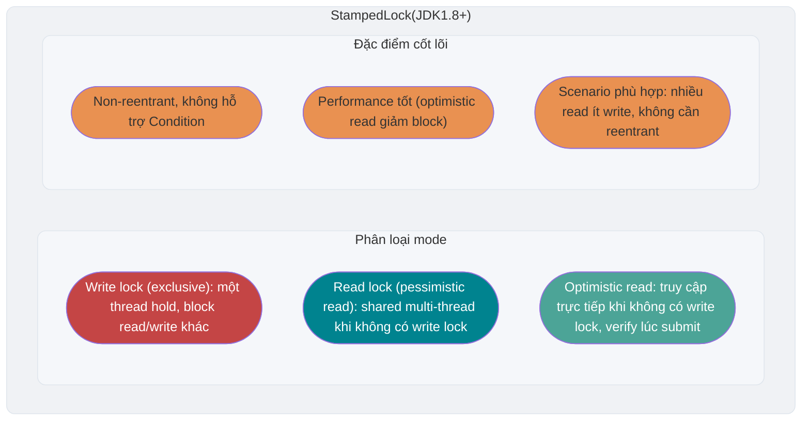

<!-- @include: @article-header.snippet.md -->

## ⭐️ JMM (Java Memory Model)

Có khá nhiều câu hỏi liên quan đến JMM (Java Memory Model), đồng thời đây cũng là nội dung quan trọng. Vì vậy tôi đã viết riêng một bài để tổng hợp các điểm kiến thức và câu hỏi liên quan đến JMM: [Giải thích chi tiết JMM (Java Memory Model)](https://javaguide.cn/java/concurrent/jmm.html).

## ⭐️ Từ khóa volatile

### Làm thế nào để bảo đảm visibility của biến?

Trong Java, từ khóa `volatile` có thể bảo đảm visibility của biến. Việc ghi vào một biến `volatile` sẽ happens-before việc đọc cùng biến đó sau này, vì vậy thread đọc có thể thấy lần ghi đó cùng các kết quả được truyền đến theo happens-before trước lần ghi. Đây là semantic do JMM quy định, không đồng nghĩa với việc mọi lần truy cập đều phải bỏ qua CPU cache để đọc/ghi trực tiếp physical main memory.


Từ khóa `volatile` không chỉ có trong ngôn ngữ Java, nhưng semantic giữa các ngôn ngữ không giống nhau. `volatile` của Java được JMM định nghĩa các bảo đảm về visibility và ordering, không thể được giải thích là “tắt CPU cache”.

Từ khóa `volatile` có thể bảo đảm visibility của dữ liệu, nhưng không thể bảo đảm atomicity của dữ liệu. Từ khóa `synchronized` có thể bảo đảm cả hai.

### Làm thế nào để ngăn instruction reordering?

**Trong Java, ngoài việc bảo đảm visibility của biến, từ khóa `volatile` còn có một tác dụng quan trọng là ngăn JVM thực hiện instruction reordering.** Nếu khai báo biến là **`volatile`**, khi đọc ghi biến này, JVM sẽ ngăn instruction reordering bằng cách chèn các **memory barrier** cụ thể.

Trong Java, class `Unsafe` cung cấp ba method liên quan đến memory barrier có thể dùng ngay, che giấu khác biệt ở tầng dưới của operating system:

```java
public native void loadFence();
public native void storeFence();
public native void fullFence();
```

Về lý thuyết, ba method này cũng có thể tạo ra hiệu quả ngăn reordering giống `volatile`, chỉ là sẽ phức tạp hơn.

#### 4 loại memory barrier

Khi giải thích cách JVM triển khai, thường dùng 4 loại memory barrier dưới đây để mô tả các quan hệ reordering cần ràng buộc. Đây là model ở tầng triển khai để dễ hiểu, không phải quy định của JLS rằng JVM bắt buộc phải chèn từng instruction barrier cụ thể nào:

| Loại barrier   | Ví dụ instruction            | Mô tả                                                                                                                                                                                                                                        |
| -------------- | ---------------------------- | -------------------------------------------------------------------------------------------------------------------------------------------------------------------------------------------------------------------------------------------- |
| **LoadLoad**   | `Load1; LoadLoad; Load2`     | Bảo đảm thao tác đọc của `Load1` hoàn tất trước `Load2` và các thao tác đọc sau đó                                                                                                                                                           |
| **StoreStore** | `Store1; StoreStore; Store2` | Ràng buộc thứ tự của hai thao tác ghi, để hiệu ứng của `Store1` không visible với processor khác muộn hơn `Store2`                                                                                                                           |
| **LoadStore**  | `Load1; LoadStore; Store2`   | Bảo đảm thao tác đọc của `Load1` hoàn tất trước khi `Store2` và các thao tác ghi sau đó được flush vào memory                                                                                                                                |
| **StoreLoad**  | `Store1; StoreLoad; Load2`   | Bảo đảm thao tác ghi của `Store1` visible với processor khác trước `Load2` và các thao tác đọc sau đó. Chi phí của barrier `StoreLoad` lớn nhất trong 4 barrier, đồng thời có hiệu ứng của 3 barrier còn lại nên còn gọi là **Full Barrier** |

#### Chiến lược chèn memory barrier cho thao tác đọc ghi volatile

Dưới đây là một chiến lược chèn barrier bảo thủ để dễ hiểu semantic của `volatile`. JVM thực tế sẽ lựa chọn, gộp hoặc bỏ qua các barrier cụ thể tùy theo memory model của processor đích, miễn là behavior cuối cùng thỏa mãn JMM:

**Chiến lược chèn memory barrier cho thao tác ghi volatile:**

Chèn một barrier `StoreStore` **trước** mỗi thao tác ghi volatile và một barrier `StoreLoad` **sau** nó.

```
StoreStore barrier
volatile write operation
StoreLoad barrier
```

- Barrier `StoreStore` phía trước: bảo đảm các ghi thông thường trước lần ghi `volatile` không bị reorder xuống sau lần ghi `volatile` đó.
- Barrier `StoreLoad` phía sau: bảo đảm sau lần ghi volatile, giá trị được ghi visible với các thao tác đọc/ghi volatile tiếp theo. Đây là barrier có chi phí lớn nhất nhưng cũng quan trọng nhất, vì nó ngăn lần ghi volatile bị reorder với các thao tác đọc/ghi volatile có thể xuất hiện sau đó.

**Chiến lược chèn memory barrier cho thao tác đọc volatile:**

Chèn một barrier `LoadLoad` và một barrier `LoadStore` **sau** mỗi thao tác đọc volatile.

```
volatile read operation
LoadLoad barrier
LoadStore barrier
```

- Barrier `LoadLoad`: bảo đảm các thao tác đọc thông thường sau lần đọc volatile không bị reorder lên trước lần đọc volatile.
- Barrier `LoadStore`: bảo đảm các thao tác ghi thông thường sau lần đọc volatile không bị reorder lên trước lần đọc volatile.

Nhờ vậy, tổ hợp volatile write-read thiết lập semantic tương tự **release-acquire của lock**: **kết quả của mọi thao tác trước volatile write sẽ visible với mọi thao tác sau volatile read tiếp theo trên biến volatile đó.**

Dưới đây tôi dùng một câu hỏi phỏng vấn thường gặp để giải thích hiệu quả ngăn instruction reordering của từ khóa `volatile`.

Trong phỏng vấn, interviewer thường hỏi: “Bạn biết singleton pattern không? Hãy tự viết cho tôi một cái! Giải thích nguyên lý triển khai singleton bằng double-checked locking nhé!”

**Triển khai object singleton bằng double-checked locking (thread-safe):**

```java
public class Singleton {

    private volatile static Singleton uniqueInstance;

    private Singleton() {
    }

    public static Singleton getUniqueInstance() {
       // Trước tiên kiểm tra object đã được khởi tạo chưa; nếu chưa thì mới vào phần code lock
        if (uniqueInstance == null) {
            // Lock class object
            synchronized (Singleton.class) {
                if (uniqueInstance == null) {
                    uniqueInstance = new Singleton();
                }
            }
        }
        return uniqueInstance;
    }
}
```

Việc thêm từ khóa `volatile` cho `uniqueInstance` là rất cần thiết. Đoạn code `uniqueInstance = new Singleton();` thực tế được thực hiện qua ba bước:

1. Phân bổ memory space cho `uniqueInstance`
2. Khởi tạo `uniqueInstance`
3. Trỏ `uniqueInstance` đến memory address đã phân bổ

Tuy nhiên, do JVM có đặc tính instruction reordering, thứ tự thực hiện có thể trở thành 1->3->2. Instruction reordering không gây vấn đề trong môi trường single-thread, nhưng trong môi trường multi-thread có thể khiến một thread nhận được instance chưa khởi tạo. Ví dụ, thread T1 thực hiện bước 1 và 3; lúc này T2 gọi `getUniqueInstance()` và thấy `uniqueInstance` khác null nên trả về `uniqueInstance`, nhưng `uniqueInstance` vẫn chưa được khởi tạo.

#### Hiểu vì sao DCL phải dùng volatile từ góc nhìn memory barrier

Ở trên đã giải thích từ góc nhìn instruction reordering vì sao `uniqueInstance` trong singleton DCL cần được khai báo `volatile`. Dưới đây tiếp tục phân tích từ góc nhìn memory barrier để thấy `volatile` giải quyết vấn đề này như thế nào.

Trong ba bước của dòng `uniqueInstance = new Singleton();` (phân bổ memory, khởi tạo object, gán reference), nếu không có `volatile`, bước 2 và bước 3 có thể bị reorder thành 1→3→2. Sau khi thêm `volatile`, vì `uniqueInstance` là biến volatile, thao tác ghi vào nó (bước 3: gán reference cho `uniqueInstance`) sẽ được xử lý theo chiến lược chèn memory barrier của volatile write đã giới thiệu ở trên:

1. Chèn barrier `StoreStore` **trước** volatile write: bảo đảm thao tác ghi của bước 1 (phân bổ memory) và bước 2 (khởi tạo object) hoàn tất trước bước 3 (gán reference), **ngăn việc reorder bước 2 và bước 3**.
2. Chèn barrier `StoreLoad` **sau** volatile write: ràng buộc reordering giữa lần ghi này với các thao tác đọc ghi sau đó, đồng thời phối hợp với volatile read để thiết lập visibility theo yêu cầu của JMM.

Như vậy, khi thread T2 đọc `uniqueInstance` (volatile read), nếu thấy `uniqueInstance != null` thì có thể bảo đảm object đã được khởi tạo hoàn toàn.

### Quan hệ giữa volatile và happens-before

Nguyên tắc happens-before trong JMM là căn cứ quan trọng để xác định dữ liệu có data race hay không và thread có an toàn hay không. Thao tác đọc ghi biến `volatile` có quan hệ mật thiết với nguyên tắc happens-before.

> Để xem giới thiệu chi tiết về nguyên tắc happens-before, có thể tham khảo bài [Giải thích chi tiết JMM (Java Memory Model)](https://javaguide.cn/java/concurrent/jmm.html).

Quy tắc liên quan trực tiếp đến `volatile` trong nguyên tắc happens-before là **quy tắc biến volatile**:

> **Thao tác ghi vào một biến volatile happens-before thao tác đọc biến volatile đó sau này.**

Nói cách khác, nếu thread A ghi một biến volatile, sau đó thread B đọc cùng biến volatile đó, mọi thay đổi mà thread A thực hiện trước khi ghi biến volatile (bao gồm thay đổi trên biến non-volatile) đều visible với thread B.

Quy tắc này kết hợp với **quy tắc transitivity** của happens-before (nếu A happens-before B, B happens-before C thì A happens-before C) có thể thực hiện một hình thức giao tiếp nhẹ giữa các thread. Ví dụ sau minh họa điều này:

```java
public class VolatileHappensBeforeDemo {
    private int a = 0;
    private int b = 0;
    private volatile boolean flag = false;

    // Thread A thực hiện
    public void writer() {
        a = 1;           // Operation 1: ordinary write
        b = 2;           // Operation 2: ordinary write
        flag = true;     // Operation 3: volatile write
    }

    // Thread B thực hiện
    public void reader() {
        if (flag) {      // Operation 4: volatile read
            int x = a;   // Operation 5: ordinary read, x chắc chắn bằng 1
            int y = b;   // Operation 6: ordinary read, y chắc chắn bằng 2
            System.out.println("x=" + x + ", y=" + y);
        }
    }
}
```

Trong code trên, chuỗi quan hệ happens-before như sau:

1. Operation 1 và operation 2 happens-before operation 3 (**program order rule**: trong cùng một thread, operation trước happens-before operation sau)
2. Operation 3 happens-before operation 4 (**volatile variable rule**: volatile write happens-before volatile read)
3. Operation 4 happens-before operation 5 và operation 6 (**program order rule**)

Theo **transitivity**: operation 1 và operation 2 happens-before operation 5 và operation 6.

Vì vậy, khi thread B đọc được `flag == true` ở operation 4, các thay đổi trên `a` và `b` mà thread A thực hiện trước operation 3 chắc chắn visible với thread B. Điểm mấu chốt là: **thao tác volatile write-read không chỉ bảo đảm visibility của bản thân biến volatile, mà còn “tiện thể” bảo đảm visibility của các biến thông thường trước và sau nó nhờ transitivity của happens-before.**

Điều này cũng giải thích vì sao trong phát triển thực tế, `volatile` thường được dùng làm **state flag** (như `flag` trong ví dụ trên): nó có thể truyền thông tin trạng thái an toàn giữa các thread mà không cần lock, đồng thời bảo đảm visibility của dữ liệu liên quan.

### volatile có bảo đảm atomicity không?

**Từ khóa `volatile` có thể bảo đảm visibility của biến, nhưng không thể bảo đảm thao tác trên biến có atomicity.**

Ta có thể chứng minh bằng code dưới đây:

```java
/**
 * Tìm JavaGuide trên WeChat và nhắn "面试突击" (Sổ tay phỏng vấn) để nhận miễn phí cẩm nang phỏng vấn Java do tác giả tự biên soạn
 *
 * @author Guide
 * @date 2022/08/03 13:40
 **/
public class VolatileAtomicityDemo {
    public volatile static int inc = 0;

    public void increase() {
        inc++;
    }

    public static void main(String[] args) throws InterruptedException {
        ExecutorService threadPool = Executors.newFixedThreadPool(5);
        VolatileAtomicityDemo volatileAtomicityDemo = new VolatileAtomicityDemo();
        for (int i = 0; i < 5; i++) {
            threadPool.execute(() -> {
                for (int j = 0; j < 500; j++) {
                    volatileAtomicityDemo.increase();
                }
            });
        }
        // Chờ 1.5 giây để bảo đảm chương trình phía trên hoàn tất
        Thread.sleep(1500);
        System.out.println(inc);
        threadPool.shutdown();
    }
}
```

Trong điều kiện bình thường, code trên đáng lẽ phải in `2500`. Nhưng sau khi thực sự chạy code trên, bạn sẽ thấy kết quả in ra mỗi lần đều nhỏ hơn `2500`.

Tại sao lại xảy ra tình trạng này? Không phải đã nói `volatile` có thể bảo đảm visibility của biến sao!

Nói cách khác, nếu `volatile` có thể bảo đảm atomicity của thao tác `inc++`, sau khi mỗi thread tăng biến `inc`, các thread khác có thể lập tức thấy giá trị đã được sửa. 5 thread lần lượt thực hiện 500 thao tác, vậy giá trị inc cuối cùng phải là 5\*500=2500.

Nhiều người nhầm tưởng thao tác tăng `inc++` là atomic, nhưng thực tế `inc++` là một thao tác compound gồm ba bước:

1. Đọc giá trị của inc.
2. Cộng 1 vào inc.
3. Ghi giá trị của inc trở lại memory.

`volatile` không thể bảo đảm ba thao tác này có atomicity, có thể xảy ra tình huống sau:

1. Sau khi thread 1 đọc `inc` nhưng chưa sửa, thread 2 lại đọc giá trị `inc`, sửa nó (+1), rồi ghi giá trị `inc` trở lại memory.
2. Sau khi thread 2 hoàn tất, thread 1 sửa giá trị `inc` (+1), rồi ghi giá trị `inc` trở lại memory.

Kết quả là sau khi hai thread lần lượt tăng `inc` một lần, `inc` thực tế chỉ tăng 1.

Nếu muốn bảo đảm code trên chạy đúng thì cũng rất đơn giản, có thể dùng `synchronized`, `Lock` hoặc `AtomicInteger`.

Cải tiến bằng `synchronized`:

```java
public synchronized void increase() {
    inc++;
}
```

Cải tiến bằng `AtomicInteger`:

```java
public AtomicInteger inc = new AtomicInteger();

public void increase() {
    inc.getAndIncrement();
}
```

Cải tiến bằng `ReentrantLock`:

```java
Lock lock = new ReentrantLock();
public void increase() {
    lock.lock();
    try {
        inc++;
    } finally {
        lock.unlock();
    }
}
```

## ⭐️ Optimistic lock và pessimistic lock

### Pessimistic lock là gì?

Pessimistic lock luôn giả định tình huống xấu nhất, cho rằng mỗi lần shared resource được truy cập đều có thể phát sinh vấn đề (chẳng hạn shared data bị sửa), nên mỗi lần lấy resource đều lock. Vì vậy, thread khác muốn lấy resource sẽ bị block cho đến khi lock được owner trước đó release. Nói cách khác, **mỗi lần shared resource chỉ cho một thread sử dụng, các thread khác bị block; sau khi dùng xong mới chuyển resource cho thread khác**.

Trong Java, các exclusive lock như `synchronized` và `ReentrantLock` là triển khai theo tư tưởng pessimistic lock.

```java
public void performSynchronisedTask() {
    synchronized (this) {
        // Operation cần synchronize
    }
}

private Lock lock = new ReentrantLock();
lock.lock();
try {
   // Operation cần synchronize
} finally {
    lock.unlock();
}
```

Trong high concurrency scenario, lock contention gay gắt sẽ khiến thread bị block; số lượng thread bị block lớn sẽ dẫn đến context switch và làm tăng performance overhead của system. Ngoài ra, pessimistic lock còn có thể gặp deadlock, ảnh hưởng đến việc chạy bình thường của code.

### Optimistic lock là gì?

Optimistic lock luôn giả định tình huống tốt nhất, cho rằng mỗi lần shared resource được truy cập sẽ không phát sinh vấn đề. Thread có thể liên tục thực hiện mà không cần lock hoặc chờ, chỉ xác minh resource tương ứng (tức data) có bị thread khác sửa hay không lúc commit thay đổi (có thể dùng version number mechanism hoặc CAS algorithm).

Trong Java, các atomic variable class trong package `java.util.concurrent.atomic` (chẳng hạn `AtomicInteger`, `LongAdder`) sử dụng CAS, một cách triển khai optimistic lock.


```java
// LongAdder có performance tốt hơn AtomicInteger và AtomicLong trong high concurrency scenario
// Đổi lại sẽ tiêu tốn nhiều memory space hơn (đổi không gian lấy thời gian)
LongAdder sum = new LongAdder();
sum.increment();
```

Trong high concurrency scenario, so với pessimistic lock, optimistic lock không có thread block do lock contention và cũng không gặp deadlock, thường có performance tốt hơn. Tuy nhiên, nếu conflict xảy ra thường xuyên (tỷ lệ write rất cao), thao tác sẽ thường xuyên fail và retry, điều này cũng ảnh hưởng nghiêm trọng đến performance và khiến CPU tăng vọt.

Tuy nhiên, vấn đề nhiều lần fail và retry cũng có thể giải quyết. `LongAdder` được nhắc đến ở trên đã giải quyết vấn đề này bằng cách đổi không gian lấy thời gian.

Về lý thuyết:

- Pessimistic lock thường dùng trong trường hợp write nhiều (nhiều write, contention gay gắt), tránh việc fail và retry thường xuyên ảnh hưởng đến performance; overhead của pessimistic lock là cố định. Tuy nhiên, nếu optimistic lock giải quyết được vấn đề fail và retry thường xuyên (chẳng hạn `LongAdder`) thì cũng có thể cân nhắc dùng optimistic lock, tùy tình huống thực tế.
- Optimistic lock thường dùng trong trường hợp write ít (nhiều read, contention thấp), tránh việc lock thường xuyên ảnh hưởng đến performance. Tuy nhiên, optimistic lock chủ yếu nhắm đến một shared variable (tham khảo các atomic variable class trong package `java.util.concurrent.atomic`).

### Làm thế nào để triển khai optimistic lock?

Optimistic lock thường được triển khai bằng version number mechanism hoặc CAS algorithm; CAS được dùng nhiều hơn, cần đặc biệt chú ý điểm này.

#### Version number mechanism

Thông thường thêm một field data version `version` vào data table để biểu thị số lần data bị sửa. Khi data bị sửa, giá trị `version` tăng 1. Khi thread A muốn update data value, thread này cũng đọc giá trị `version` cùng lúc đọc data; lúc submit update, chỉ update khi giá trị version vừa đọc bằng giá trị `version` hiện tại trong database, nếu không thì retry update cho đến khi thành công.

**Ví dụ đơn giản**: giả sử account information table trong database có field version, giá trị hiện tại là 1; field account balance (`balance`) hiện tại là $100.

1. Operator A đọc dữ liệu lúc này (`version`=1), rồi trừ $50 khỏi account balance ($100-\$50).
2. Trong lúc operator A thao tác, operator B cũng đọc thông tin user này (`version`=1), rồi trừ $20 khỏi account balance ($100-\$20).
3. Operator A hoàn tất thay đổi, submit data version (`version`=1) cùng balance sau khi trừ (`balance`=\$50) đến database để update. Vì version của data submit bằng version hiện tại của database record nên data được update, database record `version` update thành 2.
4. Operator B cũng hoàn tất, cố submit data với version (`version`=1) đến database (`balance`=\$80). Nhưng khi đối chiếu version của database record, operator B nhận thấy version submit là 1 trong khi version hiện tại của database record là 2, không thỏa mãn optimistic lock strategy “version submit phải bằng version hiện tại mới được update”, nên submit của operator B bị từ chối.

Nhờ vậy tránh được việc kết quả sửa bằng data cũ dựa trên `version`=1 của operator B ghi đè kết quả thao tác của operator A.

#### CAS algorithm

CAS có tên đầy đủ là **Compare And Swap (so sánh và hoán đổi)**, được dùng để triển khai optimistic lock và được ứng dụng rộng rãi trong nhiều framework. Tư tưởng của CAS rất đơn giản: so sánh một expected value với value của biến cần update, chỉ update khi hai value bằng nhau.

CAS là một atomic operation, bên dưới phụ thuộc vào một atomic instruction của CPU.

> **Atomic operation** là operation nhỏ nhất không thể tách rời, nghĩa là một khi operation bắt đầu thì không thể bị interrupt cho đến khi hoàn tất.

CAS có ba operand:

- **V**: value của variable cần update (Var)
- **E**: expected value (Expected)
- **N**: new value dự định ghi (New)

Khi và chỉ khi value của V bằng E, CAS mới atomically dùng new value N để update value của V. Nếu không bằng, nghĩa là đã có thread khác update V, thread hiện tại bỏ qua update.

**Ví dụ đơn giản**: thread A muốn sửa value của variable i thành 6, value ban đầu của i là 1 (V = 1, E=1, N=6, giả sử không có ABA problem).

1. So sánh i với 1; nếu bằng thì nghĩa là chưa bị thread khác sửa và có thể set thành 6.
2. So sánh i với 1; nếu không bằng thì nghĩa là đã bị thread khác sửa, thread hiện tại bỏ qua update và CAS operation fail.

Khi nhiều thread đồng thời dùng CAS để thao tác trên một variable, chỉ một thread thắng và update thành công; các thread còn lại sẽ fail. Tuy nhiên thread fail không bị suspend, chỉ được thông báo là fail và được phép thử lại, tất nhiên cũng có thể bỏ qua operation.

Java code có thể biểu đạt CAS semantic thông qua atomic class, `VarHandle` và các API khác. HotSpot thường nhận diện các invocation liên quan là JVM intrinsic, sau đó ánh xạ chúng thành atomic instruction được processor đích hỗ trợ hoặc implementation tương đương; đây không phải yêu cầu cố định của Java spec là “gọi C++ inline assembly thông qua JNI”.

Class `Unsafe` trong package `sun.misc` cung cấp các method `compareAndSwapObject`, `compareAndSwapInt`, `compareAndSwapLong` để triển khai CAS operation cho các kiểu `Object`, `int`, `long`.

```java
/**
  *  CAS
  * @param o         object chứa field cần sửa
  * @param offset    offset của field trong object
  * @param expected  expected value
  * @param update    update value
  * @return          true | false
  */
public final native boolean compareAndSwapObject(Object o, long offset,  Object expected, Object update);

public final native boolean compareAndSwapInt(Object o, long offset, int expected,int update);

public final native boolean compareAndSwapLong(Object o, long offset, long expected, long update);
```

Để xem giới thiệu chi tiết về class `Unsafe`, có thể đọc bài viết này: [Giải thích chi tiết về lớp ma thuật Unsafe trong Java - JavaGuide - 2022](https://javaguide.cn/java/basis/unsafe.html).

### CAS trong Java được triển khai như thế nào?

Trong Java, một class quan trọng để triển khai operation CAS (Compare-And-Swap, so sánh và hoán đổi) là `Unsafe`.

Class `Unsafe` nằm trong package `sun.misc`, là class cung cấp các operation cấp thấp và không an toàn. Do có chức năng mạnh và tiềm ẩn nguy hiểm, class này thường được dùng bên trong JVM hoặc trong một số library cần performance rất cao và truy cập tầng thấp, không khuyến nghị developer thông thường sử dụng trong application. Có thể đọc bài viết này để xem giới thiệu chi tiết về class `Unsafe`: 📌[Giải thích chi tiết về lớp ma thuật Unsafe trong Java](https://javaguide.cn/java/basis/unsafe.html).

Class `Unsafe` trong package `sun.misc` cung cấp các method `compareAndSwapObject`, `compareAndSwapInt`, `compareAndSwapLong` để triển khai CAS operation cho các kiểu `Object`, `int`, `long`:

```java
/**
 * Atomically update value của object field.
 *
 * @param o        object cần thao tác
 * @param offset   memory offset của object field
 * @param expected expected old value
 * @param x        new value cần set
 * @return true nếu value được update thành công; nếu không trả về false
 */
boolean compareAndSwapObject(Object o, long offset, Object expected, Object x);

/**
 * Atomically update value của object field kiểu int.
 */
boolean compareAndSwapInt(Object o, long offset, int expected, int x);

/**
 * Atomically update value của object field kiểu long.
 */
boolean compareAndSwapLong(Object o, long offset, long expected, long x);
```

Trong JDK 8, các CAS method này của `Unsafe` là method `native`. Java code biểu đạt atomic compare-and-swap semantic thông qua chúng; HotSpot thường xử lý invocation liên quan như JVM intrinsic và ánh xạ thành atomic instruction được processor đích hỗ trợ hoặc implementation tương đương. Implementation cụ thể phụ thuộc vào JVM và CPU architecture, nhưng không thể đơn giản khái quát là “gọi C++ inline assembly thông qua JNI”.

Package `java.util.concurrent.atomic` cung cấp một số class dùng cho atomic operation. Các class này tận dụng atomic instruction ở tầng dưới để bảo đảm operation thread-safe trong môi trường multi-thread.


Để xem giới thiệu và cách dùng các atomic class này, có thể đọc bài: [Tổng hợp atomic class](https://javaguide.cn/java/concurrent/atomic-classes.html).

`AtomicInteger` là một trong các atomic class của Java, chủ yếu dùng để thực hiện atomic operation trên variable kiểu `int`; class này dùng các low-level atomic operation do `Unsafe` cung cấp để triển khai thread safety không cần lock.

Dưới đây, thông qua việc đọc core source code của `AtomicInteger` (JDK1.8), ta sẽ giải thích Java dùng method của `Unsafe` để triển khai atomic operation như thế nào.

Core source code của `AtomicInteger` như sau:

```java
// Lấy Unsafe instance
private static final Unsafe unsafe = Unsafe.getUnsafe();
private static final long valueOffset;

static {
    try {
        // Lấy memory offset của field “value” trong class AtomicInteger
        valueOffset = unsafe.objectFieldOffset
            (AtomicInteger.class.getDeclaredField("value"));
    } catch (Exception ex) { throw new Error(ex); }
}
// Bảo đảm visibility của field “value”
private volatile int value;

// Nếu current value bằng expected value thì atomically set value thành newValue
// Dùng method Unsafe#compareAndSwapInt để thực hiện CAS operation
public final boolean compareAndSet(int expect, int update) {
    return unsafe.compareAndSwapInt(this, valueOffset, expect, update);
}

// Atomically cộng delta vào current value và trả về old value
public final int getAndAdd(int delta) {
    return unsafe.getAndAddInt(this, valueOffset, delta);
}

// Atomically cộng 1 vào current value và trả về value trước khi cộng (old value)
// Dùng method Unsafe#getAndAddInt để thực hiện CAS operation.
public final int getAndIncrement() {
    return unsafe.getAndAddInt(this, valueOffset, 1);
}

// Atomically trừ 1 khỏi current value và trả về value trước khi trừ (old value)
public final int getAndDecrement() {
    return unsafe.getAndAddInt(this, valueOffset, -1);
}
```

Source code của `Unsafe#getAndAddInt`:

```java
// Atomically lấy và tăng integer value
public final int getAndAddInt(Object o, long offset, int delta) {
    int v;
    do {
        // Lấy integer value tại memory offset offset của object o theo volatile mode
        v = getIntVolatile(o, offset);
    } while (!compareAndSwapInt(o, offset, v, v + delta));
    // Trả về old value
    return v;
}
```

Có thể thấy `getAndAddInt` dùng vòng lặp `do-while`: khi operation `compareAndSwapInt` fail, nó liên tục retry đến khi thành công. Nói cách khác, method `getAndAddInt` thử update value thông qua method `compareAndSwapInt`; nếu update fail (current value bị thread khác sửa trong thời gian đó), nó đọc lại current value rồi tiếp tục thử update cho đến khi thành công.

Do CAS operation có thể fail vì concurrent conflict, nó thường kết hợp với vòng lặp `while` để liên tục retry sau khi fail cho đến khi thành công. Đây chính là **spinlock mechanism**.

### CAS algorithm có những vấn đề gì?

ABA problem là vấn đề thường gặp nhất của CAS algorithm.

#### ABA problem

Nếu lúc đầu đọc một variable V được value A, đến lúc chuẩn bị assign kiểm tra thấy nó vẫn là A, liệu có thể khẳng định value của nó chưa từng bị thread khác sửa không? Rõ ràng là không, vì trong khoảng thời gian đó value có thể bị đổi thành value khác rồi lại đổi về A; khi đó CAS operation sẽ nhầm tưởng nó chưa từng bị sửa. Vấn đề này được gọi là **“ABA problem” của CAS operation.**

Cách giải quyết ABA problem là thêm **version number hoặc timestamp** phía trước variable. Class `AtomicStampedReference` từ JDK 1.5 được dùng để giải quyết ABA problem. Method `compareAndSet()` của class này trước tiên kiểm tra current reference có bằng expected reference hay không, đồng thời current stamp có bằng expected stamp hay không; nếu cả hai cùng bằng thì atomically set reference và stamp thành update value được chỉ định.

```java
public boolean compareAndSet(V   expectedReference,
                             V   newReference,
                             int expectedStamp,
                             int newStamp) {
    Pair<V> current = pair;
    return
        expectedReference == current.reference &&
        expectedStamp == current.stamp &&
        ((newReference == current.reference &&
          newStamp == current.stamp) ||
         casPair(current, Pair.of(newReference, newStamp)));
}
```

#### Vòng lặp kéo dài có overhead lớn

CAS thường dùng spin operation để retry, nghĩa là nếu chưa thành công thì cứ lặp cho đến khi thành công. Nếu thời gian dài vẫn không thành công, nó sẽ tạo execution overhead rất lớn cho CPU.

Nếu JVM hỗ trợ `pause` instruction do processor cung cấp, hiệu quả của spin operation sẽ được cải thiện. `pause` instruction có hai tác dụng quan trọng:

1. **Trì hoãn việc thực thi instruction trong pipeline**: `pause` instruction có thể trì hoãn việc thực thi instruction, từ đó giảm resource consumption của CPU. Thời gian trì hoãn phụ thuộc vào implementation version của processor; trên một số processor, thời gian trì hoãn có thể bằng zero.
2. **Tránh memory-order conflict**: khi thoát vòng lặp, `pause` instruction có thể tránh việc CPU pipeline bị clear do memory-order conflict, từ đó nâng cao execution efficiency của CPU.

#### Chỉ bảo đảm atomic operation trên một shared variable

CAS operation chỉ có hiệu lực với một shared variable. Khi cần thao tác trên nhiều shared variable, CAS trở nên bất lực. Tuy nhiên, từ JDK 1.5, Java cung cấp class `AtomicReference`, nhờ đó có thể bảo đảm atomicity giữa các reference object. Bằng cách đóng gói nhiều variable trong một object, ta có thể dùng `AtomicReference` để thực hiện CAS operation.

Ngoài cách dùng `AtomicReference`, cũng có thể dùng lock để bảo đảm.

### Tổng kết

| **Tiêu chí so sánh**          | **Optimistic Locking**                                                      | **Pessimistic Locking**                                                                           |
| ----------------------------- | --------------------------------------------------------------------------- | ------------------------------------------------------------------------------------------------- |
| **Core assumption**           | Giả định conflict hiếm xảy ra, chỉ verify lúc submit.                       | Giả định conflict chắc chắn xảy ra, lock ngay lúc read.                                           |
| **Implementation thường gặp** | **CAS (Compare And Swap)** hoặc version number mechanism                    | Java monitor, `Lock` hoặc database lock; implementation cụ thể có thể gồm spin, queue và suspend. |
| **Behavior khi contention**   | Sau khi update fail, business logic quyết định retry, bỏ qua hoặc rollback. | Thread lấy lock fail có thể spin, xếp queue hoặc bị suspend, tùy implementation của lock.         |
| **Concurrent overhead**       | **CPU consumption** (spin retry thường xuyên khi concurrent write cao).     | **Context switch overhead** (suspend và wakeup thread).                                           |
| **Deadlock risk**             | **Không deadlock** (vì không có việc chờ trong khi giữ lock).               | **Có deadlock risk** (nhiều lock chờ lẫn nhau).                                                   |
| **Database implementation**   | `UPDATE ... SET version = version + 1`                                      | `SELECT ... FOR UPDATE`                                                                           |
| **Java class đại diện**       | `AtomicInteger`, `LongAdder`, `StampedLock`                                 | `synchronized`, `ReentrantLock`                                                                   |
| **Scenario phù hợp**          | **Nhiều read ít write**, business có xác suất concurrent conflict thấp.     | **Nhiều write ít read**, business core yêu cầu data consistency cực cao.                          |

## Từ khóa synchronized

### synchronized là gì? Dùng để làm gì?

`synchronized` là một từ khóa trong Java, có nghĩa là đồng bộ, chủ yếu giải quyết việc đồng bộ khi nhiều thread truy cập resource; nó bảo đảm method hoặc code block được nó bảo vệ tại bất kỳ thời điểm nào cũng chỉ có một thread được thực hiện.

Trong các version Java đầu tiên, `synchronized` là **heavyweight lock**, performance thấp. Nguyên nhân là monitor lock dựa vào `Mutex Lock` của operating system ở tầng dưới để triển khai, còn Java thread được map vào native thread của operating system. Khi suspend hoặc wakeup một thread, đều cần operating system thực hiện; khi operating system chuyển đổi giữa các thread, cần chuyển từ user mode sang kernel mode. Việc chuyển mode này tương đối lâu, nên time cost tương đối cao.

Tuy nhiên, từ sau Java 6, `synchronized` đưa vào nhiều optimization như spinlock, adaptive spinlock, lock elimination, lock coarsening, biased lock và lightweight lock để giảm overhead của lock operation. Những optimization này giúp performance của `synchronized` lock tăng lên đáng kể. Vì vậy, `synchronized` vẫn có thể dùng trong project thực tế; source code của JDK và nhiều open-source framework đều sử dụng `synchronized` rộng rãi.

Bổ sung thêm một điểm về biased lock: biased lock làm tăng complexity của JVM nhưng cũng không mang lại performance improvement cho mọi application. Vì vậy, trong JDK15, biased lock bị disable mặc định (vẫn có thể dùng `-XX:+UseBiasedLocking` để enable); trong JDK18, biased lock đã bị deprecated hoàn toàn (không thể mở bằng command line).

### Dùng synchronized như thế nào?

Từ khóa `synchronized` chủ yếu có 3 cách dùng:

1. Bảo vệ instance method
2. Bảo vệ static method
3. Bảo vệ code block

**1. Bảo vệ instance method** (lock current object instance)

Áp dụng lock cho current object instance; trước khi vào synchronized code cần lấy **lock của current object instance**.

```java
synchronized void method() {
    // Business code
}
```

**2. Bảo vệ static method** (lock current class)

Áp dụng lock cho current class, tác động đến tất cả object instance của class; trước khi vào synchronized code cần lấy **lock của current class**.

Nguyên nhân là static member không thuộc về bất kỳ instance object nào mà thuộc về cả class, không phụ thuộc instance cụ thể của class và được mọi instance của class dùng chung.

```java
synchronized static void method() {
    // Business code
}
```

Static `synchronized` method và non-static `synchronized` method có mutual exclusion không? Không! Nếu thread A gọi non-static `synchronized` method của một instance object, còn thread B cần gọi static `synchronized` method của class chứa instance object đó thì vẫn được phép, không xảy ra mutual exclusion. Lý do là static `synchronized` method chiếm lock của current class, còn non-static `synchronized` method chiếm lock của current instance object.

**3. Bảo vệ code block** (lock object/class được chỉ định)

Lock object/class được chỉ định trong dấu ngoặc:

- `synchronized(object)` nghĩa là trước khi vào synchronized code block phải lấy **lock của object được chỉ định**.
- `synchronized(Class.class)` nghĩa là trước khi vào synchronized code block phải lấy **lock của Class được chỉ định**.

```java
synchronized(this) {
    // Business code
}
```

**Tóm lại:**

- Thêm từ khóa `synchronized` vào `static` method và code block `synchronized(class)` đều là lock Class;
- Thêm từ khóa `synchronized` vào instance method là lock object instance;
- Hạn chế dùng `synchronized(String a)` vì string constant pool trong JVM có cơ chế cache.

### Có thể dùng synchronized để bảo vệ constructor không?

Constructor không thể được bảo vệ bằng từ khóa `synchronized`. Tuy nhiên, có thể dùng synchronized code block bên trong constructor.

Ngoài ra, bản thân constructor thread-safe, nhưng nếu constructor có thao tác trên shared resource thì cần dùng synchronization phù hợp để bảo đảm thread safety của toàn bộ quá trình khởi tạo.

### ⭐️ Bạn có biết nguyên lý tầng dưới của synchronized không?

Nguyên lý tầng dưới của từ khóa synchronized thuộc về tầng JVM.

#### Trường hợp synchronized statement block

```java
public class SynchronizedDemo {
    public void method() {
        synchronized (this) {
            System.out.println("synchronized code block");
        }
    }
}
```

Dùng command `javap` đi kèm JDK để xem bytecode liên quan của class `SynchronizedDemo`: trước tiên chuyển đến directory tương ứng với class, chạy command `javac SynchronizedDemo.java` để tạo file `.class` sau compile, rồi chạy `javap -c -s -v -l SynchronizedDemo.class`.


Từ nội dung trên có thể thấy: **synchronized statement block được triển khai bằng các instruction `monitorenter` và `monitorexit`; instruction `monitorenter` chỉ vị trí bắt đầu của synchronized code block, còn instruction `monitorexit` chỉ vị trí kết thúc của synchronized code block.**

Bytecode phía trên có một instruction `monitorenter` và hai instruction `monitorexit`, nhằm bảo đảm lock được release đúng cách cả khi synchronized code block chạy bình thường lẫn khi phát sinh exception.

Khi thực hiện instruction `monitorenter`, thread cố gắng lấy lock, tức quyền sở hữu **object monitor `monitor`**.

> Trong Java Virtual Machine (HotSpot), Monitor được triển khai dựa trên C++, bởi [ObjectMonitor](https://github.com/openjdk-mirror/jdk7u-hotspot/blob/50bdefc3afe944ca74c3093e7448d6b889cd20d1/src/share/vm/runtime/objectMonitor.cpp). Mỗi object đều tích hợp sẵn một object `ObjectMonitor`.
>
> Ngoài ra, các method như `wait/notify` cũng phụ thuộc vào object `monitor`. Đây là lý do chỉ có thể gọi các method như `wait/notify` trong synchronized block hoặc method; nếu không sẽ ném exception `java.lang.IllegalMonitorStateException`.

Khi thực hiện `monitorenter`, thread sẽ cố lấy object lock. Nếu lock counter bằng 0 thì nghĩa là lock có thể được lấy; sau khi lấy, lock counter được set thành 1, tức tăng 1.


Chỉ thread sở hữu object lock mới có thể thực hiện instruction `monitorexit` để release lock. Sau khi thực hiện `monitorexit`, lock counter được set thành 0, biểu thị lock đã release và thread khác có thể thử lấy lock.


Nếu lấy object lock fail, current thread phải block chờ cho đến khi lock được thread khác release.

#### Trường hợp synchronized bảo vệ method

```java
public class SynchronizedDemo2 {
    public synchronized void method() {
        System.out.println("synchronized method");
    }
}

```


Method được bảo vệ bằng `synchronized` không có instruction `monitorenter` và `monitorexit`, thay vào đó là flag `ACC_SYNCHRONIZED`, flag này chỉ ra method là synchronized method. JVM nhận diện method có khai báo synchronized thông qua access flag `ACC_SYNCHRONIZED` để thực hiện synchronized invocation tương ứng.

Nếu là instance method, JVM sẽ cố lấy lock của instance object. Nếu là static method, JVM sẽ cố lấy lock của current class.

#### Tổng kết

`synchronized` statement block được triển khai bằng instruction `monitorenter` và `monitorexit`; `monitorenter` chỉ vị trí bắt đầu của synchronized code block, còn `monitorexit` chỉ vị trí kết thúc của synchronized code block.

Method được bảo vệ bằng `synchronized` không có instruction `monitorenter` và `monitorexit`, thay vào đó là flag `ACC_SYNCHRONIZED`, flag này chỉ ra method là synchronized method.

**Tuy nhiên, bản chất của cả hai đều là lấy object monitor `monitor`.**

Đọc thêm: [Những câu chuyện về Java lock và thread - Youzan Technical Team](https://tech.youzan.com/javasuo-yu-xian-cheng-de-na-xie-shi/).

🧗🏻 Nâng cao: nếu còn thời gian và khả năng, bạn có thể dành thời gian nghiên cứu chi tiết object monitor `monitor`.

### synchronized đã được tối ưu gì ở tầng dưới sau JDK1.6? Bạn có biết nguyên lý lock upgrade không?

Sau Java 6, `synchronized` đưa vào nhiều optimization như spinlock, adaptive spinlock, lock elimination, lock coarsening, biased lock và lightweight lock để giảm overhead của lock operation. Những optimization này giúp performance của `synchronized` lock tăng lên đáng kể (trong JDK18, biased lock đã deprecated hoàn toàn như đã nói ở trên).

Lock chủ yếu có bốn state, lần lượt là: no-lock state, biased lock state, lightweight lock state và heavyweight lock state; chúng sẽ dần upgrade khi contention tăng. Chú ý lock chỉ có thể upgrade chứ không downgrade. Strategy này nhằm nâng cao efficiency khi lấy và release lock.

Lock upgrade của `synchronized` là một quá trình tương đối phức tạp, trong phỏng vấn cũng hiếm khi hỏi. Nếu muốn tìm hiểu chi tiết, có thể xem bài: [Phân tích sơ lược nguyên lý và implementation của synchronized lock upgrade](https://www.cnblogs.com/star95/p/17542850.html).

### Vì sao biased lock của synchronized bị deprecated?

Thông báo chính thức của OpenJDK: [JEP 374: Deprecate and Disable Biased Locking](https://openjdk.org/jeps/374)

Trong JDK15, biased lock bị disable mặc định (vẫn có thể dùng `-XX:+UseBiasedLocking` để enable); trong JDK18, biased lock đã deprecated hoàn toàn (không thể mở bằng command line).

Trong thông báo chính thức, nguyên nhân chủ yếu gồm hai khía cạnh:

- **Performance gain không rõ ràng:**

Biased lock là một optimization của HotSpot VM, có thể nâng cao performance truy cập synchronized code block trong single-thread.

Application được hưởng lợi từ biased lock thường dùng Java Collection API đời đầu, chẳng hạn HashTable và Vector. Các collection này dùng synchronized để kiểm soát synchronization; khi truy cập thường xuyên trong single-thread, biased lock sẽ giảm synchronization overhead.

Cùng với sự phát triển của JDK, collection class hiệu năng cao ConcurrentHashMap xuất hiện, bên trong collection đã có nhiều performance optimization, vì vậy performance gain do biased lock mang lại không còn rõ ràng.

Biased lock chỉ mang lại performance gain trong scenario single-thread truy cập synchronized code block.

Nếu có multi-thread contention thì cần **revoke biased lock**, operation này có performance overhead khá lớn. Việc revoke biased lock cần chờ đến global safe point, khi đó mọi thread đều bị pause; lúc này JVM kiểm tra thread state và revoke biased lock.

- **Chi phí maintenance của code bên trong JVM quá cao:**

Biased lock đưa nhiều code phức tạp vào synchronization subsystem và có tính xâm lấn đối với các HotSpot component khác. Complexity này gây khó khăn cho việc hiểu code và refactor system, vì vậy OpenJDK muốn disable, deprecate và xóa biased lock.

### ⭐️ synchronized và volatile khác nhau thế nào?

Từ khóa `synchronized` và `volatile` là hai thành phần bổ sung cho nhau, không đối lập nhau!

- Từ khóa `volatile` là lightweight implementation của thread synchronization nên performance chắc chắn tốt hơn từ khóa `synchronized`. Tuy nhiên `volatile` chỉ dùng được cho variable, còn `synchronized` có thể bảo vệ method và code block.
- Từ khóa `volatile` có thể bảo đảm visibility của data nhưng không bảo đảm atomicity của data. Từ khóa `synchronized` bảo đảm cả hai.
- Từ khóa `volatile` chủ yếu giải quyết visibility của variable giữa nhiều thread, còn `synchronized` giải quyết synchronization khi nhiều thread truy cập resource.

#### So sánh performance giữa volatile và synchronized

Ở trên đã nói `volatile` là lightweight implementation của thread synchronization và có performance tốt hơn `synchronized`. Dưới đây phân tích từ nguyên lý tầng dưới vì sao `volatile` có performance tốt hơn và trong trường hợp nào nên chọn loại nào.

Zhou Zhiming chỉ ra trong cuốn _Understanding the JVM_:

> Performance cost của thao tác read trên biến volatile gần như không khác biến thông thường, nhưng thao tác write có thể chậm hơn một chút vì cần chèn nhiều memory barrier instruction vào native code để bảo đảm processor không thực hiện out-of-order execution. Dù vậy, trong phần lớn scenario, total overhead của volatile vẫn thấp hơn lock.

Nguyên nhân gốc rễ của performance difference giữa hai loại nằm ở cơ chế implementation tầng dưới khác nhau:

| Tiêu chí so sánh            | `volatile`                                                                               | `synchronized`                                                                                   |
| --------------------------- | ---------------------------------------------------------------------------------------- | ------------------------------------------------------------------------------------------------ |
| **Tầng implementation**     | Dùng memory barrier instruction, không có thread block và context switch                 | Phụ thuộc OS mutex lock (Mutex Lock), có user mode và kernel mode switch                         |
| **Read overhead**           | Gần như giống ordinary variable                                                          | Cần lấy monitor lock, kể cả không contention cũng có overhead (biased lock/lightweight lock CAS) |
| **Write overhead**          | Cần chèn `StoreStore` + `StoreLoad` memory barrier, có overhead nhưng không block thread | Cần lấy và release monitor lock, khi có contention sẽ block thread và context switch             |
| **Behavior khi contention** | Không block thread, luôn non-blocking                                                    | Khi thread contention gay gắt, block và wakeup xảy ra thường xuyên, context switch overhead lớn  |
| **Phạm vi chức năng**       | Chỉ áp dụng cho variable, chỉ bảo đảm visibility và ordering                             | Có thể bảo vệ method và code block, đồng thời bảo đảm visibility, ordering và atomicity          |

**Gợi ý lựa chọn:**

- Nếu chỉ cần bảo đảm visibility của variable (chẳng hạn state flag hoặc instance reference trong DCL singleton), ưu tiên `volatile` vì overhead thấp hơn.
- Nếu cần bảo đảm atomicity của compound operation (chẳng hạn `i++`, kiểm tra trước rồi thực hiện), bắt buộc dùng `synchronized`, `Lock` hoặc atomic class; `volatile` không đáp ứng được.

## ReentrantLock

### ReentrantLock là gì?

`ReentrantLock` implement interface `Lock`, là một exclusive lock có tính reentrant, tương tự từ khóa `synchronized`. Tuy nhiên, `ReentrantLock` linh hoạt và mạnh hơn, bổ sung các advanced function như polling, timeout, interrupt, fair lock và unfair lock.

```java
public class ReentrantLock implements Lock, java.io.Serializable {}
```

`ReentrantLock` có inner class `Sync`; `Sync` kế thừa AQS (`AbstractQueuedSynchronizer`). Phần lớn operation lock và release lock thực tế được implement trong `Sync`. `Sync` có hai subclass là fair lock `FairSync` và unfair lock `NonfairSync`.


Mặc định `ReentrantLock` dùng unfair lock, cũng có thể chỉ định rõ dùng fair lock thông qua constructor.

```java
// Truyền boolean: true là fair lock, false là unfair lock
public ReentrantLock(boolean fair) {
    sync = fair ? new FairSync() : new NonfairSync();
}
```

Từ nội dung trên có thể thấy tầng dưới của `ReentrantLock` được implement bằng AQS. Về AQS, nên đọc bài [Giải thích chi tiết AQS](https://javaguide.cn/java/concurrent/aqs.html).

### Fair lock và unfair lock khác nhau thế nào?

- **Fair lock**: khi có contention, thường ưu tiên thread chờ lâu nhất lấy lock, nhưng không bảo đảm OS thread scheduling strict theo thứ tự thời gian; `tryLock()` không tham số của `ReentrantLock` cũng không tuân theo fairness setting.
- **Unfair lock**: sau khi lock release, thread request sau có thể lấy lock trước, theo random hoặc priority order khác. Performance tốt hơn nhưng có thể khiến một số thread không bao giờ lấy được lock.

### ⭐️ synchronized và ReentrantLock khác nhau thế nào?

#### Cả hai đều là reentrant lock

**Reentrant lock** còn gọi là recursive lock, nghĩa là thread có thể lấy lại internal lock của chính mình. Ví dụ, một thread lấy lock của object, khi object lock chưa release mà thread muốn lấy lại lock của object đó thì vẫn lấy được; nếu là non-reentrant lock sẽ gây deadlock.

Các lock thường dùng trong JDK (như synchronized, ReentrantLock, ReentrantReadWriteLock) là reentrant, nhưng không phải mọi Lock implementation đều reentrant; chẳng hạn StampedLock là non-reentrant.

Trong code dưới đây, `method1()` và `method2()` đều được bảo vệ bằng từ khóa `synchronized`, và `method1()` gọi `method2()`.

```java
public class SynchronizedDemo {
    public synchronized void method1() {
        System.out.println("method 1");
        method2();
    }

    public synchronized void method2() {
        System.out.println("method 2");
    }
}
```

Vì `synchronized` lock là reentrant, cùng một thread khi gọi `method1()` có thể trực tiếp lấy lock của current object; khi thực hiện `method2()` lại có thể lấy lock của object này lần nữa mà không deadlock. Nếu `synchronized` là non-reentrant lock, vì lock của object đã được current thread giữ và không thể release, thread sẽ fail khi lấy lock lúc thực hiện `method2()` và phát sinh deadlock.

#### synchronized phụ thuộc JVM còn ReentrantLock phụ thuộc API

`synchronized` phụ thuộc vào JVM implementation. Như đã nói, đội ngũ JVM đã tối ưu từ khóa `synchronized` rất nhiều trong JDK1.6, nhưng các optimization này được implement ở JVM layer và không expose trực tiếp cho chúng ta.

`ReentrantLock` được implement ở JDK layer (tức API layer; cần phối hợp method `lock()` và `unlock()` với `try/finally` code block), vì vậy có thể xem source code để biết nó được implement như thế nào.

#### ReentrantLock bổ sung một số advanced function so với synchronized

So với `synchronized`, `ReentrantLock` bổ sung một số advanced function, chủ yếu có bốn điểm:

- **Có thể interrupt khi chờ**: `ReentrantLock` cung cấp cơ chế interrupt thread đang chờ lock thông qua `lock.lockInterruptibly()`. Nghĩa là khi current thread đang chờ lấy lock, nếu thread khác interrupt current thread (`interrupt()`), current thread sẽ ném exception `InterruptedException`, có thể catch exception để xử lý tương ứng.
- **Configurable fairness strategy**: `ReentrantLock` có thể chỉ định fair hoặc unfair strategy, mặc định là unfair, có thể config qua constructor `ReentrantLock(boolean fair)`. `synchronized` không cung cấp fairness configuration và không cam kết waiting thread lấy monitor theo thứ tự trước sau.
- **Notification mechanism mạnh hơn**: `ReentrantLock` bind nhiều object `Condition` để thực hiện group wakeup và selective notification. Điều này giải quyết vấn đề hiệu quả của `synchronized` chỉ có thể random wakeup hoặc wakeup toàn bộ, đồng thời hỗ trợ mạnh cho các scenario thread cooperation phức tạp.
- **Hỗ trợ timeout**: `ReentrantLock` cung cấp method `tryLock(timeout)`, cho phép chỉ định thời gian chờ lấy lock tối đa. Nếu quá thời gian chờ thì lấy lock fail thay vì chờ mãi.

Nếu cần các function trên, `ReentrantLock` là một lựa chọn tốt.

Bổ sung về interface `Condition`:

> `Condition` chỉ có từ sau JDK1.5 và có tính linh hoạt tốt. Ví dụ, nó hỗ trợ multi-way notification, nghĩa là có thể tạo nhiều instance `Condition` (tức object monitor) trong một object `Lock`. **Thread object có thể register vào `Condition` được chỉ định, nhờ đó có thể selective notification thread và scheduling linh hoạt hơn. Khi dùng method `notify()/notifyAll()` để notification, thread được notification do JVM lựa chọn; dùng class `ReentrantLock` kết hợp instance `Condition` có thể thực hiện “selective notification”.** Đây là function rất quan trọng và được interface `Condition` cung cấp mặc định. Còn từ khóa `synchronized` tương đương việc toàn bộ object `Lock` chỉ có một instance `Condition`, mọi thread đều register vào cùng một instance. Nếu gọi method `notifyAll()` thì sẽ notification tất cả thread đang ở trạng thái waiting, gây vấn đề hiệu quả lớn. Method `signalAll()` của instance `Condition` chỉ wakeup các waiting thread đã register trong instance `Condition` đó.

Bổ sung về **có thể interrupt khi chờ**:

> `lockInterruptibly()` cho phép thread lấy lock phản hồi interrupt trong lúc block chờ, tức khi current thread lấy lock và phát hiện lock đang được thread khác giữ thì sẽ block chờ.
>
> Trong lúc block chờ, nếu thread khác interrupt current thread bằng `interrupt()`, current thread sẽ ném exception `InterruptedException`; có thể catch exception để xử lý.
>
> Để hiểu rõ hơn method này, dưới đây mượn một case trên Stack Overflow nhằm minh họa `lockInterruptibly()` có thể phản hồi interrupt:
>
> ```JAVA
> public class MyRentrantlock {
>     Thread t = new Thread() {
>         @Override
>         public void run() {
>             ReentrantLock r = new ReentrantLock();
>             // 1.1, lần đầu thử lấy lock và lấy thành công
>             r.lock();
>
>             // 1.2, lúc này số lần reentrant của lock là 1
>             System.out.println("lock() : lock count :" + r.getHoldCount());
>
>             // 2, interrupt current thread; dùng Thread.currentThread().isInterrupted() có thể thấy interrupt state là true
>             interrupt();
>             System.out.println("Current thread is interrupted");
>
>             // 3.1, thử lấy lock và lấy thành công
>             r.tryLock();
>             // 3.2, lúc này số lần reentrant của lock là 2
>             System.out.println("tryLock() on interrupted thread lock count :" + r.getHoldCount());
>             try {
>                 // 4, in interrupt state là true, vì vậy gọi lockInterruptibly() sẽ ném InterruptedException
>                 System.out.println("Current Thread isInterrupted:" + Thread.currentThread().isInterrupted());
>                 r.lockInterruptibly();
>                 System.out.println("lockInterruptibly() --NOt executable statement" + r.getHoldCount());
>             } catch (InterruptedException e) {
>                 r.lock();
>                 System.out.println("Error");
>             } finally {
>                 r.unlock();
>             }
>
>             // 5, in số lần reentrant của lock; có thể thấy lockInterruptibly() không lấy lock thành công
>             System.out.println("lockInterruptibly() not able to Acqurie lock: lock count :" + r.getHoldCount());
>
>             r.unlock();
>             System.out.println("lock count :" + r.getHoldCount());
>             r.unlock();
>             System.out.println("lock count :" + r.getHoldCount());
>         }
>     };
>     public static void main(String str[]) {
>         MyRentrantlock m = new MyRentrantlock();
>         m.t.start();
>     }
> }
> ```
>
> Output:
>
> ```BASH
> lock() : lock count :1
> Current thread is intrupted
> tryLock() on intrupted thread lock count :2
> Current Thread isInterrupted:true
> Error
> lockInterruptibly() not able to Acqurie lock: lock count :2
> lock count :1
> lock count :0
> ```

Bổ sung về **hỗ trợ timeout**:

> **Vì sao cần function `tryLock(timeout)`?**
>
> Method `tryLock(timeout)` thử lấy lock trong thời gian timeout được chỉ định. Nếu lấy lock thành công thì trả về `true`; nếu timeout trước khi lock available thì trả về `false`. Function này hữu ích trong các scenario sau:
>
> - **Ngăn deadlock:** trong lock scenario phức tạp, `tryLock(timeout)` cho phép thread từ bỏ và retry trong thời gian hợp lý, nhờ đó giúp ngăn deadlock.
> - **Nâng cao response speed:** tránh thread block vô thời hạn.
> - **Xử lý operation nhạy với time:** với operation có time limit strict, `tryLock(timeout)` cho phép thread tiếp tục thực hiện alternative operation khi không thể lấy lock kịp thời.

### Interruptible lock và non-interruptible lock khác nhau thế nào?

Điểm khác nhau là: **khi thread bị block trong quá trình lấy lock, thread có thể từ bỏ việc chờ sớm do interrupt hay không.**

- **Non-interruptible lock**: dù nhận được interrupt signal trong lúc chờ lock, thread cũng không thoát trạng thái block mà tiếp tục chờ đến khi lấy được lock. Interrupt state được giữ lại nhưng không ảnh hưởng quá trình lấy lock.
  - `synchronized` là non-interruptible lock điển hình.
  - `ReentrantLock#lock()` cũng non-interruptible.
- **Interruptible lock**: nếu nhận interrupt signal trong lúc chờ lock, thread lập tức dừng chờ và ném `InterruptedException`, nhờ đó có cơ hội cancel hoặc error handling.
  - `ReentrantLock#lockInterruptibly()` implement interruptible lock.
  - `ReentrantLock#tryLock(long time, TimeUnit unit)` (try lấy lock có timeout) cũng interruptible.

## ReentrantReadWriteLock

`ReentrantReadWriteLock` không được dùng nhiều trong project thực tế và cũng ít được hỏi trong phỏng vấn, chỉ cần hiểu đơn giản. JDK 1.8 đã đưa vào read-write lock có performance tốt hơn là `StampedLock`.

### ReentrantReadWriteLock là gì?

`ReentrantReadWriteLock` implement `ReadWriteLock`, là một reentrant read-write lock. Nó vừa bảo đảm hiệu quả khi nhiều thread cùng read, vừa bảo đảm thread safety khi có write operation.

```java
public class ReentrantReadWriteLock
        implements ReadWriteLock, java.io.Serializable{
}
public interface ReadWriteLock {
    Lock readLock();
    Lock writeLock();
}
```

- Quy tắc concurrency control của lock thông thường: read-read mutual exclusion, read-write mutual exclusion, write-write mutual exclusion.
- Quy tắc concurrency control của read-write lock: read-read không mutual exclusion, read-write mutual exclusion, write-write mutual exclusion (chỉ read-read không mutual exclusion).

`ReentrantReadWriteLock` thực tế gồm hai lock: `WriteLock` (write lock) và `ReadLock` (read lock). Read lock là shared lock, write lock là exclusive lock. Read lock có thể được nhiều thread cùng hold, còn write lock tối đa chỉ được một thread hold tại một thời điểm.

Giống `ReentrantLock`, tầng dưới của `ReentrantReadWriteLock` cũng dựa trên AQS.


`ReentrantReadWriteLock` cũng hỗ trợ fair lock và unfair lock, mặc định dùng unfair lock và có thể chỉ định rõ qua constructor.

```java
// Truyền boolean: true là fair lock, false là unfair lock
public ReentrantReadWriteLock(boolean fair) {
    sync = fair ? new FairSync() : new NonfairSync();
    readerLock = new ReadLock(this);
    writerLock = new WriteLock(this);
}
```

### ReentrantReadWriteLock phù hợp với scenario nào?

Vì `ReentrantReadWriteLock` vừa bảo đảm hiệu quả khi nhiều thread cùng read, vừa bảo đảm thread safety khi có write operation, nên trong trường hợp nhiều read ít write, dùng `ReentrantReadWriteLock` có thể nâng cao performance của system rõ rệt.

### Shared lock và exclusive lock khác nhau thế nào?

- **Shared lock**: một lock có thể được nhiều thread cùng lấy.
- **Exclusive lock**: một lock chỉ có thể được một thread lấy.

### Thread đang giữ read lock có thể lấy write lock không?

- Khi thread đang giữ read lock, thread đó không thể lấy write lock (vì lúc lấy write lock, nếu phát hiện read lock đang bị chiếm thì lập tức fail, bất kể read lock có do current thread giữ hay không).
- Khi thread đang giữ write lock, thread đó có thể tiếp tục lấy read lock (khi lấy read lock, nếu phát hiện write lock đang bị chiếm thì chỉ fail khi write lock không do current thread giữ).

Về source code analysis của read-write lock, nên đọc bài [Bàn về một số JVM-level lock của Java - Alibaba Middleware](https://mp.weixin.qq.com/s/h3VIUyH9L0v14MrQJiiDbw), bài viết khá hay.

### Vì sao read lock không thể upgrade thành write lock?

Write lock có thể downgrade thành read lock, nhưng `ReentrantReadWriteLock` không hỗ trợ trực tiếp upgrade read lock thành write lock. Lý do chính là nhiều thread có thể cùng hold read lock: nếu tất cả không release read lock mà cùng chờ write lock, chúng sẽ chờ lẫn nhau và không thể thỏa mãn điều kiện exclusive của write lock. Khi cần upgrade, phải release read lock trước, sau đó lấy write lock và kiểm tra lại shared state sau khi lấy được write lock.

## StampedLock



`StampedLock` ít được hỏi trong phỏng vấn và không quá quan trọng, chỉ cần hiểu đơn giản.

### StampedLock là gì?

`StampedLock` là read-write lock được đưa vào từ JDK 1.8, có performance tốt hơn, non-reentrant và không hỗ trợ conditional variable `Condition`.

Khác với `Lock` thông thường, `StampedLock` không trực tiếp implement interface `Lock` hoặc `ReadWriteLock`, mà độc lập implement dựa trên **CLH lock** (AQS cũng dựa trên thứ này).

```java
public class StampedLock implements java.io.Serializable {
}
```

`StampedLock` cung cấp ba mode để kiểm soát read/write: read lock, write lock và optimistic read.

- **Write lock**: exclusive lock, một lock chỉ có thể được một thread lấy. Sau khi một thread lấy write lock, các thread request read lock và write lock khác phải chờ. Tương tự write lock của `ReentrantReadWriteLock`, nhưng write lock ở đây non-reentrant.
- **Read lock** (pessimistic read): shared lock; khi không có thread lấy write lock, nhiều thread có thể cùng hold read lock. Nếu đã có thread hold write lock, thread khác request read lock sẽ bị block. Tương tự read lock của `ReentrantReadWriteLock`, nhưng read lock ở đây non-reentrant.
- **Optimistic read**: cho phép nhiều thread lấy optimistic read và read lock, đồng thời cho phép một write thread lấy write lock.

Ngoài ra, `StampedLock` còn hỗ trợ chuyển đổi qua lại giữa ba lock này trong điều kiện nhất định.

```java
long tryConvertToWriteLock(long stamp){}
long tryConvertToReadLock(long stamp){}
long tryConvertToOptimisticRead(long stamp){}
```

Khi lấy lock, `StampedLock` trả về một data stamp kiểu long; stamp này dùng làm parameter khi release lock sau đó. Nếu stamp trả về bằng 0 thì nghĩa là lấy lock fail. Khi current thread đang hold lock và lấy lock lần nữa, kết quả phụ thuộc vào lock hiện đang hold, lock xin lấy lần nữa và đang dùng blocking method hay `try` method:

- **Current thread đang hold write lock và lấy write lock lần nữa**: vì write lock là exclusive lock nên lần lấy thứ hai phải chờ, nhưng write lock thứ nhất lại phải chờ invocation thứ hai return mới release được; current thread tự khóa chính mình. Kết quả là block mãi và không return.
- **Dùng `tryWriteLock()` thì trả về 0**: `tryWriteLock()` không chờ mãi mà thử ngay. Nếu lấy thành công thì trả về stamp khác 0; nếu fail thì trả về 0.
- **Cùng một thread lấy pessimistic read lock lần nữa sẽ trả về stamp mới**: read lock là shared lock, read lock không conflict với read lock nên trả về stamp bình thường.

Reentrant lock thật sự sẽ nhận diện thread identity. Dù cùng một thread trong `StampedLock` có thể lấy read lock hai lần và nhận hai stamp, `StampedLock` không ghi nhận lock ownership theo thread. Khi xác định có reentrant hay không, điểm cần xem là exclusive write lock. Write lock của `StampedLock` không thể được cùng một thread lấy lần nữa, nên nó là non-reentrant.

```java
// Write lock
public long writeLock() {
    long s, next;  // bypass acquireWrite in fully unlocked case only
    return ((((s = state) & ABITS) == 0L &&
             U.compareAndSwapLong(this, STATE, s, next = s + WBIT)) ?
            next : acquireWrite(false, 0L));
}
// Read lock
public long readLock() {
    long s = state, next;  // bypass acquireRead on common uncontended case
    return ((whead == wtail && (s & ABITS) < RFULL &&
             U.compareAndSwapLong(this, STATE, s, next = s + RUNIT)) ?
            next : acquireRead(false, 0L));
}
// Optimistic read
public long tryOptimisticRead() {
    long s;
    return (((s = state) & WBIT) == 0L) ? (s & SBITS) : 0L;
}
```

### Vì sao performance của StampedLock tốt hơn?

Optimistic read được bổ sung so với read-write lock truyền thống là nguyên nhân then chốt khiến `StampedLock` có performance tốt hơn `ReadWriteLock`. Optimistic read của `StampedLock` cho phép một write thread lấy write lock, nên không khiến mọi write thread block. Nghĩa là khi nhiều read ít write, write thread có cơ hội lấy write lock, giảm vấn đề thread starvation và nâng cao throughput đáng kể.

### StampedLock phù hợp với scenario nào?

Giống `ReentrantReadWriteLock`, `StampedLock` cũng phù hợp với business scenario nhiều read ít write, có thể thay thế `ReentrantReadWriteLock` và cho performance tốt hơn.

Tuy nhiên, cần chú ý `StampedLock` non-reentrant, không hỗ trợ conditional variable `Condition`, support cho interrupt cũng không tốt (dùng không đúng dễ khiến CPU tăng vọt). Nếu cần một số advanced function của `ReentrantLock` thì không khuyến nghị dùng `StampedLock`.

Ngoài ra, dù performance của `StampedLock` tốt nhưng cách dùng tương đối phức tạp; nếu dùng không đúng có thể gây production issue. Khuyến nghị mạnh rằng trước khi dùng `StampedLock`, hãy xem [case trong official documentation của StampedLock](https://docs.oracle.com/javase/8/docs/api/java/util/concurrent/locks/StampedLock.html).

### Bạn có biết nguyên lý tầng dưới của StampedLock không?

`StampedLock` không trực tiếp implement interface `Lock` hoặc `ReadWriteLock`, mà implement dựa trên **CLH lock** (AQS cũng dựa trên thứ này). CLH lock là cải tiến của spinlock và là một implicit linked-list queue. `StampedLock` quản lý thread thông qua CLH queue, đồng thời dùng synchronization state `state` để biểu thị state và type của lock.

Nguyên lý của `StampedLock` khá giống nguyên lý AQS, ở đây không giới thiệu chi tiết. Nếu quan tâm, có thể xem hai bài viết sau:

- [Giải thích chi tiết AQS](https://javaguide.cn/java/concurrent/aqs.html)
- [Phân tích nguyên lý tầng dưới của StampedLock](https://segmentfault.com/a/1190000015808032)

Nếu chỉ chuẩn bị phỏng vấn, khuyến nghị dành nhiều công sức để hiểu nguyên lý AQS; xác suất gặp nguyên lý tầng dưới của `StampedLock` trong phỏng vấn rất thấp.

## Atomic class

Nội dung về atomic class đã được tôi viết riêng một bài để tổng hợp: [Tổng hợp atomic class](./atomic-classes.md).

## Tài liệu tham khảo

- _Understanding the Java Virtual Machine_
- _Practical Java High-Concurrency Programming_
- Guide to the Volatile Keyword in Java - Baeldung: <https://www.baeldung.com/java-volatile>
- Những câu chuyện không thể không nói về Java “lock” - Meituan Technical Team: <https://tech.meituan.com/2018/11/15/java-lock.html>
- Vì sao read lock trong class ReadWriteLock không thể upgrade thành write lock?: <https://cloud.tencent.com/developer/article/1176230>
- StampedLock, công cụ hiệu năng cao giải quyết thread starvation: <https://mp.weixin.qq.com/s/2Acujjr4BHIhlFsCLGwYSg>
- Tìm hiểu về ThreadLocal trong Java - Technical Black Room: <https://droidyue.com/blog/2016/03/13/learning-threadlocal-in-java/>
- ThreadLocal (Java Platform SE 8) - Oracle Help Center: <https://docs.oracle.com/javase/8/docs/api/java/lang/ThreadLocal.html>

<!-- @include: @article-footer.snippet.md -->
