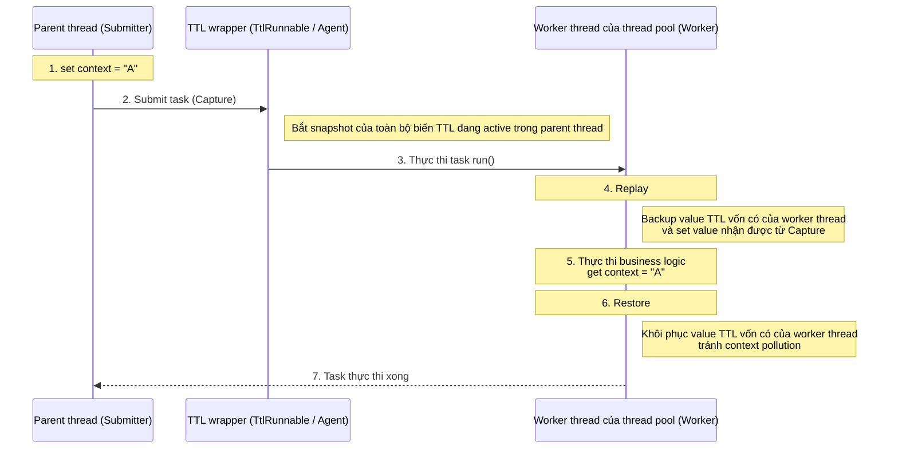

<!-- @include: @article-header.snippet.md -->

## ThreadLocal

### ThreadLocal dùng để làm gì?

Thông thường, biến chúng ta tạo có thể được bất kỳ thread nào truy cập và sửa đổi. Điều này có thể gây ra data race và vấn đề thread safety trong môi trường nhiều thread. Vậy, **nếu muốn mỗi thread có một local variable riêng thì phải thực hiện thế nào?**

JDK cung cấp class `ThreadLocal` để giải quyết vấn đề này. **Class `ThreadLocal` cho phép mỗi thread gắn với một value riêng**, có thể hình dung nó như một "hộp chứa dữ liệu". Mỗi thread có một hộp độc lập để lưu private data, bảo đảm dữ liệu giữa các thread không ảnh hưởng lẫn nhau.

Khi tạo một biến `ThreadLocal`, mỗi thread truy cập biến đó sẽ có một bản sao độc lập. Đây cũng là nguồn gốc của tên gọi `ThreadLocal`. Thread có thể dùng method `get()` để lấy bản sao local của mình hoặc dùng method `set()` để sửa value của bản sao đó, từ đó tránh vấn đề thread safety.

Ví dụ đơn giản: giả sử có hai người đi kho báu để thu thập bảo vật. Nếu họ dùng chung một chiếc túi thì chắc chắn sẽ tranh giành; nhưng nếu mỗi người có một chiếc túi riêng thì vấn đề này không xảy ra. Nếu coi hai người này là hai thread, `ThreadLocal` chính là cách tránh để hai thread cạnh tranh cùng một resource.

```java
public class ThreadLocalExample {
    private static ThreadLocal<Integer> threadLocal = ThreadLocal.withInitial(() -> 0);

    public static void main(String[] args) {
        Runnable task = () -> {
            int value = threadLocal.get();
            value += 1;
            threadLocal.set(value);
            System.out.println(Thread.currentThread().getName() + " Value: " + threadLocal.get());
        };

        Thread thread1 = new Thread(task, "Thread-1");
        Thread thread2 = new Thread(task, "Thread-2");

        thread1.start(); // output: Thread-1 Value: 1
        thread2.start(); // output: Thread-2 Value: 1
    }
}
```

### ⭐️ Bạn hiểu nguyên lý ThreadLocal không?

Bắt đầu từ source code của class `Thread`.

```java
public class Thread implements Runnable {
    //......
    // Các value ThreadLocal liên quan đến thread này, do class ThreadLocal quản lý
    ThreadLocal.ThreadLocalMap threadLocals = null;

    // Các value InheritableThreadLocal liên quan đến thread này, do class InheritableThreadLocal quản lý
    ThreadLocal.ThreadLocalMap inheritableThreadLocals = null;
    //......
}
```

Từ source code của class `Thread` ở trên có thể thấy class `Thread` có một biến `threadLocals` và một biến `inheritableThreadLocals`; cả hai đều có type `ThreadLocalMap`. Có thể hiểu `ThreadLocalMap` là một `HashMap` được tùy biến do class `ThreadLocal` triển khai. Mặc định, hai biến này đều là null; chỉ khi thread hiện tại gọi method `set` hoặc `get` của class `ThreadLocal` thì chúng mới được tạo. Thực tế, khi gọi hai method này, ta đang gọi các method `get()` và `set()` tương ứng của class `ThreadLocalMap`.

Method `set()` của class `ThreadLocal`:

```java
public void set(T value) {
    // Lấy thread của request hiện tại
    Thread t = Thread.currentThread();
    // Lấy biến threadLocals bên trong class Thread (cấu trúc hash table)
    ThreadLocalMap map = getMap(t);
    if (map != null)
        // Đưa value cần lưu vào hash table này
        map.set(this, value);
    else
        createMap(t, value);
}
ThreadLocalMap getMap(Thread t) {
    return t.threadLocals;
}
```

Từ những nội dung trên, có thể suy ra: **cuối cùng, value được đặt trong `ThreadLocalMap` của thread hiện tại, không được lưu trên `ThreadLocal`; có thể hiểu `ThreadLocal` chỉ là lớp bọc của `ThreadLocalMap`, truyền value vào đó.** Class `ThreadLocal` có thể lấy object thread hiện tại bằng `Thread.currentThread()`, sau đó truy cập trực tiếp object `ThreadLocalMap` của thread đó thông qua `getMap(Thread t)`.

**Mỗi `Thread` đều có một `ThreadLocalMap`, còn `ThreadLocalMap` có thể lưu cặp key-value với `ThreadLocal` làm key và object `Object` làm value.**

```java
ThreadLocalMap(ThreadLocal<?> firstKey, Object firstValue) {
    //......
}
```

Ví dụ, nếu khai báo hai object `ThreadLocal` trong cùng một thread thì bên trong `Thread` vẫn chỉ dùng một `ThreadLocalMap` duy nhất để lưu dữ liệu. Key của `ThreadLocalMap` là object `ThreadLocal`, còn value là value được đặt bằng method `set` của object `ThreadLocal`.

Cấu trúc dữ liệu `ThreadLocal` như hình dưới:


`ThreadLocalMap` là static inner class của `ThreadLocal`.


### ⭐️ Vấn đề memory leak của ThreadLocal xảy ra như thế nào?

Nguyên nhân cốt lõi của memory leak trong `ThreadLocal` nằm ở cơ chế triển khai bên trong nó.

Từ nội dung trên, ta đã biết mỗi thread duy trì một map có tên `ThreadLocalMap`. Khi dùng `ThreadLocal` để lưu value, thực tế value được lưu trong `ThreadLocalMap` của thread hiện tại; bản thân instance `ThreadLocal` là key, còn value cần lưu là value.

Source code method `set()` của `ThreadLocal` như sau:

```java
public void set(T value) {
    Thread t = Thread.currentThread(); // Lấy thread hiện tại
    ThreadLocalMap map = getMap(t);   // Lấy ThreadLocalMap của thread hiện tại
    if (map != null) {
        map.set(this, value);         // Đặt value
    } else {
        createMap(t, value);          // Tạo ThreadLocalMap mới
    }
}
```

Trong method `set()` và `createMap()` của `ThreadLocalMap`, object `ThreadLocal` không được lưu trực tiếp. Thay vào đó, hash value của `ThreadLocal` được dùng để tính index của array, rồi lưu trong array có type `static class Entry extends WeakReference<ThreadLocal<?>>`.

```java
int i = key.threadLocalHashCode & (len-1);
```

Định nghĩa `Entry` của `ThreadLocalMap`:

```java
static class Entry extends WeakReference<ThreadLocal<?>> {
    Object value;

    Entry(ThreadLocal<?> k, Object v) {
        super(k);
        value = v;
    }
}
```

Cơ chế reference của `key` và `value` trong `ThreadLocalMap`:

- **key là weak reference**: key trong `ThreadLocalMap` là weak reference (`WeakReference<ThreadLocal<?>>`) của `ThreadLocal`. Nghĩa là nếu instance `ThreadLocal` không còn được strong reference nào trỏ tới, garbage collector sẽ thu hồi instance đó ở lần GC tiếp theo, khiến key tương ứng trong `ThreadLocalMap` trở thành `null`.
- **value là strong reference**: ngay cả khi `key` bị GC thu hồi, `value` vẫn được `ThreadLocalMap.Entry` strong reference và không thể bị GC thu hồi.

Sau khi instance `ThreadLocal` mất strong reference, value tương ứng vẫn tồn tại trong `ThreadLocalMap` vì object `Entry` strong reference tới nó. Nếu thread tiếp tục tồn tại, chẳng hạn thread trong thread pool, `ThreadLocalMap` cũng sẽ tồn tại mãi, khiến entry có key là `null` không thể được garbage collection và gây memory leak.

Nói cách khác, memory leak xảy ra khi đồng thời thỏa mãn hai điều kiện:

1. Instance `ThreadLocal` không còn strong reference;
2. Thread tiếp tục tồn tại, khiến `ThreadLocalMap` tồn tại lâu dài.

Mặc dù `ThreadLocalMap` sẽ cố gắng dọn entry có key là null trong các thao tác `get()`, `set()` và `remove()`, cơ chế dọn dẹp này mang tính bị động và không hoàn toàn đáng tin cậy.

**Làm thế nào để tránh memory leak?**

1. Sau khi dùng xong `ThreadLocal`, nhất định phải gọi method `remove()`. Đây là cách an toàn và được khuyến nghị nhất. Method `remove()` sẽ chủ động xóa entry tương ứng khỏi `ThreadLocalMap`, giải quyết triệt để rủi ro memory leak. Ngay cả khi định nghĩa `ThreadLocal` là `static final`, vẫn nên gọi `remove()` sau mỗi lần sử dụng.
2. Trong các trường hợp tái sử dụng thread như thread pool, dùng block `try-finally` để bảo đảm method `remove()` chắc chắn được thực thi ngay cả khi xảy ra exception.

#### Vì sao key của Entry được thiết kế là weak reference?

Đây là một câu hỏi đào sâu kinh điển khi phỏng vấn. Nhiều bạn biết key của `ThreadLocalMap` là weak reference nhưng không rõ **vì sao thiết kế như vậy**, và nếu đổi thành strong reference thì chuyện gì sẽ xảy ra.

Trước tiên hãy xem đầy đủ reference chain. Khi một thread sử dụng `ThreadLocal`, có các quan hệ reference sau:

```
Strong reference (stack/static variable) ──→ instance ThreadLocal
                                                ↑
Thread ──→ ThreadLocalMap ──→ Entry ─── key (WeakReference) ──┘
                              │
                              └─── value (strong reference) ──→ object được lưu thực tế
```

Sau khi hiểu reference chain này, hãy so sánh hai phương án thiết kế:

**Giả sử key dùng strong reference (thực tế không dùng):**

Khi reference `ThreadLocal` trong business code được đặt thành `null` (ví dụ method kết thúc hoặc object bị thu hồi), dù business code không còn cần `ThreadLocal`, vì `Entry` của `ThreadLocalMap` giữ **strong reference** tới key nên instance `ThreadLocal` vẫn không thể bị GC thu hồi. Chỉ cần thread chưa kết thúc, `ThreadLocal` và value tương ứng sẽ luôn tồn tại trong memory, gây memory leak khiến **cả key và value đều không thể thu hồi**.

**Key dùng weak reference (phương án thực tế):**

Khi reference `ThreadLocal` trong business code được đặt thành `null`, vì key của `Entry` là weak reference nên instance `ThreadLocal` sẽ bị thu hồi ở lần GC tiếp theo và key trở thành `null`. Lúc này value vẫn tồn tại (strong reference), nhưng khi `ThreadLocalMap` thực hiện các thao tác `get()`, `set()`, `remove()`, nó sẽ chủ động phát hiện và dọn các "stale entry" (entry hết hạn) có key là `null`, từ đó giải phóng object value.

Nói cách khác, **thiết kế weak reference là một cơ chế phòng thủ dự phòng**: ngay cả khi developer quên gọi `remove()`, GC của JVM kết hợp với logic tự dọn của `ThreadLocalMap` vẫn có cơ hội thu hồi dữ liệu bị leak. Nếu dùng strong reference, một khi quên `remove()` thì hoàn toàn không còn cơ hội khắc phục.

> Cần lưu ý, cơ chế tự dọn này được **kích hoạt bị động** (chỉ tiện thể dọn trong thao tác `get`/`set`/`remove`), không bảo đảm mọi entry hết hạn đều được dọn kịp thời. Vì vậy, **weak reference chỉ làm giảm rủi ro memory leak chứ không loại bỏ hoàn toàn**, vẫn bắt buộc phải gọi `remove()` thủ công.

#### Rủi ro đặc biệt trong thread pool

Ở trên đã nói một trong các điều kiện gây memory leak là "thread tiếp tục tồn tại". Khi dùng `new Thread()` để tạo thread, sau khi thread thực thi xong, nó sẽ bị hủy; `ThreadLocalMap` mà nó giữ cũng được GC thu hồi theo, nên ảnh hưởng của leak tương đối giới hạn.

Nhưng trong **thread pool**, vấn đề bị khuếch đại nghiêm trọng. Core thread trong thread pool mặc định không bị hủy mà được tái sử dụng để thực thi nhiều task khác nhau. Điều này có nghĩa:

1. **Memory leak có thể tích lũy**: nếu task liên tục tạo `ThreadLocal` tạm thời mới hoặc dùng nhiều `ThreadLocal` nhưng không dọn dẹp, sau khi key mất strong reference bị thu hồi, value tương ứng vẫn có thể còn lại trong `ThreadLocalMap` của thread được tái sử dụng. Với cùng một `ThreadLocal` vẫn reachable, việc gọi `set()` lặp lại thường thay value cũ, nhưng value mới nhất vẫn tiếp tục được giữ cho đến khi bị ghi đè, xóa, dọn hoặc thread kết thúc.
2. **Data pollution (dữ liệu bẩn)**: nếu value `ThreadLocal` do task trước đặt không được dọn, task tiếp theo được phân cho cùng thread có thể đọc value còn sót lại. Điều này có thể gây lỗi business logic nghiêm trọng, chẳng hạn request của user A đọc được thông tin identity của user B.

**Case sự cố thực tế của đội kỹ thuật Meituan:**

Trong bài viết ["Nguyên lý triển khai thread pool Java và thực tiễn trong business Meituan"](https://tech.meituan.com/2020/04/02/java-pooling-pratice-in-meituan.html), đội kỹ thuật Meituan đã ghi lại một sự cố production do dùng `ThreadLocal` không đúng: trong một ứng dụng Web truyền user context qua `ThreadLocal`, vì dùng thread pool để xử lý request nhưng không dọn `ThreadLocal` sau khi request kết thúc, **khi request sau tái sử dụng cùng thread, nó đọc được user information còn sót lại từ request trước**, gây lỗi nghiêm trọng về việc lẫn dữ liệu user.

#### Quy định bắt buộc trong Java Development Manual của Alibaba

Chính vì tổ hợp thread pool + `ThreadLocal` rất dễ gây lỗi, Java Development Manual của Alibaba đã đưa ra yêu cầu ở mức **bắt buộc** trong chương "Concurrent processing":

> **【Bắt buộc】** Phải thu hồi value của thread hiện tại được ghi bởi biến `ThreadLocal` tự định nghĩa, đặc biệt trong trường hợp thread pool, vì thread thường xuyên được tái sử dụng. Nếu không dọn biến `ThreadLocal` tự định nghĩa, nó có thể ảnh hưởng đến business logic tiếp theo và gây memory leak. Nên dùng block `try-finally` trong proxy để thu hồi.

Pattern sử dụng đúng như sau:

```java
// Định nghĩa là static final để tránh tạo lặp instance ThreadLocal
private static final ThreadLocal<UserContext> userContextHolder = new ThreadLocal<>();

public void processRequest(HttpServletRequest request) {
    try {
        // Đặt value trong block try
        UserContext context = buildUserContext(request);
        userContextHolder.set(context);

        // Thực thi business logic
        doBusinessLogic();
    } finally {
        // Bắt buộc dọn trong block finally, bảo đảm luôn thực thi dù có exception hay không
        userContextHolder.remove();
    }
}
```

Có ba điểm quan trọng:

1. **Khai báo `ThreadLocal` là `static final`**: bảo đảm field tương ứng chỉ có một instance `ThreadLocal`, không bị tạo lặp ở mỗi lần gọi, tránh instance cũ mất strong reference rồi để lại entry hết hạn; điều này không có nghĩa toàn bộ ứng dụng chỉ được có một instance `ThreadLocal`.
2. **`try-finally` bảo đảm `remove()` luôn được thực thi**: ngay cả khi business logic ném exception, block `finally` vẫn bảo đảm `ThreadLocal` được dọn.
3. **Dọn ngay sau khi dùng xong, không phụ thuộc vào việc ghi đè trước lần dùng tiếp theo**: gọi `set()` trên cùng một `ThreadLocal` sẽ thay value cũ, nhưng trước khi task tiếp theo đến, value cũ vẫn bị thread giữ; nếu code chuyển sang dùng `ThreadLocal` khác, entry hết hạn còn có thể tồn tại lâu dài. Gọi `remove()` trong `finally` sau khi dùng xong giúp tránh kịp thời việc chiếm memory và data pollution.

### ⭐️ Làm thế nào truyền value ThreadLocal qua thread khác?

**Vì sao ThreadLocal mất tác dụng trong bối cảnh bất đồng bộ?**

Value của `ThreadLocal` không nằm trong object `ThreadLocal` mà được lưu trong `Thread`:

```java
Thread → ThreadLocalMap → Entry(ThreadLocal, value)
```

Cấu trúc dữ liệu `ThreadLocal` như hình dưới:


Thực thi bất đồng bộ thường có nghĩa task được chuyển từ thread hiện tại sang thread khác (ví dụ worker thread trong thread pool). Vì mỗi thread duy trì một `ThreadLocalMap` độc lập, mặc định context của `ThreadLocal` không thể tự động truyền trong quá trình thực thi bất đồng bộ.

**Làm thế nào truyền value ThreadLocal qua thread khác?**

Để giải quyết vấn đề này, trong ngành có hai giải pháp chính: một là giải pháp nguyên bản của JDK, một là utility class mã nguồn mở của Alibaba.

1. `InheritableThreadLocal`: class được JDK 1.2 cung cấp, kế thừa từ `ThreadLocal`. Khi dùng `InheritableThreadLocal`, lúc tạo child thread, child thread sẽ kế thừa value `ThreadLocal` của parent thread, nhưng không hỗ trợ truyền value `ThreadLocal` trong bối cảnh thread pool.
2. `TransmittableThreadLocal`: `TransmittableThreadLocal` (viết tắt là TTL) là utility class mã nguồn mở của Alibaba, kế thừa và tăng cường `InheritableThreadLocal`, có thể hỗ trợ truyền value `ThreadLocal` trong bối cảnh thread pool. Địa chỉ project: <https://github.com/alibaba/transmittable-thread-local>.

#### Nguyên lý InheritableThreadLocal

`InheritableThreadLocal` triển khai chức năng kế thừa value `ThreadLocal` của parent thread khi tạo async thread. Class này do đội ngũ JDK cung cấp, thực hiện truyền value `ThreadLocal` lúc tạo thread bằng cách cải tiến class `Thread` trong source package của JDK.

**Value của `InheritableThreadLocal` được lưu ở đâu?**

Một `ThreadLocalMap` mới được thêm vào class `Thread`, có tên `inheritableThreadLocals`; biến này dùng để lưu các value `ThreadLocal` cần truyền qua thread. Cụ thể:

```JAVA
class Thread implements Runnable {
    ThreadLocal.ThreadLocalMap threadLocals = null;
    ThreadLocal.ThreadLocalMap inheritableThreadLocals = null;
}
```

**Truyền value `ThreadLocal` như thế nào?**

Thực hiện bằng cách cải tiến constructor của class `Thread`: khi tạo thread `Thread`, lấy biến `inheritableThreadLocals` của parent thread và gán cho child thread. Code liên quan như sau:

```JAVA
// Constructor của Thread sẽ gọi method init()
private void init(/* ... */) {
    // 1. Lấy parent thread
    Thread parent = currentThread();
    // 2. Gán inheritableThreadLocals của parent thread cho child thread
    if (inheritThreadLocals && parent.inheritableThreadLocals != null)
        this.inheritableThreadLocals =
            ThreadLocal.createInheritedMap(parent.inheritableThreadLocals);
}
```

**Giải pháp `InheritableThreadLocal` có vấn đề gì?**

Nhược điểm của giải pháp này là tính **một lần**, nghĩa là việc copy chỉ xảy ra một lần khi thread được tạo. Tuy nhiên trong phát triển hiện nay, thread pool được sử dụng rất nhiều, còn thread trong thread pool lại được tái sử dụng.

Hãy tưởng tượng task A chạy trong thread 1 và truyền value `ThreadLocal` của nó cho child thread 2 trong thread pool. Sau khi task A kết thúc, thread 1 tạm nghỉ. Tiếp đó task B đến và chạy trong thread 3; thread pool lại tái sử dụng child thread 2 vừa rồi để thực thi một phần task B. Lúc này `ThreadLocal` của child thread 2 vẫn còn data bẩn do task A truyền sang, còn context của task B (trong thread 3) hoàn toàn chưa được truyền. Điều này dẫn đến data pollution và mất context.

#### Nguyên lý TransmittableThreadLocal

JDK mặc định không hỗ trợ truyền value `ThreadLocal` trong bối cảnh thread pool, vì vậy Alibaba đã phát hành một utility có tên `TransmittableThreadLocal` để triển khai chức năng này.

Vì Alibaba không thể sửa source code JDK, TTL khéo léo dùng **Decorator Pattern** để tăng cường task (`Runnable`/`Callable`) hoặc thread pool (`Executor`), chuyển thời điểm truyền context từ "lúc tạo thread" sang "lúc submit và thực thi task".

Logic cốt lõi của TTL có thể tóm tắt thành ba giai đoạn (CRR):

- **Capture (bắt giữ)**: ngay lúc submit task (chẳng hạn gọi `execute`), `TtlRunnable` gọi `TransmittableThreadLocal.Transmitter.capture()`. Thông qua collection `holder` được duy trì bên trong, nó lấy toàn bộ biến TTL đang active trong parent thread hiện tại và lưu vào snapshot.
- **Replay (phát lại)**: trước khi worker thread của thread pool thực thi method `run()`, gọi `replay()`. Method này `set` value trong snapshot vào worker thread hiện tại và backup value cũ vốn có của thread đó.
- **Restore (khôi phục)**: sau khi task thực thi xong, gọi `restore()`. Method này khôi phục worker thread về trạng thái trước khi thực thi dựa trên bản backup, tránh context pollution hoặc memory leak.

Đây là sequence diagram toàn bộ quy trình CRR do TTL chính thức cung cấp:


Khó hiểu phải không? Có thể xem sequence diagram CRR do tôi vẽ dưới đây, trực quan và rõ ràng hơn:



Nói cách khác, bản chất của TTL là Capture context lúc submit task, Replay context trước khi thực thi task, Restore trạng thái thread sau khi task kết thúc, từ đó hỗ trợ an toàn việc truyền `ThreadLocal` trong thread pool.

TTL cung cấp hai cách tích hợp chính, có thể lựa chọn theo yêu cầu về mức độ xâm lấn và chi phí cải tiến.

**1. Explicit wrapper (tích hợp thủ công)**

Dùng `TtlRunnable.get(Runnable)` hoặc `TtlCallable.get(Callable)` để wrapper task; dùng `TtlExecutors.getTtlExecutor(Executor)`, `getTtlExecutorService(...)` để wrapper thread pool. Cách tích hợp này rõ ràng, dễ kiểm soát nhưng cần business code phối hợp nên có mức độ xâm lấn nhất định.

Đoạn code dưới đây cho thấy TTL truyền và cô lập context `ThreadLocal` an toàn qua CRR, đồng thời hỗ trợ thread pool reuse và reject policy.

```java
public class TtlContextHolder {
    private static final Logger log = LoggerFactory.getLogger(TtlContextHolder.class);

    // 1. Dùng static final để bảo đảm instance TTL không bị tạo lặp, tránh memory leak
    // Override method copy (tùy chọn): nếu là reference type, nên triển khai deep copy
    private static final TransmittableThreadLocal<String> CONTEXT = new TransmittableThreadLocal<String>() {
        @Override
        public String copy(String parentValue) {
            // Mặc định trả về reference trực tiếp; nếu là object mutable (như Map), hãy new object mới tại đây
            return parentValue;
        }
    };

    // 2. Khởi tạo thread pool: bảo đảm chỉ được TtlExecutors wrapper một lần
    private static final ExecutorService TTL_EXECUTOR_SERVICE;

    static {
        ExecutorService rawExecutor = new ThreadPoolExecutor(
                2, 4, 60L, TimeUnit.SECONDS,
                new LinkedBlockingQueue<>(1000), (Runnable r) -> new Thread(r, "ttl-worker-" + r.hashCode()),
                new ThreadPoolExecutor.CallerRunsPolicy() // Quan trọng: TTL hỗ trợ hoàn hảo reject policy này
        );
        // Wrapper thread pool gốc
        TTL_EXECUTOR_SERVICE = TtlExecutors.getTtlExecutorService(rawExecutor);
    }

    public static void main(String[] args) throws Exception {
        try {
            // 3. Set context trong parent thread
            CONTEXT.set("value-set-in-parent");
            log.info("Context của parent thread: {}", CONTEXT.get());

            // 4. Dùng Lambda để đơn giản hóa việc submit task
            TTL_EXECUTOR_SERVICE.execute(() -> {
                log.info("Task bất đồng bộ (Runnable) đọc context: {}", CONTEXT.get());
                // Mô phỏng business logic
                // Lưu ý: việc child thread sửa có ảnh hưởng parent thread hay không phụ thuộc copy() có deep copy hay không
                CONTEXT.set("value-modified-in-child");
            });

            Future<String> future = TTL_EXECUTOR_SERVICE.submit(() -> {
                log.info("Task bất đồng bộ (Callable) đọc context: {}", CONTEXT.get());
                return "Success";
            });

            future.get();

            // 5. Kiểm tra context parent thread có bị pollution không
            log.info("Context cuối cùng của parent thread: {}", CONTEXT.get());

        } finally {
            // 6. Dọn context của thread hiện tại (parent thread); context của child thread được cơ chế Restore của TTL tự khôi phục
            CONTEXT.remove();
        }
    }
}
```

Output:

```ba
09:06:31.438 INFO  [main] TtlContextHolder - Context của parent thread: value-set-in-parent
09:06:31.452 INFO  [ttl-worker-1663166483] TtlContextHolder - Task bất đồng bộ (Runnable) đọc context: value-set-in-parent
09:06:31.453 INFO  [ttl-worker-841283083] TtlContextHolder - Task bất đồng bộ (Callable) đọc context: value-set-in-parent
09:06:31.453 INFO  [main] TtlContextHolder - Context cuối cùng của parent thread: value-set-in-parent
```

Nếu muốn chạy thử đoạn code này, nhớ thêm Maven dependency của TTL:

```XML
<dependency>
    <groupId>com.alibaba</groupId>
    <artifactId>transmittable-thread-local</artifactId>
    <version>2.14.4</version>
</dependency>
```

**2. Tích hợp không xâm lấn (Java Agent)**

Thông qua Java Agent, thực hiện bytecode enhancement với các class liên quan đến thread pool trong giai đoạn class loading, tự động weave logic truyền context của TTL, giúp business code không cần sửa. Cách này khiến business code không cần biết TTL tồn tại, nhưng độ phức tạp triển khai tương đối cao.

TTL Agent mặc định sửa các execution component JDK sau:

1. **Thread pool tiêu chuẩn**: `java.util.concurrent.ThreadPoolExecutor` và `java.util.concurrent.ScheduledThreadPoolExecutor`.
2. **Hệ ForkJoin**: `java.util.concurrent.ForkJoinTask` (do đó hỗ trợ transparent `CompletableFuture` và parallel stream `Stream` của Java 8).
3. **Component legacy**: `java.util.TimerTask` (được hỗ trợ từ v2.7.0, bật mặc định từ v2.11.2).

Thêm cấu hình `-javaagent` vào startup parameter của Java:

```bash
# Cấu hình cơ bản
java -javaagent:path/to/transmittable-thread-local-2.x.y.jar \
     -cp classes \
     com.your.app.Main
```

#### Use case

1. **Đánh dấu traffic load test**: trong bối cảnh load test, dùng `ThreadLocal` lưu dấu hiệu load test để phân biệt traffic load test và traffic thật. Nếu dấu hiệu bị mất, traffic load test có thể bị xử lý nhầm như traffic production.
2. **Truyền context**: trong distributed system, truyền thông tin distributed tracing (như Trace ID) hoặc thông tin user context.

#### Tổng kết

Mặc định value của `ThreadLocal` không thể truyền qua thread khác vì value nằm trong `ThreadLocalMap` của **chính từng object `Thread`**, còn parent thread và child thread là hai object khác nhau.

Để giải quyết vấn đề này, có hai giải pháp chính:

1. **`InheritableThreadLocal` của JDK**: lúc **tạo child thread**, nó **copy** value của parent thread sang child thread. Nhưng giải pháp này mất tác dụng trong bối cảnh **thread pool** vì thread pool **tái sử dụng** thread, khiến thread có thể nhận **dữ liệu bẩn** được truyền từ task trước.
2. **`TransmittableThreadLocal` (TTL) của Alibaba**: đây là giải pháp được dùng trong project, chuyên giải quyết vấn đề thread pool. Nguyên lý là lúc **submit task** vào thread pool, nó **capture** value `ThreadLocal` của parent thread và **gắn** vào task. Khi một thread trong thread pool thực thi task này, nó **set** value đã capture vào thread đó, sau khi task thực thi xong thì **dọn** value.

Nói ngắn gọn, **`InheritableThreadLocal` gắn với thread và chỉ có hiệu lực lúc tạo; còn TTL gắn với task và hỗ trợ thread pool hoàn hảo.**

## Thread pool

### Thread pool là gì?

Đúng như tên gọi, thread pool là một resource pool quản lý một nhóm thread. Khi có task cần xử lý, lấy thread trực tiếp từ thread pool để xử lý; sau khi xử lý xong, thread không bị hủy ngay mà chờ task tiếp theo.

### ⭐️ Vì sao phải dùng thread pool?

Chắc hẳn bạn đã gặp kỹ thuật pool hóa rất nhiều: thread pool, database connection pool, HTTP connection pool... đều là ứng dụng của tư tưởng này. Kỹ thuật pool hóa chủ yếu nhằm giảm chi phí lấy resource mỗi lần và nâng cao utilization của resource.

Thread pool cung cấp cách giới hạn và quản lý resource, bao gồm cả việc thực thi task. Mỗi thread pool còn duy trì một số statistic cơ bản, chẳng hạn số task đã hoàn tất. Dùng thread pool chủ yếu mang lại các lợi ích sau:

1. **Giảm tiêu hao resource**: thread trong thread pool có thể được tái sử dụng. Khi thread hoàn thành một task, nó không bị hủy ngay mà quay lại pool chờ task tiếp theo. Điều này tránh overhead do tạo và hủy thread liên tục.
2. **Tăng tốc độ response**: thread pool thường duy trì một số core thread nhất định (hay còn gọi là "worker thường trực"). Khi task đến, có thể giao trực tiếp cho các thread đang tồn tại và idle này thực thi, bỏ qua thời gian tạo thread để task được xử lý nhanh hơn.
3. **Tăng khả năng quản lý thread**: thread pool cho phép quản lý thống nhất các thread trong pool. Có thể cấu hình kích thước thread pool (số core thread, số thread tối đa), type và size của task queue, reject policy... để kiểm soát tổng số concurrent thread, tránh cạn resource và bảo đảm ổn định hệ thống. Thread pool thường cũng cung cấp monitoring interface để theo dõi trạng thái hoạt động (chẳng hạn có bao nhiêu active thread, bao nhiêu task đang xếp hàng), thuận tiện cho tuning.

### Tạo thread pool như thế nào?

Trong Java, chủ yếu có hai cách tạo thread pool:

**Cách một: tạo trực tiếp qua constructor `ThreadPoolExecutor` (khuyến nghị)**


Trong hình, "thread factory mặc định" và "reject policy mặc định" có nghĩa là khi constructor hiện tại không nhận rõ parameter tương ứng, `ThreadPoolExecutor` sẽ dùng implementation mặc định; không phải method và mô tả bị lệch.

Đây là cách được khuyến nghị nhất vì cho phép developer chỉ định rõ parameter cốt lõi của thread pool, kiểm soát tinh hơn behavior khi thread pool chạy, từ đó tránh rủi ro cạn resource.

**Cách hai: tạo qua utility class `Executors` (không khuyến nghị dùng trong production)**

Các method tạo thread pool do utility class `Executors` cung cấp như hình dưới:


Có thể thấy utility class `Executors` tạo được nhiều type thread pool:

- `FixedThreadPool`: khi chạy bình thường sử dụng nhiều nhất một số lượng worker thread cố định. Thread có thể được thay thế sau khi kết thúc bất thường; khi thread pool đóng, các thread cũng thoát, vì vậy số lượng không phải lúc nào cũng bất biến trong toàn bộ lifecycle. Khi submit task mới, nếu thread pool có idle thread thì thực thi ngay; nếu không, task mới được tạm lưu trong task queue và xử lý khi có thread idle.
- `SingleThreadExecutor`: thread pool chỉ có một thread. Nếu có nhiều hơn một task được submit, task được lưu trong task queue và thực thi theo thứ tự FIFO khi thread idle.
- `CachedThreadPool`: thread pool có thể điều chỉnh số lượng thread theo tình hình thực tế. Số thread không cố định; nếu có idle thread có thể reuse thì ưu tiên dùng thread đó. Nếu mọi thread đều đang làm việc mà có task mới được submit thì tạo thread mới xử lý. Sau khi hoàn thành task hiện tại, mọi thread quay lại thread pool để reuse.
- `ScheduledThreadPool`: thread pool chạy task sau một delay nhất định hoặc chạy task định kỳ.

### ⭐️ Vì sao không khuyến nghị dùng thread pool built-in?

Trong chương "Concurrent processing" của Java Development Manual của Alibaba, tài liệu chỉ rõ resource thread phải được cung cấp qua thread pool, không cho phép tự tạo thread một cách explicit trong application.

**Vì sao?**

> Lợi ích của thread pool là giảm thời gian và system resource overhead tiêu tốn khi tạo, hủy thread, đồng thời giải quyết vấn đề thiếu resource. Nếu không dùng thread pool, hệ thống có thể tạo rất nhiều thread cùng loại, dẫn đến hết memory hoặc xảy ra vấn đề "context switch quá mức".

Ngoài ra, Java Development Manual của Alibaba bắt buộc thread pool không được tạo bằng `Executors` mà phải dùng constructor của `ThreadPoolExecutor`. Cách này giúp người viết hiểu rõ hơn rule hoạt động của thread pool và tránh rủi ro cạn resource.

Nhược điểm của object thread pool do `Executors` trả về như sau (sẽ giải thích chi tiết ở phần sau):

- `FixedThreadPool` và `SingleThreadExecutor`: dùng blocking queue `LinkedBlockingQueue`, độ dài tối đa của task queue là `Integer.MAX_VALUE`, có thể xem là unbounded, dễ tích lũy rất nhiều request và gây OOM.
- `CachedThreadPool`: dùng synchronous queue `SynchronousQueue`, số thread được phép tạo là `Integer.MAX_VALUE`. Nếu có quá nhiều task và tốc độ thực thi chậm, có thể tạo rất nhiều thread và gây OOM.
- `ScheduledThreadPool` và `SingleThreadScheduledExecutor`: dùng unbounded delayed blocking queue `DelayedWorkQueue`, độ dài tối đa của task queue là `Integer.MAX_VALUE`, dễ tích lũy rất nhiều request và gây OOM.

```java
public static ExecutorService newFixedThreadPool(int nThreads) {
    // Độ dài mặc định của LinkedBlockingQueue là Integer.MAX_VALUE, có thể xem là unbounded
    return new ThreadPoolExecutor(nThreads, nThreads,0L, TimeUnit.MILLISECONDS,new LinkedBlockingQueue<Runnable>());

}

public static ExecutorService newSingleThreadExecutor() {
    // Độ dài mặc định của LinkedBlockingQueue là Integer.MAX_VALUE, có thể xem là unbounded
    return new FinalizableDelegatedExecutorService (new ThreadPoolExecutor(1, 1,0L, TimeUnit.MILLISECONDS,new LinkedBlockingQueue<Runnable>()));

}

// SynchronousQueue không có capacity, số thread tối đa là Integer.MAX_VALUE`
public static ExecutorService newCachedThreadPool() {

    return new ThreadPoolExecutor(0, Integer.MAX_VALUE,60L, TimeUnit.SECONDS,new SynchronousQueue<Runnable>());

}

// DelayedWorkQueue (delayed blocking queue)
public static ScheduledExecutorService newScheduledThreadPool(int corePoolSize) {
    return new ScheduledThreadPoolExecutor(corePoolSize);
}
public ScheduledThreadPoolExecutor(int corePoolSize) {
    super(corePoolSize, Integer.MAX_VALUE, 0, NANOSECONDS,
          new DelayedWorkQueue());
}
```

### ⭐️ Thread pool thường có những parameter nào? Giải thích thế nào?

```java
    /**
     * Tạo ThreadPoolExecutor mới với các parameter ban đầu được cung cấp.
     */
    public ThreadPoolExecutor(int corePoolSize,// số core thread của thread pool
                              int maximumPoolSize,// số thread tối đa của thread pool
                              long keepAliveTime,// khi số thread lớn hơn số core thread, thời gian sống tối đa của idle thread dư thừa
                              TimeUnit unit,// time unit
                              BlockingQueue<Runnable> workQueue,// task queue dùng để lưu task đang chờ thực thi
                              ThreadFactory threadFactory,// thread factory dùng để tạo thread, thường dùng mặc định là được
                              RejectedExecutionHandler handler// reject policy; khi task submit quá nhiều và không thể xử lý kịp, có thể tùy chỉnh policy
                               ) {
        if (corePoolSize < 0 ||
            maximumPoolSize <= 0 ||
            maximumPoolSize < corePoolSize ||
            keepAliveTime < 0)
            throw new IllegalArgumentException();
        if (workQueue == null || threadFactory == null || handler == null)
            throw new NullPointerException();
        this.corePoolSize = corePoolSize;
        this.maximumPoolSize = maximumPoolSize;
        this.workQueue = workQueue;
        this.keepAliveTime = unit.toNanos(keepAliveTime);
        this.threadFactory = threadFactory;
        this.handler = handler;
    }
```

Ba parameter quan trọng nhất của `ThreadPoolExecutor`:

- `corePoolSize`: mặc định, số thread được giữ lại trong thread pool ngay cả khi idle; khi core thread timeout chưa được bật và số worker thread nhỏ hơn giá trị này, task mới sẽ ưu tiên trigger việc tạo thread.
- `maximumPoolSize`: số worker thread tối đa mà thread pool cho phép tồn tại.
- `workQueue`: sau khi số worker thread đạt `corePoolSize`, task mới trước tiên sẽ thử vào queue; chỉ khi enqueue thất bại và số worker thread nhỏ hơn `maximumPoolSize`, thread pool mới tiếp tục tạo thread.

Các parameter thường gặp khác của `ThreadPoolExecutor`:

- `keepAliveTime`: khi số thread trong thread pool lớn hơn `corePoolSize`, tức có non-core thread (thread ngoài core thread trong thread pool), non-core thread sẽ không bị hủy ngay khi idle mà chờ đến khi thời gian chờ vượt `keepAliveTime` mới bị thu hồi và hủy.
- `unit`: time unit của parameter `keepAliveTime`.
- `threadFactory`: được dùng khi executor tạo thread mới.
- `handler`: reject policy (sẽ giải thích riêng chi tiết ở phần sau).

Hình dưới giúp hiểu sâu hơn quan hệ giữa các parameter trong thread pool (nguồn ảnh: "Thực chiến tuning performance Java"):


### Core thread của thread pool có bị thu hồi không?

Mặc định, `ThreadPoolExecutor` không thu hồi core thread, ngay cả khi chúng đã idle. Điều này nhằm giảm overhead tạo thread vì core thread thường cần được giữ active lâu dài. Tuy nhiên, nếu thread pool được dùng trong scenario chạy định kỳ với tần suất thấp (giữa các chu kỳ có khoảng idle rõ ràng), có thể cân nhắc đặt parameter của method `allowCoreThreadTimeOut(boolean value)` thành `true`, khi đó idle core thread cũng được thu hồi (khoảng thời gian do `keepAliveTime` chỉ định).

```java
public void allowCoreThreadTimeOut(boolean value) {
    // keepAliveTime của core thread phải lớn hơn 0 mới bật được cơ chế timeout
    if (value && keepAliveTime <= 0) {
        throw new IllegalArgumentException("Core threads must have nonzero keep alive times");
    }
    // Set value của allowCoreThreadTimeOut
    if (value != allowCoreThreadTimeOut) {
        allowCoreThreadTimeOut = value;
        // Nếu bật cơ chế timeout, dọn mọi idle thread, bao gồm core thread
        if (value) {
            interruptIdleWorkers();
        }
    }
}
```

### Core thread ở trạng thái nào khi idle?

Khi idle, core thread có hai trạng thái sau:

- **Đã set thời gian sống của core thread**: khi idle, core thread ở trạng thái `WAITING` để chờ lấy task. Nếu thời gian block wait vượt thời gian sống của core thread, thread sẽ thoát khỏi việc chạy, bị xóa khỏi tập worker thread của thread pool và chuyển sang trạng thái `TERMINATED`.
- **Chưa set thời gian sống của core thread**: khi idle, core thread luôn ở trạng thái `WAITING` để chờ lấy task và tiếp tục tồn tại trong thread pool.

Khi queue có task khả dụng, thread đang bị block sẽ được đánh thức; trạng thái thread chuyển từ `WAITING` sang `RUNNABLE`, sau đó thực thi task tương ứng.

Tiếp theo, hãy tìm hiểu thread pool bên trong hoạt động thế nào qua source code liên quan.

Thread bên trong thread pool được abstract thành `Worker`; sau khi `Worker` được start, nó liên tục lấy task từ task queue.

Khi lấy task, behavior lấy task từ task queue (`BlockingQueue`) được quyết định dựa trên value `timed`.

Nếu **đã set thời gian sống của core thread** hoặc **số thread vượt số core thread**, `timed` được đánh dấu là `true`, nghĩa là khi lấy task phải dùng `poll()` với timeout chỉ định.

- `timed == true`: dùng `poll(timeout, unit)` để lấy task. Nếu timeout khi dùng method này, thread hiện tại sẽ thoát (`TERMINATED`) và bị xóa khỏi thread pool.
- `timed == false`: dùng `take()` để lấy task. Method `take()` khiến thread hiện tại block chờ liên tục (`WAITING`).

Source code như sau:

```JAVA
// ThreadPoolExecutor
private Runnable getTask() {
    boolean timedOut = false;
    for (;;) {
        // ...

        // 1. Nếu đã set thời gian sống của core thread hoặc số thread vượt số core thread, timed là true.
        boolean timed = allowCoreThreadTimeOut || wc > corePoolSize;
        // 2. Giảm số thread.
        // wc > maximuimPoolSize: số thread trong thread pool vượt số thread tối đa; wc là số thread trong thread pool.
        // timed && timeOut: timeOut biểu thị việc lấy task bị timeout.
        // Có hai trường hợp: core thread được set thời gian sống và lấy task bị timeout thì giảm số thread; số thread vượt số core thread và lấy task bị timeout thì giảm số thread.
        if ((wc > maximumPoolSize || (timed && timedOut))
            && (wc > 1 || workQueue.isEmpty())) {
            if (compareAndDecrementWorkerCount(c))
                return null;
            continue;
        }
        try {
            // 3. Nếu timed là true thì dùng poll() lấy task; ngược lại dùng take() lấy task.
            Runnable r = timed ?
                workQueue.poll(keepAliveTime, TimeUnit.NANOSECONDS) :
                workQueue.take();
            // 4. Trả về sau khi lấy được task.
            if (r != null)
                return r;
            timedOut = true;
        } catch (InterruptedException retry) {
            timedOut = false;
        }
    }
}
```

### ⭐️ Thread pool có những reject policy nào?

Khi số thread đang chạy đồng thời đạt số thread tối đa và queue cũng đã đầy task, `ThreadPoolExecutor` định nghĩa các policy sau:

- `ThreadPoolExecutor.AbortPolicy`: ném `RejectedExecutionException` để từ chối xử lý task mới.
- `ThreadPoolExecutor.CallerRunsPolicy`: dùng thread của caller để chạy task, tức chạy (`run`) task bị từ chối trực tiếp trong thread gọi method `execute`; nếu executor đã đóng thì bỏ task. Vì vậy policy này làm giảm tốc độ submit task mới và ảnh hưởng performance tổng thể. Nếu application chịu được delay này và yêu cầu mọi request task đều phải được thực thi thì có thể chọn policy này.
- `ThreadPoolExecutor.DiscardPolicy`: không xử lý task mới mà bỏ trực tiếp.
- `ThreadPoolExecutor.DiscardOldestPolicy`: policy này bỏ request task chưa xử lý sớm nhất.

Ví dụ: khi Spring tạo thread pool qua `ThreadPoolTaskExecutor`, hoặc ta trực tiếp tạo thread pool qua constructor của `ThreadPoolExecutor`, nếu không chỉ định reject policy `RejectedExecutionHandler`, mặc định sẽ dùng `AbortPolicy`. Với policy này, khi queue đầy, `ThreadPoolExecutor` ném `RejectedExecutionException` để từ chối task mới, nghĩa là task đó sẽ không được xử lý. Nếu muốn tránh bỏ task trực tiếp khi thread pool vẫn đang chạy, có thể dùng `CallerRunsPolicy`, đưa task về cho thread gọi `execute()` thực thi; nếu thread pool đã đóng, policy này vẫn bỏ task.

```java
public static class CallerRunsPolicy implements RejectedExecutionHandler {

        public CallerRunsPolicy() { }

        public void rejectedExecution(Runnable r, ThreadPoolExecutor e) {
            if (!e.isShutdown()) {
                // Thực thi bằng main thread, không phải thread trong thread pool
                r.run();
            }
        }
    }
```

### Nếu muốn hạn chế tối đa việc bỏ task khi bị bão hòa thì nên chọn reject policy nào?

Trong scenario thread pool vẫn đang chạy và caller thread có thể chấp nhận thực thi task đồng bộ, có thể cân nhắc `CallerRunsPolicy`. Policy này không bảo đảm "không bỏ task trong mọi trường hợp": sau khi thread pool đóng, task sẽ bị bỏ; process crash cũng không thể dùng reject policy trong memory để khôi phục task. Khi cần bảo đảm mạnh, phải kết hợp persistence hoặc message queue.

Hãy xem source code của `CallerRunsPolicy`:

```java
public static class CallerRunsPolicy implements RejectedExecutionHandler {

        public CallerRunsPolicy() { }


        public void rejectedExecution(Runnable r, ThreadPoolExecutor e) {
            // Chỉ cần application hiện tại chưa đóng thì dùng thread gọi execute để thực thi task
            if (!e.isShutdown()) {

                r.run();
            }
        }
    }
```

Có thể thấy từ source code, chỉ cần application hiện tại chưa đóng thì thread thực thi method `execute` sẽ thực thi task đó.

### Reject policy CallerRunsPolicy có rủi ro gì? Giải quyết thế nào?

Như đã nói ở trên: nếu muốn dùng caller thread tạo backpressure khi thread pool bão hòa và hạn chế tối đa việc bỏ task trực tiếp, `CallerRunsPolicy` là một lựa chọn.

Tuy nhiên, nếu task rơi vào `CallerRunsPolicy` là task rất tốn thời gian, trong khi thread submit task là main thread, main thread có thể bị block và ảnh hưởng hoạt động bình thường của application.

Ví dụ đơn giản: thread pool này giới hạn số thread tối đa là 2, blocking queue có size 1 (nghĩa là task thứ 4 sẽ đi vào reject policy), `ThreadUtil` là utility class do Hutool cung cấp:

```java
public class ThreadPoolTest {

    private static final Logger log = LoggerFactory.getLogger(ThreadPoolTest.class);

    public static void main(String[] args) {
        // Tạo thread pool có 1 core thread và tối đa 2 thread
        // Khi số thread lớn hơn số core thread, idle thread dư thừa có thời gian sống tối đa 60 giây,
        // task queue là ArrayBlockingQueue có capacity 1, saturation policy là CallerRunsPolicy.
        ThreadPoolExecutor threadPoolExecutor = new ThreadPoolExecutor(1,
                2,
                60,
                TimeUnit.SECONDS,
                new ArrayBlockingQueue<>(1),
                new ThreadPoolExecutor.CallerRunsPolicy());

        // Submit task thứ nhất, do core thread thực thi
        threadPoolExecutor.execute(() -> {
            log.info("Core thread thực thi task thứ nhất");
            ThreadUtil.sleep(1, TimeUnit.MINUTES);
        });

        // Submit task thứ hai; vì core thread đang bận, task sẽ vào queue chờ
        threadPoolExecutor.execute(() -> {
            log.info("Non-core thread xử lý task thứ hai đã vào queue");
            ThreadUtil.sleep(1, TimeUnit.MINUTES);
        });

        // Submit task thứ ba; vì core thread đang bận và queue đã đầy, tạo non-core thread xử lý
        threadPoolExecutor.execute(() -> {
            log.info("Non-core thread xử lý task thứ ba");
            ThreadUtil.sleep(1, TimeUnit.MINUTES);
        });

        // Submit task thứ tư; vì cả core và non-core thread đều bận, queue cũng đầy, theo CallerRunsPolicy, thread submit task (main thread) sẽ thực thi task
        threadPoolExecutor.execute(() -> {
            log.info("Main thread xử lý task thứ tư");
            ThreadUtil.sleep(2, TimeUnit.MINUTES);
        });

        // Submit task thứ năm; main thread bị task thứ tư block nên task này phải chờ main thread chạy xong mới submit được
        threadPoolExecutor.execute(() -> {
            log.info("Core thread thực thi task thứ năm");
        });

        // Đóng thread pool
        threadPoolExecutor.shutdown();
    }
}

```

Output:

```bash
18:19:48.203 INFO  [pool-1-thread-1] c.j.concurrent.ThreadPoolTest - Core thread thực thi task thứ nhất
18:19:48.203 INFO  [pool-1-thread-2] c.j.concurrent.ThreadPoolTest - Non-core thread xử lý task thứ ba
18:19:48.203 INFO  [main] c.j.concurrent.ThreadPoolTest - Main thread xử lý task thứ tư
18:20:48.212 INFO  [pool-1-thread-2] c.j.concurrent.ThreadPoolTest - Non-core thread xử lý task thứ hai trong queue
18:21:48.219 INFO  [pool-1-thread-2] c.j.concurrent.ThreadPoolTest - Core thread thực thi task thứ năm
```

Từ output có thể thấy do reject policy `CallerRunsPolicy`, task tốn thời gian được main thread thực thi, khiến thread pool bị block và task tiếp theo không thể thực thi kịp thời; trong trường hợp nghiêm trọng rất có thể gây OOM.

Tiếp cận từ bản chất vấn đề, caller chọn `CallerRunsPolicy` vì muốn mọi task đều được thực thi; task tạm thời chưa xử lý được được giữ trong blocking queue `BlockingQueue`. Khi memory cho phép, có thể tăng size của blocking queue `BlockingQueue` và điều chỉnh heap memory để chứa nhiều task hơn, bảo đảm task được thực thi chính xác.

Để tận dụng CPU, cũng có thể điều chỉnh parameter `maximumPoolSize` (số thread tối đa), qua đó tăng tốc độ xử lý task và tránh quá nhiều task tích lũy trong `BlockingQueue` làm hết memory.


Nếu resource của server đã đạt giới hạn có thể sử dụng, điều đó có nghĩa cần thay đổi scheduling strategy của thread pool. Bản chất khiến main thread bị treo là vì ta không muốn bỏ bất kỳ task nào. Đổi hướng suy nghĩ: có cách nào vừa bảo đảm task không bị bỏ, vừa xử lý kịp thời khi server còn capacity không?

Một hướng là **lưu trữ task**. Việc lưu trữ task ở đây bao gồm nhưng không giới hạn ở:

1. Thiết kế một task table để lưu task vào database MySQL.
2. Cache task bằng Redis.
3. Submit task vào message queue.

Lấy phương án một làm ví dụ, logic triển khai đơn giản như sau:

1. Implement interface `RejectedExecutionHandler` để custom reject policy; policy này chịu trách nhiệm lưu vào database các task mà thread pool tạm thời không xử lý được (lúc này blocking queue đã đầy), tức lưu vào MySQL. Lưu ý: task thread pool tạm thời không xử lý được trước tiên được đặt vào blocking queue; chỉ khi queue đầy mới trigger reject policy.
2. Kế thừa `BlockingQueue` để implement hybrid blocking queue có chứa `ArrayBlockingQueue` do JDK cung cấp. Đồng thời hybrid blocking queue cần sửa logic lấy task: override method `take()`, ưu tiên đọc task sớm nhất từ database; khi database không có task mới lấy task từ `ArrayBlockingQueue`.


Logic tổng thể tương đối đơn giản, cốt lõi nằm ở custom reject policy và blocking queue. Nhờ vậy, khi thread trong thread pool đạt full load, có thể dùng reject policy để persistence task mới nhất vào database MySQL; khi thread pool có capacity xử lý task, ưu tiên xử lý task trong database để tránh vấn đề "starvation".

Tất nhiên, với vấn đề này cũng có thể tham khảo cách làm của framework phổ biến khác. Lấy Netty làm ví dụ, reject policy của nó trực tiếp tạo thread bên ngoài thread pool để xử lý task. Để bảo đảm xử lý task realtime, cách này có thể cần hardware tốt; đồng thời thread tạo tạm thời không thể được monitoring chính xác:

```java
private static final class NewThreadRunsPolicy implements RejectedExecutionHandler {
    NewThreadRunsPolicy() {
        super();
    }
    public void rejectedExecution(Runnable r, ThreadPoolExecutor executor) {
        try {
            // Tạo temporary thread để xử lý task
            final Thread t = new Thread(r, "Temporary task executor");
            t.start();
        } catch (Throwable e) {
            throw new RejectedExecutionException(
                    "Failed to start a new thread", e);
        }
    }
}
```

ActiveMQ thì cố gắng đưa task vào queue trong thời gian timeout được chỉ định để bảo đảm giao task tối đa:

```java
new RejectedExecutionHandler() {
                @Override
                public void rejectedExecution(final Runnable r, final ThreadPoolExecutor executor) {
                    try {
                        // Block chờ trong thời gian giới hạn, cố gắng delivery tối đa
                        executor.getQueue().offer(r, 60, TimeUnit.SECONDS);
                    } catch (InterruptedException e) {
                        throw new RejectedExecutionException("Interrupted waiting for BrokerService.worker");
                    }
                    throw new RejectedExecutionException("Timed Out while attempting to enqueue Task.");
                }
            });
```

### Những blocking queue nào thường dùng trong thread pool?

Khi task mới đến, trước tiên thread pool kiểm tra số thread đang chạy đã đạt số core thread chưa; nếu đã đạt thì task mới được lưu vào queue.

Các thread pool khác nhau sẽ chọn blocking queue khác nhau, có thể phân tích qua built-in thread pool.

- `LinkedBlockingQueue` có capacity `Integer.MAX_VALUE` (unbounded blocking queue): `FixedThreadPool` và `SingleThreadExecutor`. `FixedThreadPool` nhiều nhất chỉ tạo số thread bằng số core thread (số core thread bằng số thread tối đa), `SingleThreadExecutor` chỉ tạo một thread (số core thread và số thread tối đa đều là 1), vì vậy task queue của cả hai không bao giờ đầy.
- `SynchronousQueue` (synchronous queue): `CachedThreadPool`. `SynchronousQueue` không có capacity, không lưu element; mục đích là với task đã submit, nếu có idle thread thì dùng idle thread xử lý, nếu không thì tạo thread mới xử lý. Nói cách khác, số thread tối đa của `CachedThreadPool` là `Integer.MAX_VALUE`, có thể hiểu số thread mở rộng vô hạn và có thể tạo rất nhiều thread, dẫn đến OOM.
- `DelayedWorkQueue` (delayed queue): `ScheduledThreadPool` và `SingleThreadScheduledExecutor`. Element bên trong `DelayedWorkQueue` không được sắp xếp theo thời điểm đưa vào mà theo độ dài delay của task; bên trong dùng cấu trúc dữ liệu heap, bảo đảm task được dequeue mỗi lần luôn là task có execution time sớm nhất trong queue hiện tại. `DelayedWorkQueue` là unbounded queue. Dù tầng dưới dùng array, khi capacity của array không đủ, nó tự mở rộng, nên queue không bao giờ đầy. Khi task liên tục được submit, tất cả đều được thêm vào queue. Điều này có nghĩa số thread của thread pool không bao giờ vượt số core thread; parameter số thread tối đa không có tác dụng với thread pool dùng queue này.
- `ArrayBlockingQueue` (bounded blocking queue): tầng dưới dùng array; sau khi tạo, capacity không thể thay đổi.

### ⭐️ Bạn hiểu flow xử lý task của thread pool không?


1. Nếu số thread đang chạy nhỏ hơn số core thread thì tạo thread mới để thực thi task.
2. Nếu số thread đang chạy bằng hoặc lớn hơn số core thread nhưng nhỏ hơn số thread tối đa thì đưa task vào task queue chờ thực thi.
3. Nếu đưa task vào task queue thất bại (task queue đã đầy) nhưng số thread đang chạy nhỏ hơn số thread tối đa thì tạo thread mới để thực thi task.
4. Nếu số thread đang chạy đã bằng số thread tối đa, việc tạo thread mới sẽ khiến số thread đang chạy vượt số thread tối đa; khi đó task hiện tại bị từ chối và reject policy gọi method `RejectedExecutionHandler.rejectedExecution()`.

Thêm một câu hỏi nhỏ thú vị: **trước khi submit task, thread pool có thể tạo thread trước không?**

Câu trả lời là có! `ThreadPoolExecutor` cung cấp hai method giúp tạo core thread trước khi submit task, từ đó warm up thread pool:

- `prestartCoreThread()`: start một thread để chờ task; nếu đã đạt số core thread thì method trả về `false`, ngược lại trả về `true`;
- `prestartAllCoreThreads()`: start toàn bộ core thread và trả về số core thread start thành công.

### ⭐️ Thread trong thread pool bị exception thì hủy hay reuse?

Kết luận trực tiếp, cần chia thành hai trường hợp:

- **Submit task bằng `execute()`**: khi task được submit vào thread pool bằng `execute()` và ném exception trong quá trình thực thi, nếu exception này không được bắt bên trong task thì nó khiến thread hiện tại kết thúc; exception được in ra console hoặc log file. Thread pool phát hiện thread kết thúc và tạo thread mới thay thế để giữ nguyên số thread đã cấu hình.
- **Submit task bằng `submit()`**: với task submit bằng `submit()`, nếu xảy ra exception khi task thực thi, exception không được in trực tiếp. Thay vào đó, exception được bọc trong object `Future` do `submit()` trả về. Khi gọi method `Future.get()`, có thể bắt được `ExecutionException`. Trong trường hợp này, thread không kết thúc vì exception mà tiếp tục tồn tại trong thread pool để thực thi task tiếp theo.

Nói ngắn gọn: khi dùng `execute()`, exception chưa được bắt khiến thread kết thúc và thread pool tạo thread mới thay thế; khi dùng `submit()`, exception được bọc trong `Future` và thread tiếp tục được reuse.

Thiết kế này cho phép `submit()` cung cấp cơ chế xử lý lỗi linh hoạt hơn vì caller tự quyết định cách xử lý exception; còn `execute()` phù hợp với scenario không cần quan tâm execution result.

Có thể xem phân tích source code cụ thể trong bài viết này: [Thread trong thread pool sau exception: hủy hay reuse? - JD Technology](https://mp.weixin.qq.com/s/9ODjdUU-EwQFF5PrnzOGfw).

### ⭐️ Đặt tên cho thread pool như thế nào?

Khi khởi tạo thread pool cần đặt tên explicit (set thread pool name prefix), điều này thuận tiện cho việc xác định vấn đề.

Mặc định, tên thread được tạo thường có dạng `pool-1-thread-n`, không mang business meaning và không thuận tiện cho việc xác định vấn đề.

Thông thường có hai cách đặt tên thread trong thread pool:

**1. Dùng `ThreadFactoryBuilder` của Guava**

```java
ThreadFactory threadFactory = new ThreadFactoryBuilder()
                        .setNameFormat(threadNamePrefix + "-%d")
                        .setDaemon(true).build();
ExecutorService threadPool = new ThreadPoolExecutor(corePoolSize, maximumPoolSize, keepAliveTime, TimeUnit.MINUTES, workQueue, threadFactory);
```

**2. Tự implement `ThreadFactory`.**

```java
import java.util.concurrent.ThreadFactory;
import java.util.concurrent.atomic.AtomicInteger;

/**
 * Thread factory đặt tên thread để thuận tiện xác định vấn đề.
 */
public final class NamingThreadFactory implements ThreadFactory {

    private final AtomicInteger threadNum = new AtomicInteger();
    private final String name;

    /**
     * Tạo thread factory của thread pool có tên
     */
    public NamingThreadFactory(String name) {
        this.name = name;
    }

    @Override
    public Thread newThread(Runnable r) {
        Thread t = new Thread(r);
        t.setName(name + " [#" + threadNum.incrementAndGet() + "]");
        return t;
    }
}
```

### Đặt size của thread pool thế nào?

Nhiều người thậm chí có thể nghĩ rằng cấu hình thread pool lớn hơn một chút sẽ tốt hơn! Tôi cho rằng điều này rõ ràng có vấn đề. Lấy một ví dụ rất quen thuộc trong đời sống: **không phải càng đông người thì làm việc càng tốt, vì chi phí giao tiếp sẽ tăng. Một việc vốn chỉ cần 3 người, nếu cố kéo 6 người vào thì hiệu suất có tăng không? Tôi nghĩ là không.** Ảnh hưởng của số thread quá nhiều cũng giống như việc phân công quá nhiều người làm một việc; trong bối cảnh nhiều thread, chủ yếu là tăng chi phí **context switch**. Nếu chưa rõ context switch là gì, có thể xem phần giới thiệu dưới đây.

> Context switch:
>
> Trong lập trình nhiều thread, số thread thường lớn hơn số core CPU, trong khi tại mỗi thời điểm một core CPU chỉ được một thread sử dụng. Để các thread đều được thực thi hiệu quả, CPU chia time slice cho từng thread và thực hiện luân phiên. Khi time slice của một thread dùng hết, thread đó trở về trạng thái ready để nhường cho thread khác; quá trình này là một context switch. Nói khái quát, trước khi task hiện tại chuyển từ time slice của CPU sang task khác, nó phải lưu state của mình để lần sau khi chuyển lại có thể load state đó. **Quá trình từ lưu đến load lại task là một context switch**.
>
> Context switch thường là thao tác tiêu tốn nhiều CPU. Nghĩa là nó cần một lượng processor time đáng kể; trong hàng chục hoặc hàng trăm lần switch mỗi giây, mỗi lần switch cần thời gian cỡ nanosecond. Vì vậy, context switch đồng nghĩa với việc hệ thống tiêu tốn nhiều CPU time; trên thực tế, đây có thể là thao tác tốn thời gian nhất trong OS.
>
> So với các OS khác (bao gồm các hệ Unix khác), Linux có nhiều ưu điểm; một trong số đó là chi phí thời gian của context switch và mode switch rất thấp.

Tương tự việc con người hợp tác làm một việc trong thế giới thực, có thể khẳng định thread pool quá lớn hoặc quá nhỏ đều có vấn đề; phù hợp mới là tốt nhất.

- Nếu đặt số thread pool quá nhỏ, khi có nhiều task/request cần xử lý cùng lúc, nhiều request/task có thể phải xếp hàng trong task queue để chờ, thậm chí task/request không thể xử lý sau khi queue đầy, hoặc quá nhiều task tích lũy trong queue gây OOM. Điều này rõ ràng có vấn đề vì CPU chưa được tận dụng đầy đủ.
- Nếu đặt số thread quá lớn, nhiều thread có thể đồng thời tranh giành CPU resource, gây nhiều context switch, từ đó tăng execution time của thread và ảnh hưởng hiệu suất tổng thể.

Có một công thức đơn giản và áp dụng khá rộng:

- **CPU-bound task (N+1):** task này chủ yếu tiêu tốn CPU resource, có thể đặt số thread bằng N (số core CPU) + 1. Thread nhiều hơn số core CPU một thread để tránh ảnh hưởng do page fault bất chợt hoặc nguyên nhân khác khiến task tạm dừng. Khi task tạm dừng, CPU sẽ idle; trong tình huống đó, thread dư ra có thể tận dụng CPU time đang rảnh.
- **I/O-bound task (2N):** khi chạy loại task này, hệ thống dành phần lớn time xử lý I/O interaction; trong thời gian xử lý I/O, thread không chiếm CPU để xử lý, nên có thể nhường CPU cho thread khác. Vì vậy với I/O-bound task, có thể cấu hình nhiều thread hơn, cách tính cụ thể là 2N.

**Làm thế nào phân biệt CPU-bound task và I/O-bound task?**

CPU-bound task có thể hiểu đơn giản là task tận dụng khả năng tính toán của CPU, ví dụ sort một lượng lớn data trong memory. Hễ liên quan đến network read hoặc file read thì đều là I/O-bound; đặc điểm của loại task này là CPU computation time nhỏ hơn nhiều so với thời gian chờ I/O hoàn tất, phần lớn time dùng để chờ I/O hoàn tất.

> 🌈 Mở rộng thêm (tham khảo [issue#1737](https://github.com/Snailclimb/JavaGuide/issues/1737)):
>
> Cách tính số thread nghiêm ngặt hơn là: `Số thread tối ưu = N (số core CPU) ∗ (1+WT (thread waiting time)/ST (thread computation time))`, trong đó `WT (thread waiting time) = tổng runtime của thread - ST (thread computation time)`.
>
> Tỷ lệ thread waiting time càng cao thì cần càng nhiều thread. Tỷ lệ thread computation time càng cao thì cần càng ít thread.
>
> Có thể dùng tool VisualVM đi kèm JDK để xem tỷ lệ `WT/ST`.
>
> Với CPU-bound task, `WT/ST` gần hoặc bằng 0, vì vậy số thread có thể đặt là N (số core CPU) ∗ (1+0) = N, gần tương đương N (số core CPU) + 1 nói ở trên.
>
> Với I/O-bound task, gần như toàn bộ là thread waiting time; về lý thuyết có thể đặt số thread là 2N (theo lý thuyết, kết quả WT/ST phải khá lớn; lý do chọn 2N có lẽ để tránh tạo quá nhiều thread).

Công thức chỉ mang tính tham khảo; cụ thể vẫn cần điều chỉnh động theo tình hình chạy thực tế của project trên production. Giải pháp dynamic configuration parameter của thread pool của Meituan được giới thiệu ở phần sau khá tốt và rất thực tiễn!

### ⭐️ Thay đổi động parameter của thread pool thế nào?

Trong bài viết ["Nguyên lý triển khai thread pool Java và thực tiễn trong business Meituan"](https://tech.meituan.com/2020/04/02/java-pooling-pratice-in-meituan.html), đội kỹ thuật Meituan giới thiệu ý tưởng và cách triển khai custom configuration cho parameter thread pool.

Ý tưởng của đội Meituan chủ yếu là custom configuration cho các parameter cốt lõi của thread pool. Ba parameter cốt lõi là:

- **`corePoolSize`:** mặc định, số thread được giữ trong thread pool ngay cả khi idle; khi số worker thread nhỏ hơn giá trị này, task mới ưu tiên trigger tạo thread.
- **`maximumPoolSize`:** số worker thread tối đa mà thread pool cho phép tồn tại.
- **`workQueue`:** sau khi số worker thread đạt `corePoolSize`, task mới trước tiên thử vào queue; chỉ khi enqueue thất bại mới tiếp tục tạo thread với điều kiện không vượt `maximumPoolSize`.

**Vì sao là ba parameter này?**

Trong bài viết [Giải thích chi tiết thread pool Java](https://javaguide.cn/java/concurrent/java-thread-pool-summary.html), tôi đã nói ba parameter này là parameter quan trọng nhất của `ThreadPoolExecutor`; về cơ bản chúng quyết định strategy xử lý task của thread pool.

**Hỗ trợ dynamic configuration thế nào?** Hãy xem các method dưới đây do `ThreadPoolExecutor` cung cấp.


Đặc biệt cần chú ý `corePoolSize`. Sau khi giảm parameter này trong lúc chạy, các thread hiện có vượt số core thread mới sẽ kết thúc ở lần idle tiếp theo; khi tăng, nếu queue đã có task thì thread pool sẽ tùy nhu cầu mà start thread mới để xử lý.

Ngoài ra, như đã thấy ở trên, không có method dynamic nào chỉ định length của queue. Cách của Meituan là custom một queue tên `ResizableCapacityLinkedBlockingQueue` (chủ yếu bỏ modifier `final` của field `capacity` trong `LinkedBlockingQueue` để nó trở thành mutable).

Hiệu quả cuối cùng của việc dynamic modify parameter thread pool như sau. 👏👏👏


Nếu muốn xem thêm, trong bài ["System design và scenario question tần suất cao khi phỏng vấn backend"](https://javaguide.cn/zhuanlan/back-end-interview-high-frequency-system-design-and-scenario-questions.html), tôi giải thích chi tiết cách thiết kế một dynamic thread pool; đây cũng là một system design question thường gặp khi phỏng vấn.


Nếu project cũng muốn đạt hiệu quả này, có thể dùng project mã nguồn mở có sẵn:

- **[Hippo4j](https://github.com/opengoofy/hippo4j)**: framework async thread pool, hỗ trợ dynamic change, monitoring và alert cho thread pool; dễ tích hợp mà không cần sửa code. Hỗ trợ nhiều mode sử dụng, hướng đến nâng cao khả năng bảo đảm vận hành hệ thống.
- **[Dynamic TP](https://github.com/dromara/dynamic-tp)**: dynamic thread pool lightweight, tích hợp monitoring và alert, quản lý thread pool của middleware bên thứ ba, dựa trên config center phổ biến (đã hỗ trợ Nacos, Apollo, Zookeeper, Consul, Etcd; có thể custom implementation qua SPI).

### ⭐️ Thiết kế thread pool chạy theo priority của task thế nào?

Đây là câu hỏi phỏng vấn thường gặp; bản chất là kiểm tra mức độ nắm vững thread pool và blocking queue của ứng viên.

Ở trên đã nói các thread pool khác nhau chọn blocking queue khác nhau làm task queue. `FixedThreadPool` dùng `LinkedBlockingQueue` có capacity mặc định `Integer.MAX_VALUE`, thường được xem là unbounded queue; trên thực tế gần như không thể làm đầy, nên `FixedThreadPool` thường chỉ tạo `corePoolSize` worker thread.

Nếu cần triển khai priority task thread pool, có thể dùng `PriorityBlockingQueue` (priority blocking queue) làm task queue (constructor của `ThreadPoolExecutor` có parameter `workQueue` để truyền task queue).


`PriorityBlockingQueue` là unbounded blocking queue hỗ trợ priority, có thể xem như `PriorityQueue` thread-safe. Tầng dưới của cả hai đều dùng binary heap dạng min-heap, tức element nhỏ nhất được dequeue trước. Tuy nhiên, `PriorityQueue` không hỗ trợ blocking operation.

Để `PriorityBlockingQueue` sắp xếp task, task truyền vào phải có khả năng sort; có hai cách:

1. Task submit vào thread pool implement interface `Comparable` và override method `compareTo` để chỉ định rule so sánh priority giữa các task.
2. Truyền một object `Comparator` khi tạo `PriorityBlockingQueue` để chỉ định rule sort giữa các task (khuyến nghị).

Tuy nhiên, cách này có một số rủi ro và vấn đề:

- `PriorityBlockingQueue` là unbounded, có thể tích lũy rất nhiều request và gây OOM.
- Có thể gây starvation, tức task priority thấp không được thực thi trong thời gian dài.
- Vì cần sort element trong queue và bảo đảm thread safety (concurrency control dùng `ReentrantLock`), performance sẽ giảm.

Giải quyết OOM khá đơn giản và trực tiếp: kế thừa `PriorityBlockingQueue` rồi override logic của method `offer` (enqueue); khi số element được insert vượt giá trị chỉ định thì trả về `false`.

Vấn đề starvation có thể giải quyết bằng design optimization (hơi phức tạp), chẳng hạn task chờ quá lâu được remove rồi add lại vào queue nhưng priority được nâng lên.

Ảnh hưởng về performance thì không thể tránh vì cần sort task. Hơn nữa, với phần lớn business scenario, mức ảnh hưởng performance này có thể chấp nhận được.

## Future

Trọng tâm là nắm vững cách dùng `CompletableFuture` và các câu hỏi phỏng vấn thường gặp.

Ngoài các câu hỏi dưới đây, cũng khuyến nghị xem bài viết tôi viết: [Giải thích chi tiết CompletableFuture](https://javaguide.cn/java/concurrent/completablefuture-intro.html).

### Interface Future dùng để làm gì?

Interface `Future` là ứng dụng điển hình của tư tưởng bất đồng bộ, chủ yếu dùng trong scenario cần thực thi task tốn thời gian, tránh việc chương trình cứ phải chờ tại chỗ đến khi task hoàn tất khiến hiệu suất thấp. Cụ thể: khi thực thi một task tốn thời gian, có thể giao task đó cho child thread thực thi bất đồng bộ, đồng thời làm việc khác mà không phải ngồi chờ. Sau khi việc của mình xong, lấy execution result của task tốn thời gian qua `Future`. Nhờ vậy execution efficiency của chương trình tăng rõ rệt.

Đây chính là **Future Pattern** kinh điển trong multi-threading. Có thể xem nó là một design pattern với core idea là async call, chủ yếu dùng trong lĩnh vực nhiều thread và không riêng Java mới có.

Trong Java, `Future` là generic interface thuộc package `java.util.concurrent`. Nó có 5 abstract method kinh điển, chủ yếu gồm 4 nhóm chức năng sau; từ JDK 19 bổ sung thêm ba default query method `resultNow()`, `exceptionNow()` và `state()`.

- Hủy task;
- Kiểm tra task có bị hủy hay không;
- Kiểm tra task đã thực thi xong hay chưa;
- Lấy execution result của task.

```java
// V biểu thị type return value của task được Future thực thi
public interface Future<V> {
    // Hủy thực thi task
    // Hủy thành công trả về true, ngược lại trả về false
    boolean cancel(boolean mayInterruptIfRunning);
    // Kiểm tra task có bị hủy hay không
    boolean isCancelled();
    // Kiểm tra task đã thực thi xong hay chưa
    boolean isDone();
    // Lấy execution result của task
    V get() throws InterruptedException, ExecutionException;
    // Nếu không trả về calculation result trong thời gian chỉ định thì ném exception TimeOutException
    V get(long timeout, TimeUnit unit)

        throws InterruptedException, ExecutionException, TimeoutExceptio

}
```

Có thể hiểu đơn giản: có một task và submit cho `Future` xử lý. Trong lúc task thực thi, mình có thể làm bất kỳ việc gì. Đồng thời có thể hủy task hoặc lấy execution status. Sau một khoảng thời gian, có thể trực tiếp lấy execution result của task từ `Future`.

### Callable có quan hệ gì với Future?

Có thể hiểu quan hệ giữa `Callable` và `Future` qua `FutureTask`.

`FutureTask` cung cấp implementation cơ bản của interface `Future`, thường dùng để wrapper `Callable` và `Runnable`; nó có method hủy task, kiểm tra task đã thực thi xong và lấy execution result. Thứ `ExecutorService.submit()` trả về thực tế là implementation class `FutureTask` của `Future`.

```java
<T> Future<T> submit(Callable<T> task);
Future<?> submit(Runnable task);
```

`FutureTask` không chỉ implement interface `Future` mà còn implement interface `Runnable`, vì vậy có thể được thread thực thi trực tiếp như một task.


`FutureTask` có hai constructor, nhận object `Callable` hoặc `Runnable`. Thực tế object `Runnable` truyền vào cũng được chuyển thành object `Callable` bên trong method.

```java
public FutureTask(Callable<V> callable) {
    if (callable == null)
        throw new NullPointerException();
    this.callable = callable;
    this.state = NEW;
}
public FutureTask(Runnable runnable, V result) {
    // Dùng adapter RunnableAdapter để chuyển object Runnable runnable thành object Callable
    this.callable = Executors.callable(runnable, result);
    this.state = NEW;
}
```

`FutureTask` tương đương wrapper của `Callable`, quản lý tình hình thực thi task và lưu execution result của method `call` trong `Callable`.

Có thể xem thêm chi tiết source code của `Future` trong bài phân tích này: [Java triển khai Future Pattern như thế nào? Giải thích chi tiết hàng vạn chữ!](https://juejin.cn/post/6844904199625375757).

### Class CompletableFuture dùng để làm gì?

Trong thực tế sử dụng, `Future` có một số hạn chế, chẳng hạn không hỗ trợ orchestration và composition của async task, method `get()` lấy calculation result là blocking call.

Class `CompletableFuture` được giới thiệu từ Java 8 giải quyết các thiếu sót này của `Future`. Ngoài việc cung cấp các tính năng `Future` tiện dụng và mạnh hơn, `CompletableFuture` còn cung cấp functional programming, orchestration và composition của async task (có thể nối nhiều async task thành một chain call hoàn chỉnh) cùng các khả năng khác.

Hãy xem nhanh định nghĩa class `CompletableFuture`:

```java
public class CompletableFuture<T> implements Future<T>, CompletionStage<T> {
}
```

Có thể thấy `CompletableFuture` đồng thời implement interface `Future` và `CompletionStage`.


Interface `CompletionStage` mô tả một stage của async computation. Nhiều computation có thể chia thành nhiều stage hoặc step; khi đó có thể dùng nó để combine mọi step, tạo thành pipeline của async computation.

Interface `CompletionStage` có khá nhiều method; khả năng functional của `CompletableFuture` được interface này cung cấp. Từ parameter method của interface có thể thấy nó sử dụng rất nhiều functional programming được Java 8 giới thiệu.


### ⭐️ Một task phụ thuộc vào hai task khác hoàn tất rồi mới chạy thì thiết kế thế nào?

Scenario orchestration task này rất phù hợp để triển khai bằng `CompletableFuture`. Giả sử cần T3 chạy sau khi T2 và T1 hoàn tất.

Code như sau (để đơn giản code, dùng utility class thread `ThreadUtil` và utility class date-time `DateUtil` của Hutool):

```java
// T1
CompletableFuture<Void> futureT1 = CompletableFuture.runAsync(() -> {
    System.out.println("T1 is executing. Current time：" + DateUtil.now());
    // Mô phỏng thao tác tốn thời gian
    ThreadUtil.sleep(1000);
});
// T2
CompletableFuture<Void> futureT2 = CompletableFuture.runAsync(() -> {
    System.out.println("T2 is executing. Current time：" + DateUtil.now());
    ThreadUtil.sleep(1000);
});

// Dùng method allOf() combine CompletableFuture của T1 và T2, chờ cả hai hoàn tất
CompletableFuture<Void> bothCompleted = CompletableFuture.allOf(futureT1, futureT2);
// Khi T1 và T2 đều hoàn tất, thực thi T3
bothCompleted.thenRunAsync(() -> System.out.println("T3 is executing after T1 and T2 have completed.Current time：" + DateUtil.now()));
// Chờ mọi task hoàn tất để kiểm tra hiệu quả
ThreadUtil.sleep(3000);
```

`T1` và `T2` được start bằng `runAsync()` ở trên; `allOf()` chỉ combine completion state của chúng: sau khi cả hai hoàn tất mới thực thi T3. Việc có chạy song song hay không phụ thuộc vào cách tạo task và executor, không phải bản thân `allOf()`.

### ⭐️ Khi dùng CompletableFuture, nếu một task thất bại thì xử lý exception thế nào?

Khi dùng `CompletableFuture`, nhất định phải xử lý exception đúng cách để tránh exception bị mất hoặc xuất hiện vấn đề không kiểm soát được.

Một số đề xuất:

- `whenComplete` thực thi callback khi stage hoàn tất bình thường hoặc bất thường, phù hợp để observe result và ghi log exception; mặc định giữ nguyên result hoặc exception của stage ban đầu.
- `exceptionally` chỉ thực thi khi stage hoàn tất bất thường và dùng return value của callback để khôi phục thành result bình thường; nếu cần tiếp tục propagate exception, có thể explicit throw exception trong callback.
- `handle` luôn thực thi dù stage hoàn tất bình thường hay bất thường, đồng thời tạo result mới dựa trên result và exception.
- `CompletableFuture.allOf` chờ nhiều stage hoàn tất; chỉ cần một stage hoàn tất bất thường thì `CompletableFuture` trả về cũng hoàn tất bất thường, nhưng vẫn phải kiểm tra từng stage để lấy result hoặc exception của từng task.
- ……

### ⭐️ Vì sao nên custom thread pool khi dùng CompletableFuture?

Trong implementation mặc định của `CompletableFuture`, các async method không truyền rõ `Executor` thường dùng `ForkJoinPool.commonPool()` dùng chung toàn cục; subclass có thể thay đổi executor mặc định của non-static async method bằng cách override `defaultExecutor()`. Điều này có nghĩa application và library dùng implementation mặc định thường chia sẻ cùng một thread pool.

Mặc dù `ForkJoinPool` rất hiệu quả, khi submit nhiều task đồng thời có thể gây tranh chấp resource và thread starvation, từ đó ảnh hưởng performance hệ thống.

Để tránh các vấn đề này, nên cung cấp custom thread pool cho `CompletableFuture`, mang lại các lợi ích:

- Isolation: phân bổ thread pool riêng cho các task khác nhau, tránh tranh chấp resource của global thread pool.
- Resource control: điều chỉnh size thread pool và type queue theo đặc điểm task để tối ưu performance.
- Exception handling: thông qua custom `ThreadFactory` để xử lý tốt hơn exception trong thread.

```java
private ThreadPoolExecutor executor = new ThreadPoolExecutor(10, 10,
        0L, TimeUnit.MILLISECONDS,
        new LinkedBlockingQueue<Runnable>());

CompletableFuture.runAsync(() -> {
     //...
}, executor);
```

## AQS

Để xem phân tích chi tiết source code AQS, có thể đọc bài viết [Giải thích chi tiết AQS](https://javaguide.cn/java/concurrent/aqs.html).

### AQS là gì?

AQS (`AbstractQueuedSynchronizer`, abstract queue synchronizer) là concurrent component cốt lõi của Java được cung cấp từ JDK 1.5.

AQS giải quyết sự phức tạp khi developer triển khai synchronizer. Nó cung cấp một framework chung để triển khai nhiều synchronizer như **reentrant lock** (`ReentrantLock`), **semaphore** (`Semaphore`) và **countdown timer** (`CountDownLatch`). Bằng cách đóng gói cơ chế thread synchronization tầng dưới, AQS ẩn logic quản lý thread phức tạp, giúp developer chỉ cần tập trung vào synchronization logic cụ thể.

Nói đơn giản, AQS là abstract class cung cấp **execution framework** chung cho synchronizer. Nó định nghĩa **flow chung để acquire và release resource**, còn logic acquire resource cụ thể do synchronizer tương ứng triển khai bằng cách override template method. Vì vậy có thể xem AQS là **"nền tảng" cơ bản** của synchronizer, còn synchronizer là **"ứng dụng" cụ thể** được xây dựng trên AQS.

### ⭐️ Nguyên lý của AQS là gì?

> Lưu ý: `waitStatus`, `Unsafe.compareAndSwapInt()` và các cấu trúc nội bộ, source code fragment dưới đây dựa trên JDK 8. Implementation bên trong AQS tiếp tục tiến hóa: JDK 11 vẫn giữ các structure chính được đề cập trong bài, nhưng field của node và implementation enqueue, wait trong JDK 17 cũng như version hiện tại đã thay đổi lớn; các core idea như synchronization state, wait queue và template method vẫn còn phù hợp.

Core idea của AQS là: nếu shared resource được yêu cầu đang idle, đặt thread đang request resource thành worker thread hợp lệ và đặt shared resource vào locked state. Nếu shared resource đang bị chiếm, cần có cơ chế block thread chờ và phân phối lock khi thread được đánh thức; cơ chế này được AQS triển khai bằng cách tối ưu hơn **CLH lock** (Craig, Landin, and Hagersten locks).

**CLH lock** cải tiến spinlock và dựa trên singly linked list. Trong bối cảnh nhiều thread, các thread request lock được tổ chức thành một queue đơn hướng; mỗi thread chờ sẽ spin để truy cập state của node trước đó, chỉ khi node trước release lock thì node hiện tại mới acquire lock. Cấu trúc queue của **CLH lock** như hình dưới.


**Wait queue** được AQS dùng là một biến thể của CLH lock queue (sau đây gọi tắt là CLH variant queue).

CLH variant queue của AQS là doubly linked queue; các thread tạm thời chưa acquire được lock sẽ được thêm vào queue. Khác biệt chính giữa CLH variant queue và CLH lock queue ban đầu có hai điểm:

- Từ **spin** tối ưu thành **spin + block**: spin có performance cao nhưng spin nhiều sẽ chiếm nhiều CPU resource, nên CLH variant queue trước tiên spin để thử acquire lock; nếu thất bại thì block chờ.
- Từ **single-direction queue** tối ưu thành **double-direction queue**: trong CLH variant queue, thread chờ sẽ bị block; sau khi thread phía trước release lock, cần đánh thức thread phía sau, nên thêm pointer `next` và trở thành doubly linked queue.

AQS đóng gói mỗi thread request shared resource thành một node (Node) của CLH variant queue để triển khai lock allocation. Trong CLH variant queue, một node biểu thị một thread và lưu reference tới thread (`thread`), state của node hiện tại trong queue (`waitStatus`), previous node (`prev`) và next node (`next`).

Cấu trúc CLH variant queue trong AQS như hình dưới:


Sơ đồ nguyên lý cốt lõi của AQS (`AbstractQueuedSynchronizer`):


AQS dùng **int member variable `state` biểu thị synchronization state** và **built-in thread wait queue** để xếp hàng các thread acquire resource.

Biến `state` được modifier `volatile`, dùng để thể hiện tình trạng acquire lock của critical resource hiện tại.

```java
// Shared variable, dùng volatile để bảo đảm thread visibility
private volatile int state;
```

Ngoài ra, có thể thao tác với state `state` thông qua các method `protected` `getState()`, `setState()` và `compareAndSetState()`. Các method này đều có modifier `final`, nên không thể override trong subclass.

```java
// Trả về value hiện tại của synchronization state
protected final int getState() {
     return state;
}
 // Set value của synchronization state
protected final void setState(int newState) {
     state = newState;
}
// Dùng thao tác atomic (CAS) set synchronization state thành update nếu value hiện tại bằng expect (expected value)
protected final boolean compareAndSetState(int expect, int update) {
      return unsafe.compareAndSwapInt(this, stateOffset, expect, update);
}
```

Lấy `ReentrantLock` làm ví dụ: `state` ban đầu là 0, biểu thị unlocked state. Khi thread A gọi `lock()`, nó gọi `tryAcquire()` để exclusive acquire lock và tăng `state` thêm 1. Sau đó các thread khác gọi `tryAcquire()` sẽ thất bại cho đến khi thread A `unlock()` đưa `state` về 0 (tức release lock); lúc đó thread khác mới có cơ hội acquire lock. Tất nhiên, trước khi release lock, thread A có thể tiếp tục acquire lock này nhiều lần (`state` tăng dần), đây là khái niệm reentrant. Nhưng cần chú ý, acquire bao nhiêu lần thì phải release bấy nhiêu lần để bảo đảm `state` quay về 0.

Lấy `CountDownLatch` làm ví dụ khác: `state` được khởi tạo là N, biểu thị cần N lần gọi `countDown()`. N là số event hoặc số lần count, không bắt buộc bằng số thread; một thread có thể gọi nhiều lần, hoặc nhiều thread cùng gọi. Khi `state` trở thành 0, các thread bị block trong wait queue do gọi `await()` sẽ được đánh thức và tiếp tục thực thi.

### Semaphore dùng để làm gì?

`synchronized` và `ReentrantLock` đều chỉ cho phép một thread truy cập resource tại một thời điểm, còn `Semaphore` có thể dùng để kiểm soát số thread đồng thời truy cập resource cụ thể.

Cách dùng `Semaphore` đơn giản. Giả sử có N (N > 5) thread lấy shared resource trong `Semaphore`; code dưới đây cho biết tại cùng một thời điểm, trong N thread chỉ có 5 thread lấy được shared resource, các thread khác sẽ block; chỉ thread lấy được shared resource mới có thể thực thi. Khi một thread release shared resource, thread khác đang block mới có thể lấy được.

```java
// Số lượng shared resource ban đầu
final Semaphore semaphore = new Semaphore(5);
// Acquire 1 permit
semaphore.acquire();
// Release 1 permit
semaphore.release();
```

Khi số permit là 1, `Semaphore` có thể giới hạn số concurrent access là 1, nhưng khác mutex lock: semaphore không có ownership constraint, thread acquire permit và thread release permit có thể không phải cùng một thread.

`Semaphore` có hai mode:

- **Fair mode:** khi có contention, blocking `acquire` method chọn thread theo FIFO tại điểm xếp hàng bên trong; `tryAcquire()` không parameter không tuân theo fairness setting và vẫn có thể chen ngang thành công;
- **Non-fair mode:** mang tính preemptive.

Hai constructor tương ứng của `Semaphore`:

```java
public Semaphore(int permits) {
    sync = new NonfairSync(permits);
}

public Semaphore(int permits, boolean fair) {
    sync = fair ? new FairSync(permits) : new NonfairSync(permits);
}
```

**Cả hai constructor đều phải cung cấp số permit; constructor thứ hai có thể chỉ định fair mode hoặc non-fair mode, mặc định là non-fair mode.**

`Semaphore` thường dùng trong scenario resource có giới hạn rõ ràng về số access, chẳng hạn rate limiting (chỉ giới hạn trong single-node mode; trong project thực tế khuyến nghị dùng Redis + Lua để rate limiting).

### Nguyên lý của Semaphore là gì?

`Semaphore` là một implementation của shared lock. Mặc định nó đặt value `state` của AQS bằng `permits`; có thể hiểu value `permits` là số permit, chỉ thread lấy được permit mới có thể thực thi.

Khi gọi `semaphore.acquire()`, thread thử acquire permit; nếu `state >= 0` thì có thể acquire thành công. Nếu thành công, dùng CAS để sửa value `state` thành `state=state-1`. Nếu `state<0` thì số permit không đủ. Lúc này tạo một Node thêm vào blocking queue và suspend thread hiện tại.

```java
/**
 *  Acquire 1 permit
 */
public void acquire() throws InterruptedException {
    sync.acquireSharedInterruptibly(1);
}
/**
 * Acquire permit ở shared mode; thành công thì return, thất bại thì thêm vào blocking queue và suspend thread
 */
public final void acquireSharedInterruptibly(int arg)
    throws InterruptedException {
    if (Thread.interrupted())
      throw new InterruptedException();
        // Thử acquire permit; arg là số permit cần acquire, nếu số permit khả dụng trừ số permit cần acquire nhỏ hơn 0 thì tạo node thêm vào blocking queue và suspend thread hiện tại.
    if (tryAcquireShared(arg) < 0)
      doAcquireSharedInterruptibly(arg);
}
```

Khi gọi `semaphore.release()`, thread thử release permit và dùng CAS sửa `state` thành `state=state+1`. Sau khi release permit thành công, đồng thời đánh thức một thread trong synchronization queue. Thread được đánh thức sẽ thử sửa lại `state` thành `state=state-1`; nếu `state>=0` thì acquire token thành công, nếu không thì lại vào blocking queue và suspend.

```java
// Release một permit
public void release() {
    sync.releaseShared(1);
}

// Release shared lock, đồng thời đánh thức một thread trong synchronization queue.
public final boolean releaseShared(int arg) {
    // Release shared lock
    if (tryReleaseShared(arg)) {
      // Đánh thức một thread trong synchronization queue
      doReleaseShared();
      return true;
    }
    return false;
}
```

### CountDownLatch dùng để làm gì?

`CountDownLatch` cho phép bất kỳ số lượng thread nào chờ tại `await()`, cho đến khi xảy ra `count` lần gọi `countDown()`. Counter này biểu thị số event hoặc operation, không nhất thiết tương ứng với `count` thread khác nhau.

`CountDownLatch` chỉ dùng một lần; value của counter chỉ được initialize một lần trong constructor, sau đó không có cơ chế set lại value. Sau khi dùng xong `CountDownLatch`, không thể dùng lại.

### Nguyên lý của CountDownLatch là gì?

`CountDownLatch` là implementation của shared-mode synchronizer; khi constructor chạy, nó set `state` của AQS bằng `count`. Mỗi lần gọi `countDown()` sẽ giảm `state` đi 1 thông qua `tryReleaseShared`, cho đến khi bằng 0. Khi gọi `await()`, nếu `state` khác 0 thì thread hiện tại chờ: khi counter về 0, `await()` không parameter return bình thường, bản có timeout trả về `true`; nếu bị interrupt trong thời gian chờ thì ném `InterruptedException`; khi bản có timeout hết hạn thì trả về `false`. Số lần gọi `countDown()` không nhất thiết liên quan đến số thread.

### Bạn đã dùng CountDownLatch chưa? Dùng trong scenario nào?

Tác dụng của `CountDownLatch` là cho phép bất kỳ số lượng thread nào chờ tại một nơi, cho đến khi xảy ra `count` lần gọi `countDown()`. Trước đây trong project có scenario dùng nhiều thread đọc và xử lý nhiều file, tôi đã dùng `CountDownLatch`. Scenario cụ thể như sau:

Cần đọc và xử lý 6 file. 6 task này không phụ thuộc thứ tự thực thi, nhưng khi trả result cho user cần tổng hợp kết quả xử lý của 6 file.

Vì vậy định nghĩa một thread pool và object `CountDownLatch` có count bằng 6. Dùng thread pool xử lý task read; sau khi mỗi thread xử lý xong thì giảm count đi 1 và gọi method `countDown()` của object `CountDownLatch`; chỉ sau khi đọc xong toàn bộ file mới tiếp tục logic phía sau.

Pseudo-code như sau:

```java
public class CountDownLatchExample1 {
    // Số file cần xử lý
    private static final int threadCount = 6;

    public static void main(String[] args) throws InterruptedException {
        // Tạo thread pool có số thread cố định (khuyến nghị tạo bằng constructor)
        ExecutorService threadPool = Executors.newFixedThreadPool(10);
        final CountDownLatch countDownLatch = new CountDownLatch(threadCount);
        for (int i = 0; i < threadCount; i++) {
            final int threadnum = i;
            threadPool.execute(() -> {
                try {
                    // Business operation xử lý file
                    //......
                } catch (InterruptedException e) {
                    e.printStackTrace();
                } finally {
                    // Biểu thị một file đã hoàn tất
                    countDownLatch.countDown();
                }

            });
        }
        countDownLatch.await();
        threadPool.shutdown();
        System.out.println("finish");
    }
}
```

**Có điểm nào cải tiến được không?**

Có thể dùng class `CompletableFuture` để cải tiến! `CompletableFuture` của Java 8 cung cấp nhiều method thân thiện với multi-threading; dùng nó có thể dễ dàng viết multi-thread program, dù async, serial, parallel hay chờ toàn bộ thread hoàn tất task đều rất thuận tiện.

```java
CompletableFuture<Void> task1 =
    CompletableFuture.supplyAsync(()->{
        // Custom business operation
    });
......
CompletableFuture<Void> task6 =
    CompletableFuture.supplyAsync(()->{
    // Custom business operation
    });
......
CompletableFuture<Void> headerFuture=CompletableFuture.allOf(task1,.....,task6);

try {
    headerFuture.join();
} catch (Exception ex) {
    //......
}
System.out.println("all done. ");
```

Code trên còn có thể tối ưu tiếp. Khi có quá nhiều task, liệt kê từng task không thực tế; có thể cân nhắc thêm task bằng loop.

```java
// Vị trí folder
List<String> filePaths = Arrays.asList(...)
// Xử lý bất đồng bộ toàn bộ file
List<CompletableFuture<String>> fileFutures = filePaths.stream()
    .map(filePath -> doSomeThing(filePath))
    .collect(Collectors.toList());
// Combine chúng lại
CompletableFuture<Void> allFutures = CompletableFuture.allOf(
    fileFutures.toArray(new CompletableFuture[fileFutures.size()])
);
```

### CyclicBarrier dùng để làm gì?

`CyclicBarrier` rất giống `CountDownLatch`; nó cũng thực hiện thread coordination wait, nhưng chức năng phức tạp và mạnh hơn `CountDownLatch`. Scenario chính tương tự `CountDownLatch`.

> Implementation của `CountDownLatch` dựa trên AQS, còn `CyclicBarrier` dựa trên `ReentrantLock` (`ReentrantLock` cũng thuộc AQS synchronizer) và `Condition`.

Nghĩa đen của `CyclicBarrier` là barrier có thể dùng tuần hoàn (Cyclic). Nó làm việc sau: khi một nhóm thread đến barrier (cũng có thể gọi là synchronization point), chúng bị block cho đến khi thread cuối cùng đến barrier; lúc đó barrier mở và mọi thread bị barrier chặn mới tiếp tục làm việc.

### Nguyên lý của CyclicBarrier là gì?

Bên trong `CyclicBarrier`, biến `count` được dùng làm counter; value ban đầu của `count` là value initialize của property `parties`. Mỗi khi một thread đến barrier, counter giảm 1. Nếu count bằng 0, nghĩa là thread cuối cùng của generation này đã đến barrier, nó sẽ thử thực thi task truyền vào constructor.

```java
// Số thread bị chặn mỗi lần
private final int parties;
// Counter
private int count;
```

Hãy xem nhanh qua source code.

1. Constructor mặc định của `CyclicBarrier` là `CyclicBarrier(int parties)`, parameter biểu thị số thread bị barrier chặn. Mỗi thread gọi method `await()` để báo với `CyclicBarrier` rằng mình đã đến barrier, sau đó thread hiện tại bị block.

```java
public CyclicBarrier(int parties) {
    this(parties, null);
}

public CyclicBarrier(int parties, Runnable barrierAction) {
    if (parties <= 0) throw new IllegalArgumentException();
    this.parties = parties;
    this.count = parties;
    this.barrierCommand = barrierAction;
}
```

Trong đó, `parties` biểu thị số thread bị chặn; khi số thread bị chặn đạt value này thì mở barrier để mọi thread đi qua.

2. Khi gọi method `await()` trên object `CyclicBarrier`, thực tế nó gọi method `dowait(false, 0L)`. Method `await()` giống như dựng barrier để chặn thread; chỉ khi số thread bị chặn đạt value `parties` thì barrier mới mở và thread mới có thể đi qua để thực thi.

```java
public int await() throws InterruptedException, BrokenBarrierException {
  try {
      return dowait(false, 0L);
  } catch (TimeoutException toe) {
      throw new Error(toe); // cannot happen
  }
}
```

Phân tích source code method `dowait(false, 0L)`:

```java
    // Chỉ khi số thread hoặc request đạt count thì method sau await mới được thực thi. Trong ví dụ trên, count bằng 5.
    private int count;
    /**
     * Main barrier code, covering the various policies.
     */
    private int dowait(boolean timed, long nanos)
        throws InterruptedException, BrokenBarrierException,
               TimeoutException {
        final ReentrantLock lock = this.lock;
        // Lock
        lock.lock();
        try {
            final Generation g = generation;

            if (g.broken)
                throw new BrokenBarrierException();

            // Nếu thread bị interrupt thì ném exception
            if (Thread.interrupted()) {
                breakBarrier();
                throw new InterruptedException();
            }
            // Giảm count đi 1
            int index = --count;
            // Khi count giảm về 0, thread cuối cùng đã đến barrier, đạt điều kiện để thực thi method sau await
            if (index == 0) {  // tripped
                boolean ranAction = false;
                try {
                    final Runnable command = barrierCommand;
                    if (command != null)
                        command.run();
                    ranAction = true;
                    // Reset count về value initialize của property parties
                    // Đánh thức các thread đang chờ trước đó
                    // Bắt đầu đợt thực thi tiếp theo
                    nextGeneration();
                    return 0;
                } finally {
                    if (!ranAction)
                        breakBarrier();
                }
            }

            // loop until tripped, broken, interrupted, or timed out
            for (;;) {
                try {
                    if (!timed)
                        trip.await();
                    else if (nanos > 0L)
                        nanos = trip.awaitNanos(nanos);
                } catch (InterruptedException ie) {
                    if (g == generation && ! g.broken) {
                        breakBarrier();
                        throw ie;
                    } else {
                        // Sắp kết thúc việc chờ dù chưa bị interrupt,
                        // vì vậy interrupt này được xem là
                        // thuộc về lần thực thi tiếp theo.
                        Thread.currentThread().interrupt();
                    }
                }

                if (g.broken)
                    throw new BrokenBarrierException();

                if (g != generation)
                    return index;

                if (timed && nanos <= 0L) {
                    breakBarrier();
                    throw new TimeoutException();
                }
            }
        } finally {
            lock.unlock();
        }
    }
```

## Virtual thread

Virtual thread chính thức được phát hành trong Java 21, đây là một update quy mô lớn. Dù hiện tại không thường được hỏi trong phỏng vấn, vẫn khuyến nghị tìm hiểu sơ lược. Tôi đã viết bài tổng hợp các câu hỏi thường gặp về virtual thread: [Tổng hợp câu hỏi thường gặp về virtual thread](https://javaguide.cn/java/concurrent/virtual-thread.html), gồm các vấn đề sau:

1. Virtual thread là gì?
2. Virtual thread có quan hệ thế nào với platform thread?
3. Ưu và nhược điểm của virtual thread là gì?
4. Tạo virtual thread thế nào?
5. Nguyên lý tầng dưới của virtual thread là gì?

## Tham khảo

- 《Hiểu sâu JVM》
- 《Thiết kế chương trình Java high concurrency thực chiến》
- Nguyên lý triển khai Java thread pool và best practice trong business: Alibaba Cloud Developer: <https://mp.weixin.qq.com/s/icrrxEsbABBvEU0Gym7D5Q>
- Tìm hiểu về SynchronousQueue (chuyên đề concurrent queue): <https://juejin.cn/post/7031196740128768037>
- Blocking queue — phân tích source code DelayedWorkQueue: <https://zhuanlan.zhihu.com/p/310621485>
- Java multi-threading (III) — FutureTask/CompletableFuture: <https://www.cnblogs.com/iwehdio/p/14285282.html>
- AQS trong Java concurrency: giải thích chi tiết: <https://www.cnblogs.com/waterystone/p/4920797.html>
- Nền tảng của Java concurrent package — giải thích chi tiết AQS: <https://www.cnblogs.com/chengxiao/archive/2017/07/24/7141160.html>

<!-- @include: @article-footer.snippet.md -->
