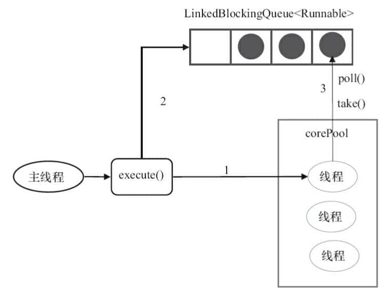
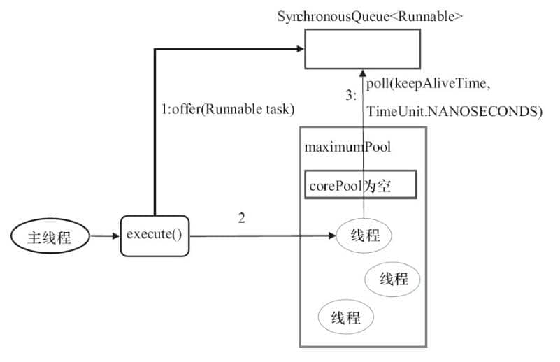

<!-- markdownlint-disable MD024 -->

Chắc hẳn bạn đã rất quen thuộc với kỹ thuật pooling: thread pool, database connection pool và HTTP connection pool đều là ứng dụng của tư tưởng này. Kỹ thuật pooling chủ yếu nhằm giảm chi phí lấy tài nguyên mỗi lần và nâng cao hiệu quả sử dụng tài nguyên.

Bài viết này sẽ giới thiệu chi tiết các khái niệm cơ bản và nguyên lý cốt lõi của thread pool.

## Giới thiệu về thread pool

Chắc hẳn bạn đã rất quen thuộc với kỹ thuật pooling: thread pool, database connection pool và HTTP connection pool đều là ứng dụng của tư tưởng này. Kỹ thuật pooling chủ yếu nhằm giảm chi phí lấy tài nguyên mỗi lần và nâng cao hiệu quả sử dụng tài nguyên.

Thread pool cung cấp một cách để giới hạn và quản lý tài nguyên (bao gồm việc thực thi một task). Mỗi thread pool cũng duy trì một số thông tin thống kê cơ bản, chẳng hạn số task đã hoàn thành. Sử dụng thread pool chủ yếu mang lại các lợi ích sau:

1. **Giảm tiêu hao tài nguyên**: các thread trong thread pool có thể được tái sử dụng. Khi một thread hoàn thành task, nó không bị hủy ngay mà quay lại pool để chờ task tiếp theo. Điều này tránh chi phí phát sinh do thường xuyên tạo và hủy thread.
2. **Tăng tốc độ phản hồi**: vì thread pool thường duy trì một số lượng core thread nhất định (hay còn gọi là “worker thường trực”), khi có task, task có thể được giao trực tiếp cho các thread đã tồn tại và đang rảnh để thực thi, bỏ qua thời gian tạo thread nên task được xử lý nhanh hơn.
3. **Tăng khả năng quản lý thread**: thread pool cho phép quản lý thống nhất các thread trong pool. Bạn có thể cấu hình kích thước thread pool (số core thread, số thread tối đa), loại và kích thước task queue, rejection policy... Nhờ đó có thể kiểm soát tổng số thread concurrent, tránh cạn kiệt tài nguyên và bảo đảm tính ổn định của hệ thống. Đồng thời, thread pool thường cung cấp monitoring interface để thuận tiện theo dõi trạng thái hoạt động của thread pool (chẳng hạn có bao nhiêu active thread, bao nhiêu task đang xếp hàng), từ đó tối ưu.

## Giới thiệu Executor framework

`Executor` framework được giới thiệu từ sau Java 5. Sau Java 5, sử dụng `Executor` để khởi động thread tốt hơn dùng method `start` của `Thread`: ngoài việc dễ quản lý và hiệu quả hơn (dùng thread pool để tiết kiệm chi phí), còn có một điểm quan trọng là giúp tránh vấn đề this escape.

> This escape là việc thread khác đã giữ reference đến object trước khi constructor trả về. Việc gọi method của object chưa được khởi tạo hoàn chỉnh có thể gây ra lỗi khó hiểu.

`Executor` framework không chỉ bao gồm việc quản lý thread pool mà còn cung cấp thread factory, queue và rejection policy. `Executor` framework giúp lập trình concurrent trở nên đơn giản hơn.

Cấu trúc `Executor` framework chủ yếu gồm ba phần:

**1. Task (`Runnable` / `Callable`)**

Task cần implement **`Runnable` interface** hoặc **`Callable` interface** để thực thi. Class implement **`Runnable` interface** hoặc **`Callable` interface** đều có thể được **`ThreadPoolExecutor`** hoặc **`ScheduledThreadPoolExecutor`** thực thi.

**2. Thực thi task (`Executor`)**

Như hình dưới đây, phần này bao gồm interface cốt lõi **`Executor`** của cơ chế thực thi task, cùng **`ExecutorService` interface** kế thừa từ interface `Executor`. Hai class quan trọng là **`ThreadPoolExecutor`** và **`ScheduledThreadPoolExecutor`** implement **`ExecutorService` interface**.


Ở đây có đề cập nhiều quan hệ giữa các class ở tầng dưới, nhưng trên thực tế bạn cần chú ý nhiều hơn đến class `ThreadPoolExecutor`. Class này được sử dụng khá thường xuyên khi dùng thread pool trong thực tế.

**Lưu ý:** xem source code của `ScheduledThreadPoolExecutor` sẽ thấy `ScheduledThreadPoolExecutor` thực tế kế thừa `ThreadPoolExecutor` và implement `ScheduledExecutorService`, còn `ScheduledExecutorService` lại implement `ExecutorService`, đúng như sơ đồ quan hệ class ở trên.

Mô tả class `ThreadPoolExecutor`:

```java
//AbstractExecutorService implement ExecutorService interface
public class ThreadPoolExecutor extends AbstractExecutorService
```

Mô tả class `ScheduledThreadPoolExecutor`:

```java
//ScheduledExecutorService kế thừa ExecutorService interface
public class ScheduledThreadPoolExecutor
        extends ThreadPoolExecutor
        implements ScheduledExecutorService
```

**3. Kết quả tính toán async (`Future`)**

**`Future`** interface và class **`FutureTask`** implement `Future` interface đều có thể đại diện cho kết quả tính toán async.

Khi submit một class implement **`Runnable` interface** hoặc **`Callable` interface** cho **`ThreadPoolExecutor`** hoặc **`ScheduledThreadPoolExecutor`** thực thi, việc gọi `submit()` sẽ trả về một object implement `Future` interface. Implementation cụ thể không nhất thiết là `FutureTask`; ví dụ scheduled thread pool sẽ trả về implementation tương ứng của `RunnableScheduledFuture`.

**Sơ đồ minh họa việc sử dụng `Executor` framework**:


1. Main thread trước hết tạo task object implement `Runnable` hoặc `Callable` interface.
2. Giao trực tiếp object đã tạo implement `Runnable`/`Callable` interface cho `ExecutorService` thực thi: `ExecutorService.execute（Runnable command）`), hoặc cũng có thể submit object `Runnable` hay object `Callable` cho `ExecutorService` thực thi (`ExecutorService.submit（Runnable task）` hoặc `ExecutorService.submit（Callable <T> task）`).
3. Nếu thực thi `ExecutorService.submit(...)`, `ExecutorService` sẽ trả về một object implement `Future` interface. Vì `FutureTask` đồng thời implement `Runnable` và `Future`, bạn cũng có thể tự tạo `FutureTask`, sau đó giao trực tiếp cho `ExecutorService` thực thi.
4. Cuối cùng, main thread có thể thực thi method `Future.get()` để chờ task hoàn thành, hoặc thực thi `Future.cancel(boolean mayInterruptIfRunning)` để thử hủy task.

## Giới thiệu class ThreadPoolExecutor (quan trọng)

Class implement thread pool là `ThreadPoolExecutor`, cũng là class cốt lõi nhất của `Executor` framework.

### Phân tích tham số thread pool

Class `ThreadPoolExecutor` cung cấp bốn constructor. Hãy xem constructor dài nhất; ba constructor còn lại đều được tạo dựa trên constructor này (nói đơn giản, các constructor khác là constructor đã chỉ định một số tham số mặc định, chẳng hạn rejection policy mặc định).

```java
    /**
     * Tạo ThreadPoolExecutor mới với các tham số ban đầu đã cho.
     */
    public ThreadPoolExecutor(int corePoolSize,//số core thread của thread pool
                              int maximumPoolSize,//số thread tối đa của thread pool
                              long keepAliveTime,//thời gian sống tối đa của idle thread dư thừa khi số thread lớn hơn số core thread
                              TimeUnit unit,//đơn vị thời gian
                              BlockingQueue<Runnable> workQueue,//task queue, dùng để lưu các task chờ thực thi
                              ThreadFactory threadFactory,//thread factory, dùng để tạo thread, thường dùng mặc định
                              RejectedExecutionHandler handler//rejection policy, khi có quá nhiều task submit không thể xử lý kịp thì có thể tùy chỉnh policy để xử lý
                               ) {
        if (corePoolSize < 0 ||
            maximumPoolSize <= 0 ||
            maximumPoolSize < corePoolSize ||
            keepAliveTime < 0)
            throw new IllegalArgumentException();
        if (workQueue == null || threadFactory == null || handler == null)
            throw new NullPointerException();
        this.corePoolSize = corePoolSize;
        this.maximumPoolSize = maximumPoolSize;
        this.workQueue = workQueue;
        this.keepAliveTime = unit.toNanos(keepAliveTime);
        this.threadFactory = threadFactory;
        this.handler = handler;
    }
```

Các tham số dưới đây rất quan trọng và chắc chắn bạn sẽ dùng đến khi sử dụng thread pool sau này. Vì vậy, hãy ghi nhớ chúng.

3 tham số quan trọng nhất của `ThreadPoolExecutor`:

- `corePoolSize`: số lượng worker thread mà thread pool ưu tiên duy trì. Theo mặc định, thread được tạo theo nhu cầu; sau khi số worker thread đạt giá trị này, task mới thường được đưa vào queue.
- `maximumPoolSize`: số thread tối đa mà thread pool có thể tạo; khi task queue đầy, thread pool có thể tăng số thread đến mức này.
- `workQueue`: khi có task mới, trước hết kiểm tra số thread đang chạy hiện tại đã đạt số core thread hay chưa; nếu đã đạt, task mới sẽ được lưu vào queue.

Các tham số phổ biến khác của `ThreadPoolExecutor`:

- `keepAliveTime`: khi số thread trong thread pool lớn hơn `corePoolSize`, nếu lúc này không có task mới được submit, các thread ngoài core thread sẽ không bị hủy ngay mà chờ đến khi thời gian chờ vượt quá `keepAliveTime` mới được thu hồi và hủy.
- `unit`: đơn vị thời gian của tham số `keepAliveTime`.
- `threadFactory`: được dùng khi executor tạo thread mới.
- `handler`: rejection policy (sẽ được giới thiệu chi tiết ở phần sau).

Hình dưới đây giúp bạn hiểu sâu hơn quan hệ giữa các tham số trong thread pool (nguồn ảnh: _Thực chiến tối ưu hiệu năng Java_):


### Trạng thái vòng đời thread pool

`ThreadPoolExecutor` sử dụng biến `ctl` (kiểu `AtomicInteger`) để đồng thời quản lý trạng thái hoạt động của thread pool và số worker thread. Thread pool có 5 trạng thái:

- **Đang chạy (`RUNNING`)**: nhận task mới và xử lý task trong queue. Đây là trạng thái ban đầu sau khi thread pool được tạo.
- **Đã tắt (`SHUTDOWN`)**: không nhận task mới nữa nhưng tiếp tục xử lý các task đã có trong queue. Trạng thái này bắt đầu sau khi gọi `shutdown()`.
- **Dừng (`STOP`)**: không nhận task mới, không xử lý task trong queue và thử interrupt task đang thực thi. Trạng thái này bắt đầu sau khi gọi `shutdownNow()`.
- **Đang dọn dẹp (`TIDYING`)**: mọi task đã kết thúc, số worker thread bằng 0, sắp thực thi hook method `terminated()`.
- **Đã kết thúc (`TERMINATED`)**: method `terminated()` thực thi xong, thread pool hoàn toàn kết thúc.

Trạng thái chỉ chuyển theo một chiều: đang chạy (`RUNNING`) → đã tắt (`SHUTDOWN`) → đang dọn dẹp (`TIDYING`) → đã kết thúc (`TERMINATED`), hoặc đang chạy (`RUNNING`) → dừng (`STOP`) → đang dọn dẹp (`TIDYING`) → đã kết thúc (`TERMINATED`). Khi ở trạng thái đã tắt (`SHUTDOWN`), gọi `shutdownNow()` lần nữa cũng chuyển sang dừng (`STOP`).

`shutdown()` là “tắt mềm”: interrupt idle thread nhưng task trong queue vẫn được thực thi hết. `shutdownNow()` là “tắt cưỡng chế”: thử interrupt mọi thread đang chạy và trả về các task chưa thực thi trong queue dưới dạng `List<Runnable>`. `terminated()` là một hook method rỗng; có thể override bằng cách kế thừa `ThreadPoolExecutor` để thực hiện công việc cleanup sau khi thread pool kết thúc.

### Cơ chế worker thread

`ThreadPoolExecutor` đóng gói mỗi worker thread thành inner class `Worker`. `Worker` kế thừa AQS và implement `Runnable` interface.

**Tại sao `Worker` kế thừa AQS?** `Worker` implement một **exclusive lock không reentrant**, phối hợp với `shutdown()` để phân biệt thread đang idle hay đang làm việc: Worker đang thực thi task sẽ giữ lock; `shutdown()` thử `tryLock()` với từng Worker, nếu thất bại nghĩa là thread đó đang làm việc và sẽ không bị interrupt.

**Vòng đời của `Worker`:**

1. **Tạo**: khi `execute()` xác định cần tạo thread mới, nó gọi `addWorker()` để tạo instance `Worker`, bên trong dùng `ThreadFactory` tạo thread.
2. **Chạy**: sau khi thread khởi động, nó vào vòng lặp `while` của `runWorker()`, liên tục lấy task từ queue qua `getTask()` để thực thi. Worker không bị đánh dấu vĩnh viễn là “core” hay “non-core”; chỉ khi cho phép core thread hết thời gian chờ, hoặc số worker thread hiện tại lớn hơn `corePoolSize`, `getTask()` mới dùng `workQueue.poll(keepAliveTime, unit)` có timeout, nếu không thì dùng `workQueue.take()` để blocking chờ.
3. **Thoát**: khi `getTask()` trả về `null`, Worker thoát vòng lặp và cleanup. Các trường hợp trả về `null` gồm: thread pool ở trạng thái dừng (`STOP`), thread pool ở trạng thái đã tắt (`SHUTDOWN`) và queue rỗng, non-core thread chờ timeout, hoặc `maximumPoolSize` bị giảm trong lúc chạy. Nếu sau khi thoát số worker thread thấp hơn số core thread, một thread mới sẽ được tự động bổ sung.

**Định nghĩa rejection policy của `ThreadPoolExecutor`:**

Khi thread pool đã tắt, hoặc số worker thread hiện tại đạt giới hạn trên và queue cũng không thể nhận task mới, `ThreadPoolExecutor` sẽ gọi rejection policy:

- `ThreadPoolExecutor.AbortPolicy`: ném `RejectedExecutionException` để từ chối xử lý task mới.
- `ThreadPoolExecutor.CallerRunsPolicy`: dùng thread gọi method `execute` để chạy task, tức chạy (`run`) task bị từ chối ngay trong thread đó; nếu executor đã tắt thì bỏ task. Vì vậy policy này sẽ làm giảm tốc độ submit task mới và ảnh hưởng hiệu năng tổng thể của chương trình. Nếu application có thể chịu được độ trễ này và yêu cầu mọi task được submit đều phải thực thi, có thể chọn policy này.
- `ThreadPoolExecutor.DiscardPolicy`: không xử lý task mới mà bỏ ngay.
- `ThreadPoolExecutor.DiscardOldestPolicy`: policy này bỏ task chưa xử lý cũ nhất.

Ví dụ:

Ví dụ: khi Spring tạo thread pool thông qua `ThreadPoolTaskExecutor`, hoặc khi trực tiếp tạo thread pool bằng constructor của `ThreadPoolExecutor`, nếu không chỉ định `RejectedExecutionHandler` để cấu hình rejection policy thì mặc định sử dụng `AbortPolicy`. Với rejection policy này, nếu queue đầy, `ThreadPoolExecutor` sẽ ném exception `RejectedExecutionException` để từ chối task mới, nghĩa là task đó sẽ không được xử lý. Khi thread pool vẫn đang chạy, `CallerRunsPolicy` giao task bị từ chối cho caller thread thực thi; khi thread pool đã tắt, policy này sẽ bỏ task trực tiếp.

```java
public static class CallerRunsPolicy implements RejectedExecutionHandler {

        public CallerRunsPolicy() { }

        public void rejectedExecution(Runnable r, ThreadPoolExecutor e) {
            if (!e.isShutdown()) {
                // Thực thi trực tiếp trong main thread thay vì thread trong thread pool
                r.run();
            }
        }
    }
```

### Trường hợp sử dụng thực tế của 4 rejection policy

Phần trên đã giới thiệu hành vi cơ bản của 4 rejection policy tích hợp. Dưới đây là kinh nghiệm production và các trường hợp phù hợp với từng policy:

**`AbortPolicy`**: phù hợp với nghiệp vụ cốt lõi không chấp nhận mất task (như thanh toán, chuyển tiền). Khi task bị từ chối, caller sẽ nhận `RejectedExecutionException`, cần catch trong code nghiệp vụ và thực hiện bù trừ (như retry hoặc lưu vào database để thực thi bù trừ). _Alibaba Java Development Manual_ chỉ ra rằng nếu không cấu hình gì, queue đầy sẽ ném exception trực tiếp và developer phải xử lý rõ ràng.

**`CallerRunsPolicy`**: phù hợp với trường hợp không được bỏ task và cho phép giảm tốc độ submit. Vì task được thực thi trong caller thread, caller không thể submit task mới trong thời gian đó, tạo thành cơ chế **back-pressure** tự nhiên. Đội ngũ kỹ thuật Meituan đề cập trong _Nguyên lý triển khai Java thread pool và thực tiễn trong nghiệp vụ Meituan_ rằng đây là rejection policy được dùng khá thường xuyên trong production của họ. Tuy nhiên cần lưu ý: nếu thread submit task là request processing thread của Web container (như Worker thread của Tomcat), response time của request sẽ tăng đáng kể; cần thận trọng trong trường hợp nhạy cảm với latency.

**`DiscardPolicy`**: phù hợp với non-critical path cho phép mất task, như ghi log async hoặc báo cáo metric monitoring. Policy này hoàn toàn silent (implementation rỗng), task bị từ chối không để lại dấu vết nào nên có thể khó phát hiện task bị mất khi troubleshooting.

**`DiscardOldestPolicy`**: phù hợp với trường hợp chỉ quan tâm data mới nhất và task cũ có thể bị ghi đè, như push real-time market data hoặc thu thập sensor data. Cần lưu ý: nếu sử dụng `PriorityBlockingQueue`, `poll()` lấy task có priority cao nhất chứ không phải task cũ nhất, có thể khiến task quan trọng bị bỏ nhầm.

**Cách làm phổ biến trong production**: 4 policy tích hợp trên thường không đáp ứng hoàn toàn nhu cầu. Dubbo tự định nghĩa policy `AbortPolicyWithReport`, ngoài việc ném exception còn dump thông tin task bị từ chối vào file local để tiện troubleshooting sau này. Đội ngũ kỹ thuật Meituan đề xuất theo dõi và cảnh báo số lần thread pool reject task. Các hướng thường dùng khi tự định nghĩa policy gồm: ghi task bị từ chối vào database hoặc message queue để bù trừ và consume sau, tăng monitoring counter rồi báo cáo lên Prometheus, hoặc gọi `workQueue.put(r)` để blocking chờ queue có chỗ trống (Netty có implementation tương tự).

### Hai cách tạo thread pool

Trong Java, chủ yếu có hai cách tạo thread pool:

**Cách 1: tạo trực tiếp bằng constructor của `ThreadPoolExecutor` (khuyến nghị)**


“Thread factory mặc định” và “rejection policy mặc định” trong hình có nghĩa là khi constructor hiện tại không truyền rõ tham số tương ứng, `ThreadPoolExecutor` sẽ dùng implementation mặc định, không phải method và mô tả bị lệch.

Đây là cách được khuyến nghị nhất vì cho phép developer chỉ định rõ các tham số cốt lõi của thread pool, kiểm soát chi tiết hơn hành vi hoạt động của thread pool, từ đó tránh rủi ro cạn kiệt tài nguyên.

**Cách 2: tạo bằng utility class `Executors` (không khuyến nghị dùng trong production)**

Các method tạo thread pool do utility class `Executors` cung cấp được minh họa như hình dưới đây:


Có thể thấy utility class `Executors` có thể tạo nhiều loại thread pool, bao gồm:

- `FixedThreadPool`: khi chạy bình thường sử dụng tối đa một số lượng worker thread cố định. Thread có thể được thay thế sau khi kết thúc bất thường, khi thread pool đóng cũng sẽ thoát, vì vậy số lượng không phải lúc nào cũng bất biến trong toàn bộ vòng đời. Khi task mới được submit, nếu thread pool có idle thread thì thực thi ngay. Nếu không, task mới được tạm lưu trong task queue, chờ thread rảnh rồi xử lý task trong queue.
- `SingleThreadExecutor`: thread pool chỉ có một thread. Nếu có hơn một task được submit vào thread pool, task sẽ được lưu trong task queue và chờ thread rảnh để thực thi task trong queue theo thứ tự FIFO.
- `CachedThreadPool`: thread pool có thể điều chỉnh số thread theo tình hình thực tế. Số thread không cố định; nếu có idle thread có thể tái sử dụng thì ưu tiên dùng thread đó. Nếu mọi thread đều đang làm việc mà có task mới được submit, thread mới sẽ được tạo để xử lý task. Sau khi hoàn thành task hiện tại, mọi thread sẽ quay lại thread pool để tái sử dụng.
- `ScheduledThreadPool`: thread pool chạy task sau một delay nhất định hoặc thực thi task định kỳ.

_Alibaba Java Development Manual_ bắt buộc không được dùng `Executors` để tạo thread pool mà phải dùng constructor của `ThreadPoolExecutor`. Cách này giúp developer hiểu rõ hơn quy tắc hoạt động của thread pool và tránh rủi ro cạn kiệt tài nguyên.

Nhược điểm của object thread pool do `Executors` trả về như sau (sẽ được giới thiệu chi tiết ở phần sau):

- `FixedThreadPool` và `SingleThreadExecutor`: sử dụng blocking queue `LinkedBlockingQueue`, capacity tối đa của task queue là `Integer.MAX_VALUE`, có thể xem là unbounded và có thể tích tụ lượng lớn request, dẫn đến OOM.
- `CachedThreadPool`: sử dụng synchronous queue `SynchronousQueue`, cho phép số thread được tạo là `Integer.MAX_VALUE`. Nếu số task quá nhiều và tốc độ thực thi chậm, có thể tạo lượng lớn thread, dẫn đến OOM.
- `ScheduledThreadPool` và `SingleThreadScheduledExecutor`: sử dụng unbounded delay blocking queue `DelayedWorkQueue`, capacity tối đa của task queue là `Integer.MAX_VALUE`, có thể tích tụ lượng lớn request, dẫn đến OOM.

```java
public static ExecutorService newFixedThreadPool(int nThreads) {
    // Độ dài mặc định của LinkedBlockingQueue là Integer.MAX_VALUE, có thể xem là unbounded
    return new ThreadPoolExecutor(nThreads, nThreads,0L, TimeUnit.MILLISECONDS,new LinkedBlockingQueue<Runnable>());

}

public static ExecutorService newSingleThreadExecutor() {
    // Độ dài mặc định của LinkedBlockingQueue là Integer.MAX_VALUE, có thể xem là unbounded
    return new FinalizableDelegatedExecutorService (new ThreadPoolExecutor(1, 1,0L, TimeUnit.MILLISECONDS,new LinkedBlockingQueue<Runnable>()));

}

// Synchronous queue SynchronousQueue không có capacity, số thread tối đa là Integer.MAX_VALUE`
public static ExecutorService newCachedThreadPool() {

    return new ThreadPoolExecutor(0, Integer.MAX_VALUE,60L, TimeUnit.SECONDS,new SynchronousQueue<Runnable>());

}

// DelayedWorkQueue (delay blocking queue)
public static ScheduledExecutorService newScheduledThreadPool(int corePoolSize) {
    return new ScheduledThreadPoolExecutor(corePoolSize);
}
public ScheduledThreadPoolExecutor(int corePoolSize) {
    super(corePoolSize, Integer.MAX_VALUE, 0, NANOSECONDS,
          new DelayedWorkQueue());
}
```

### Tổng hợp các blocking queue thường dùng trong thread pool

Khi có task mới, trước hết kiểm tra số thread đang chạy hiện tại đã đạt số core thread hay chưa; nếu đã đạt thì task mới sẽ được lưu trong queue.

Các thread pool khác nhau sẽ chọn blocking queue khác nhau. Có thể phân tích kết hợp với các thread pool tích hợp sẵn.

- `LinkedBlockingQueue` có capacity `Integer.MAX_VALUE` (unbounded queue): `FixedThreadPool` và `SingleThreadExecutor`. `FixedThreadPool` nhiều nhất chỉ tạo được số thread bằng số core thread (số core thread bằng số thread tối đa), `SingleThreadExecutor` chỉ tạo được một thread (số core thread và số thread tối đa đều là 1), vì vậy task queue của cả hai trên thực tế hầu như không bị lấp đầy.
- `SynchronousQueue` (synchronous queue): `CachedThreadPool`. `SynchronousQueue` không có capacity và không lưu element; mục đích là bảo đảm task được submit sẽ dùng idle thread để xử lý nếu có, nếu không thì tạo thread mới để xử lý. Nói cách khác, số thread tối đa của `CachedThreadPool` là `Integer.MAX_VALUE`, có thể mở rộng đến giới hạn này, dẫn đến khả năng tạo lượng lớn thread và OOM.
- `DelayedWorkQueue` (delay blocking queue): `ScheduledThreadPool` và `SingleThreadScheduledExecutor`. Element bên trong `DelayedWorkQueue` không được sắp xếp theo thời điểm đưa vào mà theo độ dài delay của task. Bên trong dùng cấu trúc dữ liệu “heap”, bảo đảm task lấy ra mỗi lần là task có thời điểm thực thi sớm nhất trong queue hiện tại. Sau khi `DelayedWorkQueue` đầy, nó tự động tăng capacity thêm 1/2 capacity cũ, tức là không bao giờ blocking; capacity tối đa có thể đạt `Integer.MAX_VALUE`, vì vậy nhiều nhất chỉ tạo được số thread bằng số core thread.

## Phân tích nguyên lý thread pool (quan trọng)

Ở trên đã giới thiệu `Executor` framework và class `ThreadPoolExecutor`. Tiếp theo hãy thực hành bằng một Demo nhỏ dùng `ThreadPoolExecutor` để ôn lại nội dung trên.

### Code ví dụ thread pool

Trước hết tạo một class implement `Runnable` interface (tất nhiên cũng có thể là `Callable` interface; sau này sẽ giới thiệu điểm khác nhau giữa hai interface).

`MyRunnable.java`

```java
import java.util.Date;

/**
 * Đây là một class Runnable đơn giản, cần khoảng 5 giây để thực thi task.
 * @author shuang.kou
 */
public class MyRunnable implements Runnable {

    private String command;

    public MyRunnable(String s) {
        this.command = s;
    }

    @Override
    public void run() {
        System.out.println(Thread.currentThread().getName() + " Start. Time = " + new Date());
        processCommand();
        System.out.println(Thread.currentThread().getName() + " End. Time = " + new Date());
    }

    private void processCommand() {
        try {
            Thread.sleep(5000);
        } catch (InterruptedException e) {
            e.printStackTrace();
        }
    }

    @Override
    public String toString() {
        return this.command;
    }
}

```

Viết chương trình test. Ở đây tạo thread pool bằng cách tự cấu hình tham số trong constructor `ThreadPoolExecutor`, là cách Alibaba khuyến nghị.

`ThreadPoolExecutorDemo.java`

```java
import java.util.concurrent.ArrayBlockingQueue;
import java.util.concurrent.ThreadPoolExecutor;
import java.util.concurrent.TimeUnit;

public class ThreadPoolExecutorDemo {

    private static final int CORE_POOL_SIZE = 5;
    private static final int MAX_POOL_SIZE = 10;
    private static final int QUEUE_CAPACITY = 100;
    private static final Long KEEP_ALIVE_TIME = 1L;
    public static void main(String[] args) {

        //Dùng cách tạo thread pool được Alibaba khuyến nghị
        //Tạo bằng constructor ThreadPoolExecutor với các tham số tùy chỉnh
        ThreadPoolExecutor executor = new ThreadPoolExecutor(
                CORE_POOL_SIZE,
                MAX_POOL_SIZE,
                KEEP_ALIVE_TIME,
                TimeUnit.SECONDS,
                new ArrayBlockingQueue<>(QUEUE_CAPACITY),
                new ThreadPoolExecutor.CallerRunsPolicy());

        for (int i = 0; i < 10; i++) {
            //Tạo object WorkerThread (class WorkerThread implement Runnable interface)
            Runnable worker = new MyRunnable("" + i);
            //Thực thi Runnable
            executor.execute(worker);
        }
        //Kết thúc thread pool
        executor.shutdown();
        while (!executor.isTerminated()) {
        }
        System.out.println("Finished all threads");
    }
}

```

Có thể thấy code trên chỉ định:

- `corePoolSize`: số core thread là 5.
- `maximumPoolSize`: số thread tối đa là 10.
- `keepAliveTime`: thời gian chờ là 1L.
- `unit`: đơn vị thời gian chờ là `TimeUnit.SECONDS`.
- `workQueue`: task queue là `ArrayBlockingQueue`, capacity là 100;
- `handler`: rejection policy là `CallerRunsPolicy`.

**Cấu trúc output:**

```plain
pool-1-thread-3 Start. Time = Sun Apr 12 11:14:37 CST 2020
pool-1-thread-5 Start. Time = Sun Apr 12 11:14:37 CST 2020
pool-1-thread-2 Start. Time = Sun Apr 12 11:14:37 CST 2020
pool-1-thread-1 Start. Time = Sun Apr 12 11:14:37 CST 2020
pool-1-thread-4 Start. Time = Sun Apr 12 11:14:37 CST 2020
pool-1-thread-3 End. Time = Sun Apr 12 11:14:42 CST 2020
pool-1-thread-4 End. Time = Sun Apr 12 11:14:42 CST 2020
pool-1-thread-1 End. Time = Sun Apr 12 11:14:42 CST 2020
pool-1-thread-5 End. Time = Sun Apr 12 11:14:42 CST 2020
pool-1-thread-1 Start. Time = Sun Apr 12 11:14:42 CST 2020
pool-1-thread-2 End. Time = Sun Apr 12 11:14:42 CST 2020
pool-1-thread-5 Start. Time = Sun Apr 12 11:14:42 CST 2020
pool-1-thread-4 Start. Time = Sun Apr 12 11:14:42 CST 2020
pool-1-thread-3 Start. Time = Sun Apr 12 11:14:42 CST 2020
pool-1-thread-2 Start. Time = Sun Apr 12 11:14:42 CST 2020
pool-1-thread-1 End. Time = Sun Apr 12 11:14:47 CST 2020
pool-1-thread-4 End. Time = Sun Apr 12 11:14:47 CST 2020
pool-1-thread-5 End. Time = Sun Apr 12 11:14:47 CST 2020
pool-1-thread-3 End. Time = Sun Apr 12 11:14:47 CST 2020
pool-1-thread-2 End. Time = Sun Apr 12 11:14:47 CST 2020
Finished all threads  // Chỉ xuất hiện sau khi mọi task hoàn thành, vì executor.isTerminated() trả về true thì vòng while mới thoát; điều này chỉ xảy ra khi đã gọi method shutdown() và mọi task đã submit đều hoàn thành

```

### Phân tích nguyên lý thread pool

Từ output code trên có thể thấy: **thread pool trước hết thực thi 5 task, sau đó khi có task hoàn thành thì lấy task mới để thực thi.** Dựa trên nội dung đã giới thiệu ở trên, bạn có thể tự phân tích xem chuyện gì đã xảy ra không? (Hãy tự suy nghĩ một lúc.)

Bây giờ hãy phân tích sơ lược nguyên lý thread pool qua output trên.

Để hiểu nguyên lý thread pool, trước hết cần phân tích method `execute`. Trong code ví dụ, dùng `executor.execute(worker)` để submit task vào thread pool.

Method này rất quan trọng, hãy xem source code:

```java
   // Lưu trạng thái hoạt động của thread pool (runState) và số thread hợp lệ trong thread pool (workerCount)
   private final AtomicInteger ctl = new AtomicInteger(ctlOf(RUNNING, 0));

    private static int workerCountOf(int c) {
        return c & CAPACITY;
    }
    //task queue
    private final BlockingQueue<Runnable> workQueue;

    public void execute(Runnable command) {
        // Nếu task là null thì ném exception.
        if (command == null)
            throw new NullPointerException();
        // ctl lưu một số thông tin trạng thái hiện tại của thread pool
        int c = ctl.get();

        // Ở đây có 3 bước
        // 1. Trước hết kiểm tra tổng số worker thread hiện tại trong thread pool có nhỏ hơn corePoolSize hay không
        // Nếu nhỏ hơn thì tạo thread mới thông qua addWorker(command, true), thêm task (command) vào thread đó rồi khởi động thread để thực thi task.
        if (workerCountOf(c) < corePoolSize) {
            if (addWorker(command, true))
                return;
            c = ctl.get();
        }
        // 2. Nếu tổng số worker thread hiện tại lớn hơn hoặc bằng corePoolSize thì đến đây, nghĩa là không đi vào nhánh tạo core thread.
        // Dùng method isRunning để phán đoán trạng thái thread pool. Chỉ khi thread pool ở trạng thái RUNNING và queue có thể nhận task thì task mới được thêm vào queue.
        if (isRunning(c) && workQueue.offer(command)) {
            int recheck = ctl.get();
            // Lấy lại trạng thái thread pool. Nếu trạng thái không phải RUNNING thì cần xóa task khỏi task queue, thử kiểm tra toàn bộ thread đã thực thi xong chưa, đồng thời thực thi rejection policy.
            if (!isRunning(recheck) && remove(command))
                reject(command);
                // Nếu số worker thread hiện tại bằng 0 thì tạo thread mới và thực thi.
            else if (workerCountOf(recheck) == 0)
                addWorker(null, false);
        }
        //3. Tạo thread mới thông qua addWorker(command, false), thêm task (command) vào thread đó rồi khởi động thread để thực thi.
        // Truyền false nghĩa là khi tăng thread sẽ kiểm tra số thread hiện tại có ít hơn maxPoolSize hay không.
        //Nếu addWorker(command, false) thực thi thất bại thì dùng reject() để thực thi rejection policy tương ứng.
        else if (!addWorker(command, false))
            reject(command);
    }
```

Dưới đây là phân tích đơn giản toàn bộ quy trình (đã giản lược logic để dễ hiểu):

1. Nếu tổng số worker thread hiện tại nhỏ hơn số core thread thì tạo thread mới để thực thi task.
2. Nếu tổng số worker thread hiện tại đã đạt số core thread, trước hết thử đưa task vào task queue để chờ thực thi.
3. Nếu đưa task vào task queue thất bại (task queue đã đầy), đồng thời tổng số worker thread hiện tại nhỏ hơn số thread tối đa thì tạo non-core thread mới để thực thi task.
4. Nếu tổng số worker thread hiện tại đã bằng số thread tối đa và task queue cũng không thể nhận thêm task, task hiện tại sẽ bị từ chối, rejection policy sẽ gọi method `RejectedExecutionHandler.rejectedExecution()`.

> **Bổ sung**: nhiều người lầm tưởng non-core thread chỉ được tạo khi task queue đầy, sau đó sẽ “ngồi không” chờ bị hủy. Thực tế, sau khi thực thi task ban đầu, non-core thread không bị hủy ngay mà **chủ động lấy task từ task queue để thực thi** (thông qua method `getTask()`). Cụ thể, core thread dùng `workQueue.take()` để blocking chờ task, còn non-core thread dùng `workQueue.poll(keepAliveTime, unit)`: nếu lấy được task từ queue trong thời gian sống thì tiếp tục thực thi; chỉ khi timeout mà không lấy được task thì non-core thread mới bị thu hồi. Điều này có nghĩa là ngay cả khi task mới được đưa vào queue, idle non-core thread cũng sẽ chủ động lấy task ra thực thi trước, chứ không chờ queue đầy mới phản hồi bị động.


Trong method `execute`, method `addWorker` được gọi nhiều lần. Method `addWorker` chủ yếu dùng để tạo worker thread mới; nếu trả về true nghĩa là tạo và khởi động worker thread thành công, nếu không thì trả về false.

```java
    // Global lock, cần thiết cho các thao tác concurrent
    private final ReentrantLock mainLock = new ReentrantLock();
    // Theo dõi kích thước lớn nhất của thread pool; chỉ được truy cập khi đang giữ global lock mainLock
    private int largestPoolSize;
    // Collection worker thread, lưu mọi (active) worker thread trong thread pool; chỉ được truy cập collection này khi đang giữ global lock mainLock
    private final HashSet<Worker> workers = new HashSet<>();
    //Lấy trạng thái thread pool
    private static int runStateOf(int c)     { return c & ~CAPACITY; }
    //Phán đoán trạng thái thread pool có phải Running hay không
    private static boolean isRunning(int c) {
        return c < SHUTDOWN;
    }


    /**
     * Thêm worker thread mới vào thread pool
     * @param firstTask task cần thực thi
     * @param core nếu tham số là true thì dùng kích thước cơ bản của thread pool, false thì dùng kích thước tối đa của thread pool
     * @return thêm thành công trả về true, nếu không trả về false
     */
   private boolean addWorker(Runnable firstTask, boolean core) {
        retry:
        for (;;) {
            //Hai dòng này dùng để lấy trạng thái thread pool
            int c = ctl.get();
            int rs = runStateOf(c);

            // Check if queue empty only if necessary.
            if (rs >= SHUTDOWN &&
                ! (rs == SHUTDOWN &&
                   firstTask == null &&
                   ! workQueue.isEmpty()))
                return false;

            for (;;) {
               //Lấy số worker thread trong thread pool
                int wc = workerCountOf(c);
                // core là false nghĩa là queue cũng đã đầy, kích thước thread pool chuyển thành maximumPoolSize
                if (wc >= CAPACITY ||
                    wc >= (core ? corePoolSize : maximumPoolSize))
                    return false;
               //Thao tác atomic tăng số workcount lên 1
                if (compareAndIncrementWorkerCount(c))
                    break retry;
                // Nếu trạng thái thread thay đổi thì thực thi lại thao tác trên
                c = ctl.get();
                if (runStateOf(c) != rs)
                    continue retry;
                // else CAS failed due to workerCount change; retry inner loop
            }
        }
        // Đánh dấu worker thread có khởi động thành công hay không
        boolean workerStarted = false;
        // Đánh dấu worker thread có tạo thành công hay không
        boolean workerAdded = false;
        Worker w = null;
        try {

            w = new Worker(firstTask);
            final Thread t = w.thread;
            if (t != null) {
              // lock
                final ReentrantLock mainLock = this.mainLock;
                mainLock.lock();
                try {
                   //Lấy trạng thái thread pool
                    int rs = runStateOf(ctl.get());
                   //rs < SHUTDOWN: nếu trạng thái thread pool vẫn là RUNNING và trạng thái thread là alive thì thêm worker thread vào worker thread collection
                  //(rs=SHUTDOWN && firstTask == null): nếu trạng thái thread pool nhỏ hơn STOP, tức ở trạng thái RUNNING hoặc SHUTDOWN, đồng thời instance task firstTask truyền vào là null thì cần thêm vào worker thread collection và khởi động Worker mới
                   // firstTask == null chứng minh chỉ tạo thread mới mà không thực thi task
                    if (rs < SHUTDOWN ||
                        (rs == SHUTDOWN && firstTask == null)) {
                        if (t.isAlive()) // precheck that t is startable
                            throw new IllegalThreadStateException();
                        workers.add(w);
    //Cập nhật kích thước lớn nhất của thread pool
                        int s = workers.size();
                        if (s > largestPoolSize)
                            largestPoolSize = s;
                      // Worker thread có khởi động thành công hay không
                        workerAdded = true;
                    }
                } finally {
                    // Giải phóng lock
                    mainLock.unlock();
                }
                //// Nếu thêm worker thread thành công thì gọi method Thread#start() của thread instance t bên trong Worker để khởi động thread instance thực tế
                if (workerAdded) {
                    t.start();
                  /// Đánh dấu thread đã khởi động thành công
                    workerStarted = true;
                }
            }
        } finally {
           // Khởi động thread thất bại thì xóa Worker tương ứng khỏi worker thread collection
            if (! workerStarted)
                addWorkerFailed(w);
        }
        return workerStarted;
    }
```

Để phân tích thêm source code thread pool, có thể đọc bài viết: [Phân tích nguyên lý triển khai JUC ThreadPoolExecutor từ source code qua 40.000 chữ](https://www.cnblogs.com/throwable/p/13574306.html).

Bây giờ quay lại code ví dụ. Có phải hiện tại đã khá dễ hiểu nguyên lý của nó rồi không?

Nếu chưa hiểu cũng không sao, hãy xem phân tích của tôi:

> Trong code mô phỏng 10 task, số core thread được cấu hình là 5 và capacity của task queue là 100, nên mỗi lần chỉ có thể có 5 task được thực thi đồng thời, 5 task còn lại được đưa vào task queue. Nếu một task trong 5 task hiện tại thực thi xong, thread pool sẽ lấy task mới để thực thi.

### Một số so sánh phổ biến

#### `Runnable` vs `Callable`

`Runnable` đã tồn tại từ Java 1.0, còn `Callable` chỉ được đưa vào trong Java 1.5, nhằm xử lý các trường hợp sử dụng mà `Runnable` không hỗ trợ. `Runnable` interface không trả về kết quả và không ném checked exception, nhưng `Callable` interface có thể trả về kết quả và ném checked exception. Vì vậy, nếu task không cần trả về kết quả hoặc ném exception thì khuyến nghị dùng `Runnable` interface để code gọn hơn.

Utility class `Executors` có thể chuyển object `Runnable` thành object `Callable`. (`Executors.callable(Runnable task)` hoặc `Executors.callable(Runnable task, Object result)`).

`Runnable.java`

```java
@FunctionalInterface
public interface Runnable {
   /**
    * Được thread thực thi, không có giá trị trả về và cũng không thể ném exception
    */
    public abstract void run();
}
```

`Callable.java`

```java
@FunctionalInterface
public interface Callable<V> {
    /**
     * Tính toán kết quả, hoặc ném exception khi không thể thực hiện.
     * @return kết quả tính được
     * @throws nếu không thể tính kết quả thì ném exception
     */
    V call() throws Exception;
}
```

#### `execute()` vs `submit()`

`execute()` và `submit()` là hai method dùng để submit task vào thread pool, có một số điểm khác nhau:

- **Giá trị trả về**: method `execute()` dùng để submit task `Runnable` không cần giá trị trả về. `submit()` có thể submit task `Runnable` hoặc `Callable` và trả về một object `Future`. `Future.isDone()` chỉ cho biết task đã kết thúc ở một trong các trạng thái hoàn thành bình thường, exception hoặc cancel; chỉ gọi `get()` mới lấy được kết quả hoặc biết exception do task ném ra (`get(long timeout, TimeUnit unit)` sẽ ném `TimeoutException` nếu task chưa hoàn thành trước timeout).
- **Xử lý exception**: khi dùng method `submit()`, có thể xử lý exception phát sinh trong quá trình thực thi task thông qua object `Future`; còn khi dùng method `execute()`, exception cần được xử lý thông qua `ThreadFactory` tùy chỉnh (đặt object `UncaughtExceptionHandler` khi thread factory tạo thread) hoặc method `afterExecute()` của `ThreadPoolExecutor`.

Ví dụ 1: dùng method `get()` để lấy giá trị trả về.

```java
// Chỉ dùng để minh họa; khuyến nghị dùng constructor ThreadPoolExecutor để tạo thread pool.
ExecutorService executorService = Executors.newFixedThreadPool(3);

Future<String> submit = executorService.submit(() -> {
    try {
        Thread.sleep(5000L);
    } catch (InterruptedException e) {
        e.printStackTrace();
    }
    return "abc";
});

String s = submit.get();
System.out.println(s);
executorService.shutdown();
```

Output:

```plain
abc
```

Ví dụ 2: dùng method `get（long timeout，TimeUnit unit）` để lấy giá trị trả về.

```java
ExecutorService executorService = Executors.newFixedThreadPool(3);

Future<String> submit = executorService.submit(() -> {
    try {
        Thread.sleep(5000L);
    } catch (InterruptedException e) {
        e.printStackTrace();
    }
    return "abc";
});

String s = submit.get(3, TimeUnit.SECONDS);
System.out.println(s);
executorService.shutdown();
```

Output:

```plain
Exception in thread "main" java.util.concurrent.TimeoutException
  at java.util.concurrent.FutureTask.get(FutureTask.java:205)
```

#### `shutdown()` VS `shutdownNow()`

- **`shutdown()`**: đóng thread pool, trạng thái thread pool chuyển thành `SHUTDOWN`. Thread pool không nhận task mới nữa nhưng task trong queue vẫn phải thực thi xong.
- **`shutdownNow()`**: đóng thread pool, trạng thái thread pool chuyển thành `STOP`. Thread pool sẽ thử interrupt task đang thực thi, dừng xử lý task đang xếp hàng và trả về danh sách task chưa bắt đầu thực thi; nếu task không phản hồi interrupt thì không bảo đảm kết thúc ngay.

#### `isTerminated()` VS `isShutdown()`

- **`isShutDown`** trả về true sau khi gọi method `shutdown()`.
- **`isTerminated`** trả về true sau khi gọi method `shutdown()` và mọi task đã submit hoàn thành.

## Một số thread pool tích hợp phổ biến

### FixedThreadPool

#### Giới thiệu

`FixedThreadPool` được gọi là thread pool có số thread cố định và có thể tái sử dụng. Hãy xem cách triển khai tương ứng trong source code của class `Executors`:

```java
   /**
     * Tạo thread pool có số lượng thread cố định và có thể tái sử dụng
     */
    public static ExecutorService newFixedThreadPool(int nThreads, ThreadFactory threadFactory) {
        return new ThreadPoolExecutor(nThreads, nThreads,
                                      0L, TimeUnit.MILLISECONDS,
                                      new LinkedBlockingQueue<Runnable>(),
                                      threadFactory);
    }
```

Ngoài ra còn một cách triển khai khác của `FixedThreadPool`, tương tự cách trên nên không giải thích thêm ở đây:

```java
    public static ExecutorService newFixedThreadPool(int nThreads) {
        return new ThreadPoolExecutor(nThreads, nThreads,
                                      0L, TimeUnit.MILLISECONDS,
                                      new LinkedBlockingQueue<Runnable>());
    }
```

Từ source code trên có thể thấy `corePoolSize` và `maximumPoolSize` của `FixedThreadPool` mới tạo đều được đặt thành `nThreads`; tham số `nThreads` do chúng ta truyền vào khi sử dụng.

Ngay cả khi giá trị `maximumPoolSize` lớn hơn `corePoolSize`, nhiều nhất cũng chỉ tạo `corePoolSize` thread. Nguyên nhân là `FixedThreadPool` sử dụng `LinkedBlockingQueue` có capacity `Integer.MAX_VALUE` (unbounded queue), queue sẽ không bao giờ đầy.

#### Giới thiệu quy trình thực thi task

Sơ đồ minh họa hoạt động của method `execute()` trong `FixedThreadPool` (nguồn ảnh: _Nghệ thuật lập trình concurrent Java_):



**Giải thích hình trên:**

1. Nếu tổng số worker thread hiện tại nhỏ hơn `corePoolSize` và có task mới thì tạo thread mới để thực thi task;
2. Sau khi tổng số worker thread hiện tại đạt `corePoolSize`, nếu có task mới thì thêm task vào `LinkedBlockingQueue`;
3. Sau khi thread trong thread pool thực thi xong task hiện tại, nó liên tục lấy task từ `LinkedBlockingQueue` trong vòng lặp để thực thi;

#### Tại sao không khuyến nghị dùng `FixedThreadPool`?

`FixedThreadPool` dùng unbounded queue `LinkedBlockingQueue` (capacity của queue là `Integer.MAX_VALUE`) làm work queue của thread pool, có các ảnh hưởng sau:

1. Khi số thread trong thread pool đạt `corePoolSize`, task mới sẽ chờ trong unbounded queue, vì vậy số thread trong thread pool không vượt quá `corePoolSize`;
2. Vì khi dùng unbounded queue, `maximumPoolSize` trở thành tham số vô hiệu do task queue không thể đầy. Vì vậy source code tạo `FixedThreadPool` cho thấy `corePoolSize` và `maximumPoolSize` của `FixedThreadPool` được đặt thành cùng một giá trị;
3. Do 1 và 2, khi dùng unbounded queue, `keepAliveTime` trở thành tham số vô hiệu;
4. `FixedThreadPool` đang chạy (chưa thực thi `shutdown()` hoặc `shutdownNow()`) sẽ không từ chối task, khi task tương đối nhiều có thể dẫn đến OOM.

### SingleThreadExecutor

#### Giới thiệu

`SingleThreadExecutor` là thread pool chỉ có một thread. Hãy xem **cách triển khai SingleThreadExecutor:**

```java
   /**
     * Trả về thread pool chỉ có một thread
     */
    public static ExecutorService newSingleThreadExecutor(ThreadFactory threadFactory) {
        return new FinalizableDelegatedExecutorService
            (new ThreadPoolExecutor(1, 1,
                                    0L, TimeUnit.MILLISECONDS,
                                    new LinkedBlockingQueue<Runnable>(),
                                    threadFactory));
    }
```

```java
   public static ExecutorService newSingleThreadExecutor() {
        return new FinalizableDelegatedExecutorService
            (new ThreadPoolExecutor(1, 1,
                                    0L, TimeUnit.MILLISECONDS,
                                    new LinkedBlockingQueue<Runnable>()));
    }
```

Từ source code trên có thể thấy `corePoolSize` và `maximumPoolSize` của `SingleThreadExecutor` mới tạo đều được đặt thành 1, các tham số khác giống `FixedThreadPool`.

#### Giới thiệu quy trình thực thi task

Sơ đồ minh họa hoạt động của `SingleThreadExecutor` (nguồn ảnh: _Nghệ thuật lập trình concurrent Java_):


**Giải thích hình trên:**

1. Nếu số thread đang chạy hiện tại nhỏ hơn `corePoolSize` thì tạo thread mới để thực thi task;
2. Sau khi thread pool có một thread đang chạy thì thêm task vào `LinkedBlockingQueue`;
3. Sau khi thread thực thi xong task hiện tại, nó liên tục lấy task từ `LinkedBlockingQueue` trong vòng lặp để thực thi;

#### Tại sao không khuyến nghị dùng `SingleThreadExecutor`?

Giống `FixedThreadPool`, `SingleThreadExecutor` sử dụng `LinkedBlockingQueue` có capacity `Integer.MAX_VALUE` (unbounded queue). Ảnh hưởng của việc dùng unbounded queue làm work queue của `SingleThreadExecutor` giống `FixedThreadPool`. Nói đơn giản là có thể dẫn đến OOM.

### CachedThreadPool

#### Giới thiệu

`CachedThreadPool` là thread pool tạo thread mới theo nhu cầu. Hãy xem cách triển khai `CachedThreadPool` qua source code:

```java
    /**
     * Tạo thread pool, tạo thread mới theo nhu cầu nhưng tái sử dụng thread đã tạo trước đó khi thread đó khả dụng.
     */
    public static ExecutorService newCachedThreadPool(ThreadFactory threadFactory) {
        return new ThreadPoolExecutor(0, Integer.MAX_VALUE,
                                      60L, TimeUnit.SECONDS,
                                      new SynchronousQueue<Runnable>(),
                                      threadFactory);
    }

```

```java
    public static ExecutorService newCachedThreadPool() {
        return new ThreadPoolExecutor(0, Integer.MAX_VALUE,
                                      60L, TimeUnit.SECONDS,
                                      new SynchronousQueue<Runnable>());
    }
```

`corePoolSize` của `CachedThreadPool` được đặt là 0, `maximumPoolSize` được đặt là `Integer.MAX_VALUE`, tức unbounded. Điều này có nghĩa nếu tốc độ main thread submit task cao hơn tốc độ thread trong `maximumPool` xử lý task, `CachedThreadPool` sẽ liên tục tạo thread mới. Trong trường hợp cực đoan, việc này có thể làm cạn kiệt tài nguyên CPU và bộ nhớ.

#### Giới thiệu quy trình thực thi task

Sơ đồ minh họa hoạt động của method `execute()` trong `CachedThreadPool` (nguồn ảnh: _Nghệ thuật lập trình concurrent Java_):



**Giải thích hình trên:**

1. Trước hết thực thi `SynchronousQueue.offer(Runnable task)` để submit task vào task queue. Nếu trong `maximumPool` hiện có idle thread đang thực thi `SynchronousQueue.poll(keepAliveTime,TimeUnit.NANOSECONDS)`, thao tác offer của main thread và thao tác poll của idle thread ghép cặp thành công, main thread giao task cho idle thread thực thi và method `execute()` kết thúc; nếu không thì thực hiện bước 2;
2. Khi `maximumPool` ban đầu rỗng hoặc không có idle thread, sẽ không có thread nào thực thi `SynchronousQueue.poll(keepAliveTime,TimeUnit.NANOSECONDS)`. Trong trường hợp này bước 1 thất bại, `CachedThreadPool` sẽ tạo thread mới để thực thi task rồi method execute kết thúc;

#### Tại sao không khuyến nghị dùng `CachedThreadPool`?

`CachedThreadPool` sử dụng synchronous queue `SynchronousQueue`, cho phép tạo số thread là `Integer.MAX_VALUE`, có thể tạo lượng lớn thread và dẫn đến OOM.

### ScheduledThreadPool

#### Giới thiệu

`ScheduledThreadPool` dùng để chạy task sau một delay nhất định hoặc thực thi task định kỳ. Trong dự án thực tế, thread pool này cơ bản không được dùng và cũng không khuyến nghị sử dụng; bạn chỉ cần hiểu sơ lược.

```java
public static ScheduledExecutorService newScheduledThreadPool(int corePoolSize) {
    return new ScheduledThreadPoolExecutor(corePoolSize);
}
public ScheduledThreadPoolExecutor(int corePoolSize) {
    super(corePoolSize, Integer.MAX_VALUE, 0, NANOSECONDS,
          new DelayedWorkQueue());
}
```

`ScheduledThreadPool` được tạo thông qua `ScheduledThreadPoolExecutor`, sử dụng `DelayedWorkQueue` (delay blocking queue) làm task queue của thread pool.

Các element bên trong `DelayedWorkQueue` không được sắp xếp theo thời điểm đưa vào mà theo độ dài delay của task. Bên trong dùng cấu trúc dữ liệu “heap”, bảo đảm task lấy ra mỗi lần là task có thời điểm thực thi sớm nhất trong queue hiện tại. Sau khi `DelayedWorkQueue` đầy, nó tự động tăng capacity thêm 1/2 capacity cũ, tức là không bao giờ blocking; capacity tối đa có thể đạt `Integer.MAX_VALUE`, vì vậy nhiều nhất chỉ tạo được số thread bằng số core thread.

`ScheduledThreadPoolExecutor` kế thừa `ThreadPoolExecutor`, vì vậy về bản chất tạo `ScheduledThreadPoolExecutor` cũng là tạo một thread pool `ThreadPoolExecutor`, chỉ khác ở các tham số truyền vào.

```java
public class ScheduledThreadPoolExecutor
        extends ThreadPoolExecutor
        implements ScheduledExecutorService
```

#### So sánh ScheduledThreadPoolExecutor và Timer

- `Timer` nhạy với thay đổi của system clock, còn `ScheduledThreadPoolExecutor` thì không;
- `Timer` chỉ có một execution thread nên task chạy lâu có thể làm các task khác bị delay. `ScheduledThreadPoolExecutor` có thể cấu hình số thread tùy ý. Ngoài ra, nếu muốn (bằng cách cung cấp `ThreadFactory`), bạn có thể kiểm soát hoàn toàn thread được tạo;
- runtime exception ném trong `TimerTask` sẽ kết thúc execution thread duy nhất của `Timer`, các scheduled task tiếp theo cũng không thể tiếp tục chạy. Trong `ScheduledThreadPoolExecutor`, exception do một task ném ra không kết thúc task khác; sau khi periodic task ném exception, các lần thực thi tiếp theo sẽ bị ngăn. Task submit qua `submit()` hoặc scheduling method thường lưu exception trong `Future`, caller có thể lấy exception qua `Future.get()`; nếu kiểm tra thống nhất trong `afterExecute()` thì cũng cần đọc exception từ `Future` được truyền vào.

Để xem giới thiệu chi tiết về scheduled task, có thể đọc bài viết [Giải thích chi tiết về scheduled task Java](https://javaguide.cn/system-design/schedule-task.html).

## Best practices cho thread pool

[Best practices cho thread pool Java](https://javaguide.cn/java/concurrent/java-thread-pool-best-practices.html) tổng hợp một số điểm cần lưu ý khi sử dụng thread pool. Bạn có thể đọc trước khi sử dụng thread pool trong dự án thực tế.

## Tài liệu tham khảo

- _Nghệ thuật lập trình concurrent Java_
- [Java Scheduler ScheduledExecutorService ScheduledThreadPoolExecutor Example](https://www.journaldev.com/2340/java-scheduler-scheduledexecutorservice-scheduledthreadpoolexecutor-example "Java Scheduler ScheduledExecutorService ScheduledThreadPoolExecutor Example")
- [java.util.concurrent.ScheduledThreadPoolExecutor Example](https://examples.javacodegeeks.com/core-java/util/concurrent/scheduledthreadpoolexecutor/java-util-concurrent-scheduledthreadpoolexecutor-example/ "java.util.concurrent.ScheduledThreadPoolExecutor Example")
- [ThreadPoolExecutor – Java Thread Pool Example](https://www.journaldev.com/1069/threadpoolexecutor-java-thread-pool-example-executorservice "ThreadPoolExecutor – Java Thread Pool Example")

<!-- @include: @article-footer.snippet.md -->
