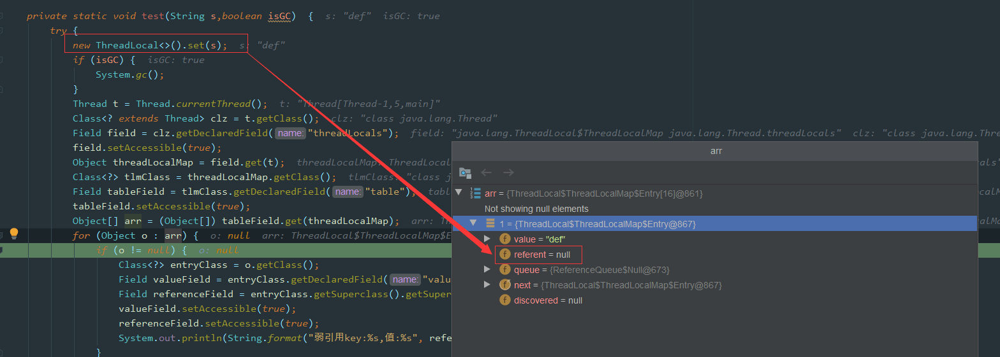
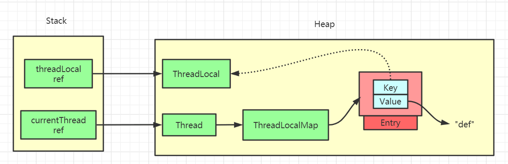
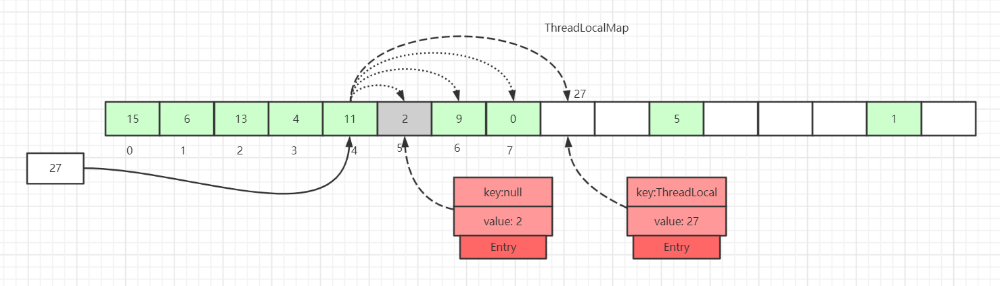
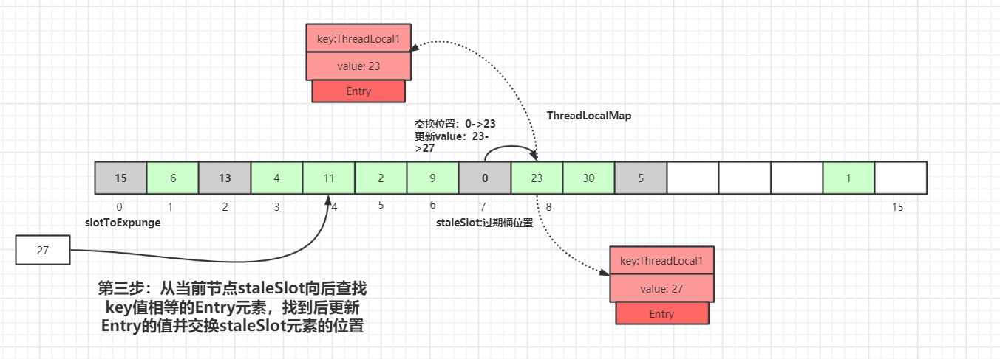
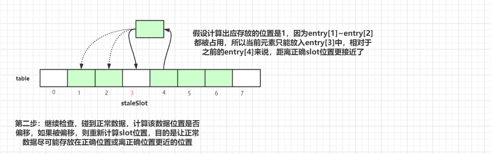
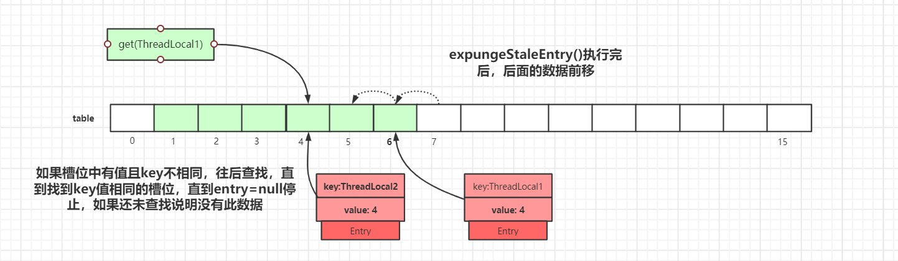
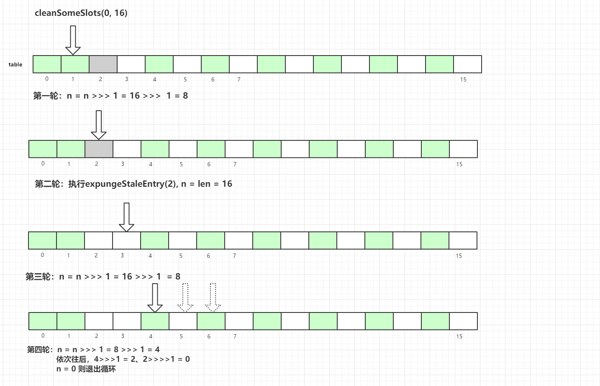

> Bài viết này do Một cành hoa có được xem là lãng mạn không gửi đến, địa chỉ bài viết gốc: [https://juejin.cn/post/6844904151567040519](https://juejin.cn/post/6844904151567040519).

### Lời mở đầu


**Bài viết dài hơn 10.000 từ, gồm 31 hình, cũng đã tốn không ít thời gian và công sức để hoàn thành. Viết bài gốc không dễ, hãy theo dõi và nhấn thích, cảm ơn mọi người.**

Đối với `ThreadLocal`, phản ứng đầu tiên của bạn có thể là: khá đơn giản, đó là bản sao biến theo thread, mỗi thread độc lập với nhau. Vậy bạn có thể suy nghĩ về một số câu hỏi sau:

- Key của `ThreadLocal` là **weak reference**, vậy khi gọi `ThreadLocal.get()`, sau khi xảy ra **GC**, key có phải là `null` không?
- **Cấu trúc dữ liệu** của `ThreadLocalMap` trong `ThreadLocal` là gì?
- **Thuật toán Hash** của `ThreadLocalMap` là gì?
- **Hash collision** trong `ThreadLocalMap` được giải quyết thế nào?
- **Cơ chế mở rộng** của `ThreadLocalMap` là gì?
- **Cơ chế dọn dẹp key hết hạn** trong `ThreadLocalMap`? Quy trình **dọn dẹp thăm dò** và **dọn dẹp heuristic**?
- Nguyên lý triển khai phương thức `ThreadLocalMap.set()`?
- Nguyên lý triển khai phương thức `ThreadLocalMap.get()`?
- Tình hình sử dụng `ThreadLocal` trong dự án? Đã gặp vấn đề gì?
- ………

Bạn đã nắm rõ tất cả các vấn đề trên chưa? Bài viết này sẽ phân tích **từng khía cạnh** của `ThreadLocal` bằng hình ảnh, xoay quanh các câu hỏi đó.

### Mục lục

**Lưu ý:** Source code trong bài viết dựa trên `JDK 1.8`

### Minh họa code `ThreadLocal`

Trước tiên, hãy xem ví dụ sử dụng `ThreadLocal`:

```java
public class ThreadLocalTest {
    private List<String> messages = Lists.newArrayList();

    public static final ThreadLocal<ThreadLocalTest> holder = ThreadLocal.withInitial(ThreadLocalTest::new);

    public static void add(String message) {
        holder.get().messages.add(message);
    }

    public static List<String> clear() {
        List<String> messages = holder.get().messages;
        holder.remove();

        System.out.println("size: " + holder.get().messages.size());
        return messages;
    }

    public static void main(String[] args) {
        ThreadLocalTest.add("Một cành hoa có được xem là lãng mạn không");
        System.out.println(holder.get().messages);
        ThreadLocalTest.clear();
    }
}
```

Kết quả in ra:

```java
[Một cành hoa có được xem là lãng mạn không]
size: 0
```

Đối tượng `ThreadLocal` có thể cung cấp biến cục bộ của thread. Mỗi thread `Thread` có một **bản sao biến** riêng, các thread không ảnh hưởng lẫn nhau.

### Cấu trúc dữ liệu của `ThreadLocal`


Lớp `Thread` có một biến instance kiểu `ThreadLocal.ThreadLocalMap` là `threadLocals`, nghĩa là mỗi thread có một `ThreadLocalMap` riêng.

`ThreadLocalMap` có cách triển khai độc lập. Có thể đơn giản xem `key` của nó là `ThreadLocal`, còn `value` là giá trị được đưa vào trong code (thực tế `key` không phải bản thân `ThreadLocal`, mà là một **weak reference** của nó).

Khi mỗi thread đưa giá trị vào `ThreadLocal`, giá trị sẽ được lưu vào `ThreadLocalMap` của chính thread đó. Khi đọc, `ThreadLocal` được dùng làm reference để tìm `key` tương ứng trong `map` của chính thread, từ đó thực hiện **thread isolation**.

`ThreadLocalMap` có cấu trúc khá giống `HashMap`, chỉ khác là `HashMap` được triển khai bằng **array + linked list**, còn `ThreadLocalMap` không có cấu trúc **linked list**.

Cũng cần chú ý đến `Entry`: `key` của nó là `ThreadLocal<?> k`, kế thừa từ `WeakReference`, tức kiểu weak reference thường được nhắc đến.

### Sau GC, key có phải là null không?

Quay lại câu hỏi ở phần đầu: `key` của `ThreadLocal` là weak reference, vậy khi gọi `ThreadLocal.get()`, sau khi xảy ra `GC`, `key` có phải là `null` không?

Để làm rõ vấn đề này, trước hết cần hiểu **bốn kiểu reference** của `Java`:

- **Strong reference**: Các object được tạo bằng `new` thường được tham chiếu bằng strong reference. Chỉ cần strong reference còn tồn tại, garbage collector sẽ không bao giờ thu hồi đối tượng được tham chiếu, kể cả khi thiếu memory.
- **Soft reference**: Đối tượng được tham chiếu bằng `SoftReference` được gọi là soft reference. Đối tượng mà soft reference trỏ đến sẽ được thu hồi khi memory sắp tràn.
- **Weak reference**: Nếu đối tượng được `WeakReference` tham chiếu không còn strong reference hoặc soft reference, nó là weakly reachable object. Khi garbage collector xử lý loại đối tượng này, nó sẽ xóa weak reference tương ứng. Một lần garbage collection cụ thể không đảm bảo lập tức xử lý tất cả đối tượng đủ điều kiện.
- **Phantom reference**: Phantom reference là loại reference yếu nhất, được định nghĩa bằng `PhantomReference` trong Java. Tác dụng duy nhất của phantom reference là dùng queue để nhận thông báo đối tượng sắp bị hủy.

Tiếp theo hãy xem code. Ta dùng reflection để kiểm tra dữ liệu trong `ThreadLocal` sau `GC` (code dưới đây lấy từ: <https://blog.csdn.net/thewindkee/article/details/103726942>, chạy local để minh họa tình huống GC thu hồi):

> `System.gc()` chỉ gửi đề xuất thực hiện garbage collection tới JVM. Kết quả dưới đây phù hợp để giải thích nguyên lý, nhưng không thể xem là hành vi chắc chắn xảy ra trong mọi lần chạy.

```java
public class ThreadLocalDemo {

    public static void main(String[] args) throws NoSuchFieldException, IllegalAccessException, InterruptedException {
        Thread t = new Thread(()->test("abc",false));
        t.start();
        t.join();
        System.out.println("--sau gc--");
        Thread t2 = new Thread(() -> test("def", true));
        t2.start();
        t2.join();
    }

    private static void test(String s,boolean isGC)  {
        try {
            new ThreadLocal<>().set(s);
            if (isGC) {
                System.gc();
            }
            Thread t = Thread.currentThread();
            Class<? extends Thread> clz = t.getClass();
            Field field = clz.getDeclaredField("threadLocals");
            field.setAccessible(true);
            Object ThreadLocalMap = field.get(t);
            Class<?> tlmClass = ThreadLocalMap.getClass();
            Field tableField = tlmClass.getDeclaredField("table");
            tableField.setAccessible(true);
            Object[] arr = (Object[]) tableField.get(ThreadLocalMap);
            for (Object o : arr) {
                if (o != null) {
                    Class<?> entryClass = o.getClass();
                    Field valueField = entryClass.getDeclaredField("value");
                    Field referenceField = entryClass.getSuperclass().getSuperclass().getDeclaredField("referent");
                    valueField.setAccessible(true);
                    referenceField.setAccessible(true);
                    System.out.println(String.format("weak reference key:%s, value:%s", referenceField.get(o), valueField.get(o)));
                }
            }
        } catch (Exception e) {
            e.printStackTrace();
        }
    }
}
```

Kết quả như sau:

```java
weak reference key:java.lang.ThreadLocal@433619b6,value:abc
weak reference key:java.lang.ThreadLocal@418a15e3,value:java.lang.ref.SoftReference@bf97a12
--sau gc--
weak reference key:null,value:def
```



Như hình trên, vì `ThreadLocal` được tạo ở đây không trỏ đến giá trị nào, tức là không có reference nào:

```java
new ThreadLocal<>().set(s);
```

Trong lần chạy ví dụ này, garbage collector đã xử lý `ThreadLocal` chỉ còn weak reference, nên ta thấy `referent=null`. Tuy nhiên điều này phụ thuộc vào việc JVM có thực sự thực hiện và hoàn tất garbage collection tương ứng hay không. Nếu **thay đổi code**:


Thoạt nhìn, nếu không suy nghĩ kỹ, chỉ cần thấy **weak reference** và **garbage collection** là chắc chắn sẽ cho rằng kết quả là `null`.

Thực ra không đúng, vì đề bài nói đang thực hiện thao tác `ThreadLocal.get()`, điều đó chứng minh vẫn còn **strong reference**, nên `key` không phải `null`. Như hình dưới đây, **strong reference** của `ThreadLocal` vẫn tồn tại.



Nếu **strong reference** của chúng ta không còn tồn tại, garbage collector có thể xóa `key` trong weak reference. Lúc này `Entry` vẫn giữ **strong reference** đến `value`, cho đến khi các thao tác tiếp theo của `ThreadLocalMap` dọn dẹp entry đã hết hiệu lực này, hoặc thread sở hữu kết thúc, toàn bộ Map không còn được tham chiếu; trong các thread có vòng đời dài như thread pool, thời gian lưu lại này có thể rất lâu, vì vậy tồn tại rủi ro memory leak.

### Giải thích chi tiết source code phương thức `ThreadLocal.set()`


Nguyên lý phương thức `set` trong `ThreadLocal` như hình trên: khá đơn giản, chủ yếu là kiểm tra `ThreadLocalMap` có tồn tại hay không, sau đó dùng phương thức `set` của `ThreadLocal` để xử lý dữ liệu.

Code như sau:

```java
public void set(T value) {
    Thread t = Thread.currentThread();
    ThreadLocalMap map = getMap(t);
    if (map != null)
        map.set(this, value);
    else
        createMap(t, value);
}

void createMap(Thread t, T firstValue) {
    t.threadLocals = new ThreadLocalMap(this, firstValue);
}
```

Logic cốt lõi chủ yếu vẫn nằm trong `ThreadLocalMap`. Hãy tiếp tục xem từng bước, phía sau còn có phân tích chi tiết hơn.

### Thuật toán Hash của `ThreadLocalMap`

Vì là cấu trúc `Map`, đương nhiên `ThreadLocalMap` cũng phải triển khai thuật toán `hash` riêng để giải quyết xung đột trong array của hash table.

```java
int i = key.threadLocalHashCode & (len-1);
```

Thuật toán `hash` trong `ThreadLocalMap` rất đơn giản. `i` là chỉ số trong array tương ứng với key hiện tại trong hash table.

Điểm then chốt ở đây là cách tính giá trị `threadLocalHashCode`. `ThreadLocal` có một thuộc tính `HASH_INCREMENT = 0x61c88647`.

```java
public class ThreadLocal<T> {
    private final int threadLocalHashCode = nextHashCode();

    private static AtomicInteger nextHashCode = new AtomicInteger();

    private static final int HASH_INCREMENT = 0x61c88647;

    private static int nextHashCode() {
        return nextHashCode.getAndAdd(HASH_INCREMENT);
    }

    static class ThreadLocalMap {
        ThreadLocalMap(ThreadLocal<?> firstKey, Object firstValue) {
            table = new Entry[INITIAL_CAPACITY];
            int i = firstKey.threadLocalHashCode & (INITIAL_CAPACITY - 1);

            table[i] = new Entry(firstKey, firstValue);
            size = 1;
            setThreshold(INITIAL_CAPACITY);
        }
    }
}
```

Mỗi khi tạo một đối tượng `ThreadLocal`, giá trị `ThreadLocal.nextHashCode` sẽ tăng thêm `0x61c88647`.

Hằng số này không phải số Fibonacci, mà là mức tăng hash 32-bit được suy ra từ tỷ lệ vàng. Các `ThreadLocal` được tạo liên tiếp sử dụng mức tăng này để sinh hash code, sau đó lấy các bit thấp theo array có độ dài là lũy thừa của 2, nhờ đó các slot được phân bố khá đều.

Ta có thể tự thử:


Có thể thấy hash code sinh ra được phân bố khá đều. Nếu quan tâm, bạn có thể tìm hiểu thêm về multiplicative hashing dựa trên tỷ lệ vàng.

### Hash collision trong `ThreadLocalMap`

> **Lưu ý:** Trong tất cả hình minh họa bên dưới, block **màu xanh lá** `Entry` đại diện cho **dữ liệu bình thường**, block **màu xám** đại diện cho `key` của `Entry` là `null`, **đã bị garbage collector thu hồi**. Block **màu trắng** biểu thị `Entry` là `null`.

Mặc dù `ThreadLocalMap` dùng **hệ số tỷ lệ vàng** để tính `hash`, giúp giảm đáng kể xác suất **Hash collision**, xung đột vẫn có thể xảy ra.

Trong `HashMap`, cách giải quyết xung đột là xây dựng cấu trúc **linked list** trên array, gắn dữ liệu xung đột vào linked list; nếu độ dài linked list vượt quá một mức nhất định thì chuyển thành **red-black tree**.

`ThreadLocalMap` không có cấu trúc linked list, nên không thể giải quyết xung đột theo cách của `HashMap`.



Như hình trên, nếu chèn dữ liệu có `value=27`, sau khi tính `hash` dữ liệu đáng lẽ rơi vào slot 4, nhưng slot 4 đã có `Entry`.

Khi đó sẽ tìm tuyến tính về phía sau, cho đến khi tìm được slot có `Entry` là `null` mới dừng, rồi đặt phần tử hiện tại vào slot đó. Trong quá trình lặp còn có các trường hợp khác, chẳng hạn gặp `Entry` khác `null` và `key` bằng nhau, hoặc gặp `key` trong `Entry` là `null`; mỗi trường hợp sẽ được xử lý khác nhau và lần lượt giải thích chi tiết ở phía sau.

Ở đây cũng vẽ một dữ liệu có `key` trong `Entry` là `null` (**block màu xám của Entry=2**), vì `key` là **weak reference** nên loại dữ liệu này có thể tồn tại. Trong quá trình `set`, nếu gặp `Entry` có `key` hết hạn thì thực tế sẽ thực hiện một lượt **dọn dẹp thăm dò**, cách thực hiện cụ thể sẽ được trình bày sau.

### Giải thích chi tiết `ThreadLocalMap.set()`

#### Minh họa nguyên lý `ThreadLocalMap.set()`

Sau khi xem **thuật toán hash** của `ThreadLocal`, hãy tiếp tục xem `set` được triển khai thế nào.

Việc `set` dữ liệu vào `ThreadLocalMap` (dữ liệu **mới** hoặc **cập nhật**) có vài trường hợp. Ta sẽ dùng hình để giải thích từng trường hợp.

**Trường hợp thứ nhất:** `Entry` tương ứng với slot sau khi tính `hash` là rỗng:


Chỉ cần đặt dữ liệu trực tiếp vào slot đó.

**Trường hợp thứ hai:** slot không rỗng, giá trị `key` giống với `key` nhận được khi tính `hash` của `ThreadLocal` hiện tại:


Chỉ cần cập nhật dữ liệu của slot đó.

**Trường hợp thứ ba:** slot không rỗng, trong quá trình duyệt về phía sau, trước khi tìm thấy slot có `Entry` là `null` thì không gặp `Entry` có `key` hết hạn:


Duyệt hash array, tìm tuyến tính về phía sau. Nếu tìm thấy slot có `Entry` là `null`, đặt dữ liệu vào slot đó; hoặc nếu trong quá trình duyệt gặp dữ liệu có **key bằng nhau**, chỉ cần cập nhật trực tiếp.

**Trường hợp thứ tư:** slot không rỗng, trong quá trình duyệt về phía sau, trước khi tìm thấy slot có `Entry` là `null` thì gặp `Entry` có `key` hết hạn. Như hình dưới đây, trong quá trình duyệt về phía sau gặp dữ liệu `Entry` ở slot `index=7` có `key=null`:


`key` của `Entry` tại index 7 của hash array là `null`, cho biết `key` của dữ liệu này đã bị garbage collection. Khi đó phương thức `replaceStaleEntry()` được thực thi. Phương thức này có ý nghĩa là **logic thay thế dữ liệu hết hạn**, bắt đầu từ **index=7** để thực hiện dọn dẹp dữ liệu theo phương thức thăm dò.

Khởi tạo vị trí bắt đầu quét dọn dẹp thăm dò dữ liệu hết hạn: `slotToExpunge = staleSlot = 7`.

Bắt đầu từ `staleSlot` hiện tại, lặp về phía trước để tìm dữ liệu hết hạn khác, sau đó cập nhật index bắt đầu quét `slotToExpunge`. Vòng lặp `for` tiếp tục cho đến khi gặp `Entry` là `null`.

Nếu tìm thấy dữ liệu hết hạn, tiếp tục lặp về phía trước cho đến khi gặp slot có `Entry=null` thì dừng. Như hình dưới đây, **slotToExpunge được cập nhật thành 0**:


Lặp về phía trước từ node hiện tại (`index=7`), kiểm tra có `Entry` hết hạn hay không; nếu có thì cập nhật `slotToExpunge`. Gặp `null` thì kết thúc thăm dò. Với ví dụ trên, `slotToExpunge` được cập nhật thành 0.

Thao tác lặp về phía trước ở trên nhằm cập nhật giá trị index bắt đầu dọn dẹp thăm dò dữ liệu hết hạn `slotToExpunge`. Giá trị này sẽ được giải thích sau, dùng để phán đoán trước `staleSlot` hiện tại còn phần tử hết hạn nào hay không.

Tiếp theo bắt đầu lặp về phía sau từ vị trí `staleSlot` (`index=7`), **nếu tìm thấy `Entry` có cùng key**:



Tìm `Entry` có giá trị `key` bằng nhau về phía sau từ node hiện tại `staleSlot`. Sau khi tìm thấy, cập nhật value của `Entry` và hoán đổi vị trí phần tử tại `staleSlot` (`staleSlot` là phần tử hết hạn), cập nhật dữ liệu `Entry`, rồi bắt đầu dọn dẹp `Entry` hết hạn, như hình dưới đây:

 Trong quá trình duyệt về phía sau, nếu không tìm thấy `Entry` có cùng giá trị key:


Tìm `Entry` có giá trị `key` bằng nhau về phía sau từ node hiện tại `staleSlot`, dừng tìm khi `Entry` là `null`. Qua hình trên có thể thấy lúc này trong `table` không có `Entry` nào có cùng giá trị `key`.

Tạo `Entry` mới và thay thế vị trí `table[staleSlot]`:


Sau khi thay thế cũng sẽ dọn dẹp phần tử hết hạn. Công việc dọn dẹp chủ yếu dùng hai phương thức: `expungeStaleEntry()` và `cleanSomeSlots()`. Chi tiết sẽ được trình bày sau, hãy tiếp tục theo dõi.

#### Giải thích chi tiết source code `ThreadLocalMap.set()`

Ở trên đã phân tích nguyên lý triển khai `set()` bằng hình ảnh, thực ra đã khá rõ ràng. Tiếp theo hãy xem source code:

`java.lang.ThreadLocal`.`ThreadLocalMap.set()`:

```java
private void set(ThreadLocal<?> key, Object value) {
    Entry[] tab = table;
    int len = tab.length;
    int i = key.threadLocalHashCode & (len-1);

    for (Entry e = tab[i];
         e != null;
         e = tab[i = nextIndex(i, len)]) {
        ThreadLocal<?> k = e.get();

        if (k == key) {
            e.value = value;
            return;
        }

        if (k == null) {
            replaceStaleEntry(key, value, i);
            return;
        }
    }

    tab[i] = new Entry(key, value);
    int sz = ++size;
    if (!cleanSomeSlots(i, sz) && sz >= threshold)
        rehash();
}
```

Ở đây sẽ tính vị trí tương ứng trong hash table bằng `key`, sau đó tìm về phía sau từ vị trí bucket tương ứng với `key` hiện tại để tìm bucket có thể sử dụng.

```java
Entry[] tab = table;
int len = tab.length;
int i = key.threadLocalHashCode & (len-1);
```

Khi nào bucket có thể sử dụng?

1. `k = key` nghĩa là thao tác thay thế, có thể sử dụng.
2. Gặp bucket hết hạn thì thực hiện logic thay thế, chiếm bucket hết hạn.
3. Trong quá trình tìm kiếm, gặp bucket có `Entry=null` thì sử dụng trực tiếp.

Tiếp theo thực hiện vòng lặp `for` để tìm về phía sau. Trước tiên hãy xem cách triển khai phương thức `nextIndex()` và `prevIndex()`:


```java
private static int nextIndex(int i, int len) {
    return ((i + 1 < len) ? i + 1 : 0);
}

private static int prevIndex(int i, int len) {
    return ((i - 1 >= 0) ? i - 1 : len - 1);
}
```

Tiếp theo xem logic còn lại trong vòng lặp `for`:

1. Duyệt đến bucket tương ứng với `key` hiện tại nhưng `Entry` là `null`. Điều này cho biết không có xung đột dữ liệu ở vị trí này của hash array, thoát vòng lặp `for` và `set` dữ liệu trực tiếp vào bucket tương ứng.
2. Nếu dữ liệu `Entry` trong bucket tương ứng với `key` không rỗng:
   2.1 Nếu `k = key`, thao tác `set` hiện tại là thay thế, thực hiện logic thay thế rồi return trực tiếp.
   2.2 Nếu `key = null`, `Entry` tại vị trí bucket hiện tại là dữ liệu hết hạn, thực thi phương thức `replaceStaleEntry()` (phương thức cốt lõi), rồi return.
3. Vòng lặp `for` kết thúc, tiếp tục thực thi bên dưới nghĩa là trong quá trình lặp về phía sau đã gặp `entry` là `null`:
   3.1 Tạo một đối tượng `Entry` mới trong bucket có `Entry` là `null`.
   3.2 Thực hiện thao tác `++size`.
4. Gọi `cleanSomeSlots()` để thực hiện một lượt dọn dẹp theo heuristic, dọn dữ liệu có `key` hết hạn trong `Entry` của hash array.
   4.1 Nếu sau khi dọn dẹp không dọn được dữ liệu nào và `size` vượt ngưỡng (2/3 độ dài array), thực hiện `rehash()`.
   4.2 `rehash()` trước tiên thực hiện một lượt dọn dẹp thăm dò để dọn `key` hết hạn. Sau khi dọn xong, nếu **size >= threshold - threshold / 4** thì thực hiện logic mở rộng thực sự (xem logic mở rộng ở phần sau).

Tiếp theo hãy tập trung xem phương thức `replaceStaleEntry()`. Phương thức này cung cấp chức năng thay thế dữ liệu hết hạn. Có thể đối chiếu lại sơ đồ nguyên lý **trường hợp thứ tư** ở trên. Code cụ thể như sau:

`java.lang.ThreadLocal.ThreadLocalMap.replaceStaleEntry()`:

```java
private void replaceStaleEntry(ThreadLocal<?> key, Object value,
                                       int staleSlot) {
    Entry[] tab = table;
    int len = tab.length;
    Entry e;

    int slotToExpunge = staleSlot;
    for (int i = prevIndex(staleSlot, len);
         (e = tab[i]) != null;
         i = prevIndex(i, len))

        if (e.get() == null)
            slotToExpunge = i;

    for (int i = nextIndex(staleSlot, len);
         (e = tab[i]) != null;
         i = nextIndex(i, len)) {

        ThreadLocal<?> k = e.get();

        if (k == key) {
            e.value = value;

            tab[i] = tab[staleSlot];
            tab[staleSlot] = e;

            if (slotToExpunge == staleSlot)
                slotToExpunge = i;
            cleanSomeSlots(expungeStaleEntry(slotToExpunge), len);
            return;
        }

        if (k == null && slotToExpunge == staleSlot)
            slotToExpunge = i;
    }

    tab[staleSlot].value = null;
    tab[staleSlot] = new Entry(key, value);

    if (slotToExpunge != staleSlot)
        cleanSomeSlots(expungeStaleEntry(slotToExpunge), len);
}
```

`slotToExpunge` biểu thị index bắt đầu dọn dẹp thăm dò dữ liệu hết hạn, mặc định bắt đầu từ `staleSlot` hiện tại. Bắt đầu từ `staleSlot`, lặp về phía trước để tìm dữ liệu hết hạn khác. Vòng lặp `for` chỉ kết thúc khi gặp `Entry` là `null`. Nếu tìm thấy dữ liệu hết hạn khi lặp về phía trước, cập nhật index bắt đầu dọn dẹp thăm dò thành i, tức `slotToExpunge=i`.

```java
for (int i = prevIndex(staleSlot, len);
     (e = tab[i]) != null;
     i = prevIndex(i, len)){

    if (e.get() == null){
        slotToExpunge = i;
    }
}
```

Tiếp theo bắt đầu tìm về phía sau từ `staleSlot`, cũng kết thúc khi gặp bucket có `Entry` là `null`.
Nếu trong quá trình lặp **gặp k == key**, nghĩa là đây là logic thay thế: thay thế dữ liệu mới và đổi vị trí hiện tại `staleSlot`. Nếu `slotToExpunge == staleSlot`, nghĩa là lúc đầu khi tìm về phía trước trong `replaceStaleEntry()` không tìm thấy `Entry` hết hạn, sau đó khi tìm về phía sau cũng không phát hiện dữ liệu hết hạn. Khi đó cập nhật index bắt đầu dọn dẹp thăm dò thành index của vòng lặp hiện tại, tức `slotToExpunge = i`. Cuối cùng gọi `cleanSomeSlots(expungeStaleEntry(slotToExpunge), len);` để dọn dẹp heuristic dữ liệu hết hạn.

```java
if (k == key) {
    e.value = value;

    tab[i] = tab[staleSlot];
    tab[staleSlot] = e;

    if (slotToExpunge == staleSlot)
        slotToExpunge = i;

    cleanSomeSlots(expungeStaleEntry(slotToExpunge), len);
    return;
}
```

Các phương thức `cleanSomeSlots()` và `expungeStaleEntry()` sẽ được giải thích chi tiết sau. Một phương thức là dọn dẹp heuristic (`Heuristically scan`) các `Entry` liên quan đến `key` hết hạn, phương thức còn lại là dọn dẹp thăm dò các `Entry` liên quan đến `key` hết hạn.

**Nếu k != key**, code tiếp tục. `k == null` cho biết `Entry` hiện tại là dữ liệu hết hạn, còn `slotToExpunge == staleSlot` cho biết lúc đầu khi tìm về phía trước không tìm thấy `Entry` hết hạn. Nếu điều kiện đúng, cập nhật `slotToExpunge` thành vị trí hiện tại. Điều kiện này dựa trên việc lần quét node trước đó không phát hiện dữ liệu hết hạn.

```java
if (k == null && slotToExpunge == staleSlot)
    slotToExpunge = i;
```

Trong quá trình lặp về phía sau, nếu không tìm thấy dữ liệu `k == key` và gặp dữ liệu có `Entry` là `null`, thao tác lặp hiện tại kết thúc. Điều này cho biết đây là logic thêm mới, dữ liệu mới được thêm vào `slot` tương ứng với `table[staleSlot]`.

```java
tab[staleSlot].value = null;
tab[staleSlot] = new Entry(key, value);
```

Cuối cùng, nếu ngoài `staleSlot` còn phát hiện dữ liệu `slot` khác đã hết hạn, sẽ bắt đầu logic dọn dẹp:

```java
if (slotToExpunge != staleSlot)
    cleanSomeSlots(expungeStaleEntry(slotToExpunge), len);
```

### Quy trình dọn dẹp thăm dò key hết hạn của `ThreadLocalMap`

Ở trên đã nhắc đến hai cách dọn dẹp dữ liệu `key` hết hạn của `ThreadLocalMap`: **dọn dẹp thăm dò** và **dọn dẹp heuristic**.

Trước tiên hãy nói về dọn dẹp thăm dò, tức phương thức `expungeStaleEntry`. Phương thức này duyệt hash array, bắt đầu từ vị trí chỉ định để thăm dò và dọn dữ liệu hết hạn, đặt `Entry` của dữ liệu hết hạn thành `null`. Khi gặp dữ liệu chưa hết hạn trên đường đi, nó rehash dữ liệu rồi định vị lại trong array `table`. Nếu vị trí định vị đã có dữ liệu, dữ liệu chưa hết hạn sẽ được đặt vào bucket `Entry=null` gần vị trí đó nhất, để sau khi rehash, khoảng cách từ `Entry` đến bucket đúng gần hơn. Logic thao tác như sau:


Như hình trên, sau khi `set(27)` tính hash, dữ liệu đáng lẽ rơi vào bucket `index=4`. Vì bucket `index=4` đã có dữ liệu nên qua quá trình lặp về phía sau, dữ liệu cuối cùng được đặt vào bucket `index=7`. Sau một thời gian, `key` của dữ liệu `Entry` tại `index=5` trở thành `null`.


Nếu tiếp tục có dữ liệu khác được `set` vào `map`, thao tác **dọn dẹp thăm dò** sẽ được kích hoạt.

Như hình trên, sau khi thực hiện **dọn dẹp thăm dò**, dữ liệu tại `index=5` bị dọn. Tiếp tục lặp về phía sau đến phần tử tại `index=7`, sau khi rehash phát hiện index đúng của phần tử là `index=4`. Vì vị trí này đã có dữ liệu, tiếp tục tìm node `Entry=null` gần `index=4` nhất (dữ liệu vừa bị dọn bởi dọn dẹp thăm dò: `index=5`), sau đó di chuyển dữ liệu tại `index=7` vào `index=5`. Lúc này vị trí bucket đã gần vị trí đúng `index=4` hơn.

Sau một lượt dọn dẹp thăm dò, dữ liệu có `key` hết hạn sẽ bị dọn. Vị trí bucket của dữ liệu chưa hết hạn sau khi rehash và định vị lại về lý thuyết sẽ gần vị trí `i= key.hashCode & (tab.len - 1)` hơn. Tối ưu này giúp cải thiện performance truy vấn của toàn bộ hash table.

Tiếp theo hãy xem quy trình cụ thể của `expungeStaleEntry()`. Ta vẫn lần lượt phân tích theo cách trình bày sơ đồ nguyên lý trước rồi đến source code:


Giả sử gọi phương thức này bằng `expungeStaleEntry(3)`. Như hình trên, ta thấy tình hình dữ liệu `table` trong `ThreadLocalMap`, sau đó thực hiện dọn dẹp:


Bước đầu tiên là xóa dữ liệu tại vị trí `staleSlot` hiện tại, `Entry` ở vị trí `index=3` trở thành `null`. Sau đó tiếp tục thăm dò về phía sau:



Sau bước thứ hai, phần tử ở index=4 được chuyển đến slot index=3.

Tiếp tục lặp về phía sau để kiểm tra. Khi gặp dữ liệu bình thường, tính xem vị trí dữ liệu có bị lệch hay không. Nếu bị lệch, tính lại vị trí `slot`, nhằm lưu dữ liệu bình thường ở vị trí đúng hoặc gần vị trí đúng nhất có thể.


Trong quá trình lặp về phía sau, khi gặp slot trống thì kết thúc thăm dò. Như vậy một lượt dọn dẹp thăm dò đã hoàn thành. Tiếp theo hãy xem **source code triển khai** cụ thể:

```java
private int expungeStaleEntry(int staleSlot) {
    Entry[] tab = table;
    int len = tab.length;

    tab[staleSlot].value = null;
    tab[staleSlot] = null;
    size--;

    Entry e;
    int i;
    for (i = nextIndex(staleSlot, len);
         (e = tab[i]) != null;
         i = nextIndex(i, len)) {
        ThreadLocal<?> k = e.get();
        if (k == null) {
            e.value = null;
            tab[i] = null;
            size--;
        } else {
            int h = k.threadLocalHashCode & (len - 1);
            if (h != i) {
                tab[i] = null;

                while (tab[h] != null)
                    h = nextIndex(h, len);
                tab[h] = e;
            }
        }
    }
    return i;
}
```

Ta vẫn dùng `staleSlot=3` để minh họa. Trước tiên xóa dữ liệu ở slot `tab[staleSlot]`, sau đó đặt `size--`.
Tiếp theo lặp về phía sau từ vị trí `staleSlot`. Nếu gặp dữ liệu hết hạn `k==null`, cũng xóa dữ liệu ở slot đó rồi `size--`.

```java
ThreadLocal<?> k = e.get();

if (k == null) {
    e.value = null;
    tab[i] = null;
    size--;
}
```

Nếu `key` chưa hết hạn, tính lại xem index của `key` hiện tại có phải index của slot hiện tại hay không. Nếu không, nghĩa là đã xảy ra **Hash collision**. Khi đó lặp về phía sau từ vị trí slot đúng mới tính được, tìm vị trí gần nhất có thể lưu `entry`.

```java
int h = k.threadLocalHashCode & (len - 1);
if (h != i) {
    tab[i] = null;

    while (tab[h] != null)
        h = nextIndex(h, len);

    tab[h] = e;
}
```

Đây là cách xử lý dữ liệu bình thường bị **Hash collision**. Sau khi lặp, vị trí `Entry` của dữ liệu bị Hash collision sẽ gần vị trí đúng hơn, nhờ đó performance truy vấn sẽ cao hơn.

### Cơ chế mở rộng của `ThreadLocalMap`

Ở cuối phương thức `ThreadLocalMap.set()`, nếu sau khi thực hiện dọn dẹp heuristic mà không dọn được dữ liệu nào và số lượng `Entry` trong hash array hiện tại đã đạt ngưỡng mở rộng `(len*2/3)`, logic `rehash()` sẽ được thực hiện:

```java
if (!cleanSomeSlots(i, sz) && sz >= threshold)
    rehash();
```

Tiếp theo xem cách triển khai cụ thể của `rehash()`:

```java
private void rehash() {
    expungeStaleEntries();

    if (size >= threshold - threshold / 4)
        resize();
}

private void expungeStaleEntries() {
    Entry[] tab = table;
    int len = tab.length;
    for (int j = 0; j < len; j++) {
        Entry e = tab[j];
        if (e != null && e.get() == null)
            expungeStaleEntry(j);
    }
}
```

Trước tiên sẽ thực hiện dọn dẹp thăm dò, dọn từ đầu `table` về phía sau; quy trình chi tiết đã được phân tích ở trên. Sau khi dọn dẹp, một số dữ liệu `Entry` có `key` là `null` trong `table` có thể đã bị dọn. Vì vậy lúc này kiểm tra `size >= threshold - threshold / 4`, tức `size >= threshold * 3/4`, để quyết định có mở rộng hay không.

Ta nhớ rằng ngưỡng thực hiện `rehash()` ở trên là `size >= threshold`. Vì vậy khi người phỏng vấn hỏi về cơ chế mở rộng của `ThreadLocalMap`, cần nói rõ hai bước này:


Tiếp theo xem phương thức `resize()` cụ thể. Để tiện minh họa, ta lấy `oldTab.len=8` làm ví dụ:


Kích thước `tab` sau khi mở rộng là `oldLen * 2`. Sau đó duyệt hash table cũ, tính lại vị trí `hash` rồi đặt vào array `tab` mới. Nếu xảy ra **Hash collision** thì tìm về phía sau slot gần nhất có `entry` là `null`. Sau khi duyệt xong, toàn bộ dữ liệu `entry` trong `oldTab` đã được đưa vào `tab` mới. Tính lại **threshold** cho lần mở rộng tiếp theo, code cụ thể như sau:

```java
private void resize() {
    Entry[] oldTab = table;
    int oldLen = oldTab.length;
    int newLen = oldLen * 2;
    Entry[] newTab = new Entry[newLen];
    int count = 0;

    for (int j = 0; j < oldLen; ++j) {
        Entry e = oldTab[j];
        if (e != null) {
            ThreadLocal<?> k = e.get();
            if (k == null) {
                e.value = null;
            } else {
                int h = k.threadLocalHashCode & (newLen - 1);
                while (newTab[h] != null)
                    h = nextIndex(h, newLen);
                newTab[h] = e;
                count++;
            }
        }
    }

    setThreshold(newLen);
    size = count;
    table = newTab;
}
```

### Giải thích chi tiết `ThreadLocalMap.get()`

Ở trên đã xem xong source code phương thức `set()`, bao gồm các thao tác `set` dữ liệu, dọn dẹp dữ liệu và tối ưu vị trí bucket dữ liệu. Tiếp theo hãy xem nguyên lý của thao tác `get()`.

#### Minh họa `ThreadLocalMap.get()`

**Trường hợp thứ nhất:** Tính vị trí `slot` trong hash table bằng giá trị `key` cần tìm, sau đó `Entry.key` tại vị trí `slot` giống với `key` cần tìm, nên return trực tiếp:


**Trường hợp thứ hai:** `Entry.key` tại vị trí `slot` không giống với `key` cần tìm:


Lấy `get(ThreadLocal1)` làm ví dụ. Sau khi tính `hash`, vị trí `slot` đúng phải là 4, nhưng bucket tại `index=4` đã có dữ liệu và giá trị `key` không bằng `ThreadLocal1`, nên cần tiếp tục lặp tìm về phía sau.

Khi lặp đến dữ liệu tại `index=5`, `Entry.key=null`, kích hoạt một lượt dọn dẹp thăm dò và thực thi phương thức `expungeStaleEntry()`. Sau khi thực thi, dữ liệu tại `index 5,8` đều được dọn, còn dữ liệu tại `index 6,7` được chuyển lên phía trước. Sau khi `index 6,7` dịch chuyển, tiếp tục lặp về phía sau từ `index=5`, nhờ đó tìm thấy `Entry` có giá trị `key` bằng nhau tại `index=6`, như hình dưới đây:



#### Giải thích chi tiết source code `ThreadLocalMap.get()`

`java.lang.ThreadLocal.ThreadLocalMap.getEntry()`:

```java
private Entry getEntry(ThreadLocal<?> key) {
    int i = key.threadLocalHashCode & (table.length - 1);
    Entry e = table[i];
    if (e != null && e.get() == key)
        return e;
    else
        return getEntryAfterMiss(key, i, e);
}

private Entry getEntryAfterMiss(ThreadLocal<?> key, int i, Entry e) {
    Entry[] tab = table;
    int len = tab.length;

    while (e != null) {
        ThreadLocal<?> k = e.get();
        if (k == key)
            return e;
        if (k == null)
            expungeStaleEntry(i);
        else
            i = nextIndex(i, len);
        e = tab[i];
    }
    return null;
}
```

### Quy trình dọn dẹp heuristic key hết hạn của `ThreadLocalMap`

Ở trên đã nhiều lần nhắc đến hai cách dọn dẹp key hết hạn của `ThreadLocalMap`: **dọn dẹp thăm dò (`expungeStaleEntry()`)** và **dọn dẹp heuristic (`cleanSomeSlots()`)**.

Dọn dẹp thăm dò bắt đầu từ `Entry` hiện tại và dọn về phía sau, gặp giá trị `null` thì kết thúc, thuộc loại **dọn dẹp linear probing**.

Còn dọn dẹp heuristic được tác giả định nghĩa là: **Heuristically scan some cells looking for stale entries**.



Code cụ thể như sau:

```java
private boolean cleanSomeSlots(int i, int n) {
    boolean removed = false;
    Entry[] tab = table;
    int len = tab.length;
    do {
        i = nextIndex(i, len);
        Entry e = tab[i];
        if (e != null && e.get() == null) {
            n = len;
            removed = true;
            i = expungeStaleEntry(i);
        }
    } while ( (n >>>= 1) != 0);
    return removed;
}
```

### `InheritableThreadLocal`

Khi sử dụng `ThreadLocal`, trong tình huống bất đồng bộ, không thể chia sẻ bản sao biến của thread được tạo trong thread cha với thread con.

Để giải quyết vấn đề này, JDK còn có lớp `InheritableThreadLocal`. Hãy xem một ví dụ:

```java
public class InheritableThreadLocalDemo {
    public static void main(String[] args) {
        ThreadLocal<String> ThreadLocal = new ThreadLocal<>();
        ThreadLocal<String> inheritableThreadLocal = new InheritableThreadLocal<>();
        ThreadLocal.set("Dữ liệu thread cha:threadLocal");
        inheritableThreadLocal.set("Dữ liệu thread cha:inheritableThreadLocal");

        new Thread(new Runnable() {
            @Override
            public void run() {
                System.out.println("Thread con lấy dữ liệu ThreadLocal của thread cha: " + ThreadLocal.get());
                System.out.println("Thread con lấy dữ liệu inheritableThreadLocal của thread cha: " + inheritableThreadLocal.get());
            }
        }).start();
    }
}
```

Kết quả in ra:

```java
Thread con lấy dữ liệu ThreadLocal của thread cha: null
Thread con lấy dữ liệu inheritableThreadLocal của thread cha: Dữ liệu thread cha:inheritableThreadLocal
```

Nguyên lý triển khai là thread con được tạo trong thread cha bằng cách gọi phương thức `new Thread()`. Phương thức `Thread#init` được gọi trong constructor của `Thread`. Trong phương thức `init`, dữ liệu của thread cha được copy sang thread con:

```java
private void init(ThreadGroup g, Runnable target, String name,
                      long stackSize, AccessControlContext acc,
                      boolean inheritThreadLocals) {
    if (name == null) {
        throw new NullPointerException("name cannot be null");
    }

    if (inheritThreadLocals && parent.inheritableThreadLocals != null)
        this.inheritableThreadLocals =
            ThreadLocal.createInheritedMap(parent.inheritableThreadLocals);
    this.stackSize = stackSize;
    tid = nextThreadID();
}
```

Tuy nhiên `InheritableThreadLocal` vẫn có hạn chế. Thông thường xử lý bất đồng bộ đều dùng thread pool, còn `InheritableThreadLocal` được khởi tạo trong phương thức `init()` khi `new Thread` được gọi, trong khi thread pool hoạt động theo cơ chế tái sử dụng thread, nên sẽ phát sinh vấn đề.

Tất nhiên, khi có vấn đề sẽ có giải pháp. Alibaba đã open source một component `TransmittableThreadLocal` có thể giải quyết vấn đề này. Phần này không mở rộng thêm; nếu quan tâm, bạn có thể tự tra cứu tài liệu.

### Thực hành sử dụng `ThreadLocal` trong dự án

#### Trường hợp sử dụng `ThreadLocal`

Trong dự án hiện tại, việc ghi log sử dụng `ELK+Logstash`, cuối cùng hiển thị và tìm kiếm trong `Kibana`.

Hiện nay các hệ thống phân tán đều cung cấp service ra bên ngoài một cách thống nhất. Quan hệ gọi giữa các dự án có thể liên kết bằng `traceId`, nhưng làm thế nào truyền `traceId` giữa các dự án khác nhau?

Ở đây ta dùng `org.slf4j.MDC` để thực hiện chức năng này, bên trong được triển khai bằng `ThreadLocal`. Cách triển khai cụ thể như sau:

Khi frontend gửi request đến **service A**, **service A** tạo một chuỗi `traceId` tương tự `UUID`, đặt chuỗi này vào `ThreadLocal` của thread hiện tại. Khi gọi **service B**, ghi `traceId` vào `Header` của request. Khi **service B** nhận request, trước tiên kiểm tra `Header` của request có `traceId` hay không; nếu có thì ghi vào `ThreadLocal` của thread thuộc service B.


`requestId` trong hình chính là `traceId` dùng để liên kết toàn bộ call chain của các hệ thống. Khi các hệ thống gọi lẫn nhau, có thể tìm call chain tương ứng bằng `requestId`. Ngoài ra còn một số trường hợp khác:


Với các trường hợp này, ta đều có giải pháp tương ứng như sau.

#### Giải pháp gọi remote bằng Feign

**Service gửi request:**

```java
@Component
@Slf4j
public class FeignInvokeInterceptor implements RequestInterceptor {

    @Override
    public void apply(RequestTemplate template) {
        String requestId = MDC.get("requestId");
        if (StringUtils.isNotBlank(requestId)) {
            template.header("requestId", requestId);
        }
    }
}
```

**Service nhận request:**

```java
@Slf4j
@Component
public class LogInterceptor extends HandlerInterceptorAdapter {

    @Override
    public void afterCompletion(HttpServletRequest arg0, HttpServletResponse arg1, Object arg2, Exception arg3) {
        MDC.remove("requestId");
    }

    @Override
    public void postHandle(HttpServletRequest arg0, HttpServletResponse arg1, Object arg2, ModelAndView arg3) {
    }

    @Override
    public boolean preHandle(HttpServletRequest request, HttpServletResponse response, Object handler) throws Exception {

        String requestId = request.getHeader(BaseConstant.REQUEST_ID_KEY);
        if (StringUtils.isBlank(requestId)) {
            requestId = UUID.randomUUID().toString().replace("-", "");
        }
        MDC.put("requestId", requestId);
        return true;
    }
}
```

#### Truyền requestId khi gọi bất đồng bộ bằng thread pool

Vì `MDC` được triển khai dựa trên `ThreadLocal`, trong quá trình bất đồng bộ, thread con không thể lấy dữ liệu được lưu trong `ThreadLocal` của thread cha. Vì vậy có thể tùy chỉnh executor của thread pool và sửa phương thức `run()`:

```java
public class MyThreadPoolTaskExecutor extends ThreadPoolTaskExecutor {

    @Override
    public void execute(Runnable runnable) {
        Map<String, String> context = MDC.getCopyOfContextMap();
        super.execute(() -> run(runnable, context));
    }

    @Override
    private void run(Runnable runnable, Map<String, String> context) {
        if (context != null) {
            MDC.setContextMap(context);
        }
        try {
            runnable.run();
        } finally {
            MDC.remove();
        }
    }
}
```

#### Gửi message đến hệ thống bên thứ ba bằng MQ

Tự định nghĩa thuộc tính `requestId` trong message body được gửi qua MQ. Sau khi bên nhận consume message, tự parse và sử dụng `requestId`.

<!-- @include: @article-footer.snippet.md -->
