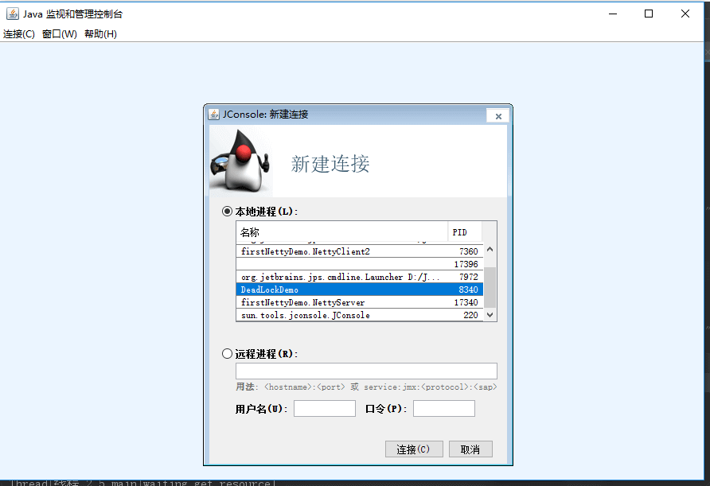
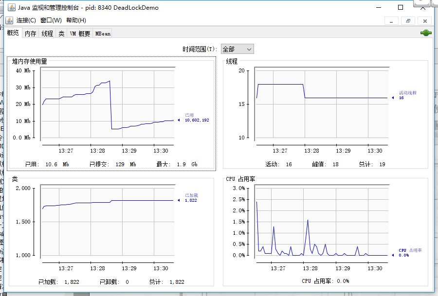

## Công cụ dòng lệnh JDK

Các lệnh này nằm trong thư mục `bin` của thư mục cài đặt JDK:

- **`jps`** (JVM Process Status): Tương tự lệnh `ps` của UNIX. Dùng để xem class khởi động, tham số truyền vào, tham số Java Virtual Machine và các thông tin khác của tất cả Java process;
- **`jstat`** (JVM Statistics Monitoring Tool): Dùng để thu thập dữ liệu runtime ở nhiều khía cạnh của HotSpot Virtual Machine;
- **`jinfo`** (Configuration Info for Java): Configuration Info for Java, hiển thị thông tin cấu hình Virtual Machine;
- **`jmap`** (Memory Map for Java): Tạo heap dump snapshot;
- **`jhat`** (JVM Heap Dump Browser): Dùng để phân tích file heapdump, công cụ này tạo một HTTP/HTML server để người dùng xem kết quả phân tích trên browser. JDK 9 đã loại bỏ jhat;
- **`jstack`** (Stack Trace for Java): Tạo thread snapshot của Virtual Machine tại thời điểm hiện tại. Thread snapshot là tập hợp stack của các method mà mỗi thread trong Virtual Machine đang thực thi.

### `jps`: Xem tất cả Java process

Lệnh `jps` (JVM Process Status) tương tự lệnh `ps` của UNIX, dùng để liệt kê các JVM process mà user hiện tại có quyền truy cập và công cụ có thể phát hiện, nhưng không đảm bảo liệt kê tất cả Java process trong hệ thống.

`jps`: Hiển thị tên main class mà Virtual Machine thực thi cùng unique ID của local Virtual Machine (Local Virtual Machine Identifier, LVMID) của các process này. `jps -q`: Chỉ output unique ID của local Virtual Machine của process.

```powershell
C:\Users\SnailClimb>jps
7360 NettyClient2
17396
7972 Launcher
16504 Jps
17340 NettyServer
```

`jps -l`: Output full name của main class; nếu process thực thi một Jar, output path của Jar.

```powershell
C:\Users\SnailClimb>jps -l
7360 firstNettyDemo.NettyClient2
17396
7972 org.jetbrains.jps.cmdline.Launcher
16492 sun.tools.jps.Jps
17340 firstNettyDemo.NettyServer
```

`jps -v`: Output tham số JVM khi Virtual Machine process khởi động.

`jps -m`: Output tham số truyền cho hàm main() của Java process.

### `jstat`: Monitoring nhiều trạng thái runtime của Virtual Machine

`jstat` (JVM Statistics Monitoring Tool) là công cụ dòng lệnh dùng để monitoring nhiều trạng thái runtime của Virtual Machine. Công cụ có thể hiển thị thông tin class, memory, garbage collection, JIT compilation và các dữ liệu runtime khác trong local hoặc remote (remote host phải cung cấp hỗ trợ RMI) Virtual Machine process. Trên server không có GUI mà chỉ cung cấp môi trường console thuần text, đây là công cụ được ưu tiên hàng đầu để xác định vấn đề performance của Virtual Machine trong runtime.

**Format sử dụng lệnh `jstat`:**

```powershell
jstat -<option> [-t] [-h<lines>] <vmid> [<interval> [<count>]]
```

Ví dụ, `jstat -gc -h3 31736 1000 10` nghĩa là phân tích tình trạng gc của process có id 31736, in một record mỗi 1000ms, dừng sau 10 lần in và in header của metric sau mỗi 3 dòng.

**Các option thường gặp:**

- `jstat -class vmid`: Hiển thị thông tin liên quan đến ClassLoader;
- `jstat -compiler vmid`: Hiển thị thông tin liên quan đến JIT compilation;
- `jstat -gc vmid`: Hiển thị heap information liên quan đến GC;
- `jstat -gccapacity vmid`: Hiển thị capacity và tình trạng sử dụng của từng generation;
- `jstat -gcnew vmid`: Hiển thị thông tin new generation;
- `jstat -gcnewcapacity vmid`: Hiển thị size và tình trạng sử dụng của new generation;
- `jstat -gcold vmid`: Hiển thị thống kê hành vi của old generation; trong JDK hiện đại, output còn bao gồm thống kê meta space và compressed class space;
- `jstat -gcoldcapacity vmid`: Hiển thị size của old generation;
- `jstat -gcpermcapacity vmid`: Hiển thị size của permanent generation, option này không còn tồn tại từ JDK 8; trong JDK hiện đại có thể dùng `-gcmetacapacity` để xem thống kê capacity của meta space;
- `jstat -gcutil vmid`: Hiển thị thông tin garbage collection;

Ngoài ra, thêm tham số `-t` sẽ thêm một cột Timestamp vào output, hiển thị runtime của chương trình.

### `jinfo`: Xem và điều chỉnh realtime các tham số của Virtual Machine

`jinfo vmid`: Output toàn bộ tham số và system property của JVM process hiện tại (phần đầu là system property, phần thứ hai là tham số JVM).

`jinfo -flag name vmid`: Output giá trị cụ thể của tham số có tên tương ứng. Ví dụ output `MaxHeapSize`. Ví dụ xem và điều chỉnh động `PrintGC` bên dưới áp dụng cho JDK 8; từ JDK 9 trở đi, GC log nên dùng unified logging parameter `-Xlog` và có thể điều chỉnh trong runtime qua `jcmd VM.log`.

```powershell
C:\Users\SnailClimb>jinfo  -flag MaxHeapSize 17340
-XX:MaxHeapSize=2124414976
C:\Users\SnailClimb>jinfo  -flag PrintGC 17340
-XX:-PrintGC
```

`jinfo` có thể dynamic modify một phần JVM parameter được đánh dấu là có thể quản lý mà không cần restart Virtual Machine, nhưng không phải mọi parameter đều hỗ trợ modify trong runtime. Xem ví dụ JDK 8 bên dưới:

`jinfo -flag [+|-]name vmid` bật hoặc tắt parameter có tên tương ứng.

```powershell
C:\Users\SnailClimb>jinfo  -flag  PrintGC 17340
-XX:-PrintGC

C:\Users\SnailClimb>jinfo  -flag  +PrintGC 17340

C:\Users\SnailClimb>jinfo  -flag  PrintGC 17340
-XX:+PrintGC
```

### `jmap`: Tạo heap dump snapshot

Lệnh `jmap` (Memory Map for Java) dùng để tạo heap dump snapshot. Nếu không dùng lệnh `jmap`, để lấy Java heap dump có thể dùng parameter `-XX:+HeapDumpOnOutOfMemoryError`, để Virtual Machine tự động tạo file dump sau khi xuất hiện OOM exception. Trên Linux/macOS, `kill -3 <pid>` gửi `SIGQUIT`; HotSpot sẽ in Java thread stack ra standard error stream, kết quả là thread dump chứ không phải heap dump.

Tác dụng của `jmap` không chỉ là lấy file dump, mà còn có thể query finalizer queue, Java heap và class loader cùng các thông tin khác; subcommand cụ thể thay đổi theo JDK version. Permanent generation chỉ tồn tại trong HotSpot version cũ, còn output tương ứng trong JDK hiện đại là thống kê meta space hoặc class loader. Giống `jinfo`, một phần chức năng của `jmap` cũng bị giới hạn bởi operating system và quyền attach vào target process.

Ví dụ: Output heap snapshot của application được chỉ định ra desktop. Sau đó có thể dùng các tool như jhat, Visual VM để phân tích file heap này.

```powershell
C:\Users\SnailClimb>jmap -dump:format=b,file=C:\Users\SnailClimb\Desktop\heap.hprof 17340
Dumping heap to C:\Users\SnailClimb\Desktop\heap.hprof ...
Heap dump file created
```

### **`jhat`**: Phân tích file heapdump

**`jhat`** dùng để phân tích file heapdump, công cụ này tạo một HTTP/HTML server để người dùng xem kết quả phân tích trên browser.

```powershell
C:\Users\SnailClimb>jhat C:\Users\SnailClimb\Desktop\heap.hprof
Reading from C:\Users\SnailClimb\Desktop\heap.hprof...
Dump file created Sat May 04 12:30:31 CST 2019
Snapshot read, resolving...
Resolving 131419 objects...
Chasing references, expect 26 dots..........................
Eliminating duplicate references..........................
Snapshot resolved.
Started HTTP server on port 7000
Server is ready.
```

Truy cập <http://localhost:7000/>

Lưu ý: JDK 9 đã loại bỏ jhat ([JEP 241: Remove the jhat Tool](https://openjdk.org/jeps/241)); bạn có thể dùng Eclipse Memory Analyzer Tool (MAT) và VisualVM để thay thế, đây cũng là các tool được official khuyến nghị.

### **`jstack`**: Tạo thread snapshot của Virtual Machine tại thời điểm hiện tại

Lệnh `jstack` (Stack Trace for Java) dùng để tạo thread snapshot của Virtual Machine tại thời điểm hiện tại. Thread snapshot là tập hợp stack của các method mà mỗi thread trong Virtual Machine đang thực thi.

Mục đích chính của việc tạo thread snapshot là xác định nguyên nhân thread bị pause trong thời gian dài, chẳng hạn deadlock giữa các thread, infinite loop, chờ lâu do request external resource đều có thể khiến thread bị pause trong thời gian dài. Khi thread bị pause, dùng `jstack` để xem call stack của từng thread, từ đó biết thread không response đang làm gì ở background hoặc đang chờ resource nào.

**Đoạn code dưới đây tăng xác suất hai thread cùng giữ lock bằng cách sleep, nhằm minh họa cách dùng `jstack` để kiểm tra deadlock. Thread scheduling không có tính xác định, vì vậy không thể đảm bảo deadlock được reproduce ở mọi lần chạy.**

```java
public class DeadLockDemo {
    private static Object resource1 = new Object();//Resource 1
    private static Object resource2 = new Object();//Resource 2

    public static void main(String[] args) {
        new Thread(() -> {
            synchronized (resource1) {
                System.out.println(Thread.currentThread() + "get resource1");
                try {
                    Thread.sleep(1000);
                } catch (InterruptedException e) {
                    e.printStackTrace();
                }
                System.out.println(Thread.currentThread() + "waiting get resource2");
                synchronized (resource2) {
                    System.out.println(Thread.currentThread() + "get resource2");
                }
            }
        }, "Thread 1").start();

        new Thread(() -> {
            synchronized (resource2) {
                System.out.println(Thread.currentThread() + "get resource2");
                try {
                    Thread.sleep(1000);
                } catch (InterruptedException e) {
                    e.printStackTrace();
                }
                System.out.println(Thread.currentThread() + "waiting get resource1");
                synchronized (resource1) {
                    System.out.println(Thread.currentThread() + "get resource1");
                }
            }
        }, "Thread 2").start();
    }
}
```

Output

```plain
Thread[Thread 1,5,main]get resource1
Thread[Thread 2,5,main]get resource2
Thread[Thread 1,5,main]waiting get resource2
Thread[Thread 2,5,main]waiting get resource1
```

Thread A dùng `synchronized (resource1)` để lấy monitor lock của resource1, sau đó dùng `Thread.sleep(1000);` cho thread A sleep 1 giây để thread B được thực thi và lấy monitor lock của resource2. Sau khi sleep kết thúc, thread A và thread B đều bắt đầu cố lấy resource của đối phương, rồi hai thread rơi vào trạng thái chờ lẫn nhau, từ đó tạo ra deadlock.

**Phân tích bằng lệnh `jstack`:**

```powershell
C:\Users\SnailClimb>jps
13792 KotlinCompileDaemon
7360 NettyClient2
17396
7972 Launcher
8932 Launcher
9256 DeadLockDemo
10764 Jps
17340 NettyServer

C:\Users\SnailClimb>jstack 9256
```

Một phần output như sau:

```powershell
Found one Java-level deadlock:
=============================
"Thread 2":
  waiting to lock monitor 0x000000000333e668 (object 0x00000000d5efe1c0, a java.lang.Object),
  which is held by "Thread 1"
"Thread 1":
  waiting to lock monitor 0x000000000333be88 (object 0x00000000d5efe1d0, a java.lang.Object),
  which is held by "Thread 2"

Java stack information for the threads listed above:
===================================================
"Thread 2":
        at DeadLockDemo.lambda$main$1(DeadLockDemo.java:31)
        - waiting to lock <0x00000000d5efe1c0> (a java.lang.Object)
        - locked <0x00000000d5efe1d0> (a java.lang.Object)
        at DeadLockDemo$$Lambda$2/1078694789.run(Unknown Source)
        at java.lang.Thread.run(Thread.java:748)
"Thread 1":
        at DeadLockDemo.lambda$main$0(DeadLockDemo.java:16)
        - waiting to lock <0x00000000d5efe1d0> (a java.lang.Object)
        - locked <0x00000000d5efe1c0> (a java.lang.Object)
        at DeadLockDemo$$Lambda$1/1324119927.run(Unknown Source)
        at java.lang.Thread.run(Thread.java:748)

Found 1 deadlock.
```

Có thể thấy lệnh `jstack` đã giúp tìm được thông tin cụ thể của các thread xảy ra deadlock.

## Công cụ phân tích trực quan JDK

### JConsole: Java Monitoring và Management Console

JConsole là tool monitoring và management trực quan dựa trên JMX. Công cụ giúp monitoring thuận tiện memory usage của Java process trên local và remote server. Bạn có thể nhập lệnh `jconsole` trong console để khởi động, hoặc tìm `jconsole.exe` trong thư mục `bin` của thư mục JDK rồi double-click để khởi động.

#### Kết nối JConsole



Nếu cần dùng JConsole kết nối remote process, hãy thêm các parameter sau khi remote Java program khởi động:

```properties
-Djava.rmi.server.hostname=external-ip-address
-Dcom.sun.management.jmxremote.port=60001   //Monitoring port
-Dcom.sun.management.jmxremote.authenticate=false   //Disable authentication
-Dcom.sun.management.jmxremote.ssl=false
```

Ví dụ này đồng thời tắt authentication và SSL, chỉ phù hợp với local development có kiểm soát hoặc isolated test environment. Oracle official chỉ rõ configuration này cho phép remote user có thể truy cập port monitoring và control application; production environment nên bật authentication và secure transport, đồng thời giới hạn phạm vi exposed bằng network access control.

Khi dùng JConsole để kết nối, remote process address như sau:

```plain
external-ip-address:60001
```

#### Xem tổng quan Java program



#### Memory monitoring

JConsole có thể hiển thị thông tin chi tiết về memory hiện tại. Không chỉ bao gồm thông tin tổng thể của heap memory/non-heap memory, công cụ còn có thể đi sâu đến tình trạng sử dụng của eden area, survivor area và các khu vực khác như hình dưới đây.

Nhấn nút “Execute GC (G)” bên phải sẽ gửi explicit garbage collection request qua management interface, ngữ nghĩa tương tự gọi `System.gc()`; JVM không đảm bảo chắc chắn thực hiện collection, cũng không đảm bảo collection luôn được thực hiện dưới một dạng Full GC cụ thể.

> - **New generation GC (Minor GC)**: Hoạt động garbage collection xảy ra ở new generation. Minor GC diễn ra rất thường xuyên và tốc độ collection thường khá nhanh.
> - **Old generation GC (Major GC/Old GC)**: Chỉ collection old generation. Cách dùng Major GC không hoàn toàn thống nhất giữa các tài liệu; đôi khi thuật ngữ này cũng được dùng cho collection toàn heap, vì vậy khi đọc log cần kết hợp collector và log event cụ thể để phán đoán.
> - **Full heap collection (Full GC)**: Collection toàn bộ Java heap, thường gây pause tương đối dài; thời gian phụ thuộc vào heap size, live object, collector và các yếu tố khác, không thể so sánh với Minor GC bằng một bội số cố định.


#### Thread monitoring

Tương tự lệnh `jstack` đã nói ở trên, nhưng đây là dạng trực quan.

Ở dưới cùng có nút “Detect Deadlock (D)”. Nhấn nút này để tự động tìm các thread xảy ra deadlock và thông tin chi tiết của chúng.


### Visual VM: Tool troubleshooting all-in-one

VisualVM cung cấp thông tin chi tiết về Java application chạy trên Java Virtual Machine (JVM). Trong graphical user interface của VisualVM, bạn có thể xem thông tin liên quan đến nhiều Java application một cách thuận tiện và nhanh chóng. Website Visual VM: <https://visualvm.github.io/>. Tài liệu Visual VM: <https://visualvm.github.io/documentation.html>.

Đoạn dưới đây được trích từ 《Deep Understanding of Java Virtual Machine》.

> VisualVM (All-in-One Java Troubleshooting Tool) cung cấp các chức năng như runtime monitoring, troubleshooting và performance analysis (Profiling). Java VisualVM từng được phát hành cùng Oracle JDK 6–8; từ Oracle JDK 9 trở đi không còn được bundle cùng JDK, hiện thường cần download và install VisualVM riêng. Việc có nên bật performance analysis trực tiếp trong production environment hay không cần được đánh giá thận trọng dựa trên sampling hoặc instrumentation mode và overhead thực tế.

VisualVM được phát triển trên nền tảng NetBeans, vì vậy ngay từ đầu đã có khả năng mở rộng bằng plugin. Thông qua plugin extension, VisualVM có thể:

- Hiển thị Virtual Machine process cùng configuration và environment information của process (`jps`, `jinfo`).
- Monitoring CPU, GC, heap, method area và thread information của application (`jstat`, `jstack`).
- dump và phân tích heap dump snapshot (`jmap`, `jhat`).
- Phân tích performance runtime của program ở cấp method, tìm method được gọi nhiều nhất và có runtime dài nhất.
- Offline program snapshot: Thu thập runtime configuration, thread dump, memory dump và các thông tin khác để tạo snapshot, sau đó có thể gửi snapshot cho developer để feedback Bug.
- Những khả năng vô hạn của các plugin khác…

Phần này không giới thiệu cụ thể cách sử dụng VisualVM. Nếu muốn tìm hiểu, bạn có thể xem:

- <https://visualvm.github.io/documentation.html>
- <https://www.ibm.com/developerworks/cn/java/j-lo-visualvm/index.html>

### MAT: Memory Analyzer Tool

MAT (Memory Analyzer Tool) là tool phân tích offline JVM heap memory nhanh, tiện lợi, mạnh mẽ và nhiều chức năng. Tool hiển thị trạng thái heap dump snapshot (Heap dump) runtime được ghi lại khi JVM exception xảy ra (cũng có thể thực hiện heap dump analysis trong runtime bình thường), từ đó hỗ trợ xác định memory leak hoặc tối ưu logic tiêu thụ nhiều memory.

Khi gặp vấn đề OOM và GC, thông thường tôi sẽ ưu tiên dùng MAT để phân tích dump file; đây cũng là một trong những trường hợp sử dụng phổ biến nhất của tool này.

Để tìm hiểu chi tiết về MAT, đề xuất hai bài viết dưới đây:

- [Phân tích chuyên sâu và thực hành tool phân tích JVM memory MAT — Phần nhập môn](https://juejin.cn/post/6908665391136899079)
- [Phân tích chuyên sâu và thực hành tool phân tích JVM memory MAT — Phần nâng cao](https://juejin.cn/post/6911624328472133646)

<!-- @include: @article-footer.snippet.md -->
