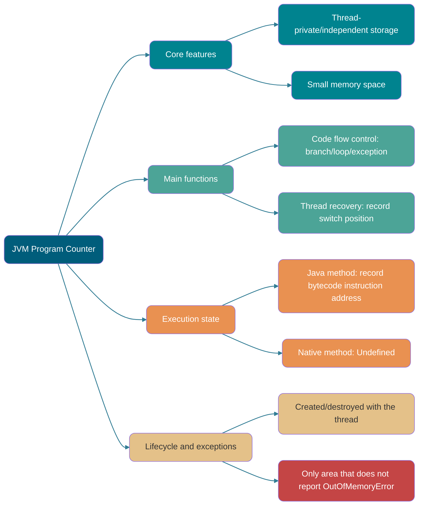
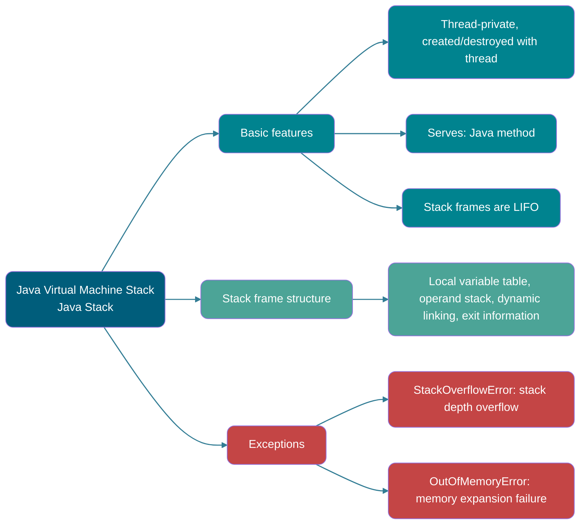
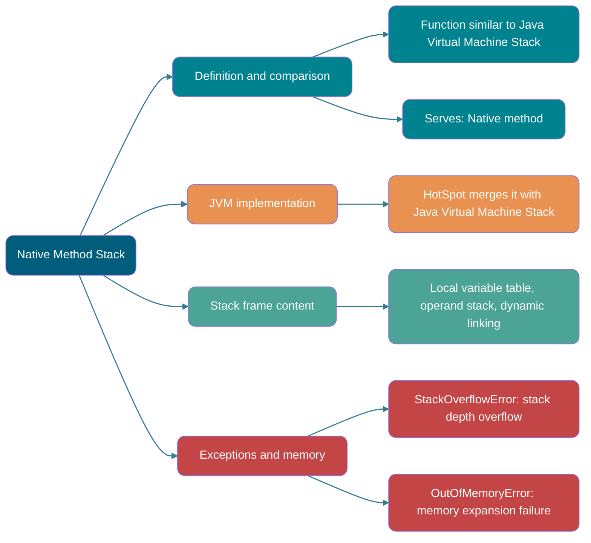
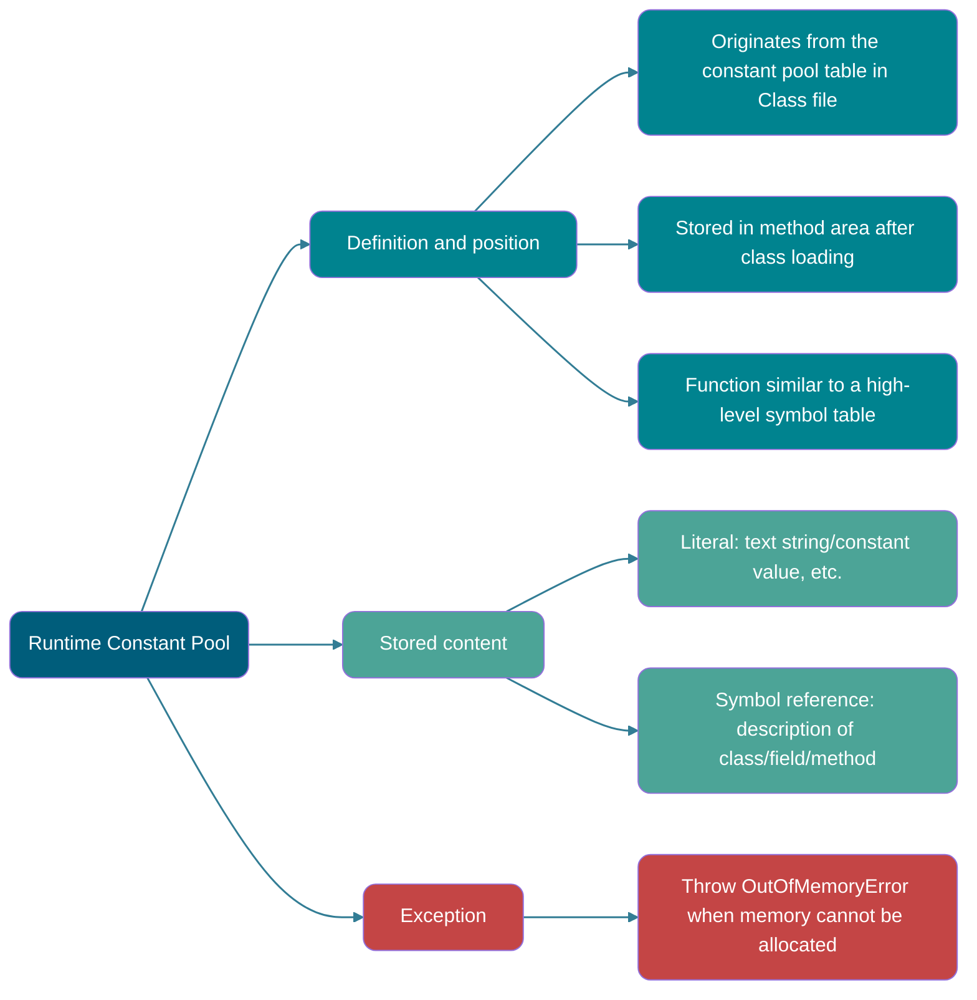
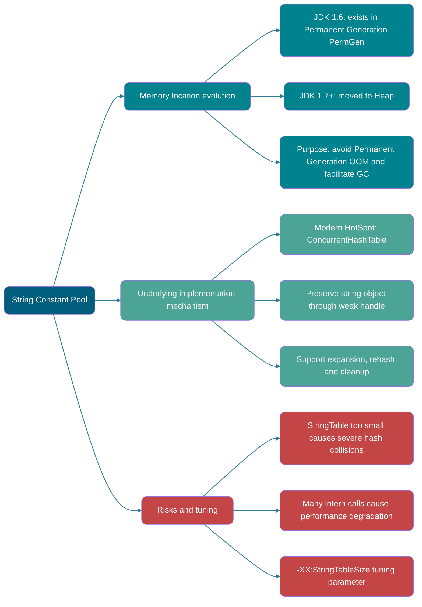
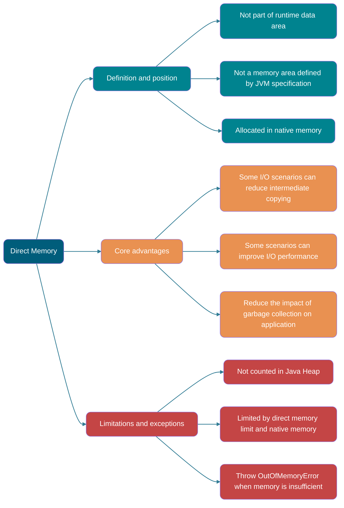
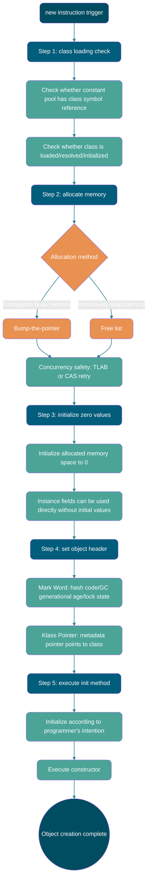

> Nếu không có giải thích đặc biệt, nội dung đều áp dụng cho HotSpot JVM.
>
> Bài viết này được tổng hợp và bổ sung dựa trên cuốn _Understanding the JVM: Advanced Features and Best Practices_.
>
> Các câu hỏi phỏng vấn thường gặp:
>
> - Giới thiệu Java Memory Area (runtime data area)
> - Quy trình tạo Java object (năm bước, nên có thể tự viết lại và biết JVM thực hiện gì ở mỗi bước)
> - Hai cách định vị truy cập object (handle và direct pointer)

## Lời nói đầu

Đối với Java programmer, dưới cơ chế automatic memory management của JVM, bạn không còn phải viết thao tác `delete/free` tương ứng cho từng thao tác `new` như programmer phát triển chương trình C/C++. Vì vậy, vấn đề memory leak và memory overflow ít xảy ra hơn. Chính vì Java programmer giao quyền kiểm soát memory cho JVM, một khi xuất hiện vấn đề memory leak hoặc memory overflow, nếu không hiểu JVM sử dụng memory như thế nào thì việc tìm lỗi sẽ là một nhiệm vụ rất khó khăn.

## Runtime Data Area

Trong quá trình thực thi Java program, JVM chia memory do mình quản lý thành một số data area khác nhau.

JDK 1.8 và các version trước đó có một số khác biệt nhỏ. Ở đây lấy JDK 1.7 và JDK 1.8 làm ví dụ để giới thiệu.

**JDK 1.7**:


**JDK 1.8**:


**Thread-private:**

- Program counter
- Java Virtual Machine Stack
- Native method stack

**Thread-shared:**

- Heap
- Method area

Direct memory thường được thảo luận cùng các area này, nhưng nó không phải runtime data area do _Java Virtual Machine Specification_ định nghĩa, cũng không nên được xem là “thread-shared runtime data area” trong specification.

Quy định của _Java Virtual Machine Specification_ đối với runtime data area khá rộng. Lấy heap làm ví dụ: heap có thể là không gian liên tục hoặc không liên tục. Kích thước heap có thể cố định hoặc mở rộng theo nhu cầu trong runtime. JVM implementer có thể dùng bất kỳ garbage collection algorithm nào để quản lý heap, thậm chí hoàn toàn không thực hiện garbage collection cũng được.

### Program Counter



Program counter là một vùng memory nhỏ, có thể xem như chỉ báo dòng của bytecode mà thread hiện tại đang thực thi. Khi bytecode interpreter hoạt động, nó thay đổi giá trị của counter này để chọn bytecode instruction tiếp theo cần thực thi. Các chức năng như branch, loop, jump, exception handling và thread recovery đều cần dựa vào counter này để hoàn thành.

Ngoài ra, để có thể khôi phục đúng vị trí thực thi sau khi switch thread, mỗi thread cần một program counter độc lập. Counter giữa các thread không ảnh hưởng lẫn nhau và được lưu trữ độc lập. Loại memory area này được gọi là “thread-private memory”.

Từ phần giới thiệu trên, ta biết program counter chủ yếu có hai tác dụng:

- Bytecode interpreter đọc instruction lần lượt bằng cách thay đổi program counter, từ đó thực hiện code flow control như sequential execution, selection, loop và exception handling.
- Trong trường hợp multi-thread, program counter dùng để ghi lại vị trí thực thi của thread hiện tại, nhờ đó khi thread được chuyển lại thì có thể biết lần trước thread đã chạy đến đâu.

Lifecycle của program counter hoàn toàn đồng bộ với thread:

- **Creation**: được tạo cùng với thread.
- **Destruction**: bị hủy cùng với thread.

Khi thực thi **Java method** (không phải native), program counter ghi lại **địa chỉ của JVM bytecode instruction đang được thực thi**. Khi thread thực thi một **native method**, giá trị của program counter là **Undefined**, vì lúc này không thực thi JVM bytecode instruction.

⚠️ Lưu ý: program counter là memory area duy nhất trong JVM specification không quy định bất kỳ trường hợp `OutOfMemoryError` nào. Specification chỉ quy định kết luận này, không yêu cầu mọi implementation sử dụng một biểu diễn có kích thước cố định nào.

### Java Virtual Machine Stack



Giống program counter, Java Virtual Machine Stack (sau đây gọi tắt là stack) cũng là thread-private. Lifecycle của nó giống thread: được tạo cùng thread và bị hủy khi thread kết thúc.

Stack chắc chắn là một core của JVM runtime data area. Ngoài một số native method call được thực hiện qua native method stack (sẽ nói sau), mọi Java method call khác đều được thực hiện qua stack (đồng thời cũng cần phối hợp với các runtime data area khác như program counter).

Dữ liệu của method call được truyền qua stack. Mỗi method call sẽ đẩy một stack frame tương ứng vào stack; sau khi mỗi method call kết thúc, một stack frame sẽ được lấy ra.

Stack gồm nhiều stack frame, mỗi stack frame có local variable table, operand stack, dynamic linking và method return address. Tương tự stack trong data structure, cả hai đều là data structure LIFO và chỉ hỗ trợ hai thao tác pop và push.


**Local variable table** chủ yếu lưu các data type đã biết ở compile time (boolean, byte, char, short, int, float, long, double) và object reference (reference type, khác với chính object; nó có thể là reference pointer trỏ đến địa chỉ bắt đầu của object, hoặc trỏ đến handle đại diện cho object hay một vị trí khác liên quan đến object này).


**Operand stack** chủ yếu được dùng làm trạm trung chuyển cho method call, dùng để lưu các intermediate calculation result sinh ra trong quá trình thực thi method. Ngoài ra, temporary variable sinh ra trong quá trình tính toán cũng được đặt trên operand stack.

**Dynamic linking** là một chức năng của stack frame. Mỗi stack frame giữ reference đến runtime constant pool của type mà method hiện tại thuộc về, dùng để chuyển symbol reference của method trong method code thành method reference cụ thể, đồng thời chuyển variable access thành offset trong runtime storage structure tương ứng. Khi resolve symbol chưa được xác định, nó còn có thể trigger class loading. Việc chọn virtual method implementation dựa trên actual type của receiver là dynamic dispatch của method invocation instruction, không thể đồng nhất đơn giản với dynamic linking ở đây.


Stack space tuy không vô hạn nhưng thông thường sẽ không có vấn đề trong các call bình thường. Tuy nhiên, nếu function call rơi vào infinite recursion, quá nhiều stack frame sẽ được push vào stack và chiếm quá nhiều space, khiến stack quá sâu. Khi độ sâu stack mà thread yêu cầu vượt quá độ sâu tối đa của Java Virtual Machine Stack hiện tại, lỗi `StackOverflowError` sẽ được throw.

**Java method có hai cách return**:

- **Normal return**: thực thi câu lệnh `return`, truyền return value cho caller.
- **Exceptional return**: exception được throw trong quá trình thực thi method nhưng không được catch.

Bất kể cách return nào, stack frame đều bị pop. Nói cách khác, **stack frame được tạo khi method call và bị hủy khi method kết thúc. Method kết thúc dù hoàn thành bình thường hay do exception đều được tính là method kết thúc.**

Ngoài lỗi `StackOverflowError`, stack còn có thể xuất hiện lỗi `OutOfMemoryError`. Nguyên nhân là nếu stack có thể dynamic expansion, khi JVM dynamic expansion stack nhưng không thể xin đủ memory space thì sẽ throw exception `OutOfMemoryError`.

Tóm tắt đơn giản, trong khi program chạy stack có thể xuất hiện hai lỗi:

- **`StackOverflowError`:** khi stack space cần cho thread execution vượt quá kích thước JVM cho phép, throw lỗi `StackOverflowError`.
- **`OutOfMemoryError`:** nếu stack có thể dynamic expansion, khi JVM dynamic expansion stack nhưng không thể xin đủ memory space thì throw exception `OutOfMemoryError`.


### Native Method Stack



Chức năng của native method stack rất giống Java Virtual Machine Stack. Điểm khác biệt là: **Java Virtual Machine Stack phục vụ JVM thực thi Java method (tức bytecode), còn native method stack phục vụ Native method mà JVM sử dụng.** Trong HotSpot JVM, nó được hợp nhất với Java Virtual Machine Stack.

Khi thực thi native method, JVM implementation có thể dùng native stack truyền thống (thường gọi là C stack). _Java Virtual Machine Specification_ không quy định native method stack phải sử dụng local variable table, operand stack và dynamic linking structure giống stack frame của JVM.

Sau khi native method thực thi xong, dữ liệu stack liên quan đến implementation tương ứng sẽ được giải phóng. Native method stack cũng có thể xuất hiện hai lỗi `StackOverflowError` và `OutOfMemoryError`.

### Heap

```mermaid
graph LR
    %% Color definitions
    classDef main fill:#005D7B,color:#fff,rx:10,ry:10;
    classDef compare fill:#00838F,color:#fff,rx:10,ry:10;
    classDef structure fill:#4CA497,color:#fff,rx:10,ry:10;
    classDef implement fill:#E99151,color:#fff,rx:10,ry:10;
    classDef error fill:#C44545,color:#fff,rx:10,ry:10;

    %% Core node
    Root(Java Heap):::main

    %% Branch 1: basic definition and position
    Root --> Def[Definition and position]:::compare
    Def --> Def1[Largest area in JVM memory]:::compare
    Def --> Def2[Shared by all threads]:::compare
    Def --> Def3[Created when JVM starts, long lifecycle]:::compare

    %% Branch 2: core uses
    Root --> Use[Core uses]:::structure
    Use --> Use1[Store object instances (non-static fields)]:::structure
    Use --> Use2[Store array data]:::structure
    Use --> Use3[Unified object memory management]:::structure

    %% Branch 3: generational structure (GC heap)
    Root --> GC[Generational structure]:::implement
    GC --> GC1[Young Generation: Eden area + two Survivor areas]:::implement
    GC --> GC2[Old Generation]:::implement
    GC --> GC3[Purpose: optimize garbage collection efficiency]:::implement

    %% Line style
    linkStyle default stroke:#005D7B,stroke-width:1.5px,opacity:0.8
```

Java Heap là vùng lớn nhất trong memory do JVM quản lý, là một memory area được mọi thread share và được tạo khi JVM start. **Mục đích duy nhất của memory area này là lưu object instance; gần như mọi object instance và array đều được cấp phát memory tại đây.**

Trong Java world, “gần như” mọi object đều được allocate trên heap. Tuy nhiên, JIT compiler có thể thực hiện scalar replacement dựa trên escape analysis, từ đó loại bỏ việc allocate thực tế một số object. Không thể mô tả đơn giản optimization này của HotSpot là “object được allocate trực tiếp trên Java Virtual Machine Stack”.

Java Heap là area chính do garbage collector quản lý, vì vậy còn được gọi là **GC Heap (Garbage Collected Heap)**. Từ góc độ garbage collection, vì các collector hiện nay cơ bản đều dùng generational garbage collection algorithm, Java Heap còn có thể chia nhỏ thành Young Generation và Old Generation; chi tiết hơn nữa có Eden, Survivor, Old và các space khác. Mục đích của việc chia nhỏ là reclaim memory tốt hơn hoặc allocate memory nhanh hơn.

Trong HotSpot của JDK 7 và các version cũ hơn, GC thường được giới thiệu qua ba phần sau. Permanent Generation là implementation của method area, không thuộc Java Heap:

1. Young Generation
2. Old Generation
3. Permanent Generation

Eden area và hai Survivor area S0, S1 trong hình dưới đều thuộc Young Generation; layer ở giữa thuộc Old Generation, layer dưới cùng thuộc Permanent Generation.


**Từ JDK 8, PermGen (Permanent Generation) đã được thay thế bằng Metaspace. Metaspace sử dụng native memory.** (Phần method area sẽ giới thiệu chi tiết nội dung này.)

Trong đa số trường hợp, object trước hết được allocate trong Eden area. Sau một lần Young Generation garbage collection, nếu object vẫn còn sống thì nó sẽ vào S0 hoặc S1, đồng thời age của object tăng 1 (sau khi đi từ Eden area -> Survivor area, age ban đầu của object thành 1). Khi object đạt promotion age threshold, nó sẽ vào Old Generation. Threshold này chịu ảnh hưởng đồng thời của collector, adaptive policy và parameter `-XX:MaxTenuringThreshold`; default value không phải 15 với mọi collector. Với generational collector dùng age field 4 bit, giới hạn trên của parameter này là 15.

```bash
MaxTenuringThreshold of 20 is invalid; must be between 0 and 15
```

**Tại sao age chỉ có thể là 0-15?**

Vì vùng ghi age nằm trong object header, vùng này thường có kích thước 4 bit. 4 bit này biểu diễn được binary number lớn nhất là 1111, tức decimal 15. Vì vậy age của object bị giới hạn từ 0 đến 15.

Ở đây ta kết hợp object layout để giới thiệu chi tiết hơn.

Trong HotSpot JVM, object layout trong memory có thể chia thành 3 area: object header (Header), instance data (Instance Data) và alignment padding (Padding). Object header gồm hai phần: mark field (Mark Word) và type pointer (Klass Word). Phần giới thiệu chi tiết về object memory layout sẽ được trình bày sau, nên không lặp lại ở đây.

Thông tin age được lưu trong mark field (mark field còn lưu các thông tin khác của object như hash code, lock state...). Đoạn HotSpot source code cũ `markOop.hpp` dưới đây thể hiện structure của mark word (Mark Word) khi đó; implementation tương ứng và object header layout của JDK hiện đại đã thay đổi:


Có thể thấy size mà age của object chiếm đúng là 4 bit.

> **🐛 Đính chính (tham khảo [issue552](https://github.com/Snailclimb/JavaGuide/issues/552))**: “Khi HotSpot duyệt mọi object, nó cộng dồn size mà chúng chiếm theo thứ tự age tăng dần. Khi tổng size đến một age nào đó vượt quá một nửa Survivor area, nó lấy giá trị nhỏ hơn giữa age đó và `MaxTenuringThreshold` làm promotion age threshold mới”.
>
> **Code tính dynamic age như sau**
>
> ```c++
> uint ageTable::compute_tenuring_threshold(size_t survivor_capacity) {
>   // survivor_capacity là kích thước của survivor space
>   size_t desired_survivor_size = (size_t)((((double) survivor_capacity)*TargetSurvivorRatio)/100);// TargetSurvivorRatio là 50
>   size_t total = 0;
>   uint age = 1;
>   while (age < table_size) {
>     total += sizes[age];// mảng sizes là kích thước object của mỗi age
>     if (total > desired_survivor_size) break;
>     age++;
>   }
>   uint result = age < MaxTenuringThreshold ? age : MaxTenuringThreshold;
>   ...
> }
> ```

Lỗi dễ xuất hiện nhất ở heap là `OutOfMemoryError`. Sau khi xuất hiện lỗi này, biểu hiện còn có thể có vài dạng, ví dụ:

1. **`java.lang.OutOfMemoryError: GC Overhead Limit Exceeded`**: lỗi này xảy ra khi JVM dành quá nhiều thời gian thực hiện garbage collection nhưng chỉ reclaim được rất ít heap space.
2. **`java.lang.OutOfMemoryError: Java heap space`**: giả sử khi tạo object mới, heap memory không đủ space để chứa object mới tạo thì lỗi này sẽ xảy ra (liên quan đến configured maximum heap memory và chịu giới hạn bởi physical memory. Maximum heap memory có thể cấu hình bằng parameter `-Xmx`; nếu không cấu hình đặc biệt sẽ dùng default value, xem [Default Java 8 max heap size](https://stackoverflow.com/questions/28272923/default-xmxsize-in-java-8-max-heap-size)).
3. ……

### Method Area

```mermaid
graph LR
    %% Color definitions
    classDef main fill:#005D7B,color:#fff,rx:10,ry:10;
    classDef compare fill:#00838F,color:#fff,rx:10,ry:10;
    classDef structure fill:#4CA497,color:#fff,rx:10,ry:10;
    classDef implement fill:#E99151,color:#fff,rx:10,ry:10;
    classDef error fill:#C44545,color:#fff,rx:10,ry:10;

    %% Core node
    Root(Method Area):::main

    %% Branch 1: basic definition and position
    Root --> Def[Definition and position]:::compare
    Def --> Def1[Thread-shared memory area]:::compare
    Def --> Def2[Logical area defined by JVM specification]:::compare
    Def --> Def3[Implementation varies by JVM]:::compare

    %% Branch 2: core stored content
    Root --> Store[Core stored content]:::structure
    Store --> Store1[Class metadata: structure/field/method information]:::structure
    Store --> Store2[Method bytecode: original instruction sequence]:::structure
    Store --> Store3[Runtime constant pool: literal and symbol reference]:::structure

    %% Branch 3: HotSpot location evolution (JDK 7+)
    Root --> Change[Location evolution and exceptions]:::implement
    Change --> Change1[Static variable: moved to Java Heap (JDK 7)]:::implement
    Change --> Change2[String constant pool: moved to Java Heap (JDK 7)]:::implement
    Change --> Change3[JIT code cache: independent Code Cache area]:::implement

    %% Line style
    linkStyle default stroke:#005D7B,stroke-width:1.5px,opacity:0.8
```

Method area là một logical area trong JVM runtime data area, là memory area được mọi thread share.

_Java Virtual Machine Specification_ chỉ quy định khái niệm method area và chức năng của nó; cách implementation method area cụ thể ra sao là việc JVM tự quyết định. Nói cách khác, method area được implementation khác nhau của JVM triển khai khác nhau.

Khi JVM load một class, nó parse thông tin tương ứng từ Class file rồi lưu **metadata** đó vào method area. Cụ thể, method area chủ yếu lưu các data core sau:

1. **Class metadata**: gồm structure hoàn chỉnh của class như class name, parent class, interface đã implement, access modifier và thông tin chi tiết của field, method (name, type, modifier...).
2. **Method bytecode**: original instruction sequence của mỗi method.
3. **Runtime constant pool**: mỗi class có một pool riêng, được chuyển đổi từ constant pool trong Class file, dùng để lưu các literal do compiler tạo ra và symbol reference đến type, field, method.

Cần đặc biệt lưu ý: các loại data sau đây tuy về logic liên quan đến class, nhưng trong HotSpot JVM không được lưu trong method area:

- **Static variable (Static Variables)**: từ JDK 7, class static variable được lưu trong Java Heap cùng với object `java.lang.Class` tương ứng.
- **String constant pool (String Pool)**: cũng từ JDK 7, string constant pool được **chuyển vào Java Heap**.
- **Code cache sau khi JIT compiler compile (JIT Code Cache)**: JIT compiler compile bytecode của hot method thành native machine code và lưu trong một **memory area độc lập có tên “Code Cache”**, không phải bản thân method area. Cách làm này nhằm thực hiện execution và memory management hiệu quả hơn.


**Quan hệ giữa method area, Permanent Generation và Metaspace là gì?** Quan hệ giữa method area với Permanent Generation và Metaspace khá giống quan hệ giữa interface và class trong Java: class implement interface; ở đây có thể xem class là Permanent Generation và Metaspace, interface là method area. Nói cách khác, Permanent Generation và Metaspace là hai implementation của method area trong JVM specification của HotSpot JVM. Permanent Generation là implementation method area trước JDK 1.8; từ JDK 1.8 trở đi, implementation method area chuyển thành Metaspace.


**Tại sao thay Permanent Generation (PermGen) bằng Metaspace (MetaSpace)?**

Hình dưới đây lấy từ _Understanding the JVM_, bản 3, mục 2.2.5.


1. Dung lượng Permanent Generation chịu giới hạn trên `-XX:MaxPermSize`; giới hạn này có thể cấu hình. Metaspace chuyển sang dùng native memory và có thể giới hạn bằng `-XX:MaxMetaspaceSize`. Cả hai đều có thể overflow; rủi ro thực tế phụ thuộc configuration và tốc độ tăng của class metadata.

> Khi Metaspace overflow sẽ nhận được lỗi sau: `java.lang.OutOfMemoryError: Metaspace`

Bạn có thể dùng `-XX:MaxMetaspaceSize` để đặt maximum Metaspace size. Nếu không đặt, class metadata space có thể tiếp tục tăng cho đến khi bị giới hạn bởi available native memory và các điều kiện khác. `-XX:MetaspaceSize` không phải initial capacity của Metaspace mà là initial high-water threshold trigger metadata GC; sau đó JVM sẽ dynamic adjust threshold này.

2. Metaspace lưu class metadata. Số class metadata được load không còn do `MaxPermSize` kiểm soát mà do available space thực tế của system kiểm soát, vì vậy có thể load nhiều class hơn.

3. Khi merge code của HotSpot và JRockit trong JDK 8, JRockit chưa từng có thành phần gọi là Permanent Generation. Sau khi merge, không cần thiết phải thiết lập thêm một khu vực Permanent Generation như vậy.

4. Permanent Generation tạo ra complexity không cần thiết cho GC và hiệu quả reclaim tương đối thấp.

**Các parameter thường dùng của method area là gì?**

Trước JDK 1.8, khi Permanent Generation chưa bị remove hoàn toàn, method area thường được điều chỉnh bằng các parameter sau.

```java
-XX:PermSize=N // kích thước ban đầu của method area (Permanent Generation)
-XX:MaxPermSize=N // kích thước tối đa của method area (Permanent Generation), vượt quá giá trị này sẽ throw exception OutOfMemoryError: java.lang.OutOfMemoryError: PermGen
```

Tương đối mà nói, garbage collection trong area này khá ít xảy ra, nhưng không phải data vào method area rồi sẽ “tồn tại vĩnh viễn”.

Trong JDK 1.8, method area (Permanent Generation của HotSpot) đã bị remove hoàn toàn (quá trình này đã bắt đầu từ JDK 1.7), thay vào đó là Metaspace; Metaspace sử dụng native memory. Dưới đây là một số parameter thường dùng:

```java
-XX:MetaspaceSize=N // đặt initial high-water threshold trigger metadata GC
-XX:MaxMetaspaceSize=N // đặt maximum Metaspace size
```

Khác biệt lớn với Permanent Generation là nếu không chỉ định `MaxMetaspaceSize`, Metaspace không có fixed upper limit do parameter này đặt. Việc class metadata tiếp tục tăng có thể tiêu thụ lượng lớn native memory.

### Runtime Constant Pool



Ngoài các thông tin mô tả như version, field, method và interface của class, Class file còn có **constant pool table (Constant Pool Table)** dùng để lưu các literal (Literal) và symbol reference (Symbolic Reference) do compiler tạo ra.

Literal là cách biểu diễn fixed value trong source code; chỉ cần nhìn literal là có thể biết ý nghĩa value của nó. Literal gồm integer, floating-point number và string literal. Symbol reference thường gặp gồm class symbol reference, field symbol reference, method symbol reference và interface method symbol.


Constant pool table được lưu vào runtime constant pool của method area sau khi class loading.

Chức năng của runtime constant pool tương tự symbol table trong ngôn ngữ lập trình truyền thống, dù nó chứa data phong phú hơn symbol table điển hình.

Vì runtime constant pool là một phần của method area, đương nhiên nó chịu giới hạn memory của method area. Khi constant pool không thể xin thêm memory, lỗi `OutOfMemoryError` sẽ được throw.

### String Constant Pool



**String constant pool** là một area được JVM dành riêng cho string (class `String`) nhằm nâng cao performance và giảm memory consumption, với mục đích chính là tránh tạo string trùng lặp.

```java
// 1. Tìm string object "ab" trong string constant pool; nếu chưa có thì tạo "ab" và đặt vào string constant pool
// 2. Gán reference của string object "ab" cho aa
String aa = "ab";
// Trả về trực tiếp string object "ab" trong string constant pool và gán cho reference bb
String bb = "ab";
System.out.println(aa==bb); // true
```

Implementation string constant pool trong HotSpot JVM có thể xem tại `src/hotspot/share/classfile/stringTable.cpp`. `StringTable` native của HotSpot hiện đại dùng concurrent hash table và dùng weak handle để lưu string object trên heap, hỗ trợ expansion, rehash và cleanup entry hết hiệu lực; `-XX:StringTableSize` dùng để đặt số bucket ban đầu. Vì vậy, cách nói “fixed-length array + linked list” chỉ áp dụng cho một số implementation cũ, không thể dùng để khái quát HotSpot hiện tại.

Trước JDK 1.7, string constant pool được lưu trong Permanent Generation. JDK 1.7 chuyển string constant pool và class static variable vào Java Heap.


**Tại sao JDK 1.7 chuyển string constant pool vào heap?**

Chủ yếu vì GC reclaim efficiency của Permanent Generation (implementation của method area) quá thấp, chỉ thực hiện GC khi full heap collection (Full GC). Java program thường có rất nhiều string được tạo và chờ reclaim; đặt string constant pool vào heap giúp reclaim string memory hiệu quả và kịp thời hơn.

Câu hỏi liên quan: [JVM constant pool lưu object hay reference? - Câu trả lời của RednaxelaFX - Zhihu](https://www.zhihu.com/question/57109429/answer/151717241)

Cuối cùng, hãy chia sẻ một đoạn lời của thầy Zhou Zhiming trong [sample code và errata của _Understanding the JVM_ (bản 3)](https://github.com/fenixsoft/jvm_book), tại [issue#112](https://github.com/fenixsoft/jvm_book/issues/112) của GitHub repository:

> **Runtime constant pool, method area và string constant pool đều là logical concept không thay đổi theo JVM implementation, có tính public và abstract; Metaspace và Heap là physical concept liên quan đến một JVM implementation cụ thể, có tính private và concrete.**

### Direct Memory



Direct memory là một loại memory buffer đặc biệt, không được allocate trong Java Heap hay method area mà được allocate trong native memory. Cơ chế allocate cụ thể là implementation detail của JVM, không đồng nghĩa với việc bắt buộc phải allocate qua JNI.

Direct memory không thuộc JVM runtime data area, cũng không phải memory area được JVM specification định nghĩa, nhưng phần memory này được sử dụng thường xuyên. Nó cũng có thể gây ra lỗi `OutOfMemoryError`.

NIO (New I/O) được thêm vào trong JDK 1.4, giới thiệu I/O method dựa trên **channel (Channel)** và **buffer (Buffer)**. Direct byte buffer có thể allocate content bên ngoài Java Heap và thao tác thông qua object `DirectByteBuffer` trong Java Heap. JVM sẽ cố gắng thực hiện native I/O trực tiếp trên buffer này, từ đó giảm data copy giữa các intermediate buffer trong một số scenario. Trong NIO, chỉ một số phần như selectable channel và Selector cung cấp khả năng non-blocking I/O; không thể mở rộng toàn bộ NIO thành Non-Blocking I/O.

Direct memory không tính vào Java Heap nhưng vẫn chịu giới hạn của tổng native memory, processor addressing space và các điều kiện khác. Với NIO direct buffer, có thể dùng [`-XX:MaxDirectMemorySize`](https://docs.oracle.com/en/java/javase/25/docs/specs/man/java.html#extra-options-for-java) để giới hạn tổng allocation.

Khái niệm tương tự còn có **off-heap memory**. Một số bài viết đồng nhất direct memory với off-heap memory, nhưng theo tôi cách này không hoàn toàn chính xác.

Off-heap memory là tên gọi chung cho memory được allocate ngoài Java Heap, bên dưới thường sử dụng native memory do operating system cung cấp. Nó có chịu sự quản lý của JVM hoặc JDK hay không và quản lý thế nào phụ thuộc vào cách allocate cụ thể. Ví dụ, trong OpenJDK/HotSpot, native memory tương ứng với `DirectByteBuffer` liên kết với buffer object trong Java Heap, và sau khi object trở nên unreachable sẽ tham gia cleanup qua cơ chế như `Cleaner`. Vì thời điểm cleanup không do application trực tiếp kiểm soát, dùng off-heap memory có thể giảm pressure lên Java Heap nhưng vẫn cần chú ý native memory leak và `OutOfMemoryError`.

## Khám phá object trong HotSpot JVM

Qua phần giới thiệu trên, ta đã biết khái quát về memory của JVM. Bây giờ hãy tìm hiểu chi tiết toàn bộ quá trình HotSpot JVM allocate, layout và access object trong Java Heap.

### Object Creation

Tôi khuyên bạn nên có thể tự viết lại quy trình tạo Java object và nắm được mỗi bước thực hiện gì.



#### Step1: Class Loading Check

Khi JVM gặp một `new` instruction, trước tiên nó kiểm tra xem parameter của instruction này có thể định vị class symbol reference trong constant pool hay không, đồng thời kiểm tra class do symbol reference này đại diện đã được load, resolve và initialize chưa. Nếu chưa, trước hết phải thực hiện class loading process tương ứng.

#### Step2: Memory Allocation

Sau khi **class loading check** thông qua, JVM sẽ **allocate memory** cho object mới. Sau khi class loading hoàn tất, kích thước memory cần cho object đã được xác định; nhiệm vụ allocate space cho object tương đương với việc chia một memory space có kích thước xác định từ Java Heap. Có hai **allocation method** là **“bump-the-pointer”** và **“free list”**. **Chọn allocation method nào phụ thuộc vào heap có contiguous hay không; heap có contiguous hay không lại phụ thuộc vào garbage collector được sử dụng có chức năng compact hay không.**

**Hai allocation method** (nội dung bổ sung, cần nắm vững):

- Bump-the-pointer:
  - Trường hợp áp dụng: heap contiguous (không có memory fragmentation).
  - Nguyên lý: toàn bộ used memory được gom về một phía, unused memory ở phía còn lại; giữa hai phía có một boundary pointer, chỉ cần di chuyển pointer theo hướng unused memory một đoạn bằng object memory size.
  - GC collector sử dụng allocation method này: Serial, ParNew
- Free list:
  - Trường hợp áp dụng: heap không contiguous.
  - Nguyên lý: JVM duy trì một list ghi lại các memory block còn usable. Khi allocate, nó tìm một memory block đủ lớn để chia cho object instance rồi update record trong list.
  - GC collector sử dụng allocation method này: CMS

Chọn một trong hai method trên phụ thuộc vào Java Heap có contiguous hay không. Java Heap có contiguous hay không phụ thuộc vào algorithm của GC collector là “mark-sweep” hay “mark-compact” (còn gọi là “mark-compress”). Cần lưu ý rằng memory của copying algorithm cũng contiguous.

**Concurrency issue khi memory allocation** (nội dung bổ sung, cần nắm vững)

Khi tạo object, một vấn đề rất quan trọng là thread safety, vì trong thực tế object được tạo rất thường xuyên. JVM phải đảm bảo thread safety; thông thường JVM dùng hai cách sau để đảm bảo điều đó:

- **CAS + retry on failure:** CAS là một implementation của optimistic lock. Optimistic lock nghĩa là mỗi lần không lock mà giả định không có conflict để hoàn thành operation; nếu thất bại do conflict thì retry cho đến khi thành công. **JVM dùng CAS kết hợp retry on failure để đảm bảo atomicity của update operation.**
- **TLAB:** allocate trước một memory block trong Eden area cho mỗi thread. Khi JVM allocate memory cho object trong thread, trước hết allocate trong TLAB; nếu object lớn hơn remaining memory của TLAB hoặc TLAB đã hết memory, JVM mới dùng CAS như trên để allocate memory.

#### Step3: Zero-Value Initialization

Sau khi memory allocation hoàn tất, JVM cần initialize toàn bộ allocated memory space về zero (không bao gồm object header). Operation này đảm bảo instance field của object có thể được dùng trực tiếp trong Java code mà không cần gán initial value; program có thể đọc zero value tương ứng với data type của field.

#### Step4: Set Object Header

Sau khi zero-value initialization hoàn tất, **JVM phải thực hiện các thiết lập cần thiết cho object**, chẳng hạn object là instance của class nào, làm thế nào để tìm class metadata, object hash code và object GC generational age. **Các thông tin này được lưu trong object header.** Ngoài ra, object header layout cụ thể liên quan đến JDK version và JVM configuration; ví dụ biased lock mặc định bị disable từ JDK 15, các implementation liên quan sau đó cũng bị remove.

#### Step5: Execute init Method

Sau khi các công việc trên hoàn tất, xét từ góc nhìn JVM thì một object mới đã được tạo; nhưng từ góc nhìn Java program, object creation mới bắt đầu, method `<init>` vẫn chưa execute và mọi field còn bằng zero. Vì vậy, thông thường sau khi execute `new` instruction sẽ tiếp tục execute method `<init>`, initialize object theo ý muốn của programmer; khi đó object thực sự usable mới được xem là tạo hoàn chỉnh.

### Object Memory Layout

Trong HotSpot JVM, object layout trong memory có thể chia thành 3 area: **object header (Header)**, **instance data (Instance Data)** và **alignment padding (Padding)**.

Object header gồm hai loại information:

1. Mark field (Mark Word): dùng để lưu runtime data của object như hash code (HashCode), GC generational age, lock state... Thread ID và timestamp của biased lock chỉ áp dụng cho HotSpot version cũ còn implement và enable biased lock.
2. Type pointer (Klass pointer): pointer từ object đến class metadata của nó; JVM dùng pointer này để xác định object là instance của class nào.

**Instance data là information hữu hiệu mà object thực sự lưu trữ**, cũng là content của các field thuộc những type được định nghĩa trong program.

**Alignment padding không nhất thiết tồn tại và không có ý nghĩa đặc biệt, chỉ dùng để chiếm chỗ.** HotSpot allocate object theo object alignment boundary, default thường là 8 byte và cũng có thể chịu ảnh hưởng của configuration như `-XX:ObjectAlignmentInBytes`. Vì vậy tổng object size cần được pad đến alignment boundary; bản thân object header không đảm bảo lúc nào cũng là bội số nguyên của 8 byte, ví dụ object header thường có size 12 byte khi enable compressed class pointer.

### Object Access Location

Object được tạo ra để sử dụng. Java program thao tác object cụ thể trên heap thông qua reference data trên stack. Access method của object phụ thuộc vào JVM implementation. Hiện nay có hai access method phổ biến: **handle** và **direct pointer**.

#### Handle

Nếu dùng handle, Java Heap sẽ chia một memory area làm handle pool. `reference` lưu handle address của object, còn handle chứa address cụ thể của instance data và object type data.


#### Direct Pointer

Nếu dùng direct pointer access, `reference` lưu trực tiếp address của object.


Hai object access method này đều có ưu điểm riêng. Ưu điểm lớn nhất của handle access là `reference` lưu một handle address ổn định; khi object được move, chỉ cần thay đổi instance data pointer trong handle, không cần sửa bản thân `reference`. Ưu điểm lớn nhất của direct pointer access là tốc độ nhanh vì tiết kiệm chi phí định vị pointer một lần.

HotSpot JVM chủ yếu dùng direct pointer access để truy cập object.

## Tham khảo

- _Understanding the JVM: Advanced Features and Best Practices_ (Second Edition)
- _Write a Java Virtual Machine from Scratch_
- Chapter 2. The Structure of the Java Virtual Machine: <https://docs.oracle.com/javase/specs/jvms/se8/html/jvms-2.html>
- JVM stack frame internal structure - dynamic linking: <https://chenxitag.com/archives/368>
- Khi `new String` ("literal") thì “literal” vào string constant pool lúc nào? - Câu trả lời của Cô gái gỗ - Zhihu: <https://www.zhihu.com/question/55994121/answer/147296098>
- JVM constant pool lưu object hay reference? - Câu trả lời của RednaxelaFX - Zhihu: <https://www.zhihu.com/question/57109429/answer/151717241>
- <http://www.pointsoftware.ch/en/under-the-hood-runtime-data-areas-javas-memory-model/>
- <https://dzone.com/articles/jvm-permgen-%E2%80%93-where-art-thou>
- <https://stackoverflow.com/questions/9095748/method-area-and-permgen>

<!-- @include: @article-footer.snippet.md -->
