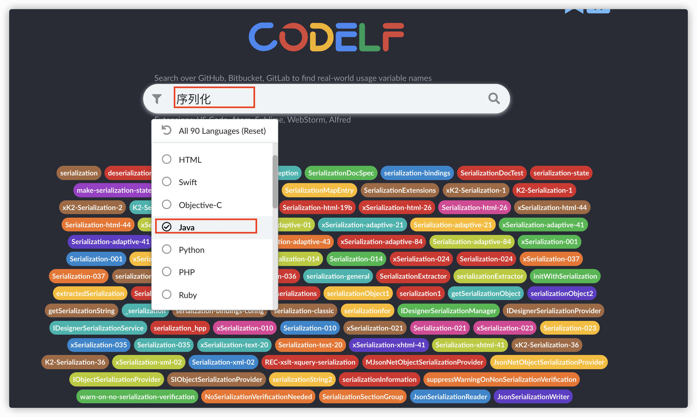

Tôi vẫn nhớ khoảng thời gian mới đi làm, trong các buổi Code Review của dự án, tôi thường bị “diss” vì đặt tên biến không đúng quy chuẩn!

Suy cho cùng, nguyên nhân vẫn là lúc đó tôi chưa có đủ kinh nghiệm. Hồi đại học, khi viết project, tôi không quá chú ý đến những vấn đề này, chỉ nghĩ rằng miễn triển khai được chức năng là được.

Nhưng đi làm thì khác. Để đảm bảo code dễ đọc và dễ bảo trì, yêu cầu của team về chất lượng code vẫn khá cao!

Một thời gian trước, một thực tập sinh mới vào team cũng thường bị “diss” trong Code Review vì đặt tên biến không đúng quy chuẩn. Điều này khiến tôi nhớ lại những ngày đầu viết code ở công ty.

Vì vậy, tôi đã viết ngắn gọn bài viết này về quy chuẩn đặt tên biến, hy vọng có thể giúp ích cho những bạn cũng gặp vấn đề tương tự.

Đúng là trong quá trình lập trình, có rất nhiều việc khiến chúng ta đau đầu, chẳng hạn như đặt tên, bảo trì code của người khác, viết test, giao tiếp với người khác, v.v.

Nghe nói trước đây trên website Quora, gần 5.000 lập trình viên đã bình chọn “đặt tên” là việc khó nhất.

Martin Fowler, tác giả nổi tiếng của cuốn 《Refactoring》, từng đề cập trong bài viết [TwoHardThings](https://martinfowler.com/bliki/TwoHardThings.html) rằng trong lĩnh vực CS có hai việc khó nhất: một là **cache invalidation**, hai là **đặt tên chương trình**.


Câu này thực ra cũng là do Martin Fowler trích dẫn từ người khác. Có rất nhiều cách diễn đạt tương tự. Chẳng hạn, trong lĩnh vực distributed system có hai việc khó nhất: một là **đảm bảo thứ tự message**, hai là **truyền đúng một lần**.


Hôm nay, chúng ta hãy cùng tập trung nói về “**đặt tên**”!

Bài viết này nếu đọc cùng với bài tôi đã đăng trước đó [《Code 5 phút, đặt tên 2 giờ? Tài liệu tham khảo quy chuẩn đặt tên Java đầy đủ nhất từ trước đến nay!》](https://mp.weixin.qq.com/s?__biz=Mzg2OTA0Njk0OA==&mid=2247486449&idx=1&sn=c3b502529ff991c7180281bcc22877af&chksm=cea2443af9d5cd2c1c87049ed15ccf6f88275419c7dbe542406166a703b27d0f3ecf2af901f8&token=999884676&lang=zh_CN#rd) sẽ hiệu quả hơn!

## Vì sao cần coi trọng việc đặt tên?

Trước hết, chúng ta cần hiểu vì sao phải coi trọng việc đặt tên trong lập trình và nó có ý nghĩa gì đối với công việc viết code.

**Vì sao đặt tên lại quan trọng?** Bởi vì **một cái tên tốt chính là comment: người khác vừa nhìn thấy tên của bạn là biết biến, method hoặc class đó dùng để làm gì!**

Nói đơn giản, **người khác có thể hiểu code của bạn muốn diễn đạt điều gì dựa vào tên bạn đặt** (tất nhiên, người đó cũng cần có kiến thức tiếng Anh cơ bản và quen thuộc với một số từ thường gặp trong lập trình).

Hãy lấy một ví dụ đơn giản để minh họa tầm quan trọng của việc đặt tên.

Cuốn 《Clean Code》 chỉ rõ:

> **Bản thân code tốt đã là comment. Chúng ta nên cố gắng chuẩn hóa và làm code đẹp hơn để giảm các comment không cần thiết.**
>
> **Nếu ngôn ngữ lập trình đủ khả năng biểu đạt thì không cần comment; hãy cố gắng diễn đạt bằng code.**
>
> Ví dụ:
>
> Bỏ comment phức tạp bên dưới, chỉ cần tạo một function có cùng ý nghĩa với comment là được
>
> ```java
> // kiểm tra xem nhân viên có đủ điều kiện nhận đầy đủ phúc lợi hay không
> if ((employee.flags & HOURLY_FLAG) && (employee.age > 65))
> ```
>
> Nên thay bằng
>
> ```java
> if (employee.isEligibleForFullBenefits())
> ```

## Các quy tắc đặt tên phổ biến và trường hợp áp dụng

Ở đây chỉ giới thiệu 3 quy chuẩn đặt tên phổ biến nhất.

### Quy tắc camel (CamelCase)

Quy tắc camel có lẽ là quy tắc chúng ta thường gặp nhất. Cách đặt tên này dùng sự kết hợp chữ hoa và chữ thường để phân biệt các từ, đồng thời không dùng khoảng trắng hoặc ký tự nối giữa các từ.

#### Quy tắc UpperCamelCase

**Tên class cần dùng quy tắc UpperCamelCase.**

Ví dụ đúng:

```java
ServiceDiscovery、ServiceInstance、LruCacheFactory
```

Ví dụ sai:

```java
serviceDiscovery、Serviceinstance、LRUCacheFactory
```

#### Quy tắc lowerCamelCase

**Tên method, tên parameter, member variable và local variable cần dùng quy tắc lowerCamelCase.**

Ví dụ đúng:

```java
getUserInfo()
createCustomThreadPool()
setNameFormat(String nameFormat)
UserService userService;
```

Ví dụ sai:

```java
GetUserInfo()、CreateCustomThreadPool()、setNameFormat(String NameFormat)
UserService user_service;
```

### Quy tắc snake_case

**Tên test method có thể dùng quy tắc snake_case theo quy ước của team; constant và enum constant thường dùng chữ in hoa theo quy tắc snake_case.**

Trong quy tắc snake*case, các từ được nối với nhau bằng dấu gạch dưới “*”, chẳng hạn `should_get_200_status_code_when_request_is_valid`, `CLIENT_CONNECT_SERVER_FAILURE`.

Ưu điểm của quy tắc snake_case là khi tên cần khá nhiều từ. Chẳng hạn, nếu viết tên bên trên bằng quy tắc lowerCamelCase thì sẽ là: “shouldGet200StatusCodeWhenRequestIsValid”.

Cảm giác thế nào? So với quy tắc snake_case, cách này có phải khó đọc hơn không?

Ví dụ đúng:

```java
@Test
void should_get_200_status_code_when_request_is_valid() {
  ......
}
```

Một cách viết phổ biến khác:

```java
@Test
void shouldGet200StatusCodeWhenRequestIsValid() {
  ......
}
```

### Quy tắc kebab-case

Trong quy tắc kebab-case, các từ được nối với nhau bằng dấu “-”, chẳng hạn `dubbo-registry`.

Nên dùng quy tắc kebab-case cho tên folder của project. Chẳng hạn, tên các module của project Dubbo như sau.


## Quy chuẩn đặt tên phổ biến

### Quy chuẩn đặt tên cơ bản trong ngôn ngữ Java

**1. Tên class cần dùng phong cách UpperCamelCase. Tên method, tên parameter, member variable và local variable cần dùng phong cách lowerCamelCase.**

**2. Test method không có một cách đặt tên duy nhất đúng; có thể dùng quy tắc snake_case theo quy ước của team**, chẳng hạn `should_get_200_status_code_when_request_is_valid`. Constant và enum constant thường dùng quy tắc snake_case in hoa, chẳng hạn `CLIENT_CONNECT_SERVER_FAILURE`; kiểu enum vẫn dùng quy tắc UpperCamelCase.

**3. Tên folder của project dùng quy tắc kebab-case**, chẳng hạn `dubbo-registry`.

**4. Tên package thống nhất dùng chữ thường, cố gắng dùng một danh từ làm tên package. Các từ được nối bằng dấu phân cách “.” và mỗi từ bắt buộc phải ở dạng số ít.**

Ví dụ đúng: `org.apache.dubbo.common.threadlocal`

Ví dụ sai: ~~`org.apache_dubbo.Common.threadLocals`~~

**5. Tên abstract class bắt đầu bằng Abstract.**

```java
// Abstract class được tách riêng cho phần remote transport (nguồn: source code Dubbo)
public abstract class AbstractClient extends AbstractEndpoint implements Client {

}
```

**6. Tên exception class kết thúc bằng Exception.**

```java
// NoSuchMethodException tùy chỉnh (nguồn: source code Dubbo)
public class NoSuchMethodException extends RuntimeException {
    private static final long serialVersionUID = -2725364246023268766L;

    public NoSuchMethodException() {
        super();
    }

    public NoSuchMethodException(String msg) {
        super(msg);
    }
}
```

**7. Tên test class bắt đầu bằng tên class mà nó kiểm thử và kết thúc bằng Test.**

```java
// Test class được viết cho class AnnotationUtils (nguồn: source code Dubbo)
public class AnnotationUtilsTest {
  ......
}
```

Đối với field kiểu boolean trong class POJO, việc có dùng prefix `is` hay không cần được xác định dựa trên quy tắc sinh accessor và framework serialization. Thông thường, có thể đặt tên field kiểu primitive là `active` và cung cấp `isActive()`, đặt tên field kiểu wrapper `Boolean` là `active` và cung cấp `getActive()`; nếu kết quả suy luận của framework không đúng như mong đợi, có thể cố định tên property bằng accessor tường minh hoặc annotation serialization.

Nếu module, interface, class hoặc method sử dụng design pattern, tên cần thể hiện design pattern cụ thể.

### Quy chuẩn về tính dễ đọc của tên

**1. Để tên dễ hiểu và dễ đọc hơn, cố gắng không viết tắt từ, trừ khi cách viết tắt đó đã được công nhận rộng rãi. Chẳng hạn, `CustomThreadFactory` không được viết thành ~~`CustomTF`~~.**

**2. Tên không giống function, không cần cố gắng ngắn hết mức có thể. Tên dễ đọc được ưu tiên hơn tên ngắn**, dù tên dễ đọc sẽ dài hơn một chút. Đây cũng chính là ý số 1 ở trên.

**3. Tránh những cái tên vô nghĩa; mỗi tên bạn đặt đều phải thể hiện được ý nghĩa.**

Ví dụ đúng: `UserService userService;` `int userCount`;

Ví dụ sai: ~~`UserService service`~~ ~~`int count`~~

**4. Tránh đặt tên quá dài (tốt nhất không quá 50 ký tự), tên quá dài khó đọc và không đẹp.**

**5. Không dùng pinyin, càng không được dùng tiếng Trung.** Tuy nhiên, những danh từ được sử dụng phổ biến trên toàn thế giới như alibaba, wuhan, taobao có thể được xem như tiếng Anh.

Ví dụ đúng: discount

Ví dụ sai: ~~dazhe~~

## Codelf: công cụ đặt tên biến thần kỳ?

Đây là một website do người Trung Quốc phát triển. Trên mạng có nhiều người gọi nó là công cụ đặt tên biến thần kỳ, nhưng sau vài ngày sử dụng thực tế, tôi cảm thấy nó không hữu ích đến vậy. Các bạn có thể tự trải nghiệm rồi đưa ra đánh giá của mình.

Codelf cung cấp phiên bản website trực tuyến tại [https://unbug.github.io/codelf/](https://unbug.github.io/codelf/), tình hình sử dụng cụ thể như sau:

Tôi chọn ngôn ngữ lập trình Java, sau đó tìm kiếm keyword “serialization”, rồi nó trả về rất nhiều tên liên quan đến serialization.



Ngoài ra, Codelf còn cung cấp plugin cho VS Code. Nhìn vào đánh giá này, có vẻ mọi người vẫn rất thích công cụ đặt tên này.


## Đề xuất đọc thêm

1. 《Sổ tay phát triển Java Alibaba》
2. 《Clean Code》
3. Google Java Style Guide: <https://google.github.io/styleguide/javaguide.html>
4. Tạm biệt 5 phút code, 2 giờ đặt tên! Tài liệu tham khảo quy chuẩn đặt tên Java đầy đủ nhất từ trước đến nay: <https://www.cnblogs.com/liqiangchn/p/12000361.html>

## Tổng kết

Là một lập trình viên đạt yêu cầu, các bạn hẳn đều biết tầm quan trọng của việc code thể hiện đúng ý nghĩa. Muốn viết code chất lượng cao, đặt tên tốt là bước đầu tiên!

Tên tốt giúp ích rất nhiều cho người khác, bao gồm cả chính bạn, khi tìm hiểu code. Code càng dễ hiểu thì càng dễ bảo trì, điều này cũng cho thấy thiết kế code của bạn càng tốt!

Trong quá trình viết code hằng ngày, chúng ta cần ghi nhớ những quy chuẩn đặt tên phổ biến, chẳng hạn tên class cần dùng quy tắc UpperCamelCase, không dùng pinyin, càng không được dùng tiếng Trung……

Ngoài ra, một website do người Trung Quốc phát triển có tên Codelf được nhiều người gọi là “công cụ đặt tên biến thần kỳ”. Khi đau đầu vì việc đặt tên, bạn có thể tham khảo một số ví dụ đặt tên được cung cấp trên đó.

Cuối cùng, chúc mọi người không còn phải đau đầu vì việc đặt tên!

<!-- @include: @article-footer.snippet.md -->
