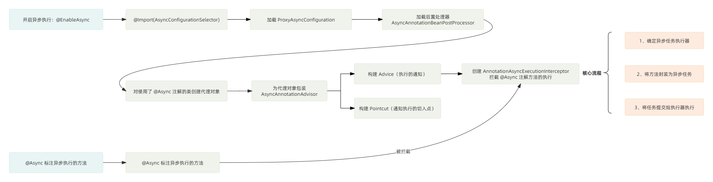

Annotation `@Async` do framework Spring cung cấp. Class hoặc method được đánh dấu bằng annotation này sẽ được thực thi trong **thread bất đồng bộ**. Điều đó có nghĩa là khi method được gọi, caller sẽ không chờ method thực thi xong mà có thể tiếp tục thực thi code phía sau.

Cách sử dụng annotation `@Async` rất đơn giản, gồm hai bước:

1. Thêm annotation `@EnableAsync` vào class khởi động để bật task bất đồng bộ.
2. Thêm annotation `@Async` vào method hoặc class cần thực thi bất đồng bộ.

```java
@SpringBootApplication
// Bật task bất đồng bộ
@EnableAsync
public class YourApplication {

    public static void main(String[] args) {
        SpringApplication.run(YourApplication.class, args);
    }
}

// Class service bất đồng bộ
@Service
public class MyService {

    // Khuyến nghị sử dụng thread pool tùy chỉnh, ở đây chỉ minh họa cách dùng cơ bản
    @Async
    public CompletableFuture<String> doSomethingAsync() {

        // Ở đây sẽ có một số thao tác nghiệp vụ tốn thời gian
        // ...
        // CompletableFuture giúp xử lý kết quả của task bất đồng bộ thuận tiện hơn, tránh block main thread
        return CompletableFuture.completedFuture("Async Task Completed");
    }

}
```

Tiếp theo, chúng ta cùng tìm hiểu nguyên lý bên trong của `@Async`.

## Phân tích nguyên lý @Async

`@Async` có thể thực thi task bất đồng bộ, về bản chất được hiện thực bằng **dynamic proxy**. Thông qua post processor `BeanPostProcessor` trong Spring, một dynamic proxy được tạo cho class sử dụng annotation `@Async`. Sau đó, lời gọi method có annotation `@Async` sẽ bị dynamic proxy chặn lại; trong interceptor, việc thực thi method được đóng gói thành task bất đồng bộ và gửi cho thread pool xử lý.

Tiếp theo, chúng ta sẽ phân tích chi tiết.

### Bật bất đồng bộ

Trước khi sử dụng `@Async`, cần thêm `@EnableAsync` vào class khởi động để bật bất đồng bộ. Annotation `@EnableAsync` như sau:

```JAVA
// Lược bỏ các annotation khác ...
@Import(AsyncConfigurationSelector.class)
public @interface EnableAsync { /* ... */ }
```

Annotation `@EnableAsync` dùng annotation `@Import` để đưa `AsyncConfigurationSelector` vào, vì vậy Spring sẽ load class được đưa vào thông qua annotation `@Import`.

Class `AsyncConfigurationSelector` implement interface `ImportSelector`, vì vậy class này sẽ override method `selectImports()` để tùy chỉnh logic load Bean, như sau:

```JAVA
public class AsyncConfigurationSelector extends AdviceModeImportSelector<EnableAsync> {
	@Override
	@Nullable
	public String[] selectImports(AdviceMode adviceMode) {
		switch (adviceMode) {
	   // Advice được dệt dựa trên proxy Spring AOP, cụ thể có thể sử dụng JDK dynamic proxy hoặc CGLIB
			case PROXY:
				return new String[] {ProxyAsyncConfiguration.class.getName()};
   // Advice được dệt dựa trên AspectJ
			case ASPECTJ:
				return new String[] {ASYNC_EXECUTION_ASPECT_CONFIGURATION_CLASS_NAME};
			default:
				return null;
		}
	}
}
```

Trong method `selectImports()`, các class khác nhau sẽ được chọn để load dựa trên loại advice. Giá trị mặc định của `adviceMode` là `PROXY`.

Ở đây lấy advice dựa trên proxy Spring AOP làm ví dụ. Khi đó class `ProxyAsyncConfiguration` sẽ được load như sau:

```JAVA
@Configuration
@Role(BeanDefinition.ROLE_INFRASTRUCTURE)
public class ProxyAsyncConfiguration extends AbstractAsyncConfiguration {
	@Bean(name = TaskManagementConfigUtils.ASYNC_ANNOTATION_PROCESSOR_BEAN_NAME)
	@Role(BeanDefinition.ROLE_INFRASTRUCTURE)
	public AsyncAnnotationBeanPostProcessor asyncAdvisor() {
			 // ...
  // Load post processor
		AsyncAnnotationBeanPostProcessor bpp = new AsyncAnnotationBeanPostProcessor();

  // ...
		return bpp;
	}
}
```

### Post processor

Trong class `ProxyAsyncConfiguration`, annotation `@Bean` được dùng để load một post processor là `AsyncAnnotationBeanPostProcessor`. Post processor này là mấu chốt giúp annotation `@Async` có hiệu lực.

Nếu một class hoặc method sử dụng annotation `@Async`, processor `AsyncAnnotationBeanPostProcessor` sẽ tạo một dynamic proxy cho class đó.

Khi method của class này được thực thi, nó sẽ bị interceptor của proxy object chặn lại; method được đánh dấu bằng annotation `@Async` sẽ được thực thi bất đồng bộ.

Code của `AsyncAnnotationBeanPostProcessor` như sau:

```JAVA
public class AsyncAnnotationBeanPostProcessor extends AbstractBeanFactoryAwareAdvisingPostProcessor {
	@Override
	public void setBeanFactory(BeanFactory beanFactory) {
		super.setBeanFactory(beanFactory);
  // Tạo AsyncAnnotationAdvisor, đây là một Advisor
  // dùng để chặn method có annotation @Async và thực thi các method này bất đồng bộ.
		AsyncAnnotationAdvisor advisor = new AsyncAnnotationAdvisor(this.executor, this.exceptionHandler);
  // Nếu đã thiết lập asyncAnnotationType tùy chỉnh thì thiết lập nó vào advisor.
  // asyncAnnotationType dùng để chỉ định annotation bất đồng bộ tùy chỉnh, ví dụ @MyAsync.
		if (this.asyncAnnotationType != null) {
			advisor.setAsyncAnnotationType(this.asyncAnnotationType);
		}
		advisor.setBeanFactory(beanFactory);
		this.advisor = advisor;
	}
}
```

Class cha của `AsyncAnnotationBeanPostProcessor` implement interface `BeanFactoryAware`, vì vậy class này override method `setBeanFactory()` làm extension point để load `AsyncAnnotationAdvisor`.

#### Tạo Advisor

`Advisor` là abstraction của `Spring AOP` đối với `Advice` và `Pointcut`. `Advice` là logic advice được thực thi, còn `Pointcut` là pointcut nơi advice được thực thi.

Post processor `AsyncAnnotationBeanPostProcessor` sẽ tạo `AsyncAnnotationAdvisor`. Trong constructor của nó, `Advice` và `Pointcut` tương ứng sẽ được xây dựng như sau:

```JAVA
public class AsyncAnnotationAdvisor extends AbstractPointcutAdvisor implements BeanFactoryAware {

    private Advice advice; // Advice thực thi bất đồng bộ
    private Pointcut pointcut; // Pointcut khớp với method có annotation @Async

    // Constructor
    public AsyncAnnotationAdvisor(/* Lược bỏ tham số */) {
        // 1. Tạo Advice, chịu trách nhiệm cho logic thực thi bất đồng bộ
        this.advice = buildAdvice(executor, exceptionHandler);
        // 2. Tạo Pointcut, chọn các method cần được enhance
        this.pointcut = buildPointcut(asyncAnnotationTypes);
    }

    // Tạo Advice
    protected Advice buildAdvice(/* Lược bỏ tham số */) {
        // Tạo interceptor xử lý việc thực thi bất đồng bộ
        AnnotationAsyncExecutionInterceptor interceptor = new AnnotationAsyncExecutionInterceptor(null);
        // Dùng executor và exception handler để cấu hình interceptor
        interceptor.configure(executor, exceptionHandler);
        return interceptor;
    }

    // Tạo Pointcut
    protected Pointcut buildPointcut(Set<Class<? extends Annotation>> asyncAnnotationTypes) {
        ComposablePointcut result = null;
        for (Class<? extends Annotation> asyncAnnotationType : asyncAnnotationTypes) {
            // 1. Pointcut cấp class: khớp nếu class có annotation
            Pointcut cpc = new AnnotationMatchingPointcut(asyncAnnotationType, true);
            // 2. Pointcut cấp method: khớp nếu method có annotation
            Pointcut mpc = new AnnotationMatchingPointcut(null, asyncAnnotationType, true);

            if (result == null) {
                result = new ComposablePointcut(cpc);
            } else {
                // Dùng union để hợp nhất pointcut trước đó
                result.union(cpc);
            }
            // Thêm pointcut cấp method vào pointcut kết hợp
            result = result.union(mpc);
        }
        // Trả về pointcut kết hợp; nếu không cung cấp loại annotation thì trả về Pointcut.TRUE
        return (result != null ? result : Pointcut.TRUE);
    }
}
```

Cốt lõi của `AsyncAnnotationAdvisor` nằm ở việc xây dựng `Advice` và `Pointcut`:

- Xây dựng `Advice`: tạo interceptor `AnnotationAsyncExecutionInterceptor`; logic của advice sẽ được thực thi trong method `invoke()` của interceptor.
- Xây dựng `Pointcut`: được tạo thành từ `ClassFilter` và `MethodMatcher`, dùng để khớp các method cần thực thi logic của advice.

#### Logic post processor

Method `postProcessAfterInitialization()` được implement trong post processor `AsyncAnnotationBeanPostProcessor` nằm ở class cha `AbstractAdvisingBeanPostProcessor`. Sau khi `Bean` được khởi tạo, quá trình post process sẽ đi vào method `postProcessAfterInitialization()`.

Trong method post process, hệ thống sẽ kiểm tra `Bean` có thỏa điều kiện của Advisor trong post processor hay không. Nếu có thì proxy object sẽ được tạo, như sau:

```JAVA
// AbstractAdvisingBeanPostProcessor
public Object postProcessAfterInitialization(Object bean, String beanName) {
	if (this.advisor == null || bean instanceof AopInfrastructureBean) {
		return bean;
	}
	if (bean instanceof Advised) {
		Advised advised = (Advised) bean;
		if (!advised.isFrozen() && isEligible(AopUtils.getTargetClass(bean))) {
			if (this.beforeExistingAdvisors) {
				advised.addAdvisor(0, this.advisor);
			}
			else {
				advised.addAdvisor(this.advisor);
			}
			return bean;
		}
	}
  // Kiểm tra Bean đã cho có thỏa điều kiện của Advisor trong post processor hay không; nếu có thì tạo proxy object.
	if (isEligible(bean, beanName)) {
		ProxyFactory proxyFactory = prepareProxyFactory(bean, beanName);
		if (!proxyFactory.isProxyTargetClass()) {
			evaluateProxyInterfaces(bean.getClass(), proxyFactory);
		}
  // Thêm Advisor.
		proxyFactory.addAdvisor(this.advisor);
		customizeProxyFactory(proxyFactory);
  // Trả về proxy object.
		return proxyFactory.getProxy(getProxyClassLoader());
	}
	return bean;
}
```

### Chặn method có annotation @Async

Việc thực thi method có annotation `@Async` sẽ bị chặn trong `AnnotationAsyncExecutionInterceptor`; logic của interceptor được thực thi trong method `invoke()`. Khi đó, method được đánh dấu bằng annotation `@Async` sẽ được đóng gói thành task bất đồng bộ và giao cho executor thực thi.

Method `invoke()` được định nghĩa trong class cha `AsyncExecutionInterceptor` của `AnnotationAsyncExecutionInterceptor`, như sau:

```JAVA
public class AsyncExecutionInterceptor extends AsyncExecutionAspectSupport implements MethodInterceptor, Ordered {
	@Override
	@Nullable
	public Object invoke(final MethodInvocation invocation) throws Throwable {
		Class<?> targetClass = (invocation.getThis() != null ? AopUtils.getTargetClass(invocation.getThis()) : null);
		Method specificMethod = ClassUtils.getMostSpecificMethod(invocation.getMethod(), targetClass);
		final Method userDeclaredMethod = BridgeMethodResolver.findBridgedMethod(specificMethod);

  // 1. Xác định executor thực thi task bất đồng bộ
		AsyncTaskExecutor executor = determineAsyncExecutor(userDeclaredMethod);

  // 2. Đóng gói method cần thực thi thành task bất đồng bộ Callable
		Callable<Object> task = () -> {
			try {
    // 2.1. Thực thi method
				Object result = invocation.proceed();
    // 2.2. Nếu giá trị trả về của method là kiểu Future thì block để chờ kết quả
				if (result instanceof Future) {
					return ((Future<?>) result).get();
				}
			}
			catch (ExecutionException ex) {
				handleError(ex.getCause(), userDeclaredMethod, invocation.getArguments());
			}
			catch (Throwable ex) {
				handleError(ex, userDeclaredMethod, invocation.getArguments());
			}
			return null;
		};
		// 3. Submit task
		return doSubmit(task, executor, invocation.getMethod().getReturnType());
	}
}
```

Trong method `invoke()`, có 3 bước chính:

1. Xác định executor thực thi task bất đồng bộ.
2. Đóng gói method được đánh dấu bằng annotation `@Async` thành task bất đồng bộ `Callable`.
3. Gửi task cho executor thực thi.

#### 1. Lấy executor của task bất đồng bộ

Trong method `determineAsyncExecutor()`, executor của task bất đồng bộ (tức **thread pool** thực thi task bất đồng bộ) sẽ được lấy ra. Code như sau:

```JAVA
// Xác định executor của task bất đồng bộ
protected AsyncTaskExecutor determineAsyncExecutor(Method method) {
  // 1. Trước tiên lấy từ cache.
	AsyncTaskExecutor executor = this.executors.get(method);
	if (executor == null) {
		Executor targetExecutor;
  // 2. Lấy qualifier của executor.
		String qualifier = getExecutorQualifier(method);
		if (StringUtils.hasLength(qualifier)) {
   // 3. Lấy executor tương ứng dựa trên qualifier.
			targetExecutor = findQualifiedExecutor(this.beanFactory, qualifier);
		}
		else {
   // 4. Nếu không có qualifier thì dùng executor mặc định, tức thread pool mặc định do Spring cung cấp: SimpleAsyncTaskExecutor.
			targetExecutor = this.defaultExecutor.get();
		}
		if (targetExecutor == null) {
			return null;
		}
  // 5. Bọc executor bằng adapter TaskExecutorAdapter.
  // TaskExecutorAdapter là một lớp abstraction của Spring đối với thread pool JDK, đồng thời vẫn kế thừa Executor của thread pool JDK. Không cần đi sâu, chỉ cần biết đây là thread pool.
		executor = (targetExecutor instanceof AsyncListenableTaskExecutor ?
				(AsyncListenableTaskExecutor) targetExecutor : new TaskExecutorAdapter(targetExecutor));
		this.executors.put(method, executor);
	}
	return executor;
}
```

Trong method `determineAsyncExecutor()`, executor của task bất đồng bộ (thread pool) được xác định chủ yếu thông qua giá trị `value` của annotation `@Async` để lấy qualifier của executor, sau đó tìm executor tương ứng trong `BeanFactory` dựa trên qualifier.

Nếu không chỉ định thread pool trong annotation `@Async`, hệ thống sẽ lấy thread pool mặc định thông qua `this.defaultExecutor.get()`. `defaultExecutor` được gán trong method bên dưới:

```JAVA
// AsyncExecutionInterceptor
protected Executor getDefaultExecutor(@Nullable BeanFactory beanFactory) {
  // 1. Thử lấy thread pool từ beanFactory.
	Executor defaultExecutor = super.getDefaultExecutor(beanFactory);
  // 2. Nếu beanFactory không có thì tạo thread pool SimpleAsyncTaskExecutor.
	return (defaultExecutor != null ? defaultExecutor : new SimpleAsyncTaskExecutor());
}
```

Trong đó, `super.getDefaultExecutor()` sẽ thử lấy thread pool kiểu `Executor` trong `beanFactory`. Code như sau:

```JAVA
protected Executor getDefaultExecutor(@Nullable BeanFactory beanFactory) {
	if (beanFactory != null) {
		try {
   // 1. Lấy thread pool kiểu TaskExecutor từ beanFactory.
			return beanFactory.getBean(TaskExecutor.class);
		}
		catch (NoUniqueBeanDefinitionException ex) {
			try {
				// 2. Nếu có nhiều Bean thì thử lấy thread pool Executor có tên executor từ beanFactory.
				return beanFactory.getBean(DEFAULT_TASK_EXECUTOR_BEAN_NAME, Executor.class);
			}
			catch (NoSuchBeanDefinitionException ex2) {
				if (logger.isInfoEnabled()) {
					// ...
				}
			}
		}
		catch (NoSuchBeanDefinitionException ex) {
			try {
    // 3. Nếu không có thì thử lấy thread pool Executor có tên executor từ beanFactory.
				return beanFactory.getBean(DEFAULT_TASK_EXECUTOR_BEAN_NAME, Executor.class);
			}
			catch (NoSuchBeanDefinitionException ex2) {
				// ...
			}
		}
	}
	return null;
}
```

Trong `getDefaultExecutor()`, nếu không thể lấy thread pool từ `beanFactory` thì thread pool `SimpleAsyncTaskExecutor` sẽ được tạo.

Thread pool này tạo một thread mới để thực thi task mỗi khi thực thi task bất đồng bộ, không tái sử dụng thread. Điều này khiến chi phí thực thi task bất đồng bộ rất lớn. Nếu số lượng request đồng thời của method được đánh dấu bằng annotation `@Async` tăng đột biến tại một thời điểm, ứng dụng sẽ tạo ra lượng lớn thread, từ đó ảnh hưởng chất lượng service, thậm chí khiến service không thể sử dụng.

Nếu submit 10000 task vào thread pool `SimpleAsyncTaskExecutor` cùng lúc, thread pool này sẽ tạo 10000 thread. Method `execute()` của nó như sau:

```JAVA
// SimpleAsyncTaskExecutor: execute() bên trong sẽ gọi doExecute()
protected void doExecute(Runnable task) {
    // Tạo thread mới
    Thread thread = (this.threadFactory != null ? this.threadFactory.newThread(task) : createThread(task));
    thread.start();
}
```

**Khuyến nghị: khi sử dụng `@Async`, nên tự chỉ định thread pool để tránh rủi ro do thread pool mặc định của Spring gây ra.**

`value` trong annotation `@Async` chỉ định qualifier của thread pool. Có thể lấy **thread pool tùy chỉnh** dựa trên qualifier. Code lấy qualifier như sau:

```JAVA
// AnnotationAsyncExecutionInterceptor
protected String getExecutorQualifier(Method method) {
	// 1. Lấy annotation Async từ method.
	Async async = AnnotatedElementUtils.findMergedAnnotation(method, Async.class);
  // 2. Nếu không tìm thấy annotation @Async trên method thì thử lấy annotation @Async từ class chứa method.
	if (async == null) {
		async = AnnotatedElementUtils.findMergedAnnotation(method.getDeclaringClass(), Async.class);
	}
  // 3. Nếu tìm thấy annotation @Async thì lấy giá trị value của annotation và trả về làm qualifier của thread pool.
  //    Nếu giá trị thuộc tính "value" là chuỗi rỗng thì dùng thread pool mặc định.
  //    Nếu không tìm thấy annotation @Async thì trả về null, đồng thời dùng thread pool mặc định.
	return (async != null ? async.value() : null);
}
```

#### 2. Đóng gói method thành task bất đồng bộ

Sau khi lấy executor trong method `invoke()`, method sẽ được đóng gói thành task bất đồng bộ. Code như sau:

```JAVA
// Đóng gói method cần thực thi thành task bất đồng bộ Callable
Callable<Object> task = () -> {
    try {
        // 2.1. Thực thi method bị chặn (method proceed() là method cốt lõi trong AOP, dùng để thực thi target method)
        Object result = invocation.proceed();

        // 2.2. Proxy trả về cho caller Future bất đồng bộ thực tế, còn target method bị ràng buộc bởi method signature
        //     nên trước tiên trả về một Future tạm thời. Vì vậy cần unwrap kết quả của Future tạm thời trong worker thread.
        if (result instanceof Future) {
            return ((Future<?>) result).get(); // Block để chờ kết quả của Future
        }
    }
    catch (ExecutionException ex) {
        // 2.3. Xử lý exception ExecutionException. ExecutionException là exception do method Future.get() ném ra,
        handleError(ex.getCause(), userDeclaredMethod, invocation.getArguments()); // Xử lý exception gốc
    }
    catch (Throwable ex) {
        // 2.4. Xử lý các loại exception khác. Gọi method handleError() với exception, method bị chặn và tham số method làm tham số.
        handleError(ex, userDeclaredMethod, invocation.getArguments());
    }
    // 2.5. Nếu giá trị trả về của method không phải kiểu Future hoặc đã xảy ra exception thì trả về null.
    return null;
};
```

So với `Runnable`, `Callable` có thể trả về kết quả và ném exception.

Việc thực thi `invocation.proceed()` (thực thi method gốc) được đóng gói thành task bất đồng bộ `Callable`. Ở đây chỉ trả về khi kiểu của `result` (giá trị trả về của method) là `Future`; nếu là kiểu khác thì trả về `null`.

Vì vậy, nếu method được đánh dấu bằng annotation `@Async` dùng kiểu trả về khác `Future` thì không thể lấy kết quả thực thi của method.

#### 3. Submit task bất đồng bộ

Sau khi đóng gói method cần thực thi thành task `Callable` trong `AsyncExecutionInterceptor#invoke()`, task sẽ được giao cho executor thực thi. Dưới đây là đoạn trích source code `doSubmit()` của Spring Framework 5.3.x, bao gồm các API liên quan đến `ListenableFuture` đã bị deprecate và loại bỏ sau đó:

```JAVA
protected Object doSubmit(Callable<Object> task, AsyncTaskExecutor executor, Class<?> returnType) {
    // Chọn cách thực thi bất đồng bộ khác nhau và trả về kết quả dựa trên kiểu trả về của method.
    // 1. Nếu kiểu trả về của method là CompletableFuture
    if (CompletableFuture.class.isAssignableFrom(returnType)) {
        // Dùng method CompletableFuture.supplyAsync() để thực thi task bất đồng bộ.
        return CompletableFuture.supplyAsync(() -> {
            try {
                return task.call();
            }
            catch (Throwable ex) {
                throw new CompletionException(ex); // Bọc exception thành CompletionException để ném ra khi future.get()
            }
        }, executor);
    }
    // 2. Nếu kiểu trả về của method là ListenableFuture
    else if (ListenableFuture.class.isAssignableFrom(returnType)) {
        // Ép kiểu AsyncTaskExecutor thành AsyncListenableTaskExecutor,
        // đồng thời gọi method submitListenable() để submit task.
        // AsyncListenableTaskExecutor là executor bất đồng bộ chuyên dụng cho ListenableFuture,
        // có thể trả về một object ListenableFuture, cho phép thêm callback để theo dõi việc hoàn thành task.
        return ((AsyncListenableTaskExecutor) executor).submitListenable(task);
    }
    // 3. Nếu kiểu trả về của method là Future
    else if (Future.class.isAssignableFrom(returnType)) {
        // Trực tiếp gọi method submit() của AsyncTaskExecutor để submit task và trả về một object Future.
        return executor.submit(task);
    }
    // 4. Nếu kiểu trả về của method là void hoặc kiểu khác
    else {
        // Trực tiếp gọi method submit() của AsyncTaskExecutor để submit task.
        // Vì kiểu trả về của method là void nên không cần trả về kết quả, trực tiếp trả về null.
        executor.submit(task);
        return null;
    }
}
```

Trong method `doSubmit()`, cách submit task khác nhau sẽ được chọn dựa trên kiểu trả về của method được đánh dấu bằng annotation `@Async`; cuối cùng task sẽ do executor (thread pool) thực thi.

### Tổng kết



Cốt lõi để hiểu nguyên lý `@Async` là hiểu annotation `@EnableAsync`, annotation này bật chức năng task bất đồng bộ.

Quy trình chính như hình trên: post processor sẽ tạo proxy object, sau đó việc thực thi method có `@Async` trong proxy object sẽ đi vào interceptor bên trong `Advice`, rồi method được đóng gói thành task bất đồng bộ và submit cho thread pool xử lý.

## Khuyến nghị sử dụng @Async

### Thread pool tùy chỉnh

Nếu không cấu hình thread pool một cách tường minh, bên dưới `@Async` trước tiên sẽ thử lấy thread pool trong `BeanFactory`. Nếu không lấy được, một implementation `SimpleAsyncTaskExecutor` sẽ được tạo. Về bản chất, `SimpleAsyncTaskExecutor` không được xem là thread pool thực sự, vì nó khởi động thread mới cho mỗi request thay vì tái sử dụng thread hiện có, điều này gây ra một số vấn đề tiềm ẩn, chẳng hạn tiêu tốn quá nhiều tài nguyên.

Chi tiết về cách lấy thread pool có thể tham khảo bài viết này: [Phân tích sơ lược nguyên lý thread pool bất đồng bộ bên dưới annotation Async trong Spring | Công nghệ Dewu](https://mp.weixin.qq.com/s/FySv5L0bCdrlb5MoSfQtAA).

Nhất định phải cấu hình tường minh một thread pool, khuyến nghị dùng `ThreadPoolTaskExecutor`. Ngoài ra, có thể chỉ định thread pool khác nhau cho các method bất đồng bộ khác nhau dựa trên tính chất và nhu cầu của task.

```java
@Configuration
@EnableAsync
public class AsyncConfig {

    @Bean(name = "executor1")
    public Executor executor1() {
        ThreadPoolTaskExecutor executor = new ThreadPoolTaskExecutor();
        executor.setCorePoolSize(3);
        executor.setMaxPoolSize(5);
        executor.setQueueCapacity(50);
        executor.setThreadNamePrefix("AsyncExecutor1-");
        executor.initialize();
        return executor;
    }

    @Bean(name = "executor2")
    public Executor executor2() {
        ThreadPoolTaskExecutor executor = new ThreadPoolTaskExecutor();
        executor.setCorePoolSize(2);
        executor.setMaxPoolSize(4);
        executor.setQueueCapacity(100);
        executor.setThreadNamePrefix("AsyncExecutor2-");
        executor.initialize();
        return executor;
    }
}
```

Chỉ định tên Bean của thread pool trong annotation `@Async`:

```java
@Service
public class AsyncService {

    @Async("executor1")
    public void performTask1() {
        // Logic của task 1
        System.out.println("Executing Task1 with Executor1");
    }

    @Async("executor2")
    public void performTask2() {
        // Logic của task 2
        System.out.println("Executing Task2 with Executor2");
    }
}
```

### Tránh annotation @Async mất hiệu lực

Annotation `@Async` sẽ mất hiệu lực trong các trường hợp sau, cần lưu ý:

**1. Gọi method bất đồng bộ trong cùng một class**

Nếu gọi method có annotation `@Async` bên trong cùng một class, method này sẽ không được thực thi bất đồng bộ.

```java
@Service
public class MyService {

    public void myMethod() {
        // Gọi trực tiếp thông qua tham chiếu this, bỏ qua cơ chế proxy của Spring nên thực thi bất đồng bộ mất hiệu lực
        asyncMethod();
    }

    @Async
    public void asyncMethod() {
        // Logic thực thi bất đồng bộ
    }
}
```

Đó là vì cơ chế bất đồng bộ của Spring được hiện thực thông qua **proxy**. Lời gọi method bên trong cùng một class sẽ bỏ qua cơ chế proxy của Spring, tức bỏ qua proxy object và gọi trực tiếp thông qua tham chiếu `this`. Vì không đi qua proxy nên mọi xử lý liên quan đến proxy (tức submit task cho thread pool để thực thi bất đồng bộ) đều không xảy ra.

Để tránh vấn đề này, cách làm được khuyến nghị là chuyển method bất đồng bộ sang một Spring Bean khác.

```java
@Service
public class AsyncService {
    @Async
    public void asyncMethod() {
        // Logic thực thi bất đồng bộ
    }
}

@Service
public class MyService {
    @Autowired
    private AsyncService asyncService;

    public void myMethod() {
        asyncService.asyncMethod();
    }
}
```

**2. Dùng từ khóa `static` để modifier method bất đồng bộ**

Nếu method có annotation `@Async` được modifier bằng từ khóa `static`, method này sẽ không được thực thi bất đồng bộ.

Đó là vì cơ chế bất đồng bộ của Spring được hiện thực thông qua proxy. Do static method không thuộc instance mà thuộc class và không tham gia inheritance, cơ chế proxy của Spring (dù dựa trên JDK hay CGLIB) không thể chặn static method để cung cấp các chức năng enhance như thực thi bất đồng bộ.

Do giới hạn độ dài, ở đây không giải thích chi tiết hơn. Nếu chưa hiểu rõ cơ chế proxy, bạn có thể xem bài viết [Giải thích chi tiết proxy pattern trong Java](https://javaguide.cn/java/basis/proxy.html) do tôi viết.

Nếu cần thực thi logic của một static method bất đồng bộ, có thể cân nhắc thiết kế một wrapper method non-static. Wrapper method này sử dụng annotation `@Async` và gọi static method bên trong.

```java
@Service
public class AsyncService {

    @Async
    public void asyncWrapper() {
        // Gọi static method
        SClass.staticMethod();
    }
}

public class SClass {
    public static void staticMethod() {
        // Thực thi một số thao tác
    }
}
```

**3. Quên bật hỗ trợ bất đồng bộ**

Spring Boot mặc định không bật hỗ trợ bất đồng bộ. Hãy đảm bảo thêm annotation `@EnableAsync` vào class cấu hình chính `Application` để bật chức năng bất đồng bộ.

```java
@SpringBootApplication
@EnableAsync
public class Application {
    public static void main(String[] args) {
        SpringApplication.run(Application.class, args);
    }
}
```

**4. Class chứa method có annotation `@Async` phải là Spring Bean**

Method có annotation `@Async` phải nằm trong Bean do Spring quản lý. Chỉ khi đó Spring mới có thể áp dụng proxy trong lúc tạo Bean; proxy mới có thể chặn lời gọi method và hiện thực logic thực thi bất đồng bộ. Nếu method không nằm trong Bean do Spring quản lý, Spring không thể tạo proxy cần thiết và annotation `@Async` sẽ không có bất kỳ tác dụng nào.

### Kiểu trả về

Khuyến nghị định nghĩa kiểu trả về của method có annotation `@Async` là `void` và `Future`.

- Nếu không cần lấy kết quả trả về của method bất đồng bộ, định nghĩa kiểu trả về là `void`.
- Nếu cần lấy kết quả trả về của method bất đồng bộ, định nghĩa kiểu trả về là `Future` (thường dùng `CompletableFuture`). `ListenableFuture` thuộc API Spring phiên bản cũ, không nên tiếp tục sử dụng trong Spring 6.1 trở lên.

Nếu định nghĩa kiểu trả về của method có annotation `@Async` là kiểu khác (chẳng hạn `Object`, `String`, v.v.), sẽ không thể lấy giá trị trả về của method.

Thiết kế này phù hợp với nguyên tắc cơ bản của lập trình bất đồng bộ: caller không nên lập tức chờ đợi một kết quả, mà có thể lấy kết quả tại một thời điểm nào đó trong tương lai. Nếu kiểu trả về là `Future`, caller có thể dùng object `Future` được trả về để truy vấn trạng thái task, hủy task hoặc lấy kết quả khi task hoàn thành.

### Xử lý exception trong method bất đồng bộ

Exception được ném ra trong method bất đồng bộ sẽ không được calling thread bắt trực tiếp. Method bất đồng bộ trả về `Future` hoặc `CompletableFuture` sẽ expose exception thông qua Future; có thể dùng `get()`, `join()` hoặc method xử lý exception của `CompletableFuture` để xử lý. Method bất đồng bộ trả về `void` không thể truyền exception cho caller, nhưng có thể cấu hình `AsyncUncaughtExceptionHandler` toàn cục.

```java
@Configuration
@EnableAsync
public class AsyncConfig implements AsyncConfigurer{

    @Override
    public AsyncUncaughtExceptionHandler getAsyncUncaughtExceptionHandler() {
        return new CustomAsyncExceptionHandler();
    }

}

// Exception handler tùy chỉnh
class CustomAsyncExceptionHandler implements AsyncUncaughtExceptionHandler {

    @Override
    public void handleUncaughtException(Throwable ex, Method method, Object... params) {
        // Ghi log hoặc xử lý logic khác
    }
}
```

### Chưa xem xét quản lý transaction

Khi method có annotation `@Async` cần hỗ trợ transaction, nhất thiết phải sử dụng transaction độc lập trên chính method bất đồng bộ đó.

```java
@Service
public class AsyncTransactionalService {

    @Async
    // Propagation.REQUIRES_NEW nghĩa là Spring sẽ mở một transaction mới, không liên quan đến transaction hiện tại khi thực thi method bất đồng bộ
    @Transactional(propagation = Propagation.REQUIRES_NEW)
    public void asyncTransactionalMethod() {
        // Các thao tác ở đây sẽ được thực thi trong transaction mới
        // Thực thi một số thao tác database
    }
}
```

### Chưa chỉ định thứ tự thực thi method bất đồng bộ

Việc thực thi method có annotation `@Async` là non-blocking, nên chúng có thể hoàn thành theo bất kỳ thứ tự nào. Nếu cần xử lý kết quả theo thứ tự cụ thể, có thể đặt kiểu trả về của method là `Future` hoặc `CompletableFuture`, rồi dùng object giá trị trả về để thực thi một method sau khi method khác hoàn thành.

```java
@Async
public CompletableFuture<String> fetchDataAsync() {
    return CompletableFuture.completedFuture("Data");
}

@Async
public CompletableFuture<String> processDataAsync(String data) {
    // Bản thân method đã được @Async điều phối đến executor do Spring quản lý, không submit lại vào commonPool.
    return CompletableFuture.completedFuture("Processed " + data);
}
```

Method `processDataAsync` được thực thi sau `fetchDataAsync`:

```java
CompletableFuture<String> dataFuture = asyncService.fetchDataAsync();
dataFuture.thenCompose(data -> asyncService.processDataAsync(data))
          .thenAccept(result -> System.out.println(result));
```

##
