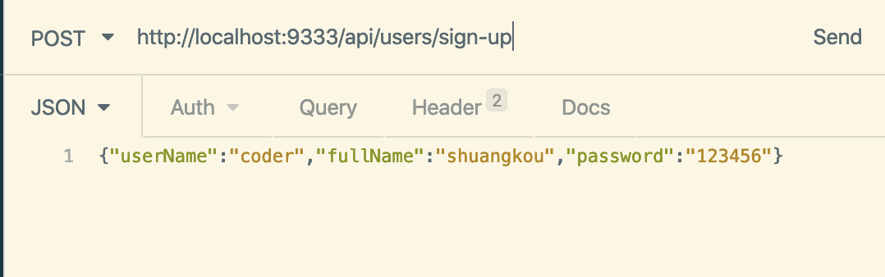

Không hề quá lời khi nói rằng các annotation Spring/Spring Boot thường dùng được giới thiệu trong bài viết này đã bao quát phần lớn các trường hợp thường gặp trong công việc. Với mỗi annotation, bài viết đều cung cấp cách sử dụng cụ thể. Nắm vững những nội dung này thì về cơ bản bạn sẽ không gặp vấn đề lớn khi dùng Spring Boot để phát triển dự án!

**Tại sao viết bài này?**

Gần đây tôi thấy trên mạng có một bài viết về các annotation Spring Boot thường dùng được chia sẻ rộng rãi, nhưng nội dung bài viết có một số thông tin dễ gây hiểu lầm, có thể không thân thiện với những developer chưa có nhiều kinh nghiệm sử dụng thực tế. Vì vậy, tôi đã dành vài ngày để tổng hợp bài viết này, hy vọng có thể giúp mọi người hiểu và sử dụng annotation Spring tốt hơn.

**Vì năng lực và thời gian cá nhân có hạn, nếu có bất kỳ lỗi hoặc thiếu sót nào, hoan nghênh bạn góp ý! Xin chân thành cảm ơn!**

## Annotation cơ bản của Spring Boot

`@SpringBootApplication` là annotation cốt lõi của ứng dụng Spring Boot, thường dùng để đánh dấu class khởi động chính.

Ví dụ:

```java
@SpringBootApplication
public class SpringSecurityJwtGuideApplication {
      public static void main(java.lang.String[] args) {
        SpringApplication.run(SpringSecurityJwtGuideApplication.class, args);
    }
}
```

Có thể xem `@SpringBootApplication` là tổ hợp của ba annotation sau:

- **`@EnableAutoConfiguration`**: bật cơ chế auto-configuration của Spring Boot.
- **`@ComponentScan`**: quét các class có annotation `@Component`, `@Service`, `@Repository`, `@Controller` và các annotation khác.
- **`@Configuration`**: cho phép đăng ký thêm Spring Bean hoặc import các class cấu hình khác.

Source code như sau:

```java
package org.springframework.boot.autoconfigure;
@Target(ElementType.TYPE)
@Retention(RetentionPolicy.RUNTIME)
@Documented
@Inherited
@SpringBootConfiguration
@EnableAutoConfiguration
@ComponentScan(excludeFilters = {
    @Filter(type = FilterType.CUSTOM, classes = TypeExcludeFilter.class),
    @Filter(type = FilterType.CUSTOM, classes = AutoConfigurationExcludeFilter.class) })
public @interface SpringBootApplication {
   ......
}

package org.springframework.boot;
@Target(ElementType.TYPE)
@Retention(RetentionPolicy.RUNTIME)
@Documented
@Configuration
public @interface SpringBootConfiguration {

}
```

## Spring Bean

### Dependency Injection (DI)

`@Autowired` dùng để tự động inject dependency (tức Spring Bean khác). Annotation này có thể đặt trên constructor, field, phương thức Setter hoặc phương thức cấu hình. Spring container sẽ tự động tìm Bean có type phù hợp và inject vào.

```java
@Service
public class UserServiceImpl implements UserService {
    // ...
}

@RestController
public class UserController {
    // field injection
    @Autowired
    private UserService userService;
    // ...
}
```

Khi có nhiều Bean cùng type, việc `@Autowired` mặc định inject theo type có thể gây ambiguity. Khi đó, có thể kết hợp với `@Qualifier`, chỉ định tên Bean để chọn chính xác instance cần inject.

```java
@Repository("userRepositoryA")
public class UserRepositoryA implements UserRepository { /* ... */ }

@Repository("userRepositoryB")
public class UserRepositoryB implements UserRepository { /* ... */ }

@Service
public class UserService {
    @Autowired
    @Qualifier("userRepositoryA") // Chỉ định Bean có tên "userRepositoryA" để inject
    private UserRepository userRepository;
    // ...
}
```

`@Primary` cũng dùng để giải quyết vấn đề inject khi có nhiều instance cùng type. Khi định nghĩa Bean (chẳng hạn dùng `@Bean` hoặc class annotation), thêm annotation `@Primary` để cho biết Bean đó là đối tượng được **ưu tiên** inject. Khi thực hiện inject `@Autowired`, nếu không dùng `@Qualifier` để chỉ định tên, Spring sẽ ưu tiên chọn Bean có `@Primary`.

```java
@Primary // Đặt UserRepositoryA làm đối tượng được ưu tiên inject
@Repository("userRepositoryA")
public class UserRepositoryA implements UserRepository { /* ... */ }

@Repository("userRepositoryB")
public class UserRepositoryB implements UserRepository { /* ... */ }

@Service
public class UserService {
    @Autowired // Tự động inject UserRepositoryA vì nó có @Primary
    private UserRepository userRepository;
    // ...
}
```

`@Resource(name="beanName")` là annotation được định nghĩa bởi đặc tả JSR-250, cũng dùng cho dependency injection. Annotation này mặc định tìm và inject Bean theo **tên (by Name)**, còn `@Autowired` mặc định theo **type (by Type)**. Nếu không chỉ định thuộc tính `name`, nó sẽ thử tìm theo tên field hoặc tên method. Nếu không tìm thấy, nó sẽ fallback sang tìm theo type (tương tự `@Autowired`).

`@Resource` chỉ có thể đặt trên field và phương thức Setter, không hỗ trợ constructor injection.

```java
@Service
public class UserService {
    @Resource(name = "userRepositoryA")
    private UserRepository userRepository;
    // ...
}
```

### Bean scope

`@Scope("scopeName")` định nghĩa scope của Spring Bean, tức vòng đời và phạm vi hiển thị của instance Bean. Các scope thường dùng gồm:

- **singleton**: trong IoC container chỉ có duy nhất một instance bean. Bean trong Spring mặc định đều là singleton, đây là ứng dụng của singleton design pattern.
- **prototype**: mỗi lần lấy sẽ tạo một instance bean mới. Nói cách khác, gọi `getBean()` hai lần liên tiếp sẽ nhận được hai instance Bean khác nhau.
- **request** (chỉ dùng được trong Web application): mỗi HTTP request sẽ tạo một bean mới (request bean), bean đó chỉ có hiệu lực trong HTTP request hiện tại.
- **session** (chỉ dùng được trong Web application): mỗi HTTP request đến từ session mới sẽ tạo một bean mới (session bean), bean đó chỉ có hiệu lực trong HTTP session hiện tại.
- **application/global-session** (chỉ dùng được trong Web application): mỗi Web application tạo một Bean khi khởi động (application Bean), bean đó chỉ có hiệu lực trong thời gian application hiện tại hoạt động.
- **websocket** (chỉ dùng được trong Web application): mỗi WebSocket session tạo một bean mới.

```java
@Component
// Mỗi lần lấy sẽ tạo instance PrototypeBean mới
@Scope("prototype")
public class PrototypeBean {
    // ...
}
```

### Đăng ký Bean

Spring container cần biết class nào cần được quản lý dưới dạng Bean. Ngoài cách khai báo tường minh bằng method `@Bean` (thường trong class `@Configuration`), cách phổ biến hơn là dùng annotation Stereotype (stereotype) để đánh dấu class, kết hợp với cơ chế component scanning (Component Scanning), để Spring tự động phát hiện và đăng ký các class đó thành Bean. Những Bean này sau đó có thể được inject vào các component khác bằng `@Autowired` và các cách khác.

Dưới đây là một số annotation đăng ký Bean thường gặp:

- `@Component`: annotation dùng chung, có thể đánh dấu bất kỳ class nào là component của `Spring`. Nếu một Bean không biết thuộc layer nào, có thể dùng annotation `@Component` để đánh dấu.
- `@Repository`: tương ứng với persistence layer, tức Dao layer, chủ yếu dùng cho các thao tác liên quan đến database.
- `@Service`: tương ứng với service layer, chủ yếu chứa một số logic phức tạp và cần dùng đến Dao layer.
- `@Controller`: tương ứng với Spring MVC controller layer, chủ yếu dùng để nhận request của người dùng, gọi service layer và trả dữ liệu về frontend page.
- `@RestController`: một composite annotation, tương đương `@Controller` + `@ResponseBody`. Annotation này chuyên dùng để xây dựng controller cho RESTful Web service. Với class được đánh dấu `@RestController`, return value của tất cả handler method sẽ được tự động serialize (thường là JSON) và ghi vào HTTP response body, thay vì được phân tích thành view name.

`@Controller` vs `@RestController`:

- `@Controller`: chủ yếu dùng cho ứng dụng Spring MVC truyền thống. Return value của method thường là logical view name, cần view resolver phối hợp để render page. Nếu cần trả dữ liệu (chẳng hạn JSON), phải thêm annotation `@ResponseBody` trên method.
- `@RestController`: được thiết kế riêng cho RESTful API trả dữ liệu. Sau khi dùng annotation này trên class, return value của tất cả method mặc định được xem là nội dung response body (tương đương mỗi method được thêm ngầm `@ResponseBody`), thường dùng để trả dữ liệu JSON hoặc XML. Trong ứng dụng frontend-backend tách rời hiện đại, `@RestController` là lựa chọn phổ biến hơn.

Về so sánh `@RestController` và `@Controller`, hãy xem bài viết này: [@RestController vs @Controller](https://mp.weixin.qq.com/s?__biz=Mzg2OTA0Njk0OA==&mid=2247485544&idx=1&sn=3cc95b88979e28fe3bfe539eb421c6d8&chksm=cea247a3f9d5ceb5e324ff4b8697adc3e828ecf71a3468445e70221cce768d1e722085359907&token=1725092312&lang=zh_CN#rd).

## Cấu hình

### Khai báo class cấu hình

`@Configuration` chủ yếu dùng để khai báo một class là class cấu hình của Spring. Mặc dù cũng có thể thay thế bằng annotation `@Component`, `@Configuration` thể hiện rõ hơn mục đích của class (định nghĩa Bean), có ngữ nghĩa rõ ràng hơn và giúp Spring thực hiện các xử lý đặc thù (chẳng hạn dùng proxy CGLIB để bảo đảm hành vi singleton của method `@Bean`).

```java
@Configuration
public class AppConfig {

    // Annotation @Bean dùng để khai báo một Bean trong class cấu hình
    @Bean
    public TransferService transferService() {
        return new TransferServiceImpl();
    }

    // Class cấu hình có thể chứa một hoặc nhiều method @Bean.
}
```

### Đọc thông tin cấu hình

Trong quá trình phát triển application, chúng ta thường cần quản lý một số thông tin cấu hình, chẳng hạn chi tiết kết nối database, key hoặc địa chỉ của third-party service (như Alibaba Cloud OSS, SMS service, WeChat authentication). Thông thường, các thông tin này được **lưu tập trung trong file cấu hình** (như `application.yml` hoặc `application.properties`) để dễ quản lý và chỉnh sửa.

Spring cung cấp nhiều cách tiện lợi để đọc các thông tin cấu hình này. Giả sử chúng ta có file `application.yml` như sau:

```yaml
wuhan2020: Đầu năm 2020, một loại coronavirus mới bùng phát ở Wuhan, tình hình dịch bệnh nghiêm trọng, nhưng tôi tin mọi chuyện rồi sẽ qua! Wuhan cố lên! Trung Quốc cố lên!

my-profile:
  name: anh Guide
  email: koushuangbwcx@163.com

library:
  location: Hubei Wuhan cố lên Trung Quốc cố lên
  books:
    - name: Định luật cơ bản của thiên tài
      description: Vào ngày cha được chẩn đoán mắc bệnh Alzheimer ở tuổi hai mươi hai, Lin Zhaoxi biết tin Pei Zhi, nam thần của trường mà cô đã thầm thương nhiều năm, sắp ra nước ngoài học chuyên sâu. Ngôi trường cậu ấy thi đỗ lại chính là ngôi trường mà cha từng từ bỏ vì cô.
    - name: Trật tự của thời gian
      description: Tại sao chúng ta nhớ quá khứ mà không phải tương lai? “Dòng chảy” của thời gian có nghĩa là gì? Chúng ta tồn tại bên trong thời gian, hay thời gian tồn tại bên trong chúng ta? Carlo Rovelli dùng ngôn từ giàu chất thơ để mời chúng ta suy ngẫm về câu hỏi muôn thuở này: bản chất của thời gian.
    - name: Tôi phi thường
      description: Làm thế nào để hình thành một thói quen mới? Làm thế nào để tư duy trưởng thành hơn? Làm thế nào để có những mối quan hệ chất lượng? Làm thế nào để vượt qua những thời khắc khó khăn trong cuộc đời?
```

Dưới đây là một số cách đọc cấu hình thường dùng:

1、`@Value("${property.key}")` inject một giá trị thuộc tính đơn lẻ trong file cấu hình (như `application.properties` hoặc `application.yml`). Nó cũng hỗ trợ Spring Expression Language (SpEL), cho phép thực hiện logic injection phức tạp hơn.

```java
@Value("${wuhan2020}")
String wuhan2020;
```

2、`@ConfigurationProperties` có thể đọc thông tin cấu hình và bind với Bean, được dùng phổ biến hơn.

```java
@Component
@ConfigurationProperties(prefix = "library")
class LibraryProperties {
    @NotEmpty
    private String location;
    private List<Book> books;

    @Setter
    @Getter
    @ToString
    static class Book {
        String name;
        String description;
    }
  Bỏ qua getter/setter
  ......
}
```

Bạn có thể inject nó vào class và sử dụng như một Spring Bean thông thường.

```java
@Service
public class LibraryService {

    private final LibraryProperties libraryProperties;

    @Autowired
    public LibraryService(LibraryProperties libraryProperties) {
        this.libraryProperties = libraryProperties;
    }

    public void printLibraryInfo() {
        System.out.println(libraryProperties);
    }
}
```

### Load file cấu hình chỉ định

Annotation `@PropertySource` cho phép load file cấu hình tùy chỉnh. Annotation này phù hợp với trường hợp cần lưu riêng một phần thông tin cấu hình.

```java
@Component
@PropertySource("classpath:website.properties")

class WebSite {
    @Value("${url}")
    private String url;

  Bỏ qua getter/setter
  ......
}
```

**Lưu ý**: Khi dùng `@PropertySource`, hãy bảo đảm đường dẫn file bên ngoài chính xác và file nằm trong classpath.

Để biết thêm nội dung, hãy xem bài viết này của tôi: [10 phút làm chủ cách đọc file cấu hình thanh lịch trong SpringBoot?](https://mp.weixin.qq.com/s?__biz=Mzg2OTA0Njk0OA==&mid=2247486181&idx=2&sn=10db0ae64ef501f96a5b0dbc4bd78786&chksm=cea2452ef9d5cc384678e456427328600971180a77e40c13936b19369672ca3e342c26e92b50&token=816772476&lang=zh_CN#rd) .

## MVC

### HTTP request

**5 loại request thường gặp:**

- **GET**: request lấy một resource cụ thể từ server. Ví dụ: `GET /users` (lấy tất cả student)
- **POST**: tạo một resource mới trên server. Ví dụ: `POST /users` (tạo student)
- **PUT**: cập nhật resource trên server (client cung cấp toàn bộ resource sau khi cập nhật). Ví dụ: `PUT /users/12` (cập nhật student có số hiệu 12)
- **DELETE**: xóa một resource cụ thể khỏi server. Ví dụ: `DELETE /users/12` (xóa student có số hiệu 12)
- **PATCH**: cập nhật resource trên server (client cung cấp các thuộc tính thay đổi, có thể xem là cập nhật một phần), ít được sử dụng hơn nên không đưa ví dụ ở đây.

#### GET request

`@GetMapping("users")` tương đương `@RequestMapping(value="/users",method=RequestMethod.GET)`.

```java
@GetMapping("/users")
public ResponseEntity<List<User>> getAllUsers() {
  return ResponseEntity.ok(userRepository.findAll());
}
```

#### POST request

`@PostMapping("users")` tương đương `@RequestMapping(value="/users",method=RequestMethod.POST)`.

`@PostMapping` thường kết hợp với `@RequestBody`, dùng để nhận dữ liệu JSON và ánh xạ thành đối tượng Java.

```java
@PostMapping("/users")
public ResponseEntity<User> createUser(@Valid @RequestBody UserCreateRequest userCreateRequest) {
  User user = userService.create(userCreateRequest);
  return ResponseEntity.status(HttpStatus.CREATED).body(user);
}
```

#### PUT request

`@PutMapping("/users/{userId}")` tương đương `@RequestMapping(value="/users/{userId}",method=RequestMethod.PUT)`.

```java
@PutMapping("/users/{userId}")
public ResponseEntity<User> updateUser(@PathVariable(value = "userId") Long userId,
  @Valid @RequestBody UserUpdateRequest userUpdateRequest) {
  ......
}
```

#### DELETE request

`@DeleteMapping("/users/{userId}")` tương đương `@RequestMapping(value="/users/{userId}",method=RequestMethod.DELETE)`

```java
@DeleteMapping("/users/{userId}")
public ResponseEntity deleteUser(@PathVariable(value = "userId") Long userId){
  ......
}
```

#### PATCH request

Trong dự án thực tế, thông thường chỉ dùng PATCH để cập nhật dữ liệu sau khi PUT không còn đáp ứng đủ nhu cầu.

```java
  @PatchMapping("/profile")
  public ResponseEntity updateStudent(@RequestBody StudentUpdateRequest studentUpdateRequest) {
        studentRepository.updateDetail(studentUpdateRequest);
        return ResponseEntity.ok().build();
    }
```

### Bind parameter

Khi xử lý HTTP request, Spring MVC cung cấp nhiều annotation để bind request parameter vào method parameter. Dưới đây là các cách bind parameter thường gặp:

#### Trích xuất parameter từ URL path

`@PathVariable` dùng để trích xuất parameter từ URL path. Ví dụ:

```java
@GetMapping("/klasses/{klassId}/teachers")
public List<Teacher> getTeachersByClass(@PathVariable("klassId") Long klassId) {
    return teacherService.findTeachersByClass(klassId);
}
```

Nếu request URL là `/klasses/123/teachers` thì `klassId = 123`.

#### Bind query parameter

`@RequestParam` dùng để bind query parameter. Ví dụ:

```java
@GetMapping("/klasses/{klassId}/teachers")
public List<Teacher> getTeachersByClass(@PathVariable Long klassId,
                                        @RequestParam(value = "type", required = false) String type) {
    return teacherService.findTeachersByClassAndType(klassId, type);
}
```

Nếu request URL là `/klasses/123/teachers?type=web` thì `klassId = 123`, `type = web`.

#### Bind JSON data trong request body

`@RequestBody` dùng để đọc phần body của Request (có thể là request POST, PUT, DELETE, GET) và dữ liệu có định dạng **Content-Type là application/json**, sau đó tự động bind dữ liệu nhận được vào đối tượng Java. Hệ thống sẽ dùng `HttpMessageConverter` hoặc `HttpMessageConverter` tùy chỉnh để chuyển chuỗi json trong body của request thành đối tượng java.

Tôi sẽ dùng một ví dụ đơn giản để minh họa cách sử dụng cơ bản!

Chúng ta có một API đăng ký:

```java
@PostMapping("/sign-up")
public ResponseEntity signUp(@RequestBody @Valid UserRegisterRequest userRegisterRequest) {
  userService.save(userRegisterRequest);
  return ResponseEntity.ok().build();
}
```

Đối tượng `UserRegisterRequest`:

```java
@Data
@AllArgsConstructor
@NoArgsConstructor
public class UserRegisterRequest {
    @NotBlank
    private String userName;
    @NotBlank
    private String password;
    @NotBlank
    private String fullName;
}
```

Chúng ta gửi post request đến API này và kèm dữ liệu JSON trong body:

```json
{ "userName": "coder", "fullName": "shuangkou", "password": "123456" }
```

Như vậy backend có thể trực tiếp ánh xạ dữ liệu định dạng json vào class `UserRegisterRequest`.



**Lưu ý**:

- Một method chỉ được có một parameter `@RequestBody`, nhưng có thể có nhiều `@PathVariable` và `@RequestParam`.
- Nếu cần nhận nhiều object phức tạp, nên gộp chúng thành một object duy nhất.

## Data validation

Data validation là khâu then chốt để bảo đảm tính ổn định và an toàn của hệ thống. Ngay cả khi đã thực hiện validation ở user interface (frontend), **backend service vẫn phải validate lại dữ liệu nhận được**. Nguyên nhân là validation phía frontend có thể dễ dàng bị bypass (chẳng hạn sửa request bằng developer tools hoặc gọi API trực tiếp bằng các HTTP tool như Postman, curl), dữ liệu độc hại hoặc sai có thể được gửi thẳng đến backend. Vì vậy, validation phía backend là tuyến phòng thủ cuối cùng và cũng quan trọng nhất để ngăn dữ liệu bất hợp lệ, duy trì tính nhất quán dữ liệu và bảo đảm business logic được thực thi chính xác.

Bean Validation là một đặc tả định nghĩa tiêu chuẩn validation parameter cho JavaBean (JSR 303, 349, 380), cung cấp một loạt annotation có thể dùng trực tiếp trên property của JavaBean để thực hiện validation parameter thuận tiện.

- **JSR 303 (Bean Validation 1.0):** đặt nền tảng, đưa vào các annotation validation cốt lõi (như `@NotNull`, `@Size`, `@Min`, `@Max`...), định nghĩa cách validate property của JavaBean bằng annotation và hỗ trợ validation object lồng nhau cùng validator tùy chỉnh.
- **JSR 349 (Bean Validation 1.1):** mở rộng trên nền tảng 1.0, chẳng hạn bổ sung hỗ trợ validation method parameter và return value, tăng cường xử lý Group Validation.
- **JSR 380 (Bean Validation 2.0):** đón nhận các tính năng mới của Java 8 và thực hiện một số cải tiến, chẳng hạn hỗ trợ kiểu ngày giờ trong package `java.time`, bổ sung một số annotation validation mới (như `@NotEmpty`, `@NotBlank`...).

Bản thân Bean Validation chỉ là một **đặc tả (interface và annotation)**, cần một **framework cụ thể** triển khai đặc tả này để thực thi logic validation. Hiện nay, **Hibernate Validator** là reference implementation có tính thẩm quyền cao nhất và được sử dụng rộng rãi nhất của đặc tả Bean Validation.

- Hibernate Validator 4.x triển khai Bean Validation 1.0 (JSR 303).
- Hibernate Validator 5.x triển khai Bean Validation 1.1 (JSR 349).
- Hibernate Validator 6.x triển khai Bean Validation 2.0 (JSR 380), sử dụng package `javax.validation`.
- Hibernate Validator 7.x và 8.x triển khai Jakarta Bean Validation 3.0, sử dụng package `jakarta.validation`; Hibernate Validator 9.x triển khai Jakarta Validation 3.1.

Sử dụng Bean Validation trong dự án Spring Boot rất thuận tiện nhờ khả năng auto-configuration của Spring Boot. Về việc thêm dependency, cần lưu ý:

- Trong các phiên bản Spring Boot cũ hơn (thường là trước 2.3.x), dependency `spring-boot-starter-web` mặc định đã bao gồm hibernate-validator. Vì vậy, chỉ cần thêm Web Starter là không phải thêm dependency validation khác.
- Từ Spring Boot 2.3.x, để quản lý dependency chi tiết hơn, các dependency validation đã được đưa ra khỏi spring-boot-starter-web. Nếu dự án dùng phiên bản này hoặc mới hơn và cần chức năng Bean Validation, phải thêm tường minh dependency `spring-boot-starter-validation`:

```xml
<dependency>
    <groupId>org.springframework.boot</groupId>
    <artifactId>spring-boot-starter-validation</artifactId>
</dependency>
```


Dự án không dùng SpringBoot cần tự thêm các package dependency liên quan. Nội dung này không được giải thích thêm ở đây; bạn có thể xem bài viết này của tôi để biết chi tiết: [Làm validation parameter trong Spring/Spring Boot thế nào? Tất cả những gì bạn cần biết đều ở đây!](https://mp.weixin.qq.com/s?__biz=Mzg2OTA0Njk0OA==&mid=2247485783&idx=1&sn=a407f3b75efa17c643407daa7fb2acd6&chksm=cea2469cf9d5cf8afbcd0a8a1c9cc4294d6805b8e01bee6f76bb2884c5bc15478e91459def49&token=292197051&lang=zh_CN#rd).

👉 Cần lưu ý: ưu tiên sử dụng constraint annotation do đặc tả Bean Validation/Jakarta Validation cung cấp, thay vì constraint riêng của Hibernate Validator. Spring Boot 2.x thường dùng `javax.validation.constraints`, còn Spring Boot 3.x và các phiên bản mới hơn dùng `jakarta.validation.constraints`.

### Một số annotation validation field thường dùng

Đặc tả Bean Validation và implementation của nó (như Hibernate Validator) cung cấp nhiều annotation, dùng để khai báo validation rule theo kiểu declarative. Dưới đây là một số annotation thường dùng và mô tả tương ứng:

- `@NotNull`: kiểm tra element được annotate (mọi type) không được là `null`.
- `@NotEmpty`: kiểm tra element được annotate (như `CharSequence`, `Collection`, `Map`, `Array`) không được là `null`, đồng thời size/length không được bằng 0. Lưu ý: với string, `@NotEmpty` cho phép chuỗi chứa whitespace, chẳng hạn `" "`.
- `@NotBlank`: kiểm tra `CharSequence` được annotate (như `String`) không được là `null`, đồng thời length sau khi loại bỏ whitespace đầu cuối phải lớn hơn 0 (tức không được là chuỗi chỉ có whitespace).
- `@Null`: kiểm tra element được annotate bắt buộc phải là `null`.
- `@AssertTrue` / `@AssertFalse`: kiểm tra element type `boolean` hoặc `Boolean` được annotate bắt buộc phải là `true` / `false`.
- `@Min(value)` / `@Max(value)`: kiểm tra value của numeric type được annotate (hoặc biểu diễn dạng string của nó) phải lớn hơn hoặc bằng / nhỏ hơn hoặc bằng `value` đã chỉ định. Áp dụng cho integer type (`byte`, `short`, `int`, `long`, `BigInteger`...).
- `@DecimalMin(value)` / `@DecimalMax(value)`: chức năng tương tự `@Min` / `@Max`, nhưng áp dụng cho numeric type có phần thập phân (`BigDecimal`, `BigInteger`, `CharSequence`, `byte`, `short`, `int`, `long` và wrapper class của chúng). `value` phải là biểu diễn dạng string của một số.
- `@Size(min=, max=)`: kiểm tra size/length của element được annotate (như `CharSequence`, `Collection`, `Map`, `Array`) phải nằm trong phạm vi `min` và `max` đã chỉ định (bao gồm cả biên).
- `@Digits(integer=, fraction=)`: kiểm tra value của numeric type được annotate (hoặc biểu diễn dạng string của nó), số chữ số ở phần nguyên phải ≤ `integer`, số chữ số ở phần thập phân phải ≤ `fraction`.
- `@Pattern(regexp=, flags=)`: kiểm tra `CharSequence` được annotate (như `String`) có khớp regular expression (`regexp`) đã chỉ định hay không. `flags` có thể chỉ định pattern matching (chẳng hạn không phân biệt hoa thường).
- `@Email`: kiểm tra `CharSequence` được annotate (như `String`) có phù hợp với format Email hay không (đã tích hợp một regular expression tương đối nới lỏng).
- `@Past` / `@Future`: kiểm tra kiểu date hoặc time được annotate (`java.util.Date`, `java.util.Calendar`, các type trong package `java.time` của JSR 310) có nằm trước / sau thời điểm hiện tại hay không.
- `@PastOrPresent` / `@FutureOrPresent`: tương tự `@Past` / `@Future`, nhưng cho phép bằng thời điểm hiện tại.
- ......

### Validate request body (RequestBody)

Khi method Controller dùng annotation `@RequestBody` để nhận request body và bind nó vào một object, có thể thêm annotation `@Valid` trước parameter đó để kích hoạt validation object. Nếu validation thất bại, nó sẽ throw `MethodArgumentNotValidException`.

```java
@Data
@AllArgsConstructor
@NoArgsConstructor
public class Person {
    @NotNull(message = "classId không được để trống")
    private String classId;

    @Size(max = 33)
    @NotNull(message = "name không được để trống")
    private String name;

    @Pattern(regexp = "((^Man$|^Woman$|^UGM$))", message = "giá trị sex không nằm trong phạm vi lựa chọn")
    @NotNull(message = "sex không được để trống")
    private String sex;

    @Email(message = "format email không chính xác")
    @NotNull(message = "email không được để trống")
    private String email;
}


@RestController
@RequestMapping("/api")
public class PersonController {
    @PostMapping("/person")
    public ResponseEntity<Person> getPerson(@RequestBody @Valid Person person) {
        return ResponseEntity.ok().body(person);
    }
}
```

### Validate request parameter (Path Variables và Request Parameters)

Với dữ liệu kiểu đơn giản được ánh xạ trực tiếp vào method parameter (như path variable `@PathVariable` hoặc request parameter `@RequestParam`), cách validation sẽ khác nhau tùy phiên bản Spring Framework:

1. **Spring Framework 6.1 trở lên**: Spring MVC tích hợp sẵn Handler Method Validation. Chỉ cần đặt trực tiếp các constraint annotation như `@Min`, `@Max`, `@Size`, `@Pattern` trên method parameter; không thêm `@Validated` trên Controller class, nếu không sẽ chuyển sang dùng method validation dựa trên AOP.
2. **Spring Framework 6.0 trở về trước**: thường cần thêm `@Validated` do Spring cung cấp trên Controller class để xử lý parameter constraint thông qua hạ tầng method validation.

Dưới đây là ví dụ về cách validation tích hợp sẵn trong Spring Framework 6.1 trở lên:

```java
@RestController
@RequestMapping("/api")
public class PersonController {

    @GetMapping("/person/{id}")
    public ResponseEntity<Integer> getPersonByID(
            @PathVariable("id")
            @Max(value = 5, message = "ID không được vượt quá 5")
            Integer id
    ) {
        // Spring MVC 6.1+ sẽ throw HandlerMethodValidationException trước khi vào method body.
        return ResponseEntity.ok().body(id);
    }

    @GetMapping("/person")
    public ResponseEntity<String> findPersonByName(
            @RequestParam("name")
            @NotBlank(message = "name không được để trống") // Cũng áp dụng cho @RequestParam
            @Size(max = 10, message = "độ dài name không được vượt quá 10")
            String name
    ) {
        return ResponseEntity.ok().body("Found person: " + name);
    }
}
```

## Xử lý exception toàn cục

Giới thiệu cách xử lý toàn cục exception ở Controller layer, chức năng không thể thiếu trong dự án Spring.

**Annotation liên quan:**

1. `@ControllerAdvice`: annotation định nghĩa class xử lý exception toàn cục
2. `@ExceptionHandler`: annotation khai báo method xử lý exception

Sử dụng như thế nào? Hãy lấy phần validation parameter ở mục 5 làm ví dụ. Nếu method parameter không hợp lệ sẽ throw `MethodArgumentNotValidException`, chúng ta sẽ xử lý exception này.

```java
@ControllerAdvice
@ResponseBody
public class GlobalExceptionHandler {

    /**
     * Xử lý exception của request parameter
     */
    @ExceptionHandler(MethodArgumentNotValidException.class)
    public ResponseEntity<?> handleMethodArgumentNotValidException(MethodArgumentNotValidException ex, HttpServletRequest request) {
       ......
    }
}
```

Để biết thêm về xử lý exception trong Spring Boot, hãy xem hai bài viết này của tôi:

1. [Một số cách xử lý exception thường gặp trong SpringBoot](https://mp.weixin.qq.com/s?__biz=Mzg2OTA0Njk0OA==&mid=2247485568&idx=2&sn=c5ba880fd0c5d82e39531fa42cb036ac&chksm=cea2474bf9d5ce5dcbc6a5f6580198fdce4bc92ef577579183a729cb5d1430e4994720d59b34&token=2133161636&lang=zh_CN#rd)
2. [Đóng gói thanh lịch xử lý exception toàn cục Spring Boot bằng enum đơn giản](https://mp.weixin.qq.com/s?__biz=Mzg2OTA0Njk0OA==&mid=2247486379&idx=2&sn=48c29ae65b3ed874749f0803f0e4d90e&chksm=cea24460f9d5cd769ed53ad7e17c97a7963a89f5350e370be633db0ae8d783c3a3dbd58c70f8&token=1054498516&lang=zh_CN#rd)

## Transaction

Chỉ cần dùng annotation `@Transactional` trên method cần bật transaction!

```java
@Transactional(rollbackFor = Exception.class)
public void save() {
  ......
}

```

Chúng ta biết Exception được chia thành runtime exception `RuntimeException` và non-runtime exception. Trong annotation `@Transactional`, nếu không cấu hình thuộc tính `rollbackFor`, transaction chỉ rollback khi gặp `RuntimeException`. Thêm `rollbackFor=Exception.class` sẽ khiến transaction cũng rollback khi gặp non-runtime exception.

Annotation `@Transactional` thường có thể đặt trên `class` hoặc `method`.

- **Đặt trên class**: khi đặt annotation `@Transactional` trên class, tất cả public method của class đó sẽ có cùng thông tin thuộc tính transaction.
- **Đặt trên method**: khi class đã cấu hình `@Transactional` và method cũng cấu hình `@Transactional`, transaction của method sẽ ghi đè thông tin cấu hình transaction của class.

Để biết thêm về Spring transaction, hãy xem bài viết này của tôi: [Giải thích chi tiết về quản lý transaction Spring có thể là đẹp nhất](./spring-transaction.md) .

## JPA

Spring Data JPA cung cấp một loạt annotation và chức năng, giúp developer dễ dàng triển khai ORM (Object-Relational Mapping).

### Tạo table

`@Entity` dùng để khai báo một class là JPA entity class, ánh xạ với table trong database. `@Table` chỉ định tên table tương ứng với entity.

```java
@Entity
@Table(name = "role")
public class Role {

    @Id
    @GeneratedValue(strategy = GenerationType.IDENTITY)
    private Long id;

    private String name;
    private String description;

    // Bỏ qua getter/setter
}
```

### Strategy tạo primary key

`@Id` khai báo field là primary key. `@GeneratedValue` chỉ định strategy tạo primary key.

Jakarta Persistence 3.1 cung cấp 5 strategy tạo primary key:

- **`GenerationType.TABLE`**: tạo primary key thông qua database table.
- **`GenerationType.SEQUENCE`**: tạo primary key thông qua database sequence (phù hợp với database như Oracle).
- **`GenerationType.IDENTITY`**: primary key tự tăng (phù hợp với database như MySQL).
- **`GenerationType.UUID`**: tạo RFC 4122 UUID, phù hợp với primary key kiểu `UUID` hoặc `String`.
- **`GenerationType.AUTO`**: JPA tự động chọn strategy tạo phù hợp (strategy mặc định).

```java
@Id
@GeneratedValue(strategy = GenerationType.IDENTITY)
private Long id;
```

Dùng `@GenericGenerator` để khai báo strategy tạo primary key tùy chỉnh:

```java
@Id
@GeneratedValue(generator = "IdentityIdGenerator")
@GenericGenerator(name = "IdentityIdGenerator", strategy = "identity")
private Long id;
```

Tương đương với:

```java
@Id
@GeneratedValue(strategy = GenerationType.IDENTITY)
private Long id;
```

Dưới đây là một đoạn source code trích từ implementation nội bộ Hibernate phiên bản cũ, thể hiện các strategy string generator mà Hibernate hỗ trợ tại thời điểm đó. Nó không thuộc standard API của JPA/Jakarta Persistence và cũng không thể thay thế enum `GenerationType` ở trên; dự án mới nên tham khảo tài liệu chính thức của phiên bản Hibernate đang sử dụng.

```java
public class DefaultIdentifierGeneratorFactory
    implements MutableIdentifierGeneratorFactory, Serializable, ServiceRegistryAwareService {

  @SuppressWarnings("deprecation")
  public DefaultIdentifierGeneratorFactory() {
    register( "uuid2", UUIDGenerator.class );
    register( "guid", GUIDGenerator.class );      // có thể dùng UUIDGenerator + strategy
    register( "uuid", UUIDHexGenerator.class );      // "deprecated" cho cách dùng mới
    register( "uuid.hex", UUIDHexGenerator.class );   // uuid.hex đã deprecated
    register( "assigned", Assigned.class );
    register( "identity", IdentityGenerator.class );
    register( "select", SelectGenerator.class );
    register( "sequence", SequenceStyleGenerator.class );
    register( "seqhilo", SequenceHiLoGenerator.class );
    register( "increment", IncrementGenerator.class );
    register( "foreign", ForeignGenerator.class );
    register( "sequence-identity", SequenceIdentityGenerator.class );
    register( "enhanced-sequence", SequenceStyleGenerator.class );
    register( "enhanced-table", TableGenerator.class );
  }

  public void register(String strategy, Class generatorClass) {
    LOG.debugf( "Registering IdentifierGenerator strategy [%s] -> [%s]", strategy, generatorClass.getName() );
    final Class previous = generatorStrategyToClassNameMap.put( strategy, generatorClass );
    if ( previous != null ) {
      LOG.debugf( "    - overriding [%s]", previous.getName() );
    }
  }

}
```

### Field mapping

`@Column` dùng để chỉ định quan hệ mapping giữa entity field và database column.

- **`name`**: chỉ định tên database column.
- **`nullable`**: chỉ định có cho phép `null` hay không.
- **`length`**: đặt length của field (chỉ áp dụng cho type `String`).
- **`columnDefinition`**: chỉ định database type và default value của field.

```java
@Column(name = "user_name", nullable = false, length = 32)
private String userName;

@Column(columnDefinition = "tinyint(1) default 1")
private Boolean enabled;
```

### Bỏ qua field

`@Transient` dùng để khai báo field không cần persistence.

```java
@Entity
public class User {

    @Transient
    private String temporaryField; // Không ánh xạ vào database table
}
```

Các cách khác để khai báo field không được persistence:

- **`static`**: static field không được persistence.
- **`final`**: final field không được persistence.
- **`transient`**: field được khai báo bằng keyword Java `transient` sẽ không được serialize hoặc persistence.

### Lưu trữ field lớn

`@Lob` dùng để khai báo field lớn (như `CLOB` hoặc `BLOB`).

```java
@Lob
@Column(name = "content", columnDefinition = "LONGTEXT NOT NULL")
private String content;
```

### Mapping enum type

`@Enumerated` dùng để map enum type thành database field.

- **`EnumType.ORDINAL`**: lưu thứ tự của enum (mặc định).
- **`EnumType.STRING`**: lưu tên của enum (khuyến nghị).

```java
public enum Gender {
    MALE,
    FEMALE
}

@Entity
public class User {

    @Enumerated(EnumType.STRING)
    private Gender gender;
}
```

Giá trị lưu trong database là `MALE` hoặc `FEMALE`.

### Chức năng auditing

Thông qua chức năng auditing của JPA, có thể tự động ghi lại thời gian tạo, thời gian cập nhật, người tạo và người cập nhật trong entity.

Base class auditing:

```java
@Data
@MappedSuperclass
@EntityListeners(AuditingEntityListener.class)
public abstract class AbstractAuditBase {

    @CreatedDate
    @Column(updatable = false)
    private Instant createdAt;

    @LastModifiedDate
    private Instant updatedAt;

    @CreatedBy
    @Column(updatable = false)
    private String createdBy;

    @LastModifiedBy
    private String updatedBy;
}
```

Cấu hình chức năng auditing:

```java
@Configuration
@EnableJpaAuditing
public class AuditConfig {

    @Bean
    public AuditorAware<String> auditorProvider() {
        return () -> Optional.ofNullable(SecurityContextHolder.getContext())
                .map(SecurityContext::getAuthentication)
                .filter(Authentication::isAuthenticated)
                .map(Authentication::getName);
    }
}
```

Giới thiệu ngắn gọn một số annotation liên quan ở trên:

1. `@CreatedDate`: cho biết field là field thời gian tạo; khi entity này được insert, giá trị sẽ được thiết lập
2. `@CreatedBy`: cho biết field là người tạo; khi entity này được insert, giá trị sẽ được thiết lập. `@LastModifiedDate`, `@LastModifiedBy` cũng tương tự.
3. `@EnableJpaAuditing`: bật chức năng JPA auditing.

### Thao tác update và delete

`@Modifying` dùng để đánh dấu statement do `@Query` khai báo là thao tác sửa đổi như INSERT, UPDATE, DELETE hoặc DDL. Derived delete method (chẳng hạn `deleteByUserName`) không cần `@Modifying`. Transaction boundary có thể khai báo trên Repository method hoặc do unit of work của Service layer bên trên quản lý thống nhất.

```java
@Repository
public interface UserRepository extends JpaRepository<User, Long> {

    @Modifying
    @Transactional
    @Query("delete from User user where user.userName = :userName")
    int deleteByUserName(@Param("userName") String userName);
}
```

### Quan hệ liên kết

JPA cung cấp 4 annotation cho quan hệ liên kết:

- **`@OneToOne`**: quan hệ one-to-one.
- **`@OneToMany`**: quan hệ one-to-many.
- **`@ManyToOne`**: quan hệ many-to-one.
- **`@ManyToMany`**: quan hệ many-to-many.

```java
@Entity
public class User {

    @OneToOne
    private Profile profile;

    @OneToMany(mappedBy = "user")
    private List<Order> orders;
}
```

## Xử lý dữ liệu JSON

Trong phát triển Web, thường cần chuyển đổi giữa Java object và format JSON. Spring thường tích hợp thư viện Jackson để thực hiện việc này. Dưới đây là một số annotation Jackson thường dùng, giúp tùy chỉnh quá trình serialization (Java object chuyển thành JSON) và deserialization (JSON chuyển thành Java object).

### Lọc JSON field

Đôi khi chúng ta không muốn một số field của Java object được đưa vào JSON tạo ra cuối cùng, hoặc không xử lý một số JSON property khi chuyển JSON thành Java object.

`@JsonIgnoreProperties` đặt trên class, dùng để lọc các field cụ thể, không trả về hoặc không parse chúng.

```java
// Bỏ qua property userRoles khi tạo JSON
// Nếu cho phép unknown property (tức property có trong JSON nhưng không có trong class), có thể thêm ignoreUnknown = true
@JsonIgnoreProperties({"userRoles"})
public class User {
    private String userName;
    private String fullName;
    private String password;
    private List<UserRole> userRoles = new ArrayList<>();
    // getters and setters...
}
```

`@JsonIgnore` đặt ở cấp field hoặc phương thức `getter/setter`, dùng để chỉ định bỏ qua property cụ thể đó khi serialization hoặc deserialization.

```java
public class User {
    private String userName;
    private String fullName;
    private String password;

    // Bỏ qua property userRoles khi tạo JSON
    @JsonIgnore
    private List<UserRole> userRoles = new ArrayList<>();
    // getters and setters...
}
```

`@JsonIgnoreProperties` phù hợp hơn khi muốn loại trừ rõ ràng nhiều field tại thời điểm định nghĩa class hoặc trong trường hợp inheritance; `@JsonIgnore` được dùng trực tiếp hơn để đánh dấu một field cụ thể.

### Format JSON data

`@JsonFormat` dùng để chỉ định format của property khi serialization và deserialization. Annotation này thường dùng để format kiểu date time.

Ví dụ:

```java
// Chỉ định serialize type Date thành string format ISO 8601 và đặt timezone là GMT
@JsonFormat(shape = JsonFormat.Shape.STRING, pattern = "yyyy-MM-dd'T'HH:mm:ss.SSS'Z'", timezone = "GMT")
private Date date;
```

### Flatten JSON object

Annotation `@JsonUnwrapped` đặt trên field, dùng để “nâng” property của object lồng nhau lên cấp của object hiện tại khi serialization; khi deserialization sẽ thực hiện thao tác ngược lại. Cách này giúp cấu trúc JSON phẳng hơn.

Giả sử có class `Account`, chứa hai object lồng nhau là `Location` và `PersonInfo`.

```java
@Getter
@Setter
@ToString
public class Account {
    private Location location;
    private PersonInfo personInfo;

  @Getter
  @Setter
  @ToString
  public static class Location {
     private String provinceName;
     private String countyName;
  }
  @Getter
  @Setter
  @ToString
  public static class PersonInfo {
    private String userName;
    private String fullName;
  }
}

```

Cấu trúc JSON trước khi flatten:

```json
{
  "location": {
    "provinceName": "Hubei",
    "countyName": "Wuhan"
  },
  "personInfo": {
    "userName": "coder1234",
    "fullName": "shaungkou"
  }
}
```

Dùng `@JsonUnwrapped` để flatten object:

```java
@Getter
@Setter
@ToString
public class Account {
    @JsonUnwrapped
    private Location location;
    @JsonUnwrapped
    private PersonInfo personInfo;
    ......
}
```

Cấu trúc JSON sau khi flatten:

```json
{
  "provinceName": "Hubei",
  "countyName": "Wuhan",
  "userName": "coder1234",
  "fullName": "shaungkou"
}
```

## Testing

`@ActiveProfiles` thường đặt trên test class, dùng để khai báo Spring config file có hiệu lực.

```java
// Chỉ định khởi động application context trên RANDOM_PORT và kích hoạt profile "test"
@SpringBootTest(webEnvironment = SpringBootTest.WebEnvironment.RANDOM_PORT)
@ActiveProfiles("test")
@Slf4j
public abstract class TestBase {
    // Common test setup or abstract methods...
}
```

`@Test` là annotation do framework JUnit (thường là JUnit 5 Jupiter) cung cấp, dùng để đánh dấu một method là test method. Dù không phải annotation của riêng Spring, đây là nền tảng để thực hiện unit test và integration test.

Test method có `@Transactional` do Spring TestContext quản lý trong test thread mặc định sẽ rollback sau khi test kết thúc, tránh làm nhiễm test data. Cần lưu ý rằng nếu dùng `RANDOM_PORT` để gửi HTTP request thực tế, việc xử lý ở server chạy trong thread và transaction khác, không tự động rollback theo transaction của test thread. Khi đó cần dùng database cô lập hoặc chủ động xóa data.

`@WithMockUser` là annotation do module Spring Security Test cung cấp, dùng để giả lập một user đã authenticated trong thời gian test. Có thể dễ dàng chỉ định username, password, role (authorities) và các thông tin khác để test endpoint hoặc method được bảo vệ bằng security.

```java
public class MyServiceTest extends TestBase { // Giả định TestBase cung cấp Spring context

    @Test
    @Transactional // Test data sẽ được rollback
    @WithMockUser(username = "test-user", authorities = { "ROLE_TEACHER", "read" }) // Giả lập user tên "test-user", có role TEACHER và quyền read
    void should_perform_action_requiring_teacher_role() throws Exception {
        // ... logic test ...
        // Có thể gọi service method cần quyền "ROLE_TEACHER"
    }
}
```

<!-- @include: @article-footer.snippet.md -->
