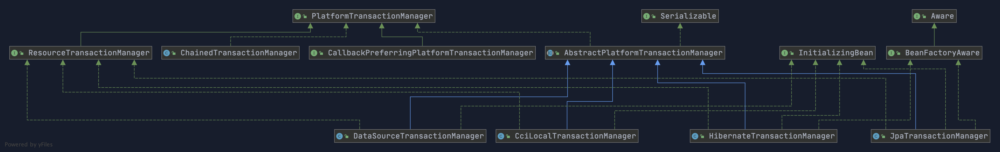
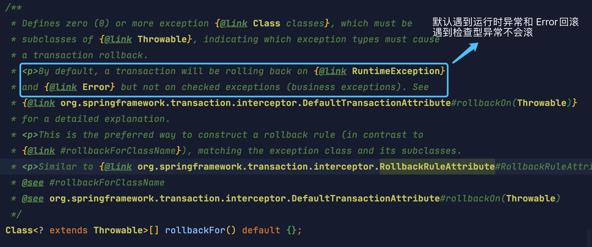

Cuối cùng bài tổng hợp phân tích về **Spring transaction** mà tôi đã hứa với độc giả một thời gian trước cũng đã có. Phần nội dung này khá quan trọng, dù là trong công việc hay phỏng vấn, nhưng tài liệu tham khảo tốt trên mạng lại tương đối ít.

## Transaction là gì?

**Transaction là một nhóm các thao tác logic, hoặc tất cả cùng thực thi, hoặc không thao tác nào được thực thi.**

Tin rằng mọi người hẳn đều đã có thể học thuộc câu này, dưới đây tôi sẽ kết hợp với việc phát triển thực tế hằng ngày để trao đổi.

Mỗi business method trong hệ thống của chúng ta có thể bao gồm nhiều thao tác database mang tính atomic, chẳng hạn method `savePerson()` bên dưới có hai thao tác database atomic. Các thao tác database atomic này có quan hệ phụ thuộc, hoặc tất cả cùng thực thi, hoặc không thao tác nào được thực thi.

```java
  public void savePerson() {
    personDao.save(person);
    personDetailDao.save(personDetail);
  }
```

Ngoài ra, cần đặc biệt chú ý: **transaction có thể có hiệu lực hay không phụ thuộc then chốt vào việc database engine có hỗ trợ transaction hay không. Chẳng hạn, database MySQL thường dùng engine `innodb` hỗ trợ transaction theo mặc định. Tuy nhiên, nếu đổi database engine thành `myisam`, chương trình cũng sẽ không còn hỗ trợ transaction nữa!**

Ví dụ kinh điển nhất và cũng thường được nhắc đến về transaction là chuyển khoản. Giả sử Tiểu Minh muốn chuyển 1000 đồng cho Tiểu Hồng, việc chuyển khoản này liên quan đến hai thao tác then chốt:

> 1. Giảm số dư của Tiểu Minh 1000 đồng.
> 2. Tăng số dư của Tiểu Hồng 1000 đồng.

Nếu giữa hai thao tác này đột nhiên xảy ra lỗi, chẳng hạn hệ thống ngân hàng sập hoặc mạng gặp sự cố, khiến số dư của Tiểu Minh giảm nhưng số dư của Tiểu Hồng không tăng thì sẽ không đúng. Transaction đảm bảo hai thao tác then chốt này hoặc cùng thành công, hoặc cùng thất bại.


```java
public class OrdersService {
  private AccountDao accountDao;

  public void setOrdersDao(AccountDao accountDao) {
    this.accountDao = accountDao;
  }

  @Transactional(propagation = Propagation.REQUIRED,
                isolation = Isolation.DEFAULT, readOnly = false, timeout = -1)
  public void accountMoney() {
    // Tài khoản Tiểu Hồng tăng 1000
    accountDao.addMoney(1000,xiaohong);
    // Mô phỏng exception đột ngột, chẳng hạn mất điện đột ngột ở ngân hàng
    // Nếu không cấu hình transaction thì tài khoản Tiểu Hồng sẽ tăng 1000 còn tài khoản Tiểu Minh không giảm tiền
    int i = 10 / 0;
    // Tài khoản Tiểu Vương giảm 1000
    accountDao.reduceMoney(1000,xiaoming);
  }
}
```

Ngoài ra, bốn đặc tính lớn ACID của database transaction là nền tảng của transaction, hãy cùng tìm hiểu sơ lược dưới đây.

## Bạn có biết các đặc tính của transaction (ACID) không?

1. **Tính atomic** (`Atomicity`): transaction là đơn vị thực thi nhỏ nhất, không được phép phân chia. Tính atomic của transaction đảm bảo thao tác hoặc hoàn tất toàn bộ, hoặc hoàn toàn không có tác dụng;
2. **Tính consistency** (`Consistency`): dữ liệu nhất quán trước và sau khi thực thi transaction. Ví dụ trong nghiệp vụ chuyển khoản, dù transaction thành công hay thất bại, tổng số tiền của người chuyển và người nhận phải không đổi;
3. **Tính isolation** (`Isolation`): khi truy cập database đồng thời, transaction của một user không bị các transaction khác can thiệp, database giữa các transaction đồng thời là độc lập;
4. **Tính durability** (`Durability`): sau khi một transaction được commit, thay đổi của nó đối với dữ liệu trong database là bền vững, ngay cả khi database gặp sự cố cũng không được gây ảnh hưởng đến thay đổi đó.

🌈 Ở đây cần bổ sung thêm một điểm: \*\*chỉ sau khi đảm bảo durability, atomicity và isolation của transaction thì consistency mới được đảm bảo. Nói cách khác, A, I, D là phương tiện, còn C là mục tiêu! Có lẽ mọi người cũng giống tôi, đã bị khái niệm ACID làm hiểu lầm trong thời gian dài! Tôi chỉ làm rõ điều này sau khi xem khóa học công khai ["Khóa học software architecture của Chu Chí Minh"](https://time.geekbang.org/opencourse/intro/100064201) (hãy đọc thêm nhiều sách hay!!!).


Ngoài ra, tác giả của DDIA, tức ["Designing Data-Intensive Application (Thiết kế hệ thống ứng dụng hướng dữ liệu)"](https://book.douban.com/subject/30329536/), cũng nói như sau trong cuốn sách này:

> Atomicity, isolation, and durability are properties of the database, whereas consis‐ tency (in the ACID sense) is a property of the application. The application may rely on the database’s atomicity and isolation properties in order to achieve consistency, but it’s not up to the database alone.
>
> Ý nghĩa của bản dịch là: atomicity, isolation và durability là các thuộc tính của database, còn consistency (theo nghĩa ACID) là thuộc tính của application. Application có thể dựa vào các thuộc tính atomicity và isolation của database để đạt được consistency, nhưng điều này không chỉ phụ thuộc vào database. Vì vậy, chữ C không thuộc về ACID.

Cuốn ["Designing Data-Intensive Application (Thiết kế hệ thống ứng dụng hướng dữ liệu)"](https://book.douban.com/subject/30329536/) này rất đáng đọc, nên đọc nhiều lần! Gần 90% người dùng trên Douban đã đánh giá năm sao sau khi đọc cuốn sách này. Ngoài ra, bản dịch tiếng Trung đã được open source trên GitHub, địa chỉ: [https://github.com/Vonng/ddia](https://github.com/Vonng/ddia).

## Tìm hiểu chi tiết về hỗ trợ transaction của Spring

> ⚠️ Nhắc lại một lần nữa: chương trình của bạn có hỗ trợ transaction hay không trước hết phụ thuộc vào database. Ví dụ nếu dùng MySQL, nếu chọn engine innodb thì xin chúc mừng, bạn có thể hỗ trợ transaction. Tuy nhiên, nếu database MySQL dùng engine myisam thì rất tiếc, bản chất nó đã không hỗ trợ transaction.

Ở đây nói thêm một kiến thức rất quan trọng: **MySQL đảm bảo tính atomic bằng cách nào?**

Chúng ta biết rằng muốn đảm bảo tính atomic của transaction thì khi xảy ra exception cần **rollback** các thao tác đã thực thi. Trong MySQL, cơ chế khôi phục được thực hiện thông qua **undo log**. Mọi thay đổi do transaction thực hiện đều được ghi vào undo log trước, sau đó mới thực hiện các thao tác liên quan. Nếu gặp exception trong quá trình thực thi, ta chỉ cần dùng thông tin trong **undo log** để rollback dữ liệu về trạng thái trước khi thay đổi! Ngoài ra, undo log được persist xuống disk trước dữ liệu. Nhờ vậy, ngay cả khi database đột nhiên sập, khi user khởi động database lại, database vẫn có thể truy vấn undo log để rollback các transaction chưa hoàn tất trước đó.

### Spring hỗ trợ hai cách quản lý transaction

#### Quản lý transaction bằng programmatic transaction

Quản lý transaction thủ công thông qua `TransactionTemplate` hoặc `TransactionManager`, trong ứng dụng thực tế ít được sử dụng, nhưng có ích cho việc hiểu nguyên lý quản lý transaction của Spring.

Ví dụ code quản lý transaction bằng programmatic transaction với `TransactionTemplate` như sau:

```java
@Autowired
private TransactionTemplate transactionTemplate;
public void testTransaction() {

        transactionTemplate.execute(new TransactionCallbackWithoutResult() {
            @Override
            protected void doInTransactionWithoutResult(TransactionStatus transactionStatus) {

                try {

                    // ....  Code nghiệp vụ
                } catch (Exception e){
                    // Rollback
                    transactionStatus.setRollbackOnly();
                }

            }
        });
}
```

Ví dụ code quản lý transaction bằng programmatic transaction với `TransactionManager` như sau:

```java
@Autowired
private PlatformTransactionManager transactionManager;

public void testTransaction() {

  TransactionStatus status = transactionManager.getTransaction(new DefaultTransactionDefinition());
          try {
               // ....  Code nghiệp vụ
              transactionManager.commit(status);
          } catch (Exception e) {
              transactionManager.rollback(status);
          }
}
```

#### Quản lý transaction bằng declarative transaction

Được khuyến nghị sử dụng (mức độ xâm lấn vào code nhỏ nhất), thực tế được triển khai thông qua AOP (cách dùng toàn bộ annotation dựa trên `@Transactional` là phổ biến nhất).

Ví dụ code quản lý transaction bằng annotation `@Transactional` như sau:

```java
@Transactional(propagation = Propagation.REQUIRED)
public void aMethod() {
  //do something
  B b = new B();
  C c = new C();
  b.bMethod();
  c.cMethod();
}
```

### Giới thiệu các interface quản lý transaction của Spring

Trong framework Spring, ba interface quan trọng nhất liên quan đến quản lý transaction như sau:

- **`PlatformTransactionManager`**: transaction manager (nền tảng), core của chiến lược transaction trong Spring.
- **`TransactionDefinition`**: thông tin định nghĩa transaction (isolation level, propagation behavior, timeout, read-only, v.v.).
- **`TransactionStatus`**: trạng thái đang chạy của transaction.

Ta có thể xem interface **`PlatformTransactionManager`** là bên quản lý cấp cao của transaction, còn hai interface **`TransactionDefinition`** và **`TransactionStatus`** có thể xem là phần mô tả transaction.

**`PlatformTransactionManager`** sẽ quản lý transaction dựa trên định nghĩa của **`TransactionDefinition`**, chẳng hạn timeout, isolation level, propagation behavior, v.v.; còn interface **`TransactionStatus`** cung cấp một số method để lấy trạng thái tương ứng của transaction, chẳng hạn có phải transaction mới hay không, có thể rollback hay không, v.v.

#### PlatformTransactionManager: interface quản lý transaction

**Spring không trực tiếp quản lý transaction mà cung cấp nhiều transaction manager**. Interface của transaction manager Spring là: **`PlatformTransactionManager`**.

Thông qua interface này, Spring cung cấp transaction manager tương ứng cho các platform như JDBC (`DataSourceTransactionManager`), Hibernate (`HibernateTransactionManager`), JPA (`JpaTransactionManager`), v.v.; còn implementation cụ thể là việc của từng platform.

**Implementation cụ thể của interface `PlatformTransactionManager` như sau:**



Interface `PlatformTransactionManager` định nghĩa ba method:

```java
package org.springframework.transaction;

import org.springframework.lang.Nullable;

public interface PlatformTransactionManager {
    // Lấy transaction
    TransactionStatus getTransaction(@Nullable TransactionDefinition var1) throws TransactionException;
    // Commit transaction
    void commit(TransactionStatus var1) throws TransactionException;
    // Rollback transaction
    void rollback(TransactionStatus var1) throws TransactionException;
}

```

**Nói thêm một chút. Tại sao phải định nghĩa, hay nói cách khác là abstract hóa interface `PlatformTransactionManager`?**

Chủ yếu là vì cần abstract hóa hành vi quản lý transaction, sau đó để các platform khác nhau triển khai nó. Nhờ vậy ta có thể đảm bảo hành vi cung cấp cho bên ngoài không thay đổi, thuận tiện mở rộng.

Một thời gian trước tôi từng chia sẻ trên [Knowledge Planet](https://javaguide.cn/about-the-author/zhishixingqiu-two-years.html) của mình: **"Tại sao chúng ta cần dùng interface?"**.

> Cuốn "Design Patterns" (cuốn của GOF) từ nhiều năm trước đã đề cập rằng nên lập trình dựa trên interface thay vì implementation, nhưng bạn có thực sự biết tại sao phải lập trình dựa trên interface không?
>
> Nhìn vào source code của các framework và project open source, interface là một thành phần quan trọng không thể thiếu. Muốn hiểu tại sao cần dùng interface, trước hết phải hiểu interface cung cấp chức năng gì. Ta có thể hiểu interface là một quy ước cung cấp danh sách một loạt chức năng. Bản thân interface không cung cấp chức năng mà chỉ định nghĩa hành vi. Nhưng ai muốn sử dụng thì trước tiên phải implement nó, tuân thủ quy ước của nó, sau đó tự mình triển khai các chức năng mà nó định nghĩa cần được triển khai.
>
> Lấy một ví dụ, project trước đây của tôi có nhu cầu gửi SMS, vì vậy chúng tôi định nghĩa một interface, interface này chỉ có hai method:
>
> 1. Gửi SMS. 2. Xử lý kết quả gửi.
>
> Ban đầu chúng tôi dùng dịch vụ SMS của Alibaba Cloud, sau đó implement interface này để hoàn thành một service SMS của Alibaba Cloud. Về sau, chúng tôi đột nhiên đổi sang platform SMS khác, lúc này chỉ cần implement lại interface là được. Nhờ vậy, hành vi cung cấp cho bên ngoài không thay đổi. Hầu như không cần sửa code, chúng tôi đã dễ dàng hoàn thành việc chuyển đổi yêu cầu, nâng cao tính linh hoạt và khả năng mở rộng của code.
>
> Khi nào dùng interface? Khi module chức năng bạn muốn triển khai cần abstract hóa hành vi, chẳng hạn service gửi SMS, service lưu trữ image hosting, v.v.

#### TransactionDefinition: thuộc tính transaction

Transaction manager interface **`PlatformTransactionManager`** lấy một transaction thông qua method **`getTransaction(TransactionDefinition definition)`**. Tham số trong method này là class **`TransactionDefinition`**, class này định nghĩa một số thuộc tính transaction cơ bản.

**Thuộc tính transaction là gì?** Có thể hiểu thuộc tính transaction là một số cấu hình cơ bản của transaction, mô tả cách áp dụng chiến lược transaction vào method.

`TransactionDefinition` chủ yếu bao gồm bốn phương diện cấu hình transaction sau:

- Isolation level
- Propagation behavior
- Có read-only hay không
- Transaction timeout

Ngoài ra, method `getName()` có thể trả về tên transaction. Quy tắc rollback không thuộc bản thân `TransactionDefinition`; `TransactionAttribute` được dùng bởi declarative transaction của Spring kế thừa `TransactionDefinition` và bổ sung thêm các khả năng như quy tắc rollback.

```java
package org.springframework.transaction;

import org.springframework.lang.Nullable;

public interface TransactionDefinition {
    int PROPAGATION_REQUIRED = 0;
    int PROPAGATION_SUPPORTS = 1;
    int PROPAGATION_MANDATORY = 2;
    int PROPAGATION_REQUIRES_NEW = 3;
    int PROPAGATION_NOT_SUPPORTED = 4;
    int PROPAGATION_NEVER = 5;
    int PROPAGATION_NESTED = 6;
    int ISOLATION_DEFAULT = -1;
    int ISOLATION_READ_UNCOMMITTED = 1;
    int ISOLATION_READ_COMMITTED = 2;
    int ISOLATION_REPEATABLE_READ = 4;
    int ISOLATION_SERIALIZABLE = 8;
    int TIMEOUT_DEFAULT = -1;
    // Trả về propagation behavior của transaction, giá trị mặc định là REQUIRED.
    int getPropagationBehavior();
    // Trả về isolation level của transaction, giá trị mặc định là DEFAULT.
    int getIsolationLevel();
    // Trả về timeout của transaction, giá trị mặc định là -1. Nếu vượt quá giới hạn thời gian này mà transaction vẫn chưa hoàn tất thì transaction sẽ tự động rollback.
    int getTimeout();
    // Trả về transaction có phải read-only hay không, giá trị mặc định là false.
    boolean isReadOnly();

    @Nullable
    String getName();
}
```

#### TransactionStatus: trạng thái transaction

Interface `TransactionStatus` dùng để ghi lại trạng thái transaction. Interface này định nghĩa một nhóm method để lấy hoặc xác định thông tin trạng thái tương ứng của transaction.

Method `PlatformTransactionManager.getTransaction(…)` trả về một object `TransactionStatus`.

**Nội dung interface TransactionStatus như sau:**

```java
public interface TransactionStatus{
    boolean isNewTransaction(); // Có phải transaction mới hay không
    boolean hasSavepoint(); // Có savepoint hay không
    void setRollbackOnly();  // Đặt chỉ rollback
    boolean isRollbackOnly(); // Có phải chỉ rollback hay không
    boolean isCompleted(); // Đã hoàn tất hay chưa
}
```

### Giải thích chi tiết thuộc tính transaction

Trong phát triển nghiệp vụ thực tế, mọi người thường dùng annotation `@Transactional` để bật transaction, nhưng nhiều người không hiểu rõ các tham số trong annotation này có ý nghĩa và tác dụng gì. Để sử dụng quản lý transaction tốt hơn trong project, rất khuyến nghị bạn đọc kỹ nội dung dưới đây.

#### Propagation behavior

**Propagation behavior được dùng để giải quyết vấn đề transaction khi các method ở business layer gọi lẫn nhau.**

Khi một transaction method được một transaction method khác gọi, phải chỉ định transaction sẽ propagation như thế nào. Ví dụ: method có thể tiếp tục chạy trong transaction hiện có hoặc mở một transaction mới và chạy trong transaction riêng của nó.

Lấy một ví dụ: trong method `aMethod()` của class A, ta gọi method `bMethod()` của class B. Lúc này phát sinh vấn đề transaction khi các method ở business layer gọi lẫn nhau. Nếu `bMethod()` xảy ra exception và cần rollback, phải cấu hình propagation behavior thế nào để `aMethod()` cũng rollback theo? Lúc này cần đến kiến thức về propagation behavior, nếu chưa biết thì nhất định hãy đọc kỹ.

Các đoạn code về propagation behavior dưới đây đều lược bỏ import và một phần chi tiết implementation. Trong đó `Propagation.xxx` là placeholder cần thay thế, không phải class hoàn chỉnh có thể compile trực tiếp.

```java
@Service
class A {
    @Autowired
    B b;
    @Transactional(propagation = Propagation.xxx)
    public void aMethod() {
        //do something
        b.bMethod();
    }
}

@Service
class B {
    @Transactional(propagation = Propagation.xxx)
    public void bMethod() {
       //do something
    }
}
```

Trong định nghĩa `TransactionDefinition` có các constant biểu thị propagation behavior sau:

```java
public interface TransactionDefinition {
    int PROPAGATION_REQUIRED = 0;
    int PROPAGATION_SUPPORTS = 1;
    int PROPAGATION_MANDATORY = 2;
    int PROPAGATION_REQUIRES_NEW = 3;
    int PROPAGATION_NOT_SUPPORTED = 4;
    int PROPAGATION_NEVER = 5;
    int PROPAGATION_NESTED = 6;
    ......
}
```

Tuy nhiên, để thuận tiện sử dụng, Spring tương ứng định nghĩa một enum class: `Propagation`

```java
package org.springframework.transaction.annotation;

import org.springframework.transaction.TransactionDefinition;

public enum Propagation {

    REQUIRED(TransactionDefinition.PROPAGATION_REQUIRED),

    SUPPORTS(TransactionDefinition.PROPAGATION_SUPPORTS),

    MANDATORY(TransactionDefinition.PROPAGATION_MANDATORY),

    REQUIRES_NEW(TransactionDefinition.PROPAGATION_REQUIRES_NEW),

    NOT_SUPPORTED(TransactionDefinition.PROPAGATION_NOT_SUPPORTED),

    NEVER(TransactionDefinition.PROPAGATION_NEVER),

    NESTED(TransactionDefinition.PROPAGATION_NESTED);

    private final int value;

    Propagation(int value) {
        this.value = value;
    }

    public int value() {
        return this.value;
    }

}

```

**Các giá trị có thể có của propagation behavior đúng như sau:**

**1. `TransactionDefinition.PROPAGATION_REQUIRED`**

Đây là propagation behavior được dùng nhiều nhất. Annotation `@Transactional` mà chúng ta thường dùng cũng mặc định sử dụng propagation behavior này. Nếu hiện tại có transaction thì tham gia transaction đó; nếu hiện tại chưa có transaction thì tạo một transaction mới. Cụ thể:

- Nếu method bên ngoài chưa mở transaction, method bên trong được đánh dấu `Propagation.REQUIRED` sẽ mở transaction riêng, các transaction được mở độc lập và không ảnh hưởng lẫn nhau.
- Nếu method bên ngoài đã mở transaction và được đánh dấu `Propagation.REQUIRED`, mọi method bên trong được đánh dấu `Propagation.REQUIRED` và method bên ngoài đều thuộc cùng một transaction; chỉ cần một method rollback thì toàn bộ transaction đều rollback.

Ví dụ, nếu `aMethod()` và `bMethod()` ở trên đều sử dụng propagation behavior `PROPAGATION_REQUIRED`, chúng sẽ dùng cùng một transaction; chỉ cần một method rollback thì toàn bộ transaction đều rollback.

```java
@Service
class A {
    @Autowired
    B b;
    @Transactional(propagation = Propagation.REQUIRED)
    public void aMethod() {
        //do something
        b.bMethod();
    }
}
@Service
class B {
    @Transactional(propagation = Propagation.REQUIRED)
    public void bMethod() {
       //do something
    }
}
```

**2. `TransactionDefinition.PROPAGATION_REQUIRES_NEW`**

Tạo một transaction mới. Nếu hiện tại đã có transaction thì suspend transaction hiện tại. Nghĩa là dù method bên ngoài có mở transaction hay không, method bên trong được đánh dấu `Propagation.REQUIRES_NEW` đều sẽ mở transaction riêng, các transaction được mở độc lập và không ảnh hưởng lẫn nhau.

Ví dụ, nếu `bMethod()` ở trên được đánh dấu bằng propagation behavior `PROPAGATION_REQUIRES_NEW`, còn `aMethod` vẫn được đánh dấu bằng `PROPAGATION_REQUIRED`, nếu `aMethod()` xảy ra exception và rollback thì `bMethod()` sẽ không rollback theo vì `bMethod()` đã mở transaction độc lập. Tuy nhiên, nếu `bMethod()` throw exception chưa được bắt và exception này thỏa mãn quy tắc rollback của transaction thì `aMethod()` cũng sẽ rollback vì exception này đã bị cơ chế quản lý transaction của `aMethod()` phát hiện.

```java
@Service
class A {
    @Autowired
    B b;
    @Transactional(propagation = Propagation.REQUIRED)
    public void aMethod() {
        //do something
        b.bMethod();
    }
}
@Service
class B {
    @Transactional(propagation = Propagation.REQUIRES_NEW)
    public void bMethod() {
       //do something
    }
}
```

**3. `TransactionDefinition.PROPAGATION_NESTED`:**

Nếu hiện tại đã có transaction thì tạo một transaction làm nested transaction của transaction hiện tại để thực thi; nếu hiện tại chưa có transaction thì thực hiện tương tự `TransactionDefinition.PROPAGATION_REQUIRED`. Cụ thể:

- Khi method bên ngoài đã mở transaction, mở một transaction mới bên trong và để nó tồn tại dưới dạng nested transaction.
- Nếu method bên ngoài không có transaction, mở riêng một transaction, tương tự `PROPAGATION_REQUIRED`.

Nested transaction được biểu thị dưới dạng quan hệ parent-child. Ý tưởng cốt lõi là child transaction sẽ không commit độc lập mà phụ thuộc vào parent transaction và chạy trong parent transaction; khi parent transaction commit, child transaction cũng commit theo; đương nhiên, khi parent transaction rollback thì child transaction cũng rollback.

> Điểm khác với `TransactionDefinition.PROPAGATION_REQUIRES_NEW`: `PROPAGATION_REQUIRES_NEW` là transaction độc lập, không phụ thuộc vào transaction bên ngoài, được biểu thị dưới dạng quan hệ ngang hàng, thực thi xong sẽ commit ngay và không liên quan đến transaction bên ngoài.

Child transaction cũng có đặc tính riêng: có thể rollback độc lập mà không làm parent transaction rollback, nhưng điều kiện tiên quyết là phải xử lý exception của child transaction để tránh exception bị parent transaction nhận biết và khiến transaction bên ngoài rollback.

Ví dụ:

- Nếu `aMethod()` rollback thì `bMethod()` với vai trò nested transaction cũng rollback.
- Nếu `bMethod()` rollback thì `aMethod()` có rollback hay không phụ thuộc vào việc exception của `bMethod()` có được xử lý hay không:

  - Exception của `bMethod()` không được xử lý, tức bên trong `bMethod()` không xử lý exception, đồng thời `aMethod()` cũng không xử lý exception, thì `aMethod()` sẽ nhận biết exception và khiến toàn bộ rollback.

    ```java
    @Service
    class A {
        @Autowired
        B b;
        @Transactional(propagation = Propagation.REQUIRED)
        public void aMethod (){
            //do something
            b.bMethod();
        }
    }

    @Service
    class B {
        @Transactional(propagation = Propagation.NESTED)
        public void bMethod (){
           //do something and throw an exception
        }
    }
    ```

  - `bMethod()` xử lý exception hoặc `aMethod()` xử lý exception thì `aMethod()` sẽ không rollback.

    ```java
    @Service
    class A {
        @Autowired
        B b;
        @Transactional(propagation = Propagation.REQUIRED)
        public void aMethod (){
            //do something
            try {
                b.bMethod();
            } catch (Exception e) {
                System.out.println("Method rollback");
            }
        }
    }

    @Service
    class B {
        @Transactional(propagation = Propagation.NESTED)
        public void bMethod() {
           //do something and throw an exception
        }
    }
    ```

**4. `TransactionDefinition.PROPAGATION_MANDATORY`**

Nếu hiện tại đã có transaction thì tham gia transaction đó; nếu hiện tại chưa có transaction thì throw exception (mandatory: bắt buộc).

Propagation behavior này ít được sử dụng nên không đưa ví dụ.

**Ba propagation behavior dưới đây xử lý transaction hiện tại theo cách khác nhau, không thể hiểu theo cùng một quy tắc rollback.**

- **`TransactionDefinition.PROPAGATION_SUPPORTS`**: nếu hiện tại có transaction thì tham gia transaction đó, các thao tác bên trong sẽ tham gia commit hoặc rollback của transaction; nếu hiện tại không có transaction thì chạy theo cách không có transaction.
- **`TransactionDefinition.PROPAGATION_NOT_SUPPORTED`**: luôn chạy theo cách không có transaction; nếu hiện tại có transaction thì trước tiên suspend transaction đó. Vì vậy, các thao tác thực thi trong propagation boundary này không chịu sự kiểm soát rollback của transaction bên ngoài đang bị suspend.
- **`TransactionDefinition.PROPAGATION_NEVER`**: chỉ cho phép chạy theo cách không có transaction; nếu phát hiện hiện tại có transaction thì trực tiếp throw exception.

Để biết thêm về propagation behavior, hãy xem bài viết này: ["Khó quá ~ interviewer yêu cầu tôi kết hợp case để nói về cách hiểu của mình đối với propagation behavior của Spring."](https://mp.weixin.qq.com/s?__biz=Mzg2OTA0Njk0OA==&mid=2247486668&idx=2&sn=0381e8c836442f46bdc5367170234abb&chksm=cea24307f9d5ca11c96943b3ccfa1fc70dc97dd87d9c540388581f8fe6d805ff548dff5f6b5b&token=1776990505&lang=zh_CN#rd)

#### Isolation level của transaction

Interface `TransactionDefinition` định nghĩa năm constant biểu thị isolation level:

```java
public interface TransactionDefinition {
    ......
    int ISOLATION_DEFAULT = -1;
    int ISOLATION_READ_UNCOMMITTED = 1;
    int ISOLATION_READ_COMMITTED = 2;
    int ISOLATION_REPEATABLE_READ = 4;
    int ISOLATION_SERIALIZABLE = 8;
    ......
}
```

Tương tự phần propagation behavior, để thuận tiện sử dụng, Spring cũng định nghĩa một enum class tương ứng: `Isolation`

```java
public enum Isolation {

  DEFAULT(TransactionDefinition.ISOLATION_DEFAULT),

  READ_UNCOMMITTED(TransactionDefinition.ISOLATION_READ_UNCOMMITTED),

  READ_COMMITTED(TransactionDefinition.ISOLATION_READ_COMMITTED),

  REPEATABLE_READ(TransactionDefinition.ISOLATION_REPEATABLE_READ),

  SERIALIZABLE(TransactionDefinition.ISOLATION_SERIALIZABLE);

  private final int value;

  Isolation(int value) {
    this.value = value;
  }

  public int value() {
    return this.value;
  }

}
```

Dưới đây tôi lần lượt giới thiệu từng isolation level của transaction:

- **`TransactionDefinition.ISOLATION_DEFAULT`**: dùng isolation level mặc định của database backend. MySQL mặc định dùng isolation level `REPEATABLE_READ`, còn Oracle mặc định dùng isolation level `READ_COMMITTED`.
- **`TransactionDefinition.ISOLATION_READ_UNCOMMITTED`**: isolation level thấp nhất, ít được sử dụng vì cho phép đọc thay đổi dữ liệu chưa commit, **có thể dẫn đến dirty read, phantom read hoặc non-repeatable read**.
- **`TransactionDefinition.ISOLATION_READ_COMMITTED`**: cho phép đọc dữ liệu đã commit của transaction đồng thời, **có thể ngăn dirty read, nhưng phantom read hoặc non-repeatable read vẫn có thể xảy ra**.
- **`TransactionDefinition.ISOLATION_REPEATABLE_READ`**: kết quả nhiều lần đọc cùng một field là nhất quán, trừ khi dữ liệu bị chính transaction đó sửa đổi, **có thể ngăn dirty read và non-repeatable read, nhưng phantom read vẫn có thể xảy ra**.
- **`TransactionDefinition.ISOLATION_SERIALIZABLE`**: isolation level cao nhất, tuân thủ hoàn toàn isolation level của ACID. Mọi transaction lần lượt thực thi từng cái một, vì vậy hoàn toàn không thể phát sinh can thiệp giữa các transaction; nói cách khác, **level này có thể ngăn dirty read, non-repeatable read và phantom read**. Tuy nhiên, điều này sẽ ảnh hưởng nghiêm trọng đến performance của chương trình. Thông thường cũng không dùng level này.

Đọc thêm: [Giải thích chi tiết về isolation level của MySQL](https://javaguide.cn/database/mysql/transaction-isolation-level.html).

#### Thuộc tính transaction timeout

Transaction timeout là thời gian tối đa mà một transaction được phép thực thi. Nếu vượt quá giới hạn thời gian này mà transaction vẫn chưa hoàn tất thì transaction sẽ tự động rollback. Trong `TransactionDefinition`, timeout được biểu thị bằng giá trị `int`, đơn vị là giây, giá trị mặc định là -1, nghĩa là timeout của transaction phụ thuộc vào hệ thống transaction tầng dưới hoặc không có timeout.

#### Thuộc tính transaction read-only

```java
package org.springframework.transaction;

import org.springframework.lang.Nullable;

public interface TransactionDefinition {
    ......
    // Trả về transaction có phải read-only hay không, giá trị mặc định là false.
    boolean isReadOnly();

}
```

Với transaction chỉ thực hiện truy vấn đọc dữ liệu, có thể chỉ định loại transaction là `readonly`, tức read-only transaction. Read-only transaction không sửa đổi dữ liệu, database sẽ cung cấp một số cách tối ưu, phù hợp dùng trong method có nhiều thao tác query database.

Nhiều người sẽ thắc mắc, tại sao một thao tác query dữ liệu cũng cần bật hỗ trợ transaction?

Lấy `innodb` của MySQL làm ví dụ, theo mô tả trên tài liệu chính thức [https://dev.mysql.com/doc/refman/5.7/en/innodb-autocommit-commit-rollback.html](https://dev.mysql.com/doc/refman/5.7/en/innodb-autocommit-commit-rollback.html):

> Theo mặc định, MySQL bật chế độ `autocommit` cho mỗi connection mới được tạo. Ở chế độ này, mỗi câu lệnh `sql` gửi đến MySQL server sẽ được xử lý trong một transaction riêng, transaction tự động commit sau khi thực thi xong, sau đó mở một transaction mới.

Tuy nhiên, nếu thêm annotation `@Transactional` vào method thì toàn bộ SQL mà method thực thi sẽ được đặt trong một transaction. Sau khi khai báo read-only transaction, Spring sẽ truyền read-only hint cho hệ thống transaction tầng dưới; việc có tối ưu hay không và tối ưu như thế nào phụ thuộc vào database, driver và transaction manager, đồng thời cũng không đảm bảo thao tác write chắc chắn thất bại.

Nếu không thêm `Transactional`, mỗi `sql` sẽ mở một transaction riêng. Nếu dữ liệu bị transaction khác sửa ở giữa thì sẽ đọc được giá trị mới nhất theo thời gian thực.

Chia sẻ một số lời giải đáp của người khác về thuộc tính read-only của transaction:

- Nếu mỗi lần chỉ thực thi một câu query thì không cần bật hỗ trợ transaction; database mặc định hỗ trợ read consistency trong thời gian SQL thực thi;
- Nếu mỗi lần thực thi nhiều câu query, chẳng hạn query thống kê hoặc query báo cáo, trong tình huống này nhiều câu SQL query phải đảm bảo read consistency tổng thể. Nếu giữa câu SQL trước và câu SQL sau, dữ liệu bị user khác thay đổi thì query thống kê tổng thể đó sẽ xuất hiện trạng thái dữ liệu đọc không nhất quán; lúc này nên bật hỗ trợ transaction.

#### Quy tắc rollback transaction

Các quy tắc này định nghĩa exception nào sẽ khiến transaction rollback và exception nào thì không. Theo mặc định, transaction chỉ rollback khi gặp runtime exception (subclass của `RuntimeException`); `Error` cũng khiến transaction rollback, nhưng khi gặp checked exception thì sẽ không rollback.



Nếu muốn rollback một loại exception cụ thể do bạn định nghĩa thì có thể viết như sau:

```java
@Transactional(rollbackFor= MyException.class)
```

### Giải thích chi tiết cách sử dụng annotation @Transactional

#### Phạm vi tác dụng của `@Transactional`

1. **Method**: khuyến nghị dùng annotation trên method. Proxy class của Spring 6 mặc định cũng hỗ trợ method `protected` và package-private; proxy interface yêu cầu method là method `public` được định nghĩa trong interface. Các chế độ proxy ở version cũ thường chỉ hỗ trợ method `public`.
2. **Class**: nếu annotation được dùng trên class thì các method trong class thỏa mãn quy tắc visibility của proxy nêu trên đều áp dụng cùng transaction semantics.
3. **Interface**: không khuyến nghị dùng trên interface.

#### Các tham số cấu hình thường dùng của `@Transactional`

Source code annotation `@Transactional` như sau, trong đó bao gồm cấu hình các thuộc tính transaction cơ bản:

```java
@Target({ElementType.TYPE, ElementType.METHOD})
@Retention(RetentionPolicy.RUNTIME)
@Inherited
@Documented
public @interface Transactional {

  @AliasFor("transactionManager")
  String value() default "";

  @AliasFor("value")
  String transactionManager() default "";

  Propagation propagation() default Propagation.REQUIRED;

  Isolation isolation() default Isolation.DEFAULT;

  int timeout() default TransactionDefinition.TIMEOUT_DEFAULT;

  boolean readOnly() default false;

  Class<? extends Throwable>[] rollbackFor() default {};

  String[] rollbackForClassName() default {};

  Class<? extends Throwable>[] noRollbackFor() default {};

  String[] noRollbackForClassName() default {};

}
```

**Tổng hợp các tham số cấu hình thường dùng của `@Transactional` (chỉ liệt kê năm tham số tôi thường dùng hơn):**

| Tên thuộc tính | Mô tả                                                                                                                                                                  |
| :------------- | :--------------------------------------------------------------------------------------------------------------------------------------------------------------------- |
| propagation    | Propagation behavior của transaction, giá trị mặc định là REQUIRED, các giá trị có thể chọn đã được giới thiệu ở trên                                                  |
| isolation      | Isolation level của transaction, giá trị mặc định là DEFAULT, các giá trị có thể chọn đã được giới thiệu ở trên                                                        |
| timeout        | Transaction timeout, giá trị mặc định là -1 (không timeout). Nếu vượt quá giới hạn thời gian này mà transaction vẫn chưa hoàn tất thì transaction sẽ tự động rollback. |
| readOnly       | Chỉ định transaction có phải read-only transaction hay không, giá trị mặc định là false.                                                                               |
| rollbackFor    | Dùng để chỉ định loại exception có thể kích hoạt transaction rollback, đồng thời có thể chỉ định nhiều loại exception.                                                 |

#### Nguyên lý của annotation transaction `@Transactional`

Đây là một câu hỏi có thể được hỏi trong phỏng vấn khi nói về AOP. Hãy nói ngắn gọn!

Chúng ta biết rằng **cơ chế hoạt động của `@Transactional` được triển khai dựa trên AOP, còn AOP lại dùng dynamic proxy để triển khai. Nếu target object implement interface thì mặc định dùng JDK dynamic proxy; nếu target object không implement interface thì dùng CGLIB dynamic proxy.**

🤐 Nói thêm một chút: method `createAopProxy()` quyết định dùng JDK hay Cglib để làm dynamic proxy, source code như sau:

```java
public class DefaultAopProxyFactory implements AopProxyFactory, Serializable {

  @Override
  public AopProxy createAopProxy(AdvisedSupport config) throws AopConfigException {
    if (config.isOptimize() || config.isProxyTargetClass() || hasNoUserSuppliedProxyInterfaces(config)) {
      Class<?> targetClass = config.getTargetClass();
      if (targetClass == null) {
        throw new AopConfigException("TargetSource cannot determine target class: " +
            "Either an interface or a target is required for proxy creation.");
      }
      if (targetClass.isInterface() || Proxy.isProxyClass(targetClass)) {
        return new JdkDynamicAopProxy(config);
      }
      return new ObjenesisCglibAopProxy(config);
    }
    else {
      return new JdkDynamicAopProxy(config);
    }
  }
  .......
}
```

Nếu một class hoặc một method `public` trong class được đánh dấu annotation `@Transactional`, Spring container sẽ tạo proxy class cho nó khi khởi động. Khi gọi method `public` được đánh dấu annotation `@Transactional`, thực tế sẽ gọi method `invoke()` trong class `TransactionInterceptor`. Tác dụng của method này là mở transaction trước target method, rollback transaction nếu gặp exception trong quá trình thực thi method, rồi commit sau khi method call hoàn tất.

> Bên trong method `invoke()` của class `TransactionInterceptor` thực tế gọi method `invokeWithinTransaction()` của class `TransactionAspectSupport`. Vì Spring version mới đã rewrite rất nhiều phần này và còn sử dụng nhiều kiến thức về reactive programming, ở đây không liệt kê source code.

#### Vấn đề self-invocation trong Spring AOP

Khi một method được đánh dấu annotation `@Transactional`, Spring transaction manager chỉ có hiệu lực khi method đó được method của class khác gọi, chứ không có hiệu lực khi được gọi từ một method trong cùng class.

Điều này do nguyên lý hoạt động của Spring AOP quyết định. Vì Spring AOP sử dụng dynamic proxy để triển khai quản lý transaction, nó sẽ tạo proxy object cho method có annotation `@Transactional` trong runtime, rồi áp dụng logic transaction trước và sau khi method được gọi. Nếu method đó được class khác gọi, proxy object của chúng ta sẽ intercept method call và xử lý transaction. Nhưng khi được gọi nội bộ từ method khác trong cùng class, proxy object không thể intercept internal call này, vì vậy transaction sẽ mất hiệu lực.

`method1()` trong class `MyService` gọi `method2()` sẽ khiến transaction của `method2()` mất hiệu lực.

```java
@Service
public class MyService {

private void method1() {
     method2();
     //......
}
@Transactional
 public void method2() {
     //......
  }
}
```

Cách giải quyết là tránh self-invocation trong cùng class hoặc dùng AspectJ thay cho Spring AOP proxy.

[issue #2091](https://github.com/Snailclimb/JavaGuide/issues/2091) bổ sung một ví dụ:

```java
@Service
public class MyService {

private void method1() {
     // Cần cấu hình @EnableAspectJAutoProxy(exposeProxy = true) trước
     ((MyService) AopContext.currentProxy()).method2();
     //......
}
@Transactional
 public void method2() {
     //......
  }
}
```

Code trên chỉ có thể lấy current proxy object thông qua `AopContext.currentProxy()` sau khi bật `exposeProxy` (ví dụ cấu hình `@EnableAspectJAutoProxy(exposeProxy = true)`). Cách gọi `method2()` này sẽ đi qua proxy nên annotation transaction mới có hiệu lực. Vì cách viết này khiến business code phụ thuộc vào AOP context, thông thường nên tách trách nhiệm của class để tránh self-invocation.

#### Tổng hợp các lưu ý khi sử dụng `@Transactional`

- Giới hạn visibility của method có `@Transactional` phụ thuộc vào loại proxy và version Spring: proxy class của Spring 6 mặc định hỗ trợ method `public`, `protected` và package-private; proxy interface yêu cầu method là method `public` được định nghĩa trong interface; chế độ proxy ở version cũ thường chỉ hỗ trợ method `public`;
- Tránh gọi method có annotation `@Transactional` trong cùng một class, vì điều này sẽ khiến transaction mất hiệu lực;
- Thiết lập đúng thuộc tính `rollbackFor` và `propagation` của `@Transactional`, nếu không transaction có thể rollback thất bại;
- Class chứa method được đánh dấu annotation `@Transactional` phải do Spring quản lý, nếu không annotation sẽ không có hiệu lực;
- Database được sử dụng ở tầng dưới phải hỗ trợ cơ chế transaction, nếu không sẽ không có hiệu lực;
- ………

## Tham khảo

- [Tổng hợp] Tham số của quản lý transaction Spring @Transactional: [http://www.mobabel.net/spring 事务管理中 transactional 的参数/](http://www.mobabel.net/spring事务管理中transactional的参数/)
- Tài liệu chính thức của Spring: [https://docs.spring.io/spring/docs/4.2.x/spring-framework-reference/html/transaction.html](https://docs.spring.io/spring/docs/4.2.x/spring-framework-reference/html/transaction.html)
- 《Lập trình nâng cao Spring5》
- Nắm vững cách sử dụng @transactional trong Spring: [https://www.ibm.com/developerworks/cn/java/j-master-spring-transactional-use/index.html](https://www.ibm.com/developerworks/cn/java/j-master-spring-transactional-use/index.html)
- Đặc tính propagation của transaction Spring: [https://github.com/love-somnus/Spring/wiki/Spring 事务的传播特性](https://github.com/love-somnus/Spring/wiki/Spring事务的传播特性)
- [Giải thích chi tiết propagation behavior của Spring transaction](https://segmentfault.com/a/1190000013341344): [https://segmentfault.com/a/1190000013341344](https://segmentfault.com/a/1190000013341344)
- Phân tích toàn diện về quản lý programmatic transaction và declarative transaction của Spring: [https://www.ibm.com/developerworks/cn/education/opensource/os-cn-spring-trans/index.html](https://www.ibm.com/developerworks/cn/education/opensource/os-cn-spring-trans/index.html)

<!-- @include: @article-footer.snippet.md -->
